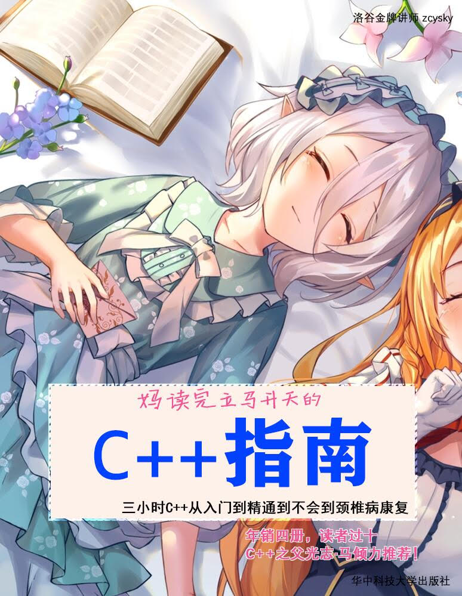

  
  
Martins3's Cabin 为仆则忠，为主则殆

  

    
    
  

My notes

[Polished Articles](http://music.163.com/#/m/song?id=556220425)
---
- [Jianshu](https://www.jianshu.com/u/1a078e249c88)
- [Github](https://github.com/Martins3)
