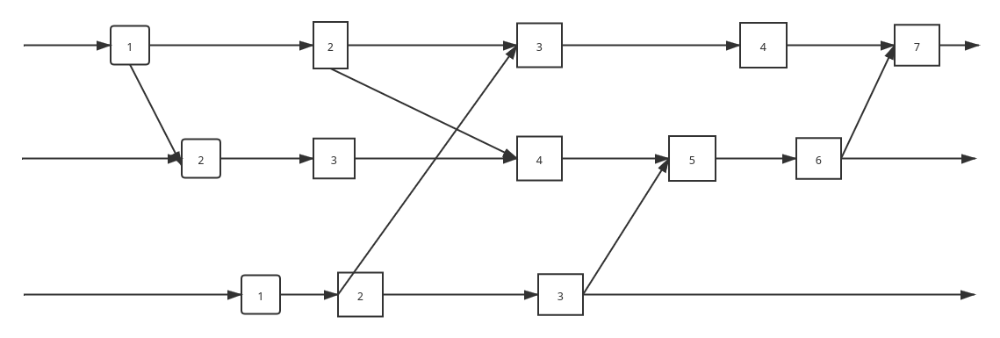

# 2019年秋季学期/并行和分布式计算 : 分布式计算的作业

说明：作业分成两类，每个人独立完成巩固类作业(占10分)，4-5人形成一个小组，完成上机类作业(占10分，同组人同分)。

## 巩固类作业/10分
1. 下图中，直线上小黑点给出了时钟计数，请分别用Lamport 逻辑时钟和向量时钟给图上的事件设置时间戳，并给出一致割集和非一致割集的例子。





2. 考虑在异步分布式系统中使用的两个通信服务。在服务A中，消息可能丢失、被复制或延迟，校验和仅应用到消息头。在服务B中，消息可能丢失、延迟或发送地太快以致接收方无法处理它，但到达目的地的消息其内容一定正确。描述每个服务会有的故障类型。根据对有效性和完整性的影响将故障分类。服务B能被描述成一个可靠的通信服务吗？
    - 服务A : 拜占庭
    - 服务B : 通道遗漏
    - 服务A : 不具有有效性和完整性
    - 服务B : 具有有效性和完整性
    - 服务B 可以被描述为可靠的通信服务。


3. 请证明Lamport的互斥算法满足ME1、ME2和ME3。其中，ME1指在临界区一次最多有一个进程可以执行，ME2指进入和离开临界区的请求最终成功执行，ME3（→顺序）指如果一个进入临界区的请求发生在先，那么进入临界区任按此顺序。
    - ME1 : 因为所有的进程的消息队列都是按照相同的方法排序，不可能出现不同的进程的request同时出现在队列的头上。
    - ME2 : 当一个进程发起request的时候，总是可以接收其他进程的reply. 当一个进程释放锁的时候，总是可以将其在其他进程中间的request取消掉，这些保证任何进程最终都是可以进入到 critical section的。
    - ME3 : 请求顺序。因为使用的是一个队列，保证了其顺序性质。

4. 请证明Ricart-Agrawala的互斥算法满足ME2和ME3。
    - ME2 : 进入死锁，除非两个线程同时含有进入defer reply 的状态，并且不会释放。但是由于在CS的中间离开CS之后会发送所有的 deferred reply, 同时不同继承的优先级不同，只有高优先级才可以 deferr reply。所以不会死锁和活锁。
    - ME3 : 线程A请求之后，对于任意之后发送请求的线程B，其发送给Ａ的请求一定等到A离开CS之后，发送reply给B，其才可能进入CS.

5. 在Ricart-Agrawala的互斥算法中，原始假定系统的进程是不出故障的。请修改算法增加处理一个进程崩溃的情况。

    - 在原来的算法中间，一个线程用于阻止另一个线程进入CS的方法是推迟恢复，为了处理故障，可以总是回复一条消息，表示允许和不允许，当进程收到的消息不允许其效果之前的未收到回复效果相同，但是当其没有收到任何消息，那么认为发送请求的节点已经出现故障。　　　　　　　　　　　　　　　　　　　　　　　　　

6. 改进基于环的互斥算法使得它能检测权标的丢失并重新生成权标。

    - 解决的方法，任何节点接收到权标的时候，都需要向发送方恢复消息，表示自己确实接受到了，
所以dead线程就会被发现。此时，只需将dead线程清理掉，并且将权标传递给下一个dead线程的下一个线程。

7. 基于环的选举算法是建立在单向环的假设之上的，为了获得更快的选举速度，现采用双向环结构，即每个节点可以同时向顺时针和逆时针两个方向发送选举消息，请列出新算法的高层描述，并用一个四节点的双向环来说明你的方法。

    - 最开始，将所有的进程标为非参与者，任何线程可以开始进行一次选举
        1. 将自己的标记为参与者。
        2. 初始化选举消息为自己的标识符。
        3. 向顺时针和逆时针开始发送到其邻居。

    消息传递的思路为: 当该节点可以提供更加有效的消息，那么该节点就可以传播消息。重复的消息不会传播。

    - 任何节点接收到消息:
        1. 选举消息的标志符更大，维持传递方向不变，并且记录并且传播传递消息。
        2. 选举消息的标志符更小，那么将消息设置自己标识符，为向两个方向传播消息。
        3. 只要接收到消息，那么将自己设置为参与者。

    当一个节点从左右两侧都收到了同一个标识符，那么将标识符对应进程设置为协调者，消息同时从两个方向传递。

    - 例子:
    ```
    +-------------------------------+
    |                               |
    |   +-----+         +-----+     |
    |   |  1  +---------+  2  |     |
    |   +-+---+         +--+--+     |
    |     |                |        |
    |   +-+---+         +--+--+     |
    |   |  3  +---------+  4  |     |
    |   +-----+         +-----+     |
    +-------------------------------+
    ```
    如上图所示，首先，2 3 同时发起，那么1 接受到消息之后，继续传递消息，但是到达23之后，其消息不在发送。
    4 接受到消息之后，向两侧发送选举消息为4，2 3 接受之后，然后维持消息的传递。
    1 从两个方向接收到4，确定4就是新的协调者，从两个方向广播消息。

8. 节点之间按照生成树方式连接，仅有边相连的节点能通信，请基于此网络拓扑，设计一个选举算法，给出其伪码。当仅有一个进程发起选举，你的选举算法所需的消息量是多少？

```c
select node:
  set the node as active // 随机出现的发起选举者

if node x is set as active :
  // 通知其邻居，如果邻居没有参与标识符较小
  for y in neighbors:
    if y's identifier is smaller:
      set y as active
      set y not finished
      change y's identifer as x's
      add y to x's outflow
    if y is not active:
      set y as active
      set y not finished
      add y to x's outflow
  if x's outflow are finished:
    set x status finished // 如果周边的节点全部finished，那么 finished
    if x's neighbors equals with outflow // 具有最大标识符的节点，所有的neighbor 都是outflow
```

   - 消息量大小，找到最大标识符的节点需要`e*n`个消息，因为可能存在多个节点并发的发送消息。
    最大标识符的节点通知全体需要e 个消息。消息汇集到最大标识符的需要e个消息。 通知全体需要e个消息。
    所以一共，使用`(n + 3) * e`. 其中e 为边的数目，n 为节点数目。


9. 一个服务器管理对象a1, a2, ... an ，它为客户提供下面两种操作：read (i)返回对象ai的值。write(i, Value)将对象ai设置为值Value。
事务T和U定义如下：
```
T: x = read(j); y = read (i); write(j, 44); write(i, 33)
U: x = read(k); write(i, 55); y = read (j); write(k, 66)
```
请给出事务T和U的3个串行化等价的交错执行。

- 将U的第一次读操作的位置和T前面两次读操作分别交替执行。结果如下
```
T: x = read(j);
T: y = read (i);
U: x = read(k);
T: write(j, 44);
T: write(i, 33)
U: write(i, 55);
U: y = read (j);
U: write(k, 66)
```

```
T: x = read(j);
U: x = read(k);
T: y = read (i);
T: write(j, 44);
T: write(i, 33)
U: write(i, 55);
U: y = read (j);
U: write(k, 66)
```

```
U: x = read(k);
T: x = read(j);
T: y = read (i);
T: write(j, 44);
T: write(i, 33)
U: write(i, 55);
U: y = read (j);
U: write(k, 66)
```

10. 考虑将乐观并发控制应用于下列事务T和U的情况：
```
	T: x = read(i); write(j, 44);
	U: write(i, 55); write(j, 66);
```
如果事务T和U同时处于活动状态，试描述以下几种情况的结果如何：
1. 服务器首先处理T的提交请求，使用向后验证方式。
2. 服务器首先处理U的提交请求，使用向后验证方式。
3. 服务器首先处理T的提交请求，使用向前验证方式。
4. 服务器首先处理U的提交请求，使用向前验证方式。
对于上面的每种情况，描述事务T和U的操作顺序，注意写操作在验证通过之后才真正起作用。

- 由于采用向后验证，同时发生的读写操作，总是可以保证写操作首先完成，对于相同位置的写操作，首先提交T.
```
U: write(i, 55);
T: x = read(i);
T : write(j, 44);
U: write(j, 66);
```
- 首先进行U的写提交。
```
U: write(i, 55);
T: x = read(i);
U: write(j, 66);
T : write(j, 44);
```
- 向前验证，首先进行T的读操作。
```
T: x = read(i);
U: write(i, 55);
T : write(j, 44);
U: write(j, 66);
```
- 
```
T: x = read(i);
U: write(i, 55);
T : write(j, 44);
U: write(j, 66);
```
