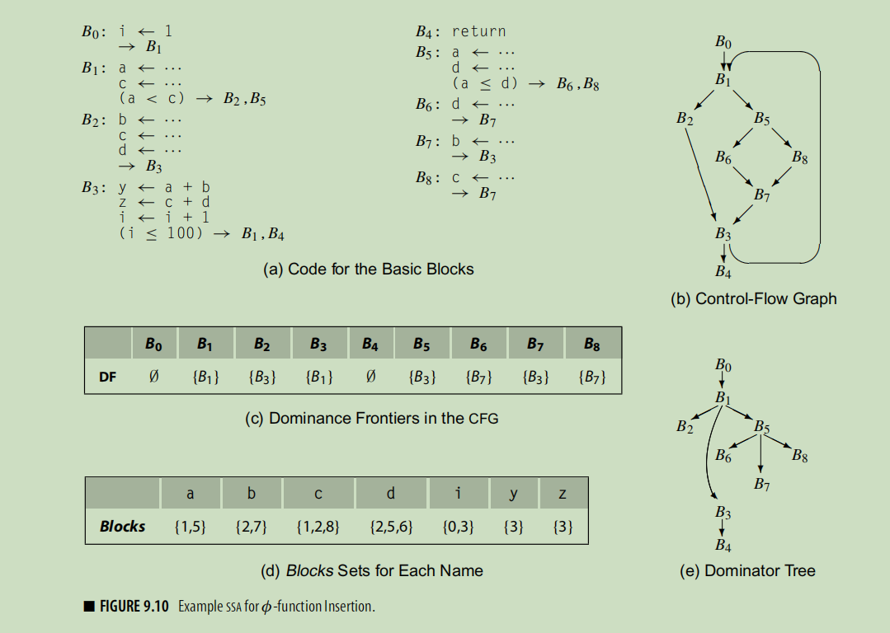
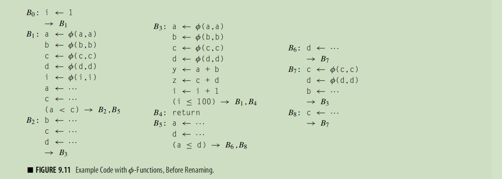
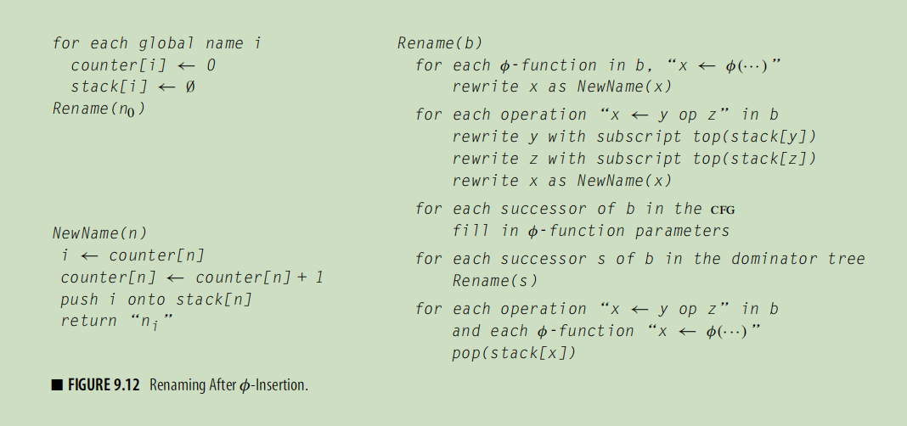
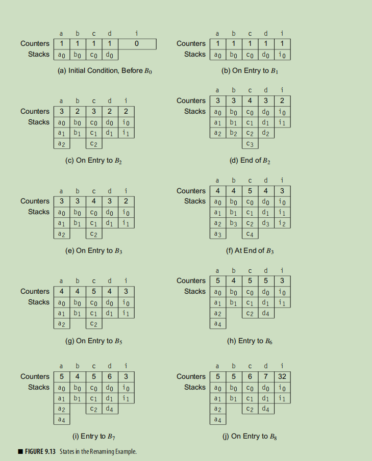
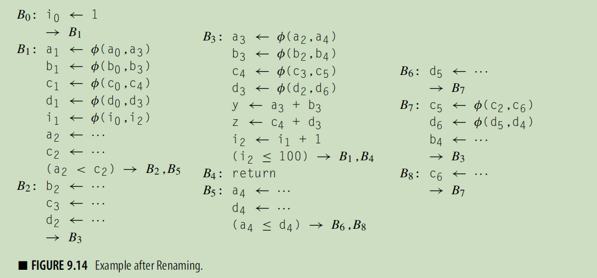

# Engineering a Compiler : Data-flow analysis
Data-flow analysis is the classic technique for compile-time program analysis.
> @todo 其他的技术还有 ?

This chapter explores iterative data-flow analysis, which uses a simple **fixed point** algorithm. From the basics of data-flow analysis, it builds up the
construction of static single-assignment (ssa) form, illustrates the use of ssa
form, and introduces interprocedural analysis.

## 9.1 INTRODUCTION
> skip

## 9.2 ITERATIVE DATA-FLOW ANALYSIS
*We will focus on one specific solution technique: an iterative fixed-point algorithm. It
has the twin advantages of simplicity and robustness.*

*As an initial example, we will examine the computation of dominance information. When we need
a more complex example, we will return to consideration of LiveOut sets*


#### 9.2.1 Dominance
> skip 求解 dominance 的问题

#### 9.2.2 Live-Variable Analysis
In Section 8.6.1, we used the results of **live analysis** to identify uninitialized
variables. Compilers use live information for many other purposes, such
as register allocation and construction of some variants of ssa form.
> live analysis 是啥 ? 为什么还可以 register allocation 和 construction ssa form

> @todo 除非回到 8.6.1 否则看不懂UEVar LiveOut 之类的东西

#### 9.2.3 Limitations on Data-Flow Analysis
> skip

#### 9.2.4 Other Data-Flow Problems
> skip

## 9.3 STATIC SINGLE-ASSIGNMENT FORM
One strategy for implementing such a “universal” analysis involves building
a variant form of the program that encodes both data flow and control flow
directly in the ir. ssa form, introduced in Sections 5.4.2 and 8.5.1, has this
property.

From a single implementation that translates the code into ssa form, a compiler can
perform many of the classic scalar optimizations.

#### 9.3.1 A Simple Method for Building SSA Form
This algorithm constructs a correct ssa form for the program.
Each variable is defined exactly once, and each reference uses the name of a distinct definition.
> ssa 的保证，不要出现重新定义，现在只要出现joint节点就搞一个phi，相当于解决掉了多个pred，
> 变成了仅仅在一个block 中间分析

in particular, the compiler must analyze the
code to determine where potentially distinct values converge in the cfg.

#### 9.3.2 Dominance Frontiers
To solve this problem efficiently and effectively, the compiler can turn the question
around. It can determine, for each block i, the set of blocks that will need a
$\phi$-function for any definition in block i. Dominance plays a critical role in this computation.
> 是不是说，在i处定义的内容，需要在其 dom frontier 的位置进行处理 ?

A definition in node n forces a φ-function at join points that lie just outside the region of the cfg that n dominates.
> 当离开n的控制区域之后，那么，立刻需要使用phi函数。

Informally, `df(n)` contains the first nodes reachable from n that n does not dominate, on each cfg path leaving n.
> 可以控制其pred，但是其，那么在该位置就是需要形成phi的。失去控制的时候就是需要形成phi，why ?
> 其实还是需要考虑具体的定义的吧?

> pred 的含义，刚刚到达此处
> wiki 上的定义非常智障，如果 immediate dominate ，那么a dominate b , b dominate c 难道 a 不会 dominate c 吗 ?

Given a node n in a flow graph,
the set of nodes that strictly dominate n is given by (Dom(n) − n). The node
in that set that is closest to n is called n’s immediate dominator, denoted
`IDom(n)`. The entry node of the flow graph has no immediate dominator.

> 后面的算法还是用上这些IDom


> 利用好三条观察，那么算法很容易理解
> @todo 算法正确性证明

#### 9.3.3 Placing φ-Functions
The naive algorithm placed a φ-function for every variable at the start of
every join node. With dominance frontiers, the compiler can determine more
precisely where `φ`-functions might be needed.

The basic idea is simple.a
A definition of x in block b forces a φ-function at every node in df(b). *Since
that φ-function is a new definition of x, it may, in turn, force the insertion of
additional φ-functions.*
> 如果说另一个入口没有x的定义，那么怎么办
> phi是definition，继续添加，有毛病啊!

To apply this observation, the compiler can compute the set of names that
are live across multiple blocks—a set that we will call the `global names`.

The compiler can find the global names cheaply. In each block, it looks for
names with *upward-exposed* uses—the **UEVar** set from the live-variables
calculation. Any name that appears in one or more **LiveOut** sets must be in
the UEVar set of some block. Taking the union of all the UEVar sets gives
the compiler the set of names that are live on entry to one or more blocks
and, hence, live in multiple blocks

> 被使用过加入到 Global 中间，所有被 redefine 过的变量，
> 那么添加一个 Blocks 表示 redefine 过其的 block 的位置。

For each global name x,
it initializes `WorkList` with `Blocks(x)`. For each block b on j
the WorkList, it inserts φ-functions at the head of every block d in b’s dominance frontier.

```c
for each name x ∈ Globals
// blocks 就是所有的definition
WorkList ← Blocks(x)
  for each block b ∈ WorkList
    for each block d in df(b)
    // 如果重新定义了变量x，那么所有的位置都是需要添加变量x
    if d has no φ-function for x then
      // 不管别人会不会到达，总之就是插入.
      insert a φ-function for x in d
      WorkList ← WorkList ∪ {d}
```
> skip the example

#### 9.3.4 Renaming
In the description of *maximal ssa form*, we stated that renaming variables was conceptually straightforward.
The details, however, require some explanation.
> maximal ssa form : 将所有的joint 位置对于所有的 variable (当前节点use或者define过) 插入 function，插入的操作，simultaneously

The algorithm, shown in Figure 9.12, renames both definitions and uses in
a preorder walk over the procedure’s dominator tree. 
- In each block, it first
renames the values defined by φ-functions at the head of the block, 
- then it visits each operation in the block, in order. It rewrites the operands with current ssa names, then it creates a new ssa name for the result of the operation.

*This latter act makes the new name current*. After all the operations in the
block have been rewritten, the algorithm rewrites the appropriate φ-function
parameters in each cfg successor of the block, *using the current ssa names.*
Finally, it *recurs* on any children of the block in the dominator tree. When it
returns from those recursive calls, it restores the set of current ssa names to
the state that existed before the current block was visited.

To manage this process, the algorithm uses a *counter* and a *stack* for each
global name.
A global name’s stack holds the subscript of the name’s current
ssa name. **At each definition, the algorithm generates a new subscript for the
targeted name by pushing the value of its current counter onto the stack and
incrementing the counter.**(NewName的操作，包括phi 和 normal definition)
*Thus, the value on top of the stack for n is always
the subscript of n’s current ssa name.*
As the final step in processing a block,
the algorithm pops all the names generated in that block off their respective
stacks to *restore* the names that held at the end of that block’s immediate
dominator. Those names may be needed to process the block’s remaining siblings in the dominator tree.
> 1. pop 操作 : dominator tree 的含义，为什么是tree ? (如果存在join 操作，那么join点应该直接指向，如果存在环，如果存在一个假设，总是强行制造一个entry 节点，那么环的回来边并不能形成dominance，所以还是tree)
> 2. 

The stack and the counter serve distinct and separate purposes.
As control in the algorithm moves up and down the dominator tree,
the stack is managed to *simulate the lifetime of the most recent definition in the current block.*
The counter, on the other hand, *grows monotonically to ensure that each
successive definition receives a unique ssa name*

> 1. 只要是 redefine，那么使用 NewName，无论是 phi 还是普通的函数。
> 2. use : 利用stack 的信息重命名，那么，
> 3. 使用 dominator tree　进行递归，why ? (首先可以保证，所有block都是可以访问到。因为利用dominator frontier 建立了 phi，df 的建立就是利用 dominance tree 建立的，)
>     1. 某些数值重新利用 ? ssa 的定义是啥 ?
> 6. phi 添加过剩了，可以出现计算完成phi, 然后马上被重新赋值的情况吗? (对于Global的所有的成员分析，只要在某一个block定义过，那么其 dominance frontier 中间就必定存在，根本不在乎以后是否使用以及redefine 的问题。)
> 7. 如果计数器总是增加的，那么要stack 干什么 ? (计数器保证ssa的要求的任何变量仅仅进行一次赋值，而stack的作用是rewrite usage 的时候，)

One final detail remains. At the end of block b, *Rename* must rewrite
φ-function parameters in each of b’s cfg *successors.*
The compiler must *assign an ordinal parameter* slot in those φ-functions for b.
When we draw the ssa form, we always assume a left-to-right order that
matches the left-to-right order in which the edges are drawn. Internally, the compiler can
number the edges and parameter slots in any consistent fashion that
produces the desired result. This requires cooperation between the code that
builds the ssa form and the code that builds the cfg. (For example, if the
cfg implementation uses a list of edges leaving each block, the order of that
list can determine the mapping.)
> ????







#### 9.3.5 Translation Out of SSA Form
> 分析了，将 SSA 转化为正常模式
> @todo 好不容易，转化为ssa !

* ***The Lost-Copy Problem***

* ***The Swap Problem***

#### 9.3.6 Using SSA Form
> 所以，为什么SSA 和 semilattice 有关 ?

To see how analysis over ssa form differs
from the classical data-flow analysis techniques presented in Section 9.2,
consider performing global constant propagation on ssa form, using an
algorithm called **sparse simple constant propagation (sscp)**

*Compilers use semilattices to model the data domains of analysis problems.*

In the `sscp` algorithm, the compiler annotates each ssa name with a value.
The set of possible values forms a `semilattice`. A semilattice consists of a set
L of values and a meet operator, ∧. The meet operator must be idempotent,
commutative, and associative; it imposes an order on the elements of L as
follows:

In sscp, the algorithm initializes the value associated with each ssa name to
`T`, which indicates that the algorithm has no knowledge of the ssa name’s
value.
> top 和 bottom 到底表示什么东西 ?

For a `φ`-function, the result is simply the meet of the lattice values of all the
`φ`-function’s arguments;
> phi 的结果是 : 其可能结果的meet，meet 操作，认为Top 为全集，Bottom 为空集

Interpreting an operation over lattice values requires some care. For a
φ-function, the result is simply the meet of the lattice values of all the
φ-function’s arguments; the rules for meet are shown in the margin, in
order of precedence. For other kinds of operations, the compiler must apply
operator-specific knowledge. *If any operand has the lattice value T, 
the evaluation returns T*. If none of the operands has the value >, the model should
produce an appropriate value.
> 这一个论断显然是和右侧边缘的中间内容不一致的

* ***Complexity***

The propagation phase of sscp is a classic *fixed-point scheme*.
> ???

The propagation
phase can only lower its value. For a given ssa name, this can happen at most
twice—from T to ci to ⊥


* ***Optimism: The Role of Top***

1. 分析了 pessimistic algorithm，　optimistic algorithm 和初始化为 `Top` 和 `Bottom` 的关系。

* ***The Value of SSA Form***

> 描述了一下 ssa 的好处，没看懂

> 后面 section review 和 review question skip

