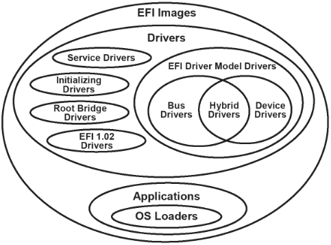
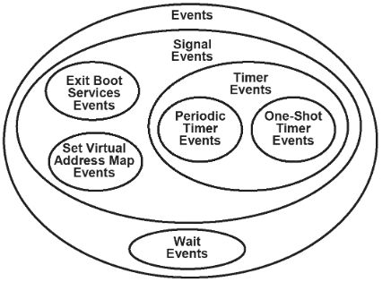

# UEFI 入门

经过 [Linux UEFI 学习环境搭建](./uefi-linux.md) 想必对于 UEFI 存在一些感性的认识，现在来基于 edk2 介绍一些 UEFI 入门级的核心概念。

主要参考 [Beyond BIOS: Developing with the Unified Extensible Firmware Interface, Third Edition](https://www.amazon.com/Beyond-BIOS-Developing-Extensible-Interface/dp/1501514784)
同时 [官方文档](https://edk2-docs.gitbook.io/edk-ii-uefi-driver-writer-s-guide) 也是重要参考。

[uefi.org specifications]( https://uefi.org/specifications) 就太专业了，大多数时候是用不着的。

## 和用户态编程的根本性区别
使用上 StdLib 之后，很多编程几乎看似和用户态已无区别，比如一个 HelloWorld.c 可以直接编译为 .efi 并且在 UefiShell 中运行。
但是仔细观察，我们会发现诸多和用户态编程的根本性区别。

**没有虚拟进程地址空间**

在用户态的程序在 gdb 中 backtrace[^1] 的时候，backtrace 最远的位置就是程序开始的位置 `_start`
```c
/*
#1  0x000000000040113b in main (argc=1, argv=0x7fffffffd638) at a.c:4
#2  0x00007ffff7db40b3 in __libc_start_main (main=0x401120 <main>, argc=1, argv=0x7fffffffd638, init=<optimized out>, fini=<optimized out>, rtld_fini=<optimized out>,
stack_end=0x7fffffffd628) at ../csu/libc-start.c:308
#3  0x000000000040104e in _start ()
```

但是在 edk2 中 backtrace 可以看到 Dxe 的整个执行流程，从下面的 backtrace 中可以清晰的看到从 Boot Manager 加载 Shell，然后 Shell 去加载 Main.efi 的过程，
他们使用的 stack 在同一个地址空间中。
```c
/*
-  #0  malloc (Size=Size@entry=7900) at /home/maritns3/core/ld/edk2-workstation/edk2/StdLib/LibC/StdLib/Malloc.c:85
-   #1  0x000000007e5cc40c in tzsetwall () at /home/maritns3/core/ld/edk2-workstation/edk2/StdLib/LibC/Time/ZoneProc.c:778
-   #2  tzset () at /home/maritns3/core/ld/edk2-workstation/edk2/StdLib/LibC/Time/ZoneProc.c:796
-   #3  0x000000007e5cccc1 in mktime (timeptr=0x7e63bba4) at /home/maritns3/core/ld/edk2-workstation/edk2/StdLib/LibC/Time/Time.c:520
-   #4  time (timer=0x0) at /home/maritns3/core/ld/edk2-workstation/edk2/StdLib/LibC/Time/Time.c:558
-   #5  0x000000007e5cd20a in ShellAppMain (Argc=1, Argv=0x7e64ec98) at /home/maritns3/core/ld/edk2-workstation/edk2/StdLib/LibC/Main/Main.c:153
-   #6  0x000000007e5ce956 in ShellCEntryLib (SystemTable=0x7f9ee018, ImageHandle=0x7e64d298) at /home/maritns3/core/ld/edk2-workstation/edk2/ShellPkg/Library/UefiShellCEn
-   tryLib/UefiShellCEntryLib.c:84
-   #7  ProcessModuleEntryPointList (SystemTable=0x7f9ee018, ImageHandle=0x7e64d298) at /home/maritns3/core/ld/edk2-workstation/edk2/Build/AppPkg/DEBUG_GCC5/X64/AppPkg/App
-   lications/Main/Main/DEBUG/AutoGen.c:375
-   #8  _ModuleEntryPoint (ImageHandle=0x7e64d298, SystemTable=0x7f9ee018) at /home/maritns3/core/ld/edk2-workstation/edk2/MdePkg/Library/UefiApplicationEntryPoint/Applica
-  tionEntryPoint.c:59
>   #9  0x000000007feba8f7 in CoreStartImage (ImageHandle=0x7e64d298, ExitDataSize=0x0, ExitData=0x0) at /home/maritns3/core/ld/edk2-workstation/edk2/MdeModulePkg/Core/Dxe
>   /Image/Image.c:1654
>   #10 0x000000007e5248b7 in InternalShellExecuteDevicePath (ParentImageHandle=0x7e5a4ad8, DevicePath=DevicePath@entry=0x7e64d698, CommandLine=CommandLine@entry=0x7e65029
>   8, Environment=Environment@entry=0x0, StartImageStatus=StartImageStatus@entry=0x7fe9e838) at /home/maritns3/core/ld/edk2-workstation/edk2/ShellPkg/Application/Shell/Sh
>   ellProtocol.c:1540
>   #11 0x000000007e527ab4 in RunCommandOrFile (CommandStatus=0x0, ParamProtocol=0x7e682f98, FirstParameter=0x7e678c98, CmdLine=0x7e650298, Type=Efi_Application) at /home/
>   maritns3/core/ld/edk2-workstation/edk2/ShellPkg/Application/Shell/Shell.c:2505
>   #12 SetupAndRunCommandOrFile (CommandStatus=0x0, ParamProtocol=0x7e682f98, FirstParameter=0x7e678c98, CmdLine=<optimized out>, Type=Efi_Application) at /home/maritns3/
>   core/ld/edk2-workstation/edk2/ShellPkg/Application/Shell/Shell.c:2589
>   #13 RunShellCommand (CommandStatus=0x0, CmdLine=0x7e650298) at /home/maritns3/core/ld/edk2-workstation/edk2/ShellPkg/Application/Shell/Shell.c:2713
>   #14 RunShellCommand (CmdLine=CmdLine@entry=0x7e64f018, CommandStatus=0x0, CommandStatus@entry=0x7e5419ac) at /home/maritns3/core/ld/edk2-workstation/edk2/ShellPkg/Appl
>   ication/Shell/Shell.c:2625
>   #15 0x000000007e52b370 in RunCommand (CmdLine=0x7e64f018) at /home/maritns3/core/ld/edk2-workstation/edk2/ShellPkg/Application/Shell/Shell.c:2765
>   #16 DoShellPrompt () at /home/maritns3/core/ld/edk2-workstation/edk2/ShellPkg/Application/Shell/Shell.c:1358
>   #17 UefiMain (ImageHandle=<optimized out>, SystemTable=<optimized out>) at /home/maritns3/core/ld/edk2-workstation/edk2/ShellPkg/Application/Shell/Shell.c:621
>   #18 0x000000007e50f52d in ProcessModuleEntryPointList (SystemTable=0x7f9ee018, ImageHandle=0x7ec55f98) at /home/maritns3/core/ld/edk2-workstation/edk2/Build/OvmfX64/DE
>   BUG_GCC5/X64/ShellPkg/Application/Shell/Shell/DEBUG/AutoGen.c:1013
>   #19 _ModuleEntryPoint (ImageHandle=0x7ec55f98, SystemTable=0x7f9ee018) at /home/maritns3/core/ld/edk2-workstation/edk2/MdePkg/Library/UefiApplicationEntryPoint/Applica
*   tionEntryPoint.c:59
*   #20 0x000000007feba8f7 in CoreStartImage (ImageHandle=0x7ec55f98, ExitDataSize=0x7ec75470, ExitData=0x7ec75468) at /home/maritns3/core/ld/edk2-workstation/edk2/MdeModu
*   lePkg/Core/Dxe/Image/Image.c:1654
*   #21 0x000000007f05c5e2 in EfiBootManagerBoot (BootOption=BootOption@entry=0x7ec75420) at /home/maritns3/core/ld/edk2-workstation/edk2/MdeModulePkg/Library/UefiBootMana
*   gerLib/BmBoot.c:1982
*   #22 0x000000007f05fca2 in BootBootOptions (BootManagerMenu=0x7fe9ecd8, BootOptionCount=4, BootOptions=0x7ec75318) at /home/maritns3/core/ld/edk2-workstation/edk2/MdeMo
*   dulePkg/Universal/BdsDxe/BdsEntry.c:409
*   #23 BdsEntry (This=<optimized out>) at /home/maritns3/core/ld/edk2-workstation/edk2/MdeModulePkg/Universal/BdsDxe/BdsEntry.c:1072
*   #24 0x000000007feaabf8 in DxeMain (HobStart=<optimized out>) at /home/maritns3/core/ld/edk2-workstation/edk2/MdeModulePkg/Core/Dxe/DxeMain/DxeMain.c:553
*   #25 0x000000007feaac9d in ProcessModuleEntryPointList (HobStart=<optimized out>) at /home/maritns3/core/ld/edk2-workstation/edk2/Build/OvmfX64/DEBUG_GCC5/X64/MdeModule
*   Pkg/Core/Dxe/DxeMain/DEBUG/AutoGen.c:489
*   #26 _ModuleEntryPoint (HobStart=<optimized out>) at /home/maritns3/core/ld/edk2-workstation/edk2/MdePkg/Library/DxeCoreEntryPoint/DxeCoreEntryPoint.c:48
*   #27 0x000000007fee10cf in InternalSwitchStack ()
*   #28 0x0000000000000000 in ?? ()
```
如果你理解了 backtrace 实现的原理，上面的 backtrace 说明在 DXE 阶段，执行的程序:

**始终使用的是通一个 stack**

**没有 parallel 和 context switch**

在 edk2 中，程序就是一个接着一个执行的，即使运行的平台含有多个 core, 但是只会使用其中一个运行。
为了减少程序的复杂性，也不存在 context switch 的操作。

**只有一个 interrupt : timer interrupt**

一般来说，用户态程序是无需考虑中断的，因为中断相关的事情都被 os 处理掉了。
在 Linux 中，设备主要是通过中断来通知 CPU，而在 edk2 中，设备不能给 CPU 发射中断，需要靠 CPU 主动来 poll 设备。
## UEFI 的基本启动过程


主要是:
- pre-EFI initialization (PEI)
- Driver Execution Environment (DXE)
- Boot Device Selection (BDS)

## UEFI System Table
UEFI Boot Services
UEFI Runtime Services
Protocol services

## Handle 和 Protocol


- The handle database is composed of objects called handles and protocols.
- Handles are a collection of one or more protocols
- Protocols are data structures named by a GUID.

- [ ] 让我们来找到这些 database 的内容吧!

## Image


The driver entry point is the function called when a UEFI driver is started with the `StartImage()` service.
At this point the driver has already been loaded into memory with the `LoadImage()` service.

The image handle of the UEFI driver and a pointer to the UEFI system table are passed into every UEFI driver.
The image handle allows the UEFI driver to discover information about itself,
and the pointer to the UEFI system table allows the UEFI driver to make UEFI Boot Service and UEFI Runtime Service calls.

## Event


| **Type of events**            | **Description**                                                                                                                                                                                                                                                                                                                                                                                                                                                                                                                                                                                                                                                                                                                                                                                                                                                                                                                                        |
| ----------------------------- | ----------------------------------------------------------------------------------------------------                                                                                                                                                                                                                                                                                                                                                                                                                                                                                                                                                                                                                                                                                                                                                                                                                                                   |
| Wait event                    | An event whose notification function is executed whenever the event is checked or waited upon.                                                                                                                                                                                                                                                                                                                                                                                                                                                                                                                                                                                                                                                                                                                                                                                                                                                         |
| Signal event                  | An event whose notification function is scheduled for execution whenever the event goes from the waiting state to the signaled state.                                                                                                                                                                                                                                                                                                                                                                                                                                                                                                                                                                                                                                                                                                                                                                                                                  |
| Timer event                   | A type of signal event that is moved from the waiting state to the signaled state when at least a specified amount of time has elapsed. Both periodic and one-shot timers are supported. The event's notification function is scheduled for execution when a specific amount of time has elapsed.                                                                                                                                                                                                                                                                                                                                                                                                                                                                                                                                                                                                                                                      |
| Periodic timer event          | A type of timer event that is moved from the waiting state to the signaled state at a specified frequency. The event's notification function is scheduled for execution when a specific amount of time has elapsed.                                                                                                                                                                                                                                                                                                                                                                                                                                                                                                                                                                                                                                                                                                                                    |
| One-shot timer event          | A type of timer event that is moved from the waiting state to the signaled state after the specified time period has elapsed. The event's notification function is scheduled for execution when a specific amount of time has elapsed. The following three elements are associated with every event: * The task priority level (TPL) of the event * A notification function * A notification context The notification function for a wait event is executed when the state of the event is checked or when the event is being waited upon. The notification function of a signal event is executed whenever the event transitions from the waiting state to the signaled state. The notification context is passed into the notification function each time the notification function is executed. The TPL is the priority at which the notification function is executed. The four TPL levels that are defined in UEFI are listed in the table below. |
| Exit Boot Services event      | A special type of signal event that is moved from the waiting state to the signaled state when the EFI Boot Service `ExitBootServices()` is called. This call is the point in time when ownership of the platform is transferred from the firmware to an operating system. The event's notification function is scheduled for execution when `ExitBootServices()` is called.                                                                                                                                                                                                                                                                                                                                                                                                                                                                                                                                                                           |
| Set Virtual Address Map event | A special type of signal event that is moved from the waiting state to the signaled state when the UEFI runtime service `SetVirtualAddressMap()` is called. This call is the point in time when the operating system is making a request for the runtime components of UEFI to be converted from a physical addressing mode to a virtual addressing mode. The operating system provides the map of virtual addresses to use. The event's notification function is scheduled for execution when `SetVirtualAddressMap()` is called.                                                                                                                                                                                                                                                                                                                                                                                                                     |


| Task Priority Level | Description                                                                               |
|---------------------|-------------------------------------------------------------------------------------------|
| TPL_APPLICATION     | The priority level at which UEFI images are executed.                                     |
| TPL_CALLBACK        | The priority level for most notification functions.                                       |
| TPL_NOTIFY          | The priority level at which most I/O operations are performed.                            |
| TPL_HIGH_LEVEL      | The priority level for the one timer interrupt supported in UEFI. (Not usable by drivers) |

The type of event determines when an event's notification function is invoked.
The notification function for signal type events is invoked when an event is placed into the signaled state with a call to `SignalEvent()`.
The notification function for wait type events is invoked when the event is passed to the `CheckEvent()` or `WaitForEvent()` services.

## DXE

## UEFI Driver Model

### Driver Binding Protocol
UEFI drivers following the UEFI driver model are required to implement the Driver Binding Protocol. This requirement includes the following drivers:
- Device drivers
- Bus drivers
- Hybrid drivers

*Root bridge driver, service drivers, and initializing drivers* do not produce this protocol.


The EFI_DRIVER_BINDING_PROTOCOL is installed onto the driver's image handle.

It is possible for a driver to produce more than one instance of the Driver Binding Protocol. All additional instances of the Driver Binding Protocol must be installed onto new handles.

The Driver Binding Protocol can be installed directly using the UEFI Boot Service `InstallMultipleProtocolInterfaces()`.


主要参考
- [Driver Binding Protocol](https://edk2-docs.gitbook.io/edk-ii-uefi-driver-writer-s-guide/9_driver_binding_protocol)
- [PCI Driver Design Guidelines](https://edk2-docs.gitbook.io/edk-ii-uefi-driver-writer-s-guide/18_pci_driver_design_guidelines)

使用 pci 作为同一个例子:

> The PCI bus driver consumes the services of the `PCI_ROOT_BRIDGE_IO_PROTOCOL` and uses those services to enumerate the PCI controllers present in the system.
> In this example, the PCI bus driver detected a disk controller, a graphics controller, and a USB host controller.
> As a result, the PCI bus driver produces three child handles with the `EFI_DEVICE_PATH_PROTOCOL` and the `EFI_PCI_IO_PROTOCOL`.[^2]

分析对应的代码流程:

- PciBusDriverBindingStart
  - PciEnumerator : 扫描出来一个 root 下的所有的 device
    - PciHostBridgeEnumerator
      - InsertRootBridge
  - StartPciDevices :
    - StartPciDevicesOnBridge
      - RegisterPciDevice
        - // Install the pciio protocol, device path protocol
        - 处理 option rom 之类的操作

扫描过程中，对于创建出来的 pcidev, 为其创建 handle 并且注册上 `EFI_DEVICE_PATH_PROTOCOL` 和 `EFI_PCI_IO_PROTOCOL`
```c
  //
  // Install the pciio protocol, device path protocol
  //
  Status = gBS->InstallMultipleProtocolInterfaces (
                  &PciIoDevice->Handle,
                  &gEfiDevicePathProtocolGuid,
                  PciIoDevice->DevicePath,
                  &gEfiPciIoProtocolGuid,
                  &PciIoDevice->PciIo,
                  NULL
                  );
```

- [ ] 使用 NvmExpressDriverBindingStart 来分析将是一个绝佳的例子

## Device Path
主要参考:
- https://zhuanlan.zhihu.com/p/351065844
- https://zhuanlan.zhihu.com/p/351926214

每个 Physical Device 都会对应 1 个 Controller Handle，在该 Handle 下会安装其对应的 Device Path。

UEFI Bus Driver Connect 时为 Child Device Controller 产生 Device Path


- [ ] 分析一下 load image 的效果

At this time, applications developed with the EADK are intended to reside
on, and be loaded from, storage separate from the core firmware.  This is
primarily due to size and environmental requirements.

This release of the EADK should only be used to produce UEFI Applications.  Due to the execution
environment built by the StdLib component, execution as a UEFI driver can cause system stability
issues.

## CoreExitBootServices

- 释放内存 : CoreTerminateMemoryMap : 根据其注释，实际上，并不会清空 Memory 中的内容
- `gCpu->DisableInterrupt (gCpu);` : 关闭中断
- CoreNotifySignalList (&gEfiEventExitBootServicesGuid); 是通过 gEfiEventExitBootServicesGuid 来实现找到对应的 Event 的，主要的内容都各种设备的 reset 而已
- ZeroMem (gBS, sizeof (EFI_BOOT_SERVICES)); : EFI_BOOT_SERVICES 被清空之后，各种服务都将无法使用

对于 gEfiEventExitBootServicesGuid 搜索，发现 edk2 使用 Signal 机制主要都是用于实现设备的 reset 的。
```c
/*
ArmPkg/Drivers/MmCommunicationDxe/MmCommunication.c:259:  &gEfiEventExitBootServicesGuid,
OvmfPkg/Csm/BiosThunk/VideoDxe/BiosVideo.c:601:                    &gEfiEventExitBootServicesGuid,
NetworkPkg/SnpDxe/Snp.c:660:                    &gEfiEventExitBootServicesGuid,
NetworkPkg/IScsiDxe/IScsiMisc.c:1770:                  &gEfiEventExitBootServicesGuid,
StandaloneMmPkg/Core/StandaloneMmCore.c:90:  { MmExitBootServiceHandler,&gEfiEventExitBootServicesGuid,     NULL, FALSE },
StandaloneMmPkg/Core/StandaloneMmCore.c:160:               &gEfiEventExitBootServicesGuid,
SourceLevelDebugPkg/DebugAgentDxe/DebugAgentDxe.c:100:                  &gEfiEventExitBootServicesGuid,
IntelFsp2WrapperPkg/FspWrapperNotifyDxe/FspWrapperNotifyDxe.c:270:                  &gEfiEventExitBootServicesGuid,
MdeModulePkg/Library/RuntimeDxeReportStatusCodeLib/ReportStatusCodeLib.c:156:                  &gEfiEventExitBootServicesGuid,
MdeModulePkg/Universal/Variable/RuntimeDxe/VariableSmmRuntimeDxe.c:1825:         &gEfiEventExitBootServicesGuid,
MdeModulePkg/Universal/StatusCodeHandler/RuntimeDxe/SerialStatusCodeWorker.c:155:  // If register an unregister function of gEfiEventExitBootServicesGuid,
MdeModulePkg/Universal/Acpi/FirmwarePerformanceDataTableDxe/FirmwarePerformanceDxe.c:695:                  &gEfiEventExitBootServicesGuid,
MdeModulePkg/Core/PiSmmCore/PiSmmIpl.c:363:  { FALSE, FALSE, &gEfiEventExitBootServicesGuid,     SmmIplGuidedEventNotify,           &gEfiEventExitBootServicesGuid,     TPL_CALLBACK, NULL },
MdeModulePkg/Core/PiSmmCore/PiSmmCore.c:87:  { SmmExitBootServicesHandler, &gEfiEventExitBootServicesGuid,      NULL, FALSE },
MdeModulePkg/Core/PiSmmCore/PiSmmCore.c:189:    if (CompareGuid (mSmmCoreSmiHandlers[Index].HandlerType, &gEfiEventExitBootServicesGuid)) {
MdeModulePkg/Core/Dxe/DxeMain/DxeMain.c:774:  CoreNotifySignalList (&gEfiEventExitBootServicesGuid);
MdeModulePkg/Core/Dxe/Event/Event.c:417:    if (CompareGuid (EventGroup, &gEfiEventExitBootServicesGuid)) {
MdeModulePkg/Core/Dxe/Event/Event.c:427:      EventGroup = &gEfiEventExitBootServicesGuid;
MdeModulePkg/Bus/Pci/UhciDxe/Uhci.c:1759:                  &gEfiEventExitBootServicesGuid,
MdeModulePkg/Bus/Pci/XhciDxe/Xhci.c:2048:                  &gEfiEventExitBootServicesGuid,
MdeModulePkg/Bus/Pci/EhciDxe/Ehci.c:1914:                  &gEfiEventExitBootServicesGuid,
RedfishPkg/RedfishCredentialDxe/RedfishCredentialDxe.c:189:                  &gEfiEventExitBootServicesGuid,
RedfishPkg/RedfishConfigHandler/RedfishConfigHandlerCommon.c:149:                  &gEfiEventExitBootServicesGuid,
BaseTools/Scripts/SmiHandlerProfileSymbolGen.py:181:  '27ABF055-B1B8-4C26-8048-748F37BAA2DF':'gEfiEventExitBootServicesGuid',
MdePkg/Include/Guid/EventGroup.h:16:extern EFI_GUID gEfiEventExitBootServicesGuid;
MdePkg/MdePkg.dec:403:  gEfiEventExitBootServicesGuid  = { 0x27ABF055, 0xB1B8, 0x4C26, { 0x80, 0x48, 0x74, 0x8F, 0x37, 0xBA, 0xA2, 0xDF }}
SecurityPkg/Tcg/TcgDxe/TcgDxe.c:1436:                    &gEfiEventExitBootServicesGuid,
SecurityPkg/Tcg/Tcg2Dxe/Tcg2Dxe.c:2765:                    &gEfiEventExitBootServicesGuid,
```

## 资源
- https://github.com/Openwide-Ingenierie/uefi-musl
  - 使用 edk2 APIs 来实现 syscall 从而将 musl 库包含进去
- https://github.com/Openwide-Ingenierie/Pong-UEFI
  - 弹球游戏
- https://github.com/linuxboot/linuxboot
  - UEFI 的 DXE 截断可以使用 linuxboot 替代，因为其很多功能和内核是重叠的
- https://blog.system76.com/post/139138591598/howto-uefi-qemu-guest-on-ubuntu-xenial-host
  - 分析了一下使用 ovmf 的事情，但是没有仔细看

## 疑惑
- [ ] 所有的 UEFI 的书籍开始的时候都会讲解曾经痛苦的 bios 时代，说实话，我没有经历过，不是非常理解。

[^1]: https://sourceware.org/gdb/current/onlinedocs/gdb/Backtrace.html
[^2]: https://edk2-docs.gitbook.io/edk-ii-uefi-driver-writer-s-guide/3_foundation/readme.10/3102_bus_driver
[^3]: https://edk2-docs.gitbook.io/edk-ii-uefi-driver-writer-s-guide/3_foundation/34_handle_database
