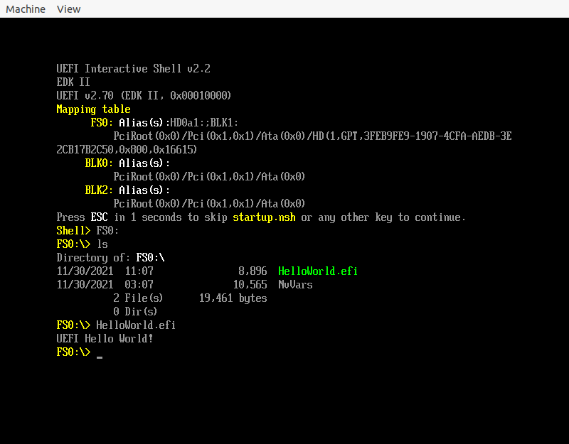

# Linux UEFI 学习环境搭建

## 运行第一个 UEFI 程序
### 编译 efi
参考教程 https://www.rodsbooks.com/efi-programming/hello.html
但是这个教程有点老，参考 [stackoverflow](https://stackoverflow.com/questions/31514866/how-to-compile-uefi-application-using-gnu-efi/31517520)
可以修复。

或者看[我写的](https://github.com/Martins3/Martins3.github.io/tree/master/docs/bmbt/uefi/uefi.sh)，将其中的 main.c 和 Makefile 拷贝出来，make 就可以得到 hello.efi 了

### 运行 efi
参考 [osdev](https://wiki.osdev.org/UEFI#Linux.2C_root_not_required) 上，我构建出来了一个
[小脚本](https://github.com/Martins3/Martins3.github.io/tree/master/docs/bmbt/uefi/uefi.sh)，其参数为将要测试的 efi.
然后在 QEMU 的图形界面中，可以看到 UEFI shell, 在其中输入 FS0:，最后执行程序。

## 编译 edk2
参考[官方文档](https://github.com/tianocore/tianocore.github.io/wiki/Using-EDK-II-with-Native-GCC)

```bash
git clone https://github.com/tianocore/edk2.git
cd edk2
make -C BaseTools
source edksetup.sh # 几乎所有的教程都是 . edksetup.sh，但是 source edksetup.sh 也可以
```
然后修改 Conf/target.txt 中修改
```txt
ACTIVE_PLATFORM       = MdeModulePkg/MdeModulePkg.dsc
TARGET_ARCH           = X64 # 因为上面的 QEMU
MAX_CONCURRENT_THREAD_NUMBER = 9 # 这个取决于你的机器 CPU 核心数量
```

关于编译器，官方文档反复强调是 gcc5，但是参考 [stackoverflow](https://stackoverflow.com/questions/63725239/build-edk2-in-linux) 实际上系统中的 gcc 是 gcc9 或者 gcc10 也是无所谓的。

最后运行
```sh
build
```

进入到对应的目录测试一下:
```c
➜  X64 git:(master) ✗ pwd
/home/maritns3/core/ld/edk2-workstation/edk2/Build/MdeModule/DEBUG_GCC5/X64
➜  X64 git:(master) ✗ /home/maritns3/core/vn/docs/bmbt/uefi/uefi.sh HelloWorld.efi
```


## 构建基于 edk2 的 HelloWorld
虽然上面使用 MdeModulePkg 的 HelloWorld，但是 MdeModulePkg 包含的内容过多，现在构建一个更加简单的 HelloWorld

几乎可以参照 https://damn99.com/2020-05-18-edk2-first-app/ 这个来写，但是需要在 .dsc 中添加上
```c
!include MdePkg/MdeLibs.dsc.inc
```

最后我制作出来了自己的一个[小 demo](https://github.com/Martins3/Martins3.github.io/tree/master/docs/bmbt/uefi/BootloaderPkg/)，将其拷贝到 edk2 的目录中。
```sh
build -p BootloaderPkg/BootloaderPkg.dsc
```
也可以设置 Conf/target.txt
```txt
ACTIVE_PLATFORM       = BootloaderPkg/BootloaderPkg.dsc
```
这样直接使用就可以了
```sh
build
```

## 生成 compile_commands.json
虽然 edk2 是一个和操作系统无关的，但是 edk2 编译出来了的 efi 格式实际上是 Windows 二进制格式，项目的构建似乎默认 VS 的风格。
想要在 vim 越快的阅读代码需要生成 compile_commands.json，但是这个编译系统不是 CMake, Make, Ninja 之类的，想要生成，并不容易。

从 https://bugzilla.tianocore.org/show_bug.cgi?id=2850 可以找到 https://github.com/makaleks/edk2-tools/tree/master/compilation_database_patch

几乎是按照这个 patch 来搞的，但是似乎这个 patch 有点问题，总是会提示报错:

Error: cc or cc_flags is not defined!

稍微调试一下，
```txt
{'cmd': '"$(CC)" $(DEPS_FLAGS) $(CC_FLAGS) -c -o '
        '/home/maritns3/core/ld/edk2-workstation/edk2/Build/Bootloader/DEBUG_GCC5/X64/MdePkg/Library/BaseMemoryLib/BaseMemoryLib/OUTPUT/./CompareMemWrapper.obj '
        '$(INC) '
        '/home/maritns3/core/ld/edk2-workstation/edk2/MdePkg/Library/BaseMemoryLib/CompareMemWrapper.c',
 'deps': ['$(MAKE_FILE)',
          '$(DEBUG_DIR)/AutoGen.h',
          '$(WORKSPACE)/MdePkg/Library/BaseMemoryLib/CompareMemWrapper.c'],
 'target': '$(OUTPUT_DIR)/CompareMemWrapper.obj'}
```

分析
/home/maritns3/core/ld/edk2-workstation/edk2/Build/Bootloader/DEBUG_GCC5/X64/TOOLS_DEF.X64 中内容，发现，原来是新的 edk2 将
其中的 CC 修改为 CC_PATH，修改之后，这个 patch 就可以使用了。

对于 tag 为 `edk2-stable202111`
1. 添加修改之后的 [edk2_compile_commands.py](https://github.com/Martins3/Martins3.github.io/tree/master/docs/bmbt/uefi/compile_commands_patch/edk2_compile_commands.py)
2. 修改 BaseTools/Source/Python/AutoGen/GenMake.py
  - 在文件头修改 `from edk2_compile_commands import update_compile_commands_file`
  - 在 1067 行下添加 `update_compile_commands_file(TargetDict, self._AutoGenObject, self.Macros)`

## 内核作为 efi 文件启动
内核实际上可以作为 efi 文件在 UEFI 上执行，对于 x64 将 bzImage 修改为 bzImage.efi 就可以了，具体参考[内核文档](https://www.kernel.org/doc/Documentation/efi-stub.txt)

## StdLib
因为一些原因，edk2 将其实现的 libc 和 edk2 的主要库分离开了，使用方法很简单
1. git clone https://github.com/tianocore/edk2-libc
2. 将 edk2-libc 中的三个文件夹拷贝到 edk2 中，然后就可以当做普通的 pkg 使用

https://www.mail-archive.com/edk2-devel@lists.01.org/msg17266.html
- [ ] 使用 StdLib 只能成为 Application 不能成为 Driver 的
  - [ ] Application 不能直接启动，只能从 UEFI shell 上启动

- [ ] I told you to read "AppPkg/ReadMe.txt"; that file explains what is
necessary for what "flavor" of UEFI application.

- [ ] It even mentions two
example programs, "Main" and "Hello", which don't do anything but
highlight the differences.

- [ ] For another (quite self-contained) example,
"AppPkg/Applications/OrderedCollectionTest" is an application that I
wrote myself; it uses fopen() and fprintf(). This is a unit tester for
an MdePkg library that I also wrote, so it actually exemplifies how you
can use both stdlib and an edk2 library, as long as they don't step on
each other's toes.

### 具体 Applications 分析
- sizeof : 可以启动的时候使用
- printf
- setjmp
- [x] 似乎文件是无法打开的 : 没有问题的

如果都可以支持 lua 解释器了，那么还什么做不了:
- [x] lua 之前的编译系统

按照这个标志来查找:

```c
** $Id: lauxlib.c,v 1.248.1.1 2013/04/12 18:48:47 roberto Exp $
```
最后可以找到
https://github.com/derkyjadex/Lua-Framework/tree/master/lua-5.2.3
然后对比一下之后，发现几乎没有什么改动

- [x] 我知道实际上 lua 可能会使用一些库，如何处理
  - 实际上，那些库是可选的，在 UEFI 下，这些库都被删除了
- [x] 测试一下 segment fault / assert 的效果
  - segment fault 可以检查出来，但是效果是直接死掉在哪里了
  - assert 非常好用
- [x] errno 靠什么实现的，现在变为了一个普通的变量了

### 分析一下所有的 dirent.h 的
edk2/StdLib/Include/dirent.h
- edk2/StdLib/Include/err.h
- edk2/StdLib/Include/sys
  - socket.h
  - poll.h

/home/maritns3/core/ld/edk2-workstation/edk2/StdLib/LibC/Uefi/StubFunctions.c
似乎主要实现不了的都是 get pid 之类


## 文件操作
- [x] 实际上，我发现根本无法操纵文件，文件是无法打开的
  - https://krinkinmu.github.io/2020/10/18/handles-guids-and-protocols.html
  - https://stackoverflow.com/questions/39719771/how-to-open-a-file-by-its-full-path-in-uefi

对比 lua 之后，在 inf 中间没有正确引用导致的

## UEFI shell 可以做什么
甚至差不多集成了一个 vim 进去了
https://linuxhint.com/use-uefi-interactive-shell-and-its-common-commands/

## 集成 musl
https://github.com/Openwide-Ingenierie/uefi-musl

## 一个游戏
https://github.com/Openwide-Ingenierie/Pong-UEFI


## 一些也许有用的项目
- https://stackoverflow.com/questions/66399748/qemu-hangs-after-booting-a-gnu-efi-os
  - https://github.com/xubury/myos

- https://github.com/evanpurkhiser/rEFInd-minimal
  - 虽然不太相关，但是可以换壁纸也实在是有趣

- https://github.com/vvaltchev/tilck
  - 同时处理了 acpi 和 uefi 的一个 Linux kernel 兼容的 os

- https://github.com/linuxboot/linuxboot
  - 什么叫做使用 Linux 来替换 firmware 啊

- https://github.com/limine-bootloader/limine
  - 一个新的 bootloader

- https://gil0mendes.io/blog/an-efi-app-a-bit-rusty/
  - 使用 rust 封装 UEFI，并且分析了一下 efi 程序的功能

- https://github.com/rust-osdev/uefi-rs/issues/218


- https://blog.system76.com/post/139138591598/howto-uefi-qemu-guest-on-ubuntu-xenial-host
  - 分析了一下使用 ovmf 的事情，但是没有仔细看

On the x86 and ARM platforms, a kernel zImage/bzImage can masquerade
as a PE/COFF image, thereby convincing EFI firmware loaders to load
it as an EFI executable.

The bzImage located in arch/x86/boot/bzImage must be copied to the EFI
System Partition (ESP) and renamed with the extension ".efi".

## EFI system Partition
在 /boot 下
```txt
efi/
└── EFI
    ├── BOOT
    │   ├── BOOTX64.EFI
    │   ├── fbx64.efi
    │   └── mmx64.efi
    └── ubuntu
        ├── BOOTX64.CSV
        ├── grub.cfg
        ├── grubx64.efi
        ├── mmx64.efi
        └── shimx64.efi
```
而 /boot/grub 中内容就比较诡异了

使用 df -h 可以观察到
```txt
/dev/nvme0n1p2                       234G  211G   12G  95% /
/dev/nvme0n1p1                       511M  5.3M  506M   2% /boot/efi
```

其实一直都没有搞懂，为什么 nvme 为什么存在四个 dev
```txt
➜  /boot l /dev/nvme0 /dev/nvme0n1 /dev/nvme0n1p1 /dev/nvme0n1p2
crw------- root root 0 B Wed Nov 24 09:00:37 2021  /dev/nvme0
brw-rw---- root disk 0 B Wed Nov 24 09:00:37 2021 ﰩ /dev/nvme0n1
brw-rw---- root disk 0 B Wed Nov 24 09:00:40 2021 ﰩ /dev/nvme0n1p1
brw-rw---- root disk 0 B Wed Nov 24 09:00:37 2021 ﰩ /dev/nvme0n1p2
```

如果使用 gPartion 的话，实际上就是只有两个分区而已。

- 因为 UEFI 不能支持普通的程序，但是应该是可以支持各种介质 storage 的访问，所以制作出来一个 EFI system Partition
- [ ] 那么 /boot/grub 的内容为什么可以被加载啊?

## omvf
- [ ] 那么 Loongson 上有没有这个东西啊
- [ ] 在物理机上的是什么样子的呀
- [ ] 变化体现在什么地方啊

## 资源
- Robin 的 blog: http://yiiyee.cn/blog/
- https://wiki.osdev.org/GNU-EFI
- https://wiki.osdev.org/POSIX-UEFI

<script src="https://giscus.app/client.js"
        data-repo="martins3/martins3.github.io"
        data-repo-id="MDEwOlJlcG9zaXRvcnkyOTc4MjA0MDg="
        data-category="Show and tell"
        data-category-id="MDE4OkRpc2N1c3Npb25DYXRlZ29yeTMyMDMzNjY4"
        data-mapping="pathname"
        data-reactions-enabled="1"
        data-emit-metadata="0"
        data-theme="light"
        data-lang="zh-CN"
        crossorigin="anonymous"
        async>
</script>

[^1]: https://stackoverflow.com/questions/800030/remove-carriage-return-in-unix
