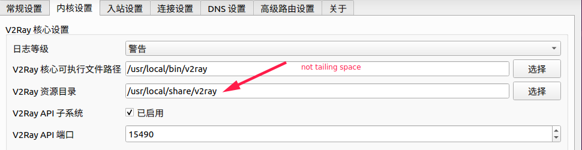
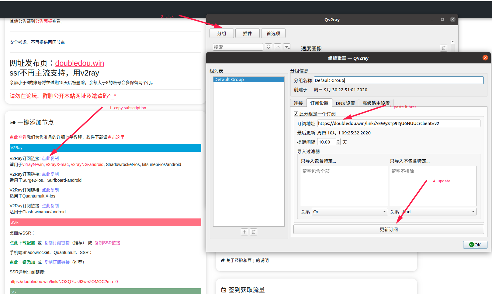

# How to cross Great Fire Wall

<!-- vim-markdown-toc GitLab -->

* [Caveat](#caveat)
* [Abstract](#abstract)
* [setup](#setup)
* [terminal proxy](#terminal-proxy)
* [git proxy](#git-proxy)
* [cmd proxy](#cmd-proxy)
* [share proxy cross lan](#share-proxy-cross-lan)
* [clash](#clash)

<!-- vim-markdown-toc -->
Across the Great Wall we can reach every corner in the world.

Search for:

## Caveat
Only tested on Ubuntu 20.04, but should work in all linux distributions, and similar
approach should works for MacOS and Windows.

## Abstract
If you can't clone https://github.com/torvalds/linux in minutes, this article
is what you need.

| protocol | airport(机场) | client                                     |
|----------|---------------|--------------------------------------------|
| v2ray    | ~             | [qv2ray](https://github.com/Qv2ray/Qv2ray) |

- There are many *protocols* for corssing GFW, e.g.,ss, ssr, v2ray, torjan and vpn.
- You can set up your sever with banwagong, Digitocean, or vulter by yourself, but airport is cheap and simple, it's enough for 99% users.
- qv2ray is best v2ray's client in Linux in my opinion, but you can choose others too.

## setup
You can reference [document of qv2ray](https://qv2ray.net/en/getting-started/) for details, here is simplified steps.

1. install `v2ray core` and `qv2ray`
```sh
snap install v2ray
snap install qv2ray
```
2. [config `v2ray core` in`qv2ray`](https://qv2ray.net/en/getting-started/step2.html#download-v2ray-core-files)

3. get subscription:
    1. [百度搜索机场](https://www.baidu.com/s?wd=%E6%9C%BA%E5%9C%BA%E8%AF%84%E6%B5%8B&rsv_spt=1&rsv_iqid=0xc4db450f00001a08&issp=1&f=8&rsv_bp=1&rsv_idx=2&ie=utf-8&tn=baiduhome_pg&rsv_enter=1&rsv_dl=tb&rsv_n=2&rsv_sug3=1&rsv_sug1=1&rsv_sug7=100&rsv_sug2=0&rsv_btype=i&inputT=457&rsv_sug4=458)
    2. select your favorite airport
    3. follows instructions provided by airports, such as register, charge, then your will get your subscription
    4. contact me with [my github email](https://github.com/Martins3)
4. add subscription to qv2ray:


:grinning: **Now you can access Google.com** :grinning:

## terminal proxy
```sh
export http_proxy=http://127.0.0.1:8889 && export https_proxy=http://127.0.0.1:8889
```

**8889 is the port set in qv2ray.**


## git proxy
for details, look [this](https://github.com/v2ray/v2ray-core/issues/1190).
```sh
git config --global http.proxy http://127.0.0.1:8889
git config --global https.proxy https://127.0.0.1:8889
```
**8889 is the port set in qv2ray.**

To avoid password everytime push to remote.
```sh
git config --global credential.helper store
```
## cmd proxy

cat /etc/proxychains.conf
```txt
[ProxyList]
socks5 127.0.0.1 1089
```

then we proxy commands in shell, e.g.
```sh
git send-email /tmp/0001-change-mmap-flags.patch --to hubachelar@qq.com
```
## share proxy cross lan
https://github.com/v2ray/v2ray-core/issues/210

in terminal
```sh
export http_proxy=http://${X86_IP}:8889 && export https_proxy=http://{X86_IP}:8889
```

in browser:
- add proxy server : `http://${X86_IP}:8889`

## clash
Qv2ray no longer maintained, so I switched to Clash and found it's more simple to setup.

reference : https://einverne.github.io/post/2021/03/linux-use-clash.html

- download and extract to somewhere
  - [url](https://github.com/Fndroid/clash_for_windows_pkg/releases)
- add icon to start menu

```txt
➜ cd /home/maritns3/.local/share/applications
➜ cat clash.desktop
[Desktop Entry]
Name=clash
Comment=vpn
Exec=/home/maritns3/arch/clash/cfw
Icon=/home/maritns3/arch/clash/logo.png
Terminal=false
Type=Application
Categories=Development
```


<script src="https://giscus.app/client.js"
        data-repo="martins3/martins3.github.io"
        data-repo-id="MDEwOlJlcG9zaXRvcnkyOTc4MjA0MDg="
        data-category="Show and tell"
        data-category-id="MDE4OkRpc2N1c3Npb25DYXRlZ29yeTMyMDMzNjY4"
        data-mapping="pathname"
        data-reactions-enabled="1"
        data-emit-metadata="0"
        data-theme="light"
        data-lang="zh-CN"
        crossorigin="anonymous"
        async>
</script>

本站所有文章转发 **CSDN** 将按侵权追究法律责任，其它情况随意。
