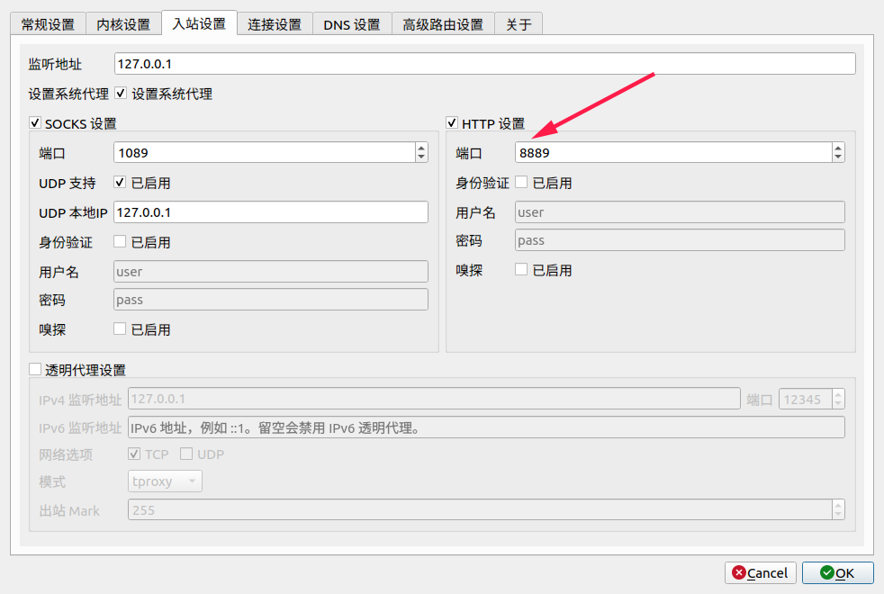

# How to cross Great Fire Wall


<!-- vim-markdown-toc GitLab -->

- [Caveat](#caveat)
- [Abstract](#abstract)
- [setup](#setup)
- [terminal proxy](#terminal-proxy)
- [git proxy](#git-proxy)

<!-- vim-markdown-toc -->

## Caveat
Only tested on Ubuntu20.

## Abstract
If you can't clone https://github.com/torvalds/linux in minutes, this article is what you need.


| method | airport(机场) | client                                     |
|--------|---------------|--------------------------------------------|
| v2ray  | v2e.fun       | [qv2ray](https://github.com/Qv2ray/Qv2ray) |


## setup
You can reference [document of qv2ray](https://qv2ray.net/en/getting-started/) for details, here is simplified steps.


1. [install v2ray](https://github.com/v2fly/fhs-install-v2ray)
```
bash <(curl -L https://raw.githubusercontent.com/v2fly/fhs-install-v2ray/master/install-release.sh)
```

2. [install qv2ray](https://qv2ray.net/en/getting-started/step1.html)

download deb in github release page and install deb locally, here is a example.
```
wget https://github.com/Qv2ray/Qv2ray/releases/download/v2.7.0-alpha1/qv2ray_2.7.0.alpha1-1stable1_amd64.deb
sudo dpkg -i qv2ray_2.7.0.alpha1-1stable1_amd64.deb.1 
```

3. [config v2ray core in qv2ray](https://qv2ray.net/en/getting-started/step2.html#download-v2ray-core-files)


4. get subscription:
    1. You can try this one : https://doubledou.win/link/AEWySTp92jU6NUUc?client=v2
    2. But I recommend buy it for youself : https://v2e.fun

5. add subscription to qv2ray:


Now you can access Google.com

## terminal proxy
```
export http_proxy=http://127.0.0.1:8889 && export https_proxy=http://127.0.0.1:8889 
```

*8889 is the port set in qv2ray.*




## git proxy 
for details, look [this](https://github.com/v2ray/v2ray-core/issues/1190).

```
git config --global http.proxy http://127.0.0.1:8889
git config --global https.proxy https://127.0.0.1:8889
```
*8889 is the port set in qv2ray.*

To avoid password everytime push to remote.
```
git config --global credential.helper store                        
```
