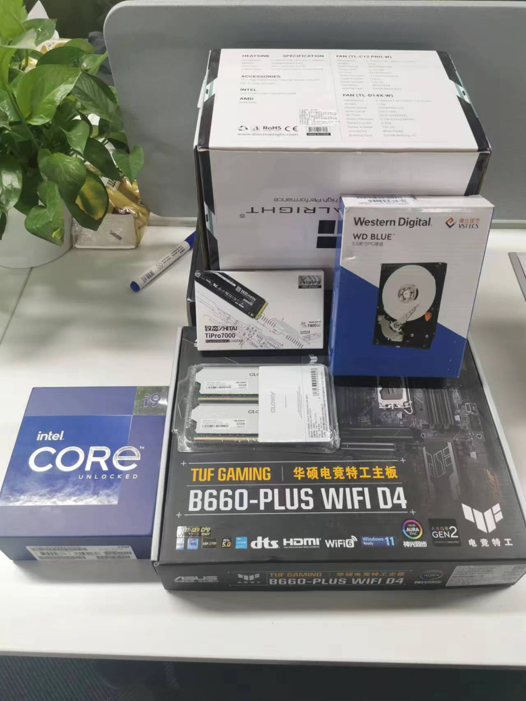

# 年轻人的第一次攒机

入职的时候，公司发了一个 M2 的 Macbook Pro，最近决定组装一个机器在公司，原因有三:
- 习惯: 我之前一直是使用 Linux 和 Windows ，但是；例如 control option command 键。
- 工作: 使用 Mac 之后，需要连远程服务工作，感觉不是很得劲儿。
	- 一是，存在延迟，打字总是有一种粘滞感。
	二是，我现在在任何时候都必须打开两个 tmux，一个在本地的 Mac 的，一个在远程的虚拟机中的。内核的代码在 Mac 上无法编译，所以必须使用远程。但是在远程上，输入法在 vim 中[很难](https://github.com/ZSaberLv0/ZFVimIM)自动切换了。

我的日常负载是:
- vim 编辑；
  - clangd 索引内核代码；
- 浏览器；
- 编译内核。

所以，我的配置的有如下特点:
- 没有显卡。现在的显卡非常的昂贵，而且 Linux 上的显卡驱动简直就是折磨狂。
- 注重多核性能。

除此之外，因为我自己的执念，我尽量采购国产的配件。

最终结果如下，除了 CPU 是旗舰级，其他的都是将就着用的状态，没有仔细挑，就是在京东搜索，看着参数是正确的就买了:


总价 10074 元，其中 CPU 5298 元。

最后，收到的货的效果如下:


第一天晚上是我老板帮忙搞定了散热和风扇，第二天我把剩下的都安装完，其中遇到两个问题:
- 只是到了最后，才发现 CPU 风扇电源插错位置了，没办法，只好把好不容易安装好的散热和风扇拆掉，才将 CPU 风扇的插槽暴露出来；
- 内存无法超频。咨询装机达人(@rrwhx)之后，才知道内存插错位置了。

组后组装大约用了 5 个小时，虽然花费了很长时间。但是组装完成之后，还是很有成就感的，如果你也喜欢 DIY，我认为没有必要花钱让别人来装。

然后，我装上 Windows，安装过程中，发现 Windows 没有预装无线网卡的驱动，让我以为我的 wifi 接收器有问题。
随后，装上 Ubuntu，还是曾经的味道，当时天色已晚，我决定第二天过来把环境切换过来，晚上的时候还在到底要不要安装
Nixos ，如何实现各个平台数据同步，在机器里面如何管理虚拟机，如何在虚拟机中构建 k8s 集群，如何在虚拟机中调试虚拟机，
观察 Linux 调度器如何应对现在大小核架构，如何管理现在的存储，如何使用使用额外的固态测试 spdk，好吧，可以做的事情太多了。

结果，第二天，我的小区被封了。

经过焦急的等待，以及各位的共同努力，终于小区解封，然后我马上就冲到公司，开始软件部署工作。
重新安装了 nixos ，总体来说，比较顺利，但是遇到了一个有趣的问题:
- 下载的 iso 中包含的 Linux 驱动比较老，这导致 UI 界面无法进入，需要在终端中首先连 wifi，然后更新驱动，然后重启

最后的效果:


大致测试了一下内核编译，QEMU 编译和 clangd 索引内核，速度惊人。
因为不用使用远程，可以感觉到 vim 的延迟也是显著降低的。

编译 Linux 内核，CPU 频率为:
```txt
🧀  cat /proc/cpuinfo | grep Hz
cpu MHz         : 5299.946
cpu MHz         : 5300.053
cpu MHz         : 5300.053
cpu MHz         : 5300.000
cpu MHz         : 5300.000
cpu MHz         : 5300.000
cpu MHz         : 5200.052
cpu MHz         : 5199.947
cpu MHz         : 5271.533
cpu MHz         : 5271.533
cpu MHz         : 5300.000
cpu MHz         : 5300.053
cpu MHz         : 5300.053
cpu MHz         : 5299.946
cpu MHz         : 5300.053
cpu MHz         : 5300.000
cpu MHz         : 4199.971
cpu MHz         : 4199.843
cpu MHz         : 4199.937
cpu MHz         : 4200.017
cpu MHz         : 4199.919
cpu MHz         : 4200.043
cpu MHz         : 4200.063
cpu MHz         : 4200.142
cpu MHz         : 4200.124
cpu MHz         : 4200.111
cpu MHz         : 4200.066
cpu MHz         : 4200.084
cpu MHz         : 4199.927
cpu MHz         : 4199.960
cpu MHz         : 4200.069
cpu MHz         : 4200.059
```
其中 8 个大核 5.3GHz，16 个小核 4.2GHz 。

## 继续加装

### 内存
由于我把 QEMU 脚本搞的更加通用化，现在机器里面经常好几个 QEMU 同时运行，而且往往是携带了嵌套虚拟化的。
这导致 64G 内存经常捉襟见肘，于是又扩容了 64G 内存。

这导致了两个问题:
1. 主板的待机功耗从 50w 变为了 70w
2. 内存频率从 3200MHz 变为了 2400MHz 。

第一个问题还好，但是第二个下降就有点难受了:

1. nvme randread 从 800k 下降到 500k
2. nullblk randread 从 1700k 下降到 400k
3. vhost-net + ovs 从 13.8GB 下降到 10.7 GB

我是没有想到，原来高速 io 设备的性能和内存频率关系这么大。

编译内核差别倒是不大。

### SSD
存储应该直接上 2T SSD 的，发现 1T SSD 很快就要开始手动垃圾回收了，也就是用 gdu 看什么占用空间很大，又没用，就先删掉，非常难受。
后面买了一个 FanXiang 的 4T 盘，大约花费 1200 ，所有的数据都放到这个盘中，用了几个月后，使用量如下所示。
```txt
╭─────────────────────────────────────────────────────────────────────────────────────────────────╮
│ 3 local devices                                                                                 │
├────────────┬────────┬────────┬────────┬───────────────────────────────┬──────┬──────────────────┤
│ MOUNTED ON │   SIZE │   USED │  AVAIL │              USE%             │ TYPE │ FILESYSTEM       │
├────────────┼────────┼────────┼────────┼───────────────────────────────┼──────┼──────────────────┤
│ /          │   3.6T │ 940.3G │   2.7T │ [#####...............]  25.2% │ xfs  │ /dev/fedora/root │
│ /boot      │ 848.4M │ 528.7M │ 319.6M │ [############........]  62.3% │ xfs  │ /dev/nvme2n1p2   │
│ /boot/efi  │ 598.8M │   7.5M │ 591.3M │ [....................]   1.3% │ vfat │ /dev/nvme2n1p1   │
╰────────────┴────────┴────────┴────────┴───────────────────────────────┴──────┴──────────────────╯
```

### 水冷
当时这个机器是冬天组装的，当时用这还行，但是到了 5 月后，编译内核就疯狂降频，经过调查，发现是散热不佳，
于是我又去买一个 360 水冷。但是发现之前的机箱太小，360 水冷根本放不下去。但是我不想继续折腾了，于是
就把水冷放到机箱外面，这样一方就两年，后面这个机器到处搬，实在不方便，买了一个大机箱，重新把机器组装了一遍。

## 感想
本科时代用的电脑是联想的 Thinkpad T450，刚开始购买的时候只有 4G 内存，128G 固态，续航大约两小时，分辨率也非常垃圾，后来实在是忍无可忍，还重新购买了电池和内存，体验还是非常差，从此联想一生黑。

在大四开始的时候(2018 年夏)，重新购买了一个小米笔记本，虽然风扇有点问题，去修过一次，此外体验还是不错的，但是移动级的性能天花板就在哪里，而且扩展能力太弱了。

使用这个机器之后，
- CPU 多核性能提升大约 5 ~ 10 倍；
- 固态容量从 256G 增加为 2T；
- 内存容量从 16G 增加为 64G 。

但是我感觉唯一开倒车的就是 GPU ，完全就是抢钱。以前笔记本里面有一个 MX250 的显卡，现在完全靠集成显卡维持生活。不过之后，我想买个亮机卡，用来做设备直通，这样就可以在虚拟机中愉快的使用 windows 了。

相对于之前使用 Mac 连虚拟机的操作，提升为:
- 在编译内核等负载上数倍的性能提升
- 使用更加习惯的图形界面
- 可以使用 Nixos 管理的图形界面
- 在使用 neovim 读写代码的时候几乎是零延迟
- 可以将我的 Mac 安装为 Asahi Linux，从而有了原生的 ARM Linux 可用，测试 QEMU 更加方便了。
- 可以方便的测试嵌套虚拟化，GPU 直通等。
- 可以使用 sshfs ，从而方便的将本地编辑的代码共享到远程。rsync 之类，syncthing 之类都没有 sshfs 好用，但是后者需要 fuse 支持，而 mac 中这个功能的打开还挺麻烦的。


## 参考
- [ZKV 的攒机简史](https://cerr.cc/post/zkv%E7%9A%84%E6%94%92%E6%9C%BA%E7%AE%80%E5%8F%B2/)
- [cinebench-scores](https://nanoreview.net/en/cpu-list/cinebench-scores)
- [Intel Core i9 13900K Linux Benchmarks - Performing Very Well On Ubuntu](https://www.phoronix.com/review/intel-core-i9-13900k)
- [ ] [xe: homelab v2](https://xeiaso.net/blog/2024/homelab-v2/)
- [ ] [How I built my new linux gaming desktop in 2021 with amd cpu gpu and gnu guix](https://boilingsteam.com/how-i-built-my-new-linux-gaming-desktop-in-2021-with-amd-cpugpu-and-gnu-guix/)
- [ ] [Living in the future, by the numbers](https://tailscale.com/blog/living-in-the-future#welcome-to-the-future)
- [ ] https://blog.cloudflare.com/analysis-of-the-epyc-145-performance-gain-in-cloudflare-gen-12-servers/
  - 需要更好的机器用
- [ ] https://news.ycombinator.com/item?id=43029474
- [ ] https://boilingsteam.com/how-i-built-my-new-linux-gaming-desktop-in-2021-with-amd-cpugpu-and-gnu-guix/
- [ ] https://www.bilibili.com/video/BV1qa4y1y7hp
- [华硕主板](https://dlcdnets.asus.com.cn/pub/ASUS/mb/SocketAM4/PRIME_A320M-A/C11133_MB_PIN_DEFINITION_V2_WEB.pdf)
<script src="https://giscus.app/client.js"
        data-repo="martins3/martins3.github.io"
        data-repo-id="MDEwOlJlcG9zaXRvcnkyOTc4MjA0MDg="
        data-category="Show and tell"
        data-category-id="MDE4OkRpc2N1c3Npb25DYXRlZ29yeTMyMDMzNjY4"
        data-mapping="pathname"
        data-reactions-enabled="1"
        data-emit-metadata="0"
        data-theme="light"
        data-lang="zh-CN"
        crossorigin="anonymous"
        async>
</script>

本站所有文章转发 **CSDN** 将按侵权追究法律责任，其它情况随意。
