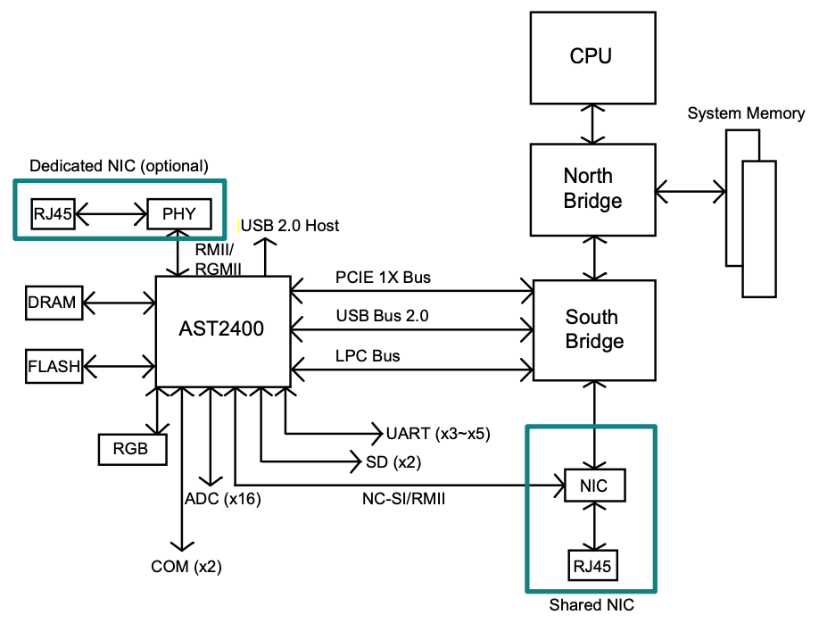

# 大致了解一下

- https://github.com/causten/openbmc-tutorials : 到底什么是 bmc

  

from https://en.wikipedia.org/wiki/Intelligent_Platform_Management_Interface

  

from https://www.supermicro.org.cn/manuals/other/IPMI_Users_Guide.pdf

## kernel doc

- https://docs.kernel.org/driver-api/ipmi.html

在 kernel 中可以找到一个这个东西:
/sys/devices/platform/ipmi_bmc.0/power
