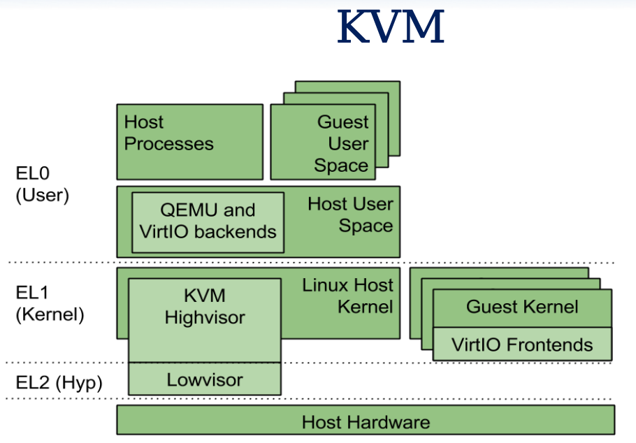

# ARM KVM 的大致代码流程
> 尽可能的看看熟悉的部分

- [ ] 天高气爽阅码疾：一日看尽虚拟化（上）: https://mp.weixin.qq.com/s/CWqUagksabj4kDFQhTlgUA
  - 应该将这个作者的其他内容也好好找一找。
  - 有点没有看懂，很烦啊！

<p align="center">
  
</p>
<p align="center">
from https://lia.disi.unibo.it/Courses/som1516/materiale/VOSYS_BolognaKVMARM_2_12_2015.pdf
</p>

## 很难的哇
- https://systems.cs.columbia.edu/projects/kvm-arm/
- https://www.cnblogs.com/LoyenWang/tag/%E8%99%9A%E6%8B%9F%E5%8C%96/ : LoyenWang 讲解的虚拟化是基于 ARM 的

- https://lists.cs.columbia.edu/pipermail/kvmarm/2020-July/041733.html ：对于 ARM 最好的总结

## 资源
- [ ] https://www.usenix.org/system/files/conference/atc17/atc17-dall.pdf
- [ ] https://calinyara.github.io/technology/2019/11/03/armv8-virtualization.html
- [ ] https://openeuler.org/zh/blog/yorifang/2020-10-24-arm-virtualization-overview.html

## ARM 本身的关键参考
- [ARM 指令集导读](https://armv8-ref.codingbelief.com/zh/)

## 读读代码
好吧，存在 VHE 和 none VHE 两种方式。

- kvm_arch_vcpu_ioctl_run
  - `__kvm_vcpu_run` : vhe 和 nvhe 各有一份的
    - `__guest_enter` : arch/arm64/kvm/hyp/entry.S
  - handle_exit
   - handle_trap_exceptions
    - kvm_get_exit_handler
    - arm_exit_handlers : 所有的 handler 入口
      - kvm_handle_guest_abort : mmu.c 处理 tdp 的映射问题, 这些和 MIPS 中间的内容非常的对称

## [内存虚拟化](https://www.cnblogs.com/LoyenWang/p/13943005.html)

## [中断虚拟化](https://www.cnblogs.com/LoyenWang/p/14017052.html)
整个 kvm 只有 17000 行，其中 kvm/vgic 下有 7000 行

- [ ] 分析的相当不错，但是只能理解其中部分内容

## 简单跟踪一下其中的源码

- guest.c regmap.c sys_regs.c 中都是在处理 system reg 的获取

- `kvm_arch_vcpu_ioctl`
  - `kvm_arm_num_regs`
- 检查一下 `sys_reg_descs` 的内容:


### 找到 exit 的流程

- kvm_arch_vcpu_ioctl_run
  - handle_exit ：
    - ARM_EXCEPTION_TRAP : handle_trap_exceptions
      - kvm_get_exit_handler
        - kvm_vcpu_get_esr
      - kvm_handle_guest_abort : guest page fault 的位置
        - handle_access_fault : 从这里开始是我们熟悉的内容

在 handle_exit 中引用的几个内容为，他们是什么含义，为什么在 handle_exit 中处于几乎无需处理的状态:
```c
#define ARM_EXCEPTION_IRQ     0
#define ARM_EXCEPTION_EL1_SERROR  1
#define ARM_EXCEPTION_TRAP    2
#define ARM_EXCEPTION_IL      3
```

- [ ] arm_exit_handlers ：这就是全部的 exit handler 吗?

### 将 arm_exit_handlers 中，找到对应的手册

D13.2.37 中

### 查看一下 kvm_vcpu_arch 中的内容

- kvm_vcpu_fault_info

## 补充一下 ARM 的基础知识

## ARM 的 SERROR
- http://happyseeker.github.io/kernel/2016/03/03/about-system-error-in-AArach64.html
- https://developer.arm.com/documentation/102412/0102/Exception-types

## SMC : Secure Monitor Call
- https://stackoverflow.com/questions/59217906/how-to-use-an-arm-secure-monitor-call-smc

## Coprocessor
原来 arm 也是存在 coprocess 的概念:

- https://developer.arm.com/documentation/ddi0406/c/Application-Level-Architecture/The-Instruction-Sets/Coprocessor-instructions

- Transfer ARM core registers to and from coprocessor registers. For details, see:
  - MCR, MCR2
  - MCRR, MCRR2
  - MRC, MRC2
  - MRRC, MRRC2.
- Load or store the values of coprocessor registers. For details, see:
  - LDC, LDC2 (immediate)
  - LDC, LDC2 (literal)
  - STC, STC2.

## io_mem_abort && user_mem_abort

- 这些含义是什么意思?
```c
/* For compatibility with fault code shared with 32-bit */
#define FSC_FAULT   ESR_ELx_FSC_FAULT
#define FSC_ACCESS  ESR_ELx_FSC_ACCESS
#define FSC_PERM    ESR_ELx_FSC_PERM
#define FSC_SEA     ESR_ELx_FSC_EXTABT
#define FSC_SEA_TTW0    (0x14)
#define FSC_SEA_TTW1    (0x15)
#define FSC_SEA_TTW2    (0x16)
#define FSC_SEA_TTW3    (0x17)
#define FSC_SECC    (0x18)
#define FSC_SECC_TTW0   (0x1c)
#define FSC_SECC_TTW1   (0x1d)
#define FSC_SECC_TTW2   (0x1e)
#define FSC_SECC_TTW3   (0x1f)
```

## ARM page table
- https://developer.arm.com/documentation/101811/0102/Translation-granule
- page walk 和 pagesize

## ARM exception
- http://osnet.cs.nchu.edu.tw/powpoint/Embedded94_1/Chapter%207%20ARM%20Exceptions.pdf
- LoyenWang 是分析过 ARM 的中断的过程的哇

## ARM data abort
- https://developer.arm.com/documentation/ddi0406/b/System-Level-Architecture/The-System-Level-Programmers--Model/Exceptions/Data-Abort-exception

## ARM page walking

### TTBR 和 TTBCR 基础知识
- https://stackoverflow.com/questions/14460752/linux-kernel-arm-translation-table-base-ttb0-and-ttb1

TTBR0 用于存放用户空间的一级页表基址，TTBR1 存放内核空间的一级页表基址。

## ARM Address Space
- 官方文档，总结非常到位的: https://developer.arm.com/documentation/101811/0102/Address-spaces

## 调查一下

内核之后改进:
```diff
History:        #0
Commit:         c726200dd106d4c58a281eea7159b8ba28a4ab34
Author:         Christoffer Dall <christoffer.dall@arm.com>
Committer:      Marc Zyngier <maz@kernel.org>
Author Date:    Fri 11 Oct 2019 07:07:05 PM CST
Committer Date: Tue 22 Oct 2019 01:59:44 AM CST

KVM: arm/arm64: Allow reporting non-ISV data aborts to userspace

For a long time, if a guest accessed memory outside of a memslot using
any of the load/store instructions in the architecture which doesn't
supply decoding information in the ESR_EL2 (the ISV bit is not set), the
kernel would print the following message and terminate the VM as a
result of returning -ENOSYS to userspace:

  load/store instruction decoding not implemented

The reason behind this message is that KVM assumes that all accesses
outside a memslot is an MMIO access which should be handled by
userspace, and we originally expected to eventually implement some sort
of decoding of load/store instructions where the ISV bit was not set.

However, it turns out that many of the instructions which don't provide
decoding information on abort are not safe to use for MMIO accesses, and
the remaining few that would potentially make sense to use on MMIO
accesses, such as those with register writeback, are not used in
practice.  It also turns out that fetching an instruction from guest
memory can be a pretty horrible affair, involving stopping all CPUs on
SMP systems, handling multiple corner cases of address translation in
software, and more.  It doesn't appear likely that we'll ever implement
this in the kernel.

What is much more common is that a user has misconfigured his/her guest
and is actually not accessing an MMIO region, but just hitting some
random hole in the IPA space.  In this scenario, the error message above
is almost misleading and has led to a great deal of confusion over the
years.

It is, nevertheless, ABI to userspace, and we therefore need to
introduce a new capability that userspace explicitly enables to change
behavior.

This patch introduces KVM_CAP_ARM_NISV_TO_USER (NISV meaning Non-ISV)
which does exactly that, and introduces a new exit reason to report the
event to userspace.  User space can then emulate an exception to the
guest, restart the guest, suspend the guest, or take any other
appropriate action as per the policy of the running system.

Reported-by: Heinrich Schuchardt <xypron.glpk@gmx.de>
Signed-off-by: Christoffer Dall <christoffer.dall@arm.com>
Reviewed-by: Alexander Graf <graf@amazon.com>
Signed-off-by: Marc Zyngier <maz@kernel.org>
```
- 对应的 link : https://lore.kernel.org/linux-arm-kernel/20190909121337.27287-2-christoffer.dall@arm.com/

QEMU 对应的位置:
```diff
History:   #0
Commit:    694bcaa81f41b7fc5e07273debe1dc309b3dcf03
Author:    Beata Michalska <beata.michalska@linaro.org>
Committer: Peter Maydell <peter.maydell@linaro.org>
Date:      Fri 03 Jul 2020 11:59:42 PM CST

target/arm: kvm: Handle DABT with no valid ISS

On ARMv7 & ARMv8 some load/store instructions might trigger a data abort
exception with no valid ISS info to be decoded. The lack of decode info
makes it at least tricky to emulate those instruction which is one of the
(many) reasons why KVM will not even try to do so.

Add support for handling those by requesting KVM to inject external
dabt into the quest.

Signed-off-by: Beata Michalska <beata.michalska@linaro.org>
Reviewed-by: Andrew Jones <drjones@redhat.com>
Message-id: 20200629114110.30723-2-beata.michalska@linaro.org
Signed-off-by: Peter Maydell <peter.maydell@linaro.org>
```

### [ ] 难道对于 mmio 是可以不用注册 memslot 的吗

### [ ] 为什么 ISV

### [ ] 什么样子的 load/store 会触发 abort 同时是没有 valid ISS 的

### External Data Abort 的含义是什么
- 难道还有 internal data abort ?

- el0_ia 和 el0_da 的处理都是相似的，调用 do_mem_abort

- [x] 哪一个字段描述是 external 还是 internal : EA，ESR_ELx_EA，但是似乎有问题的

- 这里开始: https://developer.arm.com/documentation/ddi0344/b/programmer-s-model/exceptions/aborts
- 还是 stackoverflow 讲解的清楚一点: https://stackoverflow.com/questions/33304717/external-abort-in-arm-processor

### [ ] external data abort 被注入的结果是什么

## 分析一下 ARM 的 exception

首先在这里定义的:
```S
SYM_CODE_START(vectors)
    kernel_ventry   1, t, 64, sync      // Synchronous EL1t
    kernel_ventry   1, t, 64, irq       // IRQ EL1t
    kernel_ventry   1, t, 64, fiq       // FIQ EL1h
    kernel_ventry   1, t, 64, error     // Error EL1t

    kernel_ventry   1, h, 64, sync      // Synchronous EL1h
    kernel_ventry   1, h, 64, irq       // IRQ EL1h
    kernel_ventry   1, h, 64, fiq       // FIQ EL1h
    kernel_ventry   1, h, 64, error     // Error EL1h

    kernel_ventry   0, t, 64, sync      // Synchronous 64-bit EL0
    kernel_ventry   0, t, 64, irq       // IRQ 64-bit EL0
    kernel_ventry   0, t, 64, fiq       // FIQ 64-bit EL0
    kernel_ventry   0, t, 64, error     // Error 64-bit EL0

    kernel_ventry   0, t, 32, sync      // Synchronous 32-bit EL0
    kernel_ventry   0, t, 32, irq       // IRQ 32-bit EL0
    kernel_ventry   0, t, 32, fiq       // FIQ 32-bit EL0
    kernel_ventry   0, t, 32, error     // Error 32-bit EL0
```
- arch/arm64/kernel/entry-common.c

- 什么叫做 el1t 和 el1h 的区别是什么?
  - https://stackoverflow.com/questions/21586768/armv8-aarch64-vs-aarch32-stack-pointer-register
  - 目前是相关知识介绍的最清楚的了: http://www.wowotech.net/armv8a_arch/238.html

- el1h_64_sync_handler : 内核中出现 sync 的错误，很快就会到达 kdump 的位置
- el0t_64_sync_handler : 用户态出现错误
  - el0_da
    - exit_to_user_mode : 这里有我们熟悉的进程切换的环节
- el1h_64_irq_handler
  - el1_interrupt
    - `__el1_irq`
      - do_interrupt_handler ：最后调用到对应的 hook 应该一般就是 `gic_handle_irq` 上了。

- arch/arm64/mm/fault.c 和 page fault 相关的内容会跳转到这里


- [ ] 不知道为什么 el1t 是不存在的，而 el0h 是不存在的
```c
UNHANDLED(el1t, 64, sync)
UNHANDLED(el1t, 64, irq)
UNHANDLED(el1t, 64, fiq)
UNHANDLED(el1t, 64, error)
```
