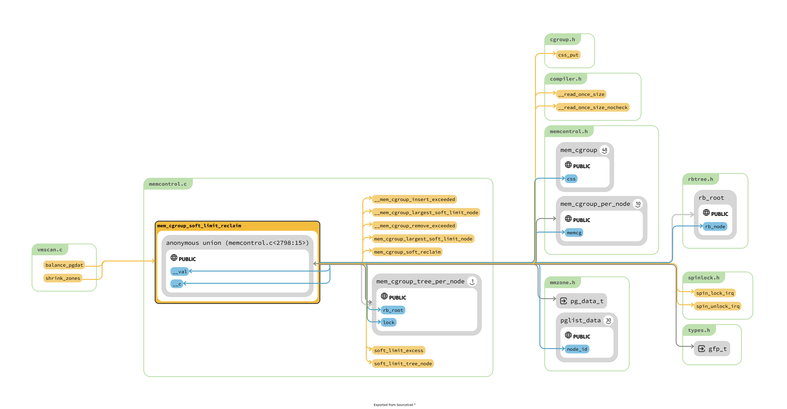
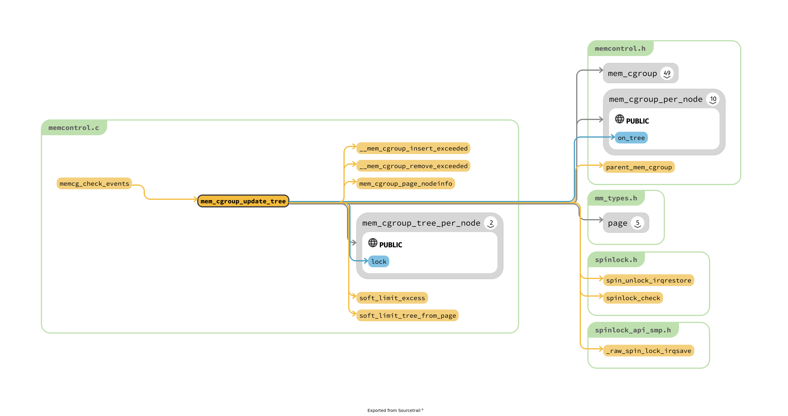

# memcontrol.c

3. softlimit 查找其 ref
- [ ] update tree 真的有用吗?
  - 确定只是和 softlimit 有关的 ?

- [ ] mem_cgroup_charge_statistics : 这个操作的 PGPGIN ，我无法理解

- [ ] low min high 是如何影响回收的
- [ ] memcg 是如何和 zone 的联系起来的
  - 所以，是不是 memcg 也是需要有一个 lruvec 的
- [ ] get_mctgt_type

## memcg 和 zone, node 的关系
- shrink_node_memcgs
  - mem_cgroup_lruvec : 获取一个 Node 关联的 lruvec
  - shrink_lruvec

- mem_cgroup::mem_cgroup_per_node : 中持有一个 lrvu

## memcg 在 Node 中平衡的问题

- 为什么是 shrink_zones 来调用 shrink_node
  - 应该是从上层传输过来的，例如有的分配会指定自己从那些地方获取
  - 相同的 zone 处理过之后，不会去处理下一个 zone 的

- 回收是体现在 node 级别的，因为每一个 node 是持有一个 lruvec

## 基本操作
- lscgroup 可以展示当前的 cgroups，默认的都是 systemd 启动的

## function for outside



似乎完全是和其他业务隔离开来，完全简单的调用。

```c
static int balance_pgdat(pg_data_t *pgdat, int order, int classzone_idx)

static void shrink_zones(struct zonelist *zonelist, struct scan_control *sc)
            /*
             * This steals pages from memory cgroups over softlimit
             * and returns the number of reclaimed pages and
             * scanned pages. This works for global memory pressure
             * and balancing, not for a memcg's limit.
             */
            nr_soft_scanned = 0;
            nr_soft_reclaimed = mem_cgroup_soft_limit_reclaim(zone->zone_pgdat,
                        sc->order, sc->gfp_mask,
                        &nr_soft_scanned);
            sc->nr_reclaimed += nr_soft_reclaimed;
            sc->nr_scanned += nr_soft_scanned;
```

## 跑点 backtrace 吧
- [ ] mem_cgroup_move_account
  - mem_cgroup_move_task : gdb 插入错误

- try_charge_memcg : 超级频繁的调用，因为 systemd 本身
- mem_cgroup_migrate

```txt
#0  mem_cgroup_move_task () at mm/memcontrol.c:6247
#1  0xffffffff811cc6ff in cgroup_procs_write_finish (task=task@entry=0xffff888140180000, threadgroup_locked=<optimized out>) at kernel/cgroup/cgroup.c:2985
#2  0xffffffff811cf13f in __cgroup_procs_write (of=0xffff8881222f6600, buf=<optimized out>, threadgroup=threadgroup@entry=true) at kernel/cgroup/cgroup.c:5161
#3  0xffffffff811cf1ce in cgroup_procs_write (of=<optimized out>, buf=<optimized out>, nbytes=2, off=<optimized out>) at kernel/cgroup/cgroup.c:5171
#4  0xffffffff813fed5e in kernfs_fop_write_iter (iocb=0xffffc9000005fea0, iter=<optimized out>) at fs/kernfs/file.c:330
#5  0xffffffff81366a4c in call_write_iter (iter=0xffffc9000005fe78, kio=0xffffc9000005fea0, file=0xffff888124a38900) at include/linux/fs.h:2191
#6  new_sync_write (ppos=0xffffc9000005ff08, len=2, buf=0x7fff79847d3a "1\n", filp=0xffff888124a38900) at fs/read_write.c:491
#7  vfs_write (file=file@entry=0xffff888124a38900, buf=buf@entry=0x7fff79847d3a "1\n", count=count@entry=2, pos=pos@entry=0xffffc9000005ff08) at fs/read_write.c:584
#8  0xffffffff81366e1a in ksys_write (fd=<optimized out>, buf=0x7fff79847d3a "1\n", count=2) at fs/read_write.c:637
#9  0xffffffff81fa3beb in do_syscall_x64 (nr=<optimized out>, regs=0xffffc9000005ff58) at arch/x86/entry/common.c:50
#10 do_syscall_64 (regs=0xffffc9000005ff58, nr=<optimized out>) at arch/x86/entry/common.c:80
#11 0xffffffff8200009b in entry_SYSCALL_64 () at arch/x86/entry/entry_64.S:120
```

```txt
#0  try_charge_memcg (memcg=memcg@entry=0xffff88812528b000, gfp_mask=gfp_mask@entry=3264, nr_pages=nr_pages@entry=1) at mm/memcontrol.c:2629
#1  0xffffffff8134c6d3 in obj_cgroup_charge_pages (nr_pages=1, gfp=3264, objcg=0xffff88812577b500) at mm/memcontrol.c:3095
#2  obj_cgroup_charge (objcg=objcg@entry=0xffff88812577b500, gfp=gfp@entry=3264, size=<optimized out>) at mm/memcontrol.c:3385
#3  0xffffffff8132d600 in memcg_slab_pre_alloc_hook (flags=3264, objects=1, objcgp=<synthetic pointer>, lru=0x1138 <cpu_debug_store+312>, s=0xffff888100005300) at mm/slab.h:501
#4  slab_pre_alloc_hook (flags=3264, size=1, objcgp=<synthetic pointer>, lru=0x1138 <cpu_debug_store+312>, s=0xffff888100005300) at mm/slab.h:715
#5  slab_alloc_node (orig_size=192, addr=18446744071582522772, node=-1, gfpflags=3264, lru=0x1138 <cpu_debug_store+312>, s=0xffff888100005300) at mm/slub.c:3318
#6  slab_alloc (orig_size=192, addr=18446744071582522772, gfpflags=3264, lru=0x1138 <cpu_debug_store+312>, s=0xffff888100005300) at mm/slub.c:3406
#7  __kmem_cache_alloc_lru (gfpflags=<optimized out>, lru=<optimized out>, s=<optimized out>) at mm/slub.c:3413
#8  kmem_cache_alloc_lru (s=0xffff888100005300, lru=lru@entry=0xffff88812200ec78, gfpflags=gfpflags@entry=3264) at mm/slub.c:3429
#9  0xffffffff81381d94 in __d_alloc (sb=0xffff88812200e800, name=name@entry=0xffffc9000005fe90) at fs/dcache.c:1769
#10 0xffffffff81381f70 in d_alloc (parent=parent@entry=0xffff888121f97180, name=name@entry=0xffffc9000005fe90) at fs/dcache.c:1849
#11 0xffffffff813727de in __lookup_hash (name=name@entry=0xffffc9000005fe90, base=0xffff888121f97180, flags=flags@entry=1536) at fs/namei.c:1597
#12 0xffffffff81377376 in filename_create (dfd=dfd@entry=-100, name=name@entry=0xffff888100bba000, path=path@entry=0xffffc9000005fed8, lookup_flags=<optimized out>) at fs/namei.c:3807
#13 0xffffffff8137977f in do_mkdirat (dfd=dfd@entry=-100, name=0xffff888100bba000, mode=mode@entry=493) at fs/namei.c:4050
#14 0xffffffff813799b3 in __do_sys_mkdir (mode=<optimized out>, pathname=<optimized out>) at fs/namei.c:4080
#15 __se_sys_mkdir (mode=<optimized out>, pathname=<optimized out>) at fs/namei.c:4078
#16 __x64_sys_mkdir (regs=<optimized out>) at fs/namei.c:4078
#17 0xffffffff81fa3beb in do_syscall_x64 (nr=<optimized out>, regs=0xffffc9000005ff58) at arch/x86/entry/common.c:50
#18 do_syscall_64 (regs=0xffffc9000005ff58, nr=<optimized out>) at arch/x86/entry/common.c:80
```

## mem_cgroup_migrate

- [ ] 为什么 cgroup 和物理位置有关，也许是 migrate 前后，页面数量不同?

```txt
#0  mem_cgroup_migrate (old=old@entry=0xffffea0004c18000, new=new@entry=0xffffea0005ee8000) at arch/x86/include/asm/bitops.h:206
#1  0xffffffff8133084d in folio_migrate_flags (newfolio=newfolio@entry=0xffffea0005ee8000, folio=folio@entry=0xffffea0004c18000) at mm/migrate.c:613
#2  0xffffffff81332090 in folio_migrate_copy (folio=0xffffea0004c18000, newfolio=0xffffea0005ee8000) at mm/migrate.c:620
#3  migrate_folio_extra (mapping=<optimized out>, extra_count=<optimized out>, mode=MIGRATE_ASYNC, src=0xffffea0004c18000, dst=0xffffea0005ee8000) at mm/migrate.c:641
#4  migrate_folio_extra (mapping=<optimized out>, dst=0xffffea0005ee8000, src=0xffffea0004c18000, mode=MIGRATE_ASYNC, extra_count=<optimized out>) at mm/migrate.c:628
#5  0xffffffff813323d4 in migrate_folio (mode=MIGRATE_ASYNC, src=0xffffea0004c18000, dst=0xffffea0005ee8000, mapping=0x0 <fixed_percpu_data>) at mm/migrate.c:662
#6  move_to_new_folio (dst=dst@entry=0xffffea0005ee8000, src=src@entry=0xffffea0004c18000, mode=mode@entry=MIGRATE_ASYNC) at mm/migrate.c:939
#7  0xffffffff813335da in __unmap_and_move (mode=MIGRATE_ASYNC, force=0, dst=<optimized out>, src=<optimized out>) at mm/migrate.c:1112
#8  unmap_and_move (ret=0xffffc90001a4fc70, reason=MR_NUMA_MISPLACED, mode=MIGRATE_ASYNC, force=0, page=0xffffea0004c18000, private=0, put_new_page=0x0 <fixed_percpu_data>, get_new_page=0xffffffff81331510 <alloc_misplaced_dst_page>) at mm/migrate.c:1184
#9  migrate_pages (from=from@entry=0xffffc90001a4fd28, get_new_page=get_new_page@entry=0xffffffff81331510 <alloc_misplaced_dst_page>, put_new_page=put_new_page@entry=0x0 <fixed_percpu_data>, private=private@entry=0, mode=mode@entry=MIGRATE_ASYNC, reason=reason@entry=5, ret_succeeded=<optimized out>) at mm/migrate.c:1461
#10 0xffffffff813345e1 in migrate_misplaced_page (page=page@entry=0xffffea0004c18000, vma=vma@entry=0xffff888169c9b098, node=node@entry=0) at mm/migrate.c:2186
#11 0xffffffff8133731a in do_huge_pmd_numa_page (vmf=vmf@entry=0xffffc90001a4fdf8) at mm/huge_memory.c:1520
#12 0xffffffff812dcab3 in __handle_mm_fault (vma=vma@entry=0xffff888169c9b098, address=address@entry=140275315900416, flags=flags@entry=596) at mm/memory.c:5083
#13 0xffffffff812dd600 in handle_mm_fault (vma=0xffff888169c9b098, address=address@entry=140275315900416, flags=flags@entry=596, regs=regs@entry=0xffffc90001a4ff58) at mm/memory.c:5218
#14 0xffffffff810f3ca3 in do_user_addr_fault (regs=regs@entry=0xffffc90001a4ff58, error_code=error_code@entry=4, address=address@entry=140275315900416) at arch/x86/mm/fault.c:1428
#15 0xffffffff81fa7e22 in handle_page_fault (address=140275315900416, error_code=4, regs=0xffffc90001a4ff58) at arch/x86/mm/fault.c:1519
#16 exc_page_fault (regs=0xffffc90001a4ff58, error_code=4) at arch/x86/mm/fault.c:1575
#17 0xffffffff82000b62 in asm_exc_page_fault () at ./arch/x86/include/asm/idtentry.h:570
```

## 核心流程
- try_to_free_mem_cgroup_pages : check if memory consumption is in the normal range : 什么叫做 normal range

- 最后也是走到常规路径来回收
```txt
#0  mem_cgroup_calculate_protection (root=root@entry=0xffff8881270e7000, memcg=memcg@entry=0xffff8881270e7000) at arch/x86/include/asm/jump_label.h:27
#1  0xffffffff812afb63 in shrink_node_memcgs (sc=0xffffc90001befc68, pgdat=0xffff88813fffc000) at mm/vmscan.c:6049
#2  shrink_node (pgdat=pgdat@entry=0xffff88813fffc000, sc=sc@entry=0xffffc90001befc68) at mm/vmscan.c:6105
#3  0xffffffff812b0e10 in shrink_zones (sc=0xffffc90001befc68, zonelist=<optimized out>) at mm/vmscan.c:6343
#4  do_try_to_free_pages (zonelist=zonelist@entry=0xffff88813fffda00, sc=sc@entry=0xffffc90001befc68) at mm/vmscan.c:6405
#5  0xffffffff812b1c70 in try_to_free_mem_cgroup_pages (memcg=memcg@entry=0xffff8881270e7000, nr_pages=nr_pages@entry=1, gfp_mask=gfp_mask@entry=3264, reclaim_options=reclaim_options@entry=2) at mm/vmscan.c:6720
#6  0xffffffff8134aa07 in try_charge_memcg (memcg=memcg@entry=0xffff8881270e7000, gfp_mask=gfp_mask@entry=3264, nr_pages=1) at mm/memcontrol.c:2681
#7  0xffffffff8134b93d in try_charge (nr_pages=1, gfp_mask=3264, memcg=0xffff8881270e7000) at mm/memcontrol.c:2823
#8  charge_memcg (folio=folio@entry=0xffffea0004b6f200, memcg=memcg@entry=0xffff8881270e7000, gfp=gfp@entry=3264) at mm/memcontrol.c:6879
#9  0xffffffff8134d124 in __mem_cgroup_charge (folio=0xffffea0004b6f200, mm=<optimized out>, gfp=gfp@entry=3264) at mm/memcontrol.c:6900
#10 0xffffffff812dcc56 in mem_cgroup_charge (gfp=3264, mm=<optimized out>, folio=<optimized out>) at include/linux/memcontrol.h:667
#11 do_anonymous_page (vmf=0xffffc90001befdf8) at mm/memory.c:4118
#12 handle_pte_fault (vmf=0xffffc90001befdf8) at mm/memory.c:4953
#13 __handle_mm_fault (vma=vma@entry=0xffff88816b754558, address=address@entry=140170563596288, flags=flags@entry=597) at mm/memory.c:5097
#14 0xffffffff812dd600 in handle_mm_fault (vma=0xffff88816b754558, address=address@entry=140170563596288, flags=flags@entry=597, regs=regs@entry=0xffffc90001beff58) at mm/memory.c:5218
#15 0xffffffff810f3ca3 in do_user_addr_fault (regs=regs@entry=0xffffc90001beff58, error_code=error_code@entry=6, address=address@entry=140170563596288) at arch/x86/mm/fault.c:1428
#16 0xffffffff81fa7e22 in handle_page_fault (address=140170563596288, error_code=6, regs=0xffffc90001beff58) at arch/x86/mm/fault.c:1519
#17 exc_page_fault (regs=0xffffc90001beff58, error_code=6) at arch/x86/mm/fault.c:1575
#18 0xffffffff82000b62 in asm_exc_page_fault () at ./arch/x86/include/asm/idtentry.h:570
```

- try_charge_memcg
  - page_counter_try_charge : 从下向上，分配内存，如果充足，那么可以直接返回
  - try_to_free_mem_cgroup_pages : 尝试回收内存
    - 在其中 swap 的时候，被 swap 锁限制
  - mem_cgroup_out_of_memory : 内存不够，结束!

## memcg_check_events

调用的位置还是很多的:

```c
memcg_check_events : 似乎像是，当事件累积到一定的程度的时候，然后进行处理的机制 mem_cgroup_update_tree 就是为了 soft_limit 而处理的
```

```txt
#0  memcg_check_events (memcg=0xffff8881270e7000, nid=1) at mm/memcontrol.c:963
#1  0xffffffff8134958f in uncharge_batch (ug=ug@entry=0xffffc90001bef920) at mm/memcontrol.c:7003
#2  0xffffffff8134d388 in __mem_cgroup_uncharge_list (page_list=page_list@entry=0xffffc90001bef9b8) at mm/memcontrol.c:7098
#3  0xffffffff812ad9fe in mem_cgroup_uncharge_list (page_list=0xffffc90001bef9b8) at include/linux/memcontrol.h:694
#4  shrink_folio_list (folio_list=folio_list@entry=0xffffc90001befa90, pgdat=pgdat@entry=0xffff88813fffc000, sc=sc@entry=0xffffc90001befc68, stat=stat@entry=0xffffc90001befb18, ignore_references=ignore_references@entry=false) at mm/vmscan.c:2080
#5  0xffffffff812af3b8 in shrink_inactive_list (lru=LRU_INACTIVE_ANON, sc=0xffffc90001befc68, lruvec=0xffff888127c33000, nr_to_scan=<optimized out>) at mm/vmscan.c:2489
#6  shrink_list (sc=0xffffc90001befc68, lruvec=0xffff888127c33000, nr_to_scan=<optimized out>, lru=LRU_INACTIVE_ANON) at mm/vmscan.c:2716
#7  shrink_lruvec (lruvec=lruvec@entry=0xffff888127c33000, sc=sc@entry=0xffffc90001befc68) at mm/vmscan.c:5885
#8  0xffffffff812afc1f in shrink_node_memcgs (sc=0xffffc90001befc68, pgdat=0xffff88813fffc000) at mm/vmscan.c:6074
#9  shrink_node (pgdat=pgdat@entry=0xffff88813fffc000, sc=sc@entry=0xffffc90001befc68) at mm/vmscan.c:6105
#10 0xffffffff812b0e10 in shrink_zones (sc=0xffffc90001befc68, zonelist=<optimized out>) at mm/vmscan.c:6343
#11 do_try_to_free_pages (zonelist=zonelist@entry=0xffff88813fffda00, sc=sc@entry=0xffffc90001befc68) at mm/vmscan.c:6405
#12 0xffffffff812b1c70 in try_to_free_mem_cgroup_pages (memcg=memcg@entry=0xffff8881270e7000, nr_pages=nr_pages@entry=1, gfp_mask=gfp_mask@entry=3264, reclaim_options=reclaim_options@entry=2) at mm/vmscan.c:6720
#13 0xffffffff8134aa07 in try_charge_memcg (memcg=memcg@entry=0xffff8881270e7000, gfp_mask=gfp_mask@entry=3264, nr_pages=1) at mm/memcontrol.c:2681
#14 0xffffffff8134b93d in try_charge (nr_pages=1, gfp_mask=3264, memcg=0xffff8881270e7000) at mm/memcontrol.c:2823
#15 charge_memcg (folio=folio@entry=0xffffea0004b6f200, memcg=memcg@entry=0xffff8881270e7000, gfp=gfp@entry=3264) at mm/memcontrol.c:6879
#16 0xffffffff8134d124 in __mem_cgroup_charge (folio=0xffffea0004b6f200, mm=<optimized out>, gfp=gfp@entry=3264) at mm/memcontrol.c:6900
#17 0xffffffff812dcc56 in mem_cgroup_charge (gfp=3264, mm=<optimized out>, folio=<optimized out>) at include/linux/memcontrol.h:667
#18 do_anonymous_page (vmf=0xffffc90001befdf8) at mm/memory.c:4118
#19 handle_pte_fault (vmf=0xffffc90001befdf8) at mm/memory.c:4953
#20 __handle_mm_fault (vma=vma@entry=0xffff88816b754558, address=address@entry=140170563596288, flags=flags@entry=597) at mm/memory.c:5097
#21 0xffffffff812dd600 in handle_mm_fault (vma=0xffff88816b754558, address=address@entry=140170563596288, flags=flags@entry=597, regs=regs@entry=0xffffc90001beff58) at mm/memory.c:5218
#22 0xffffffff810f3ca3 in do_user_addr_fault (regs=regs@entry=0xffffc90001beff58, error_code=error_code@entry=6, address=address@entry=140170563596288) at arch/x86/mm/fault.c:1428
#23 0xffffffff81fa7e22 in handle_page_fault (address=140170563596288, error_code=6, regs=0xffffc90001beff58) at arch/x86/mm/fault.c:1519
#24 exc_page_fault (regs=0xffffc90001beff58, error_code=6) at arch/x86/mm/fault.c:1575
```

## oom
- try_charge_memcg
  - mem_cgroup_oom
- mem_cgroup_oom_synchronize : 其注释说 oom 是支持 user space 通知的，但是没有调查具体如何操作


```txt
[ 6377.444341]  mem_cgroup_out_of_memory+0x131/0x150
[ 6377.444341]  try_charge_memcg+0x741/0x810
[ 6377.444341]  charge_memcg+0x2d/0xa0
[ 6377.444341]  __mem_cgroup_charge+0x24/0x80
[ 6377.444341]  __filemap_add_folio+0x351/0x430
[ 6377.444341]  ? scan_shadow_nodes+0x30/0x30
[ 6377.444341]  filemap_add_folio+0x32/0xa0
[ 6377.444341]  __filemap_get_folio+0x1f8/0x330
[ 6377.444341]  filemap_fault+0x14c/0xa00
[ 6377.444341]  ? filemap_map_pages+0x12b/0x620
[ 6377.444341]  __do_fault+0x2f/0xb0
[ 6377.444341]  do_fault+0x1e1/0x590
[ 6377.444341]  __handle_mm_fault+0x5e4/0x1200
[ 6377.444341]  ? kvm_sched_clock_read+0x14/0x40
[ 6377.444341]  handle_mm_fault+0xc0/0x2b0
[ 6377.444341]  do_user_addr_fault+0x1c3/0x660
[ 6377.444341]  ? kvm_read_and_reset_apf_flags+0x45/0x60
[ 6377.444341]  exc_page_fault+0x62/0x150
[ 6377.444341]  asm_exc_page_fault+0x22/0x30
```

## threshold
```c
mem_cgroup_threshold
```

## tree
> tree 机制似乎还是为了 mem_cgroup_soft_limit_reclaim 的机制
> 其实感觉被处理的不是非常的优雅 : 那就是对于所有 mem_cgroup 都是持有 mem_cgroup_per_node 信息按照 usage_in_excess 排序，然后
> 需要 reclaim 的时候从中抽出来


```c
// usage_in_excess 到底是什么是靠什么维持的 ?

mem_cgroup_soft_limit_reclaim : 利用 soft_limit_excess 计算的 memcg->soft_list 和 memcg->memory 的差值
mem_cgroup_update_tree : memcg_check_events : 但是不知道 events 的具体含义是什么
```


```c
// 每一个node 上的，这只是一个根节点，上面用于挂 mem_cgroup_per_node
/*
 * Cgroups above their limits are maintained in a RB-Tree, independent of
 * their hierarchy representation
 */
struct mem_cgroup_tree_per_node {
    struct rb_root rb_root;
    struct rb_node *rb_rightmost;
    spinlock_t lock;
};

struct mem_cgroup_tree {
    struct mem_cgroup_tree_per_node *rb_tree_per_node[MAX_NUMNODES];
};

// 整个计算机上的 tree
static struct mem_cgroup_tree soft_limit_tree __read_mostly;


/*
 * per-zone information in memory controller.
 */
struct mem_cgroup_per_node {
    struct lruvec       lruvec;

    struct lruvec_stat __percpu *lruvec_stat_cpu;
    atomic_long_t       lruvec_stat[NR_VM_NODE_STAT_ITEMS];

    unsigned long       lru_zone_size[MAX_NR_ZONES][NR_LRU_LISTS];

    struct mem_cgroup_reclaim_iter  iter[DEF_PRIORITY + 1];

#ifdef CONFIG_MEMCG_KMEM
    struct memcg_shrinker_map __rcu *shrinker_map;
#endif
    struct rb_node      tree_node;  /* RB tree node */
    unsigned long       usage_in_excess;/* Set to the value by which */
                        /* the soft limit is exceeded*/
    bool            on_tree;
    bool            congested;  /* memcg has many dirty pages */
                        /* backed by a congested BDI */

    struct mem_cgroup   *memcg;     /* Back pointer, we cannot */
                        /* use container_of    */
};
```

> 分析一下如何遍历整个 tree 结构 :

```c
static void mem_cgroup_remove_from_trees(struct mem_cgroup *memcg)
{
    struct mem_cgroup_tree_per_node *mctz;
    struct mem_cgroup_per_node *mz;
    int nid;

    for_each_node(nid) {
        mz = mem_cgroup_nodeinfo(memcg, nid); // 获取 关键信息
        mctz = soft_limit_tree_node(nid); // 获取 tree
        if (mctz)
            mem_cgroup_remove_exceeded(mz, mctz);
    }
}

// mem_cgroup 会持有所有的node 的 mem_cgroup_per_node 信息
static struct mem_cgroup_per_node *
mem_cgroup_nodeinfo(struct mem_cgroup *memcg, int nid)
{
    return memcg->nodeinfo[nid];
}

static struct mem_cgroup_tree_per_node *
soft_limit_tree_node(int nid)
{
    return soft_limit_tree.rb_tree_per_node[nid];
}

// 首先锁住整个树
// 其实核心逻辑就是将 mz 从 mctz 中间删除而已 : 合乎 mem_cgroup_remove_from_trees 中间的逻辑
static void __mem_cgroup_remove_exceeded(struct mem_cgroup_per_node *mz,
                     struct mem_cgroup_tree_per_node *mctz)
{
    if (!mz->on_tree)
        return;

    if (&mz->tree_node == mctz->rb_rightmost)
        mctz->rb_rightmost = rb_prev(&mz->tree_node);

    rb_erase(&mz->tree_node, &mctz->rb_root);
    mz->on_tree = false;
}


// 这样，他就为什么需要建立一个RB tree 每一个 mem_cgroup 对应的 mem_cgroup_per_node
// mem_cgroup 的关于每一个 node 的信息附加在 mem_cgroup_per_node 中间
static int alloc_mem_cgroup_per_node_info(struct mem_cgroup *memcg, int node)
{
    struct mem_cgroup_per_node *pn;
    int tmp = node;
    /*
     * This routine is called against possible nodes.
     * But it's BUG to call kmalloc() against offline node.
     *
     * TODO: this routine can waste much memory for nodes which will
     *       never be onlined. It's better to use memory hotplug callback
     *       function.
     */
    if (!node_state(node, N_NORMAL_MEMORY))
        tmp = -1;
    pn = kzalloc_node(sizeof(*pn), GFP_KERNEL, tmp);
    if (!pn)
        return 1;

    pn->lruvec_stat_cpu = alloc_percpu(struct lruvec_stat);
    if (!pn->lruvec_stat_cpu) {
        kfree(pn);
        return 1;
    }

    lruvec_init(&pn->lruvec);
    pn->usage_in_excess = 0;
    pn->on_tree = false;
    pn->memcg = memcg;

    memcg->nodeinfo[node] = pn;
    return 0;
}

// 从此处似乎就是简单 binary tree 的插入，关于 rb tree 的不是很懂
// 比较的依据是 mem_cgroup_per_node->usage_in_excess
static void __mem_cgroup_insert_exceeded(struct mem_cgroup_per_node *mz,
                     struct mem_cgroup_tree_per_node *mctz,
                     unsigned long new_usage_in_excess)
```

## mem_cgroup_remove_from_trees
```c
static void mem_cgroup_css_free(struct cgroup_subsys_state *css)
{
    struct mem_cgroup *memcg = mem_cgroup_from_css(css);

    if (cgroup_subsys_on_dfl(memory_cgrp_subsys) && !cgroup_memory_nosocket)
        static_branch_dec(&memcg_sockets_enabled_key);

    if (!cgroup_subsys_on_dfl(memory_cgrp_subsys) && memcg->tcpmem_active)
        static_branch_dec(&memcg_sockets_enabled_key);

    vmpressure_cleanup(&memcg->vmpressure); //
    cancel_work_sync(&memcg->high_work);
    mem_cgroup_remove_from_trees(memcg);
    memcg_free_shrinker_maps(memcg);
    memcg_free_kmem(memcg);
    mem_cgroup_free(memcg);
}


static void mem_cgroup_remove_from_trees(struct mem_cgroup *memcg)
{
    struct mem_cgroup_tree_per_node *mctz;
    struct mem_cgroup_per_node *mz;
    int nid;

    for_each_node(nid) {
        mz = mem_cgroup_nodeinfo(memcg, nid);
        mctz = soft_limit_tree_node(nid);
        if (mctz)
            mem_cgroup_remove_exceeded(mz, mctz);
    }
}
```


## What does it control
2. CONFIG_CGROUP_WRITEBACK


mem_cgroup 的成员已经说明的很清晰:
Accounted resources
1.  struct page_counter memory;  // @todo 似乎只是这一个是核心，其余就是各种 charge
2.  struct page_counter swap;

Legacy consumer-oriented counters
1.  struct page_counter memsw;
2.  struct page_counter kmem;
3.  struct page_counter tcpmem;


## migration
5000 ~ 5300


## soft limit

soft_limit_excess : 简单的比较两个数值

## events


```c
/*
 * Per memcg event counter is incremented at every pagein/pageout. With THP,
 * it will be incremated by the number of pages. This counter is used for
 * for trigger some periodic events. This is straightforward and better
 * than using jiffies etc. to handle periodic memcg event.
 */
enum mem_cgroup_events_target {
    MEM_CGROUP_TARGET_THRESH,
    MEM_CGROUP_TARGET_SOFTLIMIT,
    MEM_CGROUP_TARGET_NUMAINFO,
    MEM_CGROUP_NTARGETS,
};

struct mem_cgroup_stat_cpu {
    long count[MEMCG_NR_STAT];
    unsigned long events[NR_VM_EVENT_ITEMS];
    unsigned long nr_page_events;
    unsigned long targets[MEM_CGROUP_NTARGETS];
};
```

## charge

```c
/**
 * mem_cgroup_commit_charge - commit a page charge
 * @page: page to charge
 * @memcg: memcg to charge the page to
 * @lrucare: page might be on LRU already
 * @compound: charge the page as compound or small page
 *
 * Finalize a charge transaction started by mem_cgroup_try_charge(),
 * after page->mapping has been set up.  This must happen atomically
 * as part of the page instantiation, i.e. under the page table lock
 * for anonymous pages, under the page lock for page and swap cache.
 *
 * In addition, the page must not be on the LRU during the commit, to
 * prevent racing with task migration.  If it might be, use @lrucare.
 *
 * Use mem_cgroup_cancel_charge() to cancel the transaction instead.
 */
mem_cgroup_commit_charge : 这也是一个完全外部的函数
    commit_charge : page->mem_cgroup = memcg;
    mem_cgroup_uncharge_swap : // todo 不知道要干什么的

mem_cgroup_try_charge_delay

/**
 * mem_cgroup_try_charge - try charging a page
 * @page: page to charge
 * @mm: mm context of the victim
 * @gfp_mask: reclaim mode
 * @memcgp: charged memcg return
 * @compound: charge the page as compound or small page
 *
 * try to charge @page to the memcg that @mm belongs to, reclaiming
 * pages according to @gfp_mask if necessary.
 *
 * returns 0 on success, with *@memcgp pointing to the charged memcg.
 * otherwise, an error code is returned.
 *
 * after page->mapping has been set up, the caller must finalize the
 * charge with mem_cgroup_commit_charge().  or abort the transaction
 * with mem_cgroup_cancel_charge() in case page instantiation fails.
 */
mem_cgroup_try_charge : after page->mapping has been set up, 其核心调用 try_charge
```

## stock


## memcg_write_event_control
```c
/*
 * DO NOT USE IN NEW FILES.
 *
 * Parse input and register new cgroup event handler.
 *
 * Input must be in format '<event_fd> <control_fd> <args>'.
 * Interpretation of args is defined by control file implementation.
 */
static ssize_t memcg_write_event_control(struct kernfs_open_file *of,
                     char *buf, size_t nbytes, loff_t off)
```


## relation with swap

1. mem_cgroup_swapin_charge_folio

```txt
#0  mem_cgroup_swapin_charge_folio (folio=folio@entry=0xffffea0004d0dcc0, mm=mm@entry=0x0 <fixed_percpu_data>, gfp=gfp@entry=1051850, entry=entry@entry=...) at arch/x86/include/asm/jump_label.h:27
#1  0xffffffff81308833 in __read_swap_cache_async (entry=entry@entry=..., gfp_mask=gfp_mask@entry=1051850, vma=vma@entry=0xffff8881009a0da8, addr=addr@entry=140232185872384, new_page_allocated=new_page_allocated@entry=0xffffc900019ffd06) at mm/swap_state.c:486
#2  0xffffffff81308a86 in swap_cluster_readahead (entry=..., gfp_mask=gfp_mask@entry=1051850, vmf=vmf@entry=0xffffc900019ffdf8) at mm/swap_state.c:641
#3  0xffffffff81308fcf in swapin_readahead (entry=..., entry@entry=..., gfp_mask=gfp_mask@entry=1051850, vmf=vmf@entry=0xffffc900019ffdf8) at mm/swap_state.c:855
#4  0xffffffff812d834c in do_swap_page (vmf=vmf@entry=0xffffc900019ffdf8) at mm/memory.c:3822
#5  0xffffffff812dcb2c in handle_pte_fault (vmf=0xffffc900019ffdf8) at mm/memory.c:4959
#6  __handle_mm_fault (vma=vma@entry=0xffff8881009a0da8, address=address@entry=140232185872384, flags=flags@entry=596) at mm/memory.c:5097
#7  0xffffffff812dd600 in handle_mm_fault (vma=0xffff8881009a0da8, address=address@entry=140232185872384, flags=flags@entry=596, regs=regs@entry=0xffffc900019fff58) at mm/memory.c:5218
#8  0xffffffff810f3ca3 in do_user_addr_fault (regs=regs@entry=0xffffc900019fff58, error_code=error_code@entry=4, address=address@entry=140232185872384) at arch/x86/mm/fault.c:1428
#9  0xffffffff81fa7e22 in handle_page_fault (address=140232185872384, error_code=4, regs=0xffffc900019fff58) at arch/x86/mm/fault.c:1519
#10 exc_page_fault (regs=0xffffc900019fff58, error_code=4) at arch/x86/mm/fault.c:1575
#11 0xffffffff82000b62 in asm_exc_page_fault () at ./arch/x86/include/asm/idtentry.h:570
```

2. swap 的过程中进行 charge

```txt
#0  __mem_cgroup_try_charge_swap (folio=folio@entry=0xffffea0005d98100, entry=...) at mm/memcontrol.c:7390
#1  0xffffffff8130f44d in mem_cgroup_try_charge_swap (entry=..., folio=0xffffea0005d98100) at include/linux/swap.h:677
#2  folio_alloc_swap (folio=folio@entry=0xffffea0005d98100) at mm/swap_slots.c:345
#3  0xffffffff81307fe0 in add_to_swap (folio=folio@entry=0xffffea0005d98100) at mm/swap_state.c:182
#4  0xffffffff812adbe1 in shrink_folio_list (folio_list=folio_list@entry=0xffffc90001abf888, pgdat=pgdat@entry=0xffff88823fff9000, sc=sc@entry=0xffffc90001abfa60, stat=stat@entry=0xffffc90001abf910, ignore_references=ignore_references@entry=false) at mm/vmscan.c:1834
#5  0xffffffff812af3b8 in shrink_inactive_list (lru=LRU_INACTIVE_ANON, sc=0xffffc90001abfa60, lruvec=0xffff888161d0a800, nr_to_scan=<optimized out>) at mm/vmscan.c:2489
#6  shrink_list (sc=0xffffc90001abfa60, lruvec=0xffff888161d0a800, nr_to_scan=<optimized out>, lru=LRU_INACTIVE_ANON) at mm/vmscan.c:2716
#7  shrink_lruvec (lruvec=lruvec@entry=0xffff888161d0a800, sc=sc@entry=0xffffc90001abfa60) at mm/vmscan.c:5885
#8  0xffffffff812afc1f in shrink_node_memcgs (sc=0xffffc90001abfa60, pgdat=0xffff88823fff9000) at mm/vmscan.c:6074
#9  shrink_node (pgdat=pgdat@entry=0xffff88823fff9000, sc=sc@entry=0xffffc90001abfa60) at mm/vmscan.c:6105
#10 0xffffffff812b0e10 in shrink_zones (sc=0xffffc90001abfa60, zonelist=<optimized out>) at mm/vmscan.c:6343
#11 do_try_to_free_pages (zonelist=zonelist@entry=0xffff88823fffaa00, sc=sc@entry=0xffffc90001abfa60) at mm/vmscan.c:6405
#12 0xffffffff812b1c70 in try_to_free_mem_cgroup_pages (memcg=memcg@entry=0xffff88812d7eb000, nr_pages=nr_pages@entry=1, gfp_mask=gfp_mask@entry=1125578, reclaim_options=reclaim_options@entry=2) at mm/vmscan.c:6720
#13 0xffffffff8134aa07 in try_charge_memcg (memcg=memcg@entry=0xffff88812d7eb000, gfp_mask=gfp_mask@entry=1125578, nr_pages=1) at mm/memcontrol.c:2681
#14 0xffffffff8134b93d in try_charge (nr_pages=1, gfp_mask=1125578, memcg=0xffff88812d7eb000) at mm/memcontrol.c:2823
#15 charge_memcg (folio=folio@entry=0xffffea0005d85340, memcg=memcg@entry=0xffff88812d7eb000, gfp=gfp@entry=1125578) at mm/memcontrol.c:6879
#16 0xffffffff8134d124 in __mem_cgroup_charge (folio=folio@entry=0xffffea0005d85340, mm=mm@entry=0x0 <fixed_percpu_data>, gfp=gfp@entry=1125578) at mm/memcontrol.c:6900
#17 0xffffffff812969a1 in mem_cgroup_charge (mm=0x0 <fixed_percpu_data>, gfp=1125578, folio=0xffffea0005d85340) at include/linux/memcontrol.h:667
#18 __filemap_add_folio (mapping=mapping@entry=0xffff888127c55e80, folio=folio@entry=0xffffea0005d85340, index=index@entry=213, gfp=gfp@entry=1125578, shadowp=shadowp@entry=0xffffc90001abfc58) at mm/filemap.c:852
#19 0xffffffff81296ab2 in filemap_add_folio (mapping=mapping@entry=0xffff888127c55e80, folio=folio@entry=0xffffea0005d85340, index=index@entry=213, gfp=gfp@entry=1125578) at mm/filemap.c:934
#20 0xffffffff812a458f in page_cache_ra_unbounded (ractl=ractl@entry=0xffffc90001abfd18, nr_to_read=1006, lookahead_size=<optimized out>) at mm/readahead.c:251
#21 0xffffffff812a4c07 in do_page_cache_ra (lookahead_size=<optimized out>, nr_to_read=<optimized out>, ractl=0xffffc90001abfd18) at mm/readahead.c:300
#22 0xffffffff8129a09a in do_sync_mmap_readahead (vmf=0xffffc90001abfdf8) at mm/filemap.c:3043
#23 filemap_fault (vmf=0xffffc90001abfdf8) at mm/filemap.c:3135
#24 0xffffffff812d383f in __do_fault (vmf=vmf@entry=0xffffc90001abfdf8) at mm/memory.c:4203
#25 0xffffffff812d7d41 in do_read_fault (vmf=0xffffc90001abfdf8) at mm/memory.c:4554
#26 do_fault (vmf=vmf@entry=0xffffc90001abfdf8) at mm/memory.c:4683
#27 0xffffffff812dc924 in handle_pte_fault (vmf=0xffffc90001abfdf8) at mm/memory.c:4955
#28 __handle_mm_fault (vma=vma@entry=0xffff888163d84e40, address=address@entry=94234024679720, flags=flags@entry=852) at mm/memory.c:5097
#29 0xffffffff812dd600 in handle_mm_fault (vma=0xffff888163d84e40, address=address@entry=94234024679720, flags=flags@entry=852, regs=regs@entry=0xffffc90001abff58) at mm/memory.c:5218
#30 0xffffffff810f3ca3 in do_user_addr_fault (regs=regs@entry=0xffffc90001abff58, error_code=error_code@entry=20, address=address@entry=94234024679720) at arch/x86/mm/fault.c:1428
#31 0xffffffff81fa7e22 in handle_page_fault (address=94234024679720, error_code=20, regs=0xffffc90001abff58) at arch/x86/mm/fault.c:1519
#32 exc_page_fault (regs=0xffffc90001abff58, error_code=20) at arch/x86/mm/fault.c:1575
#33 0xffffffff82000b62 in asm_exc_page_fault () at ./arch/x86/include/asm/idtentry.h:570
```

1. mem_cgroup_swapout : 这是处理 swap cache 的位置
```txt
#0  mem_cgroup_swapout (folio=folio@entry=0xffffea0004cdb540, entry=entry@entry=...) at mm/memcontrol.c:7328
#1  0xffffffff812ab593 in __remove_mapping (mapping=0xffff888100b12000, folio=folio@entry=0xffffea0004cdb540, reclaimed=reclaimed@entry=true, target_memcg=0xffff88812d7eb000) at mm/vmscan.c:1352
#2  0xffffffff812adb6a in shrink_folio_list (folio_list=folio_list@entry=0xffffc900019ffa90, pgdat=pgdat@entry=0xffff88813fffc000, sc=sc@entry=0xffffc900019ffc68, stat=stat@entry=0xffffc900019ffb18, ignore_references=ignore_references@entry=false) at mm/vmscan.c:2016
#3  0xffffffff812af3b8 in shrink_inactive_list (lru=LRU_INACTIVE_ANON, sc=0xffffc900019ffc68, lruvec=0xffff88812d50a800, nr_to_scan=<optimized out>) at mm/vmscan.c:2489
#4  shrink_list (sc=0xffffc900019ffc68, lruvec=0xffff88812d50a800, nr_to_scan=<optimized out>, lru=LRU_INACTIVE_ANON) at mm/vmscan.c:2716
#5  shrink_lruvec (lruvec=lruvec@entry=0xffff88812d50a800, sc=sc@entry=0xffffc900019ffc68) at mm/vmscan.c:5885
#6  0xffffffff812afc1f in shrink_node_memcgs (sc=0xffffc900019ffc68, pgdat=0xffff88813fffc000) at mm/vmscan.c:6074
#7  shrink_node (pgdat=pgdat@entry=0xffff88813fffc000, sc=sc@entry=0xffffc900019ffc68) at mm/vmscan.c:6105
#8  0xffffffff812b0e10 in shrink_zones (sc=0xffffc900019ffc68, zonelist=<optimized out>) at mm/vmscan.c:6343
#9  do_try_to_free_pages (zonelist=zonelist@entry=0xffff88813fffda00, sc=sc@entry=0xffffc900019ffc68) at mm/vmscan.c:6405
#10 0xffffffff812b1c70 in try_to_free_mem_cgroup_pages (memcg=memcg@entry=0xffff88812d7eb000, nr_pages=nr_pages@entry=1, gfp_mask=gfp_mask@entry=3264, reclaim_options=reclaim_options@entry=2) at mm/vmscan.c:6720
#11 0xffffffff8134aa07 in try_charge_memcg (memcg=memcg@entry=0xffff88812d7eb000, gfp_mask=gfp_mask@entry=3264, nr_pages=1) at mm/memcontrol.c:2681
#12 0xffffffff8134b93d in try_charge (nr_pages=1, gfp_mask=3264, memcg=0xffff88812d7eb000) at mm/memcontrol.c:2823
#13 charge_memcg (folio=folio@entry=0xffffea0000214680, memcg=memcg@entry=0xffff88812d7eb000, gfp=gfp@entry=3264) at mm/memcontrol.c:6879
#14 0xffffffff8134d124 in __mem_cgroup_charge (folio=0xffffea0000214680, mm=<optimized out>, gfp=gfp@entry=3264) at mm/memcontrol.c:6900
#15 0xffffffff812dcc56 in mem_cgroup_charge (gfp=3264, mm=<optimized out>, folio=<optimized out>) at include/linux/memcontrol.h:667
#16 do_anonymous_page (vmf=0xffffc900019ffdf8) at mm/memory.c:4118
#17 handle_pte_fault (vmf=0xffffc900019ffdf8) at mm/memory.c:4953
#18 __handle_mm_fault (vma=vma@entry=0xffff8881009a0da8, address=address@entry=140232374849536, flags=flags@entry=597) at mm/memory.c:5097
#19 0xffffffff812dd600 in handle_mm_fault (vma=0xffff8881009a0da8, address=address@entry=140232374849536, flags=flags@entry=597, regs=regs@entry=0xffffc900019fff58) at mm/memory.c:5218
#20 0xffffffff810f3ca3 in do_user_addr_fault (regs=regs@entry=0xffffc900019fff58, error_code=error_code@entry=6, address=address@entry=140232374849536) at arch/x86/mm/fault.c:1428
#21 0xffffffff81fa7e22 in handle_page_fault (address=140232374849536, error_code=6, regs=0xffffc900019fff58) at arch/x86/mm/fault.c:1519
#22 exc_page_fault (regs=0xffffc900019fff58, error_code=6) at arch/x86/mm/fault.c:1575
#23 0xffffffff82000b62 in asm_exc_page_fault () at ./arch/x86/include/asm/idtentry.h:570
```

## subsys_initcall

## kmem_cache
这是 slab 的内容 :

## page_counter

```c
struct page_counter {
    atomic_long_t usage;
    unsigned long min;
    unsigned long low;
    unsigned long max;
    struct page_counter *parent;

    /* effective memory.min and memory.min usage tracking */
    unsigned long emin;
    atomic_long_t min_usage;
    atomic_long_t children_min_usage;

    /* effective memory.low and memory.low usage tracking */
    unsigned long elow;
    atomic_long_t low_usage;
    atomic_long_t children_low_usage;

    /* legacy */
    unsigned long watermark;
    unsigned long failcnt;
};
```


## core struct instance
1. 一共四个 cftype，但是其中只有两个被注册到 memory_cgrp_subsys 中间，另外两个 subsys_initcall(mem_cgroup_swap_init);
2. subsys_initcall(mem_cgroup_init);

## memcg

[How to use memcg, explain every entry in cgroup](https://www.kernel.org/doc/html/latest/admin-guide/cgroup-v1/index.html)

[How memcg implemented](https://www.kernel.org/doc/html/latest/admin-guide/cgroup-v1/memcg_test.html)

```c
struct cgroup_subsys memory_cgrp_subsys __read_mostly;
EXPORT_SYMBOL(memory_cgrp_subsys);

struct mem_cgroup *root_mem_cgroup __read_mostly;
```

- There is only one `cgroup_subsys` for memcg
- Every `mem_cgroup` has a `struct cgroup_subsys_state`

- [ ] manage `mem_cgroup` in a hierarchy


#### memcg obj_cgroup
```c
/*
 * Bucket for arbitrarily byte-sized objects charged to a memory
 * cgroup. The bucket can be reparented in one piece when the cgroup
 * is destroyed, without having to round up the individual references
 * of all live memory objects in the wild.
 */
struct obj_cgroup {
  struct percpu_ref refcnt;
  struct mem_cgroup *memcg;
  atomic_t nr_charged_bytes;
  union {
    struct list_head list;
    struct rcu_head rcu;
  };
};
```
As the name suggested, is used in slab and percpu allocation.


#### memcg task_struct
```c
/**
 * get_mem_cgroup_from_mm: Obtain a reference on given mm_struct's memcg.
 * @mm: mm from which memcg should be extracted. It can be NULL.
 *
 * Obtain a reference on mm->memcg and returns it if successful. Otherwise
 * root_mem_cgroup is returned. However if mem_cgroup is disabled, NULL is
 * returned.
 */
struct mem_cgroup *get_mem_cgroup_from_mm(struct mm_struct *mm)
{
  struct mem_cgroup *memcg;

  if (mem_cgroup_disabled())
    return NULL;

  rcu_read_lock();
  do {
    /*
     * Page cache insertions can happen withou an
     * actual mm context, e.g. during disk probing
     * on boot, loopback IO, acct() writes etc.
     */
    if (unlikely(!mm))
      memcg = root_mem_cgroup;
    else {
      memcg = mem_cgroup_from_task(rcu_dereference(mm->owner));
      if (unlikely(!memcg))
        memcg = root_mem_cgroup;
    }
  } while (!css_tryget(&memcg->css));
  rcu_read_unlock();
  return memcg;
}
```

This is only way to access task's css_set
```c
/**
 * task_css_set - obtain a task's css_set
 * @task: the task to obtain css_set for
 *
 * See task_css_set_check().
 */
static inline struct css_set *task_css_set(struct task_struct *task)
{
  return task_css_set_check(task, false);
}
```


#### memcg charge
page_cgroup_ino : page -> memcg -> parent memcg -> kernfs_node -> ino

- mem_cgroup_charge : page fault, `__add_to_page_cache_locked`, `shmem_add_to_page_cache`, ...
   - try_charge
   - commit_charge
- mem_cgroup_uncharge : paired with mem_cgroup_charge
- mem_cgroup_uncharge_skmem : skmem means skbuff
- mem_cgroup_uncharge_list : uncharge page list, called by `shrink_active_list` `shrink_inactive_list` and `shrink_page_list`
- mem_cgroup_uncharge_swap && mem_cgroup_try_charge_swap : only called by get_swap_page


[Why kmem should be disabled ?](https://www.spinics.net/lists/mm-commits/msg140715.html)
`__memcg_kmem_charge` : call `try_charge` in the end
  - `__memcg_kmem_charge_page`
  - obj_cgroup_charge


- [ ] I guess mem_cgroup_uncharge is base of them, but not.

- [ ] swap_group.c


#### memcg overview

- [ ] why swap works different with memory_cgrp_subsys ?
  - [ ] mem_cgroup_swap_init

- [ ] mem_cgroup_scan_tasks

- [ ] parent_mem_cgroup

```c
struct cgroup_subsys memory_cgrp_subsys = {
  .css_alloc = mem_cgroup_css_alloc,
  .css_online = mem_cgroup_css_online,
  .css_offline = mem_cgroup_css_offline,
  .css_released = mem_cgroup_css_released,
  .css_free = mem_cgroup_css_free,
  .css_reset = mem_cgroup_css_reset,
  .can_attach = mem_cgroup_can_attach,
  .cancel_attach = mem_cgroup_cancel_attach,
  .post_attach = mem_cgroup_move_task,
  .bind = mem_cgroup_bind,
  .dfl_cftypes = memory_files,
  .legacy_cftypes = mem_cgroup_legacy_files,
  .early_init = 0,
};
```

- [ ] css


```plain
.rw-r--r-- root root 0 B Fri Oct 23 13:41:52 2020  cgroup.clone_children
.-w--w--w- root root 0 B Fri Oct 23 13:41:52 2020  cgroup.event_control
.rw-r--r-- root root 0 B Fri Oct 23 13:41:52 2020  cgroup.procs
.rw-r--r-- root root 0 B Fri Oct 23 13:41:52 2020  memory.failcnt
.-w------- root root 0 B Fri Oct 23 13:41:52 2020  memory.force_empty
.rw-r--r-- root root 0 B Fri Oct 23 13:41:52 2020  memory.kmem.failcnt
.rw-r--r-- root root 0 B Fri Oct 23 13:41:52 2020  memory.kmem.limit_in_bytes
.rw-r--r-- root root 0 B Fri Oct 23 13:41:52 2020  memory.kmem.max_usage_in_bytes
.r--r--r-- root root 0 B Fri Oct 23 13:41:52 2020  memory.kmem.slabinfo
.rw-r--r-- root root 0 B Fri Oct 23 13:41:52 2020  memory.kmem.tcp.failcnt
.rw-r--r-- root root 0 B Fri Oct 23 13:41:52 2020  memory.kmem.tcp.limit_in_bytes
.rw-r--r-- root root 0 B Fri Oct 23 13:41:52 2020  memory.kmem.tcp.max_usage_in_bytes
.r--r--r-- root root 0 B Fri Oct 23 13:41:52 2020  memory.kmem.tcp.usage_in_bytes
.r--r--r-- root root 0 B Fri Oct 23 13:41:52 2020  memory.kmem.usage_in_bytes
.rw-r--r-- root root 0 B Fri Oct 23 13:41:52 2020  memory.limit_in_bytes
.rw-r--r-- root root 0 B Fri Oct 23 13:41:52 2020  memory.max_usage_in_bytes
.rw-r--r-- root root 0 B Fri Oct 23 13:41:52 2020  memory.move_charge_at_immigrate
.r--r--r-- root root 0 B Fri Oct 23 13:41:52 2020  memory.numa_stat
.rw-r--r-- root root 0 B Fri Oct 23 13:41:52 2020  memory.oom_control
.--------- root root 0 B Fri Oct 23 13:41:52 2020  memory.pressure_level
.rw-r--r-- root root 0 B Fri Oct 23 13:41:52 2020  memory.soft_limit_in_bytes
.r--r--r-- root root 0 B Fri Oct 23 13:41:52 2020  memory.stat
.rw-r--r-- root root 0 B Fri Oct 23 13:41:52 2020  memory.swappiness
.r--r--r-- root root 0 B Fri Oct 23 13:41:52 2020  memory.usage_in_bytes
.rw-r--r-- root root 0 B Fri Oct 23 13:41:52 2020  memory.use_hierarchy
.rw-r--r-- root root 0 B Fri Oct 23 13:41:52 2020  notify_on_release
drwxr-xr-x root root 0 B Fri Oct 23 13:41:52 2020  session-1.scope
.rw-r--r-- root root 0 B Fri Oct 23 13:41:52 2020  tasks
drwxr-xr-x root root 0 B Fri Oct 23 13:41:52 2020  user-runtime-dir@1000.service
drwxr-xr-x root root 0 B Fri Oct 23 10:54:42 2020  user@1000.service
```

#### memcg force_empty

```c
static ssize_t mem_cgroup_force_empty_write(struct kernfs_open_file *of,
              char *buf, size_t nbytes,
              loff_t off)
{
  struct mem_cgroup *memcg = mem_cgroup_from_css(of_css(of));

  if (mem_cgroup_is_root(memcg))
    return -EINVAL;
  return mem_cgroup_force_empty(memcg) ?: nbytes;
}

```

mem_cgroup_oom_synchronize

#### memcg writeback
- mem_cgroup_wb_stats

```c
static struct dirty_throttle_control *mdtc_gdtc(struct dirty_throttle_control *mdtc)
{
  return mdtc->gdtc;
}
```

#### memcg files
```c
/* for encoding cft->private value on file */
enum res_type {
  _MEM,
  _MEMSWAP,
  _OOM_TYPE,
  _KMEM,
  _TCP,
};

enum {
  RES_USAGE,
  RES_LIMIT,
  RES_MAX_USAGE,
  RES_FAILCNT,
  RES_SOFT_LIMIT,
};
```

Used in `struct cftype` for distinguished different memory control types


```plain
mem_cgroup_write(used for legacy) \
                                   \---> try_to_free_cgroup_pages ---> do_try_to_free_pages : this is classical path to reclaim page
memory_high_write ----------------/
```

## swappiness
- https://unix.stackexchange.com/questions/697448/what-is-the-replacement-of-memory-swappiness-file-in-cgroups-v2

cgroupv2 中，只有全局的 swappiness

- /proc/sys/vm/swappiness 是全局的，如何影响到具体的 cgroup 的

- [ ] shrink_lruvec 使用过

```c
static inline int mem_cgroup_swappiness(struct mem_cgroup *memcg)
{
	/* Cgroup2 doesn't have per-cgroup swappiness */
	if (cgroup_subsys_on_dfl(memory_cgrp_subsys))
		return vm_swappiness;

	/* root ? */
	if (mem_cgroup_disabled() || mem_cgroup_is_root(memcg))
		return vm_swappiness;

	return memcg->swappiness;
}
```

#### memcg memory_files

这是 v1
1. memcg memory.stat
```plain
➜  user-1000.slice cat memory.stat
cache 0
rss 0
rss_huge 0
shmem 0
mapped_file 0
dirty 0
writeback 0
pgpgin 0
pgpgout 0
pgfault 0
pgmajfault 0
inactive_anon 0
active_anon 0
inactive_file 0
active_file 0
unevictable 0
hierarchical_memory_limit 9223372036854771712
total_cache 4071890944
total_rss 9852420096
total_rss_huge 0
total_shmem 999370752
total_mapped_file 1125949440
total_dirty 1351680
total_writeback 405504
total_pgpgin 294122860
total_pgpgout 290723233
total_pgfault 255027451
total_pgmajfault 617992
total_inactive_anon 1164046336
total_active_anon 9625313280
total_inactive_file 1025933312
total_active_file 2080468992
total_unevictable 29466624
```
memory_stat_show

## memgroup

```txt
memory.current
memory.events
memory.events.local
memory.high
memory.low
memory.max
memory.min
memory.numa_stat
memory.oom.group
memory.peak
memory.reclaim
memory.stat
memory.swap.current
memory.swap.events
memory.swap.high
memory.swap.max
memory.zswap.current
memory.zswap.max
```

## kswapd 和 cgroup 的关系
- 如果总内存充足的时候，但是一个 cgroup 的内存不足，那么 kswapd 会启动吗?
  - 不会，因为首先，只有每个 node 才会创建一个 kswapd
  - kswapd 是否开始启动，没有考虑 cgroup

## reclaim

### memory.reclaim

分析下这个新增的接口:
```diff
History:   #0
Commit:    94968384dde15d48263bfc59d280cd71b1259d8c
Author:    Shakeel Butt <shakeelb@google.com>
Committer: Andrew Morton <akpm@linux-foundation.org>
Date:      Sat 30 Apr 2022 05:36:59 AM CST

memcg: introduce per-memcg reclaim interface

This patch series adds a memory.reclaim proactive reclaim interface.
The rationale behind the interface and how it works are in the first
patch.


This patch (of 4):

Introduce a memcg interface to trigger memory reclaim on a memory cgroup.

Use case: Proactive Reclaim
---------------------------

A userspace proactive reclaimer can continuously probe the memcg to
reclaim a small amount of memory.  This gives more accurate and up-to-date
workingset estimation as the LRUs are continuously sorted and can
potentially provide more deterministic memory overcommit behavior.  The
memory overcommit controller can provide more proactive response to the
changing behavior of the running applications instead of being reactive.

A userspace reclaimer's purpose in this case is not a complete replacement
for kswapd or direct reclaim, it is to proactively identify memory savings
opportunities and reclaim some amount of cold pages set by the policy to
free up the memory for more demanding jobs or scheduling new jobs.

A user space proactive reclaimer is used in Google data centers.
Additionally, Meta's TMO paper recently referenced a very similar
interface used for user space proactive reclaim:
https://dl.acm.org/doi/pdf/10.1145/3503222.3507731

Benefits of a user space reclaimer:
-----------------------------------

1) More flexible on who should be charged for the cpu of the memory
   reclaim.  For proactive reclaim, it makes more sense to be centralized.

2) More flexible on dedicating the resources (like cpu).  The memory
   overcommit controller can balance the cost between the cpu usage and
   the memory reclaimed.

3) Provides a way to the applications to keep their LRUs sorted, so,
   under memory pressure better reclaim candidates are selected.  This
   also gives more accurate and uptodate notion of working set for an
   application.

Why memory.high is not enough?
------------------------------

- memory.high can be used to trigger reclaim in a memcg and can
  potentially be used for proactive reclaim.  However there is a big
  downside in using memory.high.  It can potentially introduce high
  reclaim stalls in the target application as the allocations from the
  processes or the threads of the application can hit the temporary
  memory.high limit.

- Userspace proactive reclaimers usually use feedback loops to decide
  how much memory to proactively reclaim from a workload.  The metrics
  used for this are usually either refaults or PSI, and these metrics will
  become messy if the application gets throttled by hitting the high
  limit.

- memory.high is a stateful interface, if the userspace proactive
  reclaimer crashes for any reason while triggering reclaim it can leave
  the application in a bad state.

- If a workload is rapidly expanding, setting memory.high to proactively
  reclaim memory can result in actually reclaiming more memory than
  intended.

The benefits of such interface and shortcomings of existing interface were
further discussed in this RFC thread:
https://lore.kernel.org/linux-mm/5df21376-7dd1-bf81-8414-32a73cea45dd@google.com/

Interface:
----------

Introducing a very simple memcg interface 'echo 10M > memory.reclaim' to
trigger reclaim in the target memory cgroup.

The interface is introduced as a nested-keyed file to allow for future
optional arguments to be easily added to configure the behavior of
reclaim.

Possible Extensions:
--------------------

- This interface can be extended with an additional parameter or flags
  to allow specifying one or more types of memory to reclaim from (e.g.
  file, anon, ..).

- The interface can also be extended with a node mask to reclaim from
  specific nodes. This has use cases for reclaim-based demotion in memory
  tiering systens.

- A similar per-node interface can also be added to support proactive
  reclaim and reclaim-based demotion in systems without memcg.

- Add a timeout parameter to make it easier for user space to call the
  interface without worrying about being blocked for an undefined amount
  of time.

For now, let's keep things simple by adding the basic functionality.
```

### mem_cgroup_soft_limit_reclaim 这个函数是做什么用的
