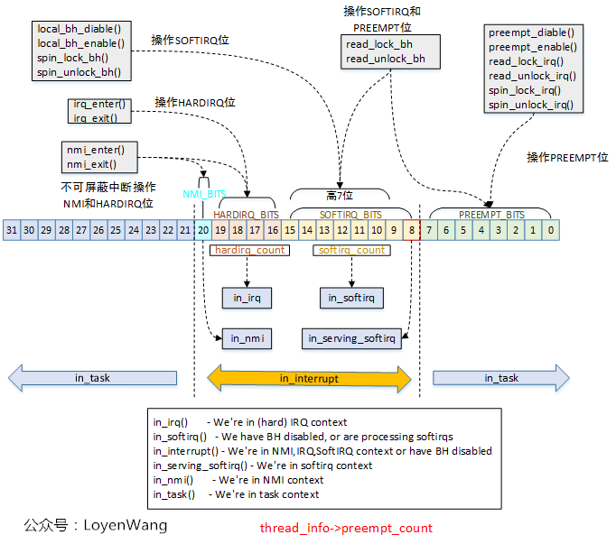

# Preemption

<p align="center">
  
</p>
<p align="center">
from LoyenWang
</p>


中断，`raise_softirq`，中断结束，如果有中断 pending，继续进行中断，
没有中断，开始进行 softirq 来将任务回收。

- [ ] 这个图有点问题，没有 `PREEMPT_NEED_RESCHED`
- [ ] 为什么都是需要好几个位，是用于计数吗? 还是直接访问的


https://github.com/torvalds/linux/blob/70664fc10c0d722ec79d746d8ac1db8546c94114/include/linux/preempt.h#L14-L30

## Questions
- arch/arm64/arm.c:kvm_arch_vcpu_ioctl_run 中，有一个 handle_exit_early 必须在打开 preemption 之前执行的代码
  - 我是一直没有理解什么样的代码不能被 preemption 的。
- gather_bootmem_prealloc 为什么需要有 cond_resched

- preemption 让内核必须给每一个 thread 配置一个内核栈，而不是每一个 CPU 一个。

## [ ] preemption 和 softirq 都是可以嵌套的，但是 hwirq 不可以

从这个回答，中断是可以的嵌套的，但是我认为这个操作是错误的:
- https://stackoverflow.com/questions/34527763/linux-nested-interrupts
- https://stackoverflow.com/questions/5934402/can-an-interrupt-handler-be-preempted

重新参考这里才是正确的：
https://linux-kernel-labs.github.io/refs/heads/master/lectures/interrupts.html

- https://lwn.net/Articles/380937/

替换为 github 的链接吧!

- [ ] `CONFIG_PREEMPT_RT`

1. 三个 config 是什么意思？
  1. 打开和不打开的区别是什么？
2. 直接访问的代码

- `DEFINE_IDTENTRY_IRQ`
  - `run_irq_on_irqstack_cond`
    - `call_on_irqstack_cond`
      - `irq_exit_rcu`

- `call_on_irqstack_cond` 中为什么要使用，既然 interrupts 不是嵌套的:
```c
        __this_cpu_write(hardirq_stack_inuse, false);       \
```

```c
/*
 * Macro to invoke system vector and device interrupt C handlers.
 */
#define call_on_irqstack_cond(func, regs, asm_call, constr, c_args...)  \
{                                   \
    /*                              \
     * User mode entry and interrupt on the irq stack do not    \
     * switch stacks. If from user mode the task stack is empty.    \
     */                             \
    if (user_mode(regs) || __this_cpu_read(hardirq_stack_inuse)) {  \
        irq_enter_rcu();                    \
        func(c_args);                       \
        irq_exit_rcu();                     \
    } else {                            \
        /*                          \
         * Mark the irq stack inuse _before_ and unmark _after_ \
         * switching stacks. Interrupts are disabled in both    \
         * places. Invoke the stack switch macro with the call  \
         * sequence which matches the above direct invocation.  \
         */                         \
        __this_cpu_write(hardirq_stack_inuse, true);        \
        call_on_irqstack(func, asm_call, constr);       \
        __this_cpu_write(hardirq_stack_inuse, false);       \
    }                               \
}


static inline void __irq_exit_rcu(void)
{
#ifndef __ARCH_IRQ_EXIT_IRQS_DISABLED
    local_irq_disable();
#else
    lockdep_assert_irqs_disabled();
#endif
    account_hardirq_exit(current);
    preempt_count_sub(HARDIRQ_OFFSET);
    if (!in_interrupt() && local_softirq_pending())
        invoke_softirq();

    tick_irq_exit();
}
```
- 如果是用户态，那么可以直接使用用户态中该 thread 在内核中的 stack 的，现在是空的，所以不用切换 stack 的。
- 如果当前的 stack 已经是 `hardirq_stack_inuse` 的了。
  - [ ] 应该不是嵌套 hrirq 导致的

- `irq_exit_rcu`
  - 其中的， 中的位置会调用到 `local_irq_disable`，我实在是无法理解的。
    - 在 `__do_softirq` 中会打开 irq 的。
  - `preempt_count_sub(HARDIRQ_OFFSET);` 是不是可以让 `!in_interrupt()` 总是成功哇
    - `in_interrupt` 中的是包括 softirq 的。

在 `invoke_softirq` 中，会根据 `CONFIG_HAVE_IRQ_EXIT_ON_IRQ_STACK` 分析到底是使用


```c
#ifndef CONFIG_PREEMPT_RT
/*
 * Macro to invoke __do_softirq on the irq stack. This is only called from
 * task context when bottom halves are about to be reenabled and soft
 * interrupts are pending to be processed. The interrupt stack cannot be in
 * use here.
 */
#define do_softirq_own_stack()                      \
{                                   \
    __this_cpu_write(hardirq_stack_inuse, true);            \
    call_on_irqstack(__do_softirq, ASM_CALL_ARG0);          \
    __this_cpu_write(hardirq_stack_inuse, false);           \
}

#endif
```
- [ ] 还是和 preempt 有关的，而且是关闭的时候才是如此。

- `do_softirq` 会接在 hwirq 的上下文中运行，如果这样，那么为什么还需要 softirq 的存在哇

> Since softirqs can reschedule themselves or other interrupts can occur that reschedules them, they can potentially lead to (temporary) process starvation if checks are not put into place. Currently, the Linux kernel does not allow running soft irqs for more than MAX_SOFTIRQ_TIME or rescheduling for more than MAX_SOFTIRQ_RESTART consecutive times.

- [ ] `do_softirq` 和 `raise_softirq` 的关系是什么?

# 所有的网络驱动都是使用 `raise_softirq` 参数是 NET，如何保证自己想要的操作最后可以被处理

# [ ] 还应该分析 中断线程化

## 关于 stack 的切换
- https://unix.stackexchange.com/questions/491437/how-does-linux-kernel-switches-from-kernel-stack-to-interrupt-stack
  - 这个描述是有问题的，从 `call_on_irqstack_cond` 看，实际上，没有必要。

## [ ] 在什么位置可以执行 softirq
- hardware irq 结束的位置的时候
- iperf 中的 `ip_finish_output2` 的代码。


## preemption
- [ ] config `PREEMPT_VOLUNTARY` ?
- [ ] comment above `__schedule`
- [ ] https://www.cnblogs.com/LoyenWang/p/12386281.html
- [ ] `TIF_NEED_RESCHED`
  - 没有看到 check 这个 flag 的代码在哪里

- `do_syscall_64`
  - `syscall_enter_from_user_mode`
  - `syscall_exit_to_user_mode`
    - `__syscall_exit_to_user_mode_work`
      - `syscall_exit_to_user_mode_prepare`
        - `exit_to_user_mode_loop`
          - 在其中检测是否存在有 `TIF_NEED_RESCHED`，如果有，调用 schedule 函数
    - `__exit_to_user_mode`

[ans](https://stackoverflow.com/questions/9473301/are-there-any-difference-between-kernel-preemption-and-interrupt)
> So preemption will only happen after an interrupt, but an interrupt doesn't always cause preemption.
https://stackoverflow.com/questions/40204506/what-is-the-difference-between-nonpreemptive-and-preemptive-kernels-when-switch


暂时没有分析 staic key，但是在 `raw_irqentry_exit_cond_resched` 的位置显示，是否抢占的确是可配置的。

[^7]
However, in nonpreemptive kernels, the current process cannot be replaced unless it is about to switch to User Mode.

Therefore, the main characteristic of a preemptive kernel is that a process running in
Kernel Mode can be replaced by another process while in the middle of a kernel
function.

- *一句话总结 : 如果没有打开，那么想要切换，只有在返回到用户态的时候才可以，打开之后，在 interrupt handle 的时候都会进行检查*
  - 当内核不能抢占，一个 user process 阻塞到内核态中间，其无法陷入休眠，并且总是占有 CPU (qemu 重甲测试一下 ?)
  - 一旦 disable 掉 preempt，可以保证接下来执行的代码都是在同一个 CPU 上的

[^7]:
it is greater than zero when any of the following cases occurs:
1. The kernel is executing an interrupt service routine.
2. The deferrable functions are disabled (always true when the kernel is executing a
softirq or tasklet).
3. The kernel preemption has been explicitly disabled by setting the preemption
counter to a positive value.
```c
#define preemptible()   (preempt_count() == 0 && !irqs_disabled())

void raw_irqentry_exit_cond_resched(void)
{
    if (!preempt_count()) {
        /* Sanity check RCU and thread stack */
        rcu_irq_exit_check_preempt();
        if (IS_ENABLED(CONFIG_DEBUG_ENTRY))
            WARN_ON_ONCE(!on_thread_stack());
        if (need_resched())
            preempt_schedule_irq();
    }
}
```


- [x] I can't find anything about `CONFIG_PREEMPT_NONE` when tracing `scheduler_tick` ?

`task_tick_fair` => `entity_tick` => `check_preempt_tick`

As `__schedule`'s comment say, `scheduler_tick` only set `TIF_NEED_RESCHED` flags on the thread.

- [x] `check_preempt_tick` and `check_preempt_wakeup`

former used by timer, latter by kernel code like ttwu
```c
const struct sched_class fair_sched_class = {
    .check_preempt_curr = check_preempt_wakeup,
```

- [ ] In fact there are three types of preemption !

detail `kernel/Kconfig.preempt`
- No Forced Preemption (Server)
- Voluntary Kernel Preemption (Desktop) `CONFIG_PREEMPT_VOLUNTARY`
- Preemptible Kernel (Low-Latency Desktop) `CONFIG_PREEMPT`

This's only place that `CONFIG_PREEMPT_VOLUNTARY` used !
```c
#ifdef CONFIG_PREEMPT_VOLUNTARY
extern int _cond_resched(void);
# define might_resched() _cond_resched()
#else
# define might_resched() do { } while (0)
#endif
```

#### preempt count
`CONFIG_PREEMPT` will select `CONFIG_PREEMPT_COUNT`

https://lwn.net/Articles/831678/ : valuable

- [ ] why preempt need a counter ?
- [ ] I need a more clear and strong reason : why if the process disasble interrupt, it shouldn't be preempted ?
- [ ] preempt.h : where preempt meets need_resched
- [ ] how `__preempt_count` enable ?
- [ ] how to explain `preemptible()` ?

```c
#define preemptible()   (preempt_count() == 0 && !irqs_disabled())
```

- [ ] `set_preempt_need_resched`
```c
/*
 * We fold the NEED_RESCHED bit into the preempt count such that
 * preempt_enable() can decrement and test for needing to reschedule with a
 * single instruction.
 *
 * We invert the actual bit, so that when the decrement hits 0 we know we both
 * need to resched (the bit is cleared) and can resched (no preempt count).
 */

static __always_inline void set_preempt_need_resched(void)
{
    raw_cpu_and_4(__preempt_count, ~PREEMPT_NEED_RESCHED);
}
```

- [ ] when will preempt happens ?
```c
asmlinkage __visible void __sched notrace preempt_schedule(void)
```


#### preempt locking
- https://www.kernel.org/doc/html/latest/locking/preempt-locking.html
  - [ ] 回答了问题，什么时候才可以关闭抢占。
- https://stackoverflow.com/questions/18254713/why-linux-disables-kernel-preemption-after-the-kernel-code-holds-a-spinlock

#### preempt notes

https://stackoverflow.com/questions/5283501/what-does-it-mean-to-say-linux-kernel-is-preemptive
> If the system allows that task to be preempted while it is running kernel code, then we have what is called a "preemptive kernel."

https://stackoverflow.com/questions/49414559/linux-kernel-why-preemption-is-disabled-when-use-per-cpu-variable
> There are preemption points throughout the kernel (might_sleep). Forcible preemption = each interrupt (including timer interrupts when time slices run out) is a possible preemption point.
>
> *when you finish your business and about to go back to user space your time slice is checked and if its done you go to another process instead of back to user space, so Im trying to understand how this dynamic work now*

really interesting : if one process is about to switch to user space and it's time slice is used up, just switch to another process.


#### preempt notifier
- One process can register multiple notifier
- `context_switch`
  - `prepare_task_switch`
    - `fire_sched_out_preempt_notifiers`
      - for each registered funcion
```c
struct task_struct {
// ...
#ifdef CONFIG_PREEMPT_NOTIFIERS
    /* List of struct preempt_notifier: */
    struct hlist_head       preempt_notifiers;
#endif

/**
 * preempt_notifier_register - tell me when current is being preempted & rescheduled
 * @notifier: notifier struct to register
 */
void preempt_notifier_register(struct preempt_notifier *notifier)
{
    if (!static_branch_unlikely(&preempt_notifier_key))
        WARN(1, "registering preempt_notifier while notifiers disabled\n");

    hlist_add_head(&notifier->link, &current->preempt_notifiers);
}

static void __fire_sched_in_preempt_notifiers(struct task_struct *curr)
{
    struct preempt_notifier *notifier;

    hlist_for_each_entry(notifier, &curr->preempt_notifiers, link)
        notifier->ops->sched_in(notifier, raw_smp_processor_id());
}
```

## 一些调用分析

### `resched_curr`

```txt
@[
    resched_curr+1
    check_preempt_curr+47
    ttwu_do_wakeup+23
    try_to_wake_up+577
    __softirqentry_text_start+667
    __irq_exit_rcu+181
    common_interrupt+184
    asm_common_interrupt+30
    native_safe_halt+11
    default_idle+10
    default_idle_call+50
    do_idle+478
    cpu_startup_entry+25
    start_secondary+278
    secondary_startup_64_no_verify+213
]: 1
@[
    resched_curr+1
    check_preempt_curr+47
    ttwu_do_wakeup+23
    sched_ttwu_pending+217
    __sysvec_call_function_single+41
    sysvec_call_function_single+79
    asm_sysvec_call_function_single+18
    find_busiest_group+398
    load_balance+392
    rebalance_domains+633
    __softirqentry_text_start+238
    __irq_exit_rcu+181
    sysvec_apic_timer_interrupt+162
    asm_sysvec_apic_timer_interrupt+18
    native_safe_halt+11
    default_idle+10
    default_idle_call+50
    do_idle+478
    cpu_startup_entry+25
    start_secondary+278
    secondary_startup_64_no_verify+213
]: 1
@[
    resched_curr+1
    check_preempt_curr+47
    ttwu_do_wakeup+23
    try_to_wake_up+577
    __queue_work+466
    queue_work_on+53
    call_timer_fn+39
    __run_timers.part.0+462
    run_timer_softirq+49
    __softirqentry_text_start+238
    __irq_exit_rcu+181
    sysvec_apic_timer_interrupt+162
    asm_sysvec_apic_timer_interrupt+18
    native_safe_halt+11
    default_idle+10
    default_idle_call+50
    do_idle+478
    cpu_startup_entry+25
    start_secondary+278
    secondary_startup_64_no_verify+213
]: 1
@[
    resched_curr+1
    check_preempt_curr+47
    ttwu_do_wakeup+23
    try_to_wake_up+577
    autoremove_wake_function+17
    __wake_up_common+128
    __wake_up_common_lock+124
    ep_poll_callback+279
    __wake_up_common+128
    timerfd_tmrproc+68
    __hrtimer_run_queues+298
    hrtimer_interrupt+262
    __sysvec_apic_timer_interrupt+127
    sysvec_apic_timer_interrupt+157
    asm_sysvec_apic_timer_interrupt+18
    native_safe_halt+11
    default_idle+10
    default_idle_call+50
    do_idle+478
    cpu_startup_entry+25
    start_secondary+278
    secondary_startup_64_no_verify+213
]: 1
@[
    resched_curr+1
    check_preempt_curr+47
    ttwu_do_wakeup+23
    try_to_wake_up+577
    __queue_work+466
    call_timer_fn+39
    __run_timers.part.0+365
    __softirqentry_text_start+238
    __irq_exit_rcu+181
    sysvec_apic_timer_interrupt+162
    asm_sysvec_apic_timer_interrupt+18
    finish_task_switch.isra.0+148
    __schedule+714
    schedule_idle+38
    do_idle+350
    cpu_startup_entry+25
    start_secondary+278
    secondary_startup_64_no_verify+213
]: 1
@[
    resched_curr+1
    check_preempt_curr+47
    ttwu_do_wakeup+23
    try_to_wake_up+577
    pollwake+116
    __wake_up_common+128
    __wake_up_common_lock+124
    sock_def_readable+60
    tcp_data_queue+2152
    tcp_rcv_established+534
    tcp_v4_do_rcv+331
    tcp_v4_rcv+3569
    ip_protocol_deliver_rcu+51
    ip_local_deliver_finish+115
    ip_sublist_rcv_finish+124
    ip_sublist_rcv+401
    ip_list_rcv+306
    __netif_receive_skb_list_core+656
    netif_receive_skb_list_internal+433
    napi_complete_done+111
    virtnet_poll+959
    __napi_poll+44
    net_rx_action+571
    __softirqentry_text_start+238
    __irq_exit_rcu+181
    common_interrupt+184
    asm_common_interrupt+30
    native_safe_halt+11
    default_idle+10
    default_idle_call+50
    do_idle+478
    cpu_startup_entry+25
    start_secondary+278
    secondary_startup_64_no_verify+213
]: 1
@[
    resched_curr+1
    check_preempt_curr+47
    ttwu_do_wakeup+23
    try_to_wake_up+577
    __queue_work+466
    call_timer_fn+39
    __run_timers.part.0+365
    __softirqentry_text_start+238
    __irq_exit_rcu+181
    sysvec_apic_timer_interrupt+162
    asm_sysvec_apic_timer_interrupt+18
    native_safe_halt+11
    default_idle+10
    default_idle_call+50
    do_idle+478
    cpu_startup_entry+25
    start_secondary+278
    secondary_startup_64_no_verify+213
]: 2
@[
    resched_curr+1
    check_preempt_curr+47
    ttwu_do_wakeup+23
    try_to_wake_up+577
    __queue_work+466
    call_timer_fn+39
    __run_timers.part.0+365
    run_timer_softirq+49
    __softirqentry_text_start+238
    __irq_exit_rcu+181
    sysvec_apic_timer_interrupt+162
    asm_sysvec_apic_timer_interrupt+18
    native_safe_halt+11
    default_idle+10
    default_idle_call+50
    do_idle+478
    cpu_startup_entry+25
    rest_init+204
    arch_call_rest_init+10
    start_kernel+1692
    secondary_startup_64_no_verify+213
]: 2
@[
    resched_curr+1
    check_preempt_wakeup+380
    check_preempt_curr+85
    ttwu_do_wakeup+23
    try_to_wake_up+577
    wq_worker_sleeping+112
    schedule+42
    schedule_timeout+136
    __sched_text_start+76
    __wait_for_common+147
    blk_execute_rq+205
    __scsi_execute+249
    sr_check_events+160
    cdrom_check_events+26
    disk_check_events+58
    process_one_work+485
    worker_thread+80
    kthread+232
    ret_from_fork+34
]: 2
@[
    resched_curr+1
    check_preempt_curr+47
    ttwu_do_wakeup+23
    try_to_wake_up+577
    complete+65
    scsi_end_request+222
    scsi_io_completion+106
    blk_complete_reqs+64
    __softirqentry_text_start+238
    __irq_exit_rcu+181
    sysvec_call_function_single+162
    asm_sysvec_call_function_single+18
    native_safe_halt+11
    default_idle+10
    default_idle_call+50
    do_idle+478
    cpu_startup_entry+25
    start_secondary+278
    secondary_startup_64_no_verify+213
]: 2
@[
    resched_curr+1
    check_preempt_curr+47
    ttwu_do_wakeup+23
    try_to_wake_up+577
    call_timer_fn+39
    __run_timers.part.0+462
    run_timer_softirq+49
    __softirqentry_text_start+238
    __irq_exit_rcu+181
    sysvec_apic_timer_interrupt+162
    asm_sysvec_apic_timer_interrupt+18
    native_safe_halt+11
    default_idle+10
    default_idle_call+50
    do_idle+478
    cpu_startup_entry+25
    start_secondary+278
    secondary_startup_64_no_verify+213
]: 7
@[
    resched_curr+1
    check_preempt_curr+47
    ttwu_do_wakeup+23
    try_to_wake_up+577
    __queue_work+466
    call_timer_fn+39
    __run_timers.part.0+365
    run_timer_softirq+49
    __softirqentry_text_start+238
    __irq_exit_rcu+181
    sysvec_apic_timer_interrupt+162
    asm_sysvec_apic_timer_interrupt+18
    native_safe_halt+11
    default_idle+10
    default_idle_call+50
    do_idle+478
    cpu_startup_entry+25
    start_secondary+278
    secondary_startup_64_no_verify+213
]: 9
@[
    resched_curr+1
    check_preempt_curr+47
    ttwu_do_wakeup+23
    try_to_wake_up+577
    __queue_work+466
    queue_work_on+53
    cursor_timer_handler+40
    call_timer_fn+39
    __run_timers.part.0+462
    run_timer_softirq+49
    __softirqentry_text_start+238
    __irq_exit_rcu+181
    sysvec_apic_timer_interrupt+162
    asm_sysvec_apic_timer_interrupt+18
    native_safe_halt+11
    default_idle+10
    default_idle_call+50
    do_idle+478
    cpu_startup_entry+25
    start_secondary+278
    secondary_startup_64_no_verify+213
]: 12
@[
    resched_curr+1
    check_preempt_curr+47
    ttwu_do_wakeup+23
    try_to_wake_up+577
    __queue_work+466
    queue_work_on+53
    handle_irq_event+69
    handle_edge_irq+177
    __common_interrupt+108
    common_interrupt+179
    asm_common_interrupt+30
    native_safe_halt+11
    default_idle+10
    default_idle_call+50
    do_idle+478
    cpu_startup_entry+25
    start_secondary+278
    secondary_startup_64_no_verify+213
]: 14
@[
    resched_curr+1
    check_preempt_curr+47
    ttwu_do_wakeup+23
    sched_ttwu_pending+217
    __sysvec_call_function_single+41
    sysvec_call_function_single+157
    asm_sysvec_call_function_single+18
    native_safe_halt+11
    default_idle+10
    default_idle_call+50
    do_idle+478
    cpu_startup_entry+25
    start_secondary+278
    secondary_startup_64_no_verify+213
]: 26
@[
    resched_curr+1
    check_preempt_curr+47
    ttwu_do_wakeup+23
    try_to_wake_up+577
    hrtimer_wakeup+30
    __hrtimer_run_queues+298
    hrtimer_interrupt+262
    __sysvec_apic_timer_interrupt+127
    sysvec_apic_timer_interrupt+157
    asm_sysvec_apic_timer_interrupt+18
    native_safe_halt+11
    default_idle+10
    default_idle_call+50
    do_idle+478
    cpu_startup_entry+25
    start_secondary+278
    secondary_startup_64_no_verify+213
]: 100
➜  tmp-trace-softirq git:(master) ✗
```

### `exit_to_user_mode_prepare`


```txt
@[
    exit_to_user_mode_prepare+1
    irqentry_exit_to_user_mode+5
    asm_exc_page_fault+30
]: 3
@[
    exit_to_user_mode_prepare+1
    irqentry_exit_to_user_mode+5
    asm_sysvec_apic_timer_interrupt+18
]: 4
@[
    exit_to_user_mode_prepare+1
    syscall_exit_to_user_mode+34
    do_syscall_64+72
    entry_SYSCALL_64_after_hwframe+68
]: 225
```
