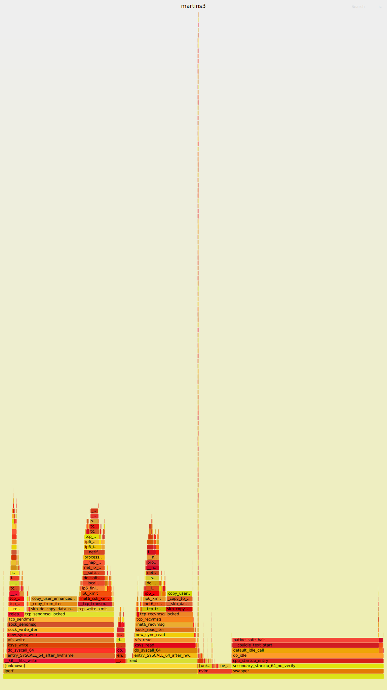

# softirq

softirq 是内核中非常重要的一个议题，基本上属于已经被反反复复的分析过，我看完各种教程之后，去看对应的代码，
总是还是感觉迷迷糊糊的，所以在这里总结的一下我的理解。

## 深入理解一下，为什么需要 `spin_lock_bh`
- https://www.kernel.org/doc/htmldocs/kernel-locking/lock-user-bh.html

```c
static __always_inline void spin_lock_bh(spinlock_t *lock)
{
    raw_spin_lock_bh(&lock->rlock);
}
```
执行的内容：屏蔽 softirq，然后 spin lock

- 检测的代码：暂时没有找到。
  - 应该是，

## TODO
- [ ] /proc/stat 关于 softirq 的统计是什么 ？

## Notes



- [ ] 从上面的截图看，无论是 read / write 其中都是会经过 `__tcp_transmit_skb`

- `ip6_finish_output2`
  - `rcu_read_lock_bh` : 这里有好几个锁的检测机制，不过都是需要打开额外的 config 才会启动
    - `local_bh_enable` ：
      - `__local_bh_enable_ip(_THIS_IP_, SOFTIRQ_DISABLE_OFFSET);`
  - `neigh_output`
  - `rcu_read_unlock_bh`


`softirq_action` 可能是紧跟着 hardirq 执行的，也可能是在 softirqd 中间执行的。


```c
static __init int spawn_ksoftirqd(void)
{
    cpuhp_setup_state_nocalls(CPUHP_SOFTIRQ_DEAD, "softirq:dead", NULL,
                  takeover_tasklets);
    BUG_ON(smpboot_register_percpu_thread(&softirq_threads));

    return 0;
}
```
一个小证据，从 nvme 到 softirq : 在 `queue_request_irq` 注册 irq handler 为 `nvme_irq`

- `nvme_irq`
  - `nvme_process_cq`
    - `nvme_handle_cqe`
      - `nvme_try_complete_req`
        - `blk_mq_complete_request_remote`
          - `blk_mq_raise_softirq`

- `raise_softirq_irqoff` : 比 `raise_softirq` 的用户更多，比如网络, 其注释也印证了想法，那就是 softirq 可以直接在上下文中间执行，也可以在 ksoftirq 中间执行

```c
/*
 * This function must run with irqs disabled!
 */
inline void raise_softirq_irqoff(unsigned int nr)
{
    __raise_softirq_irqoff(nr);

    /*
     * If we're in an interrupt or softirq, we're done
     * (this also catches softirq-disabled code). We will
     * actually run the softirq once we return from
     * the irq or softirq.
     *
     * Otherwise we wake up ksoftirqd to make sure we
     * schedule the softirq soon.
     */
    if (!in_interrupt())
        wakeup_softirqd();
}
```

- `raise_softirq` 对于 `in_interrupt` 的判断还隐藏一个重要的内容 : 如果一个代码被 `spin_lock_bh` 保护，那么在代码中间，可以发生 hardirq，但是无法进一步的发生 softirq 操作，而 spin_unlock_bh 会调用 do_softirq
  - `raise_softirq` 自带屏蔽 preempt 功能，对于 softirqd 显然也是无法切入进来的
  - 所以，无论是，hardirq 携带的 softirq，还是 ksoftirqd 携带的 softirq 都是无法进入的

- 到底 softirq 和 hardirq 放到一起执行的，还是 softirq 在 ksoftirqd 中间执行:
  - 在 `invoke_softirq` 中间对于内核参数 `force_irqthreads` 进行判断，如果是，那么所有的 softirq 都是在 ksoftirqd 中间执行的
  - 似乎存在一些 softirq 无法立刻被执行(防止 starve 其他的代码), 这些可能被之后 `wakeup_softirqd` 的时候执行

> Pending softirqs are checked for and executed in the following places:
> - In the return from hardware interrupt code path
> - In the ksoftirqd kernel thread
> - In any code that explicitly checks for and executes pending softirqs, such as the networking subsystem
>
> LKD chapter 8

- Most important, work queues are schedulable and can therefore sleep
    - softirq 和 tasklet 都是不能 sleep
      - 虽然在 ksoftirqd 中间是可以睡眠的，但是无法保证所有的 `softirq_action` 都是在其中执行的

## softirq 是一定在 中断的上下文中执行吗
### 需要自习观察一下，从中断上下文到的 task 的切换

## `rcu_read_lock_bh`
- `rcu_read_unlock_bh` 的时候，就可以发生 softirq
  - `__local_bh_enable_ip(_THIS_IP_, SOFTIRQ_DISABLE_OFFSET);`

```c
void __local_bh_enable_ip(unsigned long ip, unsigned int cnt)
{
    WARN_ON_ONCE(in_hardirq());
    lockdep_assert_irqs_enabled();
    /*
     * Are softirqs going to be turned on now:
     */
    if (softirq_count() == SOFTIRQ_DISABLE_OFFSET)
        lockdep_softirqs_on(ip);
    /*
     * Keep preemption disabled until we are done with
     * softirq processing:
     */
    __preempt_count_sub(cnt - 1);

    if (unlikely(!in_interrupt() && local_softirq_pending())) {
        /*
         * Run softirq if any pending. And do it in its own stack
         * as we may be calling this deep in a task call stack already.
         */
        do_softirq();
    }

    preempt_count_dec();
    preempt_check_resched();
}
```

## 让我多看点资料吧
- [ ] https://stackoverflow.com/questions/45066524/can-hard-and-soft-irq-for-the-same-network-packet-be-executed-on-different-cpu-c
  - 深入分析了 RPS
- https://0xax.gitbooks.io/linux-insides/content/Interrupts/linux-interrupts-9.html

## RPS : 将 softirq 迁移到其他的 CPU 中

## softirq 将 lock 迁移的位置有什么关系哇

## [ ] 无法理解为什么 lock 需要考虑 softirq

## [ ] 运行 softirq 的 stack 的是在哪里


## 区分 `do_softirq` 和 `raise_softirq`

- `raise_softirq` : 发送请求，说存在中断已经好了
  - [ ] 为什么要关闭中断

```txt
@[
    raise_softirq+1
    trigger_load_balance+131
    update_process_times+176
    tick_sched_handle+52
    tick_sched_timer+122
    __hrtimer_run_queues+298
    hrtimer_interrupt+252
    __sysvec_apic_timer_interrupt+92
    sysvec_apic_timer_interrupt+55
    asm_sysvec_apic_timer_interrupt+18
]: 217
@[
    do_softirq+1
    __local_bh_enable_ip+75
    ip_finish_output2+399
    __ip_queue_xmit+370
    __tcp_transmit_skb+2600
    tcp_write_xmit+909
    tcp_sendmsg_locked+716
    tcp_sendmsg+40
    sock_sendmsg+87
    sock_write_iter+151
    new_sync_write+409
    vfs_write+462
    ksys_write+167
    do_syscall_64+59
    entry_SYSCALL_64_after_hwframe+68
]: 334
@[
    raise_softirq+1
    rcu_sched_clock_irq+337
    update_process_times+140
    tick_sched_handle+52
    tick_sched_timer+122
    __hrtimer_run_queues+298
    hrtimer_interrupt+252
    __sysvec_apic_timer_interrupt+92
    sysvec_apic_timer_interrupt+55
    asm_sysvec_apic_timer_interrupt+18
]: 352
@[
    raise_softirq+1
    trigger_load_balance+131
    update_process_times+176
    tick_sched_handle+52
    tick_sched_timer+122
    __hrtimer_run_queues+298
    hrtimer_interrupt+252
    __sysvec_apic_timer_interrupt+92
    sysvec_apic_timer_interrupt+109
    asm_sysvec_apic_timer_interrupt+18
    native_safe_halt+11
    __cpuidle_text_start+10
    default_idle_call+53
    do_idle+501
    cpu_startup_entry+25
    secondary_startup_64_no_verify+194
]: 451
@[
    raise_softirq+1
    update_process_times+133
    tick_sched_handle+52
    tick_sched_timer+122
    __hrtimer_run_queues+298
    hrtimer_interrupt+252
    __sysvec_apic_timer_interrupt+92
    sysvec_apic_timer_interrupt+109
    asm_sysvec_apic_timer_interrupt+18
    native_safe_halt+11
    __cpuidle_text_start+10
    default_idle_call+53
    do_idle+501
    cpu_startup_entry+25
    secondary_startup_64_no_verify+194
]: 873
@[
    raise_softirq+1
    rcu_sched_clock_irq+337
    update_process_times+140
    tick_sched_handle+52
    tick_sched_timer+122
    __hrtimer_run_queues+298
    hrtimer_interrupt+252
    __sysvec_apic_timer_interrupt+92
    sysvec_apic_timer_interrupt+109
    asm_sysvec_apic_timer_interrupt+18
    native_safe_halt+11
    __cpuidle_text_start+10
    default_idle_call+53
    do_idle+501
    cpu_startup_entry+25
    secondary_startup_64_no_verify+194
]: 1832
➜  tmp-trace-softirq git:(master) ✗
```
