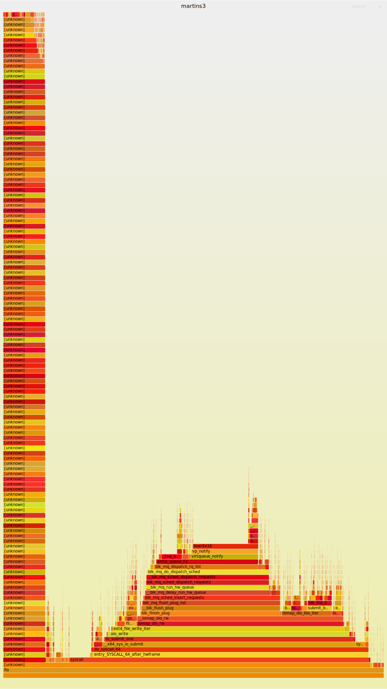

# aio


## 基本使用
- https://github.com/littledan/linux-aio
- https://gist.github.com/larytet/87f90b08643ac3de934df2cadff4989c : 这个的代码更加好

## aio 可以替代 epoll
https://blog.cloudflare.com/io_submit-the-epoll-alternative-youve-never-heard-about/

## 源码分析
- https://zhuanlan.zhihu.com/p/368913613

## 的确不会拷贝，但是那是在没有 buffer 的情况下
- 那么 write 的拷贝在什么位置?

direct=1 非常重要

- https://github.com/axboe/fio/issues/512

- ext4_file_write_iter
  - ext4_dio_write_iter
    - iomap_dio_rw
      - `__iomap_dio_rw`
        - blk_finish_plug
  - ext4_buffered_write_iter
    - generic_perform_write ：提交
    - generic_write_sync ： 同步

使用
```txt
➜  linux git:(master) ✗ flamegraph -c "taskset -c 5 fio 4k-read.fio" -b 5
```



## 从这个看， iomap_dio_rw 是处理所有的 sync 的位置

- https://patchwork.kernel.org/project/linux-fsdevel/patch/20180418040828.18165-3-david@fromorbit.com/

实际上，取决于文件的打开方式，aio 也可以走 buffer 的 IO 的:


这个是调用 sync 的时候触发的:
```txt
#0  virtio_queue_rq (hctx=0xffff888100776400, bd=0xffffc90000cbfd70) at drivers/block/virtio_blk.c:339
#1  0xffffffff8161312f in blk_mq_dispatch_rq_list (hctx=hctx@entry=0xffff888100776400, list=list@entry=0xffffc90000cbfdc0, nr_budgets=nr_budgets@entry=0) at block/blk-mq.c:1902
#2  0xffffffff81619423 in __blk_mq_sched_dispatch_requests (hctx=hctx@entry=0xffff888100776400) at block/blk-mq-sched.c:306
#3  0xffffffff81619500 in blk_mq_sched_dispatch_requests (hctx=hctx@entry=0xffff888100776400) at block/blk-mq-sched.c:339
#4  0xffffffff8160ff50 in __blk_mq_run_hw_queue (hctx=0xffff888100776400) at block/blk-mq.c:2020
#5  0xffffffff81610200 in __blk_mq_delay_run_hw_queue (hctx=<optimized out>, async=<optimized out>, msecs=msecs@entry=0) at block/blk-mq.c:2096
#6  0xffffffff81610469 in blk_mq_run_hw_queue (hctx=<optimized out>, async=async@entry=false) at block/blk-mq.c:2144
#7  0xffffffff81610800 in blk_mq_run_hw_queues (q=q@entry=0xffff888100c39fc8, async=async@entry=false) at block/blk-mq.c:2192
#8  0xffffffff8161133b in blk_mq_requeue_work (work=0xffff888100c3a1f8) at block/blk-mq.c:1361
#9  0xffffffff81122d37 in process_one_work (worker=worker@entry=0xffff88810062e180, work=0xffff888100c3a1f8) at kernel/workqueue.c:2289
#10 0xffffffff811232c8 in worker_thread (__worker=0xffff88810062e180) at kernel/workqueue.c:2436
#11 0xffffffff81129c73 in kthread (_create=0xffff88810062f0c0) at kernel/kthread.c:376
#12 0xffffffff81001a72 in ret_from_fork () at arch/x86/entry/entry_64.S:306
#13 0x0000000000000000 in ?? ()
```

## 难道是在这个位置 iomap_dio_complete

在其中 generic_write_sync 被忽视，但是普通的 write 是没有的。

```txt
#0  generic_write_sync (count=208, iocb=0xffffc9000117fea0) at include/linux/fs.h:2868
#1  generic_file_write_iter (iocb=0xffffc9000117fea0, from=0xffffc9000117fe78) at mm/filemap.c:3902
#2  0xffffffff8134aebc in call_write_iter (iter=0xffffc9000117fe78, kio=0xffffc9000117fea0, file=0xffff88810be2d000) at include/linux/fs.h:2187
#3  new_sync_write (ppos=0xffffc9000117ff08, len=208, buf=0x560c03d9d1c0 "# This is private data. Do not parse\nPRIORITY=30\nLEVEL_PREFIX=1\nFORWARD_TO_SYSLOG=0\nFORWARD_TO_KMSG=0\nFORWARD_TO_CONSOLE=0\nSTREAM_ID=83672c30d67c42968afbd72f2873b5ed\nIDENTIFIER=dnf\nUNIT=dnf-makecache."..., filp=0xffff88810be2d000) at fs/read_write.c:491
#4  vfs_write (file=file@entry=0xffff88810be2d000, buf=buf@entry=0x560c03d9d1c0 "# This is private data. Do not parse\nPRIORITY=30\nLEVEL_PREFIX=1\nFORWARD_TO_SYSLOG=0\nFORWARD_TO_KMSG=0\nFORWARD_TO_CONSOLE=0\nSTREAM_ID=83672c30d67c42968afbd72f2873b5ed\nIDENTIFIER=dnf\nUNIT=dnf-makecache."..., count=count@entry=208, pos=pos@entry=0xffffc9000117ff08) at fs/read_write.c:578
#5  0xffffffff8134b28a in ksys_write (fd=<optimized out>, buf=0x560c03d9d1c0 "# This is private data. Do not parse\nPRIORITY=30\nLEVEL_PREFIX=1\nFORWARD_TO_SYSLOG=0\nFORWARD_TO_KMSG=0\nFORWARD_TO_CONSOLE=0\nSTREAM_ID=83672c30d67c42968afbd72f2873b5ed\nIDENTIFIER=dnf\nUNIT=dnf-makecache."..., count=208) at fs/read_write.c:631
#6  0xffffffff81f18ceb in do_syscall_x64 (nr=<optimized out>, regs=0xffffc9000117ff58) at arch/x86/entry/common.c:50
#7  do_syscall_64 (regs=0xffffc9000117ff58, nr=<optimized out>) at arch/x86/entry/common.c:80
```
