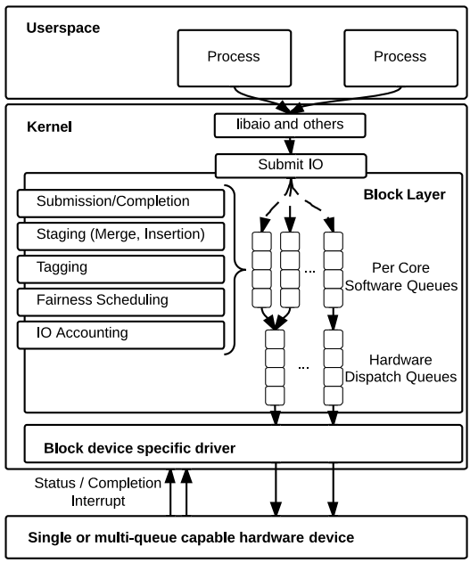

# io scheduer

一共存在三个 io scheduler :
```txt
obj-$(CONFIG_MQ_IOSCHED_DEADLINE)	+= mq-deadline.o
obj-$(CONFIG_MQ_IOSCHED_KYBER)	+= kyber-iosched.o
obj-$(CONFIG_IOSCHED_BFQ)	+= bfq.o
```

## 检查一下当前的 io scheduler
🧀  cat /sys/block/sda/queue/scheduler
[mq-deadline] kyber none

🧀  cat /sys/block/nvme0n1/queue/scheduler
[none] mq-deadline kyber

## io scheduler 和 multiqueue 的层次关系

其实相当于说，在 queue 中，完成各种工作，其中包括 elevator 的



```txt
#0  dd_request_merge (q=0xffff888140f65470, rq=0xffffc900402efa60, bio=0xffff888020d35900) at block/mq-deadline.c:720
#1  0xffffffff816c7c45 in blk_mq_sched_try_merge (q=q@entry=0xffff888140f65470, bio=bio@entry=0xffff888020d35900, nr_segs=nr_segs@entry=1, merged_request=merged_request@entry=0xffffc900402efa98) at block/blk-merge.c:1126
#2  0xffffffff816eaef6 in dd_bio_merge (q=0xffff888140f65470, bio=0xffff888020d35900, nr_segs=1) at block/mq-deadline.c:758
#3  0xffffffff816cf5d5 in blk_mq_get_new_requests (nsegs=1, bio=0xffff888020d35900, plug=0x0 <fixed_percpu_data>, q=0xffff888140f65470) at block/blk-mq.c:2867
#4  blk_mq_submit_bio (bio=<optimized out>) at block/blk-mq.c:2966
#5  0xffffffff816c0322 in __submit_bio (bio=<optimized out>) at block/blk-core.c:606
#6  0xffffffff816c08aa in __submit_bio_noacct_mq (bio=<optimized out>) at block/blk-core.c:683
#7  submit_bio_noacct_nocheck (bio=<optimized out>) at block/blk-core.c:700
#8  submit_bio_noacct_nocheck (bio=<optimized out>) at block/blk-core.c:689
#9  0xffffffff81413cec in submit_bh (bh=<optimized out>, opf=0) at fs/buffer.c:2707
#10 block_read_full_folio (folio=0xffffea00007a1600, get_block=0xffffffff816b7ec0 <blkdev_get_block>) at fs/buffer.c:2325
#11 0xffffffff812dfcca in filemap_read_folio (file=0xffff888140f65470, filler=0xffffffff816eade0 <dd_request_merge>, folio=0xffffea00007a1600) at mm/filemap.c:2426
#12 0xffffffff812e187e in do_read_cache_folio (mapping=0xffff888140970508, index=index@entry=0, filler=0xffffffff816b7f20 <blkdev_read_folio>, filler@entry=0x0 <fixed_percpu_data>, file=file@entry=0x0 <fixed_percpu_data>, gfp=1051840) at mm/filemap.c:3553
#13 0xffffffff812e195d in read_cache_folio (mapping=<optimized out>, index=index@entry=0, filler=filler@entry=0x0 <fixed_percpu_data>, file=file@entry=0x0 <fixed_percpu_data>) at ./include/linux/pagemap.h:274
#14 0xffffffff816dad11 in read_mapping_folio (file=0x0 <fixed_percpu_data>, index=0, mapping=<optimized out>) at ./include/linux/pagemap.h:761
#15 read_part_sector (state=state@entry=0xffff88815696e3c0, n=n@entry=0, p=p@entry=0xffffc900402efcc8) at block/partitions/core.c:717
#16 0xffffffff816db745 in read_lba (state=state@entry=0xffff88815696e3c0, lba=lba@entry=0, buffer=buffer@entry=0xffff88815b56a400 "", count=count@entry=512) at block/partitions/efi.c:248
#17 0xffffffff816dbb0d in find_valid_gpt (ptes=<optimized out>, gpt=<optimized out>, state=<optimized out>) at block/partitions/efi.c:603
#18 efi_partition (state=0xffff88815696e3c0) at block/partitions/efi.c:720
#19 0xffffffff816daab5 in check_partition (hd=0xffff888005d7a000) at block/partitions/core.c:146
#20 blk_add_partitions (disk=0xffff888005d7a000) at block/partitions/core.c:602
#21 bdev_disk_changed (invalidate=<optimized out>, disk=<optimized out>) at block/partitions/core.c:688
#22 bdev_disk_changed (disk=disk@entry=0xffff888005d7a000, invalidate=invalidate@entry=false) at block/partitions/core.c:655
#23 0xffffffff816b6a55 in blkdev_get_whole (bdev=bdev@entry=0xffff888140970000, mode=mode@entry=1212809309) at block/bdev.c:685
#24 0xffffffff816b773d in blkdev_get_by_dev (dev=<optimized out>, mode=mode@entry=1212809309, holder=holder@entry=0x0 <fixed_percpu_data>) at block/bdev.c:822
#25 0xffffffff816b7960 in blkdev_get_by_dev (dev=<optimized out>, mode=mode@entry=1212809309, holder=holder@entry=0x0 <fixed_percpu_data>) at block/bdev.c:856
#26 0xffffffff816d826b in disk_scan_partitions (disk=<optimized out>, mode=1212809309, owner=owner@entry=0xffff888026a33e00) at block/genhd.c:374
#27 0xffffffff816d5bd3 in blkdev_common_ioctl (file=file@entry=0xffff888026a33e00, mode=mode@entry=1212809309, cmd=cmd@entry=4703, arg=arg@entry=0, argp=argp@entry=0x0 <fixed_percpu_data>) at block/ioctl.c:531
#28 0xffffffff816d64b1 in blkdev_ioctl (file=0xffff888026a33e00, cmd=4703, arg=0) at block/ioctl.c:610
#29 0xffffffff813ded56 in vfs_ioctl (arg=0, cmd=<optimized out>, filp=0xffff888026a33e00) at fs/ioctl.c:51
#30 __do_sys_ioctl (arg=0, cmd=<optimized out>, fd=<optimized out>) at fs/ioctl.c:870
#31 __se_sys_ioctl (arg=0, cmd=<optimized out>, fd=<optimized out>) at fs/ioctl.c:856
#32 __x64_sys_ioctl (regs=<optimized out>) at fs/ioctl.c:856
#33 0xffffffff82176b8c in do_syscall_x64 (nr=<optimized out>, regs=0xffffc900402eff58) at arch/x86/entry/common.c:50
#34 do_syscall_64 (regs=0xffffc900402eff58, nr=<optimized out>) at arch/x86/entry/common.c:80
#35 0xffffffff822000ae in entry_SYSCALL_64 () at arch/x86/entry/entry_64.S:120
```

```txt
#0  elv_merge (q=0xffff888140f65470, req=0xffffc900404a79a0, bio=0xffff888116260000) at block/elevator.c:278
#1  0xffffffff816c7c45 in blk_mq_sched_try_merge (q=q@entry=0xffff888140f65470, bio=bio@entry=0xffff888116260000, nr_segs=nr_segs@entry=1, merged_request=merged_request@entry=0xffffc900404a79d8) at block/blk-merge.c:1126
#2  0xffffffff816eaef6 in dd_bio_merge (q=0xffff888140f65470, bio=0xffff888116260000, nr_segs=1) at block/mq-deadline.c:758
#3  0xffffffff816cf5d5 in blk_mq_get_new_requests (nsegs=1, bio=0xffff888116260000, plug=0xffffc900404a7ba8, q=0xffff888140f65470) at block/blk-mq.c:2867
#4  blk_mq_submit_bio (bio=<optimized out>) at block/blk-mq.c:2966
```
