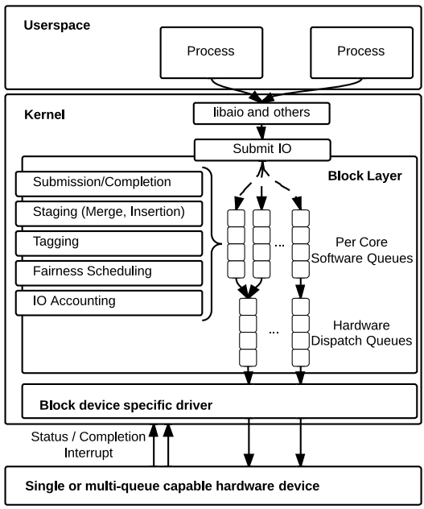

# multiqueue



- [ ] io scheduler 在什么地方?
- [ ] 这里一堆 workqueue 是做啥的?

## 收集一点 backtrace
```txt
#0  blk_mq_start_request (rq=rq@entry=0xffff888140d83180) at block/blk-mq.c:1249
#1  0xffffffff81a9ba13 in virtblk_prep_rq (vblk=<optimized out>, vblk=<optimized out>, vbr=0xffff888140d83288, req=0xffff888140d83180, hctx=0xffff888140646000) at drivers/block/virtio_blk.c:335
#2  virtblk_prep_rq_batch (req=0xffff888140d83180) at drivers/block/virtio_blk.c:394
#3  virtio_queue_rqs (rqlist=0xffffc900001cfd90) at drivers/block/virtio_blk.c:433
#4  0xffffffff816cf01c in __blk_mq_flush_plug_list (q=<optimized out>, q=<optimized out>, plug=0xffffc900001cfd90) at block/blk-mq.c:2731
#5  __blk_mq_flush_plug_list (plug=0xffffc900001cfd90, q=0xffff888004499ea8) at block/blk-mq.c:2726
#6  blk_mq_flush_plug_list (plug=plug@entry=0xffffc900001cfd90, from_schedule=from_schedule@entry=false) at block/blk-mq.c:2787
#7  0xffffffff816c1245 in __blk_flush_plug (plug=0xffffc900001cfd90, plug@entry=0xffffc900001cfd20, from_schedule=from_schedule@entry=false) at block/blk-core.c:1139
#8  0xffffffff816c1504 in blk_finish_plug (plug=0xffffc900001cfd20) at block/blk-core.c:1163
#9  blk_finish_plug (plug=plug@entry=0xffffc900001cfd90) at block/blk-core.c:1160
#10 0xffffffff8140488c in wb_writeback (wb=wb@entry=0xffff88815664d800, work=work@entry=0xffffc900001cfe30) at fs/fs-writeback.c:2097
#11 0xffffffff81405b49 in wb_check_background_flush (wb=0xffff88815664d800) at fs/fs-writeback.c:2131
#12 wb_do_writeback (wb=0xffff88815664d800) at fs/fs-writeback.c:2219
#13 wb_workfn (work=0xffff88815664d988) at fs/fs-writeback.c:2246
#14 0xffffffff8114bd04 in process_one_work (worker=worker@entry=0xffff88814066d000, work=0xffff88815664d988) at kernel/workqueue.c:2289
#15 0xffffffff8114bf2c in worker_thread (__worker=0xffff88814066d000) at kernel/workqueue.c:2436
#16 0xffffffff81154674 in kthread (_create=0xffff88814066e000) at kernel/kthread.c:376
#17 0xffffffff81002659 in ret_from_fork () at arch/x86/entry/entry_64.S:308
```

```txt
#0  blk_account_io_completion (req=0xffff888100f00300, bytes=12288) at block/blk-mq.c:799
#1  0xffffffff816ccae5 in blk_update_request (req=req@entry=0xffff888100f00300, error=error@entry=0 '\000', nr_bytes=12288) at block/blk-mq.c:914
#2  0xffffffff816cceb9 in blk_mq_end_request (rq=0xffff888100f00300, error=0 '\000') at block/blk-mq.c:1053
#3  0xffffffff81a99ca9 in virtblk_done (vq=0xffff888140cedb00) at drivers/block/virtio_blk.c:291
#4  0xffffffff818035c6 in vring_interrupt (irq=<optimized out>, _vq=0xffff888100f00300) at drivers/virtio/virtio_ring.c:2470
#5  vring_interrupt (irq=<optimized out>, _vq=0xffff888100f00300) at drivers/virtio/virtio_ring.c:2445
#6  0xffffffff811a3c72 in __handle_irq_event_percpu (desc=desc@entry=0xffff88810018d800) at kernel/irq/handle.c:158
#7  0xffffffff811a3e53 in handle_irq_event_percpu (desc=0xffff88810018d800) at kernel/irq/handle.c:193
#8  handle_irq_event (desc=desc@entry=0xffff88810018d800) at kernel/irq/handle.c:210
#9  0xffffffff811a8b2e in handle_edge_irq (desc=0xffff88810018d800) at kernel/irq/chip.c:819
#10 0xffffffff810ce1d5 in generic_handle_irq_desc (desc=0xffff88810018d800) at ./include/linux/irqdesc.h:158
#11 handle_irq (regs=<optimized out>, desc=0xffff88810018d800) at arch/x86/kernel/irq.c:231
#12 __common_interrupt (regs=<optimized out>, vector=34) at arch/x86/kernel/irq.c:250
#13 0xffffffff82178827 in common_interrupt (regs=0xffffc900402bbd68, error_code=<optimize
```


## [lwn : The multiqueue block layer](https://lwn.net/Articles/552904/)

> While requests are in the submission queue, they can be operated on by the block layer in the usual manner. Reordering of requests for locality offers **little** or no benefit on solid-state devices;
> indeed, spreading requests out across the device might help with the parallel processing of requests.
> So reordering will not be done, but coalescing requests will reduce the total number of I/O operations, improving performance somewhat.
> Since the submission queues are **per-CPU**, there is no way to coalesce requests submitted to different queues.
> With no empirical evidence whatsoever, your editor would guess that adjacent requests are most likely to come from the same process and,
> thus, will automatically find their way into the same submission queue, so the lack of cross-CPU coalescing is probably not a big problem.

> The block layer will move requests from the submission queues into the hardware queues up to the maximum number specified by the driver

- [ ] per cpu 一个 queue
- [ ] per hw 一个 queue
- [ ] per cpu 内部可以合并，但是外部不可以
- [ ] 超过设置的数值，将会一次性提交

## percpu 的软件队列: blk_mq_ctx
```c
/**
 * struct blk_mq_ctx - State for a software queue facing the submitting CPUs
 */
struct blk_mq_ctx {
	struct {
		spinlock_t		lock;
		struct list_head	rq_lists[HCTX_MAX_TYPES];
	} ____cacheline_aligned_in_smp;

	unsigned int		cpu;
	unsigned short		index_hw[HCTX_MAX_TYPES];
	struct blk_mq_hw_ctx 	*hctxs[HCTX_MAX_TYPES];

	struct request_queue	*queue;
	struct blk_mq_ctxs      *ctxs;
	struct kobject		kobj;
} ____cacheline_aligned_in_smp;
```

观察下是如何初始化的:
```txt
#0  blk_mq_init_allocated_queue (set=set@entry=0xffff88810091b830, q=q@entry=0xffff8881036d8de0) at block/blk-mq.c:4207
#1  0xffffffff81765cbe in blk_mq_init_queue_data (queuedata=0xffff88810091b800, set=set@entry=0xffff88810091b830) at block/blk-mq.c:4041
#2  __blk_mq_alloc_disk (set=set@entry=0xffff88810091b830, queuedata=queuedata@entry=0xffff88810091b800, lkclass=lkclass@entry=0xffffffff83a37ae0 <virtblk_queue_depth>) at block/blk-mq.c:4088
#3  0xffffffff81970e96 in virtblk_probe (vdev=0xffff8881063fa800) at drivers/block/virtio_blk.c:1397
#4  0xffffffff818c1670 in virtio_dev_probe (_d=0xffff8881063fa810) at drivers/virtio/virtio.c:305
#5  0xffffffff8194006f in call_driver_probe (drv=0xffffffff82e4a560 <virtio_blk>, dev=0xffff8881063fa810) at drivers/base/dd.c:579
```
- blk_mq_init_allocated_queue
  - blk_mq_alloc_ctxs : 分配软件队列
  - blk_mq_realloc_hw_ctxs : 分配硬件队列
  - blk_mq_init_cpu_queues

## 是如何提交到软件队列中去的
- 为什么 request_queue::queue_ctx 来做什么


- `__submit_bio`

### 从 request 中加入到 blk_mq_ctx 软件队列

- `__submit_bio`
  - blk_mq_submit_bio
    - blk_mq_get_new_requests
      - blk_mq_attempt_bio_merge : 在这里尝试 merge
    - blk_mq_get_cached_request
      - blk_mq_attempt_bio_merge : 在这里尝试 merge bio 到现有的 request 中
    - blk_mq_sched_insert_request : 这个应该是加入到软件队列的位置，但是实际上，根本没有 trace 到
      - `__blk_mq_insert_request`
        - `__blk_mq_insert_req_list` : 在这里，将 blk_mq_ctx::rq_lists

- blk_mq_init_cpu_queues : 所有的 blk_mq_ctx 都指向相同的 request_queue 了

### 从 blk_mq_ctx 加入到 blk_mq_hw_ctx

syscall 中提交:
```txt
__blk_mq_delay_run_hw_queue+1
blk_mq_sched_insert_requests+110
blk_mq_flush_plug_list+291
__blk_flush_plug+262
io_schedule+65
rq_qos_wait+191
wbt_wait+160
__rq_qos_throttle+36
blk_mq_submit_bio+645
submit_bio_noacct_nocheck+607
ext4_bio_write_page+484
mpage_submit_page+76
mpage_process_page_bufs+279
mpage_prepare_extent_to_map+512
ext4_do_writepages+673
ext4_writepages+161
do_writepages+208
__writeback_single_inode+65
writeback_sb_inodes+521
__writeback_inodes_wb+76
wb_writeback+471
wb_workfn+675
process_one_work+482
worker_thread+84
kthread+233
ret_from_fork+41
```

异步的向 disk 发送 reuest
```txt
@[
    blk_mq_dispatch_rq_list+5
    __blk_mq_sched_dispatch_requests+171
    blk_mq_sched_dispatch_requests+57
    __blk_mq_run_hw_queue+145
    blk_mq_run_hw_queues+105
    blk_mq_requeue_work+340
    process_one_work+482
    worker_thread+84
    kthread+233
    ret_from_fork+41
]: 15
```

- `blk_mq_dispatch_rq_list`
  - request_queue::mq_ops::queue_rq : 从这里就进入到 virtio-blk 中间了


## [ ] blk_mq_tag_set : 这个是做啥的?

- nvme_alloc_admin_tag_set
  - blk_mq_alloc_tag_set 将会分配如下内容:
    - blk_mq_tags : Tag address space map
    - blk_mq_queue_map : Map software queues to hardware queues

- [ ] 似乎是用于确定到底那些提交的 IO 已经完成了。

应该是在这个位置的: block/blk-mq-tag.c

分配 tag :
```txt
#0  blk_mq_get_tag (data=data@entry=0xffffc90001d03a78) at block/blk-mq-tag.c:129
#1  0xffffffff8175de22 in __blk_mq_alloc_requests (data=data@entry=0xffffc90001d03a78) at block/blk-mq.c:492
#2  0xffffffff8176368b in blk_mq_get_new_requests (nsegs=2, bio=0xffff888107d72300, plug=0xffffc90001d03c40, q=0xffff8881036d8de0) at block/blk-mq.c:2858
#3  blk_mq_submit_bio (bio=<optimized out>) at block/blk-mq.c:2954
#4  0xffffffff81753d7e in __submit_bio_noacct_mq (bio=0xffff888107d72300) at block/blk-core.c:673
#5  submit_bio_noacct_nocheck (bio=<optimized out>) at block/blk-core.c:702
#6  0xffffffff81753fc7 in submit_bio_noacct (bio=<optimized out>) at block/blk-core.c:801
```
- [ ] 我不理解的问题，非要使用如此逆天的技术吗?

## [Linux Block IO: Introducing Multi-queue SSD Access on Multi-core Systems](https://kernel.dk/systor13-final18.pdf)
Why we need block layer:
1. It is a convenience library to hide the complexity and diversity of storage devices from the application while providing common services that are valuable to applications.
2. In addition, the block layer implements IO-fairness, IO-error handling, IO-statistics, and IO-scheduling that improve performance and help protect end-users from poor or malicious implementations of other applications or device drivers.

Specifically, we identified three main problems:
1. Request Queue Locking
2. Hardware Interrupts
3. Remote Memory Accesses

reducing lock contention and remote memory accesses are key challenges when redesigning the block layer to scale on high NUMA-factor architectures.
Dealing efficiently with the high number of hardware interrupts is beyond the control of the block layer (more on this below) as the block layer cannot dictate how a
device driver interacts with its hardware.

Based on our analysis of the Linux block layer, we identify three major requirements for a block layer:
1. **Single Device Fairness** :  Without a centralized arbiter of device access, applications must either coordinate among themselves for fairness or rely on the fairness policies implemented in device drivers (which rarely exist).
2. **Single and Multiple Device Accounting** : Having a uniform interface for system performance monitoring and accounting enables applications and other operating system components to make intelligent decisions about application scheduling, load balancing, and performance.
3. **Single Device IO Staging Area** :
    - To do this, the block layer requires a staging area, where IOs may be buffered before they are sent down into the device driver.
    - Using a staging area, the block layer can reorder IOs, typically to promote sequential accesses over random ones, or it can group IOs, to submit larger IOs to the underlying device.
    - In addition, the staging area allows the block layer to adjust its submission rate for quality of service or due to device back-pressure indicating the OS should not send down additional IO or risk overflowing the device’s buffering capability.


**Our two level queuing strategy relies on the fact that modern SSD’s have random read and write latency that is as fast
as their sequential access. Thus interleaving IOs from multiple software dispatch queues into a single hardware dispatch
queue does not hurt device performance. Also, by inserting
requests into the local software request queue, our design
respects thread locality for IOs and their completion.**

In our design we have moved IO-scheduling functionality into the software queues only, thus even legacy devices that implement just a single
dispatch queue see improved scaling from the new multiqueue block layer.

**In addition** to introducing a **two-level queue based model**,
our design incoporates several other implementation improvements.
1. First, we introduce tag-based completions within the block layer. Device command tagging was first introduced
with hardware supporting native command queuing. A tag is an integer value that uniquely identifies the position of the
block IO in the driver submission queue, so when completed the tag is passed back from the device indicating which IO has been completed.
2. Second, to support fine grained IO accounting we have
modified the internal Linux accounting library to provide
statistics for the states of both the software queues and dispatch queues. We have also modified the existing tracing
and profiling mechanisms in blktrace, to support IO tracing
for future devices that are multi-queue aware.

While the basic mechanisms for driver registration and IO submission/completion remain
unchanged, our design introduces these following requirements:
- HW dispatch queue registration: The device driver must export the number of submission queues that it supports as well as the size of these queues, so that the
block layer can allocate the matching hardware dispatch queues.
- HW submission queue mapping function: The device driver must export a function that returns a mapping
between a given software level queue (associated to core i or NUMA node i), and the appropriate hardware dispatch queue.
- IO tag handling: The device driver tag management mechanism must be revised so that it accepts tags generated by the block layer.
While not strictly required, using a single data tag will result in optimal CPU usage between the device driver and block layer.

## [x] io scheduler 和 multiqueue
- Kernel Documentaion : https://www.kernel.org/doc/html/latest/block/blk-mq.html

> blk-mq has two group of queues: software staging queues and hardware dispatch queues. When the request arrives at the block layer, it will try the shortest path possible: send it directly to the hardware queue. However, there are two cases that it might not do that: if there’s an IO scheduler attached at the layer or if we want to try to merge requests. In both cases, requests will be sent to the software queue.

> The block IO subsystem adds requests in the software staging queues (represented by struct blk_mq_ctx) in case that they weren’t sent directly to the driver. A request is one or more BIOs. They arrived at the block layer through the data structure struct bio. The block layer will then build a new structure from it, the struct request that will be used to communicate with the device driver. Each queue has its own lock and the number of queues is defined by a per-CPU or per-node basis.

```c
struct blk_mq_hw_ctx
```
原来还是可以修改 scheduler 的:
- https://linuxhint.com/change-i-o-scheduler-linux/
- https://askubuntu.com/questions/78682/how-do-i-change-to-the-noop-scheduler

检查了一下自己的机器的:
```txt
➜ cat /sys/block/nvme0n1/queue/scheduler

[none] mq-deadline
```
应该只是支持 block/mq-deadline.c ，但是实际上并不会采用任何的 scheduler 的。

## multiqueue
- [Linux Block IO: Introducing Multi-queue SSD Access on Multi-core Systems](https://kernel.dk/blk-mq.pdf)

Large internal data parallelism in SSDs disks enables many
concurrent IO operations which, in turn, allows single devices to achieve close to a million IOs per second (IOPS)
for random accesses, as opposed to just hundreds on traditional magnetic hard drives.

sockets 在此处是什么 ?

Scalability problem of block layer:
1. Request Queue Locking:
2. Hardware Interrupts
3. Remote Memory Accesses

Based on our analysis of the Linux block layer, we identify three major requirements for a block layer:
- Single Device Fairness
- Single and Multiple Device Accounting
- Single Device IO Staging Area

The number of entries in the software level queue can dynamically grow and shrink as needed to support the outstanding queue depth maintained by the application, though
queue expansion and contraction is a relatively costly operation compared to the memory overhead of maintaining
enough free IO slots to support most application use. Conversely, the size of the hardware dispatch queue is bounded
and correspond to the maximum queue depth that is supported by the device driver and hardware.

- [The multiqueue block layer](https://lwn.net/Articles/552904/)

It offers two ways for a block driver to hook into the system, one of which is the "request" interface.

The second block driver mode — the "make request" interface — allows a driver to do exactly that. It hooks the driver into a much higher part of the stack, shorting out the request queue and handing I/O requests directly to the driver.

The multiqueue block layer work tries to fix this problem by adding a third mode for drivers to use. In this mode, the request queue is split into a number of separate queues:
  - Submission queues are set up on a per-CPU or per-node basis. Each CPU submits I/O operations into its own queue, with no interaction with the other CPUs. Contention for the submission queue lock is thus eliminated (when per-CPU queues are used) or greatly reduced (for per-node queues).
  - One or more hardware dispatch queues simply buffer I/O requests for the driver.

## core struct : software and hardware queue

```c
/**
 * struct blk_mq_hw_ctx - State for a hardware queue facing the hardware
 * block device
 */
struct blk_mq_hw_ctx ;
```

```c
/**
 * struct blk_mq_ctx - State for a software queue facing the submitting CPUs
 */
struct blk_mq_ctx ;
```

```c
#define queue_for_each_hw_ctx(q, hctx, i)				\
	xa_for_each(&(q)->hctx_table, (i), (hctx))

#define hctx_for_each_ctx(hctx, ctx, i)					\
	for ((i) = 0; (i) < (hctx)->nr_ctx &&				\
	     ({ ctx = (hctx)->ctxs[(i)]; 1; }); (i)++)
```

似乎一个 request_queue 创建多少个 hw_ctx 是和 hardware 有关，nvme 和 scsi 就不同的吧！

```txt
#0  blk_mq_init_hctx (hctx_idx=7, hctx=0xffff888100c90600, set=0xffff888100bb2630, q=0xffff888102089b80) at block/blk-mq.c:3625
#1  blk_mq_alloc_and_init_hctx (set=set@entry=0xffff888100bb2630, q=q@entry=0xffff888102089b80, hctx_idx=hctx_idx@entry=7, node=node@entry=0) at block/blk-mq.c:4145
#2  0xffffffff816ce5ce in blk_mq_realloc_hw_ctxs (set=set@entry=0xffff888100bb2630, q=q@entry=0xffff888102089b80) at block/blk-mq.c:4174
#3  0xffffffff816d201b in blk_mq_init_allocated_queue (set=set@entry=0xffff888100bb2630, q=q@entry=0xffff888102089b80) at block/blk-mq.c:4233
#4  0xffffffff816d2bf9 in blk_mq_init_queue_data (queuedata=0xffff888100bb2600, set=0xffff888100bb2630) at block/blk-mq.c:4047
#5  __blk_mq_alloc_disk (set=set@entry=0xffff888100bb2630, queuedata=queuedata@entry=0xffff888100bb2600, lkclass=lkclass@entry=0xffffffff838e9200 <virtblk_queue_depth>) at block/blk-mq.c:4093
#6  0xffffffff81aabac9 in virtblk_probe (vdev=0xffff888100e2b800) at drivers/block/virtio_blk.c:967
```

从 blk_mq_init_hctx 中看，似乎每一个 hw_ctx 都会创建 nr_cpu_ids 个 blk_mq_ctx 的。

### 分配
```txt
#0  blk_mq_get_tag (data=data@entry=0xffffc9000038f968) at block/blk-mq-tag.c:127
#1  0xffffffff816cb3bd in __blk_mq_alloc_requests (data=data@entry=0xffffc9000038f968) at block/blk-mq.c:526
#2  0xffffffff816d07f1 in blk_mq_get_new_requests (nsegs=1, bio=0xffff88819e9e5b00, plug=0xffffc9000038fd90, q=0xffff8881008f9ef0) at block/blk-mq.c:2878
#3  blk_mq_submit_bio (bio=<optimized out>) at block/blk-mq.c:2966
#4  0xffffffff816c1382 in __submit_bio (bio=<optimized out>) at block/blk-core.c:604
#5  0xffffffff816c190a in __submit_bio_noacct_mq (bio=<optimized out>) at block/blk-core.c:681
#6  submit_bio_noacct_nocheck (bio=<optimized out>) at block/blk-core.c:698
#7  submit_bio_noacct_nocheck (bio=<optimized out>) at block/blk-core.c:687
#8  0xffffffff81415843 in __block_write_full_page (inode=<optimized out>, page=0xffffea0004481800, get_block=0xffffffff816b8f10 <blkdev_get_block>, wbc=0xffffc9000038fca0, handler=0xffffffff81414610 <end_buffer_async_write>) at fs/buffer.c:1792
#9  0xffffffff812e9c39 in __writepage (page=page@entry=0xffffea0004481800, wbc=wbc@entry=0xffffc9000038fca0, data=data@entry=0xffff888101bac708) at mm/page-writeback.c:2537
#10 0xffffffff812eac8b in write_cache_pages (mapping=mapping@entry=0xffff888101bac708, wbc=wbc@entry=0xffffc9000038fca0, writepage=writepage@entry=0xffffffff812e9c20 <__writepage>, data=data@entry=0xffff888101bac708) at mm/page-writeback.c:2472
#11 0xffffffff812ed738 in generic_writepages (wbc=0xffffc9000038fca0, mapping=0xffff888101bac708) at mm/page-writeback.c:2563
#12 generic_writepages (wbc=0xffffc9000038fca0, mapping=0xffff888101bac708) at mm/page-writeback.c:2552
#13 do_writepages (mapping=mapping@entry=0xffff888101bac708, wbc=wbc@entry=0xffffc9000038fca0) at mm/page-writeback.c:2583
#14 0xffffffff81404b4c in __writeback_single_inode (inode=inode@entry=0xffff888101bac590, wbc=wbc@entry=0xffffc9000038fca0) at fs/fs-writeback.c:1598
#15 0xffffffff81405304 in writeback_sb_inodes (sb=sb@entry=0xffff888100059800, wb=wb@entry=0xffff888101d5c400, work=work@entry=0xffffc9000038fe30) at fs/fs-writeback.c:1889
#16 0xffffffff814055f7 in __writeback_inodes_wb (wb=wb@entry=0xffff888101d5c400, work=work@entry=0xffffc9000038fe30) at fs/fs-writeback.c:1960
#17 0xffffffff81405872 in wb_writeback (wb=wb@entry=0xffff888101d5c400, work=work@entry=0xffffc9000038fe30) at fs/fs-writeback.c:2065
#18 0xffffffff81406be9 in wb_check_background_flush (wb=0xffff888101d5c400) at fs/fs-writeback.c:2131
#19 wb_do_writeback (wb=0xffff888101d5c400) at fs/fs-writeback.c:2219
#20 wb_workfn (work=0xffff888101d5c588) at fs/fs-writeback.c:2246
#21 0xffffffff8114cd57 in process_one_work (worker=worker@entry=0xffff8881009d6180, work=0xffff888101d5c588) at kernel/workqueue.c:2289
#22 0xffffffff8114cf7c in worker_thread (__worker=0xffff8881009d6180) at kernel/workqueue.c:2436
#23 0xffffffff811556c7 in kthread (_create=0xffff8881009d7040) at kernel/kthread.c:376
#24 0xffffffff8100265c in ret_from_fork () at arch/x86/entry/entry_64.S:308
```

```txt
#0  blk_mq_put_tag (tags=0xffff888103ae2900, ctx=ctx@entry=0xffffe8ffffd42700, tag=211) at block/blk-mq-tag.c:220
#1  0xffffffff816ca4de in __blk_mq_free_request (rq=0xffff8881041d3d80) at block/blk-mq.c:720
#2  0xffffffff81aa26f9 in virtblk_done (vq=0xffff888100897200) at drivers/block/virtio_blk.c:291
#3  0xffffffff8180bf09 in vring_interrupt (irq=<optimized out>, _vq=<optimized out>) at drivers/virtio/virtio_ring.c:2470
#4  vring_interrupt (irq=<optimized out>, _vq=<optimized out>) at drivers/virtio/virtio_ring.c:2445
#5  0xffffffff811a4d05 in __handle_irq_event_percpu (desc=desc@entry=0xffff888100ce7e00) at kernel/irq/handle.c:158
#6  0xffffffff811a4ee3 in handle_irq_event_percpu (desc=0xffff888100ce7e00) at kernel/irq/handle.c:193
#7  handle_irq_event (desc=desc@entry=0xffff888100ce7e00) at kernel/irq/handle.c:210
#8  0xffffffff811a9bbe in handle_edge_irq (desc=0xffff888100ce7e00) at kernel/irq/chip.c:819
#9  0xffffffff810ce1d8 in generic_handle_irq_desc (desc=0xffff888100ce7e00) at ./include/linux/irqdesc.h:158
#10 handle_irq (regs=<optimized out>, desc=0xffff888100ce7e00) at arch/x86/kernel/irq.c:231
#11 __common_interrupt (regs=<optimized out>, vector=34) at arch/x86/kernel/irq.c:250
#12 0xffffffff821828d7 in common_interrupt (regs=0xffffc900000b3e38, error_code=<optimized out>) at arch/x86/kernel/irq.c:240
```

- virtblk_done
  - blk_mq_complete_request
    - virtblk_request_done
      - blk_mq_end_request
        - `__blk_mq_end_request`
          - blk_mq_free_request
            - `__blk_mq_free_request`
              - blk_mq_put_tag

- request::tag 每一个 request 一个 tag 的
- blk_mq_hw_ctx::tags 中来记录所有的

```txt
#0  blk_mq_put_tags (tags=0xffff88810242a840, tag_array=tag_array@entry=0xffffc900001d4e70, nr_tags=nr_tags@entry=1) at block/blk-mq-tag.c:232
#1  0xffffffff816cd975 in blk_mq_flush_tag_batch (nr_tags=<optimized out>, tag_array=0xffffc900001d4e70, hctx=<optimized out>) at block/blk-mq.c:1073
#2  blk_mq_end_request_batch (iob=iob@entry=0xffffc900001d4f38) at block/blk-mq.c:1121
#3  0xffffffff81b1f474 in nvme_complete_batch (fn=<optimized out>, iob=0xffffc900001d4f38) at drivers/nvme/host/nvme.h:729
#4  0xffffffff81b2031e in nvme_irq (irq=<optimized out>, data=<optimized out>) at drivers/nvme/host/pci.c:1136
#5  0xffffffff811a4d05 in __handle_irq_event_percpu (desc=desc@entry=0xffff888103932200) at kernel/irq/handle.c:158
#6  0xffffffff811a4ee3 in handle_irq_event_percpu (desc=0xffff888103932200) at kernel/irq/handle.c:193
#7  handle_irq_event (desc=desc@entry=0xffff888103932200) at kernel/irq/handle.c:210
#8  0xffffffff811a9bbe in handle_edge_irq (desc=0xffff888103932200) at kernel/irq/chip.c:819
#9  0xffffffff810ce1d8 in generic_handle_irq_desc (desc=0xffff888103932200) at ./include/linux/irqdesc.h:158
#10 handle_irq (regs=<optimized out>, desc=0xffff888103932200) at arch/x86/kernel/irq.c:231
#11 __common_interrupt (regs=<optimized out>, vector=38) at arch/x86/kernel/irq.c:250
#12 0xffffffff821828d7 in common_interrupt (regs=0xffffc900000bbe38, error_code=<optimized out>) at arch/x86/kernel/irq.c:240
```

### 所以 tag 起到对应的作用了吗？
从设备接受中断，就怎么知道

```c
/**
 * blk_mq_rq_from_pdu - cast a PDU to a request
 * @pdu: the PDU (Protocol Data Unit) to be casted
 *
 * Return: request
 *
 * Driver command data is immediately after the request. So subtract request
 * size to get back to the original request.
 */
static inline struct request *blk_mq_rq_from_pdu(void *pdu)
{
	return pdu - sizeof(struct request);
}
```
从 virtio queue 中读取，也就是返回的数据正好在 request 前面？

## 分析一下 nvme 的结束的过程
`nvme_handle_cqe` 中，command_id 是通过读 cqe 获取的:

```c
	req = nvme_find_rq(nvme_queue_tagset(nvmeq), command_id);
```

```c
static inline struct request *blk_mq_tag_to_rq(struct blk_mq_tags *tags,
					       unsigned int tag)
{
	if (tag < tags->nr_tags) {
		prefetch(tags->rqs[tag]);
		return tags->rqs[tag];
	}

	return NULL;
}
```
分析了一下，tag 其实就是 queue 中 request 的编号而已，当 nvme 结束之后，会知道完成的请求的
tag，然后查询到 request。

## inflight

每一个 block 设备都存在，但是为什么不是 queue 中的:
```sh
cat /sys/block/sda/inflight
```

```c
struct mq_inflight {
	struct block_device *part;
	unsigned int inflight[2];
};
```

对应的 backtrace 为:
```txt
#0  blk_mq_in_flight_rw (q=0xffff8881047a14a0, part=part@entry=0xffff888101a0ce00, inflight=inflight@entry=0xffffc900400a3db8) at block/blk-mq.c:156
#1  0xffffffff816d862a in part_inflight_show (dev=0xffff888101a0ce48, attr=<optimized out>, buf=0xffff888145862000 "") at block/genhd.c:1009
#2  0xffffffff81a6d9e8 in dev_attr_show (kobj=<optimized out>, attr=0xffffffff82df5740 <dev_attr_inflight>, buf=<optimized out>) at drivers/base/core.c:2196
#3  0xffffffff8146dc8b in sysfs_kf_seq_show (sf=0xffff8881460b1258, v=<optimized out>) at fs/sysfs/file.c:59
```

一个 gendisk 对应 request_queue，但是一个 request_queue 对应的


## [ ] request_queue 到底有多少个

至少一个 block_device 会存在一个。

```c
static inline struct request_queue *bdev_get_queue(struct block_device *bdev)
{
	return bdev->bd_queue;	/* this is never NULL */
}
```

## 分析下提交过程

- blk_flush_plug : 从软件到硬件提交的过程
  - `__blk_flush_plug`
    - blk_mq_flush_plug_list
      - blk_mq_dispatch_plug_list
        - 如果 queue 存在调度器
          - blk_mq_dispatch_plug_list::queue->elevator->type->ops.insert_requests
          - blk_mq_run_hw_queue
        - 否则，直接向下提交
          - blk_mq_insert_requests
            - list_splice_tail_init : 存放到软件队列中
            - blk_mq_run_hw_queue
              - blk_mq_sched_dispatch_requests
                - blk_mq_dispatch_rq_list
                  - q->mq_ops->queue_rq(hctx, &bd);

## 提交过程中，其他的组件是如何穿插进来的
