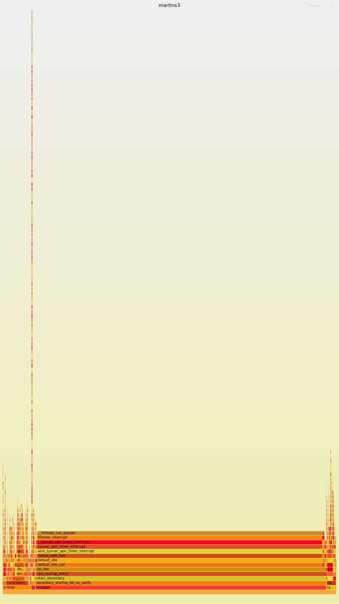

# 内核时钟系统


| file                     | blank | comment | code | desc                                                                                                                                                                                                                                                                                                                                                                             |
|--------------------------|-------|---------|------|----------------------------------------------------------------------------------------------------------------------------------------------------------------------------------------------------------------------------------------------------------------------------------------------------------------------------------------------------------------------------------|
| posix-timers.c           | 215   | 242     | 913  |                                                                                                                                                                                                                                                                                                                                                                                  |
| posix-cpu-timers.c       | 194   | 405     | 817  |                                                                                                                                                                                                                                                                                                                                                                                  |
| posix-clock.c            | 72    | 9       | 236  |                                                                                                                                                                                                                                                                                                                                                                                  |
| timekeeping.c            | 359   | 720     | 1325 |                                                                                                                                                                                                                                                                                                                                                                                  |
| hrtimer.c                | 314   | 723     | 1174 |                                                                                                                                                                                                                                                                                                                                                                                  |
| timer.c                  | 249   | 779     | 1063 | 传统的低精度 timer 模块，基本 tick 的, 实现方法是 ldd3 : chapter 7 中间介绍，很简单的。                                                                                                                                                                                                                                                                                              |
| posix-stubs.c            | 33    | 13      | 194  |                                                                                                                                                                                                                                                                                                                                                                                  |
| clockevents.c            | 114   | 194     | 470  |                                                                                                                                                                                                                                                                                                                                                                                  |
| clocksource.c            | 164   | 381     | 685  | find the best clocksource                                                                                                                                                                                                                                                                                                                                                        |
| ntp.c                    | 170   | 236     | 641  |                                                                                                                                                                                                                                                                                                                                                                                  |
| time.c                   | 129   | 251     | 620  | time.c 文件是一个向用户空间提供时间接口的模块。具体包括：time, stime, gettimeofday, settimeofday,adjtime。除此之外，该文件还提供一些时间格式转换的接口函数（其他内核模块使用），例如 jiffes 和微秒之间的转换，日历时间（Gregorian date）和 xtime 时间的转换。xtime 的时间格式就是到 linux epoch 的秒以及纳秒值。 timeconv.c 中包含了从 calendar time 到 broken-down time 之间的转换函数接口。 |
| alarmtimer.c             | 136   | 209     | 569  | 对于 hrtimer 的一种封装应用，只有 timerfd 一个用户                                                                                                                                                                                                                                                                                                                               |
| timer_list.c             | 54    | 14      | 312  | 向用户空间提供的调试接口。在用户空间，可以通过/proc/timer_list 接口可以获得内核中的时间子系统的相关信息。例如：系统中的当前正在使用的 clock source 设备、clock event 设备和 tick device 的信息。                                                                                                                                                                                       |
| tick-common.c            | 72    | 204     | 301  | 管理周期性 tick 事件                                                                                                                                                                                                                                                                                                                                                             |
| tick-oneshot.c           | 16    | 38      | 74   | 管理高精度 tick 时间                                                                                                                                                                                                                                                                                                                                                             |
| tick-sched.c             | 231   | 378     | 820  | 用于 dynamic tick 的                                                                                                                                                                                                                                                                                                                                                             |
| tick-broadcast.c         | 124   | 329     | 562  |                                                                                                                                                                                                                                                                                                                                                                                  |
| tick-broadcast-hrtimer.c | 8     | 50      | 53   |                                                                                                                                                                                                                                                                                                                                                                                  |
| itimer.c                 | 63    | 52      | 292  | syscall : getitimer / setitimer / alarm                                                                                                                                                                                                                                                                                                                                          |
| sched_clock.c            | 53    | 82      | 173  | 提供  sched_clock 这个函数接口                                                                                                                                                                                                                                                                                                                                                                                  |
| test_udelay.c            | 29    | 12      | 119  |                                                                                                                                                                                                                                                                                                                                                                                  |
| vsyscall.c               | 25    | 26      | 79   |                                                                                                                                                                                                                                                                                                                                                                                  |
| jiffies.c                | 20    | 32      | 68   |                                                                                                                                                                                                                                                                                                                                                                                  |
| timecounter.c            | 16    | 29      | 54   |                                                                                                                                                                                                                                                                                                                                                                                  |
| timekeeping_debug.c      | 9     | 7       | 39   |                                                                                                                                                                                                                                                                                                                                                                                  |
| posix-timers.h           | 4     | 1       | 37   |                                                                                                                                                                                                                                                                                                                                                                                  |
| timekeeping.h            | 5     | 4       | 23   |                                                                                                                                                                                                                                                                                                                                                                                  |
| timekeeping_internal.h   | 4     | 8       | 22   |                                                                                                                                                                                                                                                                                                                                                                                  |
| Makefile                 | 2     | 1       | 18   |                                                                                                                                                                                                                                                                                                                                                                                  |
| ntp_internal.h           | 1     | 2       | 12   |                                                                                                                                                                                                                                                                                                                                                                                  |

- [ ] kernel inside 分析过 timer 相关内容，可以重新看看

需要的 backtrace 的:
- [ ] 从 posix 接口到硬件的获取时间；
- [ ] 注册一个时钟到对于 APIC 的编码的过程。
- [ ] `k_itimer` 应该给 Posix 接口使用的吧

- posix-timer.c
- posix-cpu-timer.c

- [ ] 什么叫做 alarmtimer 啊


- [ ] 总结一下几个主要注册的 hook ，其实也就子系统:
  - posix clock
  - tick
  - clocksource
  - clock_event_device

- [ ] 始终没有搞清楚的一个问题，no hz 之后，当新的任务了，如何苏醒
  - 无需处理啊，外设的中断，或者 ipi
- [ ] nohz 让 avg load 的计算如何处理


- [ ] 来一个始终中断的 backtrace

- [ ] 关注几个结构体之间的关系:
```c
struct tick_device { // 这个应该是每一个 CPU 一个
    struct clock_event_device *evtdev; // 从 lapic 的那个文件中出来的
    enum tick_device_mode mode;
};
```

- 从 hrtimer 最后是如何处理周期的 tick 的: 参考 tick_setup_sched_timer

## 分析一下 tick_nohz_idle_exit

- [ ] do_idle 总是会调用这两个，但是如果不支持 no hz，其中的内容的意义是什么？
  - tick_nohz_idle_enter
  - tick_nohz_idle_exit

- 为什么这几个函数总是没有人调用的:
```txt
tick_freeze -- 这个是系统 suspend 的时候处理的
tick_suspend -- 最终被 tick_freeze 调用
tick_handle_periodic / tick_nohz_handler -- 模式不对
```

## timekeeping
 gettimeofday 会经过 timekeeping.c

使用 clock_gettime 作为例子吧!

- posix_get_monotonic_raw : 调用这个 hook
  - ktime_get_raw_ts64
    - timekeeping_get_ns : 然后再去选择正确的 resource

> [4 timekeeping](http://www.wowotech.net/timer_subsystem/timekeeping.html)
>
> timekeeping 模块维护 timeline 的基础是基于 clocksource 模块和 tick 模块。通过 tick 模块的 tick 事件，可以周期性的更新 time line，通过 clocksource 模块、可以获取 tick 之间更精准的时间信息

```plain
update_wall_time+1
tick_irq_enter+110
irq_enter_rcu+60
common_interrupt+168
asm_common_interrupt+30
native_safe_halt+11
default_idle+10
default_idle_call+50
do_idle+478
cpu_startup_entry+25
start_secondary+278
secondary_startup_64_no_verify+213
```

使用 QEMU

```txt
#0  update_wall_time () at kernel/time/timekeeping.c:2228
#1  0xffffffff8119d1b1 in tick_nohz_update_jiffies (now=4333740467005) at kernel/time/tick-sched.c:634
#2  tick_nohz_irq_enter () at kernel/time/tick-sched.c:1438
#3  tick_irq_enter () at kernel/time/tick-sched.c:1455
#4  0xffffffff8110533b in irq_enter_rcu () at kernel/softirq.c:613
#5  0xffffffff81e14335 in sysvec_apic_timer_interrupt (regs=0xffffc9000008be38) at arch/x86/kernel/apic/apic.c:1106
```

实现 `tick_nohz_update_jiffies` 暂时没有搞清楚如何保证一个 tick 的就增加一个的，以及 nohz 可以正确处理的:

## hrtimer

- [ ] https://stackoverflow.com/questions/35800850/why-does-my-hrtimer-callback-return-too-early-after-forwarding-it



> 将这个照片移除吧，直接补充一个 backtrace

- `__hrtimer_run_queues` 一共有三个调用位置:
  - [ ] softirq : 这个是为了替代原来的低精度的 timer 所以设计的吗，为了处理这个东西，搞了不少内容。
  - hrtimer_interrupt
  - hrtimer_run_queues : Called from run_local_timers in hardirq context every jiffy
- `local_apic_timer_interrupt` 会调用 `hrtimer_interrupt` ，而其注册位置为 `tick_init_highres`
- `hrtimer_reprogram` : 重新设置计时器的位置

- 因为内核是可以支持 hrtimer 来模拟的

### soft hard mode
- https://lwn.net/Articles/461592/

```c
/*
 * Mode arguments of xxx_hrtimer functions:
 *
 * HRTIMER_MODE_ABS		- Time value is absolute
 * HRTIMER_MODE_REL		- Time value is relative to now
 * HRTIMER_MODE_PINNED		- Timer is bound to CPU (is only considered
 *				  when starting the timer)
 * HRTIMER_MODE_SOFT		- Timer callback function will be executed in
 *				  soft irq context
 * HRTIMER_MODE_HARD		- Timer callback function will be executed in
 *				  hard irq context even on PREEMPT_RT.
 */
enum hrtimer_mode {
	HRTIMER_MODE_ABS	= 0x00,
	HRTIMER_MODE_REL	= 0x01,
	HRTIMER_MODE_PINNED	= 0x02,
	HRTIMER_MODE_SOFT	= 0x04,
	HRTIMER_MODE_HARD	= 0x08,

	HRTIMER_MODE_ABS_PINNED = HRTIMER_MODE_ABS | HRTIMER_MODE_PINNED,
	HRTIMER_MODE_REL_PINNED = HRTIMER_MODE_REL | HRTIMER_MODE_PINNED,

	HRTIMER_MODE_ABS_SOFT	= HRTIMER_MODE_ABS | HRTIMER_MODE_SOFT,
	HRTIMER_MODE_REL_SOFT	= HRTIMER_MODE_REL | HRTIMER_MODE_SOFT,

	HRTIMER_MODE_ABS_PINNED_SOFT = HRTIMER_MODE_ABS_PINNED | HRTIMER_MODE_SOFT,
	HRTIMER_MODE_REL_PINNED_SOFT = HRTIMER_MODE_REL_PINNED | HRTIMER_MODE_SOFT,

	HRTIMER_MODE_ABS_HARD	= HRTIMER_MODE_ABS | HRTIMER_MODE_HARD,
	HRTIMER_MODE_REL_HARD	= HRTIMER_MODE_REL | HRTIMER_MODE_HARD,

	HRTIMER_MODE_ABS_PINNED_HARD = HRTIMER_MODE_ABS_PINNED | HRTIMER_MODE_HARD,
	HRTIMER_MODE_REL_PINNED_HARD = HRTIMER_MODE_REL_PINNED | HRTIMER_MODE_HARD,
};
```
- 这些模式都是什么意思 ?

```c
enum  hrtimer_base_type {
	HRTIMER_BASE_MONOTONIC,
	HRTIMER_BASE_REALTIME,
	HRTIMER_BASE_BOOTTIME,
	HRTIMER_BASE_TAI,
	HRTIMER_BASE_MONOTONIC_SOFT,
	HRTIMER_BASE_REALTIME_SOFT,
	HRTIMER_BASE_BOOTTIME_SOFT,
	HRTIMER_BASE_TAI_SOFT,
	HRTIMER_MAX_CLOCK_BASES,
};
```
- 这些 base type 又是什么意思
## hrtimer migratin
https://lwn.net/Articles/574379/

## timer.c
低精度时钟，主要提供接口:

- timer_setup : do_init_timer
- add_timer_on
- del_timer
- mod_timer
- mod_timer_pending
- timer_reduce

下面是用 bpftrace 抓到已经经典的 backtrace 的结果:
```txt
writeout_period+1
call_timer_fn+39
__run_timers.part.0+462
__softirqentry_text_start+238
__irq_exit_rcu+181
sysvec_apic_timer_interrupt+162
asm_sysvec_apic_timer_interrupt+18
native_safe_halt+11
default_idle+10
default_idle_call+50
do_idle+478
cpu_startup_entry+25
start_secondary+278
secondary_startup_64_no_verify+213
```

当中断结束之后，进入 softirq 的时候检查。

## 用户态简介

## namespace

## 和 scheduler 如何工作的

## timer

## clocksource

## tick
```config
#
# Timers subsystem

CONFIG_TICK_ONESHOT=y

CONFIG_NO_HZ_COMMON=y
# CONFIG_HZ_PERIODIC is not set
CONFIG_NO_HZ_IDLE=y
# CONFIG_NO_HZ_FULL is not set

CONFIG_NO_HZ=y
CONFIG_HIGH_RES_TIMERS=y
CONFIG_CLOCKSOURCE_WATCHDOG_MAX_SKEW_US=100
# end of Timers subsystem
```

## vdso

## kvm

总结一下几个类似的东西:
- `k_clock` : `clock_gettime` 是可以计算 process time 的

## 一些 backtrace

### run_timer_softirq
```txt
@[
    run_timer_softirq+1
    __softirqentry_text_start+238
    __irq_exit_rcu+181
    sysvec_apic_timer_interrupt+162
    asm_sysvec_apic_timer_interrupt+18
    native_safe_halt+11
    default_idle+10
    default_idle_call+50
    do_idle+478
    cpu_startup_entry+25
    start_secondary+278
    secondary_startup_64_no_verify+213
]: 488
```

### writeout_period
```txt
@[
    writeout_period+1
    call_timer_fn+39
    __run_timers.part.0+462
    __softirqentry_text_start+238
    __irq_exit_rcu+181
    sysvec_apic_timer_interrupt+162
    asm_sysvec_apic_timer_interrupt+18
    native_safe_halt+11
    default_idle+10
    default_idle_call+50
    do_idle+478
    cpu_startup_entry+25
    start_secondary+278
    secondary_startup_64_no_verify+213
]: 10
```

### `enqueue_hrtimer`

出现的频率非常的高:
```plain
enqueue_hrtimer+1
__hrtimer_run_queues+345
hrtimer_interrupt+262
__sysvec_apic_timer_interrupt+127
sysvec_apic_timer_interrupt+79
asm_sysvec_apic_timer_interrupt+18
```

### tick_check_new_device

```txt
#0  tick_check_new_device (newdev=newdev@entry=0xffff888003868800) at kernel/time/tick-common.c:347
#1  0xffffffff81199c1e in clockevents_register_device (dev=dev@entry=0xffff888003868800) at kernel/time/clockevents.c:464
#2  0xffffffff8119a006 in clockevents_config_and_register (dev=dev@entry=0xffff888003868800, freq=<optimized out>, min_delta=min_delta@entry=192, max_delta=max_delta@entry=2147483647) at ker
nel/time/clockevents.c:511
#3  0xffffffff8329a998 in hpet_legacy_clockevent_register (hc=0xffff888003868800) at arch/x86/kernel/hpet.c:463
#4  hpet_enable () at arch/x86/kernel/hpet.c:1097
#5  0xffffffff8328b8e8 in hpet_time_init () at arch/x86/kernel/time.c:77
#6  0xffffffff8328b8c6 in x86_late_time_init () at arch/x86/kernel/time.c:94
#7  0xffffffff832831bb in start_kernel () at init/main.c:1100
#8  0xffffffff81000145 in secondary_startup_64 () at arch/x86/kernel/head_64.S:358
#9  0x0000000000000000 in ?? ()
```

```txt
#0  tick_check_new_device (newdev=newdev@entry=0xffff88803ec1af80) at kernel/time/tick-common.c:347
#1  0xffffffff81199c1e in clockevents_register_device (dev=0xffff88803ec1af80) at kernel/time/clockevents.c:464
#2  0xffffffff83298287 in setup_boot_APIC_clock () at arch/x86/kernel/apic/apic.c:1054
#3  0xffffffff832964b0 in native_smp_prepare_cpus (max_cpus=<optimized out>) at arch/x86/kernel/smpboot.c:1426
#4  0xffffffff8328337f in smp_prepare_cpus (max_cpus=<optimized out>) at arch/x86/include/asm/smp.h:84
#5  kernel_init_freeable () at init/main.c:1592
#6  0xffffffff81e15371 in kernel_init (unused=<optimized out>) at init/main.c:1499
#7  0xffffffff81001a4f in ret_from_fork () at arch/x86/entry/entry_64.S:306
#8  0x0000000000000000 in ?? ()
```

会调用 tick_setup_periodic 函数，这时候，该 tick device 对应的 clock event device 的 clock event handler 被设置为 tick_handle_periodic

在 `tick_setup_device` 中首先调用 `clock_event_device` 来设置 clock_event_device 的函数。

## 分析切换过程
- 默认状态
  - tick_handle_periodic
- tick_nohz_switch_to_nohz
  - tick_nohz_handler
- hrtimer_switch_to_hres
  - hrtimer_interrupt

- 两个切换函数都在 `hrtimer_run_queues`  中，而三种模式中的 handler 都是会调用 update_process_times 的， update_process_times 在 hres 中，其实是直接返回的

```txt
#0  hrtimer_run_queues () at kernel/time/hrtimer.c:1896
#1  0xffffffff8118a16f in run_local_timers () at kernel/time/timer.c:1815
#2  update_process_times (user_tick=0) at kernel/time/timer.c:1838
#3  0xffffffff8119a87e in tick_periodic (cpu=cpu@entry=1) at kernel/time/tick-common.c:100
#4  0xffffffff8119a8ea in tick_handle_periodic (dev=0xffff88803ec5af80) at kernel/time/tick-common.c:112
#5  0xffffffff810de107 in local_apic_timer_interrupt () at arch/x86/kernel/apic/apic.c:1095
#6  __sysvec_apic_timer_interrupt (regs=<optimized out>) at arch/x86/kernel/apic/apic.c:1112
#7  0xffffffff81e1433d in sysvec_apic_timer_interrupt (regs=0xffffc90000083e38) at arch/x86/kernel/apic/apic.c:1106
```

```txt
update_process_times+1
tick_sched_handle+34
tick_sched_timer+109
__hrtimer_run_queues+298
hrtimer_interrupt+262
__sysvec_apic_timer_interrupt+127
sysvec_apic_timer_interrupt+157
asm_sysvec_apic_timer_interrupt+18
native_safe_halt+11
default_idle+10
default_idle_call+50
do_idle+478
cpu_startup_entry+25
start_secondary+278
secondary_startup_64_no_verify+213
```

# time
- [ ] what does kernel used to notified hrtimer that it's expired ?

kernel doc is invaluable[^4].

## itimer.c
需要 task_struct::hrtimer 的支持，然后调用通用的 hrtimer API:

```c
struct signal_struct {

    /* ITIMER_REAL timer for the process */
    struct hrtimer real_timer;
    ktime_t it_real_incr;

```
do_setitimer ==> hrtimer_start

## tick-common.c && tick-oneshot.c && tick-sched.c
tick-common.c && tick-oneshot.c, 利用 clockevent 来控制周期 tick 的状态，尤其是 tick-oneshot.c，只是包含 switch state, resume 等

> tick-common.c 文件是 periodic tick 模块，用于管理周期性 tick 事件。
> tick-oneshot.c 文件是 for 高精度 timer 的，用于管理高精度 tick 时间。
> tick-sched.c 是用于 dynamic tick 的。

- [ ] 周期性的 tick 和高精度 tick 的本质区别是 ?
  - [ ] 高精度 tick 还是周期性的 tick, 但是但是按照 one shot 的方法通知 CPU tick 来了 ?

- tick_freeze
  - tick_suspend_local
    - clockevents_shutdown
      - clockevents_switch_state
        - `__clockevents_switch_state`
          - dev->set_state_shutdown
          - dev->set_state_periodic
            - lapic_clockevent::set_state_periodic
              - lapic_timer_set_periodic
                - lapic_timer_set_periodic_oneshot
                  - `__setup_APIC_LVTT`
          - dev->set_state_oneshot

tick-sched.c 相对复杂一些，毕竟多出来了一个可以不 tick 的状态，该状态的进入退出之类的管理。

## sched-clock.c
> 通用 sched clock 模块。*这个模块主要是提供一个 sched_clock 的接口函数*，调用该函数可以获取当前时间点到系统启动之间的纳秒值。
底层的 HW counter 其实是千差万别的，有些平台可以提供 64-bit 的 HW counter，因此，在那样的平台中，我们可以不使用这个通用 sched clock 模块（不配置 CONFIG_GENERIC_SCHED_CLOCK 这个内核选项），而在自己的 clock source chip driver 中直接提供 sched_clock 接口。
使用通用 sched clock 模块的好处是：该模块扩展了 64-bit 的 counter，即使底层的 HW counter 比特数目不足（有些平台 HW counter 只有 32 个 bit）。

CONFIG_GENERIC_SCHED_CLOCK is not set in x86 defconfig

```c
/*
 * This function gets called when a POSIX.1b interval timer expires.  It
 * is used as a callback from the kernel internal timer.  The
 * run_timer_list code ALWAYS calls with interrupts on.

 * This code is for CLOCK_REALTIME* and CLOCK_MONOTONIC* timers.
 */
static enum hrtimer_restart posix_timer_fn(struct hrtimer *timer)
```

## overview

<!-- vim-markdown-toc -->

- [ ] itimer, should be really simple.

## quetion
1. 时钟中断的 handler 是什么
2. 提供那些服务 ?
    1. 时间
    2. 计时器
    3. tick

3. posix timer 是怎么回事 ?
4. 高精度 和 低精度 时钟的关系是什么 ?
    1. 各自对应什么位置的代码 ?
    2. hrtimer use redblack tree too ?
5. 架构的层次是什么 ?
6. 多核导致的挑战是什么 ?
    1. 全局时钟
        1. 是所有人都可以接受，还是 ?
    2. 局部时钟控制器 : 不同的位置需要同步吗 ?
2. 广播模式

4. clock sources, clock event devices, and tick devices 都是啥呀 ?

## todo
1. posix-clock.c 中间的内容似乎就是 : clock 设备管理的 ?
3. 找到 clock source chip driver 具体代表什么 ?
3. clock event 是不是需要 clock 硬件具有 timer 的功能 ? 也就是向硬件告诉什么时候 interrupts 我，而不是每 nanoseconds 过来提醒一次。(这是显然的)
    1. 那么，我想知道，提交给硬件这个消息的方法是什么 ?
4. dynimic 和 high resolution timer 之间的切换是什么 ?
5. hrtimer 是如何利用那 clock source 和 clockevent 构建的 ?
6. clock source 和 clock event 到底有什么，难道不是仅仅一千行吗 ?
7. 据说，低精度 timer 是基于高精度 timer 的，找到对应的证据是什么 ?

- [ ] what do clockevents.c and clocksource.c contains ?
- [ ] tick one shot, tick broadcast, tick sched

- [ ] article 2 need more examine

> @todo clockevent 和 clocksource 使用的是同一个 dev ?

https://en.wikipedia.org/wiki/High_Precision_Event_Timer

> 看上去，clocksource 和 clockevent 都是依赖于底层的函数。

## wowotech

- [ ] What is `CLOCK_*` ?

#### [2 软件架构](http://www.wowotech.net/timer_subsystem/time-subsyste-architecture.html)

> 1. 我们首先看周期性 tick 的实现。起始点一定是底层的 clock source chip driver，该 driver 会调用注册 clock event 的接口函数（clockevents_config_and_register 或者 clockevents_register_device），
一旦增加了一个 clock event device，需要通知上层的 tick device layer，毕竟有可能新注册的这个 device 更好、更适合某个 tick device 呢（通过调用 tick_check_new_device 函数实现）。
要是这个 clock event device 被某个 tick device 收留了（要么该 tick device 之前没有匹配的 clock event device，要么新的 clock event device 更适合该 tick device），那么就启动对该 tick device 的配置（参考 tick_setup_device）。
根据当前系统的配置情况（周期性 tick），会调用 tick_setup_periodic 函数，这时候，该 tick device 对应的 clock_event_device 的 clock_event_handler 被设置为 tick_handle_periodic。
底层硬件会周期性的产生中断，从而会周期性的调用 tick_handle_periodic 从而驱动整个系统的运转。
需要注意的是：即便是配置了 CONFIG_NO_HZ 和 CONFIG_TICK_ONESHOT，系统中没有提供 one shot 的 clock event device，这种情况下，整个系统仍然是运行在周期 tick 的模式下。
高精度 timer 总是会被编入最后的 kernel 中。在这种构架下，各个内核模块也可以调用 linux kernel 中的高精度 timer 模块的接口函数来实现高精度 timer，但是，这时候高精度 timer 模块是运行在低精度的模式，也就是说这些 hrtimer 虽然是按照高精度 timer 的红黑树进行组织，
**但是系统只是在每一周期性 tick 到来的时候调用`hrtimer_run_queues`函数，来检查是否有 expire 的 hrtimer。毫无疑问，这里的高精度 timer 也就是没有意义了。**


- [ ] clockevents_config_and_register
  - [ ] clockevents_config
  - [ ] clockevents_register_device
    -  tick_check_new_device : Check, if the new registered device should be used. Called with clockevents_lock held and interrupts disabled.
      - tick_check_preferred :  Prefer oneshot capable device, Use the higher rated one, but prefer a CPU local device with a lower rating than a non-CPU local device
      - tick_setup_device
        - [ ] tick_device_uses_broadcast
        - tick_setup_periodic
          - tick_set_periodic_handler
        - tick_setup_oneshot
          - `newdev->event_handler = handler;`

```c
/*
 * Set the periodic handler depending on broadcast on/off
 */
void tick_set_periodic_handler(struct clock_event_device *dev, int broadcast)
{
    if (!broadcast)
        dev->event_handler = tick_handle_periodic; // XXX this will be called when interrupt comes
    else
        dev->event_handler = tick_handle_periodic_broadcast;
}
```

- [ ] tick_set_periodic_handler
  - tick_periodic
    - do_timer
      - jiffies_64 += ticks;
      - calc_global_load : in the loadavg.c
  - update_process_times
    - **scheduler_tick**, **account_process_tick** , **irq_work_tick**, etc
    - run_local_timers
      - hrtimer_run_queues
        - hrtimer_is_hres_enabled : controlled by kernel cmdline parameter
        - tick_check_oneshot_change
          - tick_nohz_switch_to_nohz
        - hrtimer_switch_to_hres : nohz or hres
          - tick_setup_sched_timer
            - tick_sched_timer : called when hrtimer expires
      - raise_softirq

- tick_handle_periodic_broadcast
  - tick_do_periodic_broadcast : determine which CPUs to broadcast by mask
    - tick_do_broadcast : `struct tick_device`::`struct tick_device`::broadcast(mask);
      - lapic_timer_broadcast : as a example
        - `apic->send_IPI_mask(mask, LOCAL_TIMER_VECTOR);`


The orgin of interrupt:
```c
/*
 * Default timer interrupt handler for PIT/HPET
 */
static irqreturn_t timer_interrupt(int irq, void *dev_id)
{
    global_clock_event->event_handler(global_clock_event);
    return IRQ_HANDLED;
}

static void __init setup_default_timer_irq(void)
{
    unsigned long flags = IRQF_NOBALANCING | IRQF_IRQPOLL | IRQF_TIMER;

    /*
     * Unconditionally register the legacy timer interrupt; even
     * without legacy PIC/PIT we need this for the HPET0 in legacy
     * replacement mode.
     */
    if (request_irq(0, timer_interrupt, flags, "timer", NULL))
        pr_info("Failed to register legacy timer interrupt\n");
}
```

```c
enum tick_nohz_mode {
    NOHZ_MODE_INACTIVE,
    NOHZ_MODE_LOWRES,
    NOHZ_MODE_HIGHRES,
};
```
- [ ] nohz mode : lowres, highres

```c
DEFINE_PER_CPU(struct tick_device, tick_cpu_device);
```

> 2. 低精度 timer + Dynamic Tick
系统开始的时候并不是直接进入 Dynamic tick mode 的，而是经历一个切换过程。
开始的时候，系统运行在**周期 tick**的模式下，各个 cpu 对应的 tick device 的（clock_event_device 的）event_handler 是 tick_handle_periodic。
在 timer 的软中断上下文中，会调用 tick_check_oneshot_change 进行是否切换到 one shot 模式的检查，如果系统中有支持 one-shot 的 clock_event_device，并且没有配置高精度 timer 的话，那么就会发生 tick mode 的切换（调用 tick_nohz_switch_to_nohz），
这时候，tick device 会切换到 one shot 模式，而 event handler 被设置为 tick_nohz_handler。由于这时候的 clock_event_device 工作在 one shot 模式，因此当系统正常运行的时候，在 event_handler 中每次都要 reprogram clock event，以便正常产生 tick。
**当 cpu 运行 idle 进程的时候，clock event device 不再 reprogram 产生下次的 tick 信号，这样，整个系统的周期性的 tick 就停下来。**

> 3. 高精度 timer + Dynamic Tick
同样的，系统开始的时候并不是直接进入 Dynamic tick mode 的，而是经历一个切换过程。
系统开始的时候是运行在周期 tick 的模式下，event handler 是`tick_handle_periodic`。
在周期 tick 的软中断上下文中（参考`run_timer_softirq`），如果满足条件，会调用`hrtimer_switch_to_hres`将 hrtimer 从低精度模式切换到高精度模式上。这时候，系统会有下面的动作：

> 1. Tick device 的 clock event 设备切换到 oneshot mode（参考 tick_init_highres 函数）
> 2. Tick device 的 clock event 设备的 event handler 会更新为 hrtimer_interrupt（参考 tick_init_highres 函数）
> 3. 设定 sched timer（也就是模拟周期 tick 那个高精度 timer，参考 tick_setup_sched_timer 函数）

> 这样，当下一次 tick 到来的时候，系统会调用`hrtimer_interrupt`来处理这个 tick（该 tick 是通过 sched timer 产生的）。

> 在 Dynamic tick 的模式下，各个 cpu 的 tick device 工作在 one shot 模式，该 tick device 对应的 clock event 设备也工作在 one shot 的模式，这时候，硬件 Timer 的中断不会周期性的产生，但是 linux kernel 中很多的模块是依赖于周期性的 tick 的，因此，在这种情况下，系统使用 hrtime 模拟了一个周期性的 tick。在切换到 dynamic tick 模式的时候会初始化这个高精度 timer，该高精度 timer 的回调函数是 tick_sched_timer。这个函数执行的函数类似周期性 tick 中 event handler 执行的内容。不过在最后会 reprogram 该高精度 timer，以便可以周期性的产生 clock event。当系统进入 idle 的时候，就会 stop 这个高精度 timer，这样，当没有用户事件的时候，CPU 可以持续在 idle 状态，从而减少功耗。

- [ ]  感觉，当使用低精度 timer 的时候，利用的是周期 tick ,  当使用高精度的时候，用于实现 dynamic tick

## clock event 和 clock source
- clockevent 应该就是用于产生 tick
```c
struct clock_event_device
```
主要是 apic 了
- clocksource  获取当前的时间的
```c
struct clocksource
```
hpet 等

#### [Timekeeping intheLinux Kernel](http://events17.linuxfoundation.org/sites/events/files/slides/Timekeeping%20in%20the%20Linux%20Kernel_0.pdf)
```c
// how many nsecs since last read
static inline u64 timekeeping_get_ns(const struct tk_read_base *tkr)
{
    u64 delta;

    delta = timekeeping_get_delta(tkr); // cycle_t delta = (tkr->read(tkr->clock) - tkr->cycle_last) & tkr->mask;
    return timekeeping_delta_to_ns(tkr, delta); // nsec = (delta * tkr->mult + tkr->xtime_nsec) >>= tkr->shift;
}

// simplified version
void ktime_get_real_ts64(struct timespec64 *ts)
{
  ts->tv_sec = tk->xtime_sec;
    ts->tv_nsec = 0;
  nsecs = timekeeping_get_ns(&tk->tkr_mono);
    ts->tv_sec += __iter_div_u64_rem(ts->tv_nsec + nsecs, NSEC_PER_SEC, &nsecs);
    ts->tv_nsec = nsecs;
}
```

- [ ] There something interesting about how to calculate time from hardware clock clcle efficiently and accurately, but we have to handle something for kvm.

## [ ] 到底什么是 broadcast

让其他 CPU 唤醒已经关闭本地 timer 的 CPU:
具体进一步的参考
http://www.wowotech.net/timer_subsystem/tick-broadcast-framework.html

## 问题
- do_idle 中为什么调用 tick_check_broadcast_expired 来决定是否进入 cpu_idle_poll 的状态

### [ ] timer_list 是通过 hrtimer 触发的吗

似乎并不是，当
```txt
@[
    try_to_wake_up+1
    hrtimer_wakeup+30
    __hrtimer_run_queues+298
    hrtimer_interrupt+262
    __sysvec_apic_timer_interrupt+127
    sysvec_apic_timer_interrupt+157
    asm_sysvec_apic_timer_interrupt+18
    native_safe_halt+11
    default_idle+10
    default_idle_call+50
    do_idle+478
    cpu_startup_entry+25
    start_secondary+278
    secondary_startup_64_no_verify+213
]: 750


@[
    tcp_keepalive_timer+1
    call_timer_fn+39
    __run_timers.part.0+462
    run_timer_softirq+49
    __softirqentry_text_start+238
    __irq_exit_rcu+181
    sysvec_apic_timer_interrupt+162
    asm_sysvec_apic_timer_interrupt+18
    native_safe_halt+11
    default_idle+10
    default_idle_call+50
    do_idle+478
    cpu_startup_entry+25
    start_secondary+278
    secondary_startup_64_no_verify+213
]: 1
```


[^1]: https://www.kernel.org/doc/html/latest/virt/kvm/timekeeping.html
[^2]: https://github.com/dterei/tsc
[^3]: https://en.wikipedia.org/wiki/Intel_8253
[^4]: https://www.kernel.org/doc/html/latest/timers/index.html
