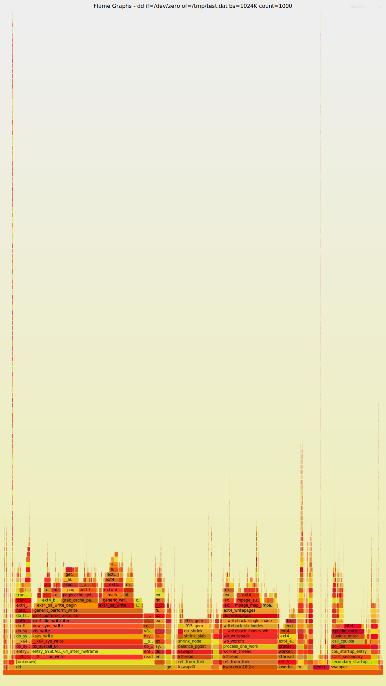

# 使用 QEMU 和 ebpf 阅读内核

在[上一篇文章](https://martins3.github.io/kernel/learn-linux-kernel.html)中，提出了学习内核的目的，工作的方向以及大致的学习路径，下面谈一下可以提高分析效率的工具。

## QEMU
使用 QEMU 调试内核网上已经有很多的文章, 比如 [Booting a Custom Linux Kernel in QEMU and Debugging It With GDB](http://nickdesaulniers.github.io/blog/2018/10/24/booting-a-custom-linux-kernel-in-qemu-and-debugging-it-with-gdb/)

QEMU 很强大，但是 QEMU 的参数对于新手不是很友好，我写了一个[QEMU 的基本使用方法](https://martins3.github.io/qemu/manual.html)，
关于调试可以参考[这个脚本](https://github.com/Martins3/Martins3.github.io/blob/master/docs/qemu/sh/alpine.sh)

## FlameGraph
使用 FlameGraph 可以很快的定位出来函数的大致执行的流程，无需使用编辑器一个个的跳转，非常好用。
其局限在于，似乎总是只能从用户态系统调用触发。

具体细节参考 https://www.brendangregg.com/FlameGraphs/cpuflamegraphs.html

perf 可能需要安装:
```sh
sudo apt install linux-tools-common linux-tools-generic linux-tools-`uname -r`
```

最终效果如下，可以在新的窗口中打开从而可以动态交互。


这个工具我使用的非常频繁，所以构建了简单的[一个脚本](https://github.com/Martins3/Martins3.github.io/blob/master/docs/kernel/code/flamegraph.sh)，例如:

```sh
./flamegraph.sh -c 'iperf -c localhost' -g iperf
```
## 使用 BCC 也是不错的

## bpftrace
使用 bpftrace 的 kprobe 可以很容易的动态的获取内核函数的 backtrace

首先可以使用 sudo bpftrace -l | fzf 检查可以观测的点

脚本：
```bt
#!/usr/bin/bpftrace
kprobe:task_tick_fair
{
  @[kstack] = count();
}
```

结果:
```txt
@[
    task_tick_fair+1
    update_process_times+187
    tick_sched_handle.isra.0+37
    tick_sched_timer+109
    __hrtimer_run_queues+251
    hrtimer_interrupt+265
    __sysvec_apic_timer_interrupt+100
    sysvec_apic_timer_interrupt+56
    asm_sysvec_apic_timer_interrupt+18
]: 171
```
## debug 目录
- kvm_stat

## [ ] gcov

## perf-scripts
没有 stackcount，但是相对来说，已经很好用了

## 观测内核
- mm-vmstat.md
- systeroid --tui

## 整理一下一个模块专用的内核调试工具
- blktrace
- kvm_stat

## 似乎 stackcount 和 bpftrace 的效果还是存在差别的

```txt
🧀  sudo stackcount find_vma
[sudo] password for martins3:
In file included from /virtual/main.c:1:
In file included from include/uapi/linux/ptrace.h:134:
In file included from arch/x86/include/asm/ptrace.h:5:
In file included from arch/x86/include/asm/segment.h:7:
arch/x86/include/asm/ibt.h:55:8: warning: 'nocf_check' attribute ignored; use -fcf-protection to enable the attribute [-Wignored-attributes]
extern __noendbr u64 ibt_save(void);
       ^
arch/x86/include/asm/ibt.h:20:34: note: expanded from macro '__noendbr'
#define __noendbr       __attribute__((nocf_check))
                                       ^
arch/x86/include/asm/ibt.h:56:8: warning: 'nocf_check' attribute ignored; use -fcf-protection to enable the attribute [-Wignored-attributes]
extern __noendbr void ibt_restore(u64 save);
       ^
arch/x86/include/asm/ibt.h:20:34: note: expanded from macro '__noendbr'
#define __noendbr       __attribute__((nocf_check))
                                       ^
2 warnings generated.
Tracing 1 functions for "find_vma"... Hit Ctrl-C to end.
^C
  find_vma
  do_user_addr_fault
  exc_page_fault
  asm_exc_page_fault
  [unknown]
  [unknown]
  [unknown]
  [unknown]
  [unknown]
  [unknown]
  [unknown]
  [unknown]
  [unknown]
  [unknown]
  [unknown]
    1

  find_vma
  do_user_addr_fault
  exc_page_fault
  asm_exc_page_fault
  [unknown]
  [unknown]
    1

  find_vma
  do_user_addr_fault
  exc_page_fault
  asm_exc_page_fault
  [unknown]
  [unknown]
  [unknown]
  [unknown]
  [unknown]
  [unknown]
  [unknown]
  [unknown]
  [unknown]
  [unknown]
  [unknown]
    1

  find_vma
  do_user_addr_fault
  exc_page_fault
  asm_exc_page_fault
  [unknown]
  [unknown]
  [unknown]
  [unknown]
  [unknown]
  [unknown]
  [unknown]
  [unknown]
  [unknown]
  [unknown]
  [unknown]
  [unknown]
  [unknown]
  [unknown]
  [unknown]
  [unknown]
  [unknown]
  [unknown]
  [unknown]
    1

  find_vma
  do_user_addr_fault
  exc_page_fault
  asm_exc_page_fault
  [unknown]
    1

  find_vma
  do_user_addr_fault
  exc_page_fault
  asm_exc_page_fault
  [unknown]
  [unknown]
  [unknown]
  [unknown]
  [unknown]
  [unknown]
  [unknown]
  [unknown]
  [unknown]
  [unknown]
  [unknown]
  [unknown]
  [unknown]
  [unknown]
  [unknown]
  [unknown]
    1

  find_vma
  do_user_addr_fault
  exc_page_fault
  asm_exc_page_fault
  [unknown]
  [unknown]
    1

  find_vma
  do_user_addr_fault
  exc_page_fault
  asm_exc_page_fault
  [unknown]
  [unknown]
    1

  find_vma
  do_user_addr_fault
  exc_page_fault
  asm_exc_page_fault
  [unknown]
  [unknown]
    1

  find_vma
  do_user_addr_fault
  exc_page_fault
  asm_exc_page_fault
  [unknown]
    1

  find_vma
  do_user_addr_fault
  exc_page_fault
  asm_exc_page_fault
  [unknown]
  [unknown]
  [unknown]
  [unknown]
  [unknown]
  [unknown]
  [unknown]
  [unknown]
  [unknown]
  [unknown]
  [unknown]
  [unknown]
  [unknown]
  [unknown]
  [unknown]
  [unknown]
  [unknown]
  [unknown]
  [unknown]
  [unknown]
  [unknown]
  [unknown]
  [unknown]
  [unknown]
  [unknown]
  [unknown]
  [unknown]
  [unknown]
  [unknown]
  [unknown]
  [unknown]
  [unknown]
  [unknown]
  [unknown]
  [unknown]
    1

  find_vma
  do_user_addr_fault
  exc_page_fault
  asm_exc_page_fault
  x64_setup_rt_frame
  arch_do_signal_or_restart
  exit_to_user_mode_prepare
  syscall_exit_to_user_mode
  do_syscall_64
  entry_SYSCALL_64_after_hwframe
  [unknown]
  [unknown]
    1

  find_vma
  do_user_addr_fault
  exc_page_fault
  asm_exc_page_fault
  [unknown]
    1

  find_vma
  do_user_addr_fault
  exc_page_fault
  asm_exc_page_fault
  [unknown]
  [unknown]
    1

  find_vma
  do_user_addr_fault
  exc_page_fault
  asm_exc_page_fault
  [unknown]
  [unknown]
  [unknown]
  [unknown]
  [unknown]
  [unknown]
  [unknown]
  [unknown]
  [unknown]
  [unknown]
  [unknown]
  [unknown]
  [unknown]
  [unknown]
  [unknown]
  [unknown]
  [unknown]
  [unknown]
  [unknown]
  [unknown]
  [unknown]
  [unknown]
  [unknown]
  [unknown]
  [unknown]
  [unknown]
  [unknown]
  [unknown]
  [unknown]
  [unknown]
  [unknown]
  [unknown]
  [unknown]
  [unknown]
  [unknown]
  [unknown]
  [unknown]
  [unknown]
  [unknown]
    1

  find_vma
  do_user_addr_fault
  exc_page_fault
  asm_exc_page_fault
  [unknown]
  [unknown]
    1

  find_vma
  do_user_addr_fault
  exc_page_fault
  asm_exc_page_fault
  [unknown]
    2

  find_vma
  do_user_addr_fault
  exc_page_fault
  asm_exc_page_fault
    2

  find_vma
  do_user_addr_fault
  exc_page_fault
  asm_exc_page_fault
  [unknown]
  [unknown]
    3

Detaching...
vn on  master [!+⇡] took 3s
🧀  t find_vma
find_vma
+ [[ false == true ]]
+ sudo bpftrace -e 'kprobe:find_vma {  @[kstack] = count(); }'
Attaching 1 probe...
^C

@[
    find_vma+5
    do_user_addr_fault+349
    exc_page_fault+107
    asm_exc_page_fault+38
    copy_user_enhanced_fast_string+14
    _copy_to_iter+197
    copy_page_to_iter+138
    filemap_read+428
    vfs_read+517
    __x64_sys_pread64+148
    do_syscall_64+60
    entry_SYSCALL_64_after_hwframe+114
]: 1
@[
    find_vma+5
    do_madvise.part.0+560
    __x64_sys_madvise+94
    do_syscall_64+60
    entry_SYSCALL_64_after_hwframe+114
]: 1
@[
    find_vma+5
    do_user_addr_fault+349
    exc_page_fault+107
    asm_exc_page_fault+38
    copy_user_enhanced_fast_string+14
    _copy_to_iter+488
    __skb_datagram_iter+409
    skb_copy_datagram_iter+55
    unix_stream_read_actor+30
    unix_stream_read_generic+748
    unix_stream_recvmsg+140
    ____sys_recvmsg+135
    ___sys_recvmsg+124
    __sys_recvmsg+90
    do_syscall_64+60
    entry_SYSCALL_64_after_hwframe+114
]: 3
@[
    find_vma+5
    do_user_addr_fault+349
    exc_page_fault+107
    asm_exc_page_fault+38
]: 239
```
