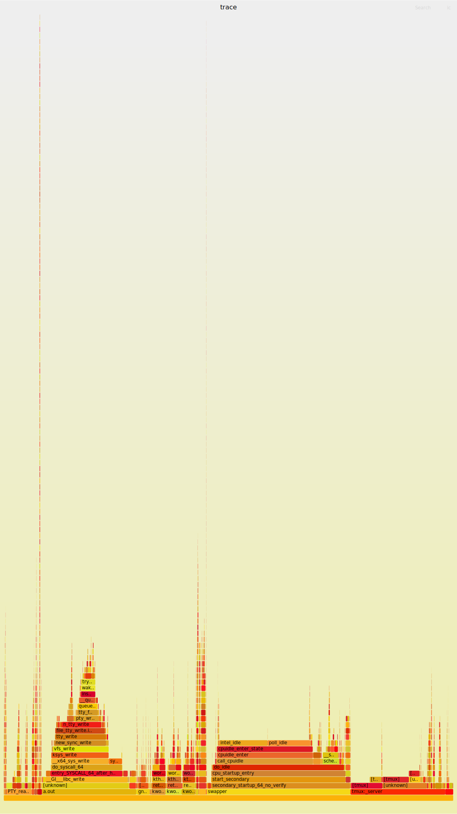
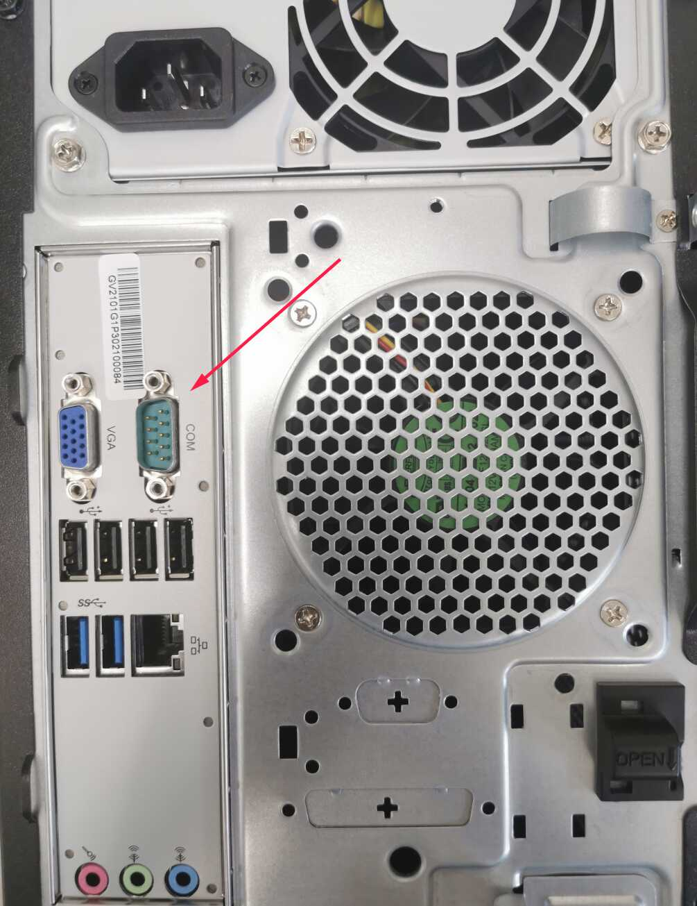
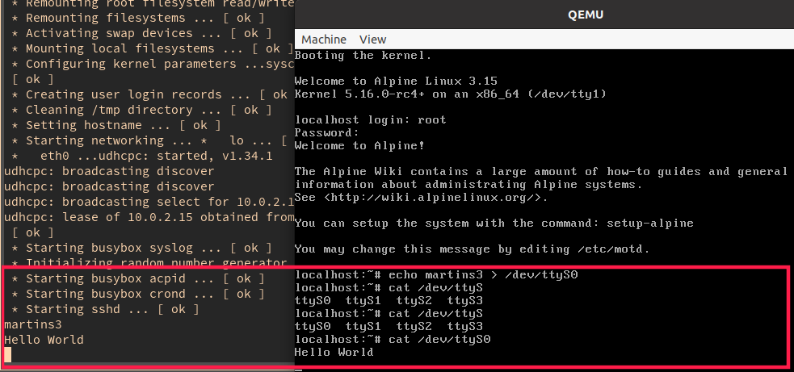
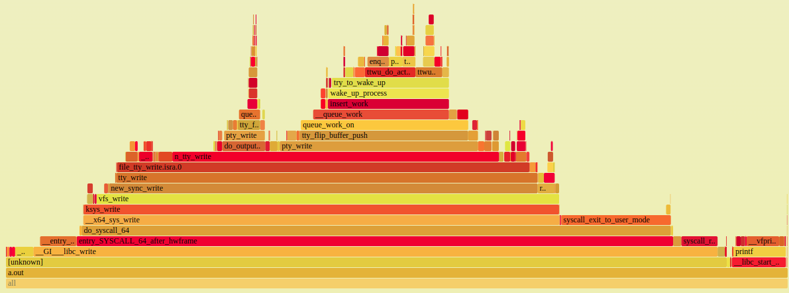

# tty 到底是什么

> 本文多次使用 QEMU 和 FlameGraph 做实验，相关的使用可以参考其他文档，或者我的[blog](../tips-reading-kernel.md)

## 一些让我疑惑的事情

### "最小"的内核配置为什么需要 tty 模块
[Building a tiny Linux kernel](https://weeraman.com/building-a-tiny-linux-kernel-8c07579ae79d) 中描述构建最小内核镜像的方法，
通过 make tinyconfig 可以将几乎所有的内核选项关掉，但是为了能够使用终端，需要打开 tty 模块。

### 运行一个 Hello World 为什么大多数时间都不是在执行 Hello World
运行一个简单[^1]的 Hello World ，可以使用 [火焰图](../tips-reading-kernel.md) 简单的看一下 CPU 的大多数时间在干什么。

<p align="center">
  
</p>
<p align="center">
  在一个新的 tab 中查看大图
</p>

可以发现，除了 Hello World 程序 (a.out) 之外，还发现 [alacritty](https://github.com/alacritty/alacritty) 和 [tmux](https://github.com/tmux/tmux) 占用来不少时间，这是因为我首先启动一个 alacritty，然后在其中运行 tmux ，在 tmux
中运行的 Hello World 。

## 上古时代如何使用 tty
在上古时期，计算机非常昂贵，还没有显示器，软件工程师在 console 上操作，通过 serial 将命令发送给在空调房子里面的庞然大物。

<p align="center">
  
</p>
<p align="center">
from https://www.ibm.com/ibm
</p>

交互的示意图大概是这个样子的:
<p align="center">
  
</p>
<p align="center">
from https://www.linusakesson.net/programming/tty/
</p>

其中的 line discipline 就是负责简单的编辑功能，例如 Ctrl-w 可以删除一个单词的行为，那么为什么这个行为不是 Bash 来负责的?

因为 Bash 是用户态程序，用户每次按下一个字符如果发送给用户态程序，那么意味着每一个字符都需要进行内核和用户态的上下文切换，将字符编辑功能放到内核中，可以让处理一个字符的路径更短。
只有当用户按下 Enter 或者缓冲区溢出的时候，才需要将从 serial 发送的命令传递给用户态程序 Bash 。

实际上，在现代的机器上，也是可以找到的串口的，不过一般都是调试作用，下图是 LoongArch 3A5000 机箱背后的串口。
<p align="center">
  
</p>

如果在买一个串口转 usb ，将串口插到 LoongArch 3A5000 的串口上，然后 usb 的那一头插到另一台电脑上（例如 x86 电脑），并且在 x86 电脑上执行:
```sh
minicom -D /dev/ttyUSB0
```
那么在 x86 中 minicom 启动一个 LoongArch 的 shell 出来，从而可以使用 x86 电脑调试 LoongArch 电脑。


使用 `-serial mon:stdio` 参数启动 QEMU，也就是用 Host 的标准输入输出来模拟 Guest 的串口，Guest 的串口可以通过 /dev/ttyS0 来访问:
1. 如果向 /dev/ttyS0 中 echo，那么 Host 中的终端会显示对应的结果。
2. 如果 cat /dev/ttyS0 ，那么 Host 中的终端输入的内容会在其中显示。

演示效果如下:


当进行 echo aaa > /dev/ttyS0 的时候，在 gdb 中可以看到内核中的调用过程:
- 系统调用
  - `do_syscall_64`
  - `do_syscall_x64`
- vfs (Virtual File System)
  - `ksys_write`
  - `vfs_write`
  - `vfs_write`
  - `new_sync_write`
- tty core
  - `call_write_iter`
  - `file_tty_write`
  - `do_tty_write`
- line discipline
  - `n_tty_write`
  - `process_output_block`
- serial
  - `uart_write`
- uart
  - `serial8250_start_tx`

在上面的流程中，设计多次选择不同的 ops 的:
```c
static const struct file_operations tty_fops // <---- tty_fops ，当打开 /dev/ttyS0 这个文件，其 IO 操作最后会调用此处

static const struct tty_operations uart_ops  // <------ 选择 tty 的具体实现，如果是物理 serial，那么选择这个，如果是 pty 那就是 pty_unix98_ops

static const struct uart_ops serial8250_pops  // <------ uart 有 8250 和 16550 等信号
```

在内核中，`drivers/tty/n_tty.c` 中搜索符号 `WERASE_CHAR`，这就是处理 Ctrl-w 的相关代码。

最后，回答一下我之前的疑惑，为什么一个"最小"的内核配置需要添加上 tty 模块的，因为这个内核是最小的，没有其他的各种设备，例如显示器，键盘之类的，
但是可以另一台电脑上，通过串口连接，和这个"最小"的内核交互。交互的过程和上古时期的计算机流程上没有区别，唯一不同的是，
上古时期是通过硬件 console 发送命令，现在是另一台计算机上的 minicom 加上 usb 转串口线发送命令。

在如今的计算机上还保留 serial，主要为了调试内核程序，serial 非常的简单，稳定可靠，容易初始化，编程，有了 serial，内核就有了 printf 了。

## 现代计算机实现 tty
现代的计算机非常快，有 4k 显示器，有 x11 之类的桌面系统，有鼠标，已经不要通过 console serial 连接空调房子里面的大家伙，
那么我们平时的使用终端的过程工作原理是怎么样子的?

[build-your-own-x](https://github.com/danistefanovic/build-your-own-x) 中找到了这个教程:

https://www.uninformativ.de/blog/postings/2018-02-24/0/POSTING-en.html

其中的源码非常容易阅读，以下假设你已经阅读过了。我总结了 eduterm 的基本执行流程如下:



现代计算机实现 tty 是兼容了上古时期的 tty 的，但是其无需和具体的 serial 打交道。

通过上面的火焰图可以验证想法，将我们关心的部分重新截图一下:

<p align="center">
  
</p>
<p align="center">
  在一个新的 tab 中查看清晰图
</p>

我们发现，这个调用图路线中，一直到 `n_tty_write` 还是上一章中的 backtrace 是相同的，
但是之后调用的是 `pty_write` 而不是 `uart_write`，因为现在的设备无需使用硬件 serial 来实现，而是使用的 pseudo terminal 。

内核中定义了如下内容来实现 pty 。
```c
static const struct tty_operations ptm_unix98_ops = { //   /dev/ptmx 也就是 pty master 的操作
static const struct tty_operations pty_unix98_ops = { //   /dev/pts/[0-n] 的 pty slave 的操作
```

所以，第二个疑惑就可以解开了，虽然 printf 的确会消耗一些 CPU，那么输出工作都是 terminal emulator 和 tmux 负责的，
tty 交互实际上更加消耗 CPU 。好在现代的 CPU 足够快，输出到屏幕上的信息已经远远超过人的分析能力，

## 一些其他疑惑的解答


### tty 如何实现的
```txt
➜  vn git:(master) ✗ strace tty
ioctl(0, TCGETS, {B38400 opost isig icanon echo ...}) = 0
fstat(0, {st_mode=S_IFCHR|0620, st_rdev=makedev(0x88, 0x2), ...}) = 0
readlink("/proc/self/fd/0", "/dev/pts/2", 4095) = 10
stat("/dev/pts/2", {st_mode=S_IFCHR|0620, st_rdev=makedev(0x88, 0x2), ...}) = 0
fstat(1, {st_mode=S_IFCHR|0620, st_rdev=makedev(0x88, 0x2), ...}) = 0
write(1, "/dev/pts/2\n", 11/dev/pts/2
)            = 11
```
是通过读取 /proc/self/fd/0 软链接指向谁.

### stty 如何实现的
```plain
ioctl(0, TCGETS, {B38400 opost isig icanon echo ...}) = 0
ioctl(1, TIOCGWINSZ, {ws_row=73, ws_col=284, ws_xpixel=0, ws_ypixel=0}) = 0
fstat(1, {st_mode=S_IFCHR|0620, st_rdev=makedev(0x88, 0x2), ...}) = 0
ioctl(0, TIOCGWINSZ, {ws_row=73, ws_col=284, ws_xpixel=0, ws_ypixel=0}) = 0
write(1, "speed 38400 baud; rows 73; colum"..., 50speed 38400 baud; rows 73; columns 284; line = 0;
```
通过 ioctl 实现，在内核中对应的位置在这里:
```c
static const struct file_operations tty_fops = {
    .unlocked_ioctl = tty_ioctl,
};
```

### /dev/tty0 /dev/tty[1-63] /dev/tty 都是什么
/dev/tty[0-63] 是 virtual terminal (VT) 或 virtual console, Ctrl+Alt+Fn[1-n] 来打开 VT，Alt-Fn[1-n] 来切换，其中 /dev/tty0 指当前 VT

在内核中，VT 的实现位置在 drivers/tty/vt/ ，和使用 serial 相比，vt 使用的是 keyboard + vga 的实现方式
和 pseudo terminal 相比，这里完全绕过来用户态的图形栈，例如 x11

> /dev/tty is kind of an alias to the console (physical, virtual or pseudo device, if any) associated to the process that open it.

在 terminal emulator 中  `echo aaa > /dev/tty0` 没有任何回应，而在任意一个 VT 中，`echo aaa > /dev/tty0` 都是显示 `aaa`。
无论是在 terminal emulator 还是 VT 中，`echo aaa > /dev/tty` 都可以得到 `aaa`

本节参考 https://unix.stackexchange.com/questions/60641/linux-difference-between-dev-console-dev-tty-and-dev-tty0

### tmux 是如何实现的
如果理解了 eduterm ，tmux 的大致原理可以猜测到。在 eduterm 中只是管理一组 master 和 slave,
而 tmux 可以管理多组 master 和 slave ，下面是我唯一找到的一个参考:

https://www.quora.com/How-do-I-understand-the-tmux-design-architecture-and-internals

## 关键参考
- [TTY 到底是什么？](https://www.kawabangga.com/posts/4515)
- [Linux Device Driver 3 : Chapter 18](https://lwn.net/images/pdf/LDD3/ch18.pdf)
  - 其中分别构建了 mini 的 `tty_operations` 和 `uart_ops` 的实现
- [The Linux Programming Interface : Chapter 62](https://man7.org/tlpi/)

## 扩展阅读
- [A toy remote login server](https://jvns.ca/blog/2022/07/28/toy-remote-login-server/)
- [What happens when you press a key in your terminal?](https://jvns.ca/blog/2022/07/20/pseudoterminals/)
- [agetty](https://man7.org/linux/man-pages/man8/agetty.8.html) : init 启动到登录界面。

[^1]: 为了让 Hello World 程序更加明显，最好是循环输出多次，例如 100000 。

<script src="https://giscus.app/client.js"
        data-repo="martins3/martins3.github.io"
        data-repo-id="MDEwOlJlcG9zaXRvcnkyOTc4MjA0MDg="
        data-category="Show and tell"
        data-category-id="MDE4OkRpc2N1c3Npb25DYXRlZ29yeTMyMDMzNjY4"
        data-mapping="pathname"
        data-reactions-enabled="1"
        data-emit-metadata="0"
        data-theme="light"
        data-lang="zh-CN"
        crossorigin="anonymous"
        async>
</script>

本站所有文章转发 **CSDN** 将按侵权追究法律责任，其它情况随意。
