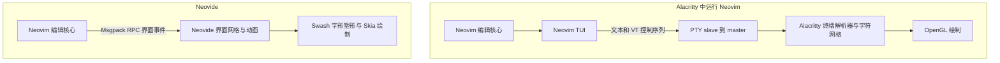

# tty in web

## 可以最后思考一下这个东西是如何实现的

说了这么多复杂的东西，那么
https://github.com/tsl0922/ttyd

## 岂不是 neovide 和 alacritty 的功能很类似吗?
https://github.com/neovide/neovide

**显示和输入这部分确实很像。比较编辑体验时，对应的是 Neovide 和
Alacritty 中运行的 Neovim：它们都把 Neovim 的界面画到一个桌面窗口里，
编辑、补全、LSP、插件等功能都由 Neovim 提供。**

两者的关键区别是连接什么协议：Alacritty 是通用终端模拟器，接收 PTY 中的
文本和终端控制序列；Neovide 是 Neovim 的专用 GUI，接收 Neovim 的界面 RPC。

调查日期：2026-09-28。源码放在 `~/data`：

- `~/data/neovide`：新 clone，commit `105fd640f836`，`Cargo.toml` 版本 `0.16.2`。
- `~/data/alacritty`：复用已有 clone，fetch 后确认 HEAD 与 `origin/master` 一致，
  commit `d692748d3f61`，版本 `0.18.0-dev`。

### 两条显示路径

下面画的是 Linux 上的逻辑层次，箭头表示屏幕更新的方向：

输入走反方向：Alacritty 将按键编码为字节或终端控制序列，写入 PTY；
Neovide 通过 `nvim_input()`、`nvim_input_mouse()` 等 API 把输入交给 Neovim。
Alacritty 可以直接承载 shell、tmux、htop、Vim 等程序，Neovide 的直接通信对象是 Neovim。

| 比较项 | Alacritty | Neovide |
| --- | --- | --- |
| 上游接口 | PTY 和通用终端协议 | Neovim Msgpack RPC / UI 协议 |
| 接收到的屏幕信息 | 字符、颜色、终端游标、滚动区域等 | 字符网格，以及编辑窗口、浮窗、模式等界面信息 |
| 窗口与输入事件 | `winit` | `winit` |
| 字体与绘制 | `crossfont` 字形光栅化、字形缓存、自写 OpenGL 渲染器 | `swash` 字形塑形、Skia 绘制 |
| 编辑文件、语法高亮、LSP | 其中运行的 Neovim 提供 | 连接的 Neovim 提供 |
| 终端模拟 | Alacritty 自己实现 | `:terminal` 时由 Neovim 实现 |

所以，Rust、GPU 加速、窗口、字体、剪贴板和输入法等实现工作有明显重叠。
决定两个程序用途的，是它们在绘制之前接收的协议和承担的状态管理。

### Alacritty：从 PTY 字节流还原终端屏幕

源码中的主要路径是：

1. `alacritty_terminal/src/tty/unix.rs` 的 `new()` 调用 `openpty()`，
   把子程序的 stdin/stdout/stderr 接到 slave；子程序启动前通过 `setsid()` 和
   `set_controlling_terminal()` 建立终端会话，Alacritty 持有 master。
   默认子程序是 shell，也可以配置成直接启动其他程序。
2. `alacritty_terminal/src/event_loop.rs` 的 `EventLoop::pty_read()` 从 master
   读字节，调用 `state.parser.advance()`。解析器来自 `vte::ansi::Processor`，
   更新 `Term` 中的字符网格、颜色、游标、模式和滚动历史。
3. `alacritty/src/display/mod.rs` 的 `Display::draw()` 收集可绘制的单元格；
   `alacritty/src/renderer/mod.rs` 的 `Renderer::draw_cells()` 交给
   GLSL3/GLES2 渲染器绘制。
4. `alacritty/src/input/keyboard.rs` 的 `Processor::key_input()` 根据终端模式
   编码按键，再调用 `write_to_pty()`。

例如 Neovim 想把光标移到某个位置，TUI 会发出相应的终端控制序列，
Alacritty 解析后更新自己的终端游标。它掌握的是这个位置的终端屏幕状态，
没有通过该协议获得“这里是 Neovim 的哪个编辑窗口、哪个浮窗”的对象关系。

相关源码：[PTY 创建](https://github.com/alacritty/alacritty/blob/d692748d3f61253ebe9f5094320120d22f6a046f/alacritty_terminal/src/tty/unix.rs)、
[PTY 读取与解析](https://github.com/alacritty/alacritty/blob/d692748d3f61253ebe9f5094320120d22f6a046f/alacritty_terminal/src/event_loop.rs)、
[键盘输入](https://github.com/alacritty/alacritty/blob/d692748d3f61253ebe9f5094320120d22f6a046f/alacritty/src/input/keyboard.rs)。

### Neovide：直接消费 Neovim 的界面事件

默认本地启动路径是：

1. `src/bridge/command.rs` 的 `build_nvim_command_parts()` 和 `append_embed_arg()`
   构造 `nvim --embed`。这是 Neovim 的嵌入式 RPC 模式。
2. `src/bridge/session.rs` 的 `NeovimInstance::spawn_process()` 用
   `Stdio::piped()` 连接 stdin/stdout/stderr；stdin/stdout 用于双向 RPC，
   stderr 另行处理。这条 GUI 通信路径无需创建 PTY。
3. `src/bridge/mod.rs` 的 `create_neovim_session()` 调用 `ui_attach()`，
   开启 `ext_linegrid`，默认也开启 `ext_multigrid`，注册成 Neovim 的外部 UI。
4. `src/bridge/handler.rs` 的 `NeovimHandler::handle_notify()` 接收 `redraw`
   通知，交给 `parse_redraw_event()` 解析；`src/editor/mod.rs` 的
   `Editor::handle_redraw_event()` 更新界面网格、光标和窗口，生成绘制命令。
   这里的 `Editor` 是界面状态管理对象，文件编辑核心仍在 Neovim 中。
5. `src/bridge/ui_commands.rs` 的 `SerialCommand::execute()` 通过
   `nvim.input()` / `nvim.input_mouse()` 等 API 回传输入。

Neovim 已经提供了不依赖终端显示的 RPC 接口，因此普通管道就能承担 GUI 通信。
Alacritty 要承载传统终端程序，还需提供这些程序依赖的 tty 接口，PTY 承担这层适配。

典型消息包括：

- `grid_line`：更新指定网格的一段字符和高亮。
- `grid_cursor_goto`：更新指定网格上的光标位置。
- `hl_attr_define`：定义高亮属性。
- `win_pos` / `win_float_pos`：更新编辑窗口、浮窗的位置和层次。
- `win_viewport`：更新窗口视口和滚动信息。
- `mode_change`：通知 Neovim 模式变化。

这些消息仍然主要描述字符网格和界面布局，Neovide 无需自己分析源文件或执行 LSP。
`ext_multigrid` 让它拿到独立的窗口网格，因此可以分别处理编辑区、浮窗和它们的移动。

相关源码：[启动参数](https://github.com/neovide/neovide/blob/105fd640f83616501d7c6bfedb0b4c15ab9515e1/src/bridge/command.rs)、
[进程与通信](https://github.com/neovide/neovide/blob/105fd640f83616501d7c6bfedb0b4c15ab9515e1/src/bridge/session.rs)、
[UI 注册](https://github.com/neovide/neovide/blob/105fd640f83616501d7c6bfedb0b4c15ab9515e1/src/bridge/mod.rs)、
[界面事件处理](https://github.com/neovide/neovide/blob/105fd640f83616501d7c6bfedb0b4c15ab9515e1/src/editor/mod.rs)。

### 为什么 Neovide 的视觉效果更容易针对编辑器定制

Neovide 的 `src/renderer/fonts/caching_shaper.rs` 中，`CachingShaper::shape()`
通过 Swash 对文本进行字形塑形，构造 Skia `TextBlob`；
`src/renderer/grid_renderer.rs` 的 `GridRenderer::draw_foreground()` 绘制这些字形。
`src/renderer/mod.rs` 的 `create_skia_renderer()` 支持 OpenGL，以及平台对应的
Metal、Direct3D 后端。

`src/renderer/rendered_window.rs` 的 `RenderedWindow::animate()` 实现窗口位置和
滚动动画；`src/renderer/cursor_renderer/mod.rs` 的 `CursorRenderer::animate()`
处理光标动画。因为 UI 协议提供窗口网格、浮窗层次和视口信息，Neovide 可以
针对这些对象做平滑滚动、窗口移动、浮窗模糊和阴影。
官方[功能说明](https://neovide.dev/features.html)也列出了连字、光标动画、
平滑滚动、窗口动画和浮窗模糊。

通用终端也可以实现连字、动画等效果；Neovide 的特点在于能利用 Neovim
提供的窗口信息做定制。上述路径差异解释了实现方式，性能高低仍需按具体负载测量。

### Neovide 里的 `:terminal` 是谁实现的

Neovim 本身内置基于 libvterm 的终端模拟器，终端内容呈现在特殊 buffer 中。
在 Neovide 里执行 `:terminal` 时，Linux 上的输出路径是：

因此，Neovide 可以显示交互式 shell，但 PTY、终端协议解析和终端 buffer
由 Neovim 提供。参见 Neovim 官方 [Terminal 文档](https://github.com/neovim/neovim/blob/master/runtime/doc/terminal.txt)
中的 `terminal-emulator` 和 `terminal-start` 章节。

本机用 Neovim `0.12.3` 做了一个最小 RPC 实验，模拟外部 UI：启动
`nvim --embed -u NONE -i NONE -n`，调用 `nvim_ui_attach()`，写入一行文本，
再用 `jobstart(..., {term=true})` 启动终端任务。

- 正常收到 `grid_line`、`grid_cursor_goto`、`hl_attr_define`、`win_pos`、
  `win_viewport`、`mode_change` 等 `redraw` 事件。
- 打开终端任务前，嵌入式 Neovim 没有 PTY master fd。
- 打开终端任务后，任务子进程 stdin 指向 `/dev/pts/6`；Neovim 有 3 个
  master fd，`fdinfo` 的 `tty-index` 都是 6，即同一对 PTY 的多个 fd。

实验客户端使用 `vim.system()`，其 stdio 在本机 `/proc/.../fd` 中显示为 socket，
与 Neovide 源码中的 Rust 管道实现不同；实验验证的是 UI RPC 无需 PTY，
以及内置终端任务会在 Neovim 侧创建 PTY。

### 使用上的对应关系

如果你主要全屏使用 Neovim，两种方式运行的是同一个编辑器核心，也通常读取
同一套 Neovim 配置，编辑功能自然接近。Neovide 提供另一套显示和输入前端，
Alacritty 同时适用于 Neovim 之外的终端程序。

Alacritty 的 [Vi Mode](https://github.com/alacritty/alacritty/blob/d692748d3f61253ebe9f5094320120d22f6a046f/docs/features.md)
用于浏览、选择、复制终端屏幕和滚动历史；其中的 Vim 风格按键不等于文件编辑器。

Neovide 也支持用 `--server` 连接已有 Neovim 实例，包括 Unix socket 和 TCP，
可以通过 SSH 转发连接远端编辑器。远程场景的区别仍是终端协议与编辑器 RPC，
参见官方[连接已有实例的说明](https://neovide.dev/features.html#connecting-to-an-existing-neovim-instance)。

## 其他资源
https://github.com/yudai/gotty
https://github.com/tsl0922/ttyd

这里的 Code With Copilot Agent Mode 获取的 VSCODE 中的 terminal 都是如何实现的 ?
https://github.com/Martins3/My-Linux-Config/issues/189

本站所有文章转发 **CSDN** 将按侵权追究法律责任，其它情况随意。
