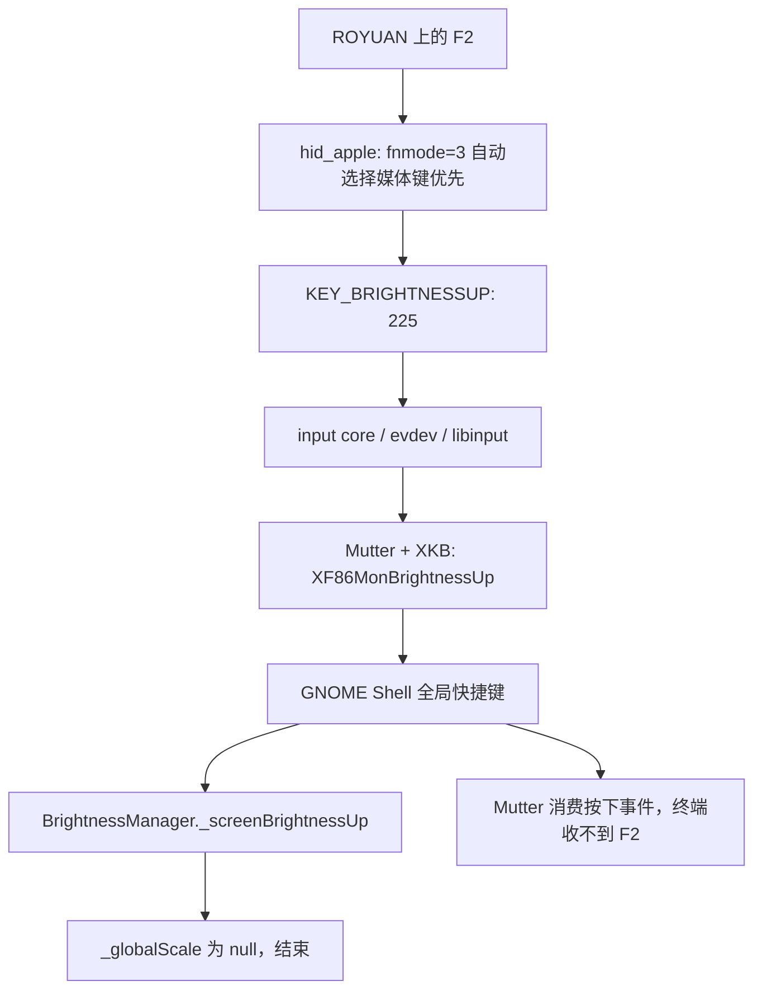

# keyboard

## 一个有趣的键盘问题的调查

我今天打开 codex ，发现有一个 warning 需要解决，我按 F2 没有反应:
```txt
🧀  co
╭────────────────────────────────────────────────╮
│ >_ OpenAI Codex (v0.156.0)                     │
│                                                │
│ model:     GPT-6-Astra high   /model to change │
│ directory: ~/data/vn                           │
╰────────────────────────────────────────────────╯

  Tip: Try the Desktop app on Linux: install it from https://learn.chatgpt.com/docs/linux/linux-app and run 'chatgpt'.


› Ask Codex to do anything

  GPT-6-Astra high · ~/data/vn                                                                                                  ⚠ 1 warning · f2 to view
```

这个对我来说，不算是一个很奇怪的事情，因为我之前在 Htop 中想要 kill 掉程序的时候，按 F9 没有反应，不过当时没有时间调试这个问题。
既然遇到两次了，那么

## codex 的排查的结果

```txt
目前最可疑的是 键盘驱动把 F2 转成了“增加亮度”。

实际检查到：

- 键盘是 ROYUAN Gaming keyboard，却上报 Apple ID 05ac:024f，因此加载了 hid_apple。
- 驱动参数 fnmode=3（自动）。按驱动逻辑会采用媒体键优先，将 F2 转为 KEY_BRIGHTNESSUP。驱动源码中的
  hidinput_apple_event() (https://github.com/torvalds/linux/blob/master/drivers/hid/hid-apple.c)

- Ghostty、tmux 和 GNOME 配置里没有发现普通 F2 快捷键冲突。

可以临时切换为功能键优先，立即生效：

echo 2 | sudo tee /sys/module/hid_apple/parameters/fnmode

然后再试 F2。这个设置会影响 F1–F12，重启后恢复。目前我没有修改配置；刚才监听期间没捕获到 F2 或亮度键事件，所以还差实际按键验证。

Worked for 2m 41s · 9:42 AM
```

虽然我做了这么长时间 (2019 ~ 2026) 的 Linux kernel ，这个问题排查起来我完全没有思路
1. 我会怀疑是 gnome 的问题，但是 gnome 我完全不懂
2. 也许我会想到切换一下键盘，然后认为是这个键盘的问题
3. 键盘的 key code 机制我完全不懂，也是不知道如何入手

## 验证
echo 2 | sudo tee /sys/module/hid_apple/parameters/fnmode 后，

按 F2 ，获取到如下结果:
```txt
Codex is ignoring 3 unrecognized configuration settings. Check for typos or deprecated settings.
      user (/home/martins3/.codex/config.toml): `disable_response_storage` is ignored.
      user (/home/martins3/.codex/config.toml): `network_access` is ignored.
      user (/home/martins3/.codex/config.toml): `windows_wsl_setup_acknowledged` is ignored.
```

## 原理分析

cat /proc/bus/input/devices 可以找到这个键盘的信息:
```txt
I: Bus=0003 Vendor=05ac Product=024f Version=0111
N: Name="ROYUAN Gaming keyboard"
P: Phys=usb-0000:00:14.0-11/input0
S: Sysfs=/devices/pci0000:00/0000:00:14.0/usb1/1-11/1-11:1.0/0003:05AC:024F.0018/input/input115
U: Uniq=
H: Handlers=sysrq kbd leds event3
B: PROP=0
B: EV=120013
B: KEY=10000 0 0 0 101007b02001007 ff9f207ac14057ff ffbeffdfffefffff fffffffffffffffe
B: MSC=10
B: LED=1f

I: Bus=0003 Vendor=05ac Product=024f Version=0111
N: Name="ROYUAN Gaming keyboard"
P: Phys=usb-0000:00:14.0-11/input1
S: Sysfs=/devices/pci0000:00/0000:00:14.0/usb1/1-11/1-11:1.1/0003:05AC:024F.0019/input/input116
U: Uniq=
H: Handlers=kbd mouse1 event11
B: PROP=0
B: EV=10001f
B: KEY=3f00733fff 0 0 483ffff17aff32d bfd4444600000000 70001 130ff38b17d007 ffe77bfad941dffd 81beffcd01cfffff febffbffdffffffe
B: REL=1943
B: ABS=10100000000
B: MSC=10
```

cat /sys/bus/hid/devices/0003:05AC:024F.0018/uevent

```txt
cat /sys/bus/hid/devices/0003:05AC:024F.0018/uevent

DRIVER=apple
HID_ID=0003:000005AC:0000024F
HID_NAME=ROYUAN Gaming keyboard
HID_PHYS=usb-0000:00:14.0-11/input0
HID_UNIQ=
MODALIAS=hid:b0003g0000v000005ACp0000024F
```

这里的 0003 表示 USB，05ac 是厂商 ID，024f 是产品 ID。设备名称字符串与这些数字 ID 是独立字段，所以可以同时出现“ROYUAN”和 Apple 的 ID。

hid_apple 主要处理 Apple HID 设备的特殊行为，包括
Fn、功能键、布局和部分鼠标兼容处理，也兼容一些第三方键盘。
它按设备匹配表绑定，并不验证键盘是否真由 Apple 制造。

## KEY_BRIGHTNESSUP 在本机如何一路传递

这部分根据 2026-09-23 的现场状态和对应版本源码补充。先说本机的结果：修复前，F2 可以被 `hid_apple` 转成亮度增加键，随后被 GNOME 的全局快捷键处理；但本机没有 GNOME 可用的亮度控制对象，所以处理到这里就结束了，既不会调亮显示器，也不会把原来的 F2 交给终端。

当前 `fnmode` 已经是 `2`，不按 Fn 时 F2 保持为 F2。下面涉及亮度事件的链路，是解释修复前 `fnmode=3` 的行为，以及本机收到 `KEY_BRIGHTNESSUP` 时会如何处理，不能把它误读成当前普通 F2 仍在生成亮度事件。

#### 现场和源码版本

| 项目 | 本机实测 |
| --- | --- |
| 系统 | Fedora Linux 44，GNOME Wayland |
| 运行内核 | `7.1.3-201.fc44.x86_64` |
| 键盘 | `ROYUAN Gaming keyboard`，USB ID `05ac:024f` |
| HID 驱动 | `/sys/bus/hid/devices/0003:05AC:024F.0018/uevent` 中 `DRIVER=apple` |
| 主键盘接口 | `/dev/input/event3`，另一个接口为 `event11`；编号会随重新枚举变化 |
| 当前参数 | `/sys/module/hid_apple/parameters/fnmode` 为 `2` |
| GNOME Shell / Mutter | `50.4-1.fc44` / `50.4-1.fc44` |
| gnome-settings-daemon | `50.1-1.fc44` |
| libinput / libevdev | `1.31.3-1.fc44` / `1.13.7-1.fc44` |
| libxkbcommon / xkeyboard-config | `1.13.1-2.fc44` / `2.47-1.fc44` |
| 当前显示设备 | Intel UHD Graphics 770，驱动 `i915`；HDMI-2 连接 DELL S2721QS，3840×2160@60Hz，当前为默认 SDR 色彩模式 |
| 内核背光接口 | `/sys/class/backlight` 为空 |
| Mutter 背光列表 | `org.gnome.Mutter.DisplayConfig.Backlight = (2, [])`；`2` 是 serial，空数组才是设备列表 |
| Shell 亮度控制能力 | `org.gnome.Shell.Brightness.HasBrightnessControl = false` |

相关源码已放到 `~/data`，按函数、宏和对象名称定位，不依赖行号：

| 项目 | 本地目录 | 固定版本 / commit |
| --- | --- | --- |
| Linux | `~/data/linux-keyboard-7.1.3` | `v7.1.3` / `199c9959d3a9` |
| libevdev | `~/data/libevdev` | `libevdev-1.13.7` / `a158f468affb` |
| libinput | `~/data/libinput` | `1.31.3` / `26191d396d74` |
| libxkbcommon | `~/data/libxkbcommon` | `xkbcommon-1.13.1` / `6f76d19db72b` |
| xkeyboard-config | `~/data/xkeyboard-config` | `xkeyboard-config-2.47` / `a79055334104` |
| Mutter | `~/data/mutter` | `50.4` / `8fe247a25a5b` |
| GNOME Shell | `~/data/gnome-shell` | `50.4` / `dcda6594b153` |
| gnome-settings-daemon | `~/data/gnome-settings-daemon` | `50.1` / `ec681847221c` |
| systemd | `~/data/systemd-259.8` | `v259.8` / `6576434737de` |

用户态仓库采用与本机 RPM 上游版本一致的 tag；这里没有声称它们包含 Fedora 的全部下游补丁。Linux 仓库是复用已有 `~/data/kernel/linux` 对象的共享 clone，只检出了相关目录，固定在上游 `v7.1.3`，没有改变原来的内核工作区；它也不是 Fedora SRPM 的完整重建树。

以下证据由设备属性、运行中的 D-Bus 服务、已安装配置和源码相互核对得到。本轮没有把 `fnmode` 改回去，也没有抓到修复前的完整物理按键事件，因此 USB 报告到回调的部分是源码推导，不是一次从硬件到桌面的完整动态追踪。

#### 第一步：USB 报告里的 F2 被 hid_apple 改写

先区分几种不同编号：

| 层次 | F2 | 增加屏幕亮度 |
| --- | --- | --- |
| USB HID usage 示例 | Keyboard 页 `0x07`，F2 usage `0x3b` | Consumer 页 `0x0c`，Brightness Increment usage `0x6f` |
| Linux input keycode | `KEY_F2 = 60` | `KEY_BRIGHTNESSUP = 225` |
| XKB keycode | `60 + 8 = 68`，键名 `<FK02>` | `225 + 8 = 233`，键名 `<I233>` |
| XKB keysym | `F2`，`0xffbf` | `XF86MonBrightnessUp`，`0x1008ff02` |

本机的问题是驱动把 F2 改成亮度键，不要求键盘先发出 Consumer 页的亮度 usage。`drivers/hid/hid-input.c` 的 `hid_keyboard[]` 和 `hidinput_configure_usage()` 将普通 F2 usage 映射为 `KEY_F2`；随后 Apple 驱动还可以在事件阶段改写它。

相关调用关系如下，中间省略了 HID 报告字段解析细节：

```text
USB interrupt IN 报告完成
  drivers/hid/usbhid/hid-core.c: hid_irq_in()
    → hid_safe_input_report()
      → __hid_input_report()
        → hid_report_raw_event()
          → hid_process_event()
            → hdrv->event，即 apple_event()
              → hidinput_apple_event()
```

`drivers/hid/hid-ids.h` 把 `0x024f` 定义为 `USB_DEVICE_ID_APPLE_ALU_REVB_ANSI`。`drivers/hid/hid-apple.c` 的 `apple_devices[]` 给这个 ID 设置 `APPLE_HAS_FN`，因此 `apple_event()` 会进入 Fn 转换逻辑。

`hidinput_apple_event()` 做了两次选择：

1. `fnmode=3` 表示自动判断。这个 ID 没有禁用功能键，`ROYUAN Gaming keyboard` 也不在 `non_apple_keyboards[]` 的名称前缀列表中，因此走到 `real_fnmode=1`，即媒体键优先。
2. 对 `0x024f`，函数选择 `apple_fn_keys[]`。其中明确包含：

```c
{ KEY_F2, KEY_BRIGHTNESSUP, APPLE_FLAG_FKEY },
```

在 `real_fnmode=1` 且没有按 Fn 时，`do_translate = !asc->fn_on`，于是 `code` 从 `60` 变成 `225`。随后调用：

```c
input_event_with_scancode(input, usage->type, code, usage->hid, value);
```

这个辅助函数最终执行 `input_event(input, EV_KEY, KEY_BRIGHTNESSUP, value)`。Apple 回调返回已处理，`hid_process_event()` 就不会再把同一个 usage 交给通用 `hidinput_hid_event()` 重复上报为 F2。

所以，转换发生在内核 HID 驱动里。到用户态时，普通 F2 已经不存在了。反过来，当前 `fnmode=2` 时转换条件变成 `do_translate = asc->fn_on`；不按 Fn，F2 走通用上报路径，保持 `KEY_F2`。

源码入口：[Linux v7.1.3 的 hid-apple.c](https://git.kernel.org/pub/scm/linux/kernel/git/stable/linux.git/tree/drivers/hid/hid-apple.c?h=v7.1.3)，重点看 `apple_devices[]`、`non_apple_keyboards[]`、`apple_fn_keys[]`、`hidinput_apple_event()`。

#### 第二步：input core 和 evdev 把 225 交给用户态

在 `drivers/input/input.c` 中：

```text
input_event()
  → input_handle_event()
    → input_event_dispose()
      → input_pass_values()
        → input handler 的 handle_events()
          → evdev_events()
            → evdev_pass_values()
              → 每个 evdev 读者自己的事件缓冲区
```

HID 报告处理完成时，`drivers/hid/hid-input.c` 的 `hidinput_report_event()` 调用 `input_sync()`，产生 `EV_SYN / SYN_REPORT`，标记一组事件完成，并触发正常的批量分发。用户态对 `/dev/input/event3` 的读取进入 `drivers/input/evdev.c` 的 `evdev_read()`。

对于被转换的 F2，读者拿到的关键事件是：

```text
EV_KEY  KEY_BRIGHTNESSUP(225)  1    按下
EV_SYN  SYN_REPORT            0
EV_KEY  KEY_BRIGHTNESSUP(225)  0    松开
EV_SYN  SYN_REPORT            0
```

上面是事件形状示意，不是本次抓到的日志；实际报告还可能包含 `EV_MSC / MSC_SCAN` 等事件。`EV_KEY.value` 表示按下、松开或重复，不表示亮度，也不携带“增加 5%”。

`/proc/bus/input/devices` 中的 `kbd` 和 `event3` 是 input 子系统的不同 handler。这里 GNOME Wayland 走的是 evdev；它不是先经过虚拟控制台的 `kbd`，再经过 TTY 传到桌面。

#### 第三步：libinput 保留 keycode，Mutter 和 XKB 解释它

Mutter 的原生输入后端使用 libinput。它们是 GNOME Shell 进程内的库和组件，不是每个名字都对应一个独立守护进程。

读取和分发大致分为三层：

```text
libinput/src/evdev.c: evdev_device_dispatch()
  → libevdev_next_event()
    → libevdev/libevdev.c: read_more_events()
      → read(event fd)，进入内核 evdev_read()

读到的事件按帧交给 libinput dispatch
  → src/evdev-fallback.c: fallback_interface_process()
    → fallback_interface_process_event()
      → fallback_process_key()
        → fallback_keyboard_notify_key()
          → src/libinput.c: keyboard_notify_key()
            → LIBINPUT_EVENT_KEYBOARD_KEY，key 仍为 225

Mutter src/backends/native/meta-seat-impl.c
  process_device_event()
    → meta_seat_impl_notify_key_in_impl()
      → meta_key_event_new_from_evdev()
        → Clutter 按键事件
```

libinput 不负责决定亮度策略，也不把这个键变成字符。它还会在 `fallback_process_key()` 中忽略内核的 `value=2` 重复事件，桌面的按键重复由上层处理。

Mutter 的 `src/backends/native/meta-xkb-utils.c` 中，`meta_xkb_evdev_to_keycode()` 加上固定偏移 8，然后通过 libxkbcommon 的 `xkb_state_key_get_one_sym()` 查询 keysym：

```text
Linux KEY_BRIGHTNESSUP = 225
  → XKB keycode 233
  → xkeyboard-config/keycodes/evdev: <I233> = 233
  → xkeyboard-config/symbols/inet: <I233> 对应 XF86MonBrightnessUp
```

这个偏移来自 evdev XKB 键位表的历史约定；运行 Wayland 也会使用它，不能据此认为事件经过了 X server。

使用本机 `/usr/lib64/libxkbcommon.so.0` 和默认键位表做只读验证，结果为：

```text
evdev=60, xkb=68, keysym=F2 (0xffbf)
evdev=225, xkb=233, keysym=XF86MonBrightnessUp (0x1008ff02)
```

这验证了键位映射，不等于捕获了一次物理按键。源码入口：[Mutter meta-xkb-utils.c](https://gitlab.gnome.org/GNOME/mutter/-/blob/50.4/src/backends/native/meta-xkb-utils.c)、[xkeyboard-config 的 inet 符号表](https://gitlab.freedesktop.org/xkeyboard-config/xkeyboard-config/-/blob/xkeyboard-config-2.47/symbols/inet)。

#### 第四步：GNOME 50 的 Shell 注册并消费亮度快捷键

本机实际配置是：

```text
schema: org.gnome.shell.keybindings
key:    screen-brightness-up
value:  ['XF86MonBrightnessUp']
```

在 GNOME Shell `js/ui/main.js` 初始化时创建 `BrightnessManager`。其实现位于 `js/misc/brightnessManager.js`，构造函数直接注册快捷键：

```js
Main.wm.addKeybinding(
    'screen-brightness-up',
    new Gio.Settings({schema_id: KEYBINDING_SCHEMA}),
    Meta.KeyBindingFlags.NONE,
    Shell.ActionMode.ALL,
    this._screenBrightnessUp.bind(this));
```

`js/ui/windowManager.js` 的 `addKeybinding()` 调用 `global.display.add_keybinding()`，进入 Mutter 的 `meta_display_add_keybinding()`。Mutter 将配置里的快捷键解析成可匹配的 keycode 和修饰键组合。

发生按键时，正常桌面模式下的相关路径是：

```text
Mutter src/core/events.c: meta_display_handle_event()
  → src/core/keybindings.c: meta_keybindings_process_event()
    → process_key_event()
      → process_event()
        → get_keybinding()
        → invoke_handler()
          → Shell BrightnessManager._screenBrightnessUp()
        → 返回 CLUTTER_EVENT_STOP
```

这里的关键是：**匹配到快捷键并调用回调之后，Mutter 就认为按下事件已被处理；它不会根据屏幕有没有真的变亮，决定是否再把事件交给终端。** `meta_display_handle_event()` 也会因此停止后续分发，避免同一次按键又进入普通 Wayland 客户端。

所以终端、tmux、Codex 不会收到原本期待的 F2。当前改成 `fnmode=2` 后，事件保持为 F2，也就不会匹配这条 `XF86MonBrightnessUp` 绑定。

这里不能套用旧版 GNOME 的 `gsd-media-keys → org.gnome.SettingsDaemon.Power.Screen.StepUp` 路径。本机 GNOME 50 的屏幕亮度按键由 Shell 的 `BrightnessManager` 处理；现场 `org.gnome.SettingsDaemon.Power` 对象也已经没有 `Power.Screen` 接口，仍有的 `Power.Keyboard` 是键盘背光。`gnome-settings-daemon` 中仍能搜到 `do_brightness_action()`，但不能仅凭同名函数就判断屏幕亮度经过它。

源码入口：[GNOME Shell brightnessManager.js](https://gitlab.gnome.org/GNOME/gnome-shell/-/blob/50.4/js/misc/brightnessManager.js)、[Mutter keybindings.c](https://gitlab.gnome.org/GNOME/mutter/-/blob/50.4/src/core/keybindings.c)、[Mutter events.c](https://gitlab.gnome.org/GNOME/mutter/-/blob/50.4/src/core/events.c)。

#### 第五步：本机在这里结束，没有执行硬件调光

Shell 的亮度回调只有：

```js
_screenBrightnessUp() {
    this._globalScale?.stepUp();
}
```

同一个文件中的 `_monitorsChanged()` 只为存在 backlight 对象且处于活动状态的显示器建立亮度调节对象；如果一个都没有：

```js
if (monitors.length === 0) {
    this._globalScale = null;
}
```

`js/ui/shellDBus.js` 中的 `BrightnessDBus._sync()` 进一步把 `!!this._manager.globalScale` 导出为 `HasBrightnessControl`。因此，本机读到的 `HasBrightnessControl=false` 直接对应这个空对象状态，`?.stepUp()` 不会执行。

为什么没有 backlight 对象？Mutter 中的查找路径为：

```text
src/backends/meta-monitor.c: meta_monitor_create_backlight()
  → meta_output_create_backlight()
    → native/meta-output-kms.c: meta_output_kms_create_backlight()
      → 当前 SDR 模式：meta_backlight_sysfs_new()
        → meta-udev.c: meta_udev_backlight_find()
          → 查询 udev 的 backlight 子系统
          → 没有匹配设备，返回 NULL
```

这与 `/sys/class/backlight` 为空、Mutter `Backlight` 列表为空相互印证。Mutter 50.4 还有 HDR 的 reference-white 亮度路径，但本机当前 `color-mode=0`，不走那个分支。当前路径也没有自动转去发送 DDC/CI 命令。

这并不证明 DELL 显示器在硬件上不支持调光，也没有验证它的 DDC/CI 能力；结论仅是当前 GNOME 会话没有可用的亮度控制对象。

修复前的源码路径可以合在一起看：



#### 如果有背光设备，后半段如何真正生效

这一段是相同版本源码中的后续分支，**不是本机已经执行过的链路**。以 GNOME 找到了 sysfs 背光设备为条件：

```text
Shell BrightnessManager._screenBrightnessUp()
  → BrightnessScale.stepUp()
  → value 改变，触发 notify::value
  → BrightnessManager._sync()
  → MonitorBrightnessScale.setBacklight()
  → _setRelativeBrightness()
  → 设置 Mutter MetaBacklight 的 brightness 属性
```

Shell 的 `SCALE_VALUE_N_STEPS=20`；它还会考虑设备支持的档位数，因此通常一次增加归一化范围的 1/20，档位少的设备会采用更大的步长。再通过 `min + (max - min) * brightness` 换算成设备数值。

Shell 通过 GObject introspection 直接使用同一进程中的 Mutter 对象。这里没有必要先调用旧的 GSD `Power.Screen.StepUp`，也不是每次都通过 DisplayConfig 的 D-Bus `SetBacklight` 接口绕回来。

随后，对于使用 logind 的 sysfs 实现：

```text
Mutter src/backends/meta-backlight.c
  meta_backlight_set_property()
    → meta_backlight_set_brightness()
      → meta-backlight-sysfs.c: meta_backlight_sysfs_set_brightness()
        → 系统 D-Bus: org.freedesktop.login1.Session.SetBrightness
          参数："backlight", 设备名, 目标亮度

systemd src/login/logind-session-dbus.c
  method_set_brightness()
    → 检查活动会话、调用者身份、设备所属 seat
    → logind-brightness.c: manager_write_brightness()
      → brightness_writer_fork()
        → 子进程 sd_device_set_sysattr_value(device, "brightness", ...)
          → 写 /sys/class/backlight/<设备名>/brightness

Linux drivers/video/backlight/backlight.c
  brightness_store()
    → backlight_device_set_brightness()
      → bd->props.brightness = brightness
      → include/linux/backlight.h: backlight_update_status()
        → bd->ops->update_status(bd)
```

logind 在这里解决普通桌面进程写系统设备的权限问题；具体驱动实现最后一跳。Mutter 也保留了没有可用 session proxy 时的 helper 分支，入口为 `meta_backlight_sysfs_set_brightness_helper()`。

例如 Intel 内置面板注册了 `intel_backlight` 时，`drivers/gpu/drm/i915/display/intel_backlight.c` 的路径是：

```text
intel_backlight_device_update_status()
  → intel_panel_set_backlight()
    → 把用户亮度范围换算成硬件范围
    → 面板背光已启用时：intel_panel_actually_set_backlight()
      → panel->backlight.funcs->set()
        → 按平台选择 PWM 或 eDP AUX 等实现
```

其中一种 PWM 实现是 `intel_pwm_set_backlight() → bxt_set_backlight()`，最终调用 `intel_de_write()` 写 `BXT_BLC_PWM_DUTY(...)` 寄存器。这里仅用它说明驱动如何落到硬件；本机虽然使用 i915 输出画面，但没有 `intel_backlight` 设备，不能说本机 F2 最后写了这个寄存器。

另外，ACPI video 的 `acpi_video_device_notify()` 可以在收到固件通知 `0x86` 时安排内核调光工作，最终执行 `_BCM`。那条路径由 ACPI 通知触发，不是 input core 对所有 `KEY_BRIGHTNESSUP` 的通用处理；本机 ROYUAN 的 HID 路径不会仅因产生了 keycode 225，就自动触发这项 ACPI 工作。

源码入口：[Mutter meta-backlight-sysfs.c](https://gitlab.gnome.org/GNOME/mutter/-/blob/50.4/src/backends/meta-backlight-sysfs.c)、[systemd logind-brightness.c](https://github.com/systemd/systemd/blob/v259.8/src/login/logind-brightness.c)、[Linux backlight.c](https://git.kernel.org/pub/scm/linux/kernel/git/stable/linux.git/tree/drivers/video/backlight/backlight.c?h=v7.1.3)。

#### 现场复查命令

以下命令只读取状态，不改变键盘模式或屏幕亮度。版本查询明确使用 `/usr/bin/rpm`：本机 PATH 中另一个 RPM 工具默认数据库位置不匹配，可能误报软件未安装。

```bash
uname -r
/usr/bin/rpm -q gnome-shell mutter gnome-settings-daemon libinput libevdev libxkbcommon xkeyboard-config systemd
cat /sys/module/hid_apple/parameters/fnmode
cat /proc/bus/input/devices
ls -l /sys/class/backlight
gsettings get org.gnome.shell.keybindings screen-brightness-up

gdbus call --session \
	--dest org.gnome.Shell.Brightness \
	--object-path /org/gnome/Shell/Brightness \
	--method org.freedesktop.DBus.Properties.Get \
	org.gnome.Shell.Brightness HasBrightnessControl

gdbus call --session \
	--dest org.gnome.Mutter.DisplayConfig \
	--object-path /org/gnome/Mutter/DisplayConfig \
	--method org.freedesktop.DBus.Properties.Get \
	org.gnome.Mutter.DisplayConfig Backlight
```

本次最后两条命令分别返回：

```text
(<false>,)
(<(uint32 2, @aa{sv} [])>,)
```

排查时要分清两个检查点：`/dev/input/eventN` 有没有产生 `KEY_BRIGHTNESSUP`，与桌面有没有找到可调亮度的显示设备，是两件独立的事。前者正常、后者为空，就可能出现“亮度键被处理了，但屏幕没有变化”。本例还多了一层：用户真正想按的是 F2，修复点因此在 `hid_apple` 的 Fn 模式。

## 附录

### 为什么 cat /proc/bus/input/devices 可以看到两个关于此机器的项目

一个物理键盘可以通过 USB 暴露多个输入功能，而同一个输入设备也可以同时提供键盘和鼠标事件。

```txt
ROYUAN 物理键盘：USB 设备 1-11
├── 接口 1-11:1.0 → input115 → event3
│   └── 常规键盘功能、指示灯
└── 接口 1-11:1.1 → input116 → event11
    └── 按键、相对移动、滚轮等功能 → 同时挂接 mouse1
```

本机 USB 接口属性：第一个接口声明为 Boot Keyboard，第二个是普通 HID 接口。

关键在于，H: Handlers= 列出的是 内核挂接的输入事件处理器，不是物理设备清单：

 Handler             含义
━━━━━━━━━━━━━━━━━━  ━━━━━━━━━━━━━━━━━━━━━━━━━━━━━━━━━━━━━━━━━━━━━━━━━━━━━━━━
 kbd                 将适用的按键事件交给 Linux 虚拟控制台键盘处理
──────────────────  ────────────────────────────────────────────────────────
 event3 / event11    evdev 接口，用户程序通过 /dev/input/eventX 读取事件
──────────────────  ────────────────────────────────────────────────────────
 mouse1              mousedev 接口，通过 /dev/input/mouse1 提供兼容鼠标数据
──────────────────  ────────────────────────────────────────────────────────
 leds                键盘指示灯处理
──────────────────  ────────────────────────────────────────────────────────
 sysrq               Magic SysRq 按键处理

为什么第二个接口会挂上 mouse1？直接证据是 B: REL=1943。

这些 B: 字段是十六进制的能力位图，表示支持什么事件，不代表刚刚发生了什么。把 REL=1943 解码后得到：

REL_X                 水平相对移动
REL_Y                 垂直相对移动
REL_HWHEEL            水平滚轮
REL_WHEEL             垂直滚轮
REL_WHEEL_HI_RES       高精度垂直滚轮
REL_HWHEEL_HI_RES      高精度水平滚轮

内核根据这些能力匹配 mousedev。例如，mousedev.c 的 mousedev_ids[] 中，“支持按键事件和相对滚轮”就是一项匹配条件，因此这个接口会获得
mouse1。内核匹配代码 (https://github.com/torvalds/linux/blob/master/drivers/input/mousedev.c)

另外，第二个接口的 ABS=10100000000 对应 ABS_VOLUME 和 ABS_MISC，所以这里的 ABS 也不意味着一定存在触摸板或绝对坐标鼠标。

键盘固件可能为鼠标宏、按键模拟鼠标或通用固件功能声明这些能力。目前能确定的是它声明了这些能力；具体哪些操作会真的发出鼠标事件，还需
要实际测试。 mouse1 的出现本身不能证明 F2 被转换成了鼠标事件。

## 有趣
https://news.ycombinator.com/item?id=43520297

## qemu 键盘支持
guest 的“虚拟键盘”，就是 QEMU 模拟出来、供虚拟机操作系统使用的键盘设备，例如 PS/2 键盘或 USB 键盘。guest 的键盘
驱动会像处理真实键盘一样处理它。

这里要分清：键盘设备报告按了哪个键，键盘布局决定这个键代表哪个字符。 比如同一个按键位置，美式布局解释成 q，法式
AZERTY 布局解释成 a。

你提到的布局涉及两处设置：

 设置位置              作用                                       美式            法式
━━━━━━━━━━━━━━━━━━━━  ━━━━━━━━━━━━━━━━━━━━━━━━━━━━━━━━━━━━━━━━━  ━━━━━━━━━━━━━━  ━━━━━━━━━━━━━━━━━
 QEMU 启动参数         将 VNC 等前端传来的 keysym 转成按键编码    -k en-us        -k fr
────────────────────  ─────────────────────────────────────────  ──────────────  ─────────────────
 guest 操作系统内部    将虚拟键盘按键解释成字符                   English (US)    French / AZERTY

1. QEMU 侧

在原来的 QEMU 启动命令中添加 -k en-us 或 -k fr。

这只影响 QEMU 的输入转换，不会自动把 guest 系统设置成相应布局。主要是在普通 VNC 这类需要 keysym 转换的输入路径上
使用。

2. guest 内部

如果 guest 是 Linux：

• 图形桌面：在系统设置的“键盘／输入源”中添加并选择 English (US) 或 French。
• Linux 文本控制台：在 guest 内执行 sudo loadkeys us 或 sudo loadkeys fr。
• X11 图形会话：在 guest 内执行 setxkbmap us 或 setxkbmap fr。这不适用于原生 Wayland 会话，Wayland 使用桌面的键
  盘设置。

后两种命令通常用于临时切换，持久化方法取决于发行版。

如果 guest 是 Windows，在 guest 的语言设置中添加并选择 美式键盘或法语 AZERTY 键盘即可；键盘布局可以与系统显示语
言不同。

例如，普通 VNC 路径下要使用法式布局，配置关系是：

QEMU：-k fr
    ↓ 将收到的 a 转成法式 A 所在位置的按键
guest：French / AZERTY
    ↓ 将该按键解释为 a
应用程序收到 a

如果 VNC 客户端支持直接发送按键编码的扩展，通常可以不指定 -k，由 guest 内部的布局决定输入字符。


### pc-bios/keymaps/

是 QEMU 输入前端使用的键盘布局表，并不是 BIOS 内部需要的配置。它解决的问题是：收到“字符/按键符
号”时，如何转换成虚拟键盘的按键事件。

以普通 VNC 输入为例，客户端发送的是 keysym，例如 a，而 guest 的虚拟键盘需要的是按键编码。两者之间的转换取决于键
盘布局：

 收到的 keysym    美式布局 en-us           法式布局 fr
━━━━━━━━━━━━━━━  ━━━━━━━━━━━━━━━━━━━━━━━  ━━━━━━━━━━━━━━━━━━━━━━━
 a                0x1e，美式 A 键的位置    0x10，美式 Q 键的位置

对应定义就在 pc-bios/keymaps/en-us:146 和 pc-bios/keymaps/fr:116。因此输入路径大致是：

VNC 客户端发送 keysym
    → QEMU 按 keymap 转成按键编码
    → 虚拟键盘设备
    → guest 按自己的键盘布局解释

具体转换发生在 key_event() (ui/vnc.c:2015)，调用 keysym2scancode()。-k fr 等参数选择映射，VNC 默认加载 en-us。这
个参数不会修改 guest 的键盘布局，两侧配置需要配合。

放在 pc-bios/ 下，是因为这里也承载随 QEMU 分发的运行时数据。构建系统会将这些文件安装到 QEMU 数据目录的 keymaps/
中，QEMU 自己读取它们，并不会把它们作为 ROM 交给 guest。参见 安装规则 (pc-bios/keymaps/meson.build:47) 和 读取代
码 (ui/keymaps.c:96)。

如果前端能直接传递按键编码，就可以省去这次布局转换。例如 VNC 扩展键盘事件在没有显式指定 -k 时，会直接使用客户端
传来的 keycode，见 ext_key_event() (ui/vnc.c:2030)。

2026-09-29 : 但是话又说回来，这个真的很奇怪，为什么这个代码放到 pc-bios/ 下?

## 两个 backtrace

vmware 中的结果
```txt
  kbd_event
  input_to_handler
  input_pass_values.part.0
  input_event_dispose
  input_handle_event
  input_event
  atkbd_receive_byte
  ps2_interrupt
  serio_interrupt
  i8042_interrupt
  __handle_irq_event_percpu
  handle_irq_event
  handle_edge_irq
  __common_interrupt
  common_interrupt
  asm_common_interrupt
  acpi_safe_halt
  acpi_idle_do_entry
  acpi_idle_enter
  cpuidle_enter_state
  cpuidle_enter
  cpuidle_idle_call
  do_idle
  cpu_startup_entry
  start_secondary
  secondary_startup_64_no_verify
```

和 qemu 中结果无差别
```txt
@[
kbd_event+5
input_handle_events_default+66
input_pass_values+307
input_event_dispose+322
input_event+78
atkbd_receive_byte+1350
ps2_interrupt+158
serio_interrupt+71
i8042_handle_data+247
i8042_interrupt+17
__handle_irq_event_percpu+74
handle_irq_event+59
handle_edge_irq+151
__common_interrupt+62
common_interrupt+128
asm_common_interrupt+38
pv_native_safe_halt+15
default_idle+19
default_idle_call+48
do_idle+437
cpu_startup_entry+41
start_secondary+247
common_startup_64+318
]: 69
```

<script src="https://giscus.app/client.js"
        data-repo="martins3/martins3.github.io"
        data-repo-id="MDEwOlJlcG9zaXRvcnkyOTc4MjA0MDg="
        data-category="Show and tell"
        data-category-id="MDE4OkRpc2N1c3Npb25DYXRlZ29yeTMyMDMzNjY4"
        data-mapping="pathname"
        data-reactions-enabled="1"
        data-emit-metadata="0"
        data-theme="light"
        data-lang="zh-CN"
        crossorigin="anonymous"
        async>
</script>

本站所有文章转发 **CSDN** 将按侵权追究法律责任，其它情况随意。
