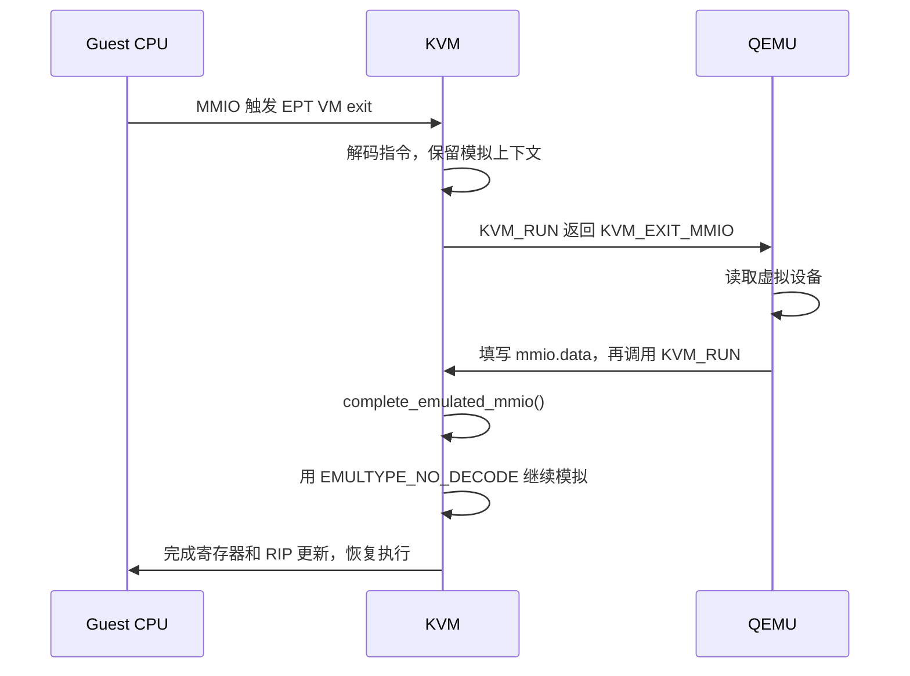

# x86 KVM 为什么需要指令模拟

**KVM 的指令模拟器负责在硬件不能直接完成某条 guest 指令时，用软件完成它对 guest
可见的效果。MMIO 是理解这套机制最好的入口：访问虚拟设备的，往往就是一条 普通的
`MOV`，但设备没有可以供 CPU 直接访问的 RAM backing；KVM 必须解码指令，
找出数据、宽度和目标，再把设备访问交给内核设备模型或 QEMU。**

x86 的复杂指令语义、旧硬件限制和需要跨用户态继续执行的 I/O，共同决定了它远不止
一个“解析变长指令并增加 RIP”的工具。

FIXME : 旧硬件限制和需要跨用户态继续执行的 I/O ???
FIXME : 但设备没有可以供 CPU 直接访问的 RAM backing ???

## 1. 先区分三种执行方式

| 执行方式                      | 例子                                                  | 是否进入通用指令模拟器 |
| ----------------------------- | ----------------------------------------------------- | ---------------------- |
| CPU 在 guest 中直接执行       | 普通计算、正常 RAM 访问                               | 否                     |
| VM exit 后由专用 handler 完成 | CPUID、RDMSR/WRMSR、常见 MOV CR、普通 IN/OUT          | 通常不需要             |
| 通用指令模拟                  | 普通指令访问被模拟的 MMIO、INS/OUTS、某些硬件回退路径 | 需要                   |
以 VMX 为例：

- `arch/x86/kvm/vmx/vmx.c` 的 `handle_cr()` 从 exit qualification 得到 CR 编号、通用寄存器编号和访问类型，可以直接修改虚拟 CR。
- 同文件的 `handle_io()` 对普通 IN/OUT 从硬件获得端口、方向、宽度， 使用 `kvm_fast_pio()`；只有 string I/O 分支进入 `kvm_emulate_instruction()`。
- `skip_emulated_instruction()` 通常直接使用 VMCS 的 `VM_EXIT_INSTRUCTION_LEN` 更新 RIP，并不取指、解码、执行整条指令。
因此，“发生 VM exit”与“需要完整指令模拟”不是一回事。

FIXME : 这个 skip_emulated_instruction() 和上面两个归为一类??

## 2. 最重要的场景：普通访存指令访问 MMIO

### 2.1 为什么修好页表然后重试不够

假设 guest 执行下面的指令，RBX 中的 guest 虚拟地址最终翻译到一个由 QEMU
模拟的设备寄存器 GPA：

```asm
mov dword ptr [rbx], eax
```

普通 RAM 的 EPT 映射缺失时，KVM 可以找到 backing page、建立 GPA 到 HPA 的映射，
然后保持 RIP 不变，让 CPU 重新执行。

被模拟的 MMIO 没有这样的 RAM backing。直接重试会再次退出；随意映射一页 RAM
只能保存字节，不能实现设备的副作用，例如通知 virtqueue、修改中断控制器状态、
读取设备状态或读取后清除状态。

FIXME : ??

KVM 此时需要完成的是：

1. 确认这条指令实际执行什么操作。
2. 找出写入值或读结果的去向，以及访问宽度。
3. 执行一次设备访问。
4. 完成寄存器、RFLAGS、RIP 等指令效果。

这里说的是**被软件模拟的 MMIO**。例如直通设备的 BAR 已映射给 guest 时，硬件可以
直接执行 MMIO；“访问设备”本身不必然意味着进入指令模拟器。

### 2.2 为什么 EPT exit 信息不够

VMX 的 EPT violation 提供 GPA 和访问属性，但没有普遍提供完成任意 x86 指令所需的
整套信息。例如，以下指令都可能访问同一个设备地址：

```asm
mov dword ptr [rbx], eax
mov dword ptr [rbx], 1
mov eax, dword ptr [rbx]
movzx eax, byte ptr [rbx]
add dword ptr [rbx], eax
```

仅知道“这个 GPA 被读/写了”还不够：数据可能来自寄存器或立即数；读结果可能需要
零扩展；ADD 还需要计算结果和
flags。字符串指令则涉及多个地址、重复次数和部分完成。

所以，**变长编码增加了解码成本，但根本原因是需要恢复并执行指令语义**。
即使知道指令长度，也不等于知道写入值、目标寄存器以及指令的其他副作用。

模拟器支持的是虚拟化所需的指令集合，并不是能替代完整 x86 CPU 的软件执行引擎。
遇到无法模拟的指令，需要按场景重试、注入异常或报告模拟失败。

### 2.3 实际入口

`arch/x86/kvm/vmx/vmx.c`、`vmx/common.h` 和 `mmu/mmu.c` 中的主路径：

```text
handle_ept_violation()
  -> __vmx_handle_ept_violation()
     -> kvm_mmu_page_fault()
        -> MMU 判定需要 RET_PF_EMULATE
           -> x86_emulate_instruction(..., EMULTYPE_PF, ...)
```

`EMULTYPE_PF` 表示传入的 CR2/GPA 有效，不表示所有缺页都需要模拟。

`kvm_mmu_page_fault()` 只有在处理结果是 `RET_PF_EMULATE` 时才调用模拟器。 正常
RAM 映射修复、重试或真正的 guest 页表权限错误，都有自己的处理结果。 尤其在通常的
EPT 配置下，guest 自己的普通 #PF 由硬件交给 guest，不必先退出到 KVM。

MMIO 还可能走另一条入口：

```text
handle_ept_misconfig()
  -> kvm_mmu_page_fault(..., PFERR_RSVD_MASK, ...)
     -> handle_mmio_page_fault()
        -> x86_emulate_instruction()
```

这是因为 KVM 可以用特殊的 MMIO SPTE 缓存“该 GPA 是 MMIO”，主动构造会引起 EPT
misconfiguration 的条目。这个场景中的 misconfig 不一定是页表出错。

### 2.4 为什么调用链这么深

以 MMIO 写为例，把 `emulate.c` 与 `x86.c` 两层展开后就是：

```text
x86_emulate_instruction()                  # KVM 总控，x86.c
  -> x86_decode_emulated_instruction()
     -> init_emulate_ctxt()                # guest 模式、RIP、flags、缓存
     -> x86_decode_insn()                  # emulate.c，解码与操作数定位
  -> x86_emulate_insn()                    # emulate.c，执行指令语义
     -> em_mov()
     -> writeback()
        -> segmented_write()
           -> linearize()                  # 分段与地址检查
           -> emulate_ops.write_emulated()
              -> emulator_write_emulated() # 回到 x86.c
                 -> emulator_read_write()
                    -> emulator_read_write_onepage()
                       -> 尝试 guest RAM
                       -> 尝试内核 MMIO 处理
                       -> 未处理部分记为 MMIO fragment
  -> 写回 flags、RIP、更新中断状态等
  -> 必要时返回用户态，exit_reason = KVM_EXIT_MMIO
```

这些层次分别负责指令语义、guest 地址语义、内存/设备访问和 KVM 运行状态。
深调用链并不意味着每层都在模拟一个独立设备，也不是再次运行整个 guest。

`emulator_read_write_onepage()` 先尝试 guest RAM，再尝试内核设备处理；
一条指令可以同时访问普通内存与 MMIO，跨页时还可能得到不连续的 GPA。
因此不能把所有操作数访问都简单转发为一个 QEMU 请求。

### 2.5 指令模拟和退出 QEMU 是两个不同步骤

`x86.c` 的 `vcpu_mmio_read()/vcpu_mmio_write()` 会尝试内核 APIC 模型与
`KVM_MMIO_BUS`。总线上的设备包括可以通知 eventfd 的 ioeventfd：
`virt/kvm/eventfd.c` 的 `ioeventfd_write()` 匹配地址、长度以及可选的数据值后，
直接调用 `eventfd_signal()`。

因此，有些访问仍需要模拟指令以得到写入值和宽度，但设备侧已经在内核处理完，
不产生 `KVM_EXIT_MMIO`。普通 PIO 也会通过 `KVM_PIO_BUS` 尝试内核处理。

还有更专门的优化：仅匹配地址的 MMIO ioeventfd（注册长度为 0，不能设置
DATAMATCH） 同时注册到 `KVM_FAST_MMIO_BUS`。非 nested guest 的
`handle_ept_misconfig()` 可以先尝试这个总线；匹配成功后通知 eventfd
并跳过指令，省去完整模拟。 `handle_apic_access()` 的部分 EOI
写也有绕过通用模拟的快速路径。

“设备在内核处理”“需要指令模拟”“需要退出到 QEMU”应当分别判断。

## 3. I/O completion 为什么又进入模拟器

以 MMIO 读为例：

```asm
mov eax, dword ptr [rbx]
```

KVM 在拿到设备返回值之前，无法完成 EAX 写回。设备在用户态时，指令执行需要暂停：



对应 `arch/x86/kvm/x86.c` 的调用关系：

```text
kvm_arch_vcpu_ioctl_run()
  -> vcpu->arch.complete_userspace_io()
     -> complete_emulated_mmio() / complete_emulated_pio()
        -> complete_emulated_io()
           -> kvm_emulate_instruction(..., EMULTYPE_NO_DECODE)
```

`EMULTYPE_NO_DECODE` 复用之前的模式、解码结果和读缓存，不重新取指。 `emulate.c`
的 `read_emulated()` 按顺序使用已完成的读结果； `x86.c` 的
`emulator_read_write()` 处理 `mmio_read_completed`。
这是继续完成同一条指令，不能算成 guest 又执行了一条新指令。

读和写还不对称：

- MMIO 读：需要返回值，首次模拟暂不完成最终状态写回，返回后继续模拟。
- MMIO 写：写入数据已知，通常可以先完成指令模拟，再向用户态提交数据；
  `complete_emulated_mmio()` 完成最后一个写 fragment
  后直接返回，不再进入模拟器。
- 每个 `kvm_run.mmio.data` 最多承载 8 字节；跨页或较大的访问可能需要多个
  fragment、多个用户态往返。

所以，`complete_emulated_mmio()` 被调用，并不必然意味着下一步就是
`EMULTYPE_NO_DECODE`；要看读写方向和 fragment 是否全部完成。

KVM ABI 要求用户态重新进入 `KVM_RUN` 完成未结束的 I/O，不能因为已经收到一次
`KVM_EXIT_MMIO` 就认定操作全部结束。参见
[KVM API 的 KVM_RUN / KVM_EXIT_MMIO 说明](https://docs.kernel.org/virt/kvm/api.html#the-kvm-run-structure)。

## 4. 除了 MMIO，还有哪些场景

| 场景                                     | 为什么需要模拟                                                         | 当前源码入口                                                                     |
| ---------------------------------------- | ---------------------------------------------------------------------- | -------------------------------------------------------------------------------- |
| INS/OUTS，包括 REP 字符串 I/O            | 同时涉及端口、guest 内存、RSI/RDI、RCX、DF、权限及部分完成             | `vmx/vmx.c` 的 `handle_io()`                                                     |
| guest 写被跟踪的页表/内存                | KVM 要拦住写入并维护 shadow 页表或 page tracking，不能直接放开所有写入 | `mmu/mmu.c` 的 `kvm_mmu_write_protect_fault()`、`page_fault_handle_page_track()` |
| APIC access exit                         | 需要完成实际访问 APIC 页的指令；部分 EOI 写有专用快速路径              | `vmx/vmx.c` 的 `handle_apic_access()`                                            |
| VMX guest 状态不满足旧硬件 VM-entry 约束 | 先用软件执行，使状态回到能进入硬件执行的范围                           | `vmx/vmx.c` 的 `handle_invalid_guest_state()`                                    |
| 旧 VMX 的 real-mode/VM86 回退            | 例如某些合法 real-mode 指令在用于回退的 VM86 环境中产生 #GP/#SS        | `vmx/vmx.c` 的 `handle_rmode_exception()`                                        |
| 某些被截获的 #UD                         | 模拟特定兼容指令或 hypercall，而不是直接向 guest 注入 #UD              | `x86.c` 的 `handle_ud()`，`emulate.c` 的 `EmulateOnUD`                           |
| UMIP 的软件实现                          | 拦截描述符表相关指令，在 guest CPL 等条件下实现应有的效果/异常         | `vmx/vmx.c` 的 `handle_desc()`                                                   |
| VMware backdoor 兼容                     | 接管特定 #GP，放行约定的 IN/OUT、INS/OUTS、RDPMC                       | `EMULTYPE_VMWARE_GP`、`is_vmware_backdoor_opcode()`                              |
| 硬件没有提供足够的 decode assist         | 无法直接确定操作或下一 RIP，需要软件解码/执行                          | `svm/svm.c` 的 `invlpg_interception()`、`__svm_skip_emulated_instruction()`      |

### 4.1 shadow paging 为何需要普通内存写模拟

guest 页表本身也是普通 RAM。guest 用 MOV、CMPXCHG 等普通指令写 PTE 时， KVM
为了维护 shadow 页表，可能将对应页写保护并截获写访问。

此时需要在保持跟踪的前提下完成这一笔写入。`x86.c` 中的 `emulator_write_guest()`
写 guest RAM 后调用 `kvm_page_track_write()`， 供相应的页表同步/跟踪逻辑处理。

这与 dirty logging 的写保护要区分：dirty logging 通常标脏、恢复可写映射后重试，
不需要把每次写都交给指令模拟器。普通 EPT guest 也不必为了每次 guest PTE
更新退出； shadow paging、nested shadow EPT/NPT 等场景才更相关。

KVM 也会尝试解除 shadow 写保护并重试，避免不必要的模拟；但如果解除保护同时销毁了
该指令依赖的翻译，就可能形成“建表、写保护、退出、拆表”的循环。
`EMULTYPE_WRITE_PF_TO_SP` 用于标识这种不能在模拟失败后简单拆表重试的情况。

参见本地 `Documentation/virt/kvm/x86/mmu.rst` 的 “Synchronized and
unsynchronized pages”“Reaction to events”，以及
[上游 KVM MMU 文档](https://docs.kernel.org/virt/kvm/x86/mmu.html#synchronized-and-unsynchronized-pages)。

### 4.2 vmx_emulation_required() 并非永远返回 0

当前源码中：

```c
bool vmx_emulation_required(struct kvm_vcpu *vcpu)
{
    return emulate_invalid_guest_state && !vmx_guest_state_valid(vcpu);
}
```

`vmx/vmx.h` 中的 `vmx_guest_state_valid()` 在 unrestricted guest 可用时直接返回
true。 这解释了为什么在现代配置下经常观察到“不需要该回退”。

这是特定运行配置的结果。`emulate_invalid_guest_state` 当前仍默认开启；
在没有启用 unrestricted guest、段寄存器状态不满足 VMX 检查等情况下，
`handle_invalid_guest_state()` 仍会循环调用模拟器。 不能把它理解成“所有 VM
启动时都必须跑一段软件模拟”。

启动期的固件与 OS 设备初始化也会访问 MMIO 或使用 string I/O，所以启动时观察到
模拟器调用，不能直接归因于 real-mode 回退。运行期同样可能因设备访问进入模拟器；
具体次数取决于设备模型、驱动和硬件加速配置。

### 4.3 #UD 不表示 KVM 能兜底任意新指令

`handle_ud()` 默认传入 `EMULTYPE_TRAP_UD`； `x86_decode_insn()` 只允许带
`EmulateOnUD` 标记的指令进入这一兼容路径。 当前表中包括某些
hypercall、MOVBE、RDPID、SYSCALL/SYSENTER/SYSEXIT、RSM 等条目，
每条指令仍有自己的执行模式、feature 和权限条件。

普通非法指令仍应向 guest 注入 #UD。强制模拟测试使用 `EMULTYPE_TRAP_UD_FORCED`
和显式开启的 force-emulation prefix，是另一条路径。

### 4.4 嵌套虚拟化增加条件，但不是模拟器存在的前提

非嵌套 VM 的 MMIO 和 string I/O 已经足够需要模拟器。 模拟 L2 指令时，还需要考虑
L1 的拦截条件、异常优先级和地址翻译。

`x86_emulate_instruction()` 首次模拟 L2 时传入 `check_intercepts`； I/O
completion 的 `EMULTYPE_NO_DECODE` 路径不重复检查已经处理过的拦截。

此外，部分复杂操作直接复用模拟器组件，不经过完整的指令入口：

- `x86.c` 的 `kvm_task_switch()` 调用 `emulator_task_switch()`。
- `kvm_inject_realmode_interrupt()` 调用 `emulate_int_real()`。
- SMM 恢复使用 `smm.c` 中的 `emulator_leave_smm()`。

这些操作也解释了为什么模拟器需要处理 TSS、段、IDT/GDT 等状态。

## 5. 为什么需要那么多状态和回调

### 5.1 x86 指令语义决定了模拟器的规模

完整模拟某一条指令，可能涉及以下任意组合：

- **编码与模式**：16/32/64 位、前缀、ModRM/SIB、位移、立即数、操作数/地址宽度。
- **地址与权限**：段基址、段界限、canonical address、guest 页表、CPL、 TSS I/O
  bitmap；错误时应产生 #GP、#SS、#PF、#UD 等正确异常。
- **隐含状态**：栈、RFLAGS、字符串指令的 RSI/RDI/RCX/DF， STI/MOV SS 的
  interrupt shadow、单步 #DB。
- **执行进度**：REP 可以只完成一部分；MMIO 读可能要等 QEMU；
  一条指令的内存访问可能跨页。
- **同步与原子访问**：软件执行需要和其他 vCPU 的内存访问协调。

`emulate.c` 的 `opcode_table`、`twobyte_table` 和各类 group/prefix
表不只描述长度： `struct opcode` 还指定操作数规则、执行方法、权限检查和 nested
intercept 类型。 解码器把这些规则与当前 guest
模式组合，得到后续执行需要的上下文。

例如，模拟 INS 不只是读取一个端口：还需要检查 I/O 权限，并把结果写入 guest
内存。 `emulate.c` 的 `emulator_io_port_access_allowed()` 会读取 TSS 中的 I/O
bitmap， 这就是为什么模拟 I/O 仍然需要普通内存读取和段状态。

### 5.2 emulate_ops 与 kvm_x86_ops 的边界

| 接口                              | 服务对象       | 作用                                               |
| --------------------------------- | -------------- | -------------------------------------------------- |
| `x86_emulate_ops` / `emulate_ops` | 通用指令模拟器 | 提供访问 guest 内存、寄存器、设备和 CPU 状态的方法 |
| `kvm_x86_ops`                     | KVM x86 公共层 | 连接 VMX/SVM 等后端，操作硬件虚拟化状态            |

`emulate.c` 描述“指令应当做什么”；`x86.c` 的 `emulate_ops` 实现 “如何在 KVM
中访问这个 guest”；VMX/SVM 后端再处理各自的 VMCS/VMCB。

例如，`emulator_get_idt()` 最终使用 `kvm_x86_call(get_idt)` 取得 guest IDT。
一次指令已经退出到软件执行后，模拟器需要主动读取这些状态，不能再依赖 CPU
继续执行该指令时产生其他 VM exit。

内存回调也有不同职责，见 `kvm_emulate.h` 的 `struct x86_emulate_ops`：

- `fetch`：从普通 guest 内存取指。
- `read_std/write_std`：普通内存访问，主要用于描述符等隐含访问。
- `read_emulated/write_emulated`：指令操作数访问，可能是 RAM，也可能是 MMIO，
  需要设备路由和用户态 completion。
- `cmpxchg_emulated`：供 LOCK 等操作使用的 compare-exchange 路径。

### 5.3 RIP 更新与原子性都不是一个简单收尾动作

`x86_decode_insn()` 解码时推进内部 `_eip`，但不等于已经提交 guest RIP。
正常完成后，`x86_emulate_insn()` 更新 `ctxt->eip`，总控再写回 guest。
fault、等待 MMIO 读、REP 尚未结束等情况下，RIP 的处理不同； 分支指令更不能按“原
RIP + 指令长度”处理。

`EMULTYPE_SKIP` 则只借用解码器找下一 RIP，不执行指令语义。 VMX
通常已有长度，只有某些信息缺失场景需要这一回退； 例如运行在其他 hypervisor
上时，EPT misconfig 的指令长度并不保证有效。

原子性也不能靠“该 vCPU 暂停了”保证。对于能直接访问的、符合大小和边界条件的 guest
RAM，`emulator_cmpxchg_emulated()` 使用 host 原子 compare-exchange； `emulate.c`
的 `writeback()` 在 LOCK 路径调用这一回调。 但
MMIO、跨边界等情况存在降级为普通写的分支，不能把它当成对任意地址提供完整
原子事务保证的机制。

## 6. 对比 ARM64：差别不只是指令定长

`arch/arm64/kvm/mmio.c` 的 `io_mem_abort()` 在 syndrome 有效时， 直接从 ESR
获取读写方向、访问大小、Rt，以及符号扩展/寄存器宽度相关信息。
设备读完成后，`kvm_handle_mmio_return()` 据此写回寄存器并推进 PC。

这种 load/store 指令模型与硬件提供的信息，使普通 MMIO 不需要 x86 这样广泛的
软件解码和指令执行机制。关键是**指令语义和 trap 信息是否足够**， 不只是“ARM
指令长度固定”。

ARM64 也有 syndrome 无效或复杂访存的情况。当前代码会视配置返回
`KVM_EXIT_ARM_NISV`、`KVM_EXIT_ARM_LDST64B`，或报错/向 guest 注入异常，
并不是所有指令都能靠 ESR 自动完成。

## 7. 怎样读原来的采样结果

原笔记的 function graph 已经提供一个很明确的例子：

```text
x86_emulate_insn()
  -> em_mov()
  -> writeback()
     -> emulator_write_emulated()
        -> write_mmio()
        -> write_exit_mmio()
```

它能确认：**这一条样本在模拟 MOV 的写操作，并进入 MMIO 处理路径。** 仅凭尝试调用
`apic_mmio_write()` 不能断言目标一定是 APIC，也不能从这段 function graph
单独还原具体 opcode、GPA 或设备；这些还需相应 trace 字段。

`read_prepare()` 的旧栈同样能确认“从 MMU 进入模拟并读取操作数”，但无法仅靠
这个函数名区分 MMIO 读、读改写指令和其他需要读取内存的模拟场景。

分析时应将几类调用分开：

| 观察到的调用/标志              | 可以说明什么                                  |
| ------------------------------ | --------------------------------------------- |
| `EMULTYPE_PF`                  | 从页故障/MMU 路径触发；还需区分 MMIO 与写保护 |
| `EMULTYPE_NO_DECODE`           | 已解码指令的续接，不是新的解码                |
| `EMULTYPE_SKIP`                | 只借用解码来跳过指令                          |
| `EMULTYPE_TRAP_UD`             | #UD 兼容路径，可能最终仍注入 #UD              |
| `handle_io()` 的 string 分支   | INS/OUTS 的完整模拟                           |
| `handle_invalid_guest_state()` | 硬件 guest-state 回退                         |

`emulation_type == 0` 只表示没有设置这些特殊标志，不能单凭它识别具体触发原因。
原来的统计只能描述当时的工作负载；没有同时记录 exit reason、flags 和访存信息，
不能据此声称所有 VM 的多数模拟都由某一种 I/O 引起。

### 7.1 已有 tracepoint 能直接输出指令字节

`arch/x86/kvm/trace.h` 中的 `kvm:kvm_emulate_insn` 已经包含：

- CS base、RIP。
- 指令长度 `len` 和指令字节 `insn`。
- 解码模式 `flags`：real/VM86/protected 16/32/64 位。
- `failed` 标志。

`x86_decode_emulated_instruction()` 调用 `trace_kvm_emulate_insn_start()`；
`handle_emulation_failure()` 调用失败记录。**start 记录不是成功完成记录**， 而
`EMULTYPE_NO_DECODE` 不重新解码，所以通常也不会再发一条 start 记录。
解码失败时已经取到的字节可能不完整，不能默认每条记录都包含一条有效的完整指令。

要看“究竟模拟什么指令”，可以用 trace-cmd/perf/ftrace 采集这个事件，
按记录的模式反汇编指令字节，并和同一 vCPU 线程的 `kvm_exit`、
`kvm_mmio`、`kvm_pio` 记录关联。比如在 64 位模式下，字节 `89 03` 就是
`mov dword ptr [rbx], eax`。

这个 tracepoint 的 `flags` 是解码模式，不是 `EMULTYPE_*`；
需要区分首次模拟、续接和 skip 时，应另外记录 `x86_emulate_instruction()` 的
`emulation_type` 参数。

### 7.2 handle_exception_nmi() 的名字不能用于判断触发原因

VMX 的 `EXIT_REASON_EXCEPTION_NMI` 共用一类 exit reason：
`handle_exception_nmi()` 同时分派 #UD、#PF、#GP、调试异常等情况。 正常 VM
进入它，不能推断一定发生了 guest NMI。

还要区分宿主物理 NMI 与向 guest 注入的虚拟 NMI。 当前 `vmx_handle_nmi()`
处理导致 VM exit 的物理 NMI； guest watchdog 的虚拟 NMI 不能据此简单理解为“guest
收到 NMI 就通知 host”。

## 8. 原始采样记录

以下保留原笔记中的调用栈、次数和 function graph。它们来自此前的运行环境，
未记录精确内核版本；函数名、偏移和次数不应直接套用到本文源码版本。
函数偏移仅是原始采样内容，不作为源码定位方式。

### 8.1 complete_emulated_mmio() 的调用栈

```txt
@[
    complete_emulated_mmio+5
    kvm_arch_vcpu_ioctl_run+4080
    kvm_vcpu_ioctl+629
    __x64_sys_ioctl+139
    do_syscall_64+60
    entry_SYSCALL_64_after_hwframe+114
]: 29501
```

### 8.2 x86_emulate_instruction() 的调用次数

```txt
@[
    bpf_prog_815d6551cd4d7b0b_sd_fw_ingress+163
    bpf_prog_815d6551cd4d7b0b_sd_fw_ingress+163
    bpf_trampoline_354334906189+87
    x86_emulate_instruction+9
    vmx_handle_exit+301
    kvm_arch_vcpu_ioctl_run+1701
    kvm_vcpu_ioctl+587
    __x64_sys_ioctl+148
    do_syscall_64+59
    entry_SYSCALL_64_after_hwframe+110
]: 91
@[
    bpf_prog_815d6551cd4d7b0b_sd_fw_ingress+163
    bpf_prog_815d6551cd4d7b0b_sd_fw_ingress+163
    bpf_trampoline_354334906189+87
    x86_emulate_instruction+9
    kvm_arch_vcpu_ioctl_run+3265
    kvm_vcpu_ioctl+587
    __x64_sys_ioctl+148
    do_syscall_64+59
    entry_SYSCALL_64_after_hwframe+110
]: 78833
@[
    bpf_prog_815d6551cd4d7b0b_sd_fw_ingress+163
    bpf_prog_815d6551cd4d7b0b_sd_fw_ingress+163
    bpf_trampoline_354334906189+87
    x86_emulate_instruction+9
    vmx_handle_exit+2034
    kvm_arch_vcpu_ioctl_run+1701
    kvm_vcpu_ioctl+587
    __x64_sys_ioctl+148
    do_syscall_64+59
    entry_SYSCALL_64_after_hwframe+110
]: 122776
```

### 8.3 MOV 写的 function graph

```txt
0)               |  x86_emulate_instruction [kvm]() {
0)   0.069 us    |    vmx_can_emulate_instruction [kvm_intel]();
0)               |    x86_decode_emulated_instruction [kvm]() {
0)               |      init_emulate_ctxt [kvm]() {
0)               |        vmx_get_cs_db_l_bits [kvm_intel]() {
0)   0.066 us    |          vmx_read_guest_seg_ar [kvm_intel]();
0)   0.181 us    |        }
0)   0.063 us    |        vmx_get_rflags [kvm_intel]();
0)   0.060 us    |        vmx_cache_reg [kvm_intel]();
0)   0.060 us    |        init_decode_cache [kvm]();
0)   0.638 us    |      }
0)               |      x86_decode_insn [kvm]() {
0)               |        __do_insn_fetch_bytes [kvm]() {
0)               |          emulator_get_cr [kvm]() {
0)   0.060 us    |            vmx_cache_reg [kvm_intel]();
0)   0.169 us    |          }
0)               |          kvm_fetch_guest_virt [kvm]() {
0)               |            vmx_get_cpl [kvm_intel]() {
0)   0.058 us    |              vmx_read_guest_seg_ar [kvm_intel]();
0)   0.163 us    |            }
0)               |            paging64_gva_to_gpa [kvm]() {
0)               |              paging64_walk_addr_generic [kvm]() {
0)   0.059 us    |                vmx_cache_reg [kvm_intel]();
0)   0.076 us    |                kvm_vcpu_gfn_to_memslot [kvm]();
0)   0.058 us    |                gfn_to_hva_memslot_prot [kvm]();
0)   0.061 us    |                kvm_vcpu_gfn_to_memslot [kvm]();
0)   0.064 us    |                gfn_to_hva_memslot_prot [kvm]();
0)   0.059 us    |                kvm_vcpu_gfn_to_memslot [kvm]();
0)   0.058 us    |                gfn_to_hva_memslot_prot [kvm]();
0)   0.058 us    |                vmx_get_rflags [kvm_intel]();
0)               |                __kvm_mmu_refresh_passthrough_bits [kvm]() {
0)   0.059 us    |                  vmx_cache_reg [kvm_intel]();
0)   0.166 us    |                }
0)   1.553 us    |              }
0)   1.662 us    |            }
0)               |            kvm_vcpu_read_guest_page [kvm]() {
0)   0.058 us    |              kvm_vcpu_gfn_to_memslot [kvm]();
0)               |              __kvm_read_guest_page [kvm]() {
0)               |                __check_object_size() {
0)   0.058 us    |                  check_stack_object();
0)   0.057 us    |                  is_vmalloc_addr();
0)   0.068 us    |                  __virt_addr_valid();
0)   0.060 us    |                  __check_heap_object();
0)   0.504 us    |                }
0)   0.625 us    |              }
0)   0.835 us    |            }
0)   2.876 us    |          }
0)   3.223 us    |        }
0)   0.060 us    |        emulator_read_gpr [kvm]();
0)               |        decode_operand [kvm]() {
0)               |          decode_register [kvm]() {
0)   0.059 us    |            emulator_read_gpr [kvm]();
0)   0.173 us    |          }
0)   0.058 us    |          fetch_register_operand [kvm]();
0)   0.393 us    |        }
0)   0.059 us    |        decode_operand [kvm]();
0)   0.063 us    |        decode_operand [kvm]();
0)   4.140 us    |      }
0)   4.937 us    |    }
0)               |    x86_emulate_insn [kvm]() {
0)   0.059 us    |      emulator_is_guest_mode [kvm]();
0)   0.058 us    |      em_mov [kvm]();
0)               |      writeback [kvm]() {
0)               |        segmented_write.isra.0 [kvm]() {
0)               |          linearize.isra.0 [kvm]() {
0)   0.058 us    |            emulator_get_cr [kvm]();
0)   0.173 us    |          }
0)               |          emulator_write_emulated [kvm]() {
0)               |            emulator_read_write [kvm]() {
0)               |              emulator_read_write_onepage [kvm]() {
0)   0.059 us    |                emulator_can_use_gpa [kvm]();
0)   0.064 us    |                vcpu_is_mmio_gpa [kvm]();
0)               |                write_mmio [kvm]() {
0)   0.059 us    |                  apic_mmio_write [kvm]();
0)               |                  kvm_io_bus_write [kvm]() {
0)               |                    __kvm_io_bus_write [kvm]() {
0)               |                      kvm_io_bus_get_first_dev [kvm]() {
0)   0.066 us    |                        kvm_io_bus_sort_cmp [kvm]();
0)   0.062 us    |                        kvm_io_bus_sort_cmp [kvm]();
0)   0.059 us    |                        kvm_io_bus_sort_cmp [kvm]();
0)   0.062 us    |                        kvm_io_bus_sort_cmp [kvm]();
0)   0.057 us    |                        kvm_io_bus_sort_cmp [kvm]();
0)   0.059 us    |                        kvm_io_bus_sort_cmp [kvm]();
0)   0.057 us    |                        kvm_io_bus_sort_cmp [kvm]();
0)   0.060 us    |                        kvm_io_bus_sort_cmp [kvm]();
0)   0.963 us    |                      }
0)   1.069 us    |                    }
0)   1.176 us    |                  }
0)   1.402 us    |                }
0)   1.736 us    |              }
0)   0.066 us    |              write_exit_mmio [kvm]();
0)   1.960 us    |            }
0)   2.061 us    |          }
0)   2.395 us    |        }
0)   2.494 us    |      }
0)               |      writeback_registers [kvm]() {
0)   0.062 us    |        emulator_write_gpr [kvm]();
0)   0.176 us    |      }
0)   3.066 us    |    }
0)   0.064 us    |    vmx_get_rflags [kvm_intel]();
0)   0.058 us    |    vmx_get_interrupt_shadow [kvm_intel]();
0)   0.057 us    |    kvm_pmu_trigger_event [kvm]();
0)   0.059 us    |    vmx_update_emulated_instruction [kvm_intel]();
0)   0.059 us    |    vmx_set_rflags [kvm_intel]();
0)   8.873 us    |  }
```

### 8.4 read_prepare() 的旧调用栈

```txt
@[
    read_prepare+5
    emulator_read_write+59
    read_emulated+86
    x86_emulate_insn+553
    x86_emulate_instruction+740
    kvm_mmu_page_fault+705
    vmx_handle_exit+1988
    vcpu_enter_guest.constprop.0+1613
    kvm_arch_vcpu_ioctl_run+855
    kvm_vcpu_ioctl+290
    __x64_sys_ioctl+160
    do_syscall_64+193
    entry_SYSCALL_64_after_hwframe+119
]: 12072
```

### 8.5 原先按 emulation_type 记录的次数

| 原记录                |  次数 |
| --------------------- | ----: |
| `emulation_type == 0` |   654 |
| `EMULTYPE_NO_DECODE`  | 22889 |
| `EMULTYPE_TRAP_UD`    |  3649 |
| `EMULTYPE_SKIP`       |  4809 |

原记录未说明组合标志的统计方法，也未给出采集区间和工作负载，保留为样本。


## 基本的处理流程

以 VMX 下的普通 MMIO 为主线，可以分成四段。下面省略快速路径和后端包装层。

先是 QEMU 进入 KVM，运行 guest，再处理 VM exit。主要看 /home/martins3/data/kernel/linux-drm/arch/x86/kvm/x86.c 和 /home/martins3/data/kernel/linux-drm/
arch/x86/kvm/vmx/vmx.c：

QEMU: ioctl(vcpu_fd, KVM_RUN)
  → kvm_arch_vcpu_ioctl_run()
    → vcpu_run()                         // 循环运行 vCPU
      → vcpu_enter_guest()
        ├─ kvm_x86_ops.vcpu_run
        │    → vmx_vcpu_run()
        │      → 硬件执行 guest，直到 VM exit
        │
        └─ kvm_x86_ops.handle_exit
             → vmx_handle_exit()
               → __vmx_handle_exit()
                 → 按 exit reason 分派 handler

MMIO 从 MMU 路径进入模拟器。 对应 /home/martins3/data/kernel/linux-drm/arch/x86/kvm/mmu/mmu.c：

handle_ept_violation()
  → __vmx_handle_ept_violation()
    → kvm_mmu_page_fault()
      → 判断：修映射、重试，还是需要模拟
        → RET_PF_EMULATE
          → x86_emulate_instruction(..., EMULTYPE_PF, ...)

缓存过的 MMIO 也可能通过 handle_ept_misconfig() 进入 kvm_mmu_page_fault()。只有判定需要模拟，才走到最后一步。

其他入口最终汇合到同一个总控函数：

 触发入口                           路线
━━━━━━━━━━━━━━━━━━━━━━━━━━━━━━━━━  ━━━━━━━━━━━━━━━━━━━━━━━━━━━━━━━━━━━━━━━━━━━━━━━━━━━━━━━
 handle_io() 的 INS/OUTS 分支       kvm_emulate_instruction() → x86_emulate_instruction()
─────────────────────────────────  ───────────────────────────────────────────────────────
 handle_exception_nmi() 中的 #UD    handle_ud() → kvm_emulate_instruction()
─────────────────────────────────  ───────────────────────────────────────────────────────
 handle_invalid_guest_state()       循环调用 kvm_emulate_instruction()

进入模拟器后，x86.c 管流程，emulate.c 管指令语义。主要看 /home/martins3/data/kernel/linux-drm/arch/x86/kvm/emulate.c：

x86_emulate_instruction()                  // x86.c：总控
  ├─ x86_decode_emulated_instruction()
  │    ├─ init_emulate_ctxt()              // 模式、寄存器状态、缓存
  │    └─ x86_decode_insn()                // emulate.c：取指、解码
  │
  ├─ x86_emulate_insn()                    // emulate.c：执行语义
  │    → 读取操作数
  │    → 执行 em_mov() 等指令处理函数
  │    → writeback()                      // 写回操作数
  │
  └─ 根据执行结果：
       完成 RIP、RFLAGS 等更新
       或注入异常
       或等待用户态 I/O

其中，访存通过 emulate_ops 回调进入 KVM 的内存和设备处理：

segmented_read() / segmented_write()
  → linearize()                           // 分段地址 → 线性地址
  → emulate_ops.read_emulated / write_emulated
    → emulator_read_emulated() / emulator_write_emulated()
      → emulator_read_write()
        → emulator_read_write_onepage()
          ├─ guest RAM：直接读写
          ├─ 内核 MMIO：APIC、ioeventfd 等
          └─ 需要 QEMU：保存 MMIO fragment，准备 KVM_EXIT_MMIO

需要 QEMU 的 MMIO 读，会在下一次 KVM_RUN 中续接：

首次模拟
  → 设置 complete_userspace_io = complete_emulated_mmio
  → KVM_RUN 返回 KVM_EXIT_MMIO

QEMU 读取设备，填入 mmio.data，再调用 KVM_RUN
  → kvm_arch_vcpu_ioctl_run()
    → complete_emulated_mmio()
      → complete_emulated_io()
        → kvm_emulate_instruction(EMULTYPE_NO_DECODE)
          → x86_emulate_instruction()
            → 跳过解码，继续 x86_emulate_insn()
            → 完成寄存器、RIP 等更新

这个 completion 在再次运行 guest 之前执行。MMIO 写通常已经完成指令模拟，用户态处理完最后一个写 fragment 后可以直接恢复运行，不必再执行一次
x86_emulate_insn()。

## 经典的调用路线了
```txt
  0)               |  x86_emulate_instruction [kvm]() {
  0)   0.069 us    |    vmx_can_emulate_instruction [kvm_intel]();
  0)               |    x86_decode_emulated_instruction [kvm]() {
  0)               |      init_emulate_ctxt [kvm]() {
  0)               |        vmx_get_cs_db_l_bits [kvm_intel]() {
  0)   0.066 us    |          vmx_read_guest_seg_ar [kvm_intel]();
  0)   0.181 us    |        }
  0)   0.063 us    |        vmx_get_rflags [kvm_intel]();
  0)   0.060 us    |        vmx_cache_reg [kvm_intel]();
  0)   0.060 us    |        init_decode_cache [kvm]();
  0)   0.638 us    |      }
  0)               |      x86_decode_insn [kvm]() {
  0)               |        __do_insn_fetch_bytes [kvm]() {
  0)               |          emulator_get_cr [kvm]() {
  0)   0.060 us    |            vmx_cache_reg [kvm_intel]();
  0)   0.169 us    |          }
  0)               |          kvm_fetch_guest_virt [kvm]() {
  0)               |            vmx_get_cpl [kvm_intel]() {
  0)   0.058 us    |              vmx_read_guest_seg_ar [kvm_intel]();
  0)   0.163 us    |            }
  0)   2.876 us    |          }
  0)   3.223 us    |        }
  0)   0.060 us    |        emulator_read_gpr [kvm]();
  0)               |        decode_operand [kvm]() {
  0)               |          decode_register [kvm]() {
  0)   0.059 us    |            emulator_read_gpr [kvm]();
  0)   0.173 us    |          }
  0)   0.058 us    |          fetch_register_operand [kvm]();
  0)   0.393 us    |        }
  0)   0.059 us    |        decode_operand [kvm]();
  0)   0.063 us    |        decode_operand [kvm]();
  0)   4.140 us    |      }
  0)   4.937 us    |    }
  0)               |    x86_emulate_insn [kvm]() {
  0)   0.059 us    |      emulator_is_guest_mode [kvm]();
  0)   0.058 us    |      em_mov [kvm]();
  0)               |      writeback [kvm]() {
  0)               |        segmented_write.isra.0 [kvm]() {
  0)               |          linearize.isra.0 [kvm]() {
  0)   0.058 us    |            emulator_get_cr [kvm]();
  0)   0.173 us    |          }
  0)               |          emulator_write_emulated [kvm]() {
  0)               |            emulator_read_write [kvm]() {
  0)               |              emulator_read_write_onepage [kvm]() {
  0)   0.059 us    |                emulator_can_use_gpa [kvm]();
  0)   0.064 us    |                vcpu_is_mmio_gpa [kvm]();
  0)               |                write_mmio [kvm]() {
  0)   0.059 us    |                  apic_mmio_write [kvm]();
  0)               |                  kvm_io_bus_write [kvm]() {
  0)   1.176 us    |                  }
  0)   1.402 us    |                }
  0)   1.736 us    |              }
  0)   0.066 us    |              write_exit_mmio [kvm]();
  0)   1.960 us    |            }
  0)   2.061 us    |          }
  0)   2.395 us    |        }
  0)   2.494 us    |      }
  0)               |      writeback_registers [kvm]() {
  0)   0.062 us    |        emulator_write_gpr [kvm]();
  0)   0.176 us    |      }
  0)   3.066 us    |    }
  0)   0.064 us    |    vmx_get_rflags [kvm_intel]();
  0)   0.058 us    |    vmx_get_interrupt_shadow [kvm_intel]();
  0)   0.057 us    |    kvm_pmu_trigger_event [kvm]();
  0)   0.059 us    |    vmx_update_emulated_instruction [kvm_intel]();
  0)   0.059 us    |    vmx_set_rflags [kvm_intel]();
  0)   8.873 us    |  }
```

## 什么需要模拟
```c
/*
 * EMULTYPE_NO_DECODE - Set when re-emulating an instruction (after completing
 *			userspace I/O) to indicate that the emulation context
 *			should be resued as is, i.e. skip initialization of
 *			emulation context, instruction fetch and decode.
 *
 * EMULTYPE_TRAP_UD - Set when emulating an intercepted #UD from hardware.
 *		      Indicates that only select instructions (tagged with
 *		      EmulateOnUD) should be emulated (to minimize the emulator
 *		      attack surface).  See also EMULTYPE_TRAP_UD_FORCED.
 *
 * EMULTYPE_SKIP - Set when emulating solely to skip an instruction, i.e. to
 *		   decode the instruction length.  For use *only* by
 *		   kvm_x86_ops.skip_emulated_instruction() implementations.
 *
 * EMULTYPE_ALLOW_RETRY_PF - Set when the emulator should resume the guest to
 *			     retry native execution under certain conditions,
 *			     Can only be set in conjunction with EMULTYPE_PF.
 *
 * EMULTYPE_TRAP_UD_FORCED - Set when emulating an intercepted #UD that was
 *			     triggered by KVM's magic "force emulation" prefix,
 *			     which is opt in via module param (off by default).
 *			     Bypasses EmulateOnUD restriction despite emulating
 *			     due to an intercepted #UD (see EMULTYPE_TRAP_UD).
 *			     Used to test the full emulator from userspace.
 *
 * EMULTYPE_VMWARE_GP - Set when emulating an intercepted #GP for VMware
 *			backdoor emulation, which is opt in via module param.
 *			VMware backoor emulation handles select instructions
 *			and reinjects the #GP for all other cases.
 *
 * EMULTYPE_PF - Set when emulating MMIO by way of an intercepted #PF, in which
 *		 case the CR2/GPA value pass on the stack is valid.
 */
#define EMULTYPE_NO_DECODE	    (1 << 0)
#define EMULTYPE_TRAP_UD	    (1 << 1)
#define EMULTYPE_SKIP		    (1 << 2)
#define EMULTYPE_ALLOW_RETRY_PF	    (1 << 3)
#define EMULTYPE_TRAP_UD_FORCED	    (1 << 4)
#define EMULTYPE_VMWARE_GP	    (1 << 5)
#define EMULTYPE_PF		    (1 << 6)
```

<script src="https://giscus.app/client.js"
        data-repo="martins3/martins3.github.io"
        data-repo-id="MDEwOlJlcG9zaXRvcnkyOTc4MjA0MDg="
        data-category="Show and tell"
        data-category-id="MDE4OkRpc2N1c3Npb25DYXRlZ29yeTMyMDMzNjY4"
        data-mapping="pathname"
        data-reactions-enabled="1"
        data-emit-metadata="0"
        data-theme="light"
        data-lang="zh-CN"
        crossorigin="anonymous"
        async>
</script>

本站所有文章转发 **CSDN** 将按侵权追究法律责任，其它情况随意。
