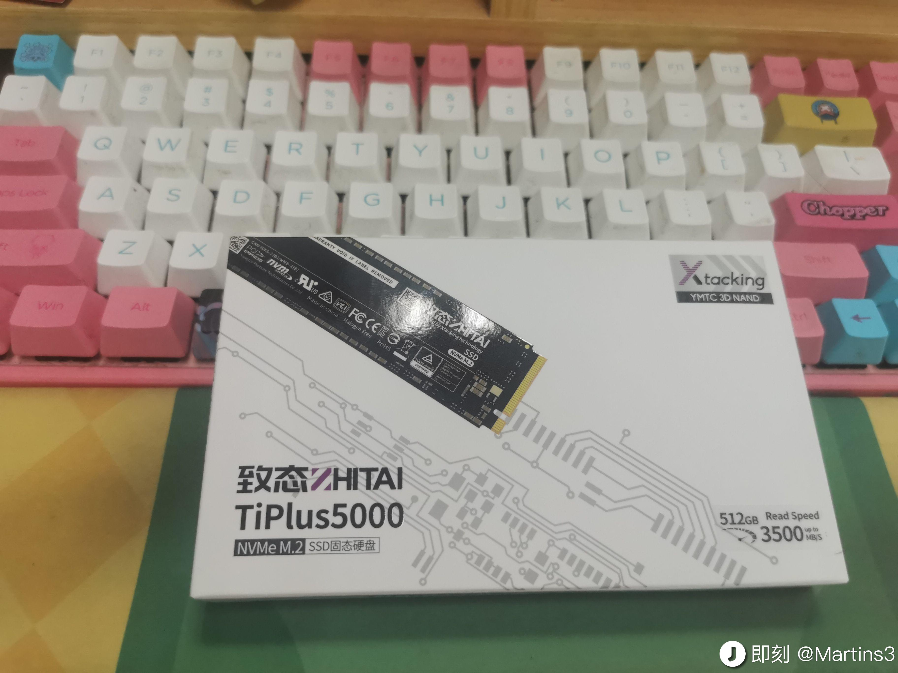
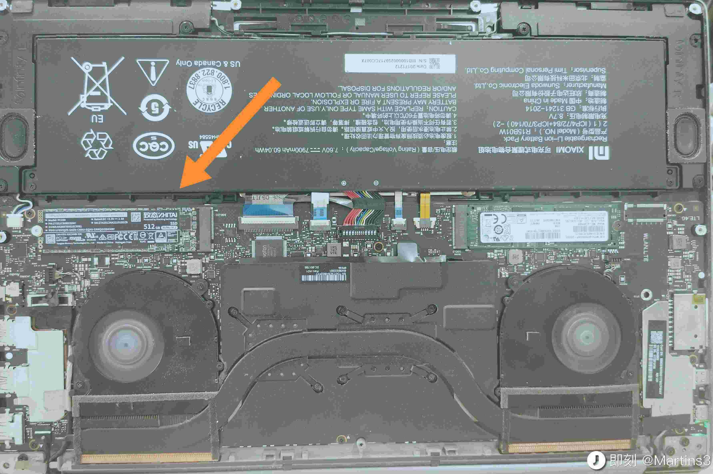
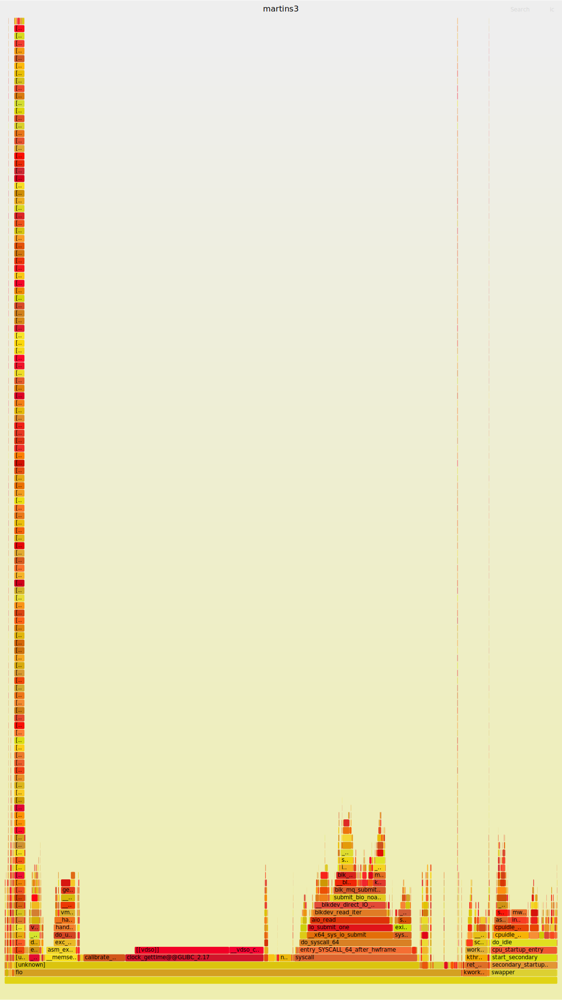

# 双系统: blockdev

## 给电脑增加一个新的硬盘



## overview
<p align="center">
  
</p>
<p align="center">
from https://nvmexpress.org/education/drivers/linux-driver-information/
</p>

## 关键的路径

```txt
#0  device_create_file (dev=dev@entry=0xffff88800380c648, attr=attr@entry=0xffffffff829d6c20 <dev_attr_uevent>) at drivers/base/core.c:2753
#1  0xffffffff8171ed09 in device_add (dev=dev@entry=0xffff88800380c648) at drivers/base/core.c:3349
#2  0xffffffff81431024 in device_add_disk (parent=parent@entry=0x0 <fixed_percpu_data>, disk=disk@entry=0xffff888004113800, groups=groups@entry=0x0 <fixed_percpu_data>)at block/genhd.c:464
#3  0xffffffff817426e6 in add_disk (disk=0xffff888004113800) at ./include/linux/blkdev.h:751
#4  loop_add (i=i@entry=0) at drivers/block/loop.c:2064
#5  0xffffffff83003c06 in loop_init () at drivers/block/loop.c:2268
```



## /dev/sda1 这个路径是谁创建的
本来以为是 udev 在系统启动的时候创建的，但是曾经使用 initramfs 的，/dev 一旦 mount 上，里面啥都有了。

drivers/base/devtmpfs.c:devtmpfs_work_loop 中打点，可以看到如下设备都是内核直接添加的:
```txt
rfkill vga_arbiter mem null port zero full random urandom kmsg
tty console tty0 vcs vcsu vcsa vcs1 vcsu1 vcsa1 tty1
tty2 tty3 tty4 tty5 tty6 tty7 tty8 tty9 tty10 tty11
tty12 tty13 tty14 tty15 tty16 tty17 tty18 tty19 tty20 tty21
tty22 tty23 tty24 tty25 tty26 tty27 tty28 tty29 tty30 tty31
tty32 tty33 tty34 tty35 tty36 tty37 tty38 tty39 tty40 tty41
tty42 tty43 tty44 tty45 tty46 tty47 tty48 tty49 tty50 tty51
tty52 tty53 tty54 tty55 tty56 tty57 tty58 tty59 tty60 tty61
tty62 tty63 hwrng kvm cpu/0/msr cpu/1/msr cpu/2/msr cpu/3/msr cpu/4/msr cpu/5/msr
cpu/0/cpuid cpu/1/cpuid cpu/2/cpuid cpu/3/cpuid cpu/4/cpuid cpu/5/cpuid snapshot userfaultfd autofs fuse
ptmx ttyS0 ttyS1 ttyS2 ttyS3 hpet nvram loop-control loop0 loop1
loop2 loop3 loop4 loop5 loop6 loop7 vda vdb vdb1 vdb2
vdb3 ublk-control bsg/0:0:0:0 sda sg0 sg1 bsg/1:0:0:0 nvme-fabrics nvme0 net/tun
usbmon0 sdb input/event0 rtc0 ptp0 mapper/control snd/timer input/event1 snd/seq nvme0n1
ng0n1 cpu_dma_latency sg2 bsg/2:0:0:0 sg3 bsg/2:0:1:0 sdc sdd input/event2 vcs6
vcsu6 vcsa6 vcs2 vcsu2 vcsa2 vcs3 vcsu3 vcsa3 vcs4 vcsu4
vcsa4 vcs5 vcsu5 vcsa5
```

## struct
- gendisk : 侧重和硬件交互，一个硬件一个
  - `add_disk` : 删除
  - `alloc_disk` : 创建
- `block_device` : 侧重和文件系统交互，一个分区一个，因为每个分区的文件系统都不同
- `struct hd_struct` : 描述分区信息，一个分区一个

```c
// 除了那些标准操作之外，被mount_bdev唯一调用
struct block_device *blkdev_get_by_path(const char *path, fmode_t mode,
					void *holder)
```

## partitions

对应的源码，在 block/partion 的位置

- https://www.baeldung.com/linux/partitioning-disks
> Instead of loading a boot loader from the MBR, UEFI uses efi images from the EFI System Partition. With UEFI and GPT, we can have large disk support.

- https://unix.stackexchange.com/questions/542223/how-to-create-a-logical-partition
> 各种 logical partition 和 extent partition 都是 MBR 之类的 legacy 时代的东西

```sh
bpftrace -e 'kprobe:blk_add_partitions { @[kstack] = count(); }'
```

```txt
@[
    blk_add_partitions+1
    __blkdev_get+228
    blkdev_get_by_dev+281
    blkdev_common_ioctl+2047
    blkdev_ioctl+228
    block_ioctl+61
    __x64_sys_ioctl+145
    do_syscall_64+97
    entry_SYSCALL_64_after_hwframe+68
]: 4
```

## 一些基本理论

### /etc/fstab

指挥 systemd 如何加载 disk 的:
```txt
➜  vn git:(master) ✗ cat /etc/fstab
# /etc/fstab: static file system information.
#
# Use 'blkid' to print the universally unique identifier for a
# device; this may be used with UUID= as a more robust way to name devices
# that works even if disks are added and removed. See fstab(5).
#
# <file system> <mount point>   <type>  <options>       <dump>  <pass>
# / was on /dev/nvme0n1p2 during installation
UUID=7876593d-555f-4a0d-8c9f-9d90e1a94343 /               ext4    errors=remount-ro 0       1
# /boot/efi was on /dev/nvme0n1p1 during installation
UUID=9EDC-2FD6  /boot/efi       vfat    umask=0077      0       1
/swapfile                                 none            swap    sw              0       0
/dev/disk/by-uuid/12855c04-ce76-47a0-840c-206253052ccf /home/maritns3/hack auto nosuid,nodev,nofail,x-gvfs-show 0 0
```

## gui tools
### gpart
创建分区表和格式化分区

### gnome-Disks
https://askubuntu.com/questions/164926/how-to-make-partitions-mount-at-startup

## cli tools

### parted : 格式化设备

```sh
parted /dev/nvme1n1 -- mklabel gpt # 制作分区表
parted /dev/nvme1n1 -- mkpart primary 1MiB 100%
```

```sh
parted /dev/sdd -- mklabel gpt
parted /dev/sdd -- mkpart primary 1MiB -1MiB
```

### fdisk
- 处理分区表的

使用 `sudo fdisk -l` 可以得到如下结果

```txt
Disk /dev/nvme0n1: 476.96 GiB, 512110190592 bytes, 1000215216 sectors
Disk model: ZHITAI TiPlus5000 512GB
Units: sectors of 1 * 512 = 512 bytes
Sector size (logical/physical): 512 bytes / 512 bytes
I/O size (minimum/optimal): 512 bytes / 512 bytes
Disklabel type: gpt
Disk identifier: 55CE3071-1646-4AB2-B052-511413221486

Device         Start        End    Sectors  Size Type
/dev/nvme0n1p1  2048 1000214527 1000212480  477G Linux filesystem


Disk /dev/nvme1n1: 238.49 GiB, 256060514304 bytes, 500118192 sectors
Disk model: SAMSUNG MZVLW256HEHP-00000
Units: sectors of 1 * 512 = 512 bytes
Sector size (logical/physical): 512 bytes / 512 bytes
I/O size (minimum/optimal): 512 bytes / 512 bytes
Disklabel type: gpt
Disk identifier: 3AD6EE50-0EA1-4F4D-9685-E3BABA41E442

Device           Start       End   Sectors  Size Type
/dev/nvme1n1p1    2048   1050623   1048576  512M EFI System
/dev/nvme1n1p2 1050624 500117503 499066880  238G Linux filesystem
```

### blkid

```txt
/dev/nvme1n1p2: UUID="7876593d-555f-4a0d-8c9f-9d90e1a94343" TYPE="ext4" PARTUUID="409f4ba4-bdf5-4d00-942e-9f7997056bba"
/dev/loop0: TYPE="squashfs"
/dev/nvme0n1p1: UUID="12855c04-ce76-47a0-840c-206253052ccf" TYPE="ext4" PARTUUID="ca0534aa-4c0b-4db1-b028-d73dc442b6e4"
/dev/nvme1n1p1: UUID="9EDC-2FD6" TYPE="vfat" PARTLABEL="EFI System Partition" PARTUUID="b04350e1-236a-4009-8855-9e49ee2d2456"
/dev/loop47: TYPE="squashfs"
```

### df
利用 [statfs(2)](https://man7.org/linux/man-pages/man2/statfs.2.html) 获取系统中文件系统的信息的。

使用 `df -h` 查看如下内容:
```txt
Filesystem      Size  Used Avail Use% Mounted on
udev            7.8G     0  7.8G   0% /dev
tmpfs           1.6G  2.5M  1.6G   1% /run
/dev/nvme1n1p2  234G  189G   33G  86% /
tmpfs           7.8G  291M  7.5G   4% /dev/shm
tmpfs           5.0M  4.0K  5.0M   1% /run/lock
tmpfs           7.8G     0  7.8G   0% /sys/fs/cgroup
/dev/loop0      128K  128K     0 100% /snap/bare/5
/dev/nvme0n1p1  469G  101G  345G  23% /home/maritns3/hack
/dev/nvme1n1p1  511M  5.3M  506M   2% /boot/efi
tmpfs           1.6G  320K  1.6G   1% /run/user/1000
/dev/loop47      84M   84M     0 100% /snap/veloren/580
```

### lsblk
```txt
NAME        MAJ:MIN RM   SIZE RO TYPE MOUNTPOINT
loop0         7:0    0     4K  1 loop /snap/bare/5
loop47        7:47   0  83.3M  1 loop /snap/veloren/580
nvme0n1     259:0    0   477G  0 disk
└─nvme0n1p1 259:1    0   477G  0 part /home/maritns3/hack
nvme1n1     259:2    0 238.5G  0 disk
├─nvme1n1p1 259:3    0   512M  0 part /boot/efi
└─nvme1n1p2 259:4    0   238G  0 part /
```

主要读取如下: /sys/dev/block/

## Doc
1. https://terenceli.github.io/%E6%8A%80%E6%9C%AF/2018/06/14/linux-block-device-driver

在 mount 的过程中，根据路径得到:
```txt
#0  blkdev_get_by_dev (dev=8388611, mode=129, holder=0xffffffff8296b2a0 <ext3_fs_type>) at block/bdev.c:787
#1  0xffffffff81415352 in blkdev_get_by_path (path=<optimized out>, mode=mode@entry=129, holder=0xffffffff8296b2a0 <ext3_fs_type>) at block/bdev.c:881
#2  0xffffffff81212297 in get_tree_bdev (fc=0xffff888004425300, fill_super=0xffffffff81310db0 <ext4_fill_super>) at fs/super.c:1242
#3  0xffffffff81211490 in vfs_get_tree (fc=fc@entry=0xffff888004425300) at fs/super.c:1497
#4  0xffffffff81238668 in do_new_mount (data=0x0 <fixed_percpu_data>, name=0xffffffff8257820b "/dev/root", mnt_flags=96, sb_flags=<optimized out>, fstype=0xffffc90000013de0 "`qQ\003\200\210\377\377", path=0xffffc90000013de0) at fs/namespace.c:3040
#5  path_mount (dev_name=dev_name@entry=0xffffffff8257820b "/dev/root", path=path@entry=0xffffc90000013de0, type_page=type_page@entry=0xffff8880044b6000 "ext3", flags=<optimized out>, flags@entry=32769, data_page=data_page@entry=0x0 <fixed_percpu_data>) at fs/namespace.c:3370
#6  0xffffffff82fef8fd in init_mount (dev_name=dev_name@entry=0xffffffff8257820b "/dev/root", dir_name=dir_name@entry=0xffffffff8257820f "/root", type_page=type_page@entry=0xffff8880044b6000 "ext3", flags=flags@entry=32769, data_page=0x0 <fixed_percpu_data>) at fs/init.c:25
#7  0xffffffff82fc5568 in do_mount_root (name=name@entry=0xffffffff8257820b "/dev/root", fs=fs@entry=0xffff8880044b6000 "ext3", flags=flags@entry=32769, data=<optimized out>) at init/do_mounts.c:375
#8  0xffffffff82fc5724 in mount_block_root (name=name@entry=0xffffffff8257820b "/dev/root", flags=32769) at init/do_mounts.c:414
#9  0xffffffff82fc5a0e in mount_root () at init/do_mounts.c:592
#10 0xffffffff82fc5b68 in prepare_namespace () at init/do_mounts.c:644
#11 0xffffffff82fc5442 in kernel_init_freeable () at init/main.c:1626
#12 0xffffffff81c9e851 in kernel_init (unused=<optimized out>) at init/main.c:1502
#13 0xffffffff810019a2 in ret_from_fork () at arch/x86/entry/entry_64.S:298
#14 0x0000000000000000 in ?? ()
```
- 通过 `lookup_bdev` 可以将 path 装换为 `dev_t`

## 源码

```c
static const struct super_operations bdev_sops = {
```

```c
static const struct address_space_operations def_blk_aops = {
const struct file_operations def_blk_fops = {
```
`address_space_operations` 是文件系统注册的，用于向下传导的

- `blkdev_readpage` 和 `ext4_mpage_readpages` 都会调用 `block_read_full_page` 的，但是 ext4 中会去调用 `ext4_get_block` 的实现。
  - `get_block_t`，给定一个 inode 以及偏移量，找到对应的 block number

简单分析一下 `super_operations` 的过程:
```plain
#0  bdev_alloc_inode (sb=0xffff888003455800) at block/bdev.c:388
#1  0xffffffff8122dab8 in alloc_inode (sb=0xffff888003455800) at fs/inode.c:260
#2  0xffffffff8122fc78 in new_inode_pseudo (sb=<optimized out>) at fs/inode.c:1018
#3  0xffffffff8122fcde in new_inode (sb=<optimized out>) at fs/inode.c:1047
#4  0xffffffff81414e38 in bdev_alloc (disk=disk@entry=0xffff8880043a3b00, partno=partno@entry=1 '\001') at block/bdev.c:479
#5  0xffffffff81433135 in add_partition (disk=disk@entry=0xffff8880043a3b00, partno=partno@entry=1, start=start@entry=2048, len=204800, flags=0, info=0xffffc900001e1095 at block/partitions/core.c:355
#6  0xffffffff814338ca in blk_add_partition (state=0xffff8880043d20c0, p=1, disk=0xffff8880043a3b00) at block/partitions/core.c:585
#7  blk_add_partitions (disk=0xffff8880043a3b00) at block/partitions/core.c:652
#8  bdev_disk_changed (invalidate=<optimized out>, disk=<optimized out>) at block/partitions/core.c:694
#9  bdev_disk_changed (disk=disk@entry=0xffff8880043a3b00, invalidate=invalidate@entry=false) at block/partitions/core.c:661
#10 0xffffffff8141448b in blkdev_get_whole (bdev=bdev@entry=0xffff888003814600, mode=mode@entry=1) at block/bdev.c:679
#11 0xffffffff814151a7 in blkdev_get_by_dev (holder=0x0 <fixed_percpu_data>, mode=1, dev=<optimized out>) at block/bdev.c:816
#12 blkdev_get_by_dev (dev=<optimized out>, mode=mode@entry=1, holder=holder@entry=0x0 <fixed_percpu_data>) at block/bdev.c:780
#13 0xffffffff81430f2f in disk_scan_partitions (disk=disk@entry=0xffff8880043a3b00, mode=mode@entry=1) at ./include/linux/blkdev.h:196
#14 0xffffffff8143127e in device_add_disk (parent=parent@entry=0xffff8880042f8198, disk=disk@entry=0xffff8880043a3b00, groups=groups@entry=0x0 <fixed_percpu_data>) at block/genhd.c:523
#15 0xffffffff81765cf7 in sd_probe (dev=0xffff8880042f8198) at drivers/scsi/sd.c:3475
#16 0xffffffff81722350 in call_driver_probe (drv=0xffffffff829dfce0 <sd_template>, drv=0xffffffff829dfce0 <sd_template>, dev=0xffff8880042f8198) at drivers/base/dd.c:542
#17 really_probe (drv=0xffffffff829dfce0 <sd_template>, dev=0xffff8880042f8198) at drivers/base/dd.c:621
#18 really_probe (dev=0xffff8880042f8198, drv=0xffffffff829dfce0 <sd_template>) at drivers/base/dd.c:566
#19 0xffffffff817224fd in __driver_probe_device (drv=drv@entry=0xffffffff829dfce0 <sd_template>, dev=dev@entry=0xffff8880042f8198) at drivers/base/dd.c:752
#20 0xffffffff81722579 in driver_probe_device (drv=drv@entry=0xffffffff829dfce0 <sd_template>, dev=dev@entry=0xffff8880042f8198) at drivers/base/dd.c:782
#21 0xffffffff81722807 in __device_attach_driver (drv=0xffffffff829dfce0 <sd_template>, _data=0xffffc9000004be48) at drivers/base/dd.c:899
#22 0xffffffff81720569 in bus_for_each_drv (bus=<optimized out>, start=start@entry=0x0 <fixed_percpu_data>, data=data@entry=0xffffc9000004be48, fn=fn@entry=0xffffffff817227a0 <__device_attach_driver>) at drivers/base/bus.c:427
#23 0xffffffff81721cba in __device_attach_async_helper (_dev=0xffff8880042f8198, cookie=<optimized out>) at drivers/base/dd.c:928
#24 0xffffffff8109250b in async_run_entry_fn (work=0xffff888004278bc0) at kernel/async.c:127
#25 0xffffffff81086133 in process_one_work (worker=0xffff88800344da80, work=0xffff888004278bc0) at kernel/workqueue.c:2289
#26 0xffffffff81086345 in worker_thread (__worker=0xffff88800344da80) at kernel/workqueue.c:2436
#27 0xffffffff8108d742 in kthread (_create=0xffff888003546040) at kernel/kthread.c:376
#28 0xffffffff810019a2 in ret_from_fork () at arch/x86/entry/entry_64.S:298
#29 0x0000000000000000 in ?? ()
```

进行 io 的过程:
```txt
#0  bdev_read_page (bdev=bdev@entry=0xffff888220cfbc00, sector=0, page=page@entry=0xffffea0008a4d500) at block/bdev.c:325
#1  0xffffffff81394e5a in do_mpage_readpage (args=args@entry=0xffffc900017bfb18) at fs/mpage.c:273
#2  0xffffffff813950a5 in mpage_readahead (rac=0xffffc900017bfcd0, get_block=<optimized out>) at fs/mpage.c:361
#3  0xffffffff8128a334 in read_pages (rac=rac@entry=0xffffc900017bfcd0) at mm/readahead.c:158
#4  0xffffffff8128a6b0 in page_cache_ra_unbounded (ractl=0xffffc900017bfcd0, nr_to_read=128, lookahead_size=<optimized out>) at mm/readahead.c:263
#5  0xffffffff8128b0a5 in page_cache_sync_ra (ractl=0x0 <fixed_percpu_data>, ractl@entry=0xffffc900017bfcd0, req_count=req_count@entry=32) at mm/readahead.c:699
#6  0xffffffff8127e7f6 in page_cache_sync_readahead (req_count=32, index=0, file=0xffff888221bb8900, ra=0xffff888221bb8998, mapping=0xffff888220cfc100) at include/linux/pagemap.h:1215
#7  filemap_get_pages (iocb=iocb@entry=0xffffc900017bfe98, iter=iter@entry=0xffffc900017bfe70, fbatch=fbatch@entry=0xffffc900017bfd78) at mm/filemap.c:2566
#8  0xffffffff8127ee14 in filemap_read (iocb=iocb@entry=0xffffc900017bfe98, iter=iter@entry=0xffffc900017bfe70, already_read=already_read@entry=0) at mm/filemap.c:2660
#9  0xffffffff815fda6b in blkdev_read_iter (iocb=0xffffc900017bfe98, to=0xffffc900017bfe70) at block/fops.c:598
#10 0xffffffff81348aec in call_read_iter (iter=0x0 <fixed_percpu_data>, kio=0xffff888220cfbc00, file=0xffff888221bb8900) at include/linux/fs.h:2181
#11 new_sync_read (ppos=0xffffc900017bff08, len=131072, buf=0x7f9a0c8db000 <error: Cannot access memory at address 0x7f9a0c8db000>, filp=0xffff888221bb8900) at fs/read_write.c:389
#12 vfs_read (file=file@entry=0xffff888221bb8900, buf=buf@entry=0x7f9a0c8db000 <error: Cannot access memory at address 0x7f9a0c8db000>, count=count@entry=131072, pos=pos@entry=0xffffc900017bff08) at fs/read_write.c:470
#13 0xffffffff813492ba in ksys_read (fd=<optimized out>, buf=0x7f9a0c8db000 <error: Cannot access memory at address 0x7f9a0c8db000>, count=131072) at fs/read_write.c:607
#14 0xffffffff81edbcf8 in do_syscall_x64 (nr=<optimized out>, regs=0xffffc900017bff58) at arch/x86/entry/common.c:50
#15 do_syscall_64 (regs=0xffffc900017bff58, nr=<optimized out>) at arch/x86/entry/common.c:80
#16 0xffffffff8200009b in entry_SYSCALL_64 () at arch/x86/entry/entry_64.S:120
```
从上面的过程中，可以看到直接读写裸盘的时候，也是存在 page cahce 的，而 page cache 总是关联 inode 作为来构建映射的，
所以，需要一个 super_operations 来创建 inode 的。

## ldd3 的驱动理解

- gendisk : 对应的一个设备
- block_device : 对应一个 partion


- [ ] `register_blkdev` , `add_disk`, `get_gendisk`
  - [x] `register_blkdev` 注册了 major number 在 `major_names` 中间，但是 `major_names` 除了使用在 `blkdev_show` (cat /proc/devices) 之外没有看到其他的用处
    - https://linux-kernel-labs.github.io/refs/heads/master/labs/block_device_drivers.html : 中说，`register_blkdev` 是会取消掉的
    - 从 virtio_blk.c 中间来看 : major 放到局部变量中间，所以实际功能是分配 major number

- [ ] `alloc_disk` 分配 `struct gendisk`，其中由于保存分区的

block_device_operations

Char devices make their operations available to the system by way of the `file_operations` structure. A similar structure is used with block devices; it is `struct
block_device_operations`, which is declared in `<linux/blkdev.h>`.

```c
struct block_device_operations {
	int (*open) (struct block_device *, fmode_t);
	void (*release) (struct gendisk *, fmode_t);
	int (*rw_page)(struct block_device *, sector_t, struct page *, int rw);
	int (*ioctl) (struct block_device *, fmode_t, unsigned, unsigned long);
	int (*compat_ioctl) (struct block_device *, fmode_t, unsigned, unsigned long);
	long (*direct_access)(struct block_device *, sector_t, void __pmem **,
			unsigned long *pfn);
	unsigned int (*check_events) (struct gendisk *disk,
				      unsigned int clearing);
	/* ->media_changed() is DEPRECATED, use ->check_events() instead */
	int (*media_changed) (struct gendisk *);
	void (*unlock_native_capacity) (struct gendisk *);
	int (*revalidate_disk) (struct gendisk *);
	int (*getgeo)(struct block_device *, struct hd_geometry *);
	/* this callback is with swap_lock and sometimes page table lock held */
	void (*swap_slot_free_notify) (struct block_device *, unsigned long);
	struct module *owner;
	const struct pr_ops *pr_ops;
};
```
1. 这些函数的注册都是让驱动完成的
2. 这些函数的使用位置在哪里啊 ?
    1. open : blkdev_get : @todo 当设备出现在 /dev/nvme0n1p1 上的时候，此时 blkdev_get 被调用过没有，blkdev_get 会被调用吗 ? 如果不调用，那么似乎驱动就没有被初始化，那么连 aops 的实现基础 bio request 之类的实现似乎无从谈起了。


## 使用 drivers/scsi/sd.c 作为例子分析一下


## block/genhd.c

```c
static int __init proc_genhd_init(void)
{
	proc_create_seq("diskstats", 0, NULL, &diskstats_op);
	proc_create_seq("partitions", 0, NULL, &partitions_op);
	return 0;
}

static DEVICE_ATTR(range, 0444, disk_range_show, NULL);
static DEVICE_ATTR(ext_range, 0444, disk_ext_range_show, NULL);
static DEVICE_ATTR(removable, 0444, disk_removable_show, NULL);
static DEVICE_ATTR(hidden, 0444, disk_hidden_show, NULL);
static DEVICE_ATTR(ro, 0444, disk_ro_show, NULL);
static DEVICE_ATTR(size, 0444, part_size_show, NULL);
static DEVICE_ATTR(alignment_offset, 0444, disk_alignment_offset_show, NULL);
static DEVICE_ATTR(discard_alignment, 0444, disk_discard_alignment_show, NULL);
static DEVICE_ATTR(capability, 0444, disk_capability_show, NULL);
static DEVICE_ATTR(stat, 0444, part_stat_show, NULL);
static DEVICE_ATTR(inflight, 0444, part_inflight_show, NULL);
static DEVICE_ATTR(badblocks, 0644, disk_badblocks_show, disk_badblocks_store);
static DEVICE_ATTR(diskseq, 0444, diskseq_show, NULL);
```

对应的接口为:
1. /proc/partitions
2. /proc/diskstats
3. /sys/block/sda/ 的各种

register_blkdev 的调用，只要内存存在这个模块，就会进行对应的注册。

## add_disk
```plain
#0  device_add_disk (parent=parent@entry=0xffff888100c22010, disk=0xffff8880055f3400, groups=groups@entry=0xffffffff82e1b8d0 <virtblk_attr_groups>) at block/genhd.c:393
#1  0xffffffff81aa2ba1 in virtblk_probe (vdev=0xffff888100c22000) at drivers/block/virtio_blk.c:1150
#2  0xffffffff81809e6b in virtio_dev_probe (_d=0xffff888100c22010) at drivers/virtio/virtio.c:305
#3  0xffffffff81a75481 in call_driver_probe (drv=0xffffffff82e1b760 <virtio_blk>, dev=0xffff888100c22010) at drivers/base/dd.c:560
#4  really_probe (dev=dev@entry=0xffff888100c22010, drv=drv@entry=0xffffffff82e1b760 <virtio_blk>) at drivers/base/dd.c:639
#5  0xffffffff81a756bd in __driver_probe_device (drv=drv@entry=0xffffffff82e1b760 <virtio_blk>, dev=dev@entry=0xffff888100c22010) at drivers/base/dd.c:778
#6  0xffffffff81a75749 in driver_probe_device (drv=drv@entry=0xffffffff82e1b760 <virtio_blk>, dev=dev@entry=0xffff888100c22010) at drivers/base/dd.c:808
#7  0xffffffff81a759c5 in __driver_attach (data=0xffffffff82e1b760 <virtio_blk>, dev=0xffff888100c22010) at drivers/base/dd.c:1194
#8  __driver_attach (dev=0xffff888100c22010, data=0xffffffff82e1b760 <virtio_blk>) at drivers/base/dd.c:1134
#9  0xffffffff81a72fc4 in bus_for_each_dev (bus=<optimized out>, start=start@entry=0x0 <fixed_percpu_data>, data=data@entry=0xffffffff82e1b760 <virtio_blk>, fn=fn@entry=0xffffffff81a75940 <__driver_attach>) at drivers/base/bus.c:301
#10 0xffffffff81a74e79 in driver_attach (drv=drv@entry=0xffffffff82e1b760 <virtio_blk>) at drivers/base/dd.c:1211
#11 0xffffffff81a74810 in bus_add_driver (drv=drv@entry=0xffffffff82e1b760 <virtio_blk>) at drivers/base/bus.c:618
#12 0xffffffff81a76c2e in driver_register (drv=drv@entry=0xffffffff82e1b760 <virtio_blk>) at drivers/base/driver.c:246
#13 0xffffffff8180958b in register_virtio_driver (driver=driver@entry=0xffffffff82e1b760 <virtio_blk>) at drivers/virtio/virtio.c:357
#14 0xffffffff835eb0fb in virtio_blk_init () at drivers/block/virtio_blk.c:1284
#15 0xffffffff81001940 in do_one_initcall (fn=0xffffffff835eb0aa <virtio_blk_init>) at init/main.c:1306
#16 0xffffffff8359b818 in do_initcall_level (command_line=0xffff888003c5cc00 "root", level=6) at init/main.c:1379
#17 do_initcalls () at init/main.c:1395
#18 do_basic_setup () at init/main.c:1414
#19 kernel_init_freeable () at init/main.c:1634
#20 0xffffffff82183405 in kernel_init (unused=<optimized out>) at init/main.c:1522
#21 0xffffffff81002659 in ret_from_fork () at arch/x86/entry/entry_64.S:308
```


## partion 的生成
在读取系统的 partion table 的时候
```txt
#0  add_partition (disk=disk@entry=0xffff8880044ccc00, partno=partno@entry=1, start=start@entry=2048, len=1024000, flags=0, info=0xffffc90001562095) at block/partitions/core.c:318
#1  0xffffffff816dae18 in blk_add_partition (p=1, state=0xffff8880054ba840, disk=0xffff8880044ccc00) at block/partitions/core.c:576
#2  blk_add_partitions (disk=0xffff8880044ccc00) at block/partitions/core.c:646
#3  bdev_disk_changed (invalidate=<optimized out>, disk=<optimized out>) at block/partitions/core.c:688
#4  bdev_disk_changed (disk=disk@entry=0xffff8880044ccc00, invalidate=invalidate@entry=false) at block/partitions/core.c:655
#5  0xffffffff816b6ab5 in blkdev_get_whole (bdev=bdev@entry=0xffff888140803c00, mode=mode@entry=1) at block/bdev.c:685
#6  0xffffffff816b779d in blkdev_get_by_dev (dev=<optimized out>, mode=mode@entry=1, holder=holder@entry=0x0 <fixed_percpu_data>) at block/bdev.c:822
#7  0xffffffff816b79c0 in blkdev_get_by_dev (dev=<optimized out>, mode=mode@entry=1, holder=holder@entry=0x0 <fixed_percpu_data>) at block/bdev.c:856
#8  0xffffffff816d845b in disk_scan_partitions (disk=disk@entry=0xffff8880044ccc00, mode=mode@entry=1, owner=owner@entry=0x0 <fixed_percpu_data>) at block/genhd.c:374
#9  0xffffffff816d8822 in device_add_disk (parent=parent@entry=0xffff8880045f2810, disk=0xffff8880044ccc00, groups=groups@entry=0xffffffff82e1b8d0 <virtblk_attr_groups>) at block/genhd.c:502
#10 0xffffffff81aa2bc1 in virtblk_probe (vdev=0xffff8880045f2800) at drivers/block/virtio_blk.c:1150
#11 0xffffffff81809e8b in virtio_dev_probe (_d=0xffff8880045f2810) at drivers/virtio/virtio.c:305
#12 0xffffffff81a754a1 in call_driver_probe (drv=0xffffffff82e1b760 <virtio_blk>, dev=0xffff8880045f2810) at drivers/base/dd.c:560
#13 really_probe (dev=dev@entry=0xffff8880045f2810, drv=drv@entry=0xffffffff82e1b760 <virtio_blk>) at drivers/base/dd.c:639
#14 0xffffffff81a756dd in __driver_probe_device (drv=drv@entry=0xffffffff82e1b760 <virtio_blk>, dev=dev@entry=0xffff8880045f2810) at drivers/base/dd.c:778
#15 0xffffffff81a75769 in driver_probe_device (drv=drv@entry=0xffffffff82e1b760 <virtio_blk>, dev=dev@entry=0xffff8880045f2810) at drivers/base/dd.c:808
#16 0xffffffff81a759e5 in __driver_attach (data=0xffffffff82e1b760 <virtio_blk>, dev=0xffff8880045f2810) at drivers/base/dd.c:1194
#17 __driver_attach (dev=0xffff8880045f2810, data=0xffffffff82e1b760 <virtio_blk>) at drivers/base/dd.c:1134
#18 0xffffffff81a72fe4 in bus_for_each_dev (bus=<optimized out>, start=start@entry=0x0 <fixed_percpu_data>, data=data@entry=0xffffffff82e1b760 <virtio_blk>, fn=fn@entry=0xffffffff81a75960 <__driver_attach>) at drivers/base/bus.c:301
#19 0xffffffff81a74e99 in driver_attach (drv=drv@entry=0xffffffff82e1b760 <virtio_blk>) at drivers/base/dd.c:1211
#20 0xffffffff81a74830 in bus_add_driver (drv=drv@entry=0xffffffff82e1b760 <virtio_blk>) at drivers/base/bus.c:618
#21 0xffffffff81a76c4e in driver_register (drv=drv@entry=0xffffffff82e1b760 <virtio_blk>) at drivers/base/driver.c:246
#22 0xffffffff818095ab in register_virtio_driver (driver=driver@entry=0xffffffff82e1b760 <virtio_blk>) at drivers/virtio/virtio.c:357
#23 0xffffffff835eb0fb in virtio_blk_init () at drivers/block/virtio_blk.c:1284
#24 0xffffffff81001940 in do_one_initcall (fn=0xffffffff835eb0aa <virtio_blk_init>) at init/main.c:1306
#25 0xffffffff8359b818 in do_initcall_level (command_line=0xffff888003c5cc00 "root", level=6) at init/main.c:1379
#26 do_initcalls () at init/main.c:1395
#27 do_basic_setup () at init/main.c:1414
#28 kernel_init_freeable () at init/main.c:1634
#29 0xffffffff821854a5 in kernel_init (unused=<optimized out>) at init/main.c:1522
#30 0xffffffff81002659 in ret_from_fork () at arch/x86/entry/entry_64.S:308
```

## Block Device Operations

1. block/genhd.c 和 block/fops.c
    1. genhd.c 处理都是 genhd 这个结构体 : 和具体的驱动处理
    2. block_dev 处理的是 block_device 这个内容 : 似乎是用来和 vfs

```c
const struct file_operations def_blk_fops = {
	.open		= blkdev_open,
	.release	= blkdev_close,
	.llseek		= blkdev_llseek,
	.read_iter	= blkdev_read_iter,
	.write_iter	= blkdev_write_iter,
	.iopoll		= iocb_bio_iopoll,
	.mmap		= generic_file_mmap,
	.fsync		= blkdev_fsync,
	.unlocked_ioctl	= blkdev_ioctl,
#ifdef CONFIG_COMPAT
	.compat_ioctl	= compat_blkdev_ioctl,
#endif
	.splice_read	= generic_file_splice_read,
	.splice_write	= iter_file_splice_write,
	.fallocate	= blkdev_fallocate,
};
```

```c
static const struct block_device_operations sd_fops = {
	.owner			= THIS_MODULE,
	.open			= sd_open,
	.release		= sd_release,
	.ioctl			= sd_ioctl,
	.getgeo			= sd_getgeo,
	.compat_ioctl		= blkdev_compat_ptr_ioctl,
	.check_events		= sd_check_events,
	.unlock_native_capacity	= sd_unlock_native_capacity,
	.report_zones		= sd_zbc_report_zones,
	.get_unique_id		= sd_get_unique_id,
	.free_disk		= scsi_disk_free_disk,
	.pr_ops			= &sd_pr_ops,
};
```

```c
struct block_device_operations {
	int (*open) (struct block_device *, fmode_t);
	void (*release) (struct gendisk *, fmode_t);
	int (*rw_page)(struct block_device *, sector_t, struct page *, int rw);
	int (*ioctl) (struct block_device *, fmode_t, unsigned, unsigned long);
	int (*compat_ioctl) (struct block_device *, fmode_t, unsigned, unsigned long);
	long (*direct_access)(struct block_device *, sector_t, void __pmem **,
			unsigned long *pfn);
	unsigned int (*check_events) (struct gendisk *disk,
				      unsigned int clearing);
	/* ->media_changed() is DEPRECATED, use ->check_events() instead */
	int (*media_changed) (struct gendisk *);
	void (*unlock_native_capacity) (struct gendisk *);
	int (*revalidate_disk) (struct gendisk *);
	int (*getgeo)(struct block_device *, struct hd_geometry *);
	/* this callback is with swap_lock and sometimes page table lock held */
	void (*swap_slot_free_notify) (struct block_device *, unsigned long);
	struct module *owner;
	const struct pr_ops *pr_ops;
};
```

从通用的 vfs 到达具体的 block device :
```txt
#0  sd_open (bdev=0xffff8880053b0000, mode=1207959582) at drivers/scsi/sd.c:1316
#1  0xffffffff816b6a5d in blkdev_get_whole (bdev=bdev@entry=0xffff8880053b0000, mode=mode@entry=1207959582) at block/bdev.c:672
#2  0xffffffff816b779d in blkdev_get_by_dev (dev=<optimized out>, mode=1207959582, holder=holder@entry=0xffff8881161a7700) at block/bdev.c:822
#3  0xffffffff816b79c0 in blkdev_get_by_dev (dev=<optimized out>, mode=<optimized out>, holder=holder@entry=0xffff8881161a7700) at block/bdev.c:856
#4  0xffffffff816b826b in blkdev_open (inode=<optimized out>, filp=0xffff8881161a7700) at block/fops.c:478
#5  0xffffffff813bfd97 in do_dentry_open (f=f@entry=0xffff8881161a7700, inode=0xffff888100c35258, open=0xffffffff816b8220 <blkdev_open>, open@entry=0x0 <fixed_percpu_data>) at fs/open.c:882
#6  0xffffffff813c1cdd in vfs_open (path=path@entry=0xffffc90040513dc0, file=file@entry=0xffff8881161a7700) at fs/open.c:1013
#7  0xffffffff813d8e4b in do_open (op=0xffffc90040513edc, file=0xffff8881161a7700, nd=0xffffc90040513dc0) at fs/namei.c:3557
#8  path_openat (nd=nd@entry=0xffffc90040513dc0, op=op@entry=0xffffc90040513edc, flags=flags@entry=65) at fs/namei.c:3714
#9  0xffffffff813da411 in do_filp_open (dfd=dfd@entry=-100, pathname=pathname@entry=0xffff888100785000, op=op@entry=0xffffc90040513edc) at fs/namei.c:3741
#10 0xffffffff813c1fd5 in do_sys_openat2 (dfd=-100, filename=<optimized out>, how=how@entry=0xffffc90040513f18) at fs/open.c:1310
#11 0xffffffff813c24d2 in do_sys_open (mode=<optimized out>, flags=<optimized out>, filename=<optimized out>, dfd=<optimized out>) at fs/open.c:1326
#12 __do_sys_openat (mode=<optimized out>, flags=<optimized out>, filename=<optimized out>, dfd=<optimized out>) at fs/open.c:1342
#13 __se_sys_openat (mode=<optimized out>, flags=<optimized out>, filename=<optimized out>, dfd=<optimized out>) at fs/open.c:1337
#14 __x64_sys_openat (regs=<optimized out>) at fs/open.c:1337
#15 0xffffffff8217fc5c in do_syscall_x64 (nr=<optimized out>, regs=0xffffc90040513f58) at arch/x86/entry/common.c:50
#16 do_syscall_64 (regs=0xffffc90040513f58, nr=<optimized out>) at arch/x86/entry/common.c:80
#17 0xffffffff822000ae in entry_SYSCALL_64 () at arch/x86/entry/entry_64.S:120
```

初始化的时候，系统也会使用:
```txt
#0  sd_open (bdev=0xffff8880053b0000, mode=1) at drivers/scsi/sd.c:1316
#1  0xffffffff816b6a5d in blkdev_get_whole (bdev=bdev@entry=0xffff8880053b0000, mode=mode@entry=1) at block/bdev.c:672
#2  0xffffffff816b779d in blkdev_get_by_dev (dev=<optimized out>, mode=mode@entry=1, holder=holder@entry=0x0 <fixed_percpu_data>) at block/bdev.c:822
#3  0xffffffff816b79c0 in blkdev_get_by_dev (dev=<optimized out>, mode=mode@entry=1, holder=holder@entry=0x0 <fixed_percpu_data>) at block/bdev.c:856
#4  0xffffffff816d845b in disk_scan_partitions (disk=disk@entry=0xffff8880054c6000, mode=mode@entry=1, owner=owner@entry=0x0 <fixed_percpu_data>) at block/genhd.c:374
#5  0xffffffff816d8822 in device_add_disk (parent=parent@entry=0xffff88800567a1b8, disk=disk@entry=0xffff8880054c6000, groups=groups@entry=0x0 <fixed_percpu_data>) at block/genhd.c:502
#6  0xffffffff81af740d in sd_probe (dev=0xffff88800567a1b8) at drivers/scsi/sd.c:3536
#7  0xffffffff81a75620 in call_driver_probe (drv=0xffffffff82e25f00 <sd_template>, dev=0xffff88800567a1b8) at drivers/base/dd.c:560
#8  really_probe (dev=dev@entry=0xffff88800567a1b8, drv=drv@entry=0xffffffff82e25f00 <sd_template>) at drivers/base/dd.c:639
#9  0xffffffff81a756dd in __driver_probe_device (drv=0xffffffff82e25f00 <sd_template>, dev=dev@entry=0xffff88800567a1b8) at drivers/base/dd.c:778
#10 0xffffffff81a75769 in driver_probe_device (drv=<optimized out>, dev=dev@entry=0xffff88800567a1b8) at drivers/base/dd.c:808
#11 0xffffffff81a75b3e in __driver_attach_async_helper (_dev=0xffff88800567a1b8, cookie=<optimized out>) at drivers/base/dd.c:1126
#12 0xffffffff8115c6bc in async_run_entry_fn (work=0xffff8880054baec0) at kernel/async.c:127
#13 0xffffffff8114bd54 in process_one_work (worker=worker@entry=0xffff888003c5ba80, work=0xffff8880054baec0) at kernel/workqueue.c:2289
#14 0xffffffff8114bf7c in worker_thread (__worker=0xffff888003c5ba80) at kernel/workqueue.c:2436
#15 0xffffffff811546c4 in kthread (_create=0xffff8880046f0040) at kernel/kthread.c:376
#16 0xffffffff81002659 in ret_from_fork () at arch/x86/entry/entry_64.S:308
```

## 结束语
好的，你现在对于 Linux 如何处理 Block 设备有了一个大概的认识，记得奖励自己一把英雄联盟哦。

## 如何理解 /proc/meminfo 中的 Buffers
```c
long nr_blockdev_pages(void)
{
	struct inode *inode;
	long ret = 0;

	spin_lock(&blockdev_superblock->s_inode_list_lock);
	list_for_each_entry(inode, &blockdev_superblock->s_inodes, i_sb_list)
		ret += inode->i_mapping->nrpages;
	spin_unlock(&blockdev_superblock->s_inode_list_lock);

	return ret;
}
```
- 创建一个文件系统，其中每一个 inode 都是关联一个 block 设备的。

- bdev_alloc 创建 inode 和文件系统的关系。

`inode->i_mapping->nrpages` 和其他的文件系统沟通的相同。

至少可以清楚的说明，/proc/meminfo 中的 Buffers 和 inode cache 没有任何关系了，就是 block 设备的空间。

## TODO

- [【硬件科普】硬盘的 SATA M.2 NGFF NVME 是什么意思，详解硬盘的总线协议与接口](https://www.bilibili.com/video/BV1Qv411t7ZL)
- [【硬件科普】固态硬盘的缓存是干什么的？有缓存和无缓存有什么区别？](https://www.bilibili.com/video/BV1aF411u7Ct)
- [【装机教程】全网最好的装机教程，没有之一](https://www.bilibili.com/video/BV1BG4y137mG)


- 数据传输协议: IDE AHCI NVMe SCSI
- 总线: SATA PCIe SAS
- 硬盘接口: SATA mSATA(只是缩小体积) SATA express(提升一倍的速度) M.2 PCIe U.2 SAS

想不到 ACHI 就是硬盘使用的协议，真的让人更加迷茫了:
看 ahci_qc_issue 的 backtrace 在 ./ahci.txt 中

## 问题
- /dev/sda 和 /dev/sdb 之类的名称是如何确定的？
- 如何修改一个 partion 的 UUID
  - [ ] 找到 kernel 处理 partion UUID 的位置

- 为什么需要设置 /dev/disk/by-** 之类的名称，这个是如何组织的


## block_device_operations::submit_bio

当 `__submit_bio` 中继续向下该，到底是提交给 multiqueue 还是继续向下，取决于 `disk->fops` 的:

```c
static void __submit_bio(struct bio *bio)
{
	struct gendisk *disk = bio->bi_bdev->bd_disk;

	if (unlikely(!blk_crypto_bio_prep(&bio)))
		return;

	if (!disk->fops->submit_bio) {
		blk_mq_submit_bio(bio);
	} else if (likely(bio_queue_enter(bio) == 0)) {
		disk->fops->submit_bio(bio);
		blk_queue_exit(disk->queue);
	}
}
```


<script src="https://giscus.app/client.js"
        data-repo="martins3/martins3.github.io"
        data-repo-id="MDEwOlJlcG9zaXRvcnkyOTc4MjA0MDg="
        data-category="Show and tell"
        data-category-id="MDE4OkRpc2N1c3Npb25DYXRlZ29yeTMyMDMzNjY4"
        data-mapping="pathname"
        data-reactions-enabled="1"
        data-emit-metadata="0"
        data-theme="light"
        data-lang="zh-CN"
        crossorigin="anonymous"
        async>
</script>

本站所有文章转发 **CSDN** 将按侵权追究法律责任，其它情况随意。
