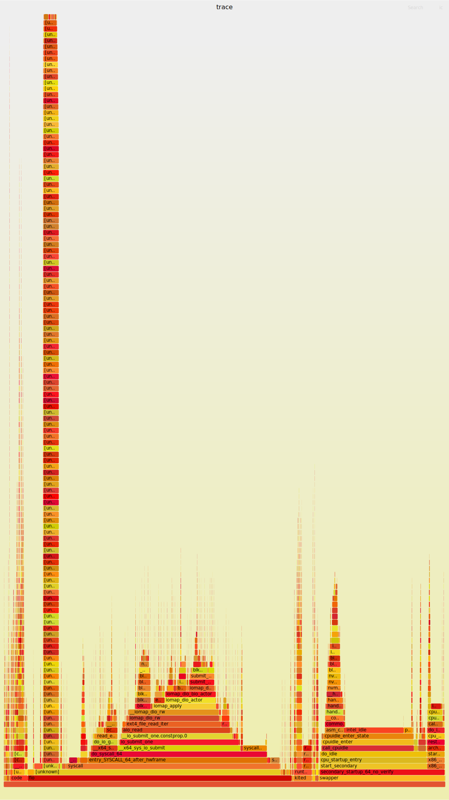

# 双系统: blockdev

## 给电脑增加一个新的硬盘


## 问题
- [ ] gendisk 之类的到底是啥
- [ ] 直接对于 dev 进行读的时候，其 flamegraph 看看一下
- [ ] partion id 和 UUID 的区别是什么?
- [ ] UUID 存储在哪里了，为什么可以让 bootloader 可以分析
  - [ ] 我感觉分区信息中存在一些让 disk driver 知道在那个位置有数据的操作
- [ ] /etc/fstab 的作用是什么
- [ ] 我无法理解 BMBT 中，为什么一会是 UUID，一会是 PARTUUID 的
- [ ] 谁会去创建 /dev/nvme1n1p2 的，udev 的那个工具吗 ?
- [ ] mknod 的原理是什么
- [ ] 理解一下 IO scheduler 和 blkmq 的关系:
  - https://kernel.dk/blk-mq.pdf
  - [ ] 还是使用 flamegraph 分析一下吧，根本
- [ ] 从 ldd3 的 driver 的角度分析一下
- [ ] block/bfq-iosched.c 真的有人使用吗
- [ ] 将 Linux Block Driver 的实验写一下吧
- [ ] block 下存在一个 partitions 的文件夹，说实话，一直都不是非常理解啊
- [ ] 我的印象中，`def_blk_fops` 和下面的这种 ops 不是
  - [ ] Understanding Linux Kernel 的 14 章中的最后一部分分析过 `def_blk_fops` 的 open 操作的
  - [ ] gendisk 持有了 `block_device_operations` 又是做什么的
  - [x] block 设备提供给 multiqueue 的标准接口是啥 : 就是 `mq_ops`
```c
static const struct blk_mq_ops nbd_mq_ops = {
	.queue_rq	= nbd_queue_rq,
	.complete	= nbd_complete_rq,
	.init_request	= nbd_init_request,
	.timeout	= nbd_xmit_timeout,
};
```
- [ ] request queue 和 multiqueue 的关系是什么 ?
  - [ ] block/blk-core.c 中，几乎所有的函数的参数都是有 `request_queue` 的

## overview
<p align="center">
  
</p>
<p align="center">
from https://nvmexpress.org/education/drivers/linux-driver-information/
</p>

## 关键的路径

```txt
#0  device_create_file (dev=dev@entry=0xffff88800380c648, attr=attr@entry=0xffffffff829d6c20 <dev_attr_uevent>) at drivers/base/core.c:2753
#1  0xffffffff8171ed09 in device_add (dev=dev@entry=0xffff88800380c648) at drivers/base/core.c:3349
#2  0xffffffff81431024 in device_add_disk (parent=parent@entry=0x0 <fixed_percpu_data>, disk=disk@entry=0xffff888004113800, groups=groups@entry=0x0 <fixed_percpu_data>)at block/genhd.c:464
#3  0xffffffff817426e6 in add_disk (disk=0xffff888004113800) at ./include/linux/blkdev.h:751
#4  loop_add (i=i@entry=0) at drivers/block/loop.c:2064
#5  0xffffffff83003c06 in loop_init () at drivers/block/loop.c:2268
```

## 关键的 ops
1. block/genhd.c 和 fs/block_dev.c 的关系是什么 ?
    1. genhd.c 处理都是 genhd 这个结构体 : 和具体的驱动处理
    2. block_dev 处理的是 block_device 这个内容 : 似乎是用来和 vfs

- [ ] 从 /dev/nvme0n1p1 到 genhd 的过程是什么样子的啊

## [x] io scheduler 和 multiqueue
- Kernel Documentaion : https://www.kernel.org/doc/html/latest/block/blk-mq.html

> blk-mq has two group of queues: software staging queues and hardware dispatch queues. When the request arrives at the block layer, it will try the shortest path possible: send it directly to the hardware queue. However, there are two cases that it might not do that: if there’s an IO scheduler attached at the layer or if we want to try to merge requests. In both cases, requests will be sent to the software queue.

> The block IO subsystem adds requests in the software staging queues (represented by struct blk_mq_ctx) in case that they weren’t sent directly to the driver. A request is one or more BIOs. They arrived at the block layer through the data structure struct bio. The block layer will then build a new structure from it, the struct request that will be used to communicate with the device driver. Each queue has its own lock and the number of queues is defined by a per-CPU or per-node basis.

```c
struct blk_mq_hw_ctx
```
原来还是可以修改 scheduler 的:
- https://linuxhint.com/change-i-o-scheduler-linux/
- https://askubuntu.com/questions/78682/how-do-i-change-to-the-noop-scheduler

检查了一下自己的机器的:
```c
➜ cat /sys/block/nvme0n1/queue/scheduler

[none] mq-deadline
```
应该只是支持 block/mq-deadline.c ，但是实际上并不会采用任何的 scheduler 的。



从函数 `blk_start_plug` 的注释说，plug 表示向 block layer 添加数据。

## ldd3 的驱动理解

- [ ] `register_blkdev` , `add_disk`, `get_gendisk`
  - [x] `register_blkdev` 注册了 major number 在 `major_names` 中间，但是 `major_names` 除了使用在 `blkdev_show` (cat /proc/devices) 之外没有看到其他的用处
    - https://linux-kernel-labs.github.io/refs/heads/master/labs/block_device_drivers.html : 中说，`register_blkdev` 是会取消掉的
    - 从 virtio_blk.c 中间来看 : major 放到局部变量中间，所以实际功能是分配 major number

- [ ] `alloc_disk` 分配 `struct gendisk`，其中由于保存分区的

## bio layer
- [A block layer introduction part 1: the bio layer](https://lwn.net/Articles/736534/) https://yq.aliyun.com/articles/609907

- [Block layer introduction part 2: the request layer](https://lwn.net/Articles/738449/)
- [ ] 重新确定一下，request layer 的位置

http://byteliu.com/2019/05/10/Linux-The-block-I-O-layer/

http://byteliu.com/2019/05/21/What-is-the-major-difference-between-the-buffer-cache-and-the-page-cache-Why-were-they-separate-entities-in-older-kernels-Why-were-they-merged-later-on/

1. bio 给上下两个层次提供的接口是什么 ?
2. https://zhuanlan.zhihu.com/p/39199521
    1. bio 机制核心 : 合并请求

- [ ] 那么 bio 真的会合并请求吗 ?

## kernel
```plain
#0  __register_blkdev (major=major@entry=259, name=name@entry=0xffffffff825c1b9e "blkext", probe=probe@entry=0x0 <fixed_percpu_data>) at block/genhd.c:247
#1  0xffffffff82ff48bb in genhd_device_init () at block/genhd.c:876
#2  0xffffffff81000dbf in do_one_initcall (fn=0xffffffff82ff4879 <genhd_device_init>) at init/main.c:1298
#3  0xffffffff82fc5405 in do_initcall_level (command_line=0xffff888003546040 "root", level=4) at ./include/linux/compiler.h:234
#4  do_initcalls () at init/main.c:1387
#5  do_basic_setup () at init/main.c:1406
#6  kernel_init_freeable () at init/main.c:1613
#7  0xffffffff81c9e851 in kernel_init (unused=<optimized out>) at init/main.c:1502
#8  0xffffffff810019a2 in ret_from_fork () at arch/x86/entry/entry_64.S:298
#9  0x0000000000000000 in ?? ()

#0  __register_blkdev (major=major@entry=9, name=name@entry=0xffffffff8262944f "md", probe=probe@entry=0xffffffff818b5c60 <md_probe>) at block/genhd.c:247
#1  0xffffffff830071ad in md_init () at drivers/md/md.c:9619
#2  0xffffffff81000dbf in do_one_initcall (fn=0xffffffff8300712a <md_init>) at init/main.c:1298
#3  0xffffffff82fc5405 in do_initcall_level (command_line=0xffff888003546040 "root", level=4) at ./include/linux/compiler.h:234
#4  do_initcalls () at init/main.c:1387
#5  do_basic_setup () at init/main.c:1406
#6  kernel_init_freeable () at init/main.c:1613
#7  0xffffffff81c9e851 in kernel_init (unused=<optimized out>) at init/main.c:1502
#8  0xffffffff810019a2 in ret_from_fork () at arch/x86/entry/entry_64.S:298
#9  0x0000000000000000 in ?? ()

#0  __register_blkdev (major=major@entry=7, name=name@entry=0xffffffff826229bf "loop", probe=probe@entry=0xffffffff81742760 <loop_probe>) at block/genhd.c:247
#1  0xffffffff83003bdc in loop_init () at drivers/block/loop.c:2261
#2  0xffffffff81000dbf in do_one_initcall (fn=0xffffffff83003b33 <loop_init>) at init/main.c:1298
#3  0xffffffff82fc5405 in do_initcall_level (command_line=0xffff888003546040 "root", level=6) at ./include/linux/compiler.h:234
#4  do_initcalls () at init/main.c:1387
#5  do_basic_setup () at init/main.c:1406
#6  kernel_init_freeable () at init/main.c:1613
#7  0xffffffff81c9e851 in kernel_init (unused=<optimized out>) at init/main.c:1502
#8  0xffffffff810019a2 in ret_from_fork () at arch/x86/entry/entry_64.S:298
#9  0x0000000000000000 in ?? ()

#0  __register_blkdev (major=major@entry=0, name=name@entry=0xffffffff82622a3c "virtblk", probe=probe@entry=0x0 <fixed_percpu_data>) at block/genhd.c:247
#1  0xffffffff83003c50 in virtio_blk_init () at drivers/block/virtio_blk.c:1031
#2  0xffffffff81000dbf in do_one_initcall (fn=0xffffffff83003c1c <virtio_blk_init>) at init/main.c:1298
#3  0xffffffff82fc5405 in do_initcall_level (command_line=0xffff888003546040 "root", level=6) at ./include/linux/compiler.h:234
#4  do_initcalls () at init/main.c:1387
#5  do_basic_setup () at init/main.c:1406
#6  kernel_init_freeable () at init/main.c:1613
#7  0xffffffff81c9e851 in kernel_init (unused=<optimized out>) at init/main.c:1502
#8  0xffffffff810019a2 in ret_from_fork () at arch/x86/entry/entry_64.S:298
#9  0x0000000000000000 in ?? ()

#0  __register_blkdev (major=8, name=name@entry=0xffffffff8267346b "sd", probe=probe@entry=0xffffffff81760bf0 <sd_default_probe>) at block/genhd.c:247
#1  0xffffffff8300403e in init_sd () at drivers/scsi/sd.c:3729
#2  0xffffffff81000dbf in do_one_initcall (fn=0xffffffff8300401e <init_sd>) at init/main.c:1298
#3  0xffffffff82fc5405 in do_initcall_level (command_line=0xffff888003546040 "root", level=6) at ./include/linux/compiler.h:234
#4  do_initcalls () at init/main.c:1387
#5  do_basic_setup () at init/main.c:1406
#6  kernel_init_freeable () at init/main.c:1613
#7  0xffffffff81c9e851 in kernel_init (unused=<optimized out>) at init/main.c:1502
#8  0xffffffff810019a2 in ret_from_fork () at arch/x86/entry/entry_64.S:298
#9  0x0000000000000000 in ?? ()

#0  __register_blkdev (major=65, name=name@entry=0xffffffff8267346b "sd", probe=probe@entry=0xffffffff81760bf0 <sd_default_probe>) at block/genhd.c:247
#1  0xffffffff8300403e in init_sd () at drivers/scsi/sd.c:3729
#2  0xffffffff81000dbf in do_one_initcall (fn=0xffffffff8300401e <init_sd>) at init/main.c:1298
#3  0xffffffff82fc5405 in do_initcall_level (command_line=0xffff888003546040 "root", level=6) at ./include/linux/compiler.h:234
#4  do_initcalls () at init/main.c:1387
#5  do_basic_setup () at init/main.c:1406
#6  kernel_init_freeable () at init/main.c:1613
#7  0xffffffff81c9e851 in kernel_init (unused=<optimized out>) at init/main.c:1502
#8  0xffffffff810019a2 in ret_from_fork () at arch/x86/entry/entry_64.S:298
#9  0x0000000000000000 in ?? ()
```

## struct
- gendisk : 侧重和硬件交互
  - `add_disk` : 删除
  - `alloc_disk` : 创建
- `block_device` : 侧重和文件系统交互
- `struct hd_struct` : 描述分区信息

## md

```plain
#1  0xffffffff830071ad in md_init () at drivers/md/md.c:9619
```

## loop device

检查一下
```plain
#1  0xffffffff83003bdc in loop_init () at drivers/block/loop.c:2261
```


## partitions
构建多个分区显然是一个很划算的事情。

- https://www.baeldung.com/linux/partitioning-disks
> Instead of loading a boot loader from the MBR, UEFI uses efi images from the EFI System Partition. With UEFI and GPT, we can have large disk support.

- https://unix.stackexchange.com/questions/542223/how-to-create-a-logical-partition
> 各种 logical partition 和 extent partition 都是 MBR 之类的 legacy 时代的东西

```sh
bpftrace -e 'kprobe:blk_add_partitions { @[kstack] = count(); }'
```

```txt
@[
    blk_add_partitions+1
    __blkdev_get+228
    blkdev_get_by_dev+281
    blkdev_common_ioctl+2047
    blkdev_ioctl+228
    block_ioctl+61
    __x64_sys_ioctl+145
    do_syscall_64+97
    entry_SYSCALL_64_after_hwframe+68
]: 4
```

## nbd
将 `blk_mq_ops` 替换成为网络的接口就可以了

```c
static const struct blk_mq_ops nbd_mq_ops = {
	.queue_rq	= nbd_queue_rq,
	.complete	= nbd_complete_rq,
	.init_request	= nbd_init_request,
	.timeout	= nbd_xmit_timeout,
};
```

## 一些基本理论

### /proc/mounts
如何实现的

### /proc/partitions
这个东西是如何实现的，为什么

### /dev/nvme1n1p2
- [ ] 解释一下为什么不可以 mount /dev/nvme0n1，而是必须为

### /sys/dev/block/

## gui tools
### gpart
创建分区表和格式化分区

### gnome-Disks
https://askubuntu.com/questions/164926/how-to-make-partitions-mount-at-startup

## cli tools

### fdisk
- 处理分区表的

使用 `sudo fdisk -l` 可以得到如下结果

```txt
Disk /dev/nvme0n1: 476.96 GiB, 512110190592 bytes, 1000215216 sectors
Disk model: ZHITAI TiPlus5000 512GB
Units: sectors of 1 * 512 = 512 bytes
Sector size (logical/physical): 512 bytes / 512 bytes
I/O size (minimum/optimal): 512 bytes / 512 bytes
Disklabel type: gpt
Disk identifier: 55CE3071-1646-4AB2-B052-511413221486

Device         Start        End    Sectors  Size Type
/dev/nvme0n1p1  2048 1000214527 1000212480  477G Linux filesystem


Disk /dev/nvme1n1: 238.49 GiB, 256060514304 bytes, 500118192 sectors
Disk model: SAMSUNG MZVLW256HEHP-00000
Units: sectors of 1 * 512 = 512 bytes
Sector size (logical/physical): 512 bytes / 512 bytes
I/O size (minimum/optimal): 512 bytes / 512 bytes
Disklabel type: gpt
Disk identifier: 3AD6EE50-0EA1-4F4D-9685-E3BABA41E442

Device           Start       End   Sectors  Size Type
/dev/nvme1n1p1    2048   1050623   1048576  512M EFI System
/dev/nvme1n1p2 1050624 500117503 499066880  238G Linux filesystem
```

### blkid

```txt
/dev/nvme1n1p2: UUID="7876593d-555f-4a0d-8c9f-9d90e1a94343" TYPE="ext4" PARTUUID="409f4ba4-bdf5-4d00-942e-9f7997056bba"
/dev/loop0: TYPE="squashfs"
/dev/nvme0n1p1: UUID="12855c04-ce76-47a0-840c-206253052ccf" TYPE="ext4" PARTUUID="ca0534aa-4c0b-4db1-b028-d73dc442b6e4"
/dev/nvme1n1p1: UUID="9EDC-2FD6" TYPE="vfat" PARTLABEL="EFI System Partition" PARTUUID="b04350e1-236a-4009-8855-9e49ee2d2456"
/dev/loop47: TYPE="squashfs"
```

### df
利用 [statfs(2)](https://man7.org/linux/man-pages/man2/statfs.2.html) 获取系统中文件系统的信息的。

使用 `df -h` 查看如下内容:
```txt
Filesystem      Size  Used Avail Use% Mounted on
udev            7.8G     0  7.8G   0% /dev
tmpfs           1.6G  2.5M  1.6G   1% /run
/dev/nvme1n1p2  234G  189G   33G  86% /
tmpfs           7.8G  291M  7.5G   4% /dev/shm
tmpfs           5.0M  4.0K  5.0M   1% /run/lock
tmpfs           7.8G     0  7.8G   0% /sys/fs/cgroup
/dev/loop0      128K  128K     0 100% /snap/bare/5
/dev/nvme0n1p1  469G  101G  345G  23% /home/maritns3/hack
/dev/nvme1n1p1  511M  5.3M  506M   2% /boot/efi
tmpfs           1.6G  320K  1.6G   1% /run/user/1000
/dev/loop47      84M   84M     0 100% /snap/veloren/580
```

### lsblk
```txt
NAME        MAJ:MIN RM   SIZE RO TYPE MOUNTPOINT
loop0         7:0    0     4K  1 loop /snap/bare/5
loop47        7:47   0  83.3M  1 loop /snap/veloren/580
nvme0n1     259:0    0   477G  0 disk
└─nvme0n1p1 259:1    0   477G  0 part /home/maritns3/hack
nvme1n1     259:2    0 238.5G  0 disk
├─nvme1n1p1 259:3    0   512M  0 part /boot/efi
└─nvme1n1p2 259:4    0   238G  0 part /
```

- /sys/dev/block/
- /dev/nvme1n1p1

- [ ] 找到对应的内核源代码，然后 ptrace 一下:

# block_dev.c 分析
> 主要的内容 : 实现 everything is file 的设计思路，不是放到 fs 下面实现 block io 的


## Doc
1. https://terenceli.github.io/%E6%8A%80%E6%9C%AF/2018/06/14/linux-block-device-driver

When we add devices to system, a node in /dev/ will be created, this is done in ‘devtmpfs_create_node’.

2. https://unix.stackexchange.com/questions/176215/difference-between-dev-and-sys
3. https://sungju.github.io/kernel/internals/block_device_driver.html : 下面的插图有意思


### Question
1. block_dev 是不是成为 block layer 的屏蔽层，这是文件系统看到的全部的内容
2. swap 的 partion 是如何自动被识别出来的 ?
3. ext4 文件系统注册在不同的 block 上，所以如何实现 submit_bio 进入到不同的 block 中间里面。
4. 现在，觉得，block_dev.c 只是 block layer 需要使用 fs 的内容而已，block 保证几个 page 的 io，但是全局的 io 需要 fs 提供。
5. 注意，block 上也可以挂载 inode 和 address_space，猜测，仅仅限于，当没有 fs 挂载到其上的时候 !

6. so, what is `struct block_device` ?
      1. relation with module ?
      2. I want to read the routin that the bios(or something else probe the device and create bdev_inode on the bdev file system )

8. blockdev_superblock :
    1. mount details ? f

9. how to add block device to the bdev file system ?

11. how dev_t involved ?
      1. dev_t => inode
      2. dev_t => pathname
      3. dev_t alloc
      4. /sys

```c
struct block_device {
// ...
	struct gendisk *	bd_disk;
	struct request_queue *  bd_queue;
	struct backing_dev_info *bd_bdi;
// ...
```
block size 和 sector size 的区别是什么 ?

## link
1. 主要是一些驱动调用的

1. 为什么需要 symbol link
2. 从哪里创建到哪里的 symbol link 的　: bd_find_holder_disk 的注释说过，但是看不懂


```c
#ifdef CONFIG_SYSFS // 完全在这一个 config 的包围下
struct bd_holder_disk {
	struct list_head	list;
	struct gendisk		*disk;
	int			refcnt;
};

static struct bd_holder_disk *bd_find_holder_disk(struct block_device *bdev,
						  struct gendisk *disk)
{
	struct bd_holder_disk *holder;

	list_for_each_entry(holder, &bdev->bd_holder_disks, list)
		if (holder->disk == disk)
			return holder;
	return NULL;
}

static int add_symlink(struct kobject *from, struct kobject *to)
{
	return sysfs_create_link(from, to, kobject_name(to));
}

static void del_symlink(struct kobject *from, struct kobject *to)
{
	sysfs_remove_link(from, kobject_name(to));
}

/**
 * bd_link_disk_holder - create symlinks between holding disk and slave bdev
 * @bdev: the claimed slave bdev
 * @disk: the holding disk
 *
 * DON'T USE THIS UNLESS YOU'RE ALREADY USING IT.
 *
 * This functions creates the following sysfs symlinks.
 *
 * - from "slaves" directory of the holder @disk to the claimed @bdev
 * - from "holders" directory of the @bdev to the holder @disk
 *
 * For example, if /dev/dm-0 maps to /dev/sda and disk for dm-0 is
 * passed to bd_link_disk_holder(), then:
 *
 *   /sys/block/dm-0/slaves/sda --> /sys/block/sda
 *   /sys/block/sda/holders/dm-0 --> /sys/block/dm-0
 *
 * The caller must have claimed @bdev before calling this function and
 * ensure that both @bdev and @disk are valid during the creation and
 * lifetime of these symlinks.
 *
 * CONTEXT:
 * Might sleep.
 *
 * RETURNS:
 * 0 on success, -errno on failure.
 */
int bd_link_disk_holder(struct block_device *bdev, struct gendisk *disk)
{
	struct bd_holder_disk *holder;
	int ret = 0;

	mutex_lock(&bdev->bd_mutex);

	WARN_ON_ONCE(!bdev->bd_holder);

	/* FIXME: remove the following once add_disk() handles errors */
	if (WARN_ON(!disk->slave_dir || !bdev->bd_part->holder_dir))
		goto out_unlock;

	holder = bd_find_holder_disk(bdev, disk);
	if (holder) {
		holder->refcnt++;
		goto out_unlock;
	}

	holder = kzalloc(sizeof(*holder), GFP_KERNEL);
	if (!holder) {
		ret = -ENOMEM;
		goto out_unlock;
	}

	INIT_LIST_HEAD(&holder->list);
	holder->disk = disk;
	holder->refcnt = 1;

	ret = add_symlink(disk->slave_dir, &part_to_dev(bdev->bd_part)->kobj);
	if (ret)
		goto out_free;

	ret = add_symlink(bdev->bd_part->holder_dir, &disk_to_dev(disk)->kobj);
	if (ret)
		goto out_del;
	/*
	 * bdev could be deleted beneath us which would implicitly destroy
	 * the holder directory.  Hold on to it.
	 */
	kobject_get(bdev->bd_part->holder_dir);

	list_add(&holder->list, &bdev->bd_holder_disks);
	goto out_unlock;

out_del:
	del_symlink(disk->slave_dir, &part_to_dev(bdev->bd_part)->kobj);
out_free:
	kfree(holder);
out_unlock:
	mutex_unlock(&bdev->bd_mutex);
	return ret;
}
EXPORT_SYMBOL_GPL(bd_link_disk_holder);

/**
 * bd_unlink_disk_holder - destroy symlinks created by bd_link_disk_holder()
 * @bdev: the calimed slave bdev
 * @disk: the holding disk
 *
 * DON'T USE THIS UNLESS YOU'RE ALREADY USING IT.
 *
 * CONTEXT:
 * Might sleep.
 */
void bd_unlink_disk_holder(struct block_device *bdev, struct gendisk *disk)
{
	struct bd_holder_disk *holder;

	mutex_lock(&bdev->bd_mutex);

	holder = bd_find_holder_disk(bdev, disk);

	if (!WARN_ON_ONCE(holder == NULL) && !--holder->refcnt) {
		del_symlink(disk->slave_dir, &part_to_dev(bdev->bd_part)->kobj);
		del_symlink(bdev->bd_part->holder_dir,
			    &disk_to_dev(disk)->kobj);
		kobject_put(bdev->bd_part->holder_dir);
		list_del_init(&holder->list);
		kfree(holder);
	}

	mutex_unlock(&bdev->bd_mutex);
}
EXPORT_SYMBOL_GPL(bd_unlink_disk_holder);
#endif
```


## freeze_bdev 和 thaw_bdev


## blkdev_get 和 blkdev_put
1. 好像，这就是给正儿八经的文件系统 mount 到特定的设备上需要的, @todo 所以，过程是下面这样的吗 ?
      1. 系统启动，创建 vfs，/dev 之类的东西
      2. 然后 ext4 等文件系统 mount ， mount 的时候需要 /dev

2. blkdev_get 调用两个有意思的函数: blkdev_get_by_path 和 blkdev_get_by_dev

```c
void blkdev_put(struct block_device *bdev, fmode_t mode)

/**
 * blkdev_get - open a block device
 * @bdev: block_device to open
 * @mode: FMODE_* mask
 * @holder: exclusive holder identifier
 *
 * Open @bdev with @mode.  If @mode includes %FMODE_EXCL, @bdev is
 * open with exclusive access.  Specifying %FMODE_EXCL with %NULL
 * @holder is invalid.  Exclusive opens may nest for the same @holder.
 *
 * On success, the reference count of @bdev is unchanged.  On failure,
 * @bdev is put.
 *
 * CONTEXT:
 * Might sleep.
 *
 * RETURNS:
 * 0 on success, -errno on failure.
 */
int blkdev_get(struct block_device *bdev, fmode_t mode, void *holder)
```

## fs
1. bdev 这个 fs 怎么使用，谁使用 ?
2. fs_context 都是搞什么的 ?

```c
static const struct super_operations bdev_sops = {
	.statfs = simple_statfs,
	.alloc_inode = bdev_alloc_inode,
	.free_inode = bdev_free_inode,
	.drop_inode = generic_delete_inode,
	.evict_inode = bdev_evict_inode,
};

static int bd_init_fs_context(struct fs_context *fc)
{
	struct pseudo_fs_context *ctx = init_pseudo(fc, BDEVFS_MAGIC);
	if (!ctx)
		return -ENOMEM;
	fc->s_iflags |= SB_I_CGROUPWB;
	ctx->ops = &bdev_sops;
	return 0;
}

static struct file_system_type bd_type = {
	.name		= "bdev",
	.init_fs_context = bd_init_fs_context,
	.kill_sb	= kill_anon_super,
};
```


## sync

```c
// 感觉block_dev 应该是最底层的东西，但是，实际上，居然调用 filemap 的实现
// 这两个函数的最终调用 :  do_writepages 也就是实际的写会的操作还是 ext2 ext4 文件系统的writeback
// TODO 所以block_dev.c 的核心目的是什么 ?
// 反而 fs/sync.c 中间的 int sync_filesystem(struct super_block *sb) 反而调用比较正常
int __sync_blockdev(struct block_device *bdev, int wait)
{
	if (!bdev)
		return 0;
	if (!wait)
		return filemap_flush(bdev->bd_inode->i_mapping);
	return filemap_write_and_wait(bdev->bd_inode->i_mapping);
}

// 被block_layer 调用，比如invalidate dev 的时候，首先将数据写会
/*
 * Write out and wait upon all dirty data associated with this
 * device.   Filesystem data as well as the underlying block
 * device.  Takes the superblock lock.
 */
int fsync_bdev(struct block_device *bdev)
{

  // 居然block 上需要划分是否挂载了文件系统的情况
  // 是不是，当block_device 上用于swap 的时候，没有fs 然后 。。。
	struct super_block *sb = get_super(bdev);
	if (sb) {
		int res = sync_filesystem(sb);
		drop_super(sb);
		return res;
	}
	return sync_blockdev(bdev);
}
```

## interface

```c
// 曾经的设想，这些操作是将设备当做文件处理的基础，但是 ?
// todo 疯狂打脸，block_dev 为什么会需要这个 fs

// TODO 普通文件是如何处理 super_operations 的 ?
static const struct super_operations bdev_sops = {
	.statfs = simple_statfs,
	.alloc_inode = bdev_alloc_inode,
	.destroy_inode = bdev_destroy_inode,
	.drop_inode = generic_delete_inode,
	.evict_inode = bdev_evict_inode,
};


// 这就已经很难解释了 ! (
// 其实不难解释 :
// 1. 将设备当做文件处理，现在提供一些通用的操作而已
// 2. 既可以将设备当做文件处理，同时，设备又是fs的基础
// 3. 注意 : 既然 block dev 要利用 vfs，利用 inode 表示，必然就具有所有的 inode 都有 fops 和 aops
//      2. 利用 vfs 将 block 设备暴露出来其实是一个非常酷炫的事情: 可以直接 sudo less -f  /dev/nvme0n1p5 访问磁盘中间的内容啊
//      1. TODO block dev 对应的 inode 是怎么创建的 ?
//      3. 一个文件系统的功能，实现效果无非就是向上提供 fops ，向下提供 aops
//          1. 当一个文件对应的 inode 属于某一个文件系统的时候，只需要只有这些 fops 和 aops 就可以实现正常的访问了。
//          2. 所以，block dev 对应的 inode 一旦持有了对应 fops 和 aops ，其效果就像是 backed by some fs 的效果。
//          3. TODO 那么 block_dev.c 想要提供的功能就是这有这吗 ?
//
// XXX : 需要理解文件系统的作用到底是什么: 如果只有一个文件，那么我需要文件系统吗 ? (显然不需要) (其实 fs 的关键在于实现 get_block_t，给定一个 inode 以及 偏移量，找到对应的 block number ?
//
// 3. TODO 所以将/dev/nvme0n1p5 暴露出来的作用是什么 ? 显然是因为存在部分操作需要越过fs
// 4. TODO 需要借助ucore 理解一下根文件系统挂载 /dev/nvme0n1p5 同时，这是根的所在的地方，这种鸡生蛋的问题 !

static const struct address_space_operations def_blk_aops = {
	.readpage	= blkdev_readpage,
	.readpages	= blkdev_readpages,
	.writepage	= blkdev_writepage,
	.write_begin	= blkdev_write_begin,
	.write_end	= blkdev_write_end,
	.writepages	= blkdev_writepages,
	.releasepage	= blkdev_releasepage,
	.direct_IO	= blkdev_direct_IO,
	.is_dirty_writeback = buffer_check_dirty_writeback,
};

const struct file_operations def_blk_fops = {
	.open		= blkdev_open, // todo 很有意思的，似乎是驱动首先注册之后就可以使用了
	.release	= blkdev_close,
	.llseek		= block_llseek,
	.read_iter	= blkdev_read_iter,
	.write_iter	= blkdev_write_iter,
	.mmap		= generic_file_mmap,
	.fsync		= blkdev_fsync,
	.unlocked_ioctl	= block_ioctl,
#ifdef CONFIG_COMPAT
	.compat_ioctl	= compat_blkdev_ioctl,
#endif
	.splice_read	= generic_file_splice_read,
	.splice_write	= iter_file_splice_write,
	.fallocate	= blkdev_fallocate,
};
```

## 结束语
好的，你现在对于 Linux 如何处理 Block 设备有了一个大概的认识，记得奖励自己一把英雄联盟哦。

<script src="https://giscus.app/client.js"
        data-repo="martins3/martins3.github.io"
        data-repo-id="MDEwOlJlcG9zaXRvcnkyOTc4MjA0MDg="
        data-category="Show and tell"
        data-category-id="MDE4OkRpc2N1c3Npb25DYXRlZ29yeTMyMDMzNjY4"
        data-mapping="pathname"
        data-reactions-enabled="1"
        data-emit-metadata="0"
        data-theme="light"
        data-lang="zh-CN"
        crossorigin="anonymous"
        async>
</script>

本站所有文章转发 **CSDN** 将按侵权追究法律责任，其它情况随意。
