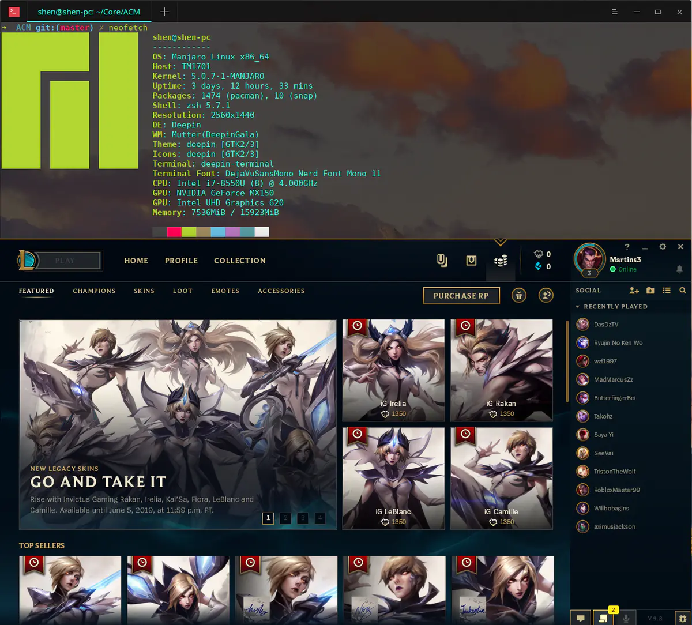

# wine : 如何实现系统调用虚拟化



> 我不是 wine 方面的专家，也没有仔细分析过 wine 的源码，欢迎搭建批评之争。

wine 的原理描述起来很简单:
1. 如果是普通指令，直接执行。
2. 如果是 syscall，那么使用 Linux 的 syscall 来模拟 windows 的 syscall 。

所以简单来说就是检测 syscall，如果遇到了，那么跳转到对应的模拟函数中，在模拟函数中执行 Linux syscall 来模拟。

但是事情比要比想象的复杂的多，wine 的代码居然接近 500 万行。
```txt
 tokei
===============================================================================
 Language            Files        Lines         Code     Comments       Blanks
===============================================================================
 C                    3638      4929041      3913305       369566       646170
 C Header             1416       501239       391755        57036        52448
```

这里有很多原因，但是绝对不是 wine 的开发人员水平太差的原因，毕竟 WSL 1 就是翻译 Linux 程序的，最后因为问题太多，换成了基于 Hyper-V 的虚拟化方案。

1. syscall 的语义不清晰。 Windows 的系统调用和 Linux 的不同的规则不同，Linux 内核和用户态的库是两波人在维护，所以 Linux 对外必须提供一个稳定的接口，而 windows 的系统调用
则可以随意变动，因为其用户态的库和内核都是在 Microsoft 的控制下，只要库对于开发人员是稳定的即可。
2. syscall 难以精确截获。很多游戏为了反作弊，代码的执行流程非常奇怪，它可以在运行时生成调用系统调用的代码。
3. 图形，硬件让 syscall 的语义极其复杂。
4. 32bit 和 64bit 程序。

## 手动测试下 hello world

编译好之后，将 wine 来执行一个 hello world，发现因为是动态链接了 dll ，但是该 dll 没有找到
```txt
🧀  ./wine ~/core/winshare/repos/ConsoleApplication1/x64/Debug/ConsoleApplication1.exe
0094:fixme:hid:handle_IRP_MN_QUERY_ID Unhandled type 00000005
0094:fixme:hid:handle_IRP_MN_QUERY_ID Unhandled type 00000005
0094:fixme:hid:handle_IRP_MN_QUERY_ID Unhandled type 00000005
0094:fixme:hid:handle_IRP_MN_QUERY_ID Unhandled type 00000005
0024:err:module:import_dll Library MSVCP140D.dll (which is needed by L"Z:\\home\\martins3\\core\\winshare\\repos\\ConsoleApplication1\\x64\\Debug\\ConsoleApplication1.exe") not found
0024:err:module:import_dll Library VCRUNTIME140_1D.dll (which is needed by L"Z:\\home\\martins3\\core\\winshare\\repos\\ConsoleApplication1\\x64\\Debug\\ConsoleApplication1.exe") not found
0024:err:module:import_dll Library VCRUNTIME140D.dll (which is needed by L"Z:\\home\\martins3\\core\\winshare\\repos\\ConsoleApplication1\\x64\\Debug\\ConsoleApplication1.exe") not found
0024:err:module:import_dll Library ucrtbased.dll (which is needed by L"Z:\\home\\martins3\\core\\winshare\\repos\\ConsoleApplication1\\x64\\Debug\\ConsoleApplication1.exe") not found
0024:err:module:LdrInitializeThunk Importing dlls for L"Z:\\home\\martins3\\core\\winshare\\repos\\ConsoleApplication1\\x64\\Debug\\ConsoleApplication1.exe" failed, status c0000135
```

重新将其静态链接，效果如下：
```txt
🧀  ./wine ~/core/winshare/ConsoleApplication2.exe
0094:fixme:hid:handle_IRP_MN_QUERY_ID Unhandled type 00000005
0094:fixme:hid:handle_IRP_MN_QUERY_ID Unhandled type 00000005
0094:fixme:hid:handle_IRP_MN_QUERY_ID Unhandled type 00000005
0094:fixme:hid:handle_IRP_MN_QUERY_ID Unhandled type 00000005
Martins3 is hacking wine!
0024:fixme:kernelbase:AppPolicyGetProcessTerminationMethod FFFFFFFFFFFFFFFA, 000000000012FC20
```

@todo 不知道为什么，虽然打开了调试信息，但是 gdb 看到的 backtrace 全部都是问号。

## 虚拟化技术的粗率总结
1. 硬件辅助虚拟化，代表为 vt-x + kvm，可以实现 Windows 操作系统在 Linux 中运行。
2. 二进制翻译，代表是 QEMU ，可以实现 ARM 程序在 x86 上运行。
3. JVM, LLVM, V8, WebAssembly 等语言虚拟机。v8 可以让 js 代码在任何支持 v8 的平台运行（当然 v8 的平台支持非常麻烦）；
4. 容器，实现隔离，可以让 Ubuntu 在 Centos 上运行。
5. [cosmopolitan](https://github.com/jart/cosmopolitan) 之类的跨平台的库。
6. microcode 可以"翻译" CPU 实际上执行指令。

暂时就想到这么多了，更详细的内容参考可以 @xieby1 的[总结](https://github.com/xieby1/runXonY) 。

## 扩展阅读
- [How the Windows Subsystem for Linux Redirects Syscalls](https://news.ycombinator.com/item?id=11864211)
  - Microsoft 介绍 wsl 的原理
- [How Wine works 101](https://news.ycombinator.com/item?id=33156727)
- [windows-syscall](https://github.com/j00ru/windows-syscalls)
- [CrossOver](https://en.wikipedia.org/wiki/CrossOver_(software))
- [Proton](https://github.com/ValveSoftware/Proton/)

<script src="https://giscus.app/client.js"
        data-repo="martins3/martins3.github.io"
        data-repo-id="MDEwOlJlcG9zaXRvcnkyOTc4MjA0MDg="
        data-category="Show and tell"
        data-category-id="MDE4OkRpc2N1c3Npb25DYXRlZ29yeTMyMDMzNjY4"
        data-mapping="pathname"
        data-reactions-enabled="1"
        data-emit-metadata="0"
        data-theme="light"
        data-lang="zh-CN"
        crossorigin="anonymous"
        async>
</script>

本站所有文章转发 **CSDN** 将按侵权追究法律责任，其它情况随意。
