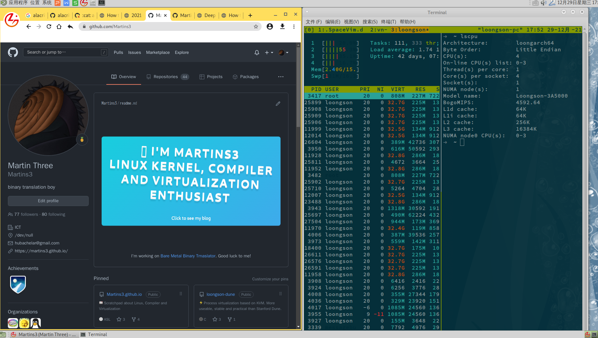
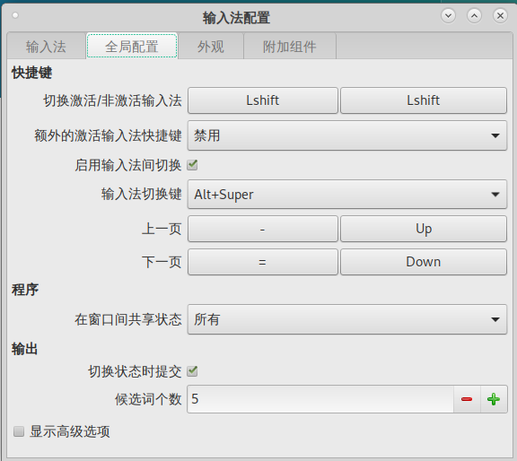
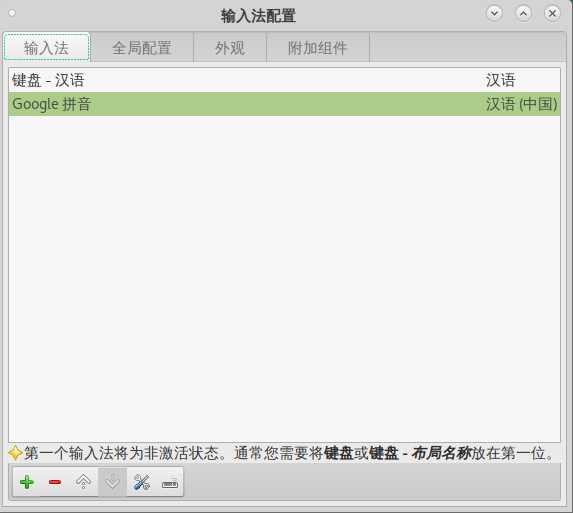
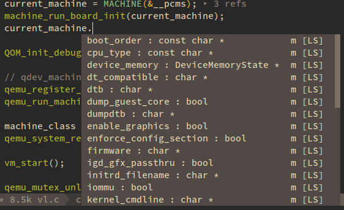

# 使用 3A5000 作为我的主力机

<!-- vim-markdown-toc GitLab -->

* [Background](#background)
* [在此之前的工作方法](#在此之前的工作方法)
  * [sshfs](#sshfs)
  * [rsync](#rsync)
* [输入法](#输入法)
* [Neovim](#neovim)
  * [ccls](#ccls)
  * [coc-explorer](#coc-explorer)
  * [greenlet](#greenlet)
* [Terminal](#terminal)
* [Browser](#browser)
* [Scientific Network Access](#scientific-network-access)
* [lazygit](#lazygit)
* [无法正确工作的代码](#无法正确工作的代码)
* [无需额外努力，完美工作的程序](#无需额外努力完美工作的程序)

<!-- vim-markdown-toc -->
龙芯的 3A5000 的一周我自己的使用体验总结：基本可以替代我的 x86 电脑。

其实我给龙芯写了好几年的程序，但是都是在 x86 上写，然后在龙芯的机器上编译的，最近一时激动，将环境迁移到龙芯上，遇到了很多小问题，总体来说问题不大：
- 浏览器非常的稳定，上 Google 和 B 站都是没问题
- WPS 基本开箱可用
- 我需要使用的软件基本都是开源的，只是需要手动编译就好了

主要的困扰是，有的软件存在和架构相关的代码，需要打补丁才可以编译出来。但是没有性能瓶颈。

最后，不建议大家购买，除非你满足下面的条件：
- 你很有钱
- 你有较多的空闲时间
- 你熟悉 Linux 以及 GNU toolchain
- 最好掌握 LLVM Rust 和 Golang

下面用我的英语写的不是为了展示炫耀我的刚过 4 级的分数，而是最开始的时候我非常不习惯这个输入法设定，一是没有搜狗输入法
对于我这个可怜的"蓝"方人太难受了，二是我没怎么搞清楚输入法的切换，每次切换都非常麻烦。


(Tested on 2021.12.29)

You can open the image in new Tab for more vivid view.
As you can see, the left is the Chrome browser, the right the terminal signing that 3a5000 has four cores.

## Background
Several months ago, when I'm still working the [loongson-dune](https://github.com/Martins3/loongson-dune), I tried to
sync my [My Linux Config](https://github.com/Martins3/My-Linux-Config) to Longson 3a5000.

As for zsh, it's not too hard. Although it define many macro related architecture, while fixing them is fairly easy.
zsh complaints that it doesn't recognize the loongarch64 arch, I comment the related code, then it compiles and works fine.

But neovim is not so easy because it depends on luajit which has a huge portion of [architecture related code](https://github.com/LuaJIT/LuaJIT/blob/v2.1/src/vm_mips64.dasc)
I'm not a compiler expert, mips expert and loongarch expert, it will cost me too much time, weeks or months, to make it work.

But last day I found the luajit has been ported by loonson engineers, it's time to give it a try.

## 在此之前的工作方法

### sshfs
[loongson-dune](https://github.com/Martins3/loongson-dune) 就是在这种环境下写的。
- 在 tmux 打开两个终端
- 第一个使用 sshfs 将 3a5000 的目录挂载到 x86 本地，然后就可以直接编辑了
- 在第二个终端 ssh 到 3a5000 上，直接 make

这种方法存在两个问题:
- 为了索引正确
  - 因为 `compile_commands.json` 只能在 3a5000 上生成，生成之后，需要手动修改其路径
  - 编写的代码如果需要和架构相关的头文件，比如 kvm 相关的，那么需要保证这些代码在 x86 上可以索引到，在 loongson-dune 的做法是直接放到 git 仓库中的
- 只是适合小项目，loongson-dune 只有几千行，几个文件而已，大项目存在明显的延迟，比如内核。

当然 sshfs 还是很有用的，比如有的项目需要编译 x86 镜像的时候。

### rsync
使用下面的脚本可以过滤掉被 git 忽略的文件
```sh
#!/usr/bin/env bash
if [ $# -eq 0 ];then
  echo "need parameter"
  exit 0
fi
echo "sync $1"
rsync --delete -avzh --exclude='/.git' --filter="dir-merge,- .gitignore" maritns3@$ip_addr:/home/maritns3/core/ld/"$1" /home/loongson/ld
```
每次在 x86 编写，然后同步过去

好处是没有延迟，因为本身就是在 x86 上写代码，但是会导致文件上的时间出现错乱，make 会说 skewed time 之类的。

## 输入法
无需安装，但是按照下图配置，可以实现 shift 切换中英文输入的操作。



## Neovim
```sh
sudo apt install libluajit-5.1-dev
sudo apt install lua5.1
sudo apt install luarocks
git clone https://github.com/neovim/neovim
cd neovim
```

Neovim separate it's compile into three stage[^1]:
- compiles bundles. Bundles are the dependencies of neovim, you can compile it from source or install it with package manager
- compile the neovim.
- link the neovim with the bundles

```sh
make BUNDLED_CMAKE_FLAG="-DUSE_BUNDLED=ON -DUSE_BUNDLED_LUAJIT=OFF -DUSE_BUNDLED_LUAROCKS=OFF" CMAKE_BUILD_TYPE=Release
```
This command will compile all the bundles from source except luajit and luarocks.

The reason to exempt luajit is easy, but leaving luarocks out is kind of mysterious. I don't know why, it just works.

### ccls
When working on a C project, I found my neovim doesn't complete code anymore.

I think it's caused by coc.nvim, so I switch to [lspconfig](https://github.com/neovim/nvim-lspconfig),
the problem doesn't disappear. What's more, the .vim project works well, so I guess may caused by ccls.

config the neovim
```diff
--- a/plugin/coc.vim
+++ b/plugin/coc.vim
@@ -57,7 +57,6 @@ call coc#config("languageserver", {
       \"ccls": {
       \  "command": "/home/loongson/arch/ccls/Release/ccls",
       \  "filetypes": ["c", "cpp"],
-      \  "trace.server": "verbose",
       \  "rootPatterns": ["compile_commands.json", ".git/"],
       \  "index": {
       \     "threads": 0
```
and debug the languageserver[^3]
```txt
:CocCommand workspace.showOutput
```
In order to debug the ccls, I recompile the ccls with
```c
cmake -H. -BRelease -DCMAKE_BUILD_TYPE=Debug
```
The problem fixed. Laugh my ass off.


### coc-explorer
Replace it with [nvim-tree](https://github.com/kyazdani42/nvim-tree.lua), permanently.

### greenlet
[greenlet](https://github.com/python-greenlet/greenlet) has architecture related code.
it is being fixed in https://github.com/python-greenlet/greenlet/pull/257

## Terminal
[alacritty](https://github.com/alacritty/alacritty) can't be compiled correctly because of outdated rust toolchain.
So I use the system default gnome-terminal, it works perfectly.

## Browser
Based on [chromium](https://www.chromium.org/), no crash, nothing new except the logo.

But there is one thing makes me sick. Loongson removed Google's original profile with it's own, so I can't sync my bookmarks from my x86 Chrome's bookmarks and passwords.

## Scientific Network Access
In order to access Google, v2ray and qv2ray are necessary.
I don't try to port them. use another x86 to setup the network proxy and share it to 3A5000.

## lazygit
[lazygit](https://github.com/jesseduffield/lazygit) is not available because of outdated golang toolchain.
so use [tig](https://jonas.github.io/tig/doc/tig.1.html) as a substitute.

## 无法正确工作的代码

| What                      | Why                                                                                    |
|---------------------------|----------------------------------------------------------------------------------------|
| wakatime                  | I don't know how to compile wakatime-cli                                               |
| doesn't support 2k screen | no GPU card                                                                            |
| markdown-preview.nvim     | I don't know                                                                           |
| openmoji.org              | terminal can't render emoji in openmoji.org correctly, install the same font with x86' |
| coc-ci                    | don't know why, no time to investigate                                                 |

The fan is always buzzing. I have to wear the WH-1000XM3

## 无需额外努力，完美工作的程序
- flameshot
- ag

<script src="https://giscus.app/client.js"
        data-repo="martins3/martins3.github.io"
        data-repo-id="MDEwOlJlcG9zaXRvcnkyOTc4MjA0MDg="
        data-category="Show and tell"
        data-category-id="MDE4OkRpc2N1c3Npb25DYXRlZ29yeTMyMDMzNjY4"
        data-mapping="pathname"
        data-reactions-enabled="1"
        data-emit-metadata="0"
        data-theme="light"
        data-lang="zh-CN"
        crossorigin="anonymous"
        async>
</script>

本站所有文章转发 **CSDN** 将按侵权追究法律责任，其它情况随意。

[^1]: https://github.com/neovim/neovim/wiki/Building-Neovim#how-to-build-without-bundled-dependencies
[^2]: https://martins3.github.io/gfw.html#share-proxy-cross-lan
[^3]: https://github.com/neoclide/coc.nvim/wiki/Debug-language-server
