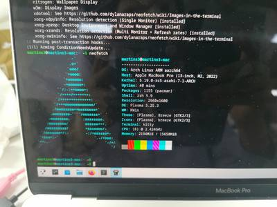

# Mac，将就着用吧

我使用的 Mac 是公司发的，否则我是不会换掉 Linux 笔记本[^1]的。

不得不承认，Mac 有一些优点的:
- 使用 ARM 指令集，我感觉 x86 为了兼容历史，指令集太恶心了，难学，难用，难以实现。
- 续航时间长，去公司上班实际上是可以不用带充电器的，也就是大约 10 小时，而小米的笔记本最多只有 4 ~ 5 小时。
- 安装 Slack ，WeChat 非常容易。

还有一些优点，但是对于我没有什么意义:
- 性能更好，编译更快，但是我主要编译 Linux 和 QEMU，前者编译不出来，后者编译的选项有问题，而且在 server 上编译速度更快。
- 屏幕是 4k 的，但我总是连外接显示器。

但是也存在很多问题或者我难以习惯的地方:
- 合上盖子，必须插上电源。
- 无线鼠标，和无线键盘非常的卡，几乎没有办法用[^2]，我花了 20 块钱买了一个有线的鼠标。
- 没有原生的 nfs 支持，所以没有 sshfs，我只好使用 syncthing 来同步。
- Ctrl Win Alt 键的重新定义，目前只会在外接键盘上使用电脑。

总之，对于我长期使用 Linux 桌面环境的用户而言，且工作学习和 Linux 关联性很强的用户，Mac 只有一个优势，那就是可以无痛地使用微信。
虽然 Linux 是社区推动，但是这个社区中大多数人都是云计算公司，芯片公司或者 SRE 等，这些人只是在乎 server 的性能，一直以来 Linux 桌面版的进步缓慢，社区也是见死不救。

似乎 Apple 从 iPhone 的成功中得到一个经验，那就是用户不知道自己想要什么。
现在其将这种想法放到其他的产品，认为用户不知道如何使用电脑，按照它的方式去使用就好了。

Apple 想要构建一个封闭的生态，将所有的利润都榨干，让其他厂商连喝汤的几乎都没有。对此，我想说，得道多助，失道寡助。
相似的，还有一个公司，叫做英伟达。

## 折腾过的地方

### bash 版本过低
- 似乎必须使用 homebrew 中的 bash https://github.com/jitterbit/get-changed-files/issues/15
- 使用这个方法切换: https://johndjameson.com/blog/updating-your-shell-with-homebrew

### 获取 ip addr
- 打开 https://superuser.com/questions/104929/how-do-you-run-a-ssh-server-on-mac-os-x
- https://www.hellotech.com/guide/for/how-to-find-ip-address-on-mac

### Window Management
- 安装 [Amethyst](https://github.com/ianyh/Amethyst)，然后使用 Shift Alt J 可以替换实现 Ubuntu 中 Alt Tab 的功能；
- 使用 Ctrl Shift Left 和 Ctrl Shift Right 切换桌面。

### neovim 插件 markdown-preview 不能正常工作
进入到插件的目录中，手动 npm -i[^3]

### 安装 nerdfont
- https://gist.github.com/davidteren/898f2dcccd42d9f8680ec69a3a5d350e

### 安装 Linux 虚拟机
虽然各种发行版的 server 版本都可以安装，但是只有 Ubuntu 桌面版支持的比较好 [^4]

首先安装 Ubuntu Server，然后手动安装桌面环境:
```sh
sudo apt update && sudo apt upgrade
sudo apt install ubuntu-desktop
```

### 目前为未解决的问题
- 应该是环境变量的问题，kitty 必须从 iterm 中启动， 可以使用 open $(which kitty) 来测试
- kitty 中文渲染不正常，可以确认不是软件的问题，因为插上外接显示器之后，字体就渲染不正常了。
- 暂时没有安装上 nixpkgs；

### 安装 Linux

使用 asahilinux ，安装过程非常简单:




[^1]: 2019 年版本的小米 pro
[^2]: 不过对于 Apple 的鼠标应该是没有问题的，那将是另外的一笔巨款。
[^3]: https://stackoverflow.com/questions/52801814/this-syntax-requires-an-imported-helper-but-module-tslib-cannot-be-found-wit
[^4]: https://askubuntu.com/questions/1405124/install-ubuntu-desktop-22-04-arm64-on-macos-apple-silicon-m1-pro-max-in-parall

<script src="https://giscus.app/client.js"
        data-repo="martins3/martins3.github.io"
        data-repo-id="MDEwOlJlcG9zaXRvcnkyOTc4MjA0MDg="
        data-category="Show and tell"
        data-category-id="MDE4OkRpc2N1c3Npb25DYXRlZ29yeTMyMDMzNjY4"
        data-mapping="pathname"
        data-reactions-enabled="1"
        data-emit-metadata="0"
        data-theme="light"
        data-lang="zh-CN"
        crossorigin="anonymous"
        async>
</script>

本站所有文章转发 **CSDN** 将按侵权追究法律责任，其它情况随意。
