# QEMU 中的 seabios : fw_cfg

## Why QEMU needs fw_cfg
seabios 可以在裸机上，也可以在 QEMU 中运行，在 QEMU 中运行时，通过 fw_cfg 从 host 获取 guest 的各种配置或者 rom 会相当的方便。

比如在 ./hw/i386/fw_cfg.c 中 fw_cfg_arch_create 中，使用 fw_cfg 可以容易将 guest 的主板的 CPU 的数量通知给 guest。
```c
    fw_cfg_add_i16(fw_cfg, FW_CFG_MAX_CPUS, apic_id_limit);
```

## What does fw_cfg transfer

## Implement details

### IO transfer
和其他任何 pio 相同，fw_cfg 传输也是通过在注册 MemoryRegion 的方式.

具体来说就是, 在 `fw_cfg_io_realize` 中初始化 MemoryRegion comb_iomem
```c
    memory_region_init_io(&s->comb_iomem, OBJECT(s), &fw_cfg_comb_mem_ops,
                          FW_CFG(s), "fwcfg", FW_CFG_CTL_SIZE);
```
然后在 `fw_cfg_init_io_dma` 中添加进去
```c
    sysbus_add_io(sbd, iobase, &ios->comb_iomem); // iobase = FW_CFG_IO_BASE，也就是 0x510
```
之后 guest 只要读写 FW_CFG_IO_BASE 的位置，就会触发 fw_cfg_comb_mem_ops 的操作。

```c
static void fw_cfg_comb_write(void *opaque, hwaddr addr,
                              uint64_t value, unsigned size)
{
    switch (size) {
    case 1:
        fw_cfg_write(opaque, (uint8_t)value);
        break;
    case 2:
        fw_cfg_select(opaque, (uint16_t)value);
        break;
    }
}
```

在 seabios 这一侧的定义是对应的

./src/fw/paravirt.h
```c
#define PORT_QEMU_CFG_CTL           0x0510
#define PORT_QEMU_CFG_DATA          0x0511
```
例如 seabios 想要获取 CPU 数量的执行流程
- qemu_get_present_cpus_count
  - qemu_cfg_read_entry
    - qemu_cfg_select : 应该传递的内容有多个，首选进行选择
    - qemu_cfg_read : 选择了之后，从 PORT_QEMU_CFG_DATA 端口中读去
      - insb(PORT_QEMU_CFG_DATA, buf, len);

注意，实际上 QEMU 关于 fw_cfg 实现了两套方案，默认使用的是 fw_cfg_io_info
```c
static void fw_cfg_register_types(void)
{
    type_register_static(&fw_cfg_info);    // parent
    type_register_static(&fw_cfg_io_info); // 采用的这一套解决方法
    type_register_static(&fw_cfg_mem_info);
}
```

### DMA transfer
使用 pio 传输，每次最多只能传输 long 的大小，但是代价是一次 vmexit，传输大量数据的时候，效率会很低。

为此需要多注册一个端口 fwcfg.dma，传输 QemuCfgDmaAccess 的地址

```c
static void
qemu_cfg_dma_transfer(void *address, u32 length, u32 control)
{
    QemuCfgDmaAccess access;

    access.address = cpu_to_be64((u64)(u32)address);
    access.length = cpu_to_be32(length);
    access.control = cpu_to_be32(control);

    barrier();

    outl(cpu_to_be32((u32)&access), PORT_QEMU_CFG_DMA_ADDR_LOW);

    while(be32_to_cpu(access.control) & ~QEMU_CFG_DMA_CTL_ERROR) {
        yield();
    }
}
```
在 QEMU 这里 QemuCfgDmaAccess 的信息在 fw_cfg_dma_transfer 中解析，最后调用到 dma_memory_write / dma_memory_read 完成数据传输。

### file
fw_cfg 可以支持多种数据类型,
- fw_cfg_add_i16
- fw_cfg_add_i32
- fw_cfg_add_i64
- fw_cfg_add_string
- fw_cfg_add_file

file 类型和其他的类型有一些区别，并不是因为数据保存在文件中的原因，
不管那种类型的，数据的地址保存 FWCfgEntry::data 中的。
也不是因为数据大小的原因。file 的类型主要是为了**灵活性**。

实际上，fw_cfg 需要让 host 和 guest 传输多种数据，这些数据都是保存在数组 FWCfgState::entries 中的，
对于一些常用/有名的，host 和 guest 存在公共的约定索引

架构无关的在: include/standard-headers/linux/qemu_fw_cfg.h
```c
/* selector key values for "well-known" fw_cfg entries */
#define FW_CFG_SIGNATURE	0x00
#define FW_CFG_ID		0x01
#define FW_CFG_UUID		0x02
#define FW_CFG_RAM_SIZE		0x03
#define FW_CFG_NOGRAPHIC	0x04
// ...
```

和架构相关的内容放到了 ./hw/i386/fw_cfg.h
```c
#define FW_CFG_ACPI_TABLES      (FW_CFG_ARCH_LOCAL + 0)
#define FW_CFG_SMBIOS_ENTRIES   (FW_CFG_ARCH_LOCAL + 1)
#define FW_CFG_IRQ0_OVERRIDE    (FW_CFG_ARCH_LOCAL + 2)
#define FW_CFG_E820_TABLE       (FW_CFG_ARCH_LOCAL + 3)
#define FW_CFG_HPET             (FW_CFG_ARCH_LOCAL + 4)
```

如果想要添加一个新的内容，比如 smbios 的配置，就需要修改所有的 host 和 guest 的代码，
于是设计出来了 file

因为很多 fw_cfg 使用约定好的 index，但是新添加的，有一些采用名称来区分

文件的处理方法:
- 文件的常规内容都存贮在 FWCfgState::entries
- FWCfgState::files 指向一个 FWCfgFiles 是为了记录文件的属性
- FW_CFG_FILE_FIRST 开始, FWCfgState::entries[index - FW_CFG_FILE_FIRST] 持有 FWCfgState::files[index] 的内容是对应的，前者持有 file 的内容，后者持有 file 的属性
- FWCfgState::entries[FW_CFG_FILE_DIR] 保存的是 FWCfgFiles 的内容，也就是文件的属性，seabios 可以给出一个文件名可以知道其在 FWCfgState::entries

使用图形表示就是:


seabios 中的 qemu_cfg_init 处理:
```c
void qemu_cfg_init(void)
{
    // Load files found in the fw_cfg file directory
    u32 count;
    qemu_cfg_read_entry(&count, QEMU_CFG_FILE_DIR, sizeof(count));
    count = be32_to_cpu(count); // 一共有多少个文件
    u32 e;
    for (e = 0; e < count; e++) {
        struct QemuCfgFile qfile;
        qemu_cfg_read(&qfile, sizeof(qfile)); // 读取一个 FWCfgFile
        qemu_romfile_add(qfile.name, be16_to_cpu(qfile.select) // 添加 file 到 RomfileRoot 数组中，之后可以通过文件名调用  romfile_find
                         , 0, be32_to_cpu(qfile.size));
    }
```

```c
static int
get_field(int type, int offset, void *dest)
{
    char name[128];
    snprintf(name, sizeof(name), "smbios/field%d-%d", type, offset);
    struct romfile_s *file = romfile_find(name);
    if (!file)
        return 0;
    file->copy(file, dest, file->size);
    return file->size;
}
```


```c
void fw_cfg_add_file_callback(FWCfgState *s,  const char *filename,
                              FWCfgCallback select_cb,
                              FWCfgWriteCallback write_cb,
                              void *callback_opaque,
                              void *data, size_t len, bool read_only)
{

    // ...
    if (!s->files) {
        dsize = sizeof(uint32_t) + sizeof(FWCfgFile) * fw_cfg_file_slots(s);
        s->files = g_malloc0(dsize);
        fw_cfg_add_bytes(s, FW_CFG_FILE_DIR, s->files, dsize);
    }

    // ...
    fw_cfg_add_bytes_callback(s, FW_CFG_FILE_FIRST + index,
                              select_cb, write_cb,
                              callback_opaque, data, len,
                              read_only);

    s->files->f[index].size   = cpu_to_be32(len);
    s->files->f[index].select = cpu_to_be16(FW_CFG_FILE_FIRST + index);
    s->entry_order[index] = order;
```
数据的地址放到 FWCfgEntry::data 中

```c
typedef struct FWCfgFiles {
    uint32_t  count;
    FWCfgFile f[];
} FWCfgFiles;

/* fw_cfg file directory entry type */
struct fw_cfg_file {
	uint32_t size;
	uint16_t select;
	uint16_t reserved;
	char name[FW_CFG_MAX_FILE_PATH];
};
```

```c
huxueshi:qemu_cfg_init filename=bios-geometry
huxueshi:qemu_cfg_init filename=bootorder
huxueshi:qemu_cfg_init filename=etc/acpi/rsdp
huxueshi:qemu_cfg_init filename=etc/acpi/tables
huxueshi:qemu_cfg_init filename=etc/boot-fail-wait
huxueshi:qemu_cfg_init filename=etc/e820
huxueshi:qemu_cfg_init filename=etc/msr_feature_control
huxueshi:qemu_cfg_init filename=etc/smbios/smbios-anchor
huxueshi:qemu_cfg_init filename=etc/smbios/smbios-tables
huxueshi:qemu_cfg_init filename=etc/system-states
huxueshi:qemu_cfg_init filename=etc/table-loader
huxueshi:qemu_cfg_init filename=etc/tpm/log
huxueshi:qemu_cfg_init filename=genroms/kvmvapic.bin
huxueshi:qemu_cfg_init filename=genroms/linuxboot_dma.bin
```
之后 seabios 就可以通过


- 这个 dir 是如何组装出来的?
  - fw_cfg_add_file_callback 中创建了 FW_CFG_FILE_DIR 这个 entry, 其数值正好指向了 FWCfgState::files
  - fw_cfg_add_file_callback 中接下来组装 FWCfgState::files 中的内容
  - 最后调用 fw_cfg_add_bytes_callback 将数据装入

### rom
#### bios

#### option rom

```c
fw_cfg_reboot
```

## Rom

QEMU 可以添加多种类型的 ROM
```c
#define rom_add_file_fixed(_f, _a, _i)          \
    rom_add_file(_f, NULL, _a, _i, false, NULL, NULL)
#define rom_add_blob_fixed(_f, _b, _l, _a)      \
    rom_add_blob(_f, _b, _l, _l, _a, NULL, NULL, NULL, NULL, true)
#define rom_add_file_mr(_f, _mr, _i)            \
    rom_add_file(_f, NULL, 0, _i, false, _mr, NULL)
#define rom_add_file_as(_f, _as, _i)            \
    rom_add_file(_f, NULL, 0, _i, false, NULL, _as)
#define rom_add_file_fixed_as(_f, _a, _i, _as)          \
    rom_add_file(_f, NULL, _a, _i, false, NULL, _as)
#define rom_add_blob_fixed_as(_f, _b, _l, _a, _as)      \
    rom_add_blob(_f, _b, _l, _l, _a, NULL, NULL, NULL, _as, true)
```

- [ ] 注意到似乎有的 fw_cfg_add_file 是走的这里，有的似乎不是，都是因为什么


```c
int rom_add_option(const char *file, int32_t bootindex)
{
    return rom_add_file(file, "genroms", 0, bootindex, true, NULL, NULL);
}
```
实际上，变成了只有 rom_add_option 位置。

在 pc_memory_init 中:
```c
    for (i = 0; i < nb_option_roms; i++) {
        rom_add_option(option_rom[i].name, option_rom[i].bootindex);
    }
```
其中 nb_option_roms 和 option_rom 是两个全局变量

## rom_reset 加载到内存中

为什么可以将 pc.bios 和文件联系起来的 ?
在 x86_bios_rom_init 中会调用 rom_add_file_fixed 设置 bios 的内容在 4G-256k 的位置，
从常规的思考，应该是在创建 MemoryRegion bios 的基础上，让 bios 持有的 RamBlock 最后指向
mmap 的这个文件，但是实际上，并不是，而是简单的通过 rom_add_file_fixed 就可以做到。
```c
  rom_add_file_fixed(bios_name, (uint32_t)(-bios_size), -1)
```

- x86_bios_rom_init 只是负责将文件添加进去，而 rom_reset 负责将内容拷贝过去

调用路径:
- address_space_write_rom
  - address_space_write_rom_internal
    - address_space_translate : 找到对应的 MemoryRegion 也就是 MemoryRegion mr 了
    - memcpy

下面几个内容应该是 rom 直接加载
```c
huxueshi:rom_reset /home/maritns3/core/seabios/out/bios.bin
huxueshi:rom_reset etc/acpi/tables
huxueshi:rom_reset etc/table-loader
huxueshi:rom_reset etc/acpi/rsdp
```

```c
huxueshi:rom_insert /home/maritns3/core/seabios/out/bios.bin
huxueshi:rom_insert kvmvapic.bin
huxueshi:rom_insert linuxboot_dma.bin
huxueshi:rom_insert etc/acpi/tables
huxueshi:rom_insert etc/table-loader
huxueshi:rom_insert etc/acpi/rsdp
```

- insert 进去的是 6 个，但是 rom_reset 只有 4 个，因为那些 `rom->fw_file != NULL` 使用 fw_file 加载就好了

实际上，这些数据都是通过 fw_cfg 传递的
```c
huxueshi:fw_cfg_add_file_callback etc/e820
huxueshi:fw_cfg_add_file_callback genroms/kvmvapic.bin
huxueshi:fw_cfg_add_file_callback genroms/linuxboot_dma.bin
huxueshi:fw_cfg_add_file_callback etc/system-states
huxueshi:fw_cfg_add_file_callback etc/acpi/tables
huxueshi:fw_cfg_add_file_callback etc/table-loader
huxueshi:fw_cfg_add_file_callback etc/tpm/log
huxueshi:fw_cfg_add_file_callback etc/acpi/rsdp
huxueshi:fw_cfg_add_file_callback etc/smbios/smbios-tables
huxueshi:fw_cfg_add_file_callback etc/smbios/smbios-anchor
huxueshi:fw_cfg_add_file_callback bootorder
huxueshi:fw_cfg_add_file_callback bios-geometry
```

为什么就是下面三个是关联的 memory_region
```c
huxueshi:rom_insert etc/acpi/tables
huxueshi:rom_insert etc/table-loader
huxueshi:rom_insert etc/acpi/rsdp
```

具体原因可以参考:
90921644ff0d58e6e165cc439321328e5d771256

```diff
tree 90921644ff0d58e6e165cc439321328e5d771256
parent 0851c9f75ccb0baf28f5bf901b9ffe3c91fcf969
author Michael S. Tsirkin <mst@redhat.com> Mon Aug 19 17:26:55 2013 +0300
committer Michael S. Tsirkin <mst@redhat.com> Wed Aug 21 00:18:39 2013 +0300

loader: store FW CFG ROM files in RAM

ROM files that are put in FW CFG are copied to guest ram, by BIOS, but
they are not backed by RAM so they don't get migrated.

Each time we change two bytes in such a ROM this breaks cross-version
migration: since we can migrate after BIOS has read the first byte but
before it has read the second one, getting an inconsistent state.

Future-proof this by creating, for each such ROM,
an MR serving as the backing store.
This MR is never mapped into guest memory, but it's registered
as RAM so it's migrated with the guest.

Naturally, this only helps for -M 1.7 and up, older machine types
will still have the cross-version migration bug.
Luckily the race window for the problem to trigger is very small,
which is also likely why we didn't notice the cross-version
migration bug in testing yet.

Signed-off-by: Michael S. Tsirkin <mst@redhat.com>
Reviewed-by: Laszlo Ersek <lersek@redhat.com>
```

让 rom 和 mr 关联的原因: 因为 bios 无法自动同步，所以使用 MemoryRegion 保存 bios 从而可以自动 migration
解决方法:
1. 创建 rom_set_mr : 将 rom 关联一个 mr, 并且将 rom 中的数据拷贝到 mr 的空间中
2. 修改 rom_add_file  : fw_cfg 提供数据给 guest 注册的时候只是需要一个指针，如果配置了 option_rom_has_mr 的话，那么这个指针来自于 memory_region_get_ram_ptr

## rom_insert 的调用者
- rom_add_blob
- rom_add_file
- rom_add_elf_program : 暂时没有使用

- rom_add_file 和 rom_add_blob 的区别
    - rom_add_file 提供的是文件名，其中需要打开文件，将文件内容放到其中
    - rom_add_blob 的参数冲 blob 需要拷贝过去即可
    - 其实，从三者调用者这个就已经很清楚了

#### rom_add_file
1. 将文件中内容拷贝到 Rom::data

似乎只是看到下面三个调用者
```c
huxueshi:rom_add_file /home/maritns3/core/seabios/out/bios.bin
huxueshi:rom_add_file /home/maritns3/core/kvmqemu/build/pc-bios/kvmvapic.bin
huxueshi:rom_add_file /home/maritns3/core/kvmqemu/build/pc-bios/linuxboot_dma.bin
```

观看一个最经典的:
```c
/*
#0  rom_add_file (file=file@entry=0x555556fe3010 "/home/maritns3/core/seabios/out/bios.bin", fw_dir=fw_dir@entry=0x0, addr=addr@entry=4294705152, bootindex=bootindex@entry=-1, option_rom=option_rom@entry=false, mr=mr@entry=0x0, as=0x0) at ../hw/core/loader.c:944
#1  0x0000555555b93560 in x86_bios_rom_init (ms=<optimized out>, default_firmware=<optimized out>, rom_memory=0x555556a132d0, isapc_ram_fw=<optimized out>) at ../hw/i386/x86.c:1110
#2  0x0000555555b9b988 in pc_system_firmware_init (pcms=0x5555568a65e0, rom_memory=0x555556a132d0) at /home/maritns3/core/kvmqemu/include/hw/boards.h:24
#3  0x0000555555b8baa0 in pc_memory_init (pcms=pcms@entry=0x5555568a65e0, system_memory=system_memory@entry=0x5555566a9460, rom_memory=rom_memory@entry=0x555556a132d0,ram_memory=ram_memory@entry=0x7fffffffd290) at ../hw/i386/pc.c:945
#4  0x0000555555b9e281 in pc_init1 (machine=0x5555568a65e0, pci_type=0x555555f08869 "i440FX", host_type=0x555555f3773c "i440FX-pcihost") at ../hw/i386/pc_piix.c:185
#5  0x0000555555a9b934 in machine_run_board_init (machine=0x5555568a65e0) at ../hw/core/machine.c:1272
#6  0x0000555555d09ef4 in qemu_init_board () at ../softmmu/vl.c:2618
#7  qmp_x_exit_preconfig (errp=<optimized out>) at ../softmmu/vl.c:2692
#8  0x0000555555d0d6b0 in qemu_init (argc=<optimized out>, argv=<optimized out>, envp=<optimized out>) at ../softmmu/vl.c:3714
#9  0x0000555555940c8d in main (argc=<optimized out>, argv=<optimized out>, envp=<optimized out>) at ../softmmu/main.c:49
*/
```

#### rom_add_blob
下面三个通过 rom_add_blob 来添加的, 而且其调用者都是 acpi_add_rom_blob
1. etc/acpi/tables
2. etc/table-loader
3. etc/acpi/rsdp

- 创建的 mr 实际上根本没有挂载到任何 mr 其作用更像是分配空间而已, seabios 读去空间还是靠 fw_cfg 的

在下面三个位置都会进行从 Rom::data 到 mr 的空间的拷贝，但是都没啥意, 因为在 acpi_build_update 中进行 memcpy 的
- rom_set_mr
- rom_reset
- acpi_ram_update

```c
static void acpi_ram_update(MemoryRegion *mr, GArray *data)
{
    uint32_t size = acpi_data_len(data);

    /* Make sure RAM size is correct - in case it got changed e.g. by migration */
    memory_region_ram_resize(mr, size, &error_abort);

    memcpy(memory_region_get_ram_ptr(mr), data->data, size);
    memory_region_set_dirty(mr, 0, size);
}
```


```c
/*
#0  rom_add_blob (name=name@entry=0x555555eeba65 "etc/acpi/tables", blob=0x555557de3890, len=131072, max_len=max_len@entry=2097152, addr=addr@entry=18446744073709551615, fw_file_name=fw_file_name@entry=0x555555eeba65 "etc/acpi/tables", fw_callback=0x555555bb2300 <acpi_build_update>, callback_opaque=0x555556b4ef90, as=0x0, read_only=true) at ../hw/core/loader.c:1044
#1  0x0000555555998607 in acpi_add_rom_blob (update=update@entry=0x555555bb2300 <acpi_build_update>, opaque=opaque@entry=0x555556b4ef90, blob=0x555556acc030, name=<optimized out>, name@entry=0x555555eeba65 "etc/acpi/tables") at ../hw/acpi/utils.c:46
#2  0x0000555555bb2568 in acpi_setup () at ../hw/i386/acpi-build.c:2733
*/

/*
#0  rom_add_blob (name=name@entry=0x555555eeba75 "etc/table-loader", blob=0x555556ae8950, len=4096, max_len=max_len@entry=65536, addr=addr@entry=18446744073709551615, f
w_file_name=fw_file_name@entry=0x555555eeba75 "etc/table-loader", fw_callback=0x555555bb2300 <acpi_build_update>, callback_opaque=0x555556b4ef90, as=0x0, read_only=true
) at ../hw/core/loader.c:1044
#1  0x0000555555998607 in acpi_add_rom_blob (update=update@entry=0x555555bb2300 <acpi_build_update>, opaque=opaque@entry=0x555556b4ef90, blob=0x555556acc0f0, name=<opti
mized out>, name@entry=0x555555eeba75 "etc/table-loader") at ../hw/acpi/utils.c:46
#2  0x0000555555bb2593 in acpi_setup () at ../hw/i386/acpi-build.c:2738
*/

/*
#0  rom_add_blob (name=name@entry=0x555555eeba86 "etc/acpi/rsdp", blob=0x555556eb87d0, len=20, max_len=max_len@entry=4096, addr=addr@entry=18446744073709551615, fw_file_name=fw_file_name@entry=0x555555eeba86 "etc/acpi/rsdp", fw_callback=0x555555bb2300 <acpi_build_update>, callback_opaque=0x555556b4ef90, as=0x0, read_only=true) at ../hw/core/loader.c:1044
#1  0x0000555555998607 in acpi_add_rom_blob (update=update@entry=0x555555bb2300 <acpi_build_update>, opaque=opaque@entry=0x555556b4ef90, blob=0x555556acc000, name=<optimized out>, name@entry=0x555555eeba86 "etc/acpi/rsdp") at ../hw/acpi/utils.c:46
#2  0x0000555555bb273f in acpi_setup () at ../hw/i386/acpi-build.c:2779
*/
```


## boot device
关联文件 softmmu/bootdevice.c

在 seabios 的 loadBootOrder 中需要读读去 fw_cfg 的 bootorder,
seabios 的 boot order 是受到 fw_cfg 制作的 bootorder 控制的, 此处就是在制作 bootorder

```c
typedef struct FWBootEntry FWBootEntry;

static QTAILQ_HEAD(, FWBootEntry) fw_boot_order =
    QTAILQ_HEAD_INITIALIZER(fw_boot_order);
```
实际上，对于 add_boot_device_path 只有 linuxboot_dma.bin 有意义
huxueshi:add_boot_device_path bootindex=0 dev=(nil) suffix=/rom@genroms/linuxboot_dma.bin

应该是为了向 fw_cfg 提供: get_boot_devices_list

- fw_cfg_machine_reset
  - get_boot_devices_list : 返回内容 /rom@genroms/linuxboot_dma.bin
  - `ptr = fw_cfg_modify_file(s, "bootorder", (uint8_t *)buf, len);` : 提供给 seabios 使用
  - get_boot_devices_lchs_list
  - [x] `ptr = fw_cfg_modify_file(s, "bios-geometry", (uint8_t *)buf, len);` : 如果其中的内容是空的，fw_cfg 如何处理的
      - seabios 的 loadBiosGeometry 中，当调用 romfile_loadfile 可以获取一个空, 具体 fw_cfg 的细节再说吧

结论，传递给 seabios 的
| bootorder                      | bios-geometry |
|--------------------------------|---------------|
| /rom@genroms/linuxboot_dma.bin | -             |

#### lchs
lchs : logical cylinder head sector[^1]

```c
static QTAILQ_HEAD(, FWLCHSEntry) fw_lchs =
    QTAILQ_HEAD_INITIALIZER(fw_lchs);
```

- add_boot_device_lchs : 的调用者存在 scsi 和 virtio-blk 暂时不用管理这个吧


# fw_cfg
- 分析基本原理
- 再次确认所有的 option rom 都是通过这个玩意儿加载的
  - 解释了, 那些 ROM 是只读的，seabios 分配的空间是自己管理的，或者说，通过 fw_cfg 读去的数据都是从哪里来的
- [ ] smbios
- [ ] 没有搞清楚为什么出现了这么多的 mr ops 的啊
- [ ] 这些 memory region 实际上都是简单的处理 pio 的吧

- seabios 需要区分处理文件和非文件，分析下怎么处理的

- [ ] 很烦，为什么需要 reset 的时候进行 fw_cfg_select
```c
static void fw_cfg_reset(FWCfgState *s) {
  /* we never register a read callback for FW_CFG_SIGNATURE */
  fw_cfg_select(s, FW_CFG_SIGNATURE);
}
```

- FWCfgEntry::select_cb 仅仅被注册上 acpi_build_update

## 基本原理
fw_cfg 出现在两个文件中， hw/nvram/fw_cfg.c 和 hw/i386/fw_cfg.c，
前者是主要实现，后者主要是为架构中添加一些细节。

- fw_cfg_add_acpi_dsdt : 在 acpi 中添加描述
- fw_cfg_build_feature_control : 构建 etc/msr_feature_control
- fw_cfg_build_smbios

- fw_cfg_arch_create : come from [init-QEMU](./init-QEMU.md)
  - fw_cfg_init_io_dma(FW_CFG_IO_BASE, FW_CFG_IO_BASE + 4, &address_space_memory) : 第一参数是 IO, 第二个是 DMA
    - qdev_new(TYPE_FW_CFG_IO)
    - sysbus_realize_and_unref --> fw_cfg_io_realize
      - fw_cfg_file_slots_allocate : 初始化两个 FWCfgState::entries, 用于保存数据，其 key 就是事先定义好的宏，
      - 创建 fwcfg 和 fwcfg.dma 两个 MemoryRegion
      - fw_cfg_common_realize
        - 一堆 fw_cfg_add_i16 之类的，添加默认配置
    - sysbus_add_io
      - memory_region_add_subregion
    - 一堆 fw_cfg_add_i16 添加 x86 特有的配置
    - 处理 NUMA 相关的内容


- FWCfgState 的两个 child
  - FWCfgIoState
  - FWCfgMemState

但是其中的 FWCfgIoState 才会因为 fw_cfg_init_io_dma 被调用

## smbios
https://gist.github.com/smoser/290f74c256c89cb3f3bd434a27b9f64c

- fw_cfg_build_smbios
  - 然后就是各种构建 smbios 了
  - [ ] 无法理解的是，为什么需要 anchor 啊

## 枚举所有的参数出来

```plain
huxueshi:fw_cfg_add_bytes 0
huxueshi:fw_cfg_add_bytes 2
huxueshi:fw_cfg_add_bytes 4
huxueshi:fw_cfg_add_bytes e
huxueshi:fw_cfg_add_bytes 19
huxueshi:fw_cfg_add_bytes 1
huxueshi:fw_cfg_add_bytes 5
huxueshi:fw_cfg_add_bytes f
huxueshi:fw_cfg_add_bytes 3
huxueshi:fw_cfg_add_bytes 8000
huxueshi:fw_cfg_add_bytes 8002
huxueshi:fw_cfg_add_bytes 8003
huxueshi:fw_cfg_add_bytes 8004
huxueshi:fw_cfg_add_bytes d
huxueshi:fw_cfg_add_bytes 13
huxueshi:fw_cfg_add_bytes 14
huxueshi:fw_cfg_add_bytes 15
huxueshi:fw_cfg_add_bytes 7
huxueshi:fw_cfg_add_bytes 8
huxueshi:fw_cfg_add_bytes 11
huxueshi:fw_cfg_add_bytes 16
huxueshi:fw_cfg_add_bytes 17
huxueshi:fw_cfg_add_bytes 18
```


## add 相关的函数
- fw_cfg_add_bytes : 很容易
- fw_cfg_add_file
  - fw_cfg_add_file_callback
    - 创建 FW_CFG_FILE_DIR

## modify 相关的函数
- [ ] modify 总是和 reset 机制放到一起的

一共出现在两个位置：
  - pc_machine_done
    - `fw_cfg_modify_i16(x86ms->fw_cfg, FW_CFG_NB_CPUS, x86ms->boot_cpus);`
  - fw_cfg_modify_file
```c
/*
#0  fw_cfg_modify_file (s=0x1f, filename=0x0, data=0x5555569a3850, len=93825003170080) at ../hw/nvram/fw_cfg.c:1012
#1  0x000055555591a473 in fw_cfg_machine_reset (opaque=0x555556b92980) at ../hw/nvram/fw_cfg.c:1097
#2  0x0000555555e7ee35 in qemu_devices_reset () at ../hw/core/reset.c:69
#3  0x0000555555b5e68b in pc_machine_reset (machine=0x555556a94800) at ../hw/i386/pc.c:1644
#4  0x0000555555d36f90 in qemu_system_reset (reason=SHUTDOWN_CAUSE_NONE) at ../softmmu/runstate.c:442
#5  0x0000555555aec45c in qdev_machine_creation_done () at ../hw/core/machine.c:1299
#6  0x0000555555cdaea0 in qemu_machine_creation_done () at ../softmmu/vl.c:2579
#7  0x0000555555cdaf73 in qmp_x_exit_preconfig (errp=0x5555567a94b0 <error_fatal>) at ../softmmu/vl.c:2602
#8  0x0000555555cdd641 in qemu_init (argc=28, argv=0x7fffffffd7c8, envp=0x7fffffffd8b0) at ../softmmu/vl.c:3635
#9  0x000055555582e575 in main (argc=28, argv=0x7fffffffd7c8, envp=0x7fffffffd8b0) at ../softmmu/main.c:49
```

## FWCfgEntry::select_cb 和 FWCfgEntry::write_cb
仅仅是在 fw_cfg_select 中调用，出现三次，每次 select_cb 注册都是 acpi_build_update
在 acpi_setup 中正好添加了三次, 而 write_cb 从未使用过。

下面开启分析 FWCfgEntry::select_cb
```c
/*
#0  fw_cfg_select (s=0x555556c76600, key=42) at ../hw/nvram/fw_cfg.c:298
#1  0x00005555559187a5 in fw_cfg_dma_transfer (s=0x555556c76600) at ../hw/nvram/fw_cfg.c:371
#2  0x0000555555918b73 in fw_cfg_dma_mem_write (opaque=0x555556c76600, addr=4, value=28024, size=4) at ../hw/nvram/fw_cfg.c:469
#3  0x0000555555ca6b2a in memory_region_write_accessor (mr=0x555556c76980, addr=4, value=0x7fffe890efe8, size=4, shift=0, mask=4294967295, attrs=...) at ../softmmu/memory.c:489
#4  0x0000555555ca6d07 in access_with_adjusted_size (addr=4, value=0x7fffe890efe8, size=4, access_size_min=1, access_size_max=8, access_fn=0x555555ca6a3d <memory_region_write_accessor>, mr=0x555556c76980, attrs=...) at ../softmmu/memory.c:545
#5  0x0000555555ca9e10 in memory_region_dispatch_write (mr=0x555556c76980, addr=4, data=28024, op=MO_32, attrs=...) at ../softmmu/memory.c:1500
#6  0x0000555555d31c60 in flatview_write_continue (fv=0x7ffdcc1cf380, addr=1304, attrs=..., ptr=0x7fffeb180000, len=4, addr1=4, l=4, mr=0x555556c76980) at ../softmmu/physmem.c:2767
#7  0x0000555555d31da9 in flatview_write (fv=0x7ffdcc1cf380, addr=1304, attrs=..., buf=0x7fffeb180000, len=4) at ../softmmu/physmem.c:2807
#8  0x0000555555d32123 in address_space_write (as=0x5555567a6b00 <address_space_io>, addr=1304, attrs=..., buf=0x7fffeb180000, len=4) at ../softmmu/physmem.c:2899
#9  0x0000555555d32194 in address_space_rw (as=0x5555567a6b00 <address_space_io>, addr=1304, attrs=..., buf=0x7fffeb180000, len=4, is_write=true) at ../softmmu/physmem.c:2909
#10 0x0000555555c408d3 in kvm_handle_io (port=1304, attrs=..., data=0x7fffeb180000, direction=1, size=4, count=1) at ../accel/kvm/kvm-all.c:2626
#11 0x0000555555c410d1 in kvm_cpu_exec (cpu=0x555556c8be90) at ../accel/kvm/kvm-all.c:2877
#12 0x0000555555c95315 in kvm_vcpu_thread_fn (arg=0x555556c8be90) at ../accel/kvm/kvm-accel-ops.c:49
#13 0x0000555555f54268 in qemu_thread_start (args=0x555556bb1810) at ../util/qemu-thread-posix.c:521
#14 0x00007ffff6298609 in start_thread (arg=<optimized out>) at pthread_create.c:477
#15 0x00007ffff61bd293 in clone () at ../sysdeps/unix/sysv/linux/x86_64/clone.S:95
```
- acpi_build_update
  - acpi_build_tables_init : 初始化 tables 的数值
  - acpi_build : 我屮艸芔茻，这是把整个 acpi table 构建一次
  - acpi_ram_update

应该是，acpi 必须在运行时才可以构建好, 而且是通过 copy of table in RAM 来 patched
```c
typedef struct AcpiBuildState {
    /* Copy of table in RAM (for patching). */
    MemoryRegion *table_mr;
    /* Is table patched? */
    uint8_t patched;
    void *rsdp;
    MemoryRegion *rsdp_mr;
    MemoryRegion *linker_mr;
} AcpiBuildState;
```


## 从 NVDIMM 到 Bios Linker
https://richardweiyang-2.gitbook.io/understanding_qemu/00-qmeu_bios_guest/03-seabios

https://richardweiyang-2.gitbook.io/understanding_qemu/00-devices/00-an_example/05-nvdimm
> 似乎，连 acpi 的函数和构建地址空间

从 romfile_loader_execute 看，etc/table-loader 中就是装载各种 table 的东西

etc/table-loader

- build_rsdt : 指向其他的 table 的，之所以需要 linker，好像是因为将 table 放到哪里，只是知道相对偏移，而不知道绝对偏移，
所以需要 linker 将绝对值计算出来。

- checksum 需要让 guest 计算的原因:
  - 因为 checksum 中间包含了 linker 正确计算出来的指针，只有被修正之后的指针才能计算出来正确的 checksum

DSDT address to be filled by Guest linker at runtime

- [x] 为什么 microvm 的 table 就不会动态修改? (猜测是一些东西写死了吧, 不需要 linker 吧)

除了 TMPLOG ，其余的三个都是和 acpi_build_update 关联起来的:
```c
#define ACPI_BUILD_TABLE_FILE "etc/acpi/tables"
#define ACPI_BUILD_RSDP_FILE "etc/acpi/rsdp"
#define ACPI_BUILD_TPMLOG_FILE "etc/tpm/log"
#define ACPI_BUILD_LOADER_FILE "etc/table-loader"
```

- bios_linker_loader_alloc : ask guest to load file into guest memory.
  - romfile_loader_allocate 实际上加载的两个文件为 etc/acpi/rsdp 和 etc/acpi/tables
  - 应该是首先传递进去的是  etc/table-loader, 然后靠这个将 etc/acpi/rsdp 和 etc/acpi/tables 传递进去

## io 和 mem
在 section [FWCfgState FWCfgIoState FWCfgMemState](#fwcfgstate-fwcfgiostate-fwcfgmemstate) 中我们看到存在两种 IO 模式，PIO 和 MMIO

1. fw_cfg 的核心部分 arch 的相关的提供四个接口，但是 x86 只是使用一个
  - fw_cfg_init_io_dma
  - fw_cfg_init_io
  - fw_cfg_init_mem_wide
  - fw_cfg_init_mem

## dma
在 fw_cfg_init_io_dma 中，根据参数，会设置 qdev_prop_set_bit(dev, "dma_enabled", false);

- fw_cfg_dma_mem_read : 根本不会被调用

- fw_cfg_dma_mem_write -> fw_cfg_dma_transfer
  - 无论是 dma read 或者 dma write 都是调用的 fw_cfg_dma_mem_write, 只是告诉 FWCfgState::dma_addr
  - 使用 dma_memory_read 利用 FWCfgState::dma_addr 来获取 FWCfgDmaAccess，其中包含了进行传输的必要信息
  - dma_memory_set
  - dma_memory_write
  - dma_memory_read

然后 DMA 进行有一个单独的端口，想要进行 DMA，首先组装 FWCfgDmaAccess，然后进行将地址告知即可。

## memory region
1. 在 fw_cfg_io_realize 中创建
2. 在 fw_cfg_init_io_dma 中和 link 到 get_system_io() 上

```plain
address-space: I/O
  0000000000000000-000000000000ffff (prio 0, i/o): io
    0000000000000510-0000000000000511 (prio 0, i/o): fwcfg
    0000000000000514-000000000000051b (prio 0, i/o): fwcfg.dma
```

## Quick Ref

#### FWCfgState FWCfgIoState FWCfgMemState
```c
struct FWCfgState {
    /*< private >*/
    SysBusDevice parent_obj;
    /*< public >*/

    uint16_t file_slots;
    FWCfgEntry *entries[2];
    int *entry_order;
    FWCfgFiles *files;
    uint16_t cur_entry;
    uint32_t cur_offset;
    Notifier machine_ready;

    int fw_cfg_order_override;

    bool dma_enabled;
    dma_addr_t dma_addr;
    AddressSpace *dma_as;
    MemoryRegion dma_iomem;

    /* restore during migration */
    bool acpi_mr_restore;
    uint64_t table_mr_size;
    uint64_t linker_mr_size;
    uint64_t rsdp_mr_size;
};

struct FWCfgIoState {
    /*< private >*/
    FWCfgState parent_obj;
    /*< public >*/

    MemoryRegion comb_iomem;
};

struct FWCfgMemState {
    /*< private >*/
    FWCfgState parent_obj;
    /*< public >*/

    MemoryRegion ctl_iomem, data_iomem;
    uint32_t data_width;
    MemoryRegionOps wide_data_ops;
};
```

#### MemoryRegionOps
```c
static const MemoryRegionOps fw_cfg_comb_mem_ops = {
    .read = fw_cfg_data_read,
    .write = fw_cfg_comb_write,
    .endianness = DEVICE_LITTLE_ENDIAN,
    .valid.accepts = fw_cfg_comb_valid,
};

static const MemoryRegionOps fw_cfg_dma_mem_ops = {
    .read = fw_cfg_dma_mem_read,
    .write = fw_cfg_dma_mem_write,
    .endianness = DEVICE_BIG_ENDIAN,
    .valid.accepts = fw_cfg_dma_mem_valid,
    .valid.max_access_size = 8,
    .impl.max_access_size = 8,
};
```

#### FWCfgEntry
```c
struct FWCfgEntry {
    uint32_t len;
    bool allow_write;
    uint8_t *data;
    void *callback_opaque;
    FWCfgCallback select_cb;
    FWCfgWriteCallback write_cb;
};
```

# kernel image 是如何被加载的

```txt
>>> bt
#0  x86_load_linux (x86ms=x86ms@entry=0x5555566c0000, fw_cfg=fw_cfg@entry=0x555556a5b000, acpi_data_size=163840, pvh_enabled=true, linuxboot_dma_enabled=true) at ../hw/
i386/x86.c:766
#1  0x0000555555a620a2 in pc_memory_init (pcms=pcms@entry=0x5555566c0000, system_memory=system_memory@entry=0x5555566f6400, rom_memory=rom_memory@entry=0x5555568328d0,
ram_memory=ram_memory@entry=0x7fffffffd540) at ../hw/i386/pc.c:981
#2  0x0000555555a65ab1 in pc_init1 (machine=0x5555566c0000, pci_type=0x555555dbe5ad "i440FX", host_type=0x555555d80e54 "i440FX-pcihost") at ../hw/i386/pc_piix.c:187
#3  0x00005555558ff1ae in machine_run_board_init (machine=machine@entry=0x5555566c0000) at ../hw/core/machine.c:1232
#4  0x0000555555bae22e in qemu_init_board () at ../softmmu/vl.c:2514
#5  qmp_x_exit_preconfig (errp=<optimized out>) at ../softmmu/vl.c:2588
#6  0x0000555555bb1e82 in qemu_init (argc=<optimized out>, argv=<optimized out>, envp=<optimized out>) at ../softmmu/vl.c:3612
#7  0x000055555582b4bd in main (argc=<optimized out>, argv=<optimized out>, envp=<optimized out>) at ../softmmu/main.c:49
```

- [ ] 最后，这个东西是怎么被 hardware 检测到的 e820_add_entry

似乎最开始运行的是 BIOS

这里，是选择默认的 firmware ，然后在 qemu_create_machine 中间初始化:
```txt
#0  pc_i440fx_machine_options (m=<optimized out>) at ../hw/i386/pc_piix.c:406
#1  pc_i440fx_6_0_machine_options (m=0x555556606170) at ../hw/i386/pc_piix.c:421
#2  0x0000555555a63fd0 in pc_i440fx_5_2_machine_options (m=0x555556606170) at ../hw/i386/pc_piix.c:432
#3  0x0000555555a640eb in pc_i440fx_5_1_machine_options (m=0x555556606170) at ../hw/i386/pc_piix.c:446
#4  0x0000555555a641f0 in pc_i440fx_5_0_machine_options (m=0x555556606170) at ../hw/i386/pc_piix.c:460
#5  0x0000555555a642f0 in pc_i440fx_4_2_machine_options (m=0x555556606170) at ../hw/i386/pc_piix.c:474
#6  0x0000555555a64450 in pc_i440fx_4_1_machine_options (m=0x555556606170) at ../hw/i386/pc_piix.c:486
#7  0x0000555555a64565 in pc_i440fx_4_0_machine_options (m=0x555556606170) at ../hw/i386/pc_piix.c:499
#8  0x0000555555a64685 in pc_i440fx_3_1_machine_options (m=0x555556606170) at ../hw/i386/pc_piix.c:514
#9  0x0000555555a64810 in pc_i440fx_3_0_machine_options (m=0x555556606170) at ../hw/i386/pc_piix.c:529
#10 0x0000555555a648f0 in pc_i440fx_2_12_machine_options (m=0x555556606170) at ../hw/i386/pc_piix.c:539
#11 0x0000555555a649d0 in pc_i440fx_2_11_machine_options (m=0x555556606170) at ../hw/i386/pc_piix.c:549
#12 0x0000555555a64ab0 in pc_i440fx_2_10_machine_options (m=0x555556606170) at ../hw/i386/pc_piix.c:559
#13 0x0000555555a64ba0 in pc_i440fx_2_9_machine_options (m=0x555556606170) at ../hw/i386/pc_piix.c:570
#14 0x0000555555a64c80 in pc_i440fx_2_8_machine_options (m=0x555556606170) at ../hw/i386/pc_piix.c:580
#15 0x0000555555a64d60 in pc_i440fx_2_7_machine_options (m=0x555556606170) at ../hw/i386/pc_piix.c:590
#16 0x0000555555a64e65 in pc_i440fx_2_6_machine_options (m=0x555556606170) at ../hw/i386/pc_piix.c:602
#17 0x0000555555a64f75 in pc_i440fx_2_5_machine_options (m=0x555556606170) at ../hw/i386/pc_piix.c:616
#18 0x0000555555a65095 in pc_i440fx_2_4_machine_options (m=0x555556606170) at ../hw/i386/pc_piix.c:630
#19 0x0000555555a65190 in pc_i440fx_2_3_machine_options (m=0x555556606170) at ../hw/i386/pc_piix.c:642
#20 0x0000555555a652ab in pc_i440fx_2_2_machine_options (m=0x555556606170) at ../hw/i386/pc_piix.c:655
#21 0x0000555555a653eb in pc_i440fx_2_1_machine_options (m=0x555556606170) at ../hw/i386/pc_piix.c:670
#22 0x0000555555a65525 in pc_i440fx_2_0_machine_options (m=0x555556606170) at ../hw/i386/pc_piix.c:686
#23 0x0000555555a655cf in pc_machine_v2_0_class_init (oc=<optimized out>, data=<optimized out>) at ../hw/i386/pc_piix.c:711
#24 0x0000555555c9c32f in type_initialize (ti=0x55555659fda0) at ../qom/object.c:1069
#25 object_class_foreach_tramp (key=<optimized out>, value=0x55555659fda0, opaque=0x7fffffffd690) at ../qom/object.c:1069
#26 0x00007ffff6ed01b8 in g_hash_table_foreach () at /lib/x86_64-linux-gnu/libglib-2.0.so.0
#27 0x0000555555c9c96c in object_class_foreach (fn=fn@entry=0x555555c9b000 <object_class_get_list_tramp>, implements_type=implements_type@entry=0x55555612a330 "machine", include_abstract=include_abstract@entry=false, opaque=opaq ue@entry=0x7fffffffd6d0) at ../qom/object.c:85
#28 0x0000555555c9ca16 in object_class_get_list (implements_type=implements_type@entry=0x55555612a330 "machine", include_abstract=include_abstract@entry=false) at ../qom/object.c:1148
#29 0x0000555555baecb5 in select_machine () at ../softmmu/vl.c:3546
#30 qemu_init (argc=<optimized out>, argv=0x7fffffffd968, envp=<optimized out>) at ../softmmu/vl.c:3546
#31 0x000055555582b4bd in main (argc=<optimized out>, argv=<optimized out>, envp=<optimized out>) at ../softmmu/main.c:49
```

参数内核( -kernel ) 也是通过这种方法进行设置的:
```txt
>>> bt
#0  machine_set_kernel (obj=0x5555566d7800, value=0x555556ab0980 "/home/maritns3/core/ubuntu-linux/arch/x86/boot/bzImage", errp=0x7fffffffd580) at ../hw/core/machine.c: 244
#1  0x0000555555c9b087 in property_set_str (obj=0x5555566d7800, v=<optimized out>, name=<optimized out>, opaque=0x5555565ef060, errp=0x7fffffffd580) at ../qom/object.c: 2180
#2  0x0000555555c9d69c in object_property_set (obj=0x5555566d7800, name=0x5555565cfff0 "kernel", v=0x5555568e6400, errp=0x5555564e2e30 <error_fatal>) at ../qom/object.c :1402
#3  0x0000555555c9df14 in object_property_parse (obj=obj@entry=0x5555566d7800, name=name@entry=0x5555565cfff0 "kernel", string=string@entry=0x5555565d00c0 "/home/maritn s3/core/ubuntu-linux/arch/x86/boot/bzImage", errp=errp@entry=0x5555564e2e30 <error_fatal>) at ../qom/object.c:1642
#4  0x0000555555baceef in object_parse_property_opt (skip=0x555555e104d6 "type", errp=0x5555564e2e30 <error_fatal>, value=0x5555565d00c0 "/home/maritns3/core/ubuntu-lin ux/arch/x86/boot/bzImage", name=0x5555565cfff0 "kernel", obj=0x5555566d7800) at ../softmmu/vl.c:1651
#5  object_parse_property_opt (errp=0x5555564e2e30 <error_fatal>, skip=0x555555e104d6 "type", value=0x5555565d00c0 "/home/maritns3/core/ubuntu-linux/arch/x86/boot/bzIma ge", name=0x5555565cfff0 "kernel", obj=0x5555566d7800) at ../softmmu/vl.c:1643
#6  machine_set_property (opaque=0x5555566d7800, name=0x5555565cfff0 "kernel", value=0x5555565d00c0 "/home/maritns3/core/ubuntu-linux/arch/x86/boot/bzImage", errp=0x555 5564e2e30 <error_fatal>) at ../softmmu/vl.c:1693
#7  0x0000555555d2038d in qemu_opt_foreach (opts=opts@entry=0x5555565d0010, func=func@entry=0x555555bace10 <machine_set_property>, opaque=0x5555566d7800, errp=errp@entr y=0x5555564e2e30 <error_fatal>) at ../util/qemu-option.c:589
#8  0x0000555555bb1129 in qemu_apply_machine_options () at ../softmmu/vl.c:1812
#9  qemu_init (argc=<optimized out>, argv=<optimized out>, envp=<optimized out>) at ../softmmu/vl.c:3553
#10 0x000055555582b4bd in main (argc=<optimized out>, argv=<optimized out>, envp=<optimized out>) at ../softmmu/main.c:49
```

从 info mtree 中看到，pc.bios 占据了 4G-256k 到 256k 之间的位置。

在 rom_reset 中间检测，实际上，ROM 存在好几个，
这些都是 ROM , 映射的位置很正常啊，根本没有内核啊
```plain
[rom : kvmvapic.bin]
[rom : linuxboot_dma.bin]
[rom : /home/maritns3/core/seabios/out/bios.bin]
[rom : etc/acpi/tables]
[rom : etc/table-loader]
[rom : etc/acpi/rsdp]
```

CPU 的状态初始化，很早的时候就开始了:
```plain
#0  x86_cpu_reset (dev=0x5555569c1d50) at ../target/i386/cpu.c:6109
#1  0x0000555555cae7c9 in resettable_phase_hold (obj=obj@entry=0x5555569c1d50, opaque=opaque@entry=0x0, type=type@entry=RESET_TYPE_COLD) at ../hw/core/resettable.c:182
#2  0x0000555555caef69 in resettable_assert_reset (obj=0x5555569c1d50, type=<optimized out>) at ../hw/core/resettable.c:60
#3  0x0000555555caf2fd in resettable_reset (obj=0x5555569c1d50, type=type@entry=RESET_TYPE_COLD) at ../hw/core/resettable.c:45
#4  0x0000555555cacc1b in device_cold_reset (dev=<optimized out>) at ../hw/core/qdev.c:345
#5  0x0000555555934b97 in cpu_reset (cpu=0x5555569c1d50) at /home/maritns3/core/kvmqemu/include/hw/qdev-core.h:17
#6  0x0000555555ad4a0c in x86_cpu_realizefn (dev=0x5555569c1d50, errp=0x7fffffffd380) at ../target/i386/cpu.c:6924
#7  0x0000555555cade57 in device_set_realized (obj=<optimized out>, value=true, errp=0x7fffffffd400) at ../hw/core/qdev.c:761
#8  0x0000555555c9b1aa in property_set_bool (obj=0x5555569c1d50, v=<optimized out>, name=<optimized out>, opaque=0x5555565d1db0, errp=0x7fffffffd400) at ../qom/object.c :2257
#9  0x0000555555c9d6bc in object_property_set (obj=obj@entry=0x5555569c1d50, name=name@entry=0x555555ed7fb6 "realized", v=v@entry=0x555556979410, errp=errp@entry=0x5555
564e2e30 <error_fatal>) at ../qom/object.c:1402
#10 0x0000555555c9f9f4 in object_property_set_qobject (obj=obj@entry=0x5555569c1d50, name=name@entry=0x555555ed7fb6 "realized", value=value@entry=0x555556944850, errp=e
rrp@entry=0x5555564e2e30 <error_fatal>) at ../qom/qom-qobject.c:28
#11 0x0000555555c9d909 in object_property_set_bool (obj=0x5555569c1d50, name=name@entry=0x555555ed7fb6 "realized", value=value@entry=true, errp=errp@entry=0x5555564e2e3
0 <error_fatal>) at ../qom/object.c:1472
#12 0x0000555555cacc82 in qdev_realize (dev=<optimized out>, bus=bus@entry=0x0, errp=errp@entry=0x5555564e2e30 <error_fatal>) at ../hw/core/qdev.c:389
#13 0x0000555555a79815 in x86_cpu_new (x86ms=x86ms@entry=0x5555566c0000, apic_id=0, errp=errp@entry=0x5555564e2e30 <error_fatal>) at /home/maritns3/core/kvmqemu/include
/hw/qdev-core.h:17
#14 0x0000555555a798fe in x86_cpus_init (x86ms=x86ms@entry=0x5555566c0000, default_cpu_version=<optimized out>) at ../hw/i386/x86.c:138
#15 0x0000555555a65a73 in pc_init1 (machine=0x5555566c0000, pci_type=0x555555dbe5ad "i440FX", host_type=0x555555d80e54 "i440FX-pcihost") at ../hw/i386/pc_piix.c:159
#16 0x00005555558ff1ae in machine_run_board_init (machine=machine@entry=0x5555566c0000) at ../hw/core/machine.c:1232
#17 0x0000555555bae1de in qemu_init_board () at ../softmmu/vl.c:2514
#18 qmp_x_exit_preconfig (errp=<optimized out>) at ../softmmu/vl.c:2588
#19 0x0000555555bb1e32 in qemu_init (argc=<optimized out>, argv=<optimized out>, envp=<optimized out>) at ../softmmu/vl.c:3612
#20 0x000055555582b4bd in main (argc=<optimized out>, argv=<optimized out>, envp=<optimized out>) at ../softmmu/main.c:49
```

- [ ] 上面分析了 bios 的加载过程，但是 kernel ?

seabios 的代码，FW_CFG_CMDLINE_DATA 并没有 KERNEL 的, 因为这些是定义在 linuxboot_dma.c 中
```c
/****************************************************************
 * QEMU firmware config (fw_cfg) interface
 ****************************************************************/

// List of QEMU fw_cfg entries.  DO NOT ADD MORE.  (All new content
// should be passed via the fw_cfg "file" interface.)
#define QEMU_CFG_SIGNATURE              0x00
#define QEMU_CFG_ID                     0x01
#define QEMU_CFG_UUID                   0x02
#define QEMU_CFG_NOGRAPHIC              0x04
#define QEMU_CFG_NUMA                   0x0d
#define QEMU_CFG_BOOT_MENU              0x0e
#define QEMU_CFG_NB_CPUS                0x05
#define QEMU_CFG_MAX_CPUS               0x0f
#define QEMU_CFG_FILE_DIR               0x19
#define QEMU_CFG_ARCH_LOCAL             0x8000
#define QEMU_CFG_ACPI_TABLES            (QEMU_CFG_ARCH_LOCAL + 0)
#define QEMU_CFG_SMBIOS_ENTRIES         (QEMU_CFG_ARCH_LOCAL + 1)
#define QEMU_CFG_IRQ0_OVERRIDE          (QEMU_CFG_ARCH_LOCAL + 2)
#define QEMU_CFG_E820_TABLE             (QEMU_CFG_ARCH_LOCAL + 3)
```

其实，问题在于，如果直接使用已经包含了的镜像，其实镜像中间是存在 load kernel 的，但是，如果指定了 kernel, 那么就应该直接从 kernel 运行了

和李强的书中描述稍微出入的地方在于：
```c
static void
boot_rom(u32 vector)
{
    printf("Booting from ROM, fuck you\n");
    printf("I found it\n");
    struct segoff_s so;
    so.segoff = vector;
    call_boot_entry(so, 0);
}
```
不是从 disk 进入的，而是从 boot_rom，因为是将内核作为 ROM，接下来就是直接跳转到这里就可以了

bootentry_add
```plain
Searching bootorder for: /pci@i0cf8/*@3
Registering bootable: iPXE (PCI 00:03.0) (type:128 prio:9999 data:ca000385)
Searching bootorder for: /rom@genroms/linuxboot_dma.bin
Registering bootable: Linux loader DMA (type:128 prio:1 data:cb000054)
Searching bootorder for: /rom@genroms/kvmvapic.bin
Registering bootable: Legacy option rom (type:129 prio:101 data:cb800003)
```

- [x] option rom 是怎么放进去的 ?
  - `run_file_roms("genroms/", 0, sources);` 中的对比，就是直接读去文件搞到的

```c
    option_rom[nb_option_roms].bootindex = 0;
    option_rom[nb_option_roms].name = "linuxboot.bin";
    if (linuxboot_dma_enabled && fw_cfg_dma_enabled(fw_cfg)) {
        option_rom[nb_option_roms].name = "linuxboot_dma.bin";
    }
```

在 seabios 中间的检测方法:
- optionrom_setup
  - `boot_add_bev(FLATPTR_TO_SEG(rom), pnp->bev, pnp->productname , getRomPriority(sources, rom, instance++));`

在 QEMU 这里，rom_add_option 已经非常清晰告知了如何实现 Linux DMA 的访问:
```c
>>> bt
#0  rom_add_option (file=0x555555d73353 "kvmvapic.bin", bootindex=-1) at ../hw/core/loader.c:1115
#1  0x0000555555a622c3 in pc_memory_init (pcms=pcms@entry=0x5555566c0000, system_memory=system_memory@entry=0x5555566f6400, rom_memory=rom_memory@entry=0x555556831270,
ram_memory=ram_memory@entry=0x7fffffffd540) at ../hw/i386/pc.c:986
#2  0x0000555555a65ae1 in pc_init1 (machine=0x5555566c0000, pci_type=0x555555dbe5ad "i440FX", host_type=0x555555d80e54 "i440FX-pcihost") at ../hw/i386/pc_piix.c:187
#3  0x00005555558ff1ae in machine_run_board_init (machine=machine@entry=0x5555566c0000) at ../hw/core/machine.c:1232
#4  0x0000555555bae1ee in qemu_init_board () at ../softmmu/vl.c:2514
#5  qmp_x_exit_preconfig (errp=<optimized out>) at ../softmmu/vl.c:2588
#6  0x0000555555bb1e42 in qemu_init (argc=<optimized out>, argv=<optimized out>, envp=<optimized out>) at ../softmmu/vl.c:3612
#7  0x000055555582b4bd in main (argc=<optimized out>, argv=<optimized out>, envp=<optimized out>) at ../softmmu/main.c:49
```

而在 `/home/maritns3/core/kvmqemu/pc-bios/optionrom/linuxboot_dma.c` 中，终于进行 Linux kernel 和参数的读去

<script src="https://utteranc.es/client.js" repo="Martins3/Martins3.github.io" issue-term="url" theme="github-light" crossorigin="anonymous" async> </script>

本站所有文章转发 **CSDN** 将按侵权追究法律责任，其它情况随意。
