# QEMU 中的 seabios : fw_cfg

<!-- vim-markdown-toc GitLab -->

- [问题](#问题)
- [Why QEMU needs fw_cfg](#why-qemu-needs-fw_cfg)
- [What does fw_cfg transfer](#what-does-fw_cfg-transfer)
- [Implement details](#implement-details)
  - [transfer method](#transfer-method)
    - [IO transfer](#io-transfer)
    - [DMA transfer](#dma-transfer)
    - [file](#file)
  - [ROM](#rom)
    - [pc.bios](#pcbios)
    - [ROM migration](#rom-migration)
- [smbios](#smbios)
- [modify 相关的函数](#modify-相关的函数)
- [FWCfgEntry::select_cb 和 FWCfgEntry::write_cb](#fwcfgentryselect_cb-和-fwcfgentrywrite_cb)
- [从 NVDIMM 到 Bios Linker](#从-nvdimm-到-bios-linker)
- [kernel image 是如何被加载的](#kernel-image-是如何被加载的)
  - [QEMU's preparation](#qemus-preparation)
  - [Seabios](#seabios)
  - [linuxboot_dma.bin](#linuxboot_dmabin)

<!-- vim-markdown-toc -->

## 问题

- [ ] 很烦，为什么需要 reset 的时候进行 fw_cfg_select
```c
static void fw_cfg_reset(FWCfgState *s) {
  /* we never register a read callback for FW_CFG_SIGNATURE */
  fw_cfg_select(s, FW_CFG_SIGNATURE);
}
```

- FWCfgEntry::select_cb 仅仅被注册上 acpi_build_update


## Why QEMU needs fw_cfg
seabios 可以在裸机上，也可以在 QEMU 中运行，在 QEMU 中运行时，通过 fw_cfg 从 host 获取 guest 的各种配置或者 rom 会相当的方便。

比如在 ./hw/i386/fw_cfg.c 中 fw_cfg_arch_create 中，使用 fw_cfg 可以容易将 guest 的主板的 CPU 的数量通知给 guest。
```c
    fw_cfg_add_i16(fw_cfg, FW_CFG_MAX_CPUS, apic_id_limit);
```

## What does fw_cfg transfer

## Implement details
fw_cfg 出现在两个文件中， hw/nvram/fw_cfg.c 和 hw/i386/fw_cfg.c，
前者是通用的实现，后者主要是为架构中添加一些细节。

- fw_cfg_arch_create
  - fw_cfg_init_io_dma(FW_CFG_IO_BASE, FW_CFG_IO_BASE + 4, &address_space_memory) : 第一参数是 IO, 第二个是 DMA
    - qdev_new(TYPE_FW_CFG_IO)
    - sysbus_realize_and_unref --> fw_cfg_io_realize
      - fw_cfg_file_slots_allocate : 初始化两个 FWCfgState::entries, 用于保存数据，其 key 就是事先定义好的宏，
      - 创建 fwcfg 和 fwcfg.dma 两个 MemoryRegion
      - fw_cfg_common_realize
        - 一堆 fw_cfg_add_i16 之类的，添加架构无关配置，比如 FW_CFG_SIGNATURE
    - sysbus_add_io
      - memory_region_add_subregion : 将 fwcfg 和 fwcfg.dma 添加到 system_io 中
    - 一堆 fw_cfg_add_i16 添加 x86 特有的配置，比如 FW_CFG_MAX_CPUS

### transfer method

#### IO transfer
和其他任何 pio 相同，fw_cfg 传输也是通过在注册 MemoryRegion 的方式.

具体来说就是, 在 `fw_cfg_io_realize` 中初始化 MemoryRegion comb_iomem
```c
    memory_region_init_io(&s->comb_iomem, OBJECT(s), &fw_cfg_comb_mem_ops,
                          FW_CFG(s), "fwcfg", FW_CFG_CTL_SIZE);
```
然后在 `fw_cfg_init_io_dma` 中添加进去
```c
    sysbus_add_io(sbd, iobase, &ios->comb_iomem); // iobase = FW_CFG_IO_BASE，也就是 0x510
```
之后 guest 只要读写 FW_CFG_IO_BASE 的位置，就会触发 fw_cfg_comb_mem_ops 的操作。

```c
static void fw_cfg_comb_write(void *opaque, hwaddr addr,
                              uint64_t value, unsigned size)
{
    switch (size) {
    case 1:
        fw_cfg_write(opaque, (uint8_t)value);
        break;
    case 2:
        fw_cfg_select(opaque, (uint16_t)value);
        break;
    }
}
```

在 seabios 这一侧的定义是对应的

./src/fw/paravirt.h
```c
#define PORT_QEMU_CFG_CTL           0x0510
#define PORT_QEMU_CFG_DATA          0x0511
```
例如 seabios 想要获取 CPU 数量的执行流程
- qemu_get_present_cpus_count
  - qemu_cfg_read_entry
    - qemu_cfg_select : 应该传递的内容有多个，首选进行选择
    - qemu_cfg_read : 选择了之后，从 PORT_QEMU_CFG_DATA 端口中读取
      - insb(PORT_QEMU_CFG_DATA, buf, len);

注意，实际上 QEMU 关于 fw_cfg 实现了两套方案，默认使用的是 fw_cfg_io_info
```c
static void fw_cfg_register_types(void)
{
    type_register_static(&fw_cfg_info);    // parent
    type_register_static(&fw_cfg_io_info); // 采用的这一套解决方法
    type_register_static(&fw_cfg_mem_info);
}
```

#### DMA transfer
使用 pio 传输，每次最多只能传输 long 的大小，但是代价是一次 vmexit，传输大量数据的时候，效率会很低。

为此需要多注册一个端口 fwcfg.dma，传输 QemuCfgDmaAccess 的地址

```c
static void
qemu_cfg_dma_transfer(void *address, u32 length, u32 control)
{
    QemuCfgDmaAccess access;

    access.address = cpu_to_be64((u64)(u32)address);
    access.length = cpu_to_be32(length);
    access.control = cpu_to_be32(control);

    barrier();

    outl(cpu_to_be32((u32)&access), PORT_QEMU_CFG_DMA_ADDR_LOW);

    while(be32_to_cpu(access.control) & ~QEMU_CFG_DMA_CTL_ERROR) {
        yield();
    }
}
```
在 QEMU 这里 QemuCfgDmaAccess 的信息在 fw_cfg_dma_transfer 中解析，最后调用到 dma_memory_write / dma_memory_read 完成数据传输。

#### file
fw_cfg 可以支持多种数据类型,
- fw_cfg_add_i16
- fw_cfg_add_i32
- fw_cfg_add_i64
- fw_cfg_add_string
- fw_cfg_add_file


file 类型和其他的类型有一些区别，并不是因为数据保存在文件中的原因，
不管那种类型的，数据的地址保存 FWCfgEntry::data 中的。
也不是因为数据大小的原因。file 的类型主要是为了**灵活性**。

实际上，fw_cfg 需要让 host 和 guest 传输多种数据，这些数据都是保存在数组 FWCfgState::entries 中的，
对于一些常用/有名的，host 和 guest 存在公共的约定索引

架构无关的在: include/standard-headers/linux/qemu_fw_cfg.h
```c
/* selector key values for "well-known" fw_cfg entries */
#define FW_CFG_SIGNATURE	0x00
#define FW_CFG_ID		0x01
#define FW_CFG_UUID		0x02
#define FW_CFG_RAM_SIZE		0x03
#define FW_CFG_NOGRAPHIC	0x04
// ...
```

和架构相关的内容放到了 ./hw/i386/fw_cfg.h
```c
#define FW_CFG_ACPI_TABLES      (FW_CFG_ARCH_LOCAL + 0)
#define FW_CFG_SMBIOS_ENTRIES   (FW_CFG_ARCH_LOCAL + 1)
#define FW_CFG_IRQ0_OVERRIDE    (FW_CFG_ARCH_LOCAL + 2)
#define FW_CFG_E820_TABLE       (FW_CFG_ARCH_LOCAL + 3)
#define FW_CFG_HPET             (FW_CFG_ARCH_LOCAL + 4)
```

如果想要添加一个新的内容，比如 smbios 的配置，就需要修改所有的 host 和 guest 的代码，
于是设计出来了 file

因为很多 fw_cfg 使用约定好的 index，但是新添加的，有一些采用名称来区分

文件的处理方法:
- 文件的常规内容都存贮在 FWCfgState::entries
- FWCfgState::files 指向一个 FWCfgFiles 是为了记录文件的属性
- FW_CFG_FILE_FIRST 开始, FWCfgState::entries[index - FW_CFG_FILE_FIRST] 持有 FWCfgState::files[index] 的内容是对应的，前者持有 file 的内容，后者持有 file 的属性
- FWCfgState::entries[FW_CFG_FILE_DIR] 保存的是 FWCfgFiles 的内容，也就是文件的属性，seabios 可以给出一个文件名可以知道其在 FWCfgState::entries

使用图形表示就是:


在去分析具体的源码就很容易了:

在 QEMU 这一侧进行组装:
```c
void fw_cfg_add_file_callback(FWCfgState *s,  const char *filename,
                              FWCfgCallback select_cb,
                              FWCfgWriteCallback write_cb,
                              void *callback_opaque,
                              void *data, size_t len, bool read_only)
{

    // ...
    if (!s->files) {
        dsize = sizeof(uint32_t) + sizeof(FWCfgFile) * fw_cfg_file_slots(s);
        s->files = g_malloc0(dsize);
        fw_cfg_add_bytes(s, FW_CFG_FILE_DIR, s->files, dsize);
    }

    // ...
    fw_cfg_add_bytes_callback(s, FW_CFG_FILE_FIRST + index,
                              select_cb, write_cb,
                              callback_opaque, data, len,
                              read_only);

    s->files->f[index].size   = cpu_to_be32(len);
    s->files->f[index].select = cpu_to_be16(FW_CFG_FILE_FIRST + index);
    s->entry_order[index] = order;
```

在 seabios 中首先读取所有的 file 信息
```c
void qemu_cfg_init(void)
{
    // Load files found in the fw_cfg file directory
    u32 count;
    qemu_cfg_read_entry(&count, QEMU_CFG_FILE_DIR, sizeof(count));
    count = be32_to_cpu(count); // 一共有多少个文件
    u32 e;
    for (e = 0; e < count; e++) {
        struct QemuCfgFile qfile;
        qemu_cfg_read(&qfile, sizeof(qfile)); // 读取一个 FWCfgFile
        qemu_romfile_add(qfile.name, be16_to_cpu(qfile.select) // 添加 file 到 RomfileRoot 数组中，之后可以通过文件名调用  romfile_find
                         , 0, be32_to_cpu(qfile.size));
    }
```

之后通过文件名就可以找到 index
```c
static int
get_field(int type, int offset, void *dest)
{
    char name[128];
    snprintf(name, sizeof(name), "smbios/field%d-%d", type, offset);
    struct romfile_s *file = romfile_find(name);
    if (!file)
        return 0;
    file->copy(file, dest, file->size);
    return file->size;
}
```

在 fw_cfg_add_file_callback 可以截获所有的 file :

```txt
etc/boot-fail-wait
etc/e820
genroms/kvmvapic.bin
genroms/linuxboot_dma.bin
etc/system-states
etc/acpi/tables
etc/table-loader
etc/tpm/log
etc/acpi/rsdp
etc/smbios/smbios-tables
etc/smbios/smbios-anchor
bootorder
bios-geometry
```

### ROM
QEMU 让 guest 访问 rom 大致可以如此划分:

- rom_insert
  - **映射 MemoryRegion 到 guest 地址空间**
    - /home/maritns3/core/seabios/out/bios.bin
  - **guest 通过 fw_cfg 读取**
    - **未关联 MemoryRegion**
      - kvmvapic.bin
      - linuxboot_dma.bin
    - **关联 MemoryRegion**
      - etc/acpi/tables
      - etc/table-loader
      - etc/acpi/rsdp

分析具体的代码:
- rom_add_file / rom_add_blob / rom_add_elf_program: 将数据读到 Rom::data 中
    - rom_insert : 将 rom 添加 `roms` 中
- rom_reset : 遍历 `roms` 中的所有的 rom, 如果 `rom->fw_file == NULL`，那么 rom 的数据需要拷贝到 MemoryRegion 中

rom_reset 包含了有意思的小问题
- pc.bios 如何映射到 guest 空间的
- 为什么 rom 通过 fw_cfg 访问，为什么还是需要将数据拷贝到 MemoryRegion::RamBlock::host 中

#### pc.bios
在 x86_bios_rom_init 中会调用 rom_add_file_fixed 设置 bios 的内容在 4G - 256k 的地址上
同时创建了 MemoryRegion pc.bios，但是没有关联起来：

```c
  memory_region_init_ram(bios, NULL, "pc.bios", bios_size, &error_fatal);

  rom_add_file_fixed(bios_name, (uint32_t)(-bios_size), -1)
```

其实真正将两者关联起来的位置在 rom_reset:

- rom_reset
  - address_space_write_rom
    - address_space_write_rom_internal
      - address_space_translate : 通过 4G - 256k 地址查询到 pc.bios 这个 MemoryRegion，然后将 Rom::data 的数据拷贝到 MemoryRegion::RamBlock::host
      - memcpy

#### ROM migration
之所以需要进行 ROM 的拷贝到 MemoryRegion 的原因:
1. 被 MemoryRegion 的管理的数据在 migration 的时候会被 migration
2. 但是 Rom::data 的数据不会
3. 如果 guest 读取 Rom::data

```diff
tree 90921644ff0d58e6e165cc439321328e5d771256
parent 0851c9f75ccb0baf28f5bf901b9ffe3c91fcf969
author Michael S. Tsirkin <mst@redhat.com> Mon Aug 19 17:26:55 2013 +0300
committer Michael S. Tsirkin <mst@redhat.com> Wed Aug 21 00:18:39 2013 +0300

loader: store FW CFG ROM files in RAM

ROM files that are put in FW CFG are copied to guest ram, by BIOS, but
they are not backed by RAM so they don't get migrated.

Each time we change two bytes in such a ROM this breaks cross-version
migration: since we can migrate after BIOS has read the first byte but
before it has read the second one, getting an inconsistent state.

Future-proof this by creating, for each such ROM,
an MR serving as the backing store.
This MR is never mapped into guest memory, but it's registered
as RAM so it's migrated with the guest.

Naturally, this only helps for -M 1.7 and up, older machine types
will still have the cross-version migration bug.
Luckily the race window for the problem to trigger is very small,
which is also likely why we didn't notice the cross-version
migration bug in testing yet.

Signed-off-by: Michael S. Tsirkin <mst@redhat.com>
Reviewed-by: Laszlo Ersek <lersek@redhat.com>
```

让 rom 和 mr 关联的原因: 因为 bios 无法自动同步，所以使用 MemoryRegion 保存 bios 从而可以自动 migration
解决方法:
1. 创建 rom_set_mr : 将 rom 关联一个 mr, 并且将 rom 中的数据拷贝到 mr 的空间中
2. 修改 rom_add_file  : fw_cfg 提供数据给 guest 注册的时候只是需要一个指针，如果配置了 option_rom_has_mr 的话，那么这个指针来自于 memory_region_get_ram_ptr

## smbios
https://gist.github.com/smoser/290f74c256c89cb3f3bd434a27b9f64c

- fw_cfg_build_smbios
  - 然后就是各种构建 smbios 了
  - [ ] 无法理解的是，为什么需要 anchor 啊
    - [ ] smbios 也是有 anchor 的吗?

## modify 相关的函数
- [ ] modify 总是和 reset 机制放到一起的

一共出现在两个位置：
  - pc_machine_done
    - `fw_cfg_modify_i16(x86ms->fw_cfg, FW_CFG_NB_CPUS, x86ms->boot_cpus);`
  - fw_cfg_modify_file
```c
/*
#0  fw_cfg_modify_file (s=0x1f, filename=0x0, data=0x5555569a3850, len=93825003170080) at ../hw/nvram/fw_cfg.c:1012
#1  0x000055555591a473 in fw_cfg_machine_reset (opaque=0x555556b92980) at ../hw/nvram/fw_cfg.c:1097
#2  0x0000555555e7ee35 in qemu_devices_reset () at ../hw/core/reset.c:69
#3  0x0000555555b5e68b in pc_machine_reset (machine=0x555556a94800) at ../hw/i386/pc.c:1644
#4  0x0000555555d36f90 in qemu_system_reset (reason=SHUTDOWN_CAUSE_NONE) at ../softmmu/runstate.c:442
#5  0x0000555555aec45c in qdev_machine_creation_done () at ../hw/core/machine.c:1299
#6  0x0000555555cdaea0 in qemu_machine_creation_done () at ../softmmu/vl.c:2579
#7  0x0000555555cdaf73 in qmp_x_exit_preconfig (errp=0x5555567a94b0 <error_fatal>) at ../softmmu/vl.c:2602
#8  0x0000555555cdd641 in qemu_init (argc=28, argv=0x7fffffffd7c8, envp=0x7fffffffd8b0) at ../softmmu/vl.c:3635
#9  0x000055555582e575 in main (argc=28, argv=0x7fffffffd7c8, envp=0x7fffffffd8b0) at ../softmmu/main.c:49
```
- [ ] 是通过 modify 机制才加载的 "bootorder"，调查一下深层次的原因

## FWCfgEntry::select_cb 和 FWCfgEntry::write_cb
仅仅是在 fw_cfg_select 中调用，出现三次，每次 select_cb 注册都是 acpi_build_update
在 acpi_setup 中正好添加了三次, 而 write_cb 从未使用过。

下面开启分析 FWCfgEntry::select_cb
```c
/*
#0  fw_cfg_select (s=0x555556c76600, key=42) at ../hw/nvram/fw_cfg.c:298
#1  0x00005555559187a5 in fw_cfg_dma_transfer (s=0x555556c76600) at ../hw/nvram/fw_cfg.c:371
#2  0x0000555555918b73 in fw_cfg_dma_mem_write (opaque=0x555556c76600, addr=4, value=28024, size=4) at ../hw/nvram/fw_cfg.c:469
#3  0x0000555555ca6b2a in memory_region_write_accessor (mr=0x555556c76980, addr=4, value=0x7fffe890efe8, size=4, shift=0, mask=4294967295, attrs=...) at ../softmmu/memory.c:489
#4  0x0000555555ca6d07 in access_with_adjusted_size (addr=4, value=0x7fffe890efe8, size=4, access_size_min=1, access_size_max=8, access_fn=0x555555ca6a3d <memory_region_write_accessor>, mr=0x555556c76980, attrs=...) at ../softmmu/memory.c:545
#5  0x0000555555ca9e10 in memory_region_dispatch_write (mr=0x555556c76980, addr=4, data=28024, op=MO_32, attrs=...) at ../softmmu/memory.c:1500
#6  0x0000555555d31c60 in flatview_write_continue (fv=0x7ffdcc1cf380, addr=1304, attrs=..., ptr=0x7fffeb180000, len=4, addr1=4, l=4, mr=0x555556c76980) at ../softmmu/physmem.c:2767
#7  0x0000555555d31da9 in flatview_write (fv=0x7ffdcc1cf380, addr=1304, attrs=..., buf=0x7fffeb180000, len=4) at ../softmmu/physmem.c:2807
#8  0x0000555555d32123 in address_space_write (as=0x5555567a6b00 <address_space_io>, addr=1304, attrs=..., buf=0x7fffeb180000, len=4) at ../softmmu/physmem.c:2899
#9  0x0000555555d32194 in address_space_rw (as=0x5555567a6b00 <address_space_io>, addr=1304, attrs=..., buf=0x7fffeb180000, len=4, is_write=true) at ../softmmu/physmem.c:2909
#10 0x0000555555c408d3 in kvm_handle_io (port=1304, attrs=..., data=0x7fffeb180000, direction=1, size=4, count=1) at ../accel/kvm/kvm-all.c:2626
#11 0x0000555555c410d1 in kvm_cpu_exec (cpu=0x555556c8be90) at ../accel/kvm/kvm-all.c:2877
#12 0x0000555555c95315 in kvm_vcpu_thread_fn (arg=0x555556c8be90) at ../accel/kvm/kvm-accel-ops.c:49
#13 0x0000555555f54268 in qemu_thread_start (args=0x555556bb1810) at ../util/qemu-thread-posix.c:521
#14 0x00007ffff6298609 in start_thread (arg=<optimized out>) at pthread_create.c:477
#15 0x00007ffff61bd293 in clone () at ../sysdeps/unix/sysv/linux/x86_64/clone.S:95
```
- acpi_build_update
  - acpi_build_tables_init : 初始化 tables 的数值
  - acpi_build : 我屮艸芔茻，这是把整个 acpi table 构建一次
  - acpi_ram_update

应该是，acpi 必须在运行时才可以构建好, 而且是通过 copy of table in RAM 来 patched
```c
typedef struct AcpiBuildState {
    /* Copy of table in RAM (for patching). */
    MemoryRegion *table_mr;
    /* Is table patched? */
    uint8_t patched;
    void *rsdp;
    MemoryRegion *rsdp_mr;
    MemoryRegion *linker_mr;
} AcpiBuildState;
```


## 从 NVDIMM 到 Bios Linker
https://richardweiyang-2.gitbook.io/understanding_qemu/00-qmeu_bios_guest/03-seabios

https://richardweiyang-2.gitbook.io/understanding_qemu/00-devices/00-an_example/05-nvdimm
> 似乎，连 acpi 的函数和构建地址空间

从 romfile_loader_execute 看，etc/table-loader 中就是装载各种 table 的东西

etc/table-loader

- build_rsdt : 指向其他的 table 的，之所以需要 linker，好像是因为将 table 放到哪里，只是知道相对偏移，而不知道绝对偏移，
所以需要 linker 将绝对值计算出来。

- checksum 需要让 guest 计算的原因:
  - 因为 checksum 中间包含了 linker 正确计算出来的指针，只有被修正之后的指针才能计算出来正确的 checksum

DSDT address to be filled by Guest linker at runtime

- [x] 为什么 microvm 的 table 就不会动态修改? (猜测是一些东西写死了吧, 不需要 linker 吧)

除了 TMPLOG ，其余的三个都是和 acpi_build_update 关联起来的:
```c
#define ACPI_BUILD_TABLE_FILE "etc/acpi/tables"
#define ACPI_BUILD_RSDP_FILE "etc/acpi/rsdp"
#define ACPI_BUILD_TPMLOG_FILE "etc/tpm/log"
#define ACPI_BUILD_LOADER_FILE "etc/table-loader"
```

- bios_linker_loader_alloc : ask guest to load file into guest memory.
  - romfile_loader_allocate 实际上加载的两个文件为 etc/acpi/rsdp 和 etc/acpi/tables
  - 应该是首先传递进去的是  etc/table-loader, 然后靠这个将 etc/acpi/rsdp 和 etc/acpi/tables 传递进去

## kernel image 是如何被加载的
QEMU 提供了 -kernel 参数，让 guest 运行的内核可以随意指定，这对于调试内核非常的方便，现在说明一下 -kernel 选项是如何实现的:

### QEMU's preparation
1. 通过 [QEMU 的参数解析](https://martins3.github.io/qemu/options.html) 机制，将参数保存到 MachineState::kernel_filename 中
```c
static void machine_set_kernel(Object *obj, const char *value, Error **errp)
{
    MachineState *ms = MACHINE(obj);

    g_free(ms->kernel_filename);
    ms->kernel_filename = g_strdup(value);
}
```

2. 在 `x86_load_linux` 中添加 linuxboot_dma.bin 到 `option_rom` 数组中

```c
    f = fopen(kernel_filename, "rb");

    if (fread(kernel, 1, kernel_size, f) != kernel_size) { // 读去文件内容
        fprintf(stderr, "fread() failed\n");
        exit(1);
    }

    fw_cfg_add_bytes(fw_cfg, FW_CFG_KERNEL_DATA, kernel, kernel_size); // 通过 FW_CFG_KERNEL_DATA 告知 seabios

    option_rom[nb_option_roms].bootindex = 0;
    option_rom[nb_option_roms].name = "linuxboot.bin";
    if (linuxboot_dma_enabled && fw_cfg_dma_enabled(fw_cfg)) {
        option_rom[nb_option_roms].name = "linuxboot_dma.bin";
    }
```

3. 在 pc_memory_init 中调用 rom_add_option 添加到 fw_cfg 中，之后 seabios 就可以通过 fw_cfg 读取 `linuxboot_dma.bin`
```c
    for (i = 0; i < nb_option_roms; i++) {
        rom_add_option(option_rom[i].name, option_rom[i].bootindex);
    }
```

4. rom_add_option 会进一步调用 add_boot_device_path 中，记录到 `fw_boot_order`

5. fw_cfg_machine_reset 中修改 "bootorder"
```c
    buf = get_boot_devices_list(&len); // 返回内容 /rom@genroms/linuxboot_dma.bin
    ptr = fw_cfg_modify_file(s, "bootorder", (uint8_t *)buf, len);
```

到此，QEMU 的准备完成，实际上就是修改 "bootorder"，让 seabios 通过执行 linuxboot_dma.bin 来启动

### Seabios

- maininit
  - interface_init
    - boot_init
      - loadBootOrder : 构建 Bootorder
  - optionrom_setup
    - run_file_roms
      - deploy_romfile : 将 linuxboot_dma.bin 加载进来
      - init_optionrom
        - callrom : 执行 linuxboot_dma.bin 部分代码，初始化 pnp 相关内容
      - setRomSource
    - get_pnp_rom : linuxboot_dma.bin 是按照 pnp 规则的构建的 optionrom
    - boot_add_bev : Registering bootable: Linux loader DMA (type:128 prio:1 data:cb000054)
      - getRomPriority
        - find_prio : 根据 Bootorder 的内容返回 prio
      - bootentry_add : 将 kernel image 添加到 BootList 中，在 BootList 的排序根据 getRomPriority 获取的 prio 确定
  - prepareboot
    - bcv_prepboot : 连续调用 add_bev, 调用顺序是按照 BootList 构建 `BEV`
  - startBoot
    - call16_int(0x19, &br)
      - handle_19
        - do_boot
          - boot_rom : 默认使用第一个 BEV，也就是 kernel image
            - call_boot_entry : linuxboot_dma.bin 上，然后 linuxboot_dma.bin 进一步跳转到 kernel image 上开始执行

其实，总体来说，seabios 做了两个事情:
- 执行 optionrom linuxboot_dma.bin 将 kernel image 加载进来
- 根据 "bootorder" 将 kernel image 作为 boot 默认启动方式

### linuxboot_dma.bin
linuxboot_dma.bin 是通过 `pc-bios/optionrom/linuxboot_dma.c` 编译出来的，通过前面的分析，其实我们已经可以大致的猜测出来到底

第一个部分是 pnp optionrom 规范的内容，第二个就是通过 fw_cfg 获取到 kernel image 的地址，然后跳转过去了


<script src="https://utteranc.es/client.js" repo="Martins3/Martins3.github.io" issue-term="url" theme="github-light" crossorigin="anonymous" async> </script>

本站所有文章转发 **CSDN** 将按侵权追究法律责任，其它情况随意。
