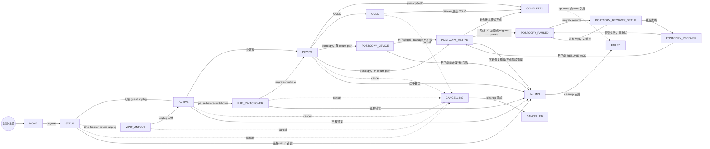
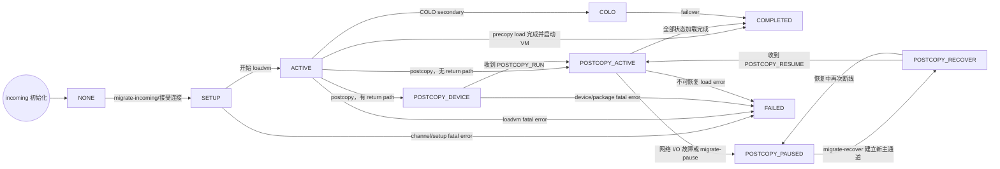

```c
typedef enum MigrationStatus {
    MIGRATION_STATUS_NONE,
    MIGRATION_STATUS_SETUP,
    MIGRATION_STATUS_CANCELLING,
    MIGRATION_STATUS_CANCELLED,
    MIGRATION_STATUS_ACTIVE,
    MIGRATION_STATUS_POSTCOPY_DEVICE,
    MIGRATION_STATUS_POSTCOPY_ACTIVE,
    MIGRATION_STATUS_POSTCOPY_PAUSED,
    MIGRATION_STATUS_POSTCOPY_RECOVER_SETUP,
    MIGRATION_STATUS_POSTCOPY_RECOVER,
    MIGRATION_STATUS_COMPLETED,
    MIGRATION_STATUS_FAILING,
    MIGRATION_STATUS_FAILED,
    MIGRATION_STATUS_COLO,
    MIGRATION_STATUS_PRE_SWITCHOVER,
    MIGRATION_STATUS_DEVICE,
    MIGRATION_STATUS_WAIT_UNPLUG,
    MIGRATION_STATUS__MAX,
} MigrationStatus;
```

## 3. 源端状态转换图



图中虚线是控制面或罕见例外路径。普通 `migrate-cancel` 在任何 postcopy 状态都会
被拒绝，因为目的端一旦开始运行，源端已不能保证拥有可恢复的完整状态。

### 3.1 正常 precopy 主路径

不开启 switchover pause：

```text
NONE -> SETUP -> [WAIT_UNPLUG ->] ACTIVE -> DEVICE -> COMPLETED
```

开启 `pause-before-switchover`：

```text
NONE -> SETUP -> [WAIT_UNPLUG ->] ACTIVE
     -> PRE_SWITCHOVER -> DEVICE -> COMPLETED
```

`DEVICE` 是最终 device serialization/switchover 阶段。当前版本每次正常迁移都
会经过它；它不再只属于启用 `pause-before-switchover` 的路径。

### 3.2 正常 postcopy 主路径

```text
... -> ACTIVE -> [PRE_SWITCHOVER ->] DEVICE
    -> POSTCOPY_DEVICE -> POSTCOPY_ACTIVE -> COMPLETED
```

若没有 return path，则无法等待目的端确认 device package 已加载，源端会跳过
`POSTCOPY_DEVICE`，从 `DEVICE` 直接进入 `POSTCOPY_ACTIVE`。

`POSTCOPY_DEVICE` 的安全含义很重要：目的端尚未运行 guest。如果此时失败，源端
仍可重新激活 block device 并恢复 VM；进入 `POSTCOPY_ACTIVE` 后则不再有这个
保证。

### 3.3 postcopy 暂停与恢复

源端恢复由管理端发起，分成两个阶段：

1. `POSTCOPY_PAUSED -> POSTCOPY_RECOVER_SETUP`：接受 resume 请求并准备新连接。
2. `POSTCOPY_RECOVER_SETUP -> POSTCOPY_RECOVER`：新 channel 已建立，原迁移线程被唤醒并执行 bitmap/page-request 同步。
3. `POSTCOPY_RECOVER -> POSTCOPY_ACTIVE`：收到目的端 `RESUME_ACK`。

在 setup 或 handshake 中再次失败时回到 `POSTCOPY_PAUSED`，保留重试机会，而
不是进入 `FAILED`。启用 `release-ram` 时源端已释放部分页面，恢复请求会被拒绝。

### 3.4 cancel 与 fail 为什么有两段状态

两条终止路径都是异步的：

```text
running -> CANCELLING -> CANCELLED
running -> FAILING    -> FAILED
```

- `CANCELLING` 表示管理端已经要求取消，线程、channel、return path 和设备回滚
  还在清理；最终是 `CANCELLED`。
- `FAILING` 表示错误已经确定，失败 notifier、源 VM 恢复、block reactivation
  和线程回收还在进行；最终是 `FAILED`。

在 QEMU 11.0 引入 `FAILING` 前，不少错误路径过早暴露 `FAILED`，管理端可能在
资源真正清理完之前启动下一项操作。新的中间态让“错误已知”和“清理完成”分离。

## 4. 目的端状态转换图



目的端的特点：

- 通常不使用 `PRE_SWITCHOVER`、`DEVICE`、`WAIT_UNPLUG`。
- incoming migration 没有与源端对称的普通 cancel 状态链。
- `POSTCOPY_RECOVER_SETUP` 是源端连接准备状态；目的端从 `POSTCOPY_PAUSED`
  直接进入 `POSTCOPY_RECOVER`。
- 多数 fatal load/channel error 直接进入 `FAILED`，不经过源端的
  `FAILING -> FAILED` 清理链。

## 5. 每个状态逐项解释

| 状态                     | 常见端     | 含义与主要出口                                                                                                                           |
| ------------------------ | ---------- | ---------------------------------------------------------------------------------------------------------------------------------------- |
| `NONE`                   | 两端       | 当前对象没有进行中的迁移。新一轮 outgoing 会先重置为它，再进入 `SETUP`。                                                                 |
| `SETUP`                  | 两端       | URI/channel、multifd、return path、savevm/loadvm 等初始化中。源端去 `ACTIVE`、`CANCELLING` 或 `FAILING`；目的端去 `ACTIVE` 或 `FAILED`。 |
| `CANCELLING`             | 主要是源端 | 已收到 cancel，正在 shutdown channel、停止线程和恢复资源；清理完成转 `CANCELLED`。                                                       |
| `CANCELLED`              | 主要是源端 | 本次迁移被用户取消且清理完成，是该次尝试的终态。                                                                                         |
| `ACTIVE`                 | 两端       | precopy 迭代或普通 save/load 正在进行。它不是“guest 必然在运行”的严格同义词。                                                            |
| `POSTCOPY_DEVICE`        | 两端       | 已承诺 postcopy，但目的端尚在加载 device package，guest 尚未在目的端运行。确认后转 `POSTCOPY_ACTIVE`。                                   |
| `POSTCOPY_ACTIVE`        | 两端       | guest 已在目的端运行，缺失 RAM 通过 fault request 获取。完成、暂停或失败。                                                               |
| `POSTCOPY_PAUSED`        | 两端       | postcopy channel 中断或用户执行 `migrate-pause`，等待重连；不是终态。                                                                    |
| `POSTCOPY_RECOVER_SETUP` | 源端       | 已接受 resume，正在建立 replacement channel；成功到 `POSTCOPY_RECOVER`，失败回 `POSTCOPY_PAUSED`。                                       |
| `POSTCOPY_RECOVER`       | 两端       | replacement channel 已建立，双方正在同步并握手；成功回 `POSTCOPY_ACTIVE`，失败回 `POSTCOPY_PAUSED`。                                     |
| `COMPLETED`              | 两端       | 本轮正常迁移完成；COLO failover 也会进入它。极少数 CPR exec 后续错误可再改为 `FAILED`。                                                  |
| `FAILING`                | 源端       | 已发生不可恢复错误，但清理尚未完成；完成后到 `FAILED`。                                                                                  |
| `FAILED`                 | 两端       | 本轮迁移失败并已到可报告的失败状态。源端通常由 `FAILING` 到达；目的端常直接到达。                                                        |
| `COLO`                   | 两端       | primary/secondary 正在持续 checkpoint，而非普通的一次性迁移完成。failover 后到 `COMPLETED`。                                             |
| `PRE_SWITCHOVER`         | 源端       | capability 要求的人工暂停点，等待 `migrate-continue` 或 cancel。                                                                         |
| `DEVICE`                 | 源端       | VM switchover 和最终 device serialization 阶段；之后进入 precopy 完成、postcopy 或 COLO。                                                |
| `WAIT_UNPLUG`            | 源端       | 等待 virtio-net-failover 等设备完成 guest unplug；完成后回到原计划的 `ACTIVE`。                                                          |
| `_MAX`                   | C 内部     | 数组和范围检查的哨兵，不是运行状态，也不是合法 QMP 状态字符串。                                                                          |

## 8. 状态与 QMP 操作的关系

| QMP 操作                     | 合法前提                                          | 直接或间接状态效果                                 |
| ---------------------------- | ------------------------------------------------- | -------------------------------------------------- |
| `migrate`                    | 没有正在运行的迁移                                | `NONE -> SETUP`                                    |
| `migrate-incoming`           | incoming 为 `NONE`                                | 新 incoming migration 进入 `SETUP`                 |
| `migrate-start-postcopy`     | 已启用 postcopy，迁移已开始                       | 设置请求标志；真正转换稍后由 migration thread 执行 |
| `migrate-continue`           | 参数必须等于当前暂停状态，典型为 `PRE_SWITCHOVER` | 唤醒等待线程，随后 `PRE_SWITCHOVER -> DEVICE`      |
| `migrate-cancel`             | 非 postcopy 的 running 状态                       | `running -> CANCELLING -> CANCELLED`               |
| `migrate-pause`              | 源端或目的端处于活着的 postcopy 状态              | 通过关闭 channel 促使其进入 `POSTCOPY_PAUSED`      |
| `migrate-recover`            | 目的端为 `POSTCOPY_PAUSED`                        | 重建 incoming channel，进入 `POSTCOPY_RECOVER`     |
| `migrate` with `resume=true` | 源端为 `POSTCOPY_PAUSED`                          | `PAUSED -> RECOVER_SETUP -> RECOVER`               |

## 问题?

### DEVICE 是什么?
1. precopy 的经典路线中，那么 WAIT_UNPLUG 和 DEVICE 是什么关系?

```txt
NONE -> SETUP -> [WAIT_UNPLUG ->] ACTIVE -> DEVICE -> COMPLETED
```

 MIGRATION_STATUS_DEVICE 表示迁移已经进入 switchover（最终切换）阶段，源端正在完成设备状态及剩余状态的最终交接。

  可以把它理解为：

  > 源 VM 已停止运行，QEMU 正在打包最后的设备状态、处理剩余脏页并转移存储所有权。

  主要工作包括：

  - 停止源端 VM，进入 RUN_STATE_FINISH_MIGRATE。
  - 查询并发送最后一批 RAM/设备待迁移数据。
  - 序列化不可迭代的设备状态，如 CPU、中断控制器、virtio、VFIO 等。
  - 停用源端 block devices，避免源端和目的端同时持有存储锁。
  - 完成最终 migration stream。
  - 根据迁移模式决定下一状态。

### PRE_SWITCHOVER ?

MIGRATION_STATUS_PRE_SWITCHOVER 表示：

> 源 VM 已暂停，但最终设备状态序列化和存储所有权切换尚未开始；QEMU正在等待管理端确认继续。

只有启用 pause-before-switchover capability 才会进入这个状态：

ACTIVE
   |
   | 停止源 VM
   v
PRE_SWITCHOVER
   |
   | migrate-continue
   v
DEVICE
   |
   v
COMPLETED / POSTCOPY_ACTIVE / COLO

此时通常满足：

- 源 VM 已停止执行 vCPU。
- 最终 device state 尚未序列化。
- 源端 block backend 尚未执行 migration_block_inactivate()，通常仍持有存储锁。
- 迁移线程等待管理端执行 migrate-continue。
- 仍可执行 migrate-cancel，让源 VM恢复运行。

继续迁移的 QMP 命令是：

```txt
{
  "execute": "migrate-continue",
  "arguments": {
    "state": "pre-switchover"
  }
}
```

它的主要价值是为外部编排提供一个确定的协调点，例如：

- 确认目的端网络、存储和设备已经准备好。
- 完成外部 fencing 或网络切换准备。
- 在真正交出存储锁之前执行最后检查。
- 条件不满足时安全取消迁移。

与 DEVICE 的区别：

 状态              含义
━━━━━━━━━━━━━━━━  ━━━━━━━━━━━━━━━━━━━━━━━━━━━━━━━━━━━━━━━━━━━━━━━━
 PRE_SWITCHOVER    源 VM 已暂停，等待管理端批准最终切换
────────────────  ────────────────────────────────────────────────
 DEVICE            批准完成，正在序列化最终设备状态并执行存储切换

如果不启用该 capability：

ACTIVE -> DEVICE

如果启用：

ACTIVE -> PRE_SWITCHOVER -> DEVICE

最大的代价是：PRE_SWITCHOVER 已处于 guest downtime。管理端等待越久，业务中断时间越长。因此它适合自动化编排，不适合长时间人工停留。

核心实现位于 migration/migration.c:2769 的 migration_switchover_prepare()。


### 和 notification 机制放到一起是如何分析的

```c
typedef enum PrecopyNotifyReason {
    PRECOPY_NOTIFY_SETUP = 0,
    PRECOPY_NOTIFY_BEFORE_BITMAP_SYNC = 1,
    PRECOPY_NOTIFY_AFTER_BITMAP_SYNC = 2,
    PRECOPY_NOTIFY_COMPLETE = 3,
    PRECOPY_NOTIFY_CLEANUP = 4,
    PRECOPY_NOTIFY_MAX = 5,
} PrecopyNotifyReason;
```

### 这就是全部的命令吗发?

是如何影响状态变化的

migrate                 migrate_cancel          migrate_continue
migrate_incoming        migrate_pause           migrate_recover
migrate_set_capability  migrate_set_parameter   migrate_start_postcopy

### 常规流程:

- src 端:
```txt
[martins3:migrate_set_state:1865] none -> setup
[martins3:migrate_set_state:1865] setup -> active
[martins3:migrate_set_state:1865] active -> completed
```
- target 端
```txt
[martins3:migrate_set_state:1865] none -> active
[martins3:migrate_set_state:1865] active -> completed
```

<script src="https://giscus.app/client.js"
        data-repo="martins3/martins3.github.io"
        data-repo-id="MDEwOlJlcG9zaXRvcnkyOTc4MjA0MDg="
        data-category="Show and tell"
        data-category-id="MDE4OkRpc2N1c3Npb25DYXRlZ29yeTMyMDMzNjY4"
        data-mapping="pathname"
        data-reactions-enabled="1"
        data-emit-metadata="0"
        data-theme="light"
        data-lang="zh-CN"
        crossorigin="anonymous"
        async>
</script>

本站所有文章转发 **CSDN** 将按侵权追究法律责任，其它情况随意。
