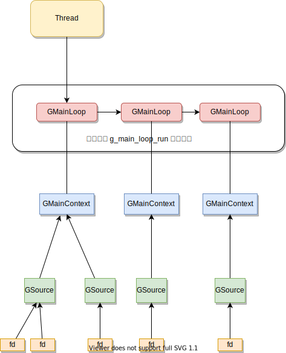

## Event Loop in glib
大致结构如下:
<p align="center">
  
</p>

- 一个 thread 通过 g_main_loop_run 来执行一个 GMainLoop，一个 thread 可以持有多个 GMainLoop 的，但是一次只能执行一个.
- 一个 GMainLoop 关联一个 GMainContext
- 一个 GMainContext 可以关联多个 GSource 的
- 一个 GSource 可以关联多个需要被监听的 fd

在 QEMU 的 tests/unit 中存在很多单元测试，也是可以辅助理解各种源代码的。

基本的 API :
- `g_main_context_new`
- `g_main_context_prepare`
- `g_main_context_query`
- `g_main_context_dispatch`


### gmain / gdbus / threaded-ml

对于双核配置，使用 gdb 的 `info thread`
```txt
  Id   Target Id                                             Frame
* 1    Thread 0x7fffeb1d4300 (LWP 1389363) "qemu-system-x86" 0x00007ffff61a6bf6 in __ppoll (fds=0x555556ad10f0, nfds=8, timeout=<optimized out>, timeout@entry=0x7fffffffd2c0, sigmask=sigmask@entry=0x0) at ../sysdeps/unix/sysv/linux/ppoll.c:44
  2    Thread 0x7fffeb073700 (LWP 1389367) "qemu-system-x86" syscall () at ../sysdeps/unix/sysv/linux/x86_64/syscall.S:38
  3    Thread 0x7fffea5fb700 (LWP 1389373) "gmain"           0x00007ffff61a6aff in __GI___poll (fds=0x5555569c41e0, nfds=1, timeout=-1) at ../sysdeps/unix/sysv/linux/poll.c:29
  4    Thread 0x7fffe9dfa700 (LWP 1389374) "gdbus"           0x00007ffff61a6aff in __GI___poll (fds=0x5555569cfe40, nfds=2, timeout=-1) at ../sysdeps/unix/sysv/linux/poll.c:29
  5    Thread 0x7fffe93f6700 (LWP 1389377) "qemu-system-x86" 0x00007ffff61a6bf6 in __ppoll (fds=0x7fffd4001ff0, nfds=1, timeout=<optimized out>, timeout@entry=0x0, sigmask=sigmask@entry=0x0) at ../sysdeps/unix/sysv/linux/ppoll.c:44
  6    Thread 0x7fffe8af4700 (LWP 1389378) "qemu-system-x86" 0x00007ffff6296618 in futex_abstimed_wait_cancelable (private=0, abstime=0x7fffe8af0220, clockid=0, expected=0, futex_word=0x555556730c78) at ../sysdeps/nptl/futex-internal.h:320
  7    Thread 0x7ffe51dff700 (LWP 1389381) "qemu-system-x86" 0x00007ffff61a850b in ioctl () at ../sysdeps/unix/syscall-template.S:78
  8    Thread 0x7ffe515fe700 (LWP 1389382) "qemu-system-x86" 0x00007ffff61a850b in ioctl () at ../sysdeps/unix/syscall-template.S:78
  9    Thread 0x7ffe48e29700 (LWP 1389385) "threaded-ml"     0x00007ffff61a6aff in __GI___poll (fds=0x7ffe38007170, nfds=3, timeout=-1) at ../sysdeps/unix/sysv/linux/poll.c:29
  10   Thread 0x7ffe29ddd700 (LWP 1389387) "qemu-system-x86" 0x00007ffff6296618 in futex_abstimed_wait_cancelable (private=0, abstime=0x7ffe29dd9220, clockid=0, expected=0, futex_word=0x555556730c78) at ../sysdeps/nptl/futex-internal.h:320
```

gmain 和 gdbus 类似，只是从 `early_gtk_display_init` 开始，然后经过层层的在 gtk 库函数的调用

所以，现在可以基本确定一个事情，那就是这几个与众不同的 thread 是 gtk 处理图形界面和音频创建的出来的。
这些东西的处理都是被 glib 库封装好了，之后没有必要关注了。

通过 `thread ${pid_num}` 和 `backtrace` 可以获取这几个 thread 的内部的执行流程。

比如 threaded-ml 的，gmain 和 gdbus 和这个类似，不列举了。
总之就是这些线程会调用到 poll 系统调用上, 来监听一些事情。
- clone
  - start_thread
    - pa_mainloop_run
      - pa_mainloop_iterate
        - pa_mainloop_poll
          - __GI___poll

这几个 thread 不是通过 `qemu_thread_create` 创建的，使用 gdb 在 `clone` 地方打断点，然后逐个 `backtrace` 可以看到所有的 thread 是如何创建的。
下面是 threaded-ml 的创建的过程:

- main
  - qemu_main_loop
    - main_loop_wait
      - os_host_main_loop_wait
        - glib_pollfds_poll
          - g_main_context_dispatch
            - ca_gtk_play_for_widget
              - ca_context_play_full
                - pulse_driver_open
                  - pa_threaded_mainloop_start
                    - pa_thread_new
                      - `__pthread_create_2_1`
                        - create_thread
                          - clone

### 辅助
https://github.com/chiehmin/gdbus_test

<script src="https://giscus.app/client.js"
        data-repo="martins3/martins3.github.io"
        data-repo-id="MDEwOlJlcG9zaXRvcnkyOTc4MjA0MDg="
        data-category="Show and tell"
        data-category-id="MDE4OkRpc2N1c3Npb25DYXRlZ29yeTMyMDMzNjY4"
        data-mapping="pathname"
        data-reactions-enabled="1"
        data-emit-metadata="0"
        data-theme="light"
        data-lang="zh-CN"
        crossorigin="anonymous"
        async>
</script>

本站所有文章转发 **CSDN** 将按侵权追究法律责任，其它情况随意。
