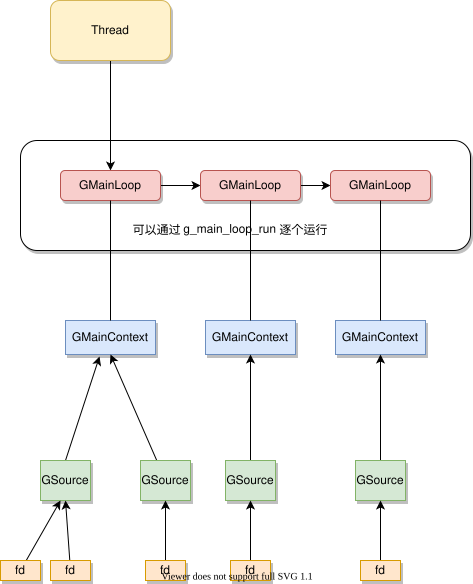

## qemu 中的 glib event loop

<!-- a776caca-53b4-4b72-b4b1-c9ea723321e7 -->
大致结构如下:
<p align="center">
  
</p>

- 一个 thread 通过 g_main_loop_run 来执行一个 GMainLoop，一个 thread 可以持有多个 GMainLoop 的，但是一次只能执行一个.
- 一个 GMainLoop 关联一个 GMainContext
- 一个 GMainContext 可以关联多个 GSource 的
- 一个 GSource 可以关联多个需要被监听的 fd

在 QEMU 的 tests/unit 中存在很多单元测试，也是可以辅助理解各种源代码的。

基本的 API :
- `g_main_context_new`
- `g_main_context_prepare`
- `g_main_context_query`
- `g_main_context_dispatch`


### gmain / gdbus / threaded-ml

对于双核配置，使用 gdb 的 `info thread`
```txt
  Id   Target Id                                             Frame
* 1    Thread 0x7fffeb1d4300 (LWP 1389363) "qemu-system-x86" 0x00007ffff61a6bf6 in __ppoll (fds=0x555556ad10f0, nfds=8, timeout=<optimized out>, timeout@entry=0x7fffffffd2c0, sigmask=sigmask@entry=0x0) at ../sysdeps/unix/sysv/linux/ppoll.c:44
  2    Thread 0x7fffeb073700 (LWP 1389367) "qemu-system-x86" syscall () at ../sysdeps/unix/sysv/linux/x86_64/syscall.S:38
  3    Thread 0x7fffea5fb700 (LWP 1389373) "gmain"           0x00007ffff61a6aff in __GI___poll (fds=0x5555569c41e0, nfds=1, timeout=-1) at ../sysdeps/unix/sysv/linux/poll.c:29
  4    Thread 0x7fffe9dfa700 (LWP 1389374) "gdbus"           0x00007ffff61a6aff in __GI___poll (fds=0x5555569cfe40, nfds=2, timeout=-1) at ../sysdeps/unix/sysv/linux/poll.c:29
  5    Thread 0x7fffe93f6700 (LWP 1389377) "qemu-system-x86" 0x00007ffff61a6bf6 in __ppoll (fds=0x7fffd4001ff0, nfds=1, timeout=<optimized out>, timeout@entry=0x0, sigmask=sigmask@entry=0x0) at ../sysdeps/unix/sysv/linux/ppoll.c:44
  6    Thread 0x7fffe8af4700 (LWP 1389378) "qemu-system-x86" 0x00007ffff6296618 in futex_abstimed_wait_cancelable (private=0, abstime=0x7fffe8af0220, clockid=0, expected=0, futex_word=0x555556730c78) at ../sysdeps/nptl/futex-internal.h:320
  7    Thread 0x7ffe51dff700 (LWP 1389381) "qemu-system-x86" 0x00007ffff61a850b in ioctl () at ../sysdeps/unix/syscall-template.S:78
  8    Thread 0x7ffe515fe700 (LWP 1389382) "qemu-system-x86" 0x00007ffff61a850b in ioctl () at ../sysdeps/unix/syscall-template.S:78
  9    Thread 0x7ffe48e29700 (LWP 1389385) "threaded-ml"     0x00007ffff61a6aff in __GI___poll (fds=0x7ffe38007170, nfds=3, timeout=-1) at ../sysdeps/unix/sysv/linux/poll.c:29
  10   Thread 0x7ffe29ddd700 (LWP 1389387) "qemu-system-x86" 0x00007ffff6296618 in futex_abstimed_wait_cancelable (private=0, abstime=0x7ffe29dd9220, clockid=0, expected=0, futex_word=0x555556730c78) at ../sysdeps/nptl/futex-internal.h:320
```

gmain 和 gdbus 类似，只是从 `early_gtk_display_init` 开始，然后经过层层的在 gtk 库函数的调用

所以，现在可以基本确定一个事情，那就是这几个与众不同的 thread 是 gtk 处理图形界面和音频创建的出来的。
这些东西的处理都是被 glib 库封装好了，之后没有必要关注了。

通过 `thread ${pid_num}` 和 `backtrace` 可以获取这几个 thread 的内部的执行流程。

比如 threaded-ml 的，gmain 和 gdbus 和这个类似，不列举了。
总之就是这些线程会调用到 poll 系统调用上, 来监听一些事情。
- clone
  - start_thread
    - pa_mainloop_run
      - pa_mainloop_iterate
        - pa_mainloop_poll
          - __GI___poll

这几个 thread 不是通过 `qemu_thread_create` 创建的，使用 gdb 在 `clone` 地方打断点，然后逐个 `backtrace` 可以看到所有的 thread 是如何创建的。
下面是 threaded-ml 的创建的过程:

- main
  - qemu_main_loop
    - main_loop_wait
      - os_host_main_loop_wait
        - glib_pollfds_poll
          - g_main_context_dispatch
            - ca_gtk_play_for_widget
              - ca_context_play_full
                - pulse_driver_open
                  - pa_threaded_mainloop_start
                    - pa_thread_new
                      - `__pthread_create_2_1`
                        - create_thread
                          - clone

## 为什么 AioContext 和 Glib 看上去像是重叠的
表面看，QEMU 同时存在：

  GLib GMainContext/GSource
  QEMU AioContext/aio_poll

  两者都能监听 fd、计算 timeout、执行 callback，确实高度重叠。

  但关键是：

  > QEMU 不是维护了两份异步事件；同一个 AioContext 可以被两种方式驱动：直接
  > aio_poll()，或者作为一个 GSource 被 GLib 驱动。

### AioContext 本身就是 GSource

结构体第一个字段就是：

```txt
struct AioContext {
    GSource source;

    AioHandlerList aio_handlers;
    BHList bh_list;
    EventNotifier notifier;
    TimerListGroup tlg;
    ...
};
```

QEMU 给这个 GSource 实现了标准 GLib 接口：

```c
static GSourceFuncs aio_source_funcs = {
    .prepare  = aio_ctx_prepare,
    .check    = aio_ctx_check,
    .dispatch = aio_ctx_dispatch,
    .finalize = aio_ctx_finalize,
};
```

所以 GLib 能把整个 AioContext 当作一个普通 GSource。

### 两条驱动路径，共享同一份状态

假设：

aio_set_fd_handler(ctx, fd, read_cb, ...);
qemu_bh_schedule(bh);

这些事件只保存在一份数据结构中：

ctx->aio_handlers
ctx->bh_list
ctx->tlg

然后可以选择两种方式处理。

#### 路径一：直接驱动

IOThread
    |
aio_poll(ctx, true)
    |
fdmon_ops->wait()
    |
aio_bh_poll()
    |
aio_dispatch_ready_handlers()

这是 QEMU 自己控制的一次完整事件循环。

#### 路径二：由 GLib 驱动

GMainContext
    |
aio_ctx_prepare()
    |
GLib/QEMU poll
    |
aio_ctx_check()
    |
aio_ctx_dispatch()
    |
aio_dispatch(ctx)
    |
aio_bh_poll()
aio_dispatch_ready_handlers()

aio_ctx_dispatch() 最后也是调用 QEMU 的 aio_dispatch()：

```c
static gboolean aio_ctx_dispatch(GSource *source, ...)
{
    AioContext *ctx = (AioContext *)source;

    aio_dispatch(ctx);
    return true;
}
```

所以：

```txt
                    同一个 AioContext
                           |
             +-------------+-------------+
             |                           |
      aio_poll(ctx)              GMainContext dispatch
             |                           |
             +-------------+-------------+
                           |
               同一份 fd/BH/timer callback
```

这不是两个独立 async 系统互相传递事件，更像是同一个发动机有两个入口。

### GLib 在主线程中做什么

QEMU 主线程除了 block/device AIO，还可能要处理很多使用 GLib API 的组件：

- GIO；
- chardev；
- DBus；
- GTK/UI；
- 各种第三方库创建的 GSource；
- GLib idle/timeout source；
- QEMU自己的 AioContext。

因此默认 GMainContext 像一个“事件源聚合器”：

default GMainContext
    ├── qemu_aio_context.source
    ├── iohandler_ctx.source
    ├── GIO sources
    ├── DBus sources
    ├── GTK sources
    └── 其他 GLib sources

QEMU 初始化时，会自动的将

```c
src = aio_get_g_source(qemu_aio_context);
g_source_attach(src, NULL);

src = iohandler_get_g_source();
g_source_attach(src, NULL);
```

也就是:
```c
int qemu_init_main_loop(Error **errp)
{
    int ret;
    GSource *src;

    qemu_init_clocks(qemu_timer_notify_cb);

    ret = qemu_signal_init(errp);
    if (ret) {
        return ret;
    }

    qemu_aio_context = aio_context_new(errp);
    if (!qemu_aio_context) {
        return -EMFILE;
    }
    qemu_set_current_aio_context(qemu_aio_context);
    qemu_notify_bh = qemu_bh_new(notify_event_cb, NULL);
    gpollfds = g_array_new(FALSE, FALSE, sizeof(GPollFD));
    // 添加第一个 source
    src = aio_get_g_source(qemu_aio_context);
    g_source_set_name(src, "aio-context");
    g_source_attach(src, NULL);
    g_source_unref(src);
    // 添加第二个 source
    src = iohandler_get_g_source();
    g_source_set_name(src, "io-handler");
    g_source_attach(src, NULL);
    g_source_unref(src);
    return 0;
}
```

见 util/main-loop.c:160。

所以 GLib 的主要价值是：

> 让 QEMU AioContext 和所有 GLib 生态的事件源出现在同一个 poll 集合中。

### 主线程其实没有直接 g_main_loop_run()

这是你笔记里需要修正的一处。

在 POSIX 主线程中，QEMU没有简单地：

g_main_loop_run(default_context);

而是手动执行 GLib main-loop 的几个阶段：

g_main_context_prepare()
g_main_context_query()
        |
        | 得到 GLib 希望监听的 GPollFD[]
        v
QEMU qemu_poll_ns()
        |
g_main_context_check()
g_main_context_dispatch()

对应 util/main-loop.c:257。

完整过程大概是：

```txt
g_main_context_acquire(context);

glib_pollfds_fill(&timeout);

bql_unlock();
replay_mutex_unlock();

qemu_poll_ns(gpollfds, timeout); // 这个就是一个普通的 poll

replay_mutex_lock();
bql_lock();

glib_pollfds_poll();

g_main_context_release(context);
```

QEMU没有把主循环完全交给 GLib，是因为它还要控制：

- 在阻塞 poll 前释放 BQL；
- poll 返回后重新获取 BQL；
- record/replay 锁；
- QEMU timers；
- icount；
- QEMU自己的 timeout 合并；
- 主循环 poll notifier。

因此主线程中的职责关系是：

GLib：
    告诉 QEMU“这些 source 要监听哪些 fd、timeout 是多少”
    poll 后执行 source dispatch

QEMU：
    统一合并所有 fd 和 timeout
    控制真正的 ppoll
    控制 BQL/replay/timer 边界

GLib在这里不是最高层总管，QEMU才是。

这是 qemu 的调用的的结果，这个的意思不是用
用 io epoll 机制:

- main
  - qemu_default_main
    - qemu_main_loop
      - main_loop_wait
        - os_host_main_loop_wait
          - glib_pollfds_poll
            - g_main_context_dispatch

普通的 io 的过程:
- main
  - non_default_g_source
    - g_main_loop_run
      - g_main_context_iterate_unlocked.isra
        - g_main_context_dispatch_unlocked
          - aio_ctx_dispatch

### 为什么 IOThread 默认不用 GLib

对于纯 block data plane 的 IOThread，它通常只有：

- virtqueue ioeventfd；
- Linux AIO/io_uring completion fd；
- BH；
- timer；
- coroutine resume。

这些全部是 AioContext 原生支持的，不需要额外的 GLib source。

所以 IOThread 默认走最快路径：

while (iothread->running) {
    aio_poll(iothread->ctx, true);
}

当前源码也明确说明：

/*
 * g_main_loop_run() can cover aio_poll() events,
 * but explicit aio_poll() is faster for pure block layer IOThreads.
 */

见 iothread.c:28。

直接 aio_poll() 的好处包括：

- 少一层 GLib prepare/query/check/dispatch；
- 支持 QEMU自适应 busy polling；
- 更直接地使用 epoll/io_uring backend；
- timeout 和 ready list 都由 QEMU控制；
- 适合高频 block I/O。

所以默认：

iothread->run_gcontext = 0;

### IOThread 什么时候又需要 GLib

有些代码要放到 IOThread 中运行，但它使用的是 GLib API，需要一个
GMainContext。

QEMU 因此给每个 IOThread 也创建了一个：

```c
iothread->worker_context = g_main_context_new();

source = aio_get_g_source(iothread->ctx);
g_source_attach(source, iothread->worker_context);

iothread->main_loop =
    g_main_loop_new(iothread->worker_context, TRUE);

```
见 iothread.c:134。

当某个子系统调用：

```c
iothread_get_g_main_context(iothread);
```

QEMU会：

```c
iothread->run_gcontext = 1;
aio_notify(iothread->ctx);
```

IOThread随后切换到：

g_main_loop_run(iothread->main_loop);

由于 AioContext 本身已经作为 GSource 挂进这个 worker_context，GLib loop 可
以同时处理：

IOThread worker_context
    ├── iothread->ctx，作为 GSource
    │      ├── AioHandler
    │      ├── BH
    │      └── timer
    └── 其他 GLib GSource

也就是说：

纯 block IOThread：
    aio_poll(ctx)                  性能更好

需要 GLib 功能的 IOThread：
    g_main_loop_run(worker_ctx)    功能更多
        └── AioContext GSource

两者功能上有包含关系：

GMainContext mode
    = AioContext 功能
    + 其他 GLib GSource
    + 一些额外调度开销


### gmain、gdbus 线程又是什么

gmain
gdbus
threaded-ml

通常是 GTK、GDBus、PulseAudio等库内部创建的线程。

它们：

- 不是 QEMU IOThread；
- 不驱动 QEMU block AioContext；
- 不是 QEMU特意设计出来的第二套 I/O 线程；
- 只是外部库自己的工作线程/event loop。

它们与“QEMU在主线程中集成 GMainContext”是两个不同问题。即使 headless QEMU
没有 GTK，这套 AioContext/GSource 集成仍然存在。

### 最准确的分层方式

不要把 poll、GLib、AioContext、coroutine 都叫 async。可以按四层理解：

第一层：内核等待机制
    poll / ppoll / epoll / io_uring / eventfd

第二层：QEMU执行域
    AioContext
    决定 fd、BH、timer、callback 属于哪个线程

第三层：事件源聚合
    GMainContext
    将 AioContext和其他 GLib GSource 合并到一次等待中

第四层：异步控制流
    coroutine
    让异步 I/O 可以写成顺序调用

所以对于“为什么 QEMU 搞两个 async 机制”，我的答案是：

> 因为 QEMU既需要一个可独立运行、适合高性能 block I/O 的事件循环
> AioContext，又必须与使用 GLib 的组件共享线程和 poll。于是 QEMU让
> AioContext本身实现成 GSource：纯数据面直接 aio_poll()，需要生态集成时交
> 给 GMainContext。重叠是真实存在的，但事件队列和 callback 并没有复制两
> 份。

## 还需要理解的问题
1. glib 用什么 poll 吗?
2. 是如何添加 fd 来开始监听的?
4. 一个 context 被 glib 监听是用的

4. 很难理解啊

util/fdmon-poll.c 中，但是如果这个

只有这里才调用 poll ，但是如果这个用的不是，会如何?
```c
static void fdmon_poll_update(AioContext *ctx,
                              AioHandler *old_node,
                              AioHandler *new_node)
{
    if (old_node) {
        /*
         * If the GSource is in the process of being destroyed then
         * g_source_remove_poll() causes an assertion failure.  Skip removal in
         * that case, because glib cleans up its state during destruction
         * anyway.
         */
        if (!g_source_is_destroyed(&ctx->source)) {
            g_source_remove_poll(&ctx->source, &old_node->pfd);
        }
    }

    if (new_node) {
        g_source_add_poll(&ctx->source, &new_node->pfd);
    }
}
```

<script src="https://giscus.app/client.js"
        data-repo="martins3/martins3.github.io"
        data-repo-id="MDEwOlJlcG9zaXRvcnkyOTc4MjA0MDg="
        data-category="Show and tell"
        data-category-id="MDE4OkRpc2N1c3Npb25DYXRlZ29yeTMyMDMzNjY4"
        data-mapping="pathname"
        data-reactions-enabled="1"
        data-emit-metadata="0"
        data-theme="light"
        data-lang="zh-CN"
        crossorigin="anonymous"
        async>
</script>

本站所有文章转发 **CSDN** 将按侵权追究法律责任，其它情况随意。
