# QEMU 中的线程和事件循环

<!-- vim-markdown-toc GitLab -->

* [Thread](#thread)
  * [gmain / gdbus / threaded-ml](#gmain-gdbus-threaded-ml)
  * [worker](#worker)
  * [call_rcu](#call_rcu)
  * [QEMUBH](#qemubh)
  * [coroutine](#coroutine)
* [QEMU Event Loop](#qemu-event-loop)
  * [Event Loop in Linux](#event-loop-in-linux)
  * [Event Loop in glib](#event-loop-in-glib)
  * [AioContext](#aiocontext)
    * [FDMonOps](#fdmonops)
  * [main loop thread](#main-loop-thread)
  * [IOThread](#iothread)
    * [use IOThread](#use-iothread)
    * [IOThread internals](#iothread-internals)
* [Question](#question)

<!-- vim-markdown-toc -->
## Thread
QEMU 的执行流程大致来说是分为 io thread 和 vCPU thread 的。

<p align="center">
  
</p>

**一般来说**:
- 这个 io thread 就是指的是 main-loop.c 中 `qemu_main_loop` 执行的循环。
- vCPU 的取决于具体的 accel 是什么，`AccelOpsClass::create_vcpu_thread` 上会注册具体的 hook, 例如 kvm 注册的 kvm_start_vcpu_thread


对于双核配置，使用 gdb 的 `info thread` [^8][^9]
```plain
  Id   Target Id                                             Frame
* 1    Thread 0x7fffeb1d4300 (LWP 1389363) "qemu-system-x86" 0x00007ffff61a6bf6 in __ppoll (fds=0x555556ad10f0, nfds=8, timeout=<optimized out>, timeout@entry=0x7fffffffd2c0, sigmask=sigmask@entry=0x0) at ../sysdeps/unix/sysv/linux/ppoll.c:44
  2    Thread 0x7fffeb073700 (LWP 1389367) "qemu-system-x86" syscall () at ../sysdeps/unix/sysv/linux/x86_64/syscall.S:38
  3    Thread 0x7fffea5fb700 (LWP 1389373) "gmain"           0x00007ffff61a6aff in __GI___poll (fds=0x5555569c41e0, nfds=1, timeout=-1) at ../sysdeps/unix/sysv/linux/poll.c:29
  4    Thread 0x7fffe9dfa700 (LWP 1389374) "gdbus"           0x00007ffff61a6aff in __GI___poll (fds=0x5555569cfe40, nfds=2, timeout=-1) at ../sysdeps/unix/sysv/linux/poll.c:29
  5    Thread 0x7fffe93f6700 (LWP 1389377) "qemu-system-x86" 0x00007ffff61a6bf6 in __ppoll (fds=0x7fffd4001ff0, nfds=1, timeout=<optimized out>, timeout@entry=0x0, sigmask=sigmask@entry=0x0) at ../sysdeps/unix/sysv/linux/ppoll.c:44
  6    Thread 0x7fffe8af4700 (LWP 1389378) "qemu-system-x86" 0x00007ffff6296618 in futex_abstimed_wait_cancelable (private=0, abstime=0x7fffe8af0220, clockid=0, expected=0, futex_word=0x555556730c78) at ../sysdeps/nptl/futex-internal.h:320
  7    Thread 0x7ffe51dff700 (LWP 1389381) "qemu-system-x86" 0x00007ffff61a850b in ioctl () at ../sysdeps/unix/syscall-template.S:78
  8    Thread 0x7ffe515fe700 (LWP 1389382) "qemu-system-x86" 0x00007ffff61a850b in ioctl () at ../sysdeps/unix/syscall-template.S:78
  9    Thread 0x7ffe48e29700 (LWP 1389385) "threaded-ml"     0x00007ffff61a6aff in __GI___poll (fds=0x7ffe38007170, nfds=3, timeout=-1) at ../sysdeps/unix/sysv/linux/poll.c:29
  10   Thread 0x7ffe29ddd700 (LWP 1389387) "qemu-system-x86" 0x00007ffff6296618 in futex_abstimed_wait_cancelable (private=0, abstime=0x7ffe29dd9220, clockid=0, expected=0, futex_word=0x555556730c78) at ../sysdeps/nptl/futex-internal.h:320
```

在 `qemu_thread_create` 中添加调试语句:
```txt
call_rcu
IO io0
CPU 0/KVM
CPU 1/KVM
worker
worker
```

分析上面的内容，可以看到:
- 加上 main loop 线程，`qemu_thread_create` 创建的线程是和 `info thread` 中叫做 "qemu-system-x86" 的线程数目完全对应的。
- 两个 vCPU 分别对应一个线程
- 有一些看不懂的 gmain / gdbus / threaded-ml

下面逐个分析一下:

### gmain / gdbus / threaded-ml

通过 `thread ${pid_num}` 和 `backtrace` 可以获取这几个 thread 的内部的执行流程。

比如 threaded-ml 的，gmain 和 gdbus 和这个类似，不列举了。
总之就是这些线程会调用到 poll 系统调用上, 来监听一些事情。
```c
/*
>>> thread 8
[Switching to thread 8 (Thread 0x7ffe51629700 (LWP 1186997))]
#0  0x00007ffff61a6aff in __GI___poll (fds=0x7ffe3c007170, nfds=3, timeout=-1) at ../sysdeps/unix/sysv/linux/poll.c:29
29      ../sysdeps/unix/sysv/linux/poll.c: No such file or directory.
>>> bt
#0  0x00007ffff61a6aff in __GI___poll (fds=0x7ffe3c007170, nfds=3, timeout=-1) at ../sysdeps/unix/sysv/linux/poll.c:29
#1  0x00007ffff6df31d6 in  () at /lib/x86_64-linux-gnu/libpulse.so.0
#2  0x00007ffff6de4841 in pa_mainloop_poll () at /lib/x86_64-linux-gnu/libpulse.so.0
#3  0x00007ffff6de4ec3 in pa_mainloop_iterate () at /lib/x86_64-linux-gnu/libpulse.so.0
#4  0x00007ffff6de4f70 in pa_mainloop_run () at /lib/x86_64-linux-gnu/libpulse.so.0
#5  0x00007ffff6df311d in  () at /lib/x86_64-linux-gnu/libpulse.so.0
#6  0x00007ffff56f272c in  () at /usr/lib/x86_64-linux-gnu/pulseaudio/libpulsecommon-13.99.so
#7  0x00007ffff628c609 in start_thread (arg=<optimized out>) at pthread_create.c:477
#8  0x00007ffff61b3293 in clone () at ../sysdeps/unix/sysv/linux/x86_64/clone.S:95
```

这几个 thread 不是通过 `qemu_thread_create` 创建的，使用 gdb 在 `clone` 地方打断点，然后逐个 `backtrace` 可以看到所有的 thread 是如何创建的。
下面是 threaded-ml 的创建的过程:
```c
/*
#0  clone () at ../sysdeps/unix/sysv/linux/x86_64/clone.S:50
#1  0x00007ffff628b2ec in create_thread (pd=pd@entry=0x7ffe48e29700, attr=attr@entry=0x7fffffffcf10, stopped_start=stopped_start@entry=0x7fffffffcf0e, stackaddr=stackad
dr@entry=0x7ffe48e25400, thread_ran=thread_ran@entry=0x7fffffffcf0f) at ../sysdeps/unix/sysv/linux/createthread.c:101
#2  0x00007ffff628ce10 in __pthread_create_2_1 (newthread=<optimized out>, attr=<optimized out>, start_routine=<optimized out>, arg=<optimized out>) at pthread_create.c
:817
#3  0x00007ffff56f3eb4 in pa_thread_new () at /usr/lib/x86_64-linux-gnu/pulseaudio/libpulsecommon-13.99.so
#4  0x00007ffff6dc639b in pa_threaded_mainloop_start () at /lib/x86_64-linux-gnu/libpulse.so.0
#5  0x00007ffe51226e33 in pulse_driver_open () at /usr/lib/x86_64-linux-gnu/libcanberra-0.30/libcanberra-pulse.so
#6  0x00007fffe957219b in  () at /lib/x86_64-linux-gnu/libcanberra.so.0
#7  0x00007fffe9569538 in  () at /lib/x86_64-linux-gnu/libcanberra.so.0
#8  0x00007fffe956a1ef in ca_context_play_full () at /lib/x86_64-linux-gnu/libcanberra.so.0
#9  0x00007ffff7fb5648 in ca_gtk_play_for_widget () at /lib/x86_64-linux-gnu/libcanberra-gtk3.so.0
#10 0x00007ffff7fbcc6e in  () at /usr/lib/x86_64-linux-gnu/gtk-3.0/modules/libcanberra-gtk-module.so
#11 0x00007ffff6fa0f4d in  () at /lib/x86_64-linux-gnu/libgdk-3.so.0
#12 0x00007ffff787a04e in g_main_context_dispatch () at /lib/x86_64-linux-gnu/libglib-2.0.so.0
#13 0x0000555555e6d1a8 in glib_pollfds_poll () at ../util/main-loop.c:232
#14 os_host_main_loop_wait (timeout=<optimized out>) at ../util/main-loop.c:255
#15 main_loop_wait (nonblocking=nonblocking@entry=0) at ../util/main-loop.c:531
#16 0x0000555555c190d1 in qemu_main_loop () at ../softmmu/runstate.c:726
#17 0x0000555555940ab2 in main (argc=<optimized out>, argv=<optimized out>, envp=<optimized out>) at ../softmmu/main.c:50
```

gmain 和 gdbus 类似，只是从 `early_gtk_display_init` 开始，然后经过层层的在 gtk 库函数的调用

所以，现在可以基本确定一个事情，那就是这几个与众不同的 thread 是 gtk 处理图形界面和音频创建的出来的。
这些东西的处理都是被 glib 库封装好了，之后没有必要关注了。

### worker
总体来说，worker pool 的设计比较简单的，整个 thread-pool.c 也就是只有 300 行左右, 这个主要关联的两个结构体:

```c
struct ThreadPool {
    QemuSemaphore sem; // 工作线程idle时休眠的信号量

    /* The following variables are protected by lock.  */
    QTAILQ_HEAD(, ThreadPoolElement) request_list;
};

struct ThreadPoolElement {
    ThreadPool *pool;      // 所属线程池
    ThreadPoolFunc *func;  // 要在线程池中完成的工作
    void *arg;             // 线程池中完成的工作的参数

    /* Access to this list is protected by lock.  */
    QTAILQ_ENTRY(ThreadPoolElement) reqs; // 通过这个将自己放到 ThreadPool::request_list 上
};
```

- thread_pool_submit_aio : 将任务提交给 thread pool，如果 pool 中没有 idle thread，会调用 spawn_thread 来创建
- worker_thread 和核心执行流程，在 thread_pool_submit_aio 中 qemu_sem_post(ThreadPool::sem) 会让 worker_thread 从这个 lock 上醒过来
然后会从 ThreadPool::request_list 中获取需要执行的函数，最后使用 `qemu_bh_schedule(pool->completion_bh)` 通知这个任务结束了

- 在 worker_thread 中，qemu_sem_timedwait(ThreadPool::sem) 最多只会等待 10s 如果没有任务过来，那么这个 thread 结束。

### call_rcu
RCU 在 Linux 内核中设计的非常的巧妙，当然也非常的复杂和难以掌握。
LWN 提供了[一系列的文章](https://lwn.net/Kernel/Index/#Read-copy-update) 来分析解释内核中 RCU 的设计。
其中 [What is RCU, Fundamentally?](https://lwn.net/Articles/262464/) 中的
Example 1: Maintaining Multiple Versions During Deletion 和 Example 2: Maintaining Multiple Versions During Replacement
用于理解 RCU 的原理算是相当的生动形象了。

虽然原理相同，QEMU 中的 RCU[^3][^4][^5] 设计的更加简单和容易理解。

下面的分析使用 RAMList::dirty_memory 作为一个分析的例子:

```c
typedef struct RAMList {
    // ...
    DirtyMemoryBlocks *dirty_memory[DIRTY_MEMORY_NUM];
    // ...
}
```
从 writer 的角度分析，做了两件事情
- 让 RAMList::dirty_memory 存储新的 DirtyMemoryBlocks 地址
- 释放老的 DirtyMemoryBlocks

```c
static void dirty_memory_extend(ram_addr_t old_ram_size,
                                ram_addr_t new_ram_size){
        new_blocks = g_malloc(sizeof(*new_blocks) +
                              sizeof(new_blocks->blocks[0]) * new_num_blocks);
        qatomic_rcu_set(&ram_list.dirty_memory[i], new_blocks);

        g_free_rcu(old_blocks, rcu);
}
```
- 如果一个 reader 从 RAMList::dirty_memory 中获取的就是新的 DirtyMemoryBlocks 地址，之后一切访问正常。
- 如果一个 reader 在更新 RAMList::dirty_memory 之前访问，获取的是旧的的 DirtyMemoryBlocks，现在是不能立刻将其释放掉的。需要等待 reader 都结束了才可以释放。
- 无论上面的哪一个情况，reader 通过 RAMList::dirty_memory 获取的 DirtyMemoryBlocks 总是 atomic 状态的，而不是一部分修改了，一部分没有修改，这是正确性的保证。
- g_free_rcu 是对于 call_rcu1 的简单包装，将需要调用释放函数推迟操作。

```c
void call_rcu1(struct rcu_head *node, void (*func)(struct rcu_head *node))
{
    node->func = func;
    enqueue(node);
    qatomic_inc(&rcu_call_count);
    qemu_event_set(&rcu_call_ready_event);
}
```
推迟的时间当然是等待所有的 reader 都结束才可以。

再看 reader 这一侧，使用 cpu_physical_memory_get_dirty 作为例子:

```c
static inline bool cpu_physical_memory_get_dirty(ram_addr_t start,
                                                 ram_addr_t length,
                                                 unsigned client)
{
    WITH_RCU_READ_LOCK_GUARD() {
      // 访问
    }
    return dirty;
}
```

WITH_RCU_READ_LOCK_GUARD 会展开为:

```txt
- rcu_read_auto_lock
  - rcu_read_lock
    - `rcu_reader->ctr = rcu_gp_ctr->ctr` : 在进入的时候同步 global 的 ctr 到本地，这样如果 global 的发生变动了，那么就可以检测出来

// 中间进行访问

- rcu_read_auto_unlock
  - rcu_read_unlock
    - 如果检测到 rcu_reader::waiting 的话，`qemu_event_set(&rcu_gp_event);`，通知 call_rcu thread 有 reader 结束了
```

先总结一下关联到几个主要结构体:

| 名称                 | 作用                                                                               |
|----------------------|------------------------------------------------------------------------------------|
| rcu_gp_ctr           | 全局变量，用于标记当前的 period                                                    |
| rcu_reader           | 每一个线程的局部变量，当 reader 进入 critical reagion 的时候，会和 rcu_gp_ctr 同步 |
| rcu_call_ready_event | 在 call_rcu1 中用于通知 `call_rcu` thread 有垃圾可以回收了                         |
| rcu_gp_event         | 在 rcu_read_unlock 中用于通知 `call_rcu` thread 有 reader 结束了                   |

reader 和 writer 都是和 call_rcu thread 来交互的:

- call_rcu_thread : 一个死循环用户回收
  - 第一个 while 循环: 需要等待 writer 调用 call_rcu1 才可以, 然后等待一段时间
  - synchronize_rcu
    - 修改 rcu_gp_ctr, 表示进入回收的 period 了，如果一些 reader 正好在 critical region 中，那么因为 `rcu_reader->ctr` 和 `rcu_gp_ctr->ctr` 不相等而可以识别出来
    - wait_for_readers
      1. `static ThreadList registry = QLIST_HEAD_INITIALIZER(registry);` : 在 rcu_register_thread 的时候，将 thread local 的 rcu_reader 挂到上面去
      2. 对于 register 上挂载的 rcu_reader 调用 rcu_gp_ongoing 查询 local 的 `rcu_reader->ctr` 和 global 的 `rcu_gp_ctr->ctr` 是否存在差别，如果有，那么设置 rcu_reader_data::waiting 为 true, 如果版本相同，那么从 registry 中移除掉
      3. QLIST_EMPTY(&registry) : 这表示所有的 reader 都离开 critical region 了
  - try_dequeue && `node->func(node)` : 从队列中间取出需要执行的函数来, 这些执行函数就是进行垃圾回收

### QEMUBH
将一个函数挂到队列上，之后从队列上取出函数(也许是另一个 thread) 来执行。
```c
struct QEMUBH {
    AioContext *ctx;
    const char *name;
    QEMUBHFunc *cb;
    void *opaque;
    QSLIST_ENTRY(QEMUBH) next;
    unsigned flags;
};
```
和 coroutine 的差别在于，coroutine 是有自己的 stack 的。

QEMU 默认使用 eventfd 来进行通知(参考 : event_notifier_init)，
eventfd 正如其名，不像 socket fd 或者 file fd 之类可以访问网络或者文件系统，
这个就是纯粹地用于通知。

而且 aio_set_event_notifier 之后会调用的 g_source_add_poll 的,
将 AioContext::notifier 作为一个普通的 fd 来监控。

aio_context_new 中:
```c
aio_set_event_notifier(ctx, &ctx->notifier, false,
                       aio_context_notifier_cb,
                       aio_context_notifier_poll);
```

- 提交任务 : `qemu_bh_schedule`
  - 通知认为已经提交了: `aio_notify` => `event_notifier_set(&ctx->notifier)` => 一个简单的 write 操作
- 轮询: `aio_poll` => `aio_bh_poll` => `aio_bh_call`

### coroutine
在 QEMU 中 coroutine 的实现原理和其他的 coroutine 没有区别，
1. `qemu_coroutine_enter` 开始执行一个 coroutine
2. aio_co_enter
  - 如果 aio_co_enter 加入的 AioContext 不是当前线程的，那么加入到该 AioContext
  - 如果是递归的 aio_co_enter，那么挂载到 list 上
  - 否则可以直接执行了
3. 如果 coroutine 执行了 qemu_coroutine_yield 之后，那么 qemu_coroutine_enter 就可以返回了

其具体实现接口可以参考 https://www.cnblogs.com/VincentXu/p/3350389.html

Stefan Hajnoczi 说 QEMU 中需要 coroutine 是为了避免 callback hell[^2]

coroutine 的接口是建立在 BH 上的
- 提交任务 : `qemu_bh_schedule(ctx->co_schedule_bh)`
- 执行任务 : 当 aio_poll 的时候，会执行 `ctx->co_schedule_bh` 上的 hook, 也即是 co_schedule_bh_cb, 在其中调用 qemu_aio_coroutine_enter 来执行。

## QEMU Event Loop
Stefan Hajnoczi 是 QEMU 中 event loop 的主要维护者，[其 blog](http://blog.vmsplice.net/2020/08/qemu-internals-event-loops.html) 一定要读一下。


和 QEMU Event Loop 关联的文件

- util/async.c : AioContext 处理 bh 和 coroutine 相关的操作
- util/aio-posix.c : 定义了 aio_dispatch_handler, aio_poll, aio_set_fd_handler 等核心函数
- util/fdmon-epoll.c : aio_poll 使用 epoll 进行监听的时候使用的 hook
- util/fdmon-io_uring.c : 同上，但是是 io_uring
- util/fdmon-poll.c : 同上
- util/thread-pool.c
- main-loop.c : main loop thread
- iothread.c : IOThread thread

在 QEMU 中，用于 event loop 的线程为 main loop thread 和 IOThread，其中 IOThread 需要 explicit 的配置才可以被使用。
也就是说，默认情况下就是 main loop thread 和 vCPU thread 相互交互。

### Event Loop in Linux
考虑一个情况，一个 server 需要同时和一个 client 通讯:
```c
connfd = accept(listenfd, (struct sockaddr*)NULL, NULL);
while(true) {
  read(connfd, sendBuff, strlen(sendBuff));
  write(connfd, writeBuff, strlen(writeBuff));
}
```
如果 client 不发送信息回来，那么 server 将会永远等待在 read 那个函数中不能从 kernel 中返回。
那么 server 想要同时和 10000 个 client 通讯，如果还是这种模型，那么就需要创建出来 10000 个线程出来。

但是更好的方法是，采用 event loop 机制，使用 select / poll / epoll / io_uring 之类的系统调用监听这 10000 个 socket fd，
只要任何一个 client 发送数据过来，epoll 返回，调用该 fd 对应的 hook 函数。

具体原理不是很麻烦，可以参考下面的内容:
- [epoll 原理](https://zhuanlan.zhihu.com/p/63179839)
- [Async IO on Linux: select, poll, and epoll](https://jvns.ca/blog/2017/06/03/async-io-on-linux--select--poll--and-epoll/)
- [io_uring 的接口与实现](https://www.skyzh.dev/posts/articles/2021-06-14-deep-dive-io-uring/)

### Event Loop in glib
大致结构如下:
<p align="center">
  
</p>

- 一个 thread 通过 g_main_loop_run 来执行一个 GMainLoop，一个 thread 可以持有多个 GMainLoop 的，但是一次只能执行一个.
- 一个 GMainLoop 关联一个 GMainContext
- 一个 GMainContext 可以关联多个 GSource 的
- 一个 GSource 可以关联多个需要被监听的 fd

关于 glib 的入门，可以参考[我写的一个小例子](https://github.com/Martins3/Martins3.github.io/tree/master/docs/qemu/glib)

在 QEMU 的 tests/unit 中存在很多单元测试，也是可以辅助理解各种源代码的。

### AioContext
虽然 AioContext 叫做 Context，实际上其定位是 GSource 的，无论是在 main loop thread 还是在 IOThread 中，
通过 aio_set_fd_handler /  qemu_set_fd_handler => g_source_add_poll 可以将 fd 添加到 AioContext::source 上，而 AioContext::source 总是会进一步地通过 g_source_attach
被关联到 GMainContext 上。

- create_aio_contexts
    - iothread_new
      - 使用 qemu_thread_create 创建一个 thread，在该线程中间执行 iothread_run
      - iothread_run 中间创建出来两个 context 来:
          - aio_context_new : 创建 aio 出来
          - iothread_init_gcontext : 创建 GMainContext
    - aio_bh_schedule_oneshot : 其实就是前面的 aio bh 添加到 queue 上的操作
- join_aio_contexts

```c
static void iothread_init_gcontext(IOThread *iothread)
{
    GSource *source;

    iothread->worker_context = g_main_context_new();                        // 创建 GMainContext
    source = aio_get_g_source(iothread_get_aio_context(iothread));          // 获取 AioContext 里面的 GSource
    g_source_attach(source, iothread->worker_context);                      // 将 GSource 关联到 GMainContext 上
    g_source_unref(source);
    iothread->main_loop = g_main_loop_new(iothread->worker_context, TRUE);  // GMainLoop 和这个创建的 GSource 来放到一起的
}
```
但是 AioContext 相对于 glib 的 gsource 增减更多的功能，比如:
- 在 [QEMUBH](#qemubh) 中提到的可以管理 QEMUBH 以及 coroutine
- 利用 FDMonOps 可以使用跟合适的系统调用来 listen，而不是在 main loop 使用 ppoll 的
    - 从 aio_context_setup 看，最好的是 io_uring 的，其次是 epoll 的，最差是 poll
- 利用 AioHandler::io_poll 支持可以实现用户态 poll
- 更加细粒度的调节 timeout 的时间
- 使用 aio_add_ready_handler 等机制不是遍历所有的 fd 而只是遍历 ready 的 fd

当然代价就是 aio_poll 真的很复杂。

#### FDMonOps
- 看看 poll, epoll, io_uring 在 FDMonOps::wait 的实现差别:
    - fdmon_epoll_wait : 使用 AioContext::epollfd
    - fdmon_poll_wait : 使用全局变量 pollfds, 这个东西是在 fdmon_poll_wait 从 AioContext::aio_handlers 初始化得到的
    - fdmon_io_uring_wait : 使用 AioContext::fdmon_io_uring

关于 epollfd 是如何添加进去的:

- aio_set_fd_handler 会调用 FDMonOps::update 来需要监听的 fd 更新到 epollfd 中。
- 而 poll 不需要做任何事情，正如其注释所说，都是放到其

```c
/*
 * These thread-local variables are used only in fdmon_poll_wait() around the
 * call to the poll() system call.  In particular they are not used while
 * aio_poll is performing callbacks, which makes it much easier to think about
 * reentrancy!
 *
 * Stack-allocated arrays would be perfect but they have size limitations;
 * heap allocation is expensive enough that we want to reuse arrays across
 * calls to aio_poll().  And because poll() has to be called without holding
 * any lock, the arrays cannot be stored in AioContext.  Thread-local data
 * has none of the disadvantages of these three options.
 */
static __thread GPollFD *pollfds;
static __thread AioHandler **nodes;
static __thread unsigned npfd, nalloc;
static __thread Notifier pollfds_cleanup_notifier;

static void fdmon_poll_update(AioContext *ctx,
                              AioHandler *old_node,
                              AioHandler *new_node)
{
    /* Do nothing, AioHandler already contains the state we'll need */
}
```


### main loop thread
QEMU 的第一个 thread 启动了各个 vCPU 之后，然后就会调用 ppoll 来进行实践监听。

相关代码在 main-loop.c 中间，下面是 main loop
```c
/*
#1  0x0000555555e72675 in ppoll (__ss=0x0, __timeout=0x7fffffffd450, __nfds=<optimized out>, __fds=<optimized out>) at /usr/include/x86_64-linux-gnu/bits/poll2.h:77
#2  qemu_poll_ns (fds=<optimized out>, nfds=<optimized out>, timeout=timeout@entry=4804734) at ../util/qemu-timer.c:348
#3  0x0000555555e82705 in os_host_main_loop_wait (timeout=4804734) at ../util/main-loop.c:250
#4  main_loop_wait (nonblocking=nonblocking@entry=0) at ../util/main-loop.c:531
#5  0x0000555555c09651 in qemu_main_loop () at ../softmmu/runstate.c:726
#6  0x0000555555940c92 in main (argc=<optimized out>, argv=<optimized out>, envp=<optimized out>) at ../softmmu/main.c:50
```
在 glib 中进行 event loop 是通过调用 g_main_loop_run 来进行进行的，但是 QEMU 的 main loop thread 存在更强的自定义，也就是
os_host_main_loop_wait

- os_host_main_loop_wait
  - glib_pollfds_fill
    - g_main_context_query : 调用 glib 的库，将需要监听的 fd 取出来，放到 gpollfds 中
  - qemu_poll_ns : 调用 poll 来监听保存到 gpollfds 中的 fd
  - glib_pollfds_poll
    - g_main_context_dispatch : 调用监听的 fd 的 callback 函数

当存在 fd ready 之后，其执行流程为:
- g_main_context_dispatch
  - aio_ctx_dispatch
    - aio_dispatch
        - aio_dispatch_handlers
            - aio_dispatch_handler
              -  qemu_luring_completion_cb

那么自然涉及到一个问题，这些 callback 函数如何注册的?

这就是 aio_set_fd_handler 的任务，对于一个监听的 fd, 会创建 `AioHandler` 来保存这个 fd 关联的 hook 函数

需要指出的是，AioHandler::io_poll 用于用户态的 poll 操作，找到其注册的三个 hook 函数，都是简单查询一下一个变量，
如果发现已经存在 fd ready 了，那么就可以直接返回。io_poll 注册的 hook 为:
- aio_context_notifier_poll
- qemu_luring_poll_cb : Returns how many unconsumed entries are ready in the CQ ring
- virtio_queue_host_notifier_aio_poll

实现真的非常的平易近人:
```c
/* Returns true if aio_notify() was called (e.g. a BH was scheduled) */
static bool aio_context_notifier_poll(void *opaque)
{
    EventNotifier *e = opaque;
    AioContext *ctx = container_of(e, AioContext, notifier);

    return qatomic_read(&ctx->notified);
}
```

### IOThread
IOThread 也是一个 event loop 的线程，其可以用于分担 main loop thread 的工作。

#### use IOThread
IOThread 不是默认打开的，也不是所有的 fd (主要是 virtio-blk-data-plane[^13]) 都可以让 IOThread 来 listen 的:
参考 https://www.heiko-sieger.info/tuning-vm-disk-performance/ 来配置参数，下面是我的例子。
```sh
use_iothread_with_nvme="-device virtio-blk-pci,drive=nvme2,iothread=io0 -drive file=${ext4_img},format=raw,if=none,id=nvme2"
create_iothread="-object iothread,id=io0"
```

```c
/* Context: QEMU global mutex held */
bool virtio_blk_data_plane_create(VirtIODevice *vdev, VirtIOBlkConf *conf,
                                  VirtIOBlockDataPlane **dataplane,
                                  Error **errp)
{
    // ...
    if (conf->iothread) {
        s->iothread = conf->iothread;
        object_ref(OBJECT(s->iothread));
        s->ctx = iothread_get_aio_context(s->iothread);
    } else {
        s->ctx = qemu_get_aio_context(); // s 的类型为 VirtIOBlockDataPlane
    }
```
VirtIOBlockDataPlane::ctx 的赋值根据 conf 是否有 iothread
- 有 : 通过 iothread_get_aio_context 获取 IOThread::ctx
- 没有 : 通过 qemu_get_aio_context 得到的是 main loop thread 中 qemu_aio_context

aio_set_fd_handler 设置 fd 的时候，使用 VirtIOBlockDataPlane::ctx 作为参数，所以如果配置了 IOThread, 那么这些 fd 将别 IOThread 来监听。

#### IOThread internals

IOThread 的关联文件为 iothread.c, 内容非常短，IOThread 的实现也很容易:
```c
struct IOThread {
    AioContext *ctx;
    GMainContext *worker_context;
    GMainLoop *main_loop;

    QemuThread thread;
    QemuMutex init_done_lock;
    QemuCond init_done_cond;    /* is thread initialization done? */
    bool stopping;
};
```
IOThread 的核心流程 iothread_run 主要就是通过 aio_poll 进行 listen，如果有 fd ready, 那么
那么执行对应 AioHandler::io_read 和 AioHandler::io_write 这些注册的 hook

iothread_run 中实际上会首先使用 aio_poll 然后 g_main_loop_run 来监听。
```c
/*
 * Note: from functional-wise the g_main_loop_run() below can
 * already cover the aio_poll() events, but we can't run the
 * main loop unconditionally because explicit aio_poll() here
 * is faster than g_main_loop_run() when we do not need the
 * gcontext at all (e.g., pure block layer iothreads).  In
 * other words, when we want to run the gcontext with the
 * iothread we need to pay some performance for functionality.
 */
```


## Question
- [ ] io/ 下的 qio 是做什么的
- [ ] 似乎 io 是可以划分为 external 的，例如 aio_node_check
- [ ] 什么是 callback hell 为什么 coroutine 可以解决
- [ ] iohandler_ctx 和 qemu_aio_context 有什么区别
- [ ] 异步 io 例如 io uring 如何和 event fd 联系到一起的

<script src="https://giscus.app/client.js"
        data-repo="martins3/martins3.github.io"
        data-repo-id="MDEwOlJlcG9zaXRvcnkyOTc4MjA0MDg="
        data-category="Show and tell"
        data-category-id="MDE4OkRpc2N1c3Npb25DYXRlZ29yeTMyMDMzNjY4"
        data-mapping="pathname"
        data-reactions-enabled="1"
        data-emit-metadata="0"
        data-theme="light"
        data-lang="zh-CN"
        crossorigin="anonymous"
        async>
</script>

本站所有文章转发 **CSDN** 将按侵权追究法律责任，其它情况随意。

[^1]: https://github.com/chiehmin/gdbus_test
[^2]: http://blog.vmsplice.net/2014/01/coroutines-in-qemu-basics.html
[^3]: [QEMU RCU 文档](https://github.com/qemu/qemu/blob/master/docs/devel/rcu.txt)
[^4]: [terenceli 的 blog : QEMU RCU implementation](https://terenceli.github.io/%E6%8A%80%E6%9C%AF/2021/03/14/qemu-rcu)
[^5]: https://stackoverflow.com/questions/39251287/rcu-dereference-vs-rcu-dereference-protected
[^8]: https://stackoverflow.com/questions/21926549/get-thread-name-in-gdb
[^9]: https://stackoverflow.com/questions/8944236/gdb-how-to-get-thread-name-displayed
[^10]: https://man7.org/linux/man-pages/man2/poll.2.html
[^11]: [io_uring in QEMU: high-performance disk IO for Linux](https://archive.fosdem.org/2020/schedule/event/vai_io_uring_in_qemu/attachments/slides/4145/export/events/attachments/vai_io_uring_in_qemu/slides/4145/io_uring_fosdem.pdf)
[^12]: [Improving the QEMU Event Loop](http://events17.linuxfoundation.org/sites/events/files/slides/Improving%20the%20QEMU%20Event%20Loop%20-%203.pdf)
[^13]: [Effective multi-threading in QEMU](https://www.linux-kvm.org/images/1/17/Kvm-forum-2013-Effective-multithreading-in-QEMU.pdf)
