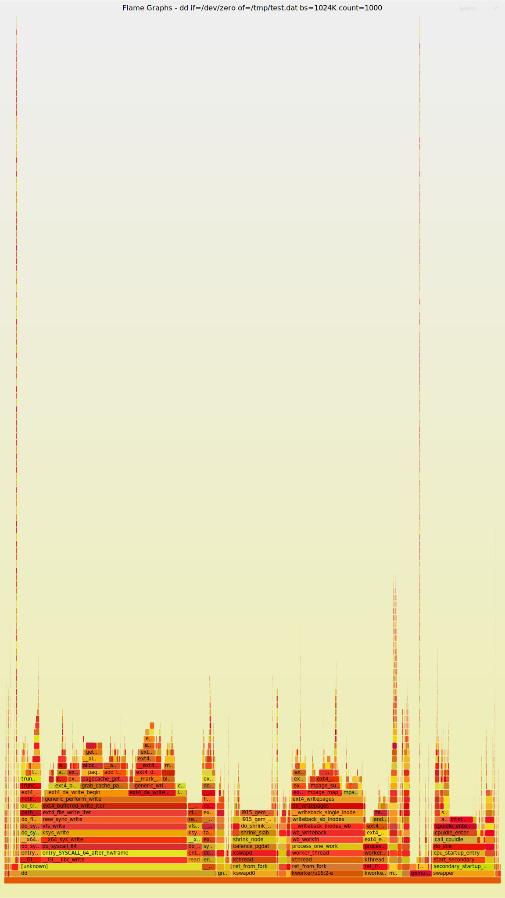

# 阅读内核的一些工具总结

在[上一篇文章](https://martins3.github.io/learn-linux-kernel.html)中，提出了学习内核的目的，工作的方向以及
大致的学习路径，下面谈一下学习的。

## QEMU 
QEMU 高效，简单，强大。

参考我的[一个脚本](https://github.com/Martins3/Martins3.github.io/blob/master/hack/qemu/x64-e1000/alpine.sh)
其中采用 alpine 作为镜像，因为 alpine 是 Docker 选择的轻量级镜像，比 Yocto 功能齐全(包管理器)，而且比 Ubuntu 简单


其中所有的操作使用脚本，但是镜像的安装需要手动操作
1. 使用 root 登录
2. 执行 setup-alpine 来进行安装, 所有的都是默认的, 一路 enter ，除了下面的两个
    - 选择 image 的时候让其自动选择最快的，一般是清华的
    - 安装磁盘选择创建的

> 默认 root 登录


> 选择 f 也即是自动选择最快的


> 制作的镜像放到指定的 image 中


构建好了之后，就可以像是调试普通进程一样调试内核了，非常好用。

## FlameGraph
使用 FlameGraph 可以很快的定位出来函数的大致执行的流程，无需使用编辑器一个个的跳转，非常好用。
其局限在于，似乎总是只能从用户态系统调用触发。

具体步骤参考 : https://yohei-a.hatenablog.jp/entry/20150706/1436208007

```sh
wget https://raw.githubusercontent.com/brendangregg/FlameGraph/master/stackcollapse-perf.pl
wget https://raw.githubusercontent.com/brendangregg/FlameGraph/master/flamegraph.pl

# 为了让 non root 用户可以 perf
echo 0 > /proc/sys/kernel/perf_event_paranoid
echo 0 > /proc/sys/kernel/kptr_restrict
```

```sh
perf record -a -g -F100000 dd if=/dev/zero of=/tmp/test.dat bs=1024K count=1000
```

- -g: record call stack (call graph, backtrace)
- -a: Collect information not only for execution commands, but also for the entire OS
- -F: 100,000Hz (100,000 times per second) sampling

```sh
perf script> perf_data.txt
perl stackcollapse-perf.pl perf_data.txt|perl flamegraph.pl --title "Flame Graphs - dd if=/dev/zero of=/tmp/test.dat bs=1024K count=1000" > flamegraph_dd.svg
```
最终效果，可以在新的窗口中打开，



## bpftrace
使用 bpftrace 的 kprobe 可以很容易的动态的获取内核函数的 backtrace, 效果如下。


```bt
#!/usr/bin/bpftrace
kprobe:task_tick_fair
{
  @[kstack] = count();
}
```

```txt
@[
    task_tick_fair+1
    update_process_times+187
    tick_sched_handle.isra.0+37
    tick_sched_timer+109
    __hrtimer_run_queues+251
    hrtimer_interrupt+265
    __sysvec_apic_timer_interrupt+100
    sysvec_apic_timer_interrupt+56
    asm_sysvec_apic_timer_interrupt+18
]: 171
```

