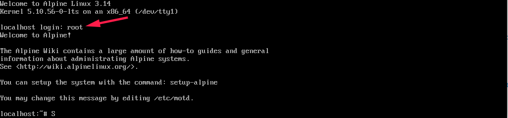

# 使用 QEMU, FlameGraph 和 bpftrace 阅读内核

在[上一篇文章](https://martins3.github.io/learn-linux-kernel.html)中，提出了学习内核的目的，工作的方向以及大致的学习路径，下面谈一下可以提高分析效率的工具。

## QEMU
QEMU 很强大。

使用 QEMU 调试内核网上已经有很多的文章, 比如 [Booting a Custom Linux Kernel in QEMU and Debugging It With GDB](http://nickdesaulniers.github.io/blog/2018/10/24/booting-a-custom-linux-kernel-in-qemu-and-debugging-it-with-gdb/)
但是，这些都不是完整，对着教程用下来总是出问题。

## 镜像
所以我写了一个[脚本](https://github.com/Martins3/Martins3.github.io/blob/master/hack/qemu/x64-e1000/alpine.sh), 简单解释几个点:
1. 其中采用 alpine 作为镜像，因为 alpine 是 Docker 选择的轻量级镜像，比 Yocto 功能齐全(包管理器)，而且比 Ubuntu 简单
2. 第一步使用 iso 来安装镜像，这次运行的是 iso 中是包含了一个默认内核, 安装镜像之后，使用 -kernel 指定内核
3. 在 [How to use custom image kernel for ubuntu in qemu?](https://stackoverflow.com/questions/65951475/how-to-use-custom-image-kernel-for-ubuntu-in-qemu) 的这个问题中，我回答了如何设置内核参数 sda

其中几乎所有的操作使用脚本，除了镜像的安装需要手动操作
1. 使用 root 登录
2. 执行 setup-alpine 来进行安装, 所有的都是默认的, 一路 enter (包括密码，之后登录直接 enter) ，除了下面的两个
    - 选择 image 的时候让其自动选择最快的，一般是清华的
    - 安装磁盘选择创建的

> 默认 root 登录


> 选择 f 也即是自动选择最快的


> 将系统安装到脚本制作的 image 中


构建好了之后，就可以像是调试普通进程一样调试内核了，非常好用。

## FlameGraph
使用 FlameGraph 可以很快的定位出来函数的大致执行的流程，无需使用编辑器一个个的跳转，非常好用。
其局限在于，似乎总是只能从用户态系统调用触发。

具体细节参考 https://www.brendangregg.com/FlameGraphs/cpuflamegraphs.html

perf 可能需要安装:
```sh
sudo apt install linux-tools-common linux-tools-generic linux-tools-`uname -r`
```

最终效果如下，可以在新的窗口中打开从而可以动态交互。


这个工具我使用的非常频繁，所以构建了简单的[一个脚本](https://github.com/Martins3/Martins3.github.io/blob/master/docs/kernel/code/flamegraph.sh)

## bpftrace
使用 bpftrace 的 kprobe 可以很容易的动态的获取内核函数的 backtrace


首先可以使用 bpftrace -l | fzf 检查可以观测的点

脚本：
```bt
#!/usr/bin/bpftrace
kprobe:task_tick_fair
{
  @[kstack] = count();
}
```

结果:
```txt
@[
    task_tick_fair+1
    update_process_times+187
    tick_sched_handle.isra.0+37
    tick_sched_timer+109
    __hrtimer_run_queues+251
    hrtimer_interrupt+265
    __sysvec_apic_timer_interrupt+100
    sysvec_apic_timer_interrupt+56
    asm_sysvec_apic_timer_interrupt+18
]: 171
```

## TODO
- [ ] 将 QEMU 的基本使用变为一个单独的文章分析一下
  - 分析各种常用的技术
  - 整理 ./perf 和 ./hack/trace.md
- [ ] 介绍 [hotspot](https://github.com/KDAB/hotspot)
- [ ] perf 工具比我想想的要强大，应该好好的重新分析一下
  - https://www.brendangregg.com/FlameGraphs/cpuflamegraphs.html
- [ ] 内核中存在 gcov 分析工具吗?
