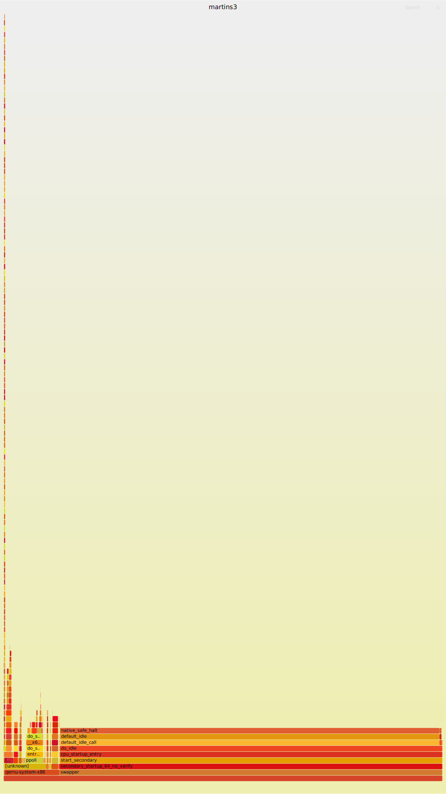

## trace

<!-- vim-markdown-toc GitLab -->

## 基本理念

在 https://github.com/brendangregg/perf-tools 可以看到 bash 脚本 execsnoop，其中就是使用 ftrace 在 /sys 下提供的接口来使用的。
而 https://github.com/iovisor/bcc/ 中，有如下的两个文件:
- libbpf-tools/execsnoop.c : 基于 libbpf [^13]，overhead 更加小
- tools/execsnoop.py : 编译 BCC 程序来实现的

- https://www.scylladb.com/2021/09/28/hunting-a-numa-performance-bug/ : 一个具体的案例

## 问题
- [ ] 所以 lttng 相对于 bpf 有什么优势吗?
- [ ] perf 工具比我想想的要强大，应该好好的重新分析一下
  - https://www.brendangregg.com/FlameGraphs/cpuflamegraphs.html
- [ ] 感觉 perf 能做的事情，bpftrace 和 ebpf 都可以做，而且更加好
  - 例如 hardware monitor 在 bpftrace 中和 bcc 中 llcstat-bpfcc 都是可以做的
- [ ] bpf 相对于 perf 有什么优势吗?

## perf

1. 记录所有的到达 `tcp_sendmsg` 的 backtrace 和比例
```sh
perf probe 'tcp_sendmsg'
perf record -e probe:tcp_sendmsg -a -g sleep 10
```
得到的数据可以使用 flamegraph 处理一下，可以得到非常形象的图形。

而使用 bpftrace 可以获取到更加精细的数值统计。

### [ ] 处理一下 perf 中 unknow 的数值情况

例如下面，几乎显示所有的函数都是被一个 unknow 的函数调用的，是不是
哪里有点问题吧!


### [ ] 为什么 perf 无法正确 perf 到用户态的程序
perf report 的比例明显不对啊

### 常用的操作方法
- perf list kvm
- perf diff perf-1.data perf-2.data ： 按照 diff 差距来分析

更多的参考:
- https://www.brendangregg.com/perf.html
- https://jvns.ca/perf-zine.pdf

### Questions
- [ ] 为什么有时候需要 mount debugfs

## ftrace-cmd
https://lwn.net/Articles/410200/ 的记录

- [ ] 两个用户层次的前端工具 : perf + trace-cmd 分别读取的内容是从哪里的呀 ?
- [ ] trace-cmd

1. ftrace-cmd 的 record 原理: 为每一个 cpu 创建出来一个 process，读取 /sys/kernel/debug/tracing/per_cpu/cpu0，最后主函数将所有的 concatenate 起来
2. -e 可以选择一个 trace event 或者一个 subsystem 的 trace point。The -e option enables an event. The argument following the -e can be an event name, event subsystem name, or the special name all.
3. 四种功能 : Ftrace also has special plugin tracers that do not simply trace specific events. These tracers include the function, function graph, and latency tracers.
    1. trace function 指的是 ?
    2. `current_tracer` 可以放置的内容那么多，为什么只有这几个 plugin
    3. 当 latency tracer 和 perf 的关系是什么 ?
4. 解释下面的程序:
    1. -p 添加 function plugin
    2. -e 选择需要被 trace 的 events
    3. The `-l` option is the same as echoing its argument into `set_ftrace_filter`, and the `-n` option is the same as echoing its argument into `set_ftrace_notrace`.
```sh
trace-cmd record -p function -l 'sched_*' -n 'sched_slice'
```
5. 解释下面的程序: TODO 应该是采用，
```txt
trace-cmd record -p function_graph -l do_IRQ -e irq_handler_entry sleep 10
```

> TODO : 到底 dynamic ftrace 是什么 ?


> 让我们解决一个小问题，为什么没有办法写入到 `set_ftrace_filter`
https://superuser.com/questions/287371/obtain-kernel-config-from-currently-running-linux-system

> 引出了一个小问题:
`tracing_on` 和 `/proc/sys/kernel/ftrace_enabled` 分别表示什么 ?


## [valgrind](http://valgrind.org/)
使用上很简单:
https://stackoverflow.com/questions/5134891/how-do-i-use-valgrind-to-find-memory-leaks

## [uftrace](https://github.com/namhyung/uftrace)
仅仅支持 c / c++，可以非常精准将函数的调用图生成出来。

## [lttng](https://lttng.org/docs/)
其分析居然还要使用一个 : https://babeltrace.org/

## usdt
```sh
sudo apt install systemtap-sdt-dev
```

## [ ] QEMU 中的 trace
- [ ] 测试一下, 添加新的 Trace 的方法
- [ ]  为什么会支持各种 backend, 甚至有的 dtrace 的内容?
- [ ] 这里显示的 trace 都是做什么的 ?
```plain
➜  vn git:(master) ✗ qemu-system-x86_64 -trace help
```
- [ ] 例如这些文件:
/home/maritns3/core/qemu/hw/i386/trace-events

### log
util/log.c 定义所有的 log, 其实整个机制是很容易的

- `asm_in` : `accel/tcg/translator.c::translator_loop`
- `asm_out` : `tcg/translate-all.c::tb_gen_code`

## 小众的 profile 工具
- https://oprofile.sourceforge.io/about/

## 更加好用的前端分析工具

### [ ] [hotspot](https://github.com/KDAB/hotspot)
这个工具是不是需要特殊的配置啊，搞出来的火焰图明显不对

### [pcm](https://github.com/opcm/pcm)
```sh
git clone https://github.com/opcm/pcm
cd pcm
mkdir build
cd build
cmake ..
cmake --build . --parallel

./build/pcm
```


- [ ] https://github.com/cyring/CoreFreq
- [ ] https://github.com/intel/msr-tools
- [ ] https://github.com/tycho/cpuid

### [flamescope](https://github.com/Netflix/flamescope)
可以用于查看一个范围空间中的 flamegraph

### [ ] kernelshark

### [ ] [pprof](https://github.com/google/pprof)

和这个东西是什么关系?
- https://github.com/gperftools/gperftools
- [ ] 如果 pprof 似乎是可以 C 语言工作的，但是 gperf 据说已经很好用了

- [ ] https://github.com/jrfonseca/gprof2dot
  - 这个工具是被我们使用上了，但是本身是一个将各种 perf 结果生成新的结果的工具，可以看看原来的结果的位置

### [ ] [tracecompass](https://www.eclipse.org/tracecompass/index.html)


## 其他
### ltrace
library call trace

### [ ] [sysdig](https://github.com/draios/sysdig)

使用 csysdig 可以得到一些类似 htop 的界面
```sh
csysdig -l
```

- sysdig 可以监控整个系统中发生的所有正在发生那些
  - 系统调用 : 我们发现很多都是 futex
  - 所有的 IO : pipe unix netlink
    - 并且检查所有在使用 pipe 的进程
      - 而且可以将这些进程的 backtrace 打印出来

### [prometheus](https://prometheus.io)
集群的管理

也许应该新增加一个栏目，叫做 monitor 的
- https://github.com/winsiderss/systeminformer

### [ ] [memray](https://github.com/bloomberg/memray)

### [ ] https://github.com/google/schedviz

### [ ] https://github.com/javamelody/javamelody

### [ ] https://github.com/intel/msr-tools
### [ ] https://github.com/corpaul/flamegraphdiff
### [ ] https://github.com/andikleen/pmu-tools
### [ ] https://github.com/aquasecurity/tracee
### [ ] https://github.com/cloudflare/ebpf_exporter
### [ ] https://github.com/bytedance/trace-irqoff

### [ ] iperf
https://load-balancer.inlab.net/manual/performance/measuring-internal-bandwidth-with-iperf/

## [ ] https://github.com/sysstat/sysstat

## [ ] https://man7.org/linux/man-pages/man1/ipcs.1.html
分析 ipc 的性能的

## [ ] irqtop(1)

# 传统的统计工具
- lsof

## dperf
dpdk 测试工具

- https://github.com/baidu/dperf

## sar
- https://medium.com/@malith.jayasinghe/network-monitoring-using-sar-37bab6ce9f68
- sar -n DEV 1

## 参考
- https://github.com/adriannovegil/awesome-observability

## rusage
- time 的源码: https://savannah.gnu.org/git/?group=time
  - [ ] nixos 上不知道为什么，我不能正确的编译
- 原来是有个系统调用的: https://man7.org/linux/man-pages/man2/getrusage.2.html
- fs/proc/stat.c 中的信息才是 top 如何统计的
- 通过 `vtime_guest_enter` 去理解为什么 qemu 在运行起来的时候，发现 user 是占据大多数的，因为统计将 non-root 中的运行统计到 user 中了。

## blktrace
- https://developer.aliyun.com/article/698568

## [ ] cflow
- https://graphviz.org/
- https://graphviz.org/pdf/gvpr.1.pdf
- https://www.gnu.org/software/cflow/manual/cflow.html : 可以绘制整个图形的

## sudo cat /proc/self/stack
检查一个进程在内核中的 stack

## rtla
- https://lwn.net/Articles/869563/
- https://bristot.me/and-now-linux-has-a-real-time-linux-analysis-rtla-tool/


## lshw
- lshw -c disk : 可以查看一个 disk 所在的 CPU

## lscpu
- 检查 numa CPU

## numactl
- numactl -H

## cpupower

## mpstat -P 0-16

## fgprof
- https://github.com/felixge/fgprof

其实一直没有搞懂，为什么会存在语言相关的 profiler 的

## depmod -a / -A

## iostat

## pidstat

## mpstat

- https://wiki.ubuntu.com/Kernel/Reference/stress-ng
- https://gitee.com/openeuler/release-management/pulls/417/

## iftop

## tiptop

## ps

[^4]: [An introduction to KProbes](https://lwn.net/Articles/132196/)
[^5]: [Using user-space tracepoints with BPF](https://lwn.net/Articles/753601/)
[^7]: [kernelshark](https://www.cnblogs.com/arnoldlu/p/9014365.html)
[^8]: [Linux Performance](http://www.brendangregg.com/linuxperf.html)
[^9]: [Linux tracing systems & how they fit together](https://jvns.ca/blog/2017/07/05/linux-tracing-systems/)
[^10]: [lwn : A look at ftrace](https://lwn.net/Articles/322666/)
[^11]: [perf tutorial](https://perf.wiki.kernel.org/index.php/Tutorial)
[^12]: https://github.com/NanXiao/perf-little-book
[^13]: https://pingcap.com/blog/why-we-switched-from-bcc-to-libbpf-for-linux-bpf-performance-analysis
