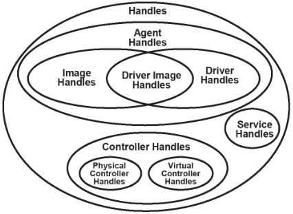
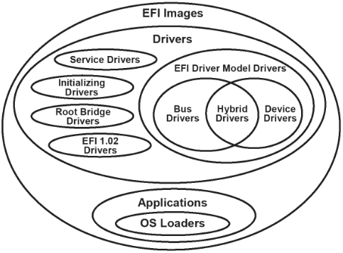
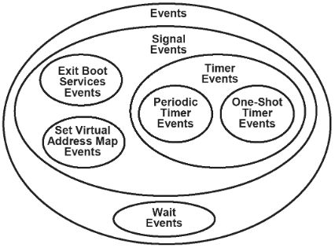

# UEFI 入门

<!-- vim-markdown-toc GitLab -->

* [和用户态编程的根本性区别](#和用户态编程的根本性区别)
* [UEFI 的基本启动过程](#uefi-的基本启动过程)
  * [DXE](#dxe)
* [UEFI System Table](#uefi-system-table)
* [Handle 和 Protocol](#handle-和-protocol)
* [Image](#image)
  * [Image Load](#image-load)
* [Event](#event)
  * [Signal Event](#signal-event)
  * [Wait Event](#wait-event)
* [UEFI Driver Model](#uefi-driver-model)
  * [Driver Binding Protocol](#driver-binding-protocol)
    * [e.g. pci](#eg-pci)
* [Device Path](#device-path)
* [Os Loader](#os-loader)
  * [CoreExitBootServices](#coreexitbootservices)
* [Timer](#timer)
* [Shell Application](#shell-application)
* [编程风格](#编程风格)
* [资源](#资源)
* [疑惑](#疑惑)
* [总结](#总结)

<!-- vim-markdown-toc -->

经过 [Linux UEFI 学习环境搭建](./uefi-linux.md) 想必对于 UEFI 存在一些感性的认识，现在来基于 edk2 介绍一些 UEFI 入门级的核心概念。

主要参考 [Beyond BIOS: Developing with the Unified Extensible Firmware Interface, Third Edition](https://www.amazon.com/Beyond-BIOS-Developing-Extensible-Interface/dp/1501514784)
同时 [官方文档](https://edk2-docs.gitbook.io/edk-ii-uefi-driver-writer-s-guide) 也是重要参考。

[uefi.org specifications]( https://uefi.org/specifications) 就太专业了，大多数时候是用不着的。

下面的内容对应的代码主要在 MdeModulePkg/Core/Dxe 中，实际上，edk2 中大多数的代码都是各种 driver，基本是对称的，Dxe 算是最为核心的部分了


Assuming you are new to UEFI, the following introduction explains a few of the key UEFI concepts in a helpful framework to keep in mind as you study the specification:[^6]
- Objects managed by UEFI-based firmware - used to manage system state, including I/O devices, memory, and events
- The UEFI System Table - the primary data structure with data information tables and function calls to interface with the systems
- Handle database and protocols - the means by which callable interfaces are registered
- UEFI images - the executable content format by which code is deployed
- Events - the means by which software can be signaled in response to some other activity
- Device paths - a data structure that describes the hardware location of an entity, such as the bus, spindle, partition, and file name of an UEFI image on a formatted disk.

## 和用户态编程的根本性区别
使用上 StdLib 之后，很多编程几乎看似和用户态已无区别，比如一个 HelloWorld.c 可以直接编译为 .efi 并且在 UefiShell 中运行。
但是仔细观察，我们会发现诸多和用户态编程的根本性区别。

**没有虚拟进程地址空间**

在用户态的程序在 gdb 中 backtrace[^1] 的时候，backtrace 最远的位置就是程序开始的位置 `_start`
```txt
#1  0x000000000040113b in main (argc=1, argv=0x7fffffffd638) at a.c:4
#2  0x00007ffff7db40b3 in __libc_start_main (main=0x401120 <main>, argc=1, argv=0x7fffffffd638, init=<optimized out>, fini=<optimized out>, rtld_fini=<optimized out>,
stack_end=0x7fffffffd628) at ../csu/libc-start.c:308
#3  0x000000000040104e in _start ()
```

但是在 edk2 中 backtrace 可以看到 Dxe 的整个执行流程，从下面的 backtrace 中可以清晰的看到从 Boot Manager 加载 Shell，然后 Shell 去加载 Main.efi 的过程，
他们使用的 stack 在同一个地址空间中。
```txt
-   #0  malloc (Size=Size@entry=7900) at /home/maritns3/core/ld/edk2-workstation/edk2/StdLib/LibC/StdLib/Malloc.c:85
-   #1  0x000000007e5cc40c in tzsetwall () at /home/maritns3/core/ld/edk2-workstation/edk2/StdLib/LibC/Time/ZoneProc.c:778
-   #2  tzset () at /home/maritns3/core/ld/edk2-workstation/edk2/StdLib/LibC/Time/ZoneProc.c:796
-   #3  0x000000007e5cccc1 in mktime (timeptr=0x7e63bba4) at /home/maritns3/core/ld/edk2-workstation/edk2/StdLib/LibC/Time/Time.c:520
-   #4  time (timer=0x0) at /home/maritns3/core/ld/edk2-workstation/edk2/StdLib/LibC/Time/Time.c:558
-   #5  0x000000007e5cd20a in ShellAppMain (Argc=1, Argv=0x7e64ec98) at /home/maritns3/core/ld/edk2-workstation/edk2/StdLib/LibC/Main/Main.c:153
-   #6  0x000000007e5ce956 in ShellCEntryLib (SystemTable=0x7f9ee018, ImageHandle=0x7e64d298) at /home/maritns3/core/ld/edk2-workstation/edk2/ShellPkg/Library/UefiShellCEn
-   tryLib/UefiShellCEntryLib.c:84
-   #7  ProcessModuleEntryPointList (SystemTable=0x7f9ee018, ImageHandle=0x7e64d298) at /home/maritns3/core/ld/edk2-workstation/edk2/Build/AppPkg/DEBUG_GCC5/X64/AppPkg/App
-   lications/Main/Main/DEBUG/AutoGen.c:375
-   #8  _ModuleEntryPoint (ImageHandle=0x7e64d298, SystemTable=0x7f9ee018) at /home/maritns3/core/ld/edk2-workstation/edk2/MdePkg/Library/UefiApplicationEntryPoint/Applica
-  tionEntryPoint.c:59
>   #9  0x000000007feba8f7 in CoreStartImage (ImageHandle=0x7e64d298, ExitDataSize=0x0, ExitData=0x0) at /home/maritns3/core/ld/edk2-workstation/edk2/MdeModulePkg/Core/Dxe
>   /Image/Image.c:1654
>   #10 0x000000007e5248b7 in InternalShellExecuteDevicePath (ParentImageHandle=0x7e5a4ad8, DevicePath=DevicePath@entry=0x7e64d698, CommandLine=CommandLine@entry=0x7e65029
>   8, Environment=Environment@entry=0x0, StartImageStatus=StartImageStatus@entry=0x7fe9e838) at /home/maritns3/core/ld/edk2-workstation/edk2/ShellPkg/Application/Shell/Sh
>   ellProtocol.c:1540
>   #11 0x000000007e527ab4 in RunCommandOrFile (CommandStatus=0x0, ParamProtocol=0x7e682f98, FirstParameter=0x7e678c98, CmdLine=0x7e650298, Type=Efi_Application) at /home/
>   maritns3/core/ld/edk2-workstation/edk2/ShellPkg/Application/Shell/Shell.c:2505
>   #12 SetupAndRunCommandOrFile (CommandStatus=0x0, ParamProtocol=0x7e682f98, FirstParameter=0x7e678c98, CmdLine=<optimized out>, Type=Efi_Application) at /home/maritns3/
>   core/ld/edk2-workstation/edk2/ShellPkg/Application/Shell/Shell.c:2589
>   #13 RunShellCommand (CommandStatus=0x0, CmdLine=0x7e650298) at /home/maritns3/core/ld/edk2-workstation/edk2/ShellPkg/Application/Shell/Shell.c:2713
>   #14 RunShellCommand (CmdLine=CmdLine@entry=0x7e64f018, CommandStatus=0x0, CommandStatus@entry=0x7e5419ac) at /home/maritns3/core/ld/edk2-workstation/edk2/ShellPkg/Appl
>   ication/Shell/Shell.c:2625
>   #15 0x000000007e52b370 in RunCommand (CmdLine=0x7e64f018) at /home/maritns3/core/ld/edk2-workstation/edk2/ShellPkg/Application/Shell/Shell.c:2765
>   #16 DoShellPrompt () at /home/maritns3/core/ld/edk2-workstation/edk2/ShellPkg/Application/Shell/Shell.c:1358
>   #17 UefiMain (ImageHandle=<optimized out>, SystemTable=<optimized out>) at /home/maritns3/core/ld/edk2-workstation/edk2/ShellPkg/Application/Shell/Shell.c:621
>   #18 0x000000007e50f52d in ProcessModuleEntryPointList (SystemTable=0x7f9ee018, ImageHandle=0x7ec55f98) at /home/maritns3/core/ld/edk2-workstation/edk2/Build/OvmfX64/DE
>   BUG_GCC5/X64/ShellPkg/Application/Shell/Shell/DEBUG/AutoGen.c:1013
>   #19 _ModuleEntryPoint (ImageHandle=0x7ec55f98, SystemTable=0x7f9ee018) at /home/maritns3/core/ld/edk2-workstation/edk2/MdePkg/Library/UefiApplicationEntryPoint/Applica
*   tionEntryPoint.c:59
*   #20 0x000000007feba8f7 in CoreStartImage (ImageHandle=0x7ec55f98, ExitDataSize=0x7ec75470, ExitData=0x7ec75468) at /home/maritns3/core/ld/edk2-workstation/edk2/MdeModu
*   lePkg/Core/Dxe/Image/Image.c:1654
*   #21 0x000000007f05c5e2 in EfiBootManagerBoot (BootOption=BootOption@entry=0x7ec75420) at /home/maritns3/core/ld/edk2-workstation/edk2/MdeModulePkg/Library/UefiBootMana
*   gerLib/BmBoot.c:1982
*   #22 0x000000007f05fca2 in BootBootOptions (BootManagerMenu=0x7fe9ecd8, BootOptionCount=4, BootOptions=0x7ec75318) at /home/maritns3/core/ld/edk2-workstation/edk2/MdeMo
*   dulePkg/Universal/BdsDxe/BdsEntry.c:409
*   #23 BdsEntry (This=<optimized out>) at /home/maritns3/core/ld/edk2-workstation/edk2/MdeModulePkg/Universal/BdsDxe/BdsEntry.c:1072
*   #24 0x000000007feaabf8 in DxeMain (HobStart=<optimized out>) at /home/maritns3/core/ld/edk2-workstation/edk2/MdeModulePkg/Core/Dxe/DxeMain/DxeMain.c:553
*   #25 0x000000007feaac9d in ProcessModuleEntryPointList (HobStart=<optimized out>) at /home/maritns3/core/ld/edk2-workstation/edk2/Build/OvmfX64/DEBUG_GCC5/X64/MdeModule
*   Pkg/Core/Dxe/DxeMain/DEBUG/AutoGen.c:489
*   #26 _ModuleEntryPoint (HobStart=<optimized out>) at /home/maritns3/core/ld/edk2-workstation/edk2/MdePkg/Library/DxeCoreEntryPoint/DxeCoreEntryPoint.c:48
*   #27 0x000000007fee10cf in InternalSwitchStack ()
*   #28 0x0000000000000000 in ?? ()
```
没有虚拟地址空间还存在一个大问题，那就是不会出现 segment fault 的错误，随意访问物理地址不会被立刻检测出来，错误往往可能传递到更远的位置才会被发现。
所以 UEFI 对于程序的访存安全要求更高。

如果你理解了 backtrace 实现的原理，上面的 backtrace 说明在 DXE 阶段，执行的程序:

**始终使用的是通一个 stack**

进程地址空间的一个重要作用就是隔离，你在一个程序中定义的全局变量在另一个程序中是无法看到的。
UEFI 中程序都在物理地址空间中，一个程序可以随意访问另一个程序的各种数据，当然你最好不要这么做，因为这会大大增加
编程的复杂度，但是 UEFI 中程序还是需要进行交互的，那么就必须显示地使用统一的接口，这个接口就是 handle / protocol 了。


**没有 parallel 和 context switch**

在 edk2 中，程序就是一个接着一个执行的，即使运行的平台含有多个 core, 但是只会使用其中一个运行。
为了减少程序的复杂性，也不存在 context switch 的操作。

**只有一个 interrupt : timer interrupt**

一般来说，用户态程序是无需考虑中断的，因为中断相关的事情都被 os 处理掉了。
在 Linux 中，设备主要是通过中断来通知 CPU，而在 edk2 中，设备不能给 CPU 发射中断，需要靠 CPU 主动来 poll 设备。
## UEFI 的基本启动过程


主要是:
- pre-EFI initialization (PEI)
- Driver Execution Environment (DXE)
- Boot Device Selection (BDS)

### DXE

The DXE phase contains an implementation of UEFI that is compliant with the PI (Platform Initialization) Specification.
As a result, both the DXE Core and DXE drivers share many of the attributes of UEFI images.
The DXE phase is the phase where most of the system initialization is performed. The Pre-EFI Initialization (PEI) phase is responsible for initializing permanent memory in the platform so the DXE phase can be loaded and executed.
The state of the system at the end of the PEI phase is passed to the DXE phase through a list of position-independent data structures called Hand-Off Blocks (HOBs).
The DXE phase consists of several components:
- DXE Core
- DXE Dispatcher
- DXE Drivers

The DXE Core produces a set of Boot Services, Runtime Services, and DXE Services.
The DXE Dispatcher is responsible for discovering and executing DXE drivers in the correct order.
The DXE drivers are responsible for initializing the processor, chipset, and platform components as well as providing software abstractions for console and boot devices.
These components work together to initialize the platform and provide the services required to boot an OS.

The DXE Core produces the EFI System Table and its associated set of EFI Boot Services and EFI Runtime Services. The DXE Core also contains the DXE Dispatcher, whose main purpose is to discover and execute DXE drivers stored in firmware volumes.


## UEFI System Table
通过 UEFI System Table 可以访问到三种 services:
- UEFI Boot Services
- UEFI Runtime Services
- Protocol services

在 MdePkg/Include/Uefi/UefiSpec.h 中定义了 EFI_RUNTIME_SERVICES EFI_BOOT_SERVICES 和 EFI_SYSTEM_TABLE
```c
  ///
  /// A pointer to the EFI Runtime Services Table.
  ///
  EFI_RUNTIME_SERVICES              *RuntimeServices;
  ///
  /// A pointer to the EFI Boot Services Table.
  ///
  EFI_BOOT_SERVICES                 *BootServices;
  ///
  /// The number of system configuration tables in the buffer ConfigurationTable.
  ///
  UINTN                             NumberOfTableEntries;
  ///
  /// A pointer to the system configuration tables.
  /// The number of entries in the table is NumberOfTableEntries.
  ///
  EFI_CONFIGURATION_TABLE           *ConfigurationTable;
} EFI_SYSTEM_TABLE;
```

在 DXE 早期 UefiBootServicesTableLibConstructor 中，会初始化 UEFI 中为数不多的全局变量，各种 driver 就是靠访问 gST 来获取各种服务。
```c
EFI_HANDLE         gImageHandle = NULL;
EFI_SYSTEM_TABLE   *gST         = NULL;
EFI_BOOT_SERVICES  *gBS         = NULL;
```

类似的全局变量还有 gDS
```c
//
// Cache copy of the DXE Services Table
//
EFI_DXE_SERVICES  *gDS      = NULL;
```

## Handle 和 Protocol


- The handle database is composed of objects called handles and protocols.
- Handles are a collection of one or more protocols
- Protocols are data structures named by a GUID.

- CoreInstallProtocolInterfaceNotify : 将需要安装的 handle 放到 database 中 `gHandleList`
- CoreGetProtocolInterface : 在 handle 根据 protocol guid 查询 protocol


Handle 的定义[^12]:
- AllHandles : 将自己挂入到 database 中
- Protocols : 获取所有的 protocol
```c
///
/// IHANDLE - contains a list of protocol handles
///
typedef struct {
  UINTN               Signature;
  /// All handles list of IHANDLE
  LIST_ENTRY          AllHandles;
  /// List of PROTOCOL_INTERFACE's for this handle
  LIST_ENTRY          Protocols;
  UINTN               LocateRequest;
  /// The Handle Database Key value when this handle was last created or modified
  UINT64              Key;
} IHANDLE;
```
实际上，IHANDLE 并不是直接使用，在各种参数传递的过程中，总是使用的 EFI_HANDLE 的，我猜测
是为了隐藏 IHANDLE 的实现。
```c
///
/// A collection of related interfaces.
///
typedef VOID                      *EFI_HANDLE;
```


单看这个几个定义 database 管理了多个 handle，handle 包含了多个 protocol。
实际上，handle 更像是 object，而 protocol 像是这个 object 的 field (method and variable)
下面使用 ps2 键盘进行具体的分析:
- 在 KbdControllerDriverStart 中安装:
```c
  //
  // Install protocol interfaces for the keyboard device.
  //
  Status = gBS->InstallMultipleProtocolInterfaces (
                  &Controller,
                  &gEfiSimpleTextInProtocolGuid,
                  &ConsoleIn->ConIn, // EFI_SIMPLE_TEXT_INPUT_PROTOCOL
                  &gEfiSimpleTextInputExProtocolGuid,
                  &ConsoleIn->ConInEx,
                  NULL
                  );
```
这里的 handle 是 `Controller`，而 protocol 是 `ConsoleIn->ConIn` 和 `ConsoleIn->ConInEx`。

- ConSplitterConInDriverBindingStart => ConSplitterStart 中获取
```c
  //
  // Open InterfaceGuid on the virtual handle.
  //
  Status =  gBS->OpenProtocol (
                ControllerHandle,
                InterfaceGuid, // 就是 gEfiSimpleTextInProtocolGuid
                Interface, // 从这里获取了 ConsoleIn->ConIn
                This->DriverBindingHandle,
                ConSplitterVirtualHandle,
                EFI_OPEN_PROTOCOL_GET_PROTOCOL
                );
```

```c
/*
#0  KeyReadStatusRegister (ConsoleIn=ConsoleIn@entry=0x7ec76018) at /home/maritns3/core/ld/edk2-workstation/edk2/MdePkg/Library/BaseIoLibIntrinsic/IoLibGcc.c:50
#1  0x000000007edacc38 in KeyboardTimerHandler (Event=Event@entry=0x0, Context=Context@entry=0x7ec76018) at /home/maritns3/core/ld/edk2-workstation/edk2/MdeModulePkg/B
us/Isa/Ps2KeyboardDxe/Ps2KbdCtrller.c:807
#2  0x000000007edad371 in KeyboardReadKeyStrokeWorker (ConsoleInDev=ConsoleInDev@entry=0x7ec76018, KeyData=KeyData@entry=0x7fe9e1e4) at /home/maritns3/core/ld/edk2-wor
kstation/edk2/MdeModulePkg/Bus/Isa/Ps2KeyboardDxe/Ps2KbdTextIn.c:156
#3  0x000000007edad42d in KeyboardReadKeyStroke (This=<optimized out>, Key=0x7fe9e244) at /home/maritns3/core/ld/edk2-workstation/edk2/MdeModulePkg/Bus/Isa/Ps2Keyboard
Dxe/Ps2KbdTextIn.c:279
#4  0x000000007ede8f56 in ConSplitterTextInPrivateReadKeyStroke (Key=0x7fe9e2ac, Private=0x7edeccc0) at /home/maritns3/core/ld/edk2-workstation/edk2/MdeModulePkg/Unive
rsal/Console/ConSplitterDxe/ConSplitter.c:3562
#5  ConSplitterTextInReadKeyStroke (This=<optimized out>, Key=0x7fe9e2ac) at /home/maritns3/core/ld/edk2-workstation/edk2/MdeModulePkg/Universal/Console/ConSplitterDxe
/ConSplitter.c:3623
#6  0x000000007dff9538 in da_ConRawRead (filp=filp@entry=0x7e074018, Character=Character@entry=0x7e091344 L"") at /home/maritns3/core/ld/edk2-workstation/edk2/StdLib/L
ibC/Uefi/Devices/Console/daConsole.c:257
#7  0x000000007dff9626 in da_ConPoll (filp=0x7e074018, events=<optimized out>) at /home/maritns3/core/ld/edk2-workstation/edk2/StdLib/LibC/Uefi/Devices/Console/daConso
le.c:672
#8  0x000000007e001bbd in poll (nfds=1, timeout=-1, pfd=0x7e06af38) at /home/maritns3/core/ld/edk2-workstation/edk2/MdePkg/Library/BaseDebugLibNull/DebugLib.c:166
*/
```

在 ConSplitterTextInPrivateReadKeyStroke 中就可以持有 EFI_SIMPLE_TEXT_INPUT_PROTOCOL 来调用其函数指针 EFI_INPUT_READ_KEY
也就是 KeyboardReadKeyStroke [^11]
```c
    // Private->TextInList[Index] 就是 EFI_SIMPLE_TEXT_INPUT_PROTOCOL 了
    Status = Private->TextInList[Index]->ReadKeyStroke (
                                          Private->TextInList[Index],
                                          &KeyData.Key
                                          );
```


## Image


The driver entry point is the function called when a UEFI driver is started with the `StartImage()` service.
At this point the driver has already been loaded into memory with the `LoadImage()` service.

The image handle of the UEFI driver and a pointer to the UEFI system table are passed into every UEFI driver.
The image handle allows the UEFI driver to discover information about itself,
and the pointer to the UEFI system table allows the UEFI driver to make UEFI Boot Service and UEFI Runtime Service calls.

### Image Load

- [ ] https://edk2-docs.gitbook.io/edk-ii-uefi-driver-writer-s-guide/6_uefi_driver_categories/61_device_drivers/614_device_drivers_with_one_driver_binding_protoco

在 CoreLoadImageCommon 中还会 EFI_LOADED_IMAGE_PROTOCOL

- CoreStartImage
  - `Image->EntryPoint (ImageHandle, Image->Info.SystemTable);` 其实就是 `_ModuleEntryPoint`，其 SystemTable 就是在此处传递的
    - ProcessModuleEntryPointList
      - UefiMain

## Event


官方文档[^5]中给出了 event 和 tpl 的简单定义:

- Event types

| **Type of events**            | **Description**                                                                                                                                                                                                                                                                                                                                                                                                                                                                                                                                                                                                                                                                                                                                                                                                                                                                                                                                        |
|-------------------------------|--------------------------------------------------------------------------------------------------------------------------------------------------------------------------------------------------------------------------------------------------------------------------------------------------------------------------------------------------------------------------------------------------------------------------------------------------------------------------------------------------------------------------------------------------------------------------------------------------------------------------------------------------------------------------------------------------------------------------------------------------------------------------------------------------------------------------------------------------------------------------------------------------------------------------------------------------------|
| Wait event                    | An event whose notification function is executed whenever the event is checked or waited upon.                                                                                                                                                                                                                                                                                                                                                                                                                                                                                                                                                                                                                                                                                                                                                                                                                                                         |
| Signal event                  | An event whose notification function is scheduled for execution whenever the event goes from the waiting state to the signaled state.                                                                                                                                                                                                                                                                                                                                                                                                                                                                                                                                                                                                                                                                                                                                                                                                                  |
| Timer event                   | A type of signal event that is moved from the waiting state to the signaled state when at least a specified amount of time has elapsed. Both periodic and one-shot timers are supported. The event's notification function is scheduled for execution when a specific amount of time has elapsed.                                                                                                                                                                                                                                                                                                                                                                                                                                                                                                                                                                                                                                                      |
| Periodic timer event          | A type of timer event that is moved from the waiting state to the signaled state at a specified frequency. The event's notification function is scheduled for execution when a specific amount of time has elapsed.                                                                                                                                                                                                                                                                                                                                                                                                                                                                                                                                                                                                                                                                                                                                    |
| One-shot timer event          | A type of timer event that is moved from the waiting state to the signaled state after the specified time period has elapsed. The event's notification function is scheduled for execution when a specific amount of time has elapsed. The following three elements are associated with every event: * The task priority level (TPL) of the event * A notification function * A notification context The notification function for a wait event is executed when the state of the event is checked or when the event is being waited upon. The notification function of a signal event is executed whenever the event transitions from the waiting state to the signaled state. The notification context is passed into the notification function each time the notification function is executed. The TPL is the priority at which the notification function is executed. The four TPL levels that are defined in UEFI are listed in the table below. |
| Exit Boot Services event      | A special type of signal event that is moved from the waiting state to the signaled state when the EFI Boot Service `ExitBootServices()` is called. This call is the point in time when ownership of the platform is transferred from the firmware to an operating system. The event's notification function is scheduled for execution when `ExitBootServices()` is called.                                                                                                                                                                                                                                                                                                                                                                                                                                                                                                                                                                           |
| Set Virtual Address Map event | A special type of signal event that is moved from the waiting state to the signaled state when the UEFI runtime service `SetVirtualAddressMap()` is called. This call is the point in time when the operating system is making a request for the runtime components of UEFI to be converted from a physical addressing mode to a virtual addressing mode. The operating system provides the map of virtual addresses to use. The event's notification function is scheduled for execution when `SetVirtualAddressMap()` is called.                                                                                                                                                                                                                                                                                                                                                                                                                     |

- Task priority levels defined in UEFI

| **Task Priority Level** | **Description**                                                                           |
|-------------------------|-------------------------------------------------------------------------------------------|
| TPL_APPLICATION         | The priority level at which UEFI images are executed.                                     |
| TPL_CALLBACK            | The priority level for most notification functions.                                       |
| TPL_NOTIFY              | The priority level at which most I/O operations are performed.                            |
| TPL_HIGH_LEVEL          | The priority level for the one timer interrupt supported in UEFI. (Not usable by drivers) |

The type of event determines when an event's notification function is invoked.
- The notification function for signal type events is invoked when an event is placed into the signaled state with a call to `SignalEvent()`.
- The notification function for wait type events is invoked when the event is passed to the `CheckEvent()` or `WaitForEvent()` services.

event 的分类是按照触发的方式，Exit Boot Services event 和 Set Virtual Address Map event 比较容易理解。
Timer event 的触发方式就是时钟中断。

如果一个 event 想要通过 SignalEvent() 来触发，同时想要被时钟中断触发，那么就可以这么声明了:
```c
  //
  // Create the timer for packet timeout check.
  //
  Status = gBS->CreateEvent (
                  EVT_NOTIFY_SIGNAL | EVT_TIMER,
                  TPL_CALLBACK,
                  MnpCheckPacketTimeout,
                  MnpDeviceData,
                  &MnpDeviceData->TimeoutCheckTimer
                  );
```
### Signal Event
- CoreSignalEvent
  - CoreAcquireEventLock
  - CoreNotifySignalList : 如果 notify 是一个 group，那么将这个 group 的 Event 全部 notify 一下
    - CoreNotifyEvent
  - CoreNotifyEvent
    - 将 Event 加入到 gEventQueue
  - CoreReleaseEventLock
    - CoreDispatchEventNotifies
      - `Event->NotifyFunction` : 注意，这里只会执行 tpl 高于当前的 tpl 的 event 的

这里存在两个点需要注意一下:
- event 可以构成一个 event group 的，如果 signal 其中一个，所有都会被 signal
  - 比如 IdleLoopEventCallback 和 EfiEventEmptyFunction 就是一个 event group 的 callback，当 `CoreSignalEvent (gIdleLoopEvent)` 的时候，两者都会调用
- 首先是将 evnet 放到 gEventQueue 中

### Wait Event
在 UEFI 持续运行，然后在 gdb 中 Ctrl+C 然后 backtrace 可以得到下面的记录:
```txt
#0  0x000000007f16f841 in CpuSleep ()
#1  0x000000007feac77d in CoreDispatchEventNotifies (Priority=16) at /home/maritns3/core/ld/edk2-workstation/edk2/MdeModulePkg/Core/Dxe/Event/Event.c:194
#2  CoreRestoreTpl (NewTpl=4) at /home/maritns3/core/ld/edk2-workstation/edk2/MdeModulePkg/Core/Dxe/Event/Tpl.c:131
#3  0x000000007feb4d61 in CoreReleaseLock (Lock=0x7fec2470) at /home/maritns3/core/ld/edk2-workstation/edk2/MdeModulePkg/Core/Dxe/Library/Library.c:96
#4  0x000000007fead478 in CoreSignalEvent (UserEvent=0x7f8edd18) at /home/maritns3/core/ld/edk2-workstation/edk2/MdeModulePkg/Core/Dxe/Event/Event.c:566
#5  CoreSignalEvent (UserEvent=0x7f8edd18) at /home/maritns3/core/ld/edk2-workstation/edk2/MdeModulePkg/Core/Dxe/Event/Event.c:531
#6  0x000000007fead59c in CoreWaitForEvent (UserIndex=<optimized out>, UserEvents=<optimized out>, NumberOfEvents=<optimized out>) at /home/maritns3/core/ld/edk2-works
tation/edk2/MdeModulePkg/Core/Dxe/Event/Event.c:707
#7  CoreWaitForEvent (NumberOfEvents=1, UserEvents=0x7edecce0, UserIndex=0x7fe9e808) at /home/maritns3/core/ld/edk2-workstation/edk2/MdeModulePkg/Core/Dxe/Event/Event.
c:663
#8  0x000000007df58972 in FileInterfaceStdInRead (This=<optimized out>, BufferSize=0x7fe9e908, Buffer=0x7e08c018) at /home/maritns3/core/ld/edk2-workstation/edk2/Shell
Pkg/Application/Shell/FileHandleWrappers.c:532
#9  0x000000007df64332 in DoShellPrompt () at /home/maritns3/core/ld/edk2-workstation/edk2/ShellPkg/Application/Shell/Shell.c:1346
#10 UefiMain (ImageHandle=<optimized out>, SystemTable=<optimized out>) at /home/maritns3/core/ld/edk2-workstation/edk2/ShellPkg/Application/Shell/Shell.c:621
#11 0x000000007df4852d in ProcessModuleEntryPointList (SystemTable=0x7f9ee018, ImageHandle=0x7f130218) at /home/maritns3/core/ld/edk2-workstation/edk2/Build/OvmfX64/DE
BUG_GCC5/X64/ShellPkg/Application/Shell/Shell/DEBUG/AutoGen.c:1013
#12 _ModuleEntryPoint (ImageHandle=0x7f130218, SystemTable=0x7f9ee018) at /home/maritns3/core/ld/edk2-workstation/edk2/MdePkg/Library/UefiApplicationEntryPoint/Applica
tionEntryPoint.c:59
#13 0x000000007feba8b5 in CoreStartImage (ImageHandle=0x7f130218, ExitDataSize=0x7e1d8d48, ExitData=0x7e1d8d40) at /home/maritns3/core/ld/edk2-workstation/edk2/MdeModu
lePkg/Core/Dxe/Image/Image.c:1654
#14 0x000000007f05d5e2 in EfiBootManagerBoot (BootOption=BootOption@entry=0x7e1d8cf8) at /home/maritns3/core/ld/edk2-workstation/edk2/MdeModulePkg/Library/UefiBootMana
gerLib/BmBoot.c:1982
#15 0x000000007f060ca2 in BootBootOptions (BootManagerMenu=0x7fe9ecd8, BootOptionCount=5, BootOptions=0x7e1d8b98) at /home/maritns3/core/ld/edk2-workstation/edk2/MdeMo
dulePkg/Universal/BdsDxe/BdsEntry.c:409
#16 BdsEntry (This=<optimized out>) at /home/maritns3/core/ld/edk2-workstation/edk2/MdeModulePkg/Universal/BdsDxe/BdsEntry.c:1072
#17 0x000000007feaabe3 in DxeMain (HobStart=<optimized out>) at /home/maritns3/core/ld/edk2-workstation/edk2/MdeModulePkg/Core/Dxe/DxeMain/DxeMain.c:551
#18 0x000000007feaac88 in ProcessModuleEntryPointList (HobStart=<optimized out>) at /home/maritns3/core/ld/edk2-workstation/edk2/Build/OvmfX64/DEBUG_GCC5/X64/MdeModule
Pkg/Core/Dxe/DxeMain/DEBUG/AutoGen.c:489
#19 _ModuleEntryPoint (HobStart=<optimized out>) at /home/maritns3/core/ld/edk2-workstation/edk2/MdePkg/Library/DxeCoreEntryPoint/DxeCoreEntryPoint.c:48
#20 0x000000007fee10cf in InternalSwitchStack ()
#21 0x0000000000000000 in ?? ()
```
在 gdb 中 disass CPUSleep:
```txt
Dump of assembler code for function CpuSleep:
   0x000000007fed6760 <+0>:     hlt
   0x000000007fed6761 <+1>:     retq
   0x000000007fed6762 <+2>:     nopw   %cs:0x0(%rax,%rax,1)
   0x000000007fed676c <+12>:    nopl   0x0(%rax)
```
进而找到 MdePkg/Library/BaseCpuLib/BaseCpuLib.inf 可以找到和架构相关的汇编实现

这其实非常有意思，在 Linux 中，一个 shell 如果没有什么事情可以做，其实会一直等待用户输入，或者说是等待在 poll 中，而 UEFI 程序实际上运行在内核态，所以实际上会通过 hlt 来
进入低功耗模式。通过调用 CoreWaitForEvent 来等待各种键盘输入的 event，直到存在用户的输入。

等待过程中:
- FileInterfaceStdInRead
  - CoreWaitForEvent : 循环执行下面两个函数
    - CpuSleep
    - FileInterfaceStdInRead : 如果没有检测到输入，那么就继续等待

## UEFI Driver Model

### Driver Binding Protocol
UEFI drivers following the UEFI driver model are required to implement the Driver Binding Protocol. This requirement includes the following drivers:
- Device drivers
- Bus drivers
- Hybrid drivers

*Root bridge driver, service drivers, and initializing drivers* do not produce this protocol.


The EFI_DRIVER_BINDING_PROTOCOL is installed onto the driver's image handle.

It is possible for a driver to produce more than one instance of the Driver Binding Protocol. All additional instances of the Driver Binding Protocol must be installed onto new handles.

The Driver Binding Protocol can be installed directly using the UEFI Boot Service `InstallMultipleProtocolInterfaces()`.

#### e.g. pci
主要参考
- [Driver Binding Protocol](https://edk2-docs.gitbook.io/edk-ii-uefi-driver-writer-s-guide/9_driver_binding_protocol)
- [PCI Driver Design Guidelines](https://edk2-docs.gitbook.io/edk-ii-uefi-driver-writer-s-guide/18_pci_driver_design_guidelines)

The PCI bus driver consumes the services of the `PCI_ROOT_BRIDGE_IO_PROTOCOL` and uses those services to enumerate the PCI controllers present in the system.
In this example, the PCI bus driver detected a disk controller, a graphics controller, and a USB host controller.
As a result, the PCI bus driver produces three child handles with the `EFI_DEVICE_PATH_PROTOCOL` and the `EFI_PCI_IO_PROTOCOL`.[^2]

分析对应的代码流程:

- PciBusDriverBindingStart
  - PciEnumerator : 扫描出来一个 root 下的所有的 device
    - PciHostBridgeEnumerator
      - InsertRootBridge
  - StartPciDevices :
    - StartPciDevicesOnBridge
      - RegisterPciDevice
        - // Install the pciio protocol, device path protocol
        - 处理 option rom 之类的操作

扫描过程中，对于创建出来的 pcidev, 为其创建 handle 并且注册上 `EFI_DEVICE_PATH_PROTOCOL` 和 `EFI_PCI_IO_PROTOCOL`
```c
  //
  // Install the pciio protocol, device path protocol
  //
  Status = gBS->InstallMultipleProtocolInterfaces (
                  &PciIoDevice->Handle,
                  &gEfiDevicePathProtocolGuid,
                  PciIoDevice->DevicePath,
                  &gEfiPciIoProtocolGuid,
                  &PciIoDevice->PciIo,
                  NULL
                  );
```

再看一个经典的 pci 设备 nvme:
- NvmExpressDriverBindingSupported
  - 首先比较 Device Path 来判断是否匹配
  - 使用 gEfiPciIoProtocolGuid 获取 EFI_PCI_IO_PROTOCOL 也即是这个设备配置空间访问的 protocol
  - `PciIo->Pci.Read` 访问设备进行比对

## Device Path
主要参考:
- https://zhuanlan.zhihu.com/p/351065844
- https://zhuanlan.zhihu.com/p/351926214

每个 Physical Device 都会对应 1 个 Controller Handle，在该 Handle 下会安装其对应的 Device Path。

UEFI Bus Driver Connect 时为 Child Device Controller 产生 Device Path


- [ ] 分析一下 load image 的效果

At this time, applications developed with the EADK are intended to reside
on, and be loaded from, storage separate from the core firmware.  This is
primarily due to size and environmental requirements.

This release of the EADK should only be used to produce UEFI Applications.  Due to the execution
environment built by the StdLib component, execution as a UEFI driver can cause system stability
issues.

## Os Loader
Os loader 和普通的 Application 没有什么区别，只是调用了一下 ExitBootServices 而已。[^4]

当调用 CoreExitBootServices 之后，表示 loader 已经准备好了接手整个设备的管理。
从此之后，不能在使用 UEFI Boot Services, 同时 handle database 也被释放了，但是可以继续使用 UEFI Runtime Services。

### CoreExitBootServices

- 释放内存 : CoreTerminateMemoryMap : 根据其注释，实际上，并不会清空 Memory 中的内容
- `gCpu->DisableInterrupt (gCpu);` : 关闭中断
- CoreNotifySignalList (&gEfiEventExitBootServicesGuid); 是通过 gEfiEventExitBootServicesGuid 来实现找到对应的 Event 的，主要的内容都各种设备的 reset 而已
- ZeroMem (gBS, sizeof (EFI_BOOT_SERVICES)); : EFI_BOOT_SERVICES 被清空之后，各种服务都将无法使用

对于 gEfiEventExitBootServicesGuid 搜索，发现 edk2 使用 Signal 机制主要都是用于实现设备的 reset 的。
```txt
ArmPkg/Drivers/MmCommunicationDxe/MmCommunication.c:259:  &gEfiEventExitBootServicesGuid,
OvmfPkg/Csm/BiosThunk/VideoDxe/BiosVideo.c:601:                    &gEfiEventExitBootServicesGuid,
NetworkPkg/SnpDxe/Snp.c:660:                    &gEfiEventExitBootServicesGuid,
NetworkPkg/IScsiDxe/IScsiMisc.c:1770:                  &gEfiEventExitBootServicesGuid,
StandaloneMmPkg/Core/StandaloneMmCore.c:90:  { MmExitBootServiceHandler,&gEfiEventExitBootServicesGuid,     NULL, FALSE },
StandaloneMmPkg/Core/StandaloneMmCore.c:160:               &gEfiEventExitBootServicesGuid,
SourceLevelDebugPkg/DebugAgentDxe/DebugAgentDxe.c:100:                  &gEfiEventExitBootServicesGuid,
IntelFsp2WrapperPkg/FspWrapperNotifyDxe/FspWrapperNotifyDxe.c:270:                  &gEfiEventExitBootServicesGuid,
MdeModulePkg/Library/RuntimeDxeReportStatusCodeLib/ReportStatusCodeLib.c:156:                  &gEfiEventExitBootServicesGuid,
MdeModulePkg/Universal/Variable/RuntimeDxe/VariableSmmRuntimeDxe.c:1825:         &gEfiEventExitBootServicesGuid,
MdeModulePkg/Universal/StatusCodeHandler/RuntimeDxe/SerialStatusCodeWorker.c:155:  // If register an unregister function of gEfiEventExitBootServicesGuid,
MdeModulePkg/Universal/Acpi/FirmwarePerformanceDataTableDxe/FirmwarePerformanceDxe.c:695:                  &gEfiEventExitBootServicesGuid,
MdeModulePkg/Core/PiSmmCore/PiSmmIpl.c:363:  { FALSE, FALSE, &gEfiEventExitBootServicesGuid,     SmmIplGuidedEventNotify,           &gEfiEventExitBootServicesGuid,     TPL_CALLBACK, NULL },
MdeModulePkg/Core/PiSmmCore/PiSmmCore.c:87:  { SmmExitBootServicesHandler, &gEfiEventExitBootServicesGuid,      NULL, FALSE },
MdeModulePkg/Core/PiSmmCore/PiSmmCore.c:189:    if (CompareGuid (mSmmCoreSmiHandlers[Index].HandlerType, &gEfiEventExitBootServicesGuid)) {
MdeModulePkg/Core/Dxe/DxeMain/DxeMain.c:774:  CoreNotifySignalList (&gEfiEventExitBootServicesGuid);
MdeModulePkg/Core/Dxe/Event/Event.c:417:    if (CompareGuid (EventGroup, &gEfiEventExitBootServicesGuid)) {
MdeModulePkg/Core/Dxe/Event/Event.c:427:      EventGroup = &gEfiEventExitBootServicesGuid;
MdeModulePkg/Bus/Pci/UhciDxe/Uhci.c:1759:                  &gEfiEventExitBootServicesGuid,
MdeModulePkg/Bus/Pci/XhciDxe/Xhci.c:2048:                  &gEfiEventExitBootServicesGuid,
MdeModulePkg/Bus/Pci/EhciDxe/Ehci.c:1914:                  &gEfiEventExitBootServicesGuid,
RedfishPkg/RedfishCredentialDxe/RedfishCredentialDxe.c:189:                  &gEfiEventExitBootServicesGuid,
RedfishPkg/RedfishConfigHandler/RedfishConfigHandlerCommon.c:149:                  &gEfiEventExitBootServicesGuid,
BaseTools/Scripts/SmiHandlerProfileSymbolGen.py:181:  '27ABF055-B1B8-4C26-8048-748F37BAA2DF':'gEfiEventExitBootServicesGuid',
MdePkg/Include/Guid/EventGroup.h:16:extern EFI_GUID gEfiEventExitBootServicesGuid;
MdePkg/MdePkg.dec:403:  gEfiEventExitBootServicesGuid  = { 0x27ABF055, 0xB1B8, 0x4C26, { 0x80, 0x48, 0x74, 0x8F, 0x37, 0xBA, 0xA2, 0xDF }}
SecurityPkg/Tcg/TcgDxe/TcgDxe.c:1436:                    &gEfiEventExitBootServicesGuid,
SecurityPkg/Tcg/Tcg2Dxe/Tcg2Dxe.c:2765:                    &gEfiEventExitBootServicesGuid,
```
## Timer
处理时钟中断的代码主要分布在 ./UefiCpuPkg/Library/CpuExceptionHandlerLib/X64/ExceptionHandlerAsm.nasm 中

在 CoreCheckTimers 中间打一个断点，得到下面的 backtrace，这就是时钟中断的基本处理过程。
```txt
#0  CoreCheckTimers (CheckEvent=0x7f8edc18, Context=0x0) at /home/maritns3/core/ld/edk2-workstation/edk2/MdeModulePkg/Core/Dxe/Event/Timer.c:98
#1  0x000000007feac77d in CoreDispatchEventNotifies (Priority=30) at /home/maritns3/core/ld/edk2-workstation/edk2/MdeModulePkg/Core/Dxe/Event/Event.c:194
#2  CoreRestoreTpl (NewTpl=16) at /home/maritns3/core/ld/edk2-workstation/edk2/MdeModulePkg/Core/Dxe/Event/Tpl.c:131
#3  0x000000007f144350 in TimerInterruptHandler (InterruptType=<optimized out>, SystemContext=...) at /home/maritns3/core/ld/edk2-workstation/edk2/OvmfPkg/8254TimerDxe
/Timer.c:89
#4  0x000000007f168da4 in CommonExceptionHandlerWorker (ExceptionHandlerData=0x7f173920, SystemContext=..., ExceptionType=104) at /home/maritns3/core/ld/edk2-workstati
on/edk2/UefiCpuPkg/Library/CpuExceptionHandlerLib/X64/ArchExceptionHandler.c:94
#5  CommonExceptionHandler (ExceptionType=<optimized out>, SystemContext=...) at /home/maritns3/core/ld/edk2-workstation/edk2/UefiCpuPkg/Library/CpuExceptionHandlerLib
/DxeException.c:40
#6  0x000000007f16fba0 in DrFinish ()
#7  0x0000000000000080 in ?? ()
#8  0x00ffff0000000000 in ?? ()
#9  0x0000000000000000 in ?? ()
8?
```

时钟中断的注册和注册过程:
- AsmGetTemplateAddressMap : 制作入口
  - AsmIdtVectorBegin : 之后这就是 idt 的入口了
    - CommonInterruptEntry
      - DrFinish
        - CommonExceptionHandler
          - ExternalInterruptHandler = ExceptionHandlerData->ExternalInterruptHandler; 获取 hook，其实就是 TimerInterruptHandler 了
            - TimerInterruptHandler
              - `gBS->RaiseTPL (TPL_HIGH_LEVEL);` : 这个区间是需要屏蔽中断的
              - mTimerNotifyFunction : 被注册为 CoreTimerTick
                - mEfiSystemTime += Duration; : 刷新系统时间
                - CoreSignalEvent (mEfiCheckTimerEvent);
              - `gBS->RestoreTPL (OriginalTPL);`
- UpdateIdtTable : 进行安装

* 注册 ExternalInterruptHandler 为 TimerInterruptHandler 的位置 :  TimerDriverInitialize => `mCpu->RegisterInterruptHandler`
* TimerInterruptHandler 中将 mTimerNotifyFunction 注册为 : CoreTimerTick
* OvmfPkg/8254TimerDxe/Timer.c:TimerDriverRegisterHandler 中将 mEfiCheckTimerEvent 注册为 CoreCheckTimers

时钟触发的周期是固定的，如果想要修改时钟中断的频率:
- TimerDriverInitialize
  - TimerDriverSetTimerPeriod
    - SetPitCount


## Shell Application
分析一下 Shell 创建 Application 的过程:

- InternalShellExecuteDevicePath
  - `gBS->LoadImage` : 加载需要执行的程序镜像, 这会创建出来一个 image handle 来
  - `gBS->OpenProtocol(NewHandle, &gEfiLoadedImageProtocolGuid, (VOID**)&LoadedImage, gImageHandle, NULL, EFI_OPEN_PROTOCOL_GET_PROTOCOL);` : 向 handle 添加 EFI_LOADED_IMAGE_PROTOCOL
  - `gBS->InstallProtocolInterface(&NewHandle, &gEfiShellParametersProtocolGuid, EFI_NATIVE_INTERFACE, &ShellParamsProtocol);` : 向 handle 添加 EFI_SHELL_PARAMETERS_PROTOCOL
  - `gBS->StartImage(NewHandle, 0, NULL );` : 开始执行程序
    - `_ModuleEntryPoint` : 从这里就是程序执行的位置了
      - ProcessLibraryConstructorList
      - ProcessModuleEntryPointList
        - ShellCEntryLib
          - `SystemTable->BootServices->OpenProtocol` : 利用 EfiShellParametersProtocol 来获取参数，获取标准输入输出
            - CoreOpenProtocol : 使用 gEfiShellInterfaceGuid 来填充 EFI_SHELL_PARAMETERS_PROTOCOL
              - CoreGetProtocolInterface : 使用 EFI_GUID 也就是 gEfiShellInterfaceGuid 获取 PROTOCOL_INTERFACE
          - ShellAppMain
            - `gMD = AllocateZeroPool(sizeof(struct __MainData))` : `__MainData` 记录一些 argc argV 之类的东西，是的，我们的程序是不需要链接器的
            - main
      - ProcessLibraryDestructorList

UEFI shell 自带的各种命令出现在 ShellPkg/Library 中，
- UefiShellDebug1CommandsLib : edit
- UefiShellDriver1CommandsLib : connect unconnect 之类的
- UefiShellInstall1CommandsLib : install
- UefiShellLevel1CommandsLib : goto exit for if stall
- UefiShellLevel1CommandsLib : cd ls
- UefiShellLevel3CommandsLib : cls echo
- UefiShellNetwork1CommandsLib : ping

他们的使用方法可以参考[这里](https://linuxhint.com/use-uefi-interactive-shell-and-its-common-commands/)，简单明了。

## 编程风格
edk2 的函数中有 EFIAPI 的标签，这是通过编译选项确定:
> DEFIAPI=__attribute__((ms_abi))

## 资源
- https://github.com/Openwide-Ingenierie/uefi-musl
  - 使用 edk2 APIs 来实现 syscall 从而将 musl 库包含进去
- https://github.com/Openwide-Ingenierie/Pong-UEFI
  - 弹球游戏
- https://github.com/linuxboot/linuxboot
  - UEFI 的 DXE 截断可以使用 linuxboot 替代，因为其很多功能和内核是重叠的
- https://blog.system76.com/post/139138591598/howto-uefi-qemu-guest-on-ubuntu-xenial-host
  - 分析了一下使用 ovmf 的事情，但是没有仔细看

## 疑惑
- [ ] 所有的 UEFI 的书籍开始的时候都会讲解曾经痛苦的 bios 时代，说实话，我没有经历过，不是非常理解。
- [ ] 如果执行了 illegal instruction，其现象是什么?
- [ ] 在 edk2 的语境中，似乎总是默认运行在物理地址上的，但是 Loongarch 的这种总是在虚拟地址上的怎么处理的呀

## 总结
经过一段时间对于 UEFI 的学习，我感觉我不太喜欢 edk2 的实现，也不喜欢 UEFI 这个协议。
- 一方面感觉 UEFI 实现的太复杂了
- [What’s scary about UEFI is that it has both direct hardware access and a massive attack surface: GUI, Ethernet stack, occasionally an 802.11 stack, etc.](https://news.ycombinator.com/item?id=30651295#30651767)

<script src="https://giscus.app/client.js"
        data-repo="martins3/martins3.github.io"
        data-repo-id="MDEwOlJlcG9zaXRvcnkyOTc4MjA0MDg="
        data-category="Show and tell"
        data-category-id="MDE4OkRpc2N1c3Npb25DYXRlZ29yeTMyMDMzNjY4"
        data-mapping="pathname"
        data-reactions-enabled="1"
        data-emit-metadata="0"
        data-theme="light"
        data-lang="zh-CN"
        crossorigin="anonymous"
        async>
</script>

本站所有文章转发 **CSDN** 将按侵权追究法律责任，其它情况随意。

[^1]: https://sourceware.org/gdb/current/onlinedocs/gdb/Backtrace.html
[^2]: https://edk2-docs.gitbook.io/edk-ii-uefi-driver-writer-s-guide/3_foundation/readme.10/3102_bus_driver
[^3]: https://edk2-docs.gitbook.io/edk-ii-uefi-driver-writer-s-guide/3_foundation/34_handle_database
[^4]: https://edk2-docs.gitbook.io/edk-ii-uefi-driver-writer-s-guide/3_foundation/readme.7/371_applications#3.7.1.1-os-loader
[^5]: https://edk2-docs.gitbook.io/edk-ii-uefi-driver-writer-s-guide/3_foundation/readme.8#figure-6-event-types
[^6]: Beyong Bios 3rd edition
[^11]: 这里有一个问题，guid 是全局定义的，但是 handle 对于两个 driver 都是其 Start() 的参数，我不能理解
