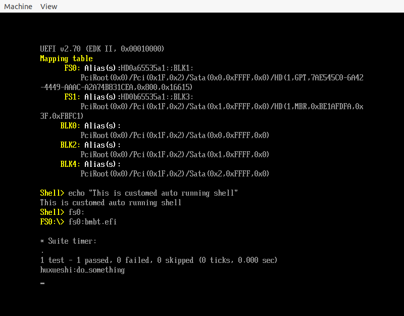

# UEFI 实战 : 将 QEMU 转换为 UEFI Application
这是 [裸金属二进制翻译器的设计与实现](https://martins3.github.io/ppt/repo/2021-8-24/index.html) 的一部分，
因为 QEMU 调用了很多复杂的系统调用，比如 epoll io_uring 之类，
在此之前，我们已经对于 QEMU 进行了很多删减和重构，作为中间的一环，我们需要首先将 QEMU 变为 UEFI application。

## 移除掉 glib 依赖
因为 glib 依赖了很多 glibc 的代码，但是实际上简化之后的 QEMU 不需要那么多:
- https://gitlab.gnome.org/GNOME/glib/-/blob/main/INSTALL.in
- 使用的分支 2.70.2

最后简化之后统计结果如下:
```txt
      14 text files.
      14 unique files.
       0 files ignored.

github.com/AlDanial/cloc v 1.82  T=0.01 s (1243.2 files/s, 219336.7 lines/s)
-------------------------------------------------------------------------------
Language                     files          blank        comment           code
-------------------------------------------------------------------------------
C                                4            269            624            891
C/C++ Header                    10             76            198            412
-------------------------------------------------------------------------------
SUM:                            14            345            822           1303
-------------------------------------------------------------------------------
```
对比 glib 本身的库，算是非常精简了。

## 为什么我们会采用将 QEMU 变为 UEFI Application

为什么说 UEFI 只是一个过渡阶段的辅助工具?
- UEFI 提供的各种 API 接口都是针对于单核的
- UEFI 各种接口的实现还是存在很多封装
- UEFI 的设备驱动和 BMBT 的设备直通都在操作设备，似乎难以找到一个简洁的方法来防止连着直接出现冲突
- 当前 UEFI 的 timer 是 DEFAULT_TIMER_TICK_DURATION (100 us)，如果想要实现精度更高的 timer，那么就需要重构之前的 timer 系统，很刺激。

最大的挑战在于, UEFI 自身的 driver 和 guest 是互相冲突的， 当然我们可以使用很多方法让设备不冲突:
- 理解 driver binding 的原理，让我们需要的 controller 和 driver 不要 binding 到一起
- 理解 ExitBootServices 的效果，让我们需要的服务不要消失
- 注册 fake driver 来替代原来的 driver

但是这些解决方法都不是非常的优雅，如果不去调用 ExitBootServices，那么就可以保证一直是有 UEFI 的 boot service 可以使用的，但是 printf 之类的会和 guest 交替访问设备。如果不使用 printf 那么为什么还需要依赖一个这么大的 UEFI 基础设备，如果修改 printf 的话，那么为什么不彻底一点直接切分过来。

所以，让 guest 可以使用 UEFI 的封装的接口实现串口输出，不要对于 UEFI 的源代码进行修改, 验证一下想法，确定需要移植的接口到底都存在那些(感觉其实不多，而且还可以从 UEFI 中抄过来)。之后，从 UEFI 中间确定内存分配的代码，以及各种需要移植的代码。
相当于说，因为 edk2 中的体用的 StdLib 更加少，使用 edk2 是一个进行逐步跳转的好时机。

## 构建项目
- 将 bmbt 放到 AppPkg/Applications 下
- 在 AppPkg.dec 中添加如下的 header 引用
```c
[Includes]
  Applications/bmbt/include
  Applications/bmbt/env/uefi/include
  Applications/bmbt/capstone/include
  Applications/bmbt/libc/include # 当使用本地的 libc 的时候，那么就使用这一个函数
```
- 使用 uefi.sh 应该可以得到如下结果


为了进行编译为使用 UEFI StdLib 的:
1. 将 AppPkg.dec 中去掉 Applications/bmbt/libc
2. 将 bmbt.inf 的 [Packages] 中增加 StdLib/StdLib.dec
3. 在 env/uefi/include/uapi/env.h `#define USE_UEFI_LIBC` 中添加
