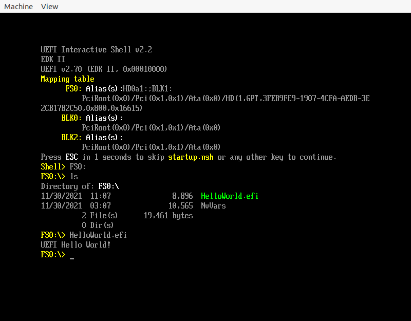
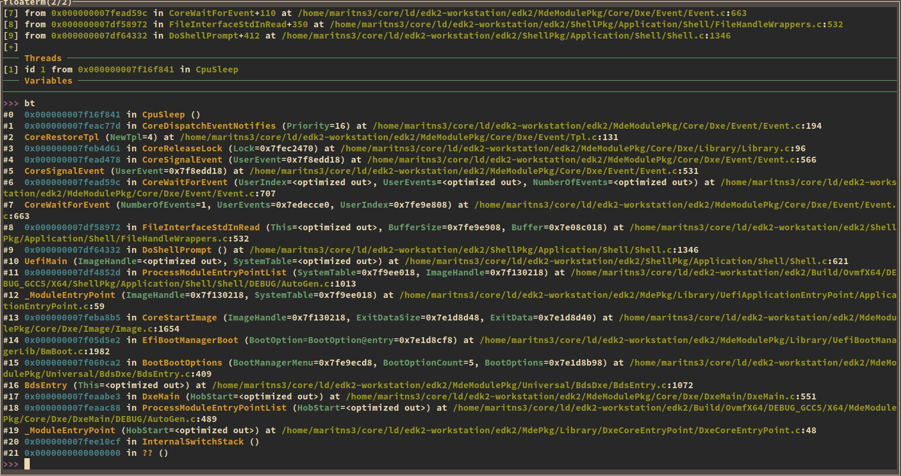

# Linux UEFI 学习环境搭建

<!-- vim-markdown-toc GitLab -->

* [运行第一个 UEFI 程序](#运行第一个-uefi-程序)
  * [编译 efi](#编译-efi)
  * [运行 efi](#运行-efi)
* [编译 edk2](#编译-edk2)
* [构建基于 edk2 的 HelloWorld](#构建基于-edk2-的-helloworld)
* [构建基于 StdLib 的 HelloWorld](#构建基于-stdlib-的-helloworld)
* [如何让自动运行 efi 程序](#如何让自动运行-efi-程序)
* [在 Linux 上调试 edk2](#在-linux-上调试-edk2)
  * [使用 gdb 调试](#使用-gdb-调试)
  * [使用 debugcon 调试](#使用-debugcon-调试)
* [生成 compile_commands.json](#生成-compile_commandsjson)
* [内核作为 efi 文件启动](#内核作为-efi-文件启动)
* [让程序运行 shell 命令](#让程序运行-shell-命令)
* [使用 Rust 编写 UEFI Application](#使用-rust-编写-uefi-application)
* [资源](#资源)

<!-- vim-markdown-toc -->

## 运行第一个 UEFI 程序
### 编译 efi
参考教程 https://www.rodsbooks.com/efi-programming/hello.html
但是这个教程有点老，参考 [stackoverflow](https://stackoverflow.com/questions/31514866/how-to-compile-uefi-application-using-gnu-efi/31517520) 可以修复。

或者参考[我写的](https://github.com/Martins3/Martins3.github.io/tree/master/docs/uefi/uefi/gnuefi)，将其中的 main.c 和 Makefile 拷贝出来，make 就可以得到 hello.efi 了

### 运行 efi
参考 [osdev](https://wiki.osdev.org/UEFI#Linux.2C_root_not_required) 上，我构建出来了一个小脚本
[uefi.sh](https://github.com/Martins3/Martins3.github.io/tree/master/docs/uefi/uefi/uefi.sh)，其参数为将要测试的 efi.
然后在 QEMU 的图形界面中，可以看到 UEFI shell, 在其中输入 `FS0:`，最后执行程序。

## 编译 edk2
参考 [官方文档](https://github.com/tianocore/tianocore.github.io/wiki/Common-instructions)

```bash
git clone https://github.com/tianocore/edk2.git
cd edk2
git submodule update --init
make -C BaseTools
source edksetup.sh # 几乎所有的教程都是 . edksetup.sh，但是 source edksetup.sh 也可以
```

然后修改 Conf/target.txt 中修改
```txt
ACTIVE_PLATFORM       = MdeModulePkg/MdeModulePkg.dsc # 想要编译的内容
TARGET_ARCH           = X64 # 取决于你要运行的 Guest 机器的架构
TOOL_CHAIN_TAG        = GCC5
MAX_CONCURRENT_THREAD_NUMBER = 9 # 这个取决于你的机器 CPU 核心数量
```

关于编译器，官方文档反复强调是 gcc5，但是参考 [stackoverflow](https://stackoverflow.com/questions/63725239/build-edk2-in-linux) 实际上系统中的 gcc 是 gcc9 或者 gcc10 也是无所谓的。

最后运行
```sh
build
```

进入到对应的目录测试一下:
```c
➜  X64 git:(master) ✗ pwd
/home/maritns3/core/ld/edk2-workstation/edk2/Build/MdeModule/DEBUG_GCC5/X64
➜  X64 git:(master) ✗ /home/maritns3/core/vn/docs/uefi/uefi/uefi.sh HelloWorld.efi
```


类似，如果想要在 x86 电脑上编译安装 ARM 版本的 edk2，其 Conf/target.txt 对应的配置为:
```txt
ACTIVE_PLATFORM       = ArmVirtPkg/ArmVirtQemu.dsc
TARGET_ARCH           = AARCH64
TOOL_CHAIN_TAG        = GCC5
MAX_CONCURRENT_THREAD_NUMBER = 50
```

参考[这篇 blog](https://damn99.com/2021-06-19-edk2-cross-build-for-amd64/)

运行 build 之前，首先执行：
```sh
export GCC5_AARCH64_PREFIX=aarch64-linux-gnu-          # ubuntu 中
export GCC5_AARCH64_PREFIX=aarch64-unknown-linux-gnu-  # nixos 中
```

## 构建基于 edk2 的 HelloWorld
虽然上面使用 MdeModulePkg 的 HelloWorld，但是 MdeModulePkg 包含的内容过多，现在构建一个更加简单的 HelloWorld

几乎可以参照 https://damn99.com/2020-05-18-edk2-first-app/ 这个来写，但是需要在 .dsc 中添加上
```txt
!include MdePkg/MdeLibs.dsc.inc
```

最后我制作出来了自己的一个[小 demo](https://github.com/Martins3/Martins3.github.io/tree/master/docs/uefi/uefi/BootloaderPkg/)，将其拷贝到 edk2 的目录中。
```sh
build -p BootloaderPkg/BootloaderPkg.dsc
```
也可以设置 Conf/target.txt
```txt
ACTIVE_PLATFORM       = BootloaderPkg/BootloaderPkg.dsc
```
这样直接使用就可以了
```sh
build
```

## 构建基于 StdLib 的 HelloWorld
上面是调用原生的 uefi 接口来构建的程序，实际上，UEFI 提供了 [StdLib](https://github.com/tianocore/edk2-libc)，其尽可能提供和 glibc 相同的接口，这样，很多用户态程序几乎不需要做任何修改就可以
直接编译为 .efi 文件，在 UEFI shell 中运行了。

使用方法很简单:
```sh
# 下载
git clone https://github.com/tianocore/edk2-libc
# 将 edk2-libc 的内容拷贝到 edk2 中
mv edk2-libc/* path/to/edk2
cd path/to/edk2
# 编译
build -p AppPkg/AppPkg.dsc
```
其实 edk2-libc 主要就是两个文件夹:
1. StdLib : 利用 UEFI native 的接口实现 glib 的接口
2. AppPkg : 各种测试程序，甚至包括 lua 解释器

## 如何让自动运行 efi 程序
为了运行刚刚编译出来的 Main.efi，接班操作步骤是:
- 启动 QEMU 之后
- fs0:
- Mian.efi

要是能够 QEMU 启动之后，可以自动执行 Main.efi 就可以大大加快调试的速度了:

1. 我们知道 UEFI 启动之后会自动执行 startup.nsh
2. 在 edk2 中搜索 startup.nsh 可以找到 OvmfPkg/PlatformCI/PlatformBuild.py, 了解到 QEMU 可以通过下面的参数实现
```sh
-drive file=fat:rw:${VirtualDrive},format=raw,media=disk
```
3. VirtualDrive 中的内容见 https://github.com/Martins3/Martins3.github.io/tree/master/docs/uefi/uefi/VirtualDrive


- https://stackoverflow.com/questions/22641605/running-an-efi-application-automatically-on-boot
- https://stackoverflow.com/questions/50011728/how-is-an-efi-application-being-set-as-the-bootloader-through-code

在 shell 会等待 5s 来等待程序的执行, 在 ShellPkg/Application/Shell/Shell.c 中修改为等待时间 0s

## 在 Linux 上调试 edk2
### 使用 gdb 调试
主要参考 https://retrage.github.io/2019/12/05/debugging-ovmf-en.html

在 Linux 调试的主要难度在于如何获取调试的符号信息，但是 edk2 生成的符号信息进行一些装换之后才可以被 gdb 识别，
具体细节参考引用 blog，这里我描述一下基本步骤:

1. 准备环节，只需要操作一次
```sh
# 生成 /tmp/ovmf.log 启动包含各个 module 加载的地址信息
./uefi.sh
# 根据 /tmp/ovmf.log 和 Build 下 .debug 生成 gdb 可识别调试信息
./uefi.sh -g
```
2. 调试:
```sh
# 在第一次窗口，启动 QEMU
./uefi.sh -s
# 在第二个窗口，启动 gdb
./uefi.sh -d
```

最后效果:


需要注意的事情是，打断点需要使用 [hardware breakpoint](https://stackoverflow.com/questions/8878716/what-is-the-difference-between-hardware-and-software-breakpoints)

### 使用 debugcon 调试
在源码中添加调试语句，然后重新编译运行
```c
  DEBUG((DEBUG_INFO, "%s\n", "hello"));
```

## 生成 compile_commands.json
虽然 edk2 是一个和操作系统无关，但是 edk2 编译出来了的 efi 格式实际上是 Windows 二进制格式，项目的构建也是 VS 的风格。
想要在 vim 愉快阅读代码需要生成 compile_commands.json，但是这个编译系统不是 CMake, Make, Ninja 之类的，想要生成，并不容易。

从 https://bugzilla.tianocore.org/show_bug.cgi?id=2850 可以找到 https://github.com/makaleks/edk2-tools/tree/master/compilation_database_patch

几乎是按照这个 patch 来搞的，但是似乎这个 patch 有点问题，总是会提示报错:

```txt
Error: cc or cc_flags is not defined!
```

稍微添加一些调试语句调试一下，在启动获取下面的 log
```txt
{'cmd': '"$(CC)" $(DEPS_FLAGS) $(CC_FLAGS) -c -o '
        '/home/maritns3/core/ld/edk2-workstation/edk2/Build/Bootloader/DEBUG_GCC5/X64/MdePkg/Library/BaseMemoryLib/BaseMemoryLib/OUTPUT/./CompareMemWrapper.obj '
        '$(INC) '
        '/home/maritns3/core/ld/edk2-workstation/edk2/MdePkg/Library/BaseMemoryLib/CompareMemWrapper.c',
 'deps': ['$(MAKE_FILE)',
          '$(DEBUG_DIR)/AutoGen.h',
          '$(WORKSPACE)/MdePkg/Library/BaseMemoryLib/CompareMemWrapper.c'],
 'target': '$(OUTPUT_DIR)/CompareMemWrapper.obj'}
```

分析
/home/maritns3/core/ld/edk2-workstation/edk2/Build/Bootloader/DEBUG_GCC5/X64/TOOLS_DEF.X64 中内容，发现，原来是新的 edk2 将
其中的 CC 修改为 CC_PATH，修改之后，这个 patch 就可以使用了。

此外，对于这个 patch 我做了两个小小的调整:
- 原来的这个配置是只能单线程编译的，我在上面添加了一个文件锁，从而可以多线程编译
- 原来的 compile_commands.json 都是生成在 package 下的，比如 AppPkg/compile_commands.json，如果同时阅读多个 pkg 的代码，还需要手动将这些 compile_commands.json 合并起来，我调整了一下脚本，让所有的信息都是放到 edk2 的根路径上的

对于 tag 为 `edk2-stable202111`
1. 将 [edk2_compile_commands.py](https://github.com/Martins3/Martins3.github.io/tree/master/docs/uefi/uefi/compile_commands_patch/edk2_compile_commands.py) 拷贝到 $(EDK2_ROOT)/BaseTools/Source/Python/edk2_compile_commands.py 中:
2. 修改 BaseTools/Source/Python/AutoGen/GenMake.py
  - 在文件头修改 `from edk2_compile_commands import update_compile_commands_file`
  - 在 1067 行下添加 `update_compile_commands_file(TargetDict, self._AutoGenObject, self.Macros)`
3. build -p OvmfPkg/OvmfPkgX64.dsc
4. build -p AppPkg/AppPkg.dsc

## 内核作为 efi 文件启动
内核实际上可以作为 efi 文件在 UEFI 上执行, 具体参考[内核文档](https://www.kernel.org/doc/Documentation/efi-stub.txt)

## 让程序运行 shell 命令
参考[^2]

```c
#include <Library/ShellLib.h>
#include <Library/UefiLib.h>
#include <Uefi.h>

EFI_STATUS
EFIAPI
UefiMain(IN EFI_HANDLE ImageHandle, IN EFI_SYSTEM_TABLE *SystemTable) {
  EFI_STATUS Status;

  ShellExecute(&ImageHandle, L"echo Hello World!", FALSE, NULL, &Status);

  return Status;
}
```

```inf
## @file
#  A simple, basic, EDK II native, "hello" application.
#
#   Copyright (c) 2010 - 2018, Intel Corporation. All rights reserved.<BR>
#   SPDX-License-Identifier: BSD-2-Clause-Patent
#
##

[Defines]
  INF_VERSION                    = 0x00010006
  BASE_NAME                      = Hello
  FILE_GUID                      = a912f198-7f0e-4803-b908-b757b806ec83
  MODULE_TYPE                    = UEFI_APPLICATION
  VERSION_STRING                 = 0.1
  ENTRY_POINT                    = UefiMain

#
#  VALID_ARCHITECTURES           = IA32 X64
#

[Sources]
  Hello.c

[Packages]
  MdePkg/MdePkg.dec
  ShellPkg/ShellPkg.dec

[LibraryClasses]
  UefiLib
  ShellCEntryLib
  ShellLib
```
## 使用 Rust 编写 UEFI Application
- 在 https://gil0mendes.io/blog/an-efi-app-a-bit-rusty/ 介绍了一下使用 Rust 构建 UEFI 的动机。
- 进一步的，在 https://github.com/rust-embedded/book 中介绍了在嵌入式项目中如何使用 Rust.

我们使用 [uefi-rs](https://github.com/rust-osdev/uefi-rs) 来感受一下。
进入到 template 目录中，按照 https://github.com/rust-osdev/uefi-rs/blob/master/BUILDING.md 操作即可。

相对 edk2 而言，uefi-rs 的代码量非常少，如果你恰好是 Rust 高手，读读其代码还是相当有意思的。

## 资源
- Robin 的 blog: http://yiiyee.cn/blog/
- https://wiki.osdev.org/GNU-EFI
- https://wiki.osdev.org/POSIX-UEFI
- https://edk2-docs.gitbook.io/edk-ii-build-specification/

<script src="https://giscus.app/client.js"
        data-repo="martins3/martins3.github.io"
        data-repo-id="MDEwOlJlcG9zaXRvcnkyOTc4MjA0MDg="
        data-category="Show and tell"
        data-category-id="MDE4OkRpc2N1c3Npb25DYXRlZ29yeTMyMDMzNjY4"
        data-mapping="pathname"
        data-reactions-enabled="1"
        data-emit-metadata="0"
        data-theme="light"
        data-lang="zh-CN"
        crossorigin="anonymous"
        async>
</script>

[^1]: https://stackoverflow.com/questions/800030/remove-carriage-return-in-unix
[^2]: https://stackoverflow.com/questions/38738862/run-a-uefi-shell-command-from-inside-uefi-application
