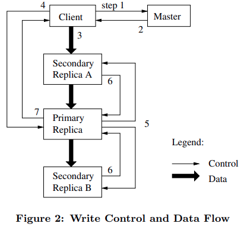

# 6.824

- https://github.com/ivanallen/thor : **mit : 首先观看的内容 其他的到时候再说**
- https://github.com/wlgq2/MIT-6.824-2018 : 6.824 的某一个人的作业
- https://blog.microdba.com/archive/?tag=6.824 : 对于课程的记录
https://www.zhihu.com/question/29597104/answer/128443409 : pingcap 的作者谈如何学习 MIT 6.218


<!-- vim-markdown-toc GitLab -->

- [Notes in course](#notes-in-course)
  - [Lecture 1](#lecture-1)
  - [Lecture 2](#lecture-2)
    - [l-rpc.txt](#l-rpctxt)
    - [faq.txt](#faqtxt)
  - [lecture 3](#lecture-3)
    - [l-gfs.txt](#l-gfstxt)
    - [gfs-faq.txt](#gfs-faqtxt)
  - [Lecture 4](#lecture-4)
  - [Lecture 5](#lecture-5)
  - [Lecture 8](#lecture-8)
    - [l-zookeeper.txt](#l-zookeepertxt)
  - [Lecture 12](#lecture-12)
  - [Lecture 13](#lecture-13)

<!-- vim-markdown-toc -->


## [Notes in course](https://pdos.csail.mit.edu/6.824/schedule.html)

### Lecture 1
- [ ] 完全没有看


### Lecture 2
- https://gobyexample.com/waitgroups
- https://gobyexample.com/select

#### l-rpc.txt
> 这里分析三种模式来实现 crawler

* **When to use sharing and locks, versus channels?**
Most problems can be solved in either style What makes the most sense depends on how the programmer thinks
- state -- sharing and locks
- communication -- channels
For the 6.824 labs, I recommend sharing+locks for state, and sync.Cond or channels or time.Sleep() for waiting/notification.

RPC 的设计
naive 的方法: client 发送消息，然后等待，如果 timeout，重新发送，多次之后还是不行就返回错误
问题 : 但是如果由于网络延迟，两个 client request 都到达 server, server 执行了两次操作
措施:
- client 每一次请求都带上一个标志
- 每一个 client 的 seg 需要相互区分
- seg 需要回收

> - [ ] 不确定 exactly once 是否需要更多的措施

exactly once : unbounded retries plus duplicate detection plus fault-tolerant service

#### faq.txt
**At a high level, a chan is a struct holding a buffer and a lock.**
Sending on a channel involves acquiring the lock, waiting (perhaps
releasing the CPU) until some thread is receiving, and handing off the
message. Receiving involves acquiring the lock and waiting for a
sender. You could implement your own channels with Go sync.Mutex and
sync.Cond.


WaitGroup is fairly special-purpose; it's only useful when waiting
for a bunch of activities to complete. Channels are more
general-purpose; for example, you can communicate values over
channels. You can wait for multiple goroutines using channels, though it
takes a few more lines of code than with WaitGroup.

**A slice is an object that contains a pointer to an array and a start and
end index into that array.** This arrangement allows multiple slices to
share an underlying array, with each slice perhaps exposing a different
range of array elements.

Here's a more extended discussion: **https://blog.golang.org/go-slices-usage-and-internals**

### lecture 3

#### l-gfs.txt
[首先看看知乎](https://zhuanlan.zhihu.com/p/28155582), [再看看 blog](https://mr-dai.github.io/gfs/)

> 青睐追加操作而不是覆写操作的原因是明显的：GFS 针对追加操作做出了显著的优化，这使得这种数据写入方式的性能更高，而且也能提供更强的一致性语义。尽管如此，追加操作 at least once 的特性仍使得客户端可能读取到填充或是重复数据，这要求客户端能够容忍这部分无效数据。一种可行的做法是在写入的同时为所有记录写入各自的校验和，并在读取时进行校验，以剔除无效的数据；如果客户端无法容忍重复数据，客户端也可以在写入时为每条记录写入唯一的标识符，以便在读取时通过标识符去除重复的数据。
> 
> 在客户端对某个 Chunk 做出修改时，GFS 为了能够处理不同的并发修改，会把该 Chunk 的 Lease 交给某个 Replica，使其成为 Primary：Primary 会负责为这些修改安排一个执行顺序，然后其他 Replica 便按照相同的顺序执行这些修改。
> 
> 除外，当 Chunk Server 失效时，用户的写入操作还会不断地进行，那么当 Chunk Server 重启后，Chunk Server 上的 Replica 数据便有可能是已经过期的。为此，Master 会为每个 Chunk 维持一个版本号，以区分正常的和过期的 Replica。每当 Master 将 Chunk Lease 分配给一个 Chunk Server 时，Master 便会提高 Chunk 的版本号，并通知其他最新的 Replica 更新自己的版本号。如果此时有 Chunk Server 失效了，那么它上面的 Replica 的版本号就不会变化。
>
> 在 Chunk Server 重启时，Chunk Server 会向 Master 汇报自己所持有的 Chunk Replica 及对应的版本号。如果 Master 发现某个 Replica 版本号过低，便会认为这个 Replica 不存在，如此一来这个过期的 Replica 便会在下一次的 Replica 回收过程中被移除。除外，Master 向客户端返回 Replica 位置信息时也会返回 Chunk 当前的版本号，如此一来客户端便不会读取到旧的数据。

- [ ] blog 讲解算是比较清楚了，讲义的内容并不是自洽的，其中提出了很多考虑的问题，但是暂时都无法理解。
- [ ] 把视频看完，应该就问题不大了吧 !

Why is distributed storage hard?
- high performance -> shard data over many servers
- many servers -> constant faults
- fault tolerance -> replication
- replication -> potential inconsistencies
- better consistency -> low performance

What was new about this in 2003? How did they get an SOSP paper accepted?
- Not the basic ideas of distribution, sharding, fault-tolerance.
- Huge scale.
- Used in industry, real-world experience.
- Successful use of weak consistency.
- Successful use of single master.

```
Master state
  in RAM (for speed, must be smallish):
    file name -> array of chunk handles (nv)
    chunk handle -> version # (nv)
                    list of chunkservers (v)
                    primary (v)
                    lease time (v)
  on disk:
    log
    checkpoint
```

- [ ] chunk handle 中间的 primary 和 lease time 是什么东西 ?

What are the steps when client C wants to read a file?
1. C sends filename and offset to master M (if not cached)
2. M finds chunk handle for that offset
3. M replies with list of chunkservers (only those with latest version)
4. C caches handle + chunkserver list
5. C sends request to nearest chunkserver (chunk handle, offset)
6. chunk server reads from chunk file on disk, returns

What are the steps when C wants to do a "record append"?
1. C asks M about file's last chunk
2. if M sees chunk has no primary (or lease expired):
   - if no chunkservers w/ latest version #, error
   - pick primary P and secondaries from those w/ latest version #
   - increment version #, write to log on disk
   - tell P and secondaries who they are, and new version #
   - replicas write new version # to disk
3. M tells C the primary and secondaries
4. C sends data to all (just temporary...), waits
5. C tells P to append
6. P checks that lease hasn't expired, and chunk has space
7. P picks an offset (at end of chunk)
8. P writes chunk file (a Linux file)
9. P tells each secondary the offset, tells to append to chunk file
10. P waits for all secondaries to reply, or timeout
    * secondary can reply "error" e.g. out of disk space
11. P tells C "ok" or "error"
12. C retries from start if error



- [ ] step 2 中间的 chunk 没有 primary 是什么意思 ?
  - [ ] lease expired ?
- [ ] primary and secondary replicas

#### gfs-faq.txt

Q: How acceptable is it that GFS trades correctness for performance
and simplicity?

A: This a recurring theme in distributed systems. Strong consistency
usually requires protocols that are complex and require chit-chat
between machines (as we will see in the next few lectures). By
exploiting ways that specific application classes can tolerate relaxed
consistency, one can design systems that have good performance and
sufficient consistency. For example, GFS optimizes for MapReduce
applications, which need high read performance for large files and are
OK with having holes in files, records showing up several times, and
inconsistent reads. On the other hand, GFS would not be good for
storing account balances at a bank.

Q: Suppose S1 is the primary for a chunk, and the network between the
master and S1 fails. The master will notice and designate some other
server as primary, say S2. Since S1 didn't actually fail, are there
now two primaries for the same chunk?

A: That would be a disaster, since both primaries might apply
different updates to the same chunk. Luckily GFS's lease mechanism
prevents this scenario. The master granted S1 a 60-second lease to be
primary. S1 knows to stop being primary when its lease expires. The
master won't grant a lease to S2 until the previous lease to S1
expires. So S2 won't start acting as primary until after S1 stops.

> 利用 lease 来解决两个 primary 的问题


### Lecture 4
[看看 blog](https://mr-dai.github.io/primary-backup-replication/)

- [ ] 讲解的很清晰了，原来的文章就不看了

### Lecture 5

- [ ] raft 既然解决了 consensus 问题，那么还存在什么问题呀 ?


### Lecture 8

#### l-zookeeper.txt

[为什么需要 Zookeeper](https://zhuanlan.zhihu.com/p/69114539)

> 所以我们需要这个存储master信息的服务器集群，做到当信息还没同步完成时，不对外提供服务，阻塞住查询请求，等待信息同步完成，再给查询请求返回信息。
> 
> 这样一来，请求就会变慢，变慢的时间取决于什么时候这个集群认为数据同步完成了。
> 
> 假设这个数据同步时间无限短，比如是1微妙，可以忽略不计，那么其实这个分布式系统，就和我们之前单机的系统一样，既可以保证数据的一致，又让外界感知不到请求阻塞，同时，又不会有SPOF（Single Point of Failure）的风险，即不会因为一台机器的宕机，导致整个系统不可用。
> 
> 这样的系统，就叫分布式协调系统。谁能把这个数据同步的时间压缩的更短，谁的请求响应就更快，谁就更出色，Zookeeper就是其中的佼佼者。
> 
> 它用起来像单机一样，能够提供数据强一致性，但是其实背后是多台机器构成的集群，不会有SPOF。

[看看blog](https://mr-dai.github.io/zookeeper/)

- [ ] 在 Lecture 7 中，我们通过阅读 Spinnaker 的论文了解了如何使用 Paxos 来构建一个数据存储，其论文提到 Spinnaker 使用了 ZooKeeper 来进行集群协调以简化自身的实现，那这次我们就可以来了解一下 ZooKeeper 都提供了哪些功能了。
  - [ ] 好家伙，原来课程还是需要好好看看的啊 
  - https://mr-dai.github.io/spinnaker/

> 从功能上看，ZooKeeper 提供了一个基于目录树结构的内存型 KV 存储：数据统一以 ZNode 的形式保存在各个 ZooKeeper 节点的内存中，数据的变更由 Leader 节点通过 Zab 协议同步给所有的 Follower 节点。

### Lecture 12

- [ ] 并发控制 和可序列化为什么被放到一起了

- [ ] 12.4 和 12.5 看的我心态爆炸


### Lecture 13
[看看blog](https://www.jianshu.com/p/6ae6e7989161)

