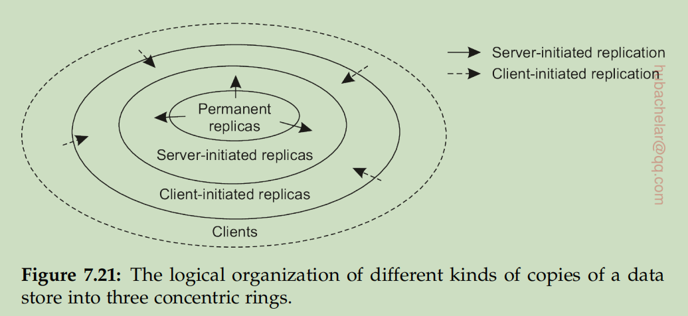

# Distributed System : Consistency and replication

Data
are generally replicated to enhance reliability or improve performance. One
of the major problems is keeping replicas consistent.
> 备份是好的，但是如何处理备份才是好的。

> 这个序言基本没有看懂啊!

Consistency models 是什么 ?
client-centric consistency models 添加了什么限制 ?

> 本章内容 : model 和 实现，实现划分为
1. First of all, we start with
concentrating on managing replicas, which takes into account not only the
placement of replica servers, but also how content is distributed to these
servers
2. The second issue is how replicas are kept consistent.
3. Also, attention is paid to caching protocols, which form a special case of consistency protocols.

## 7.1 Introduction
On the other hand, to keep all copies consistent generally requires
global synchronization, which is inherently costly in terms of performance.

In many cases, the only real solution is to relax the consistency constraints.

## 7.2 Data-centric consistency models
> 描述了三种可以放松的方法，然后介绍 conit ，可能是用于正规的描述其。

To define inconsistencies, Yu and Vahdat introduce a consistency unit, abbreviated to **conit**.

* **Consistent ordering of operations**

> 讲解了 seqential consistency 和 Causal consistency
> 分析了Consistency versus coherence的区别，但是两者之间的关系暂时无法理解。

If event b is caused or influenced by an earlier event a, *causality requires* that everyone else first see a, then see b.

* **Eventual consistency**

These examples can be viewed as cases of (large scale) distributed and
replicated databases that tolerate a relatively high degree of inconsistency.
They have in common that if no updates take place for a long time, all replicas
will gradually become consistent, that is, have exactly the same data stored.
This form of consistency is called eventual consistency

## 7.3 Client-centric consistency models

Data-centric consistency models aim at providing a systemwide consistent
view **on a data store**. An important assumption is that concurrent processes
may be simultaneously updating the data store, and that it is necessary to
provide consistency in the face of such concurrency.

By introducing special client-centric consistency models, it turns out that many
inconsistencies can be hidden in a relatively cheap way

> 举了一个例子，Alice 访问不同的 relicas 的时候，发现之前的操作丢失，问题的解决方法就是 ...

* **Monotonic reads**

A (distributed) data store is said to provide monotonic-read consistency if the
following condition holds:
If a process reads the value of a data item x, any successive read operation
on x by that process will always return that same value or a more recent
value

* **Monotonic writes**

In a monotonic-write consistent store, the following condition holds:
A write operation by a process on a data item x is completed before any
successive write operation on x by the same process.

* **Read your writes**

A data store is said to provide read-your-writes consistency, if the following condition holds:
The effect of a write operation by a process on data item x will always be seen by a successive read operation on x by the same process.

* **Writes follow reads**

A data store is said to provide writes-follow-reads consistency, if the following holds.
A write operation by a process on a data item x following a previous read operation on x by the same process is guaranteed to take place on the same or a more recent value of x that was read.

> 虽然不知道这四个协议都是搞什么蛇皮的，但是算是知道 client-centric 的含义了，从process 的读写角度来分析问题。

## 7.4 Replica management

A key issue for any distributed system that supports replication is to decide
where, when, and by whom replicas should be placed, and subsequently
which mechanisms to use for keeping the replicas consistent.

The placement problem itself should be split into two subproblems:
1. that of placing replica servers, 
2. and that of placing content.

* **Finding the best server location**

Likewise, connectivity continues to improve, making precisely locating servers less critical.

> 服务器的地址重要性的下降了。

* **Content replication and placement**

When it comes to content replication and placement, three different types of
replicas can be distinguished logically organized as shown in Figure 7.21.

Replica management also deals with propagation of (updated) content to the
relevant replica servers. There are various trade-offs to make.

An important design issue concerns what is actually to be propagated. Basically, there are three possibilities:
- Propagate only a notification of an update.
- Transfer data from one copy to another.
- Propagate the update operation to other copies.

Another design issue is whether updates are **pulled** or **pushed**.
In a push-based approach, also referred to as server-based protocols,
updates are propagated to other replicas without those replicas even asking for the updates.

In contrast, in a **pull-based** approach, a server or client requests another
server to send it any updates it has at that moment. Pull-based protocols, also
called client-based protocols, are often used by client caches. 

* **Managing replicated objects**

> object 的含义是什么，deterministic 的含义，total order 

Recall that in this case, the goal
is to group operations on shared data using synchronization variables (e.g.,
in the form of locks). As objects naturally combine data and the operations
on that data, locking objects during an invocation serializes access and keeps
them consistent.

## 7.5 Consistency protocols
A consistency protocol describes an implementation of a specific consistency model. We follow the
organization of our discussion on consistency models by first taking a look at
data-centric models, followed by protocols for client-centric models.

> protocol 也是分为两种类型的

* **Continuous consistency**

- Bounding numerical deviations
- Bounding staleness deviations
- Bounding ordering deviations

* **Primary-based protocols**
  - Remote-write protocols
  - Local-write protocols

> 感觉在哪里见过 primary-based , 应该是 fault tolerance 的位置吧 !

* **Replicated-write protocols**

In replicated-write protocols, write operations can be carried out at multiple
replicas instead of only one, as in the case of primary-based replicas. A
distinction can be made between active replication, in which an operation is
forwarded to all replicas, and consistency protocols based on majority voting
> 可以同时操作多个 replicas ，但是需要使用 majority voting

In contrast to other protocols, updates are generally propagated by means of the write operation that causes the update.

* **Cache-coherence protocols**

> 好像就是体系结构中间的 cache-coherence 的内容 !
