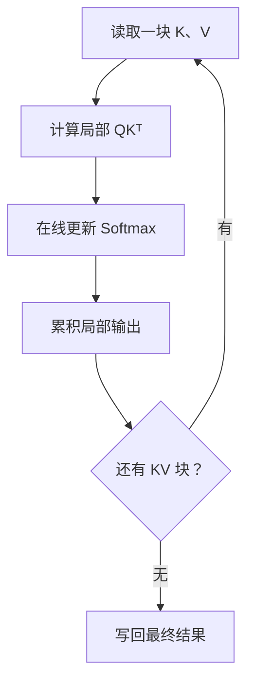

# FlashInfer 实际解决什么？

FlashInfer 不主要是在发明新的 Attention 数学算法，而是在解决它的高性能工程实现。

KV Cache 怎么存

KV Cache 往往被拆成很多不连续的小块，而不是一张完整、连续的矩阵。FlashInfer 使用 block-sparse 等统一格式描述这些块，让 GPU 能高效找到并读取它们。

Attention kernel 怎么写

即使公式相同，不同场景需要不同的 GPU kernel：

prefill 和 decode 不同；
单请求和批量请求不同；
MHA、GQA、MQA 不同；
不同 GPU 架构也不同。

FlashInfer通过模板和 JIT 编译，为具体场景生成优化过的 kernel。

## 简单解释

对，你理解得已经很接近了：它最终还是算 **Q、K、V 的 Attention**。FlashInfer 的优化重点不是改变公式，而是让 GPU 在各种推理场景下少搬数据、少等待、少启动 kernel。

假设现在要生成一个新 token：

* 新 token 产生一个 (Q)
* 之前 8,000 个 token 的 (K,V) 已经存在 KV Cache
* 需要计算：

[
O=\operatorname{softmax}(QK^\top)V
]

FlashInfer 主要在下面几个地方优化。

### 1. 不生成完整的 Attention 矩阵

最朴素的计算是：

1. 从显存读取全部 (K)
2. 计算 (QK^\top)
3. 把分数写回显存
4. 再读取分数
5. 做 softmax
6. 再读取 (V)
7. 计算最终结果

这里最慢的往往不是乘法，而是反复读写显存。

FlashInfer采用类似 FlashAttention 的分块方式：

* 每次只加载一小块 K、V 到更快的片上内存；
* 立即计算这块的 (QK^\top)；
* 在线更新 softmax；
* 立即乘这一块 V；
* 最后只写回结果。

因此，中间那个巨大的 (QK^\top) 分数矩阵不需要完整落到显存。

第一类收益就是：**减少显存访问和中间结果。**

### 2. 把零散的 KV Cache 统一表示

真实系统中的 KV Cache 往往不是一张连续矩阵。

例如，某个请求的 KV 可能位于：

[
[\text{物理块 }7,\ \text{物理块 }19,\ \text{物理块 }3]
]

另外一个请求可能和它共享前两个块。SGLang 的 Radix Tree、vLLM 的 paged KV cache，具体组织方式又不完全相同。

FlashInfer把这些情况统一表示成一种 **block-sparse matrix**：

* 哪些 KV 块存在；
* 它们存在哪里；
* Q 应该读取哪些块；
* 哪些块可以跳过。

这样 GPU kernel 不需要假设 KV 必须连续，也不必为了计算先把零散 KV 复制成一张连续矩阵。

第二类收益是：**避免 KV Cache 的复制、重排和冗余存储。**

### 3. 根据场景选择不同的 tile 大小

GPU 不会一次计算整个矩阵，而是把计算切成许多小块，也就是 tiles。

但不同任务适合的 tile 不一样：

* Prefill：Q 很长，适合较大的二维 tile；
* Decode：通常只有一个 Q，但 KV 很长；
* GQA：多个 Q head 共享一个 KV head；
* 短 KV 和超长 KV 需要不同划分；
* 不同型号 GPU 的共享内存和 tensor core 也不同。

固定使用一种 tile，某些场景就会浪费 GPU。

FlashInfer准备多种 microkernel 和 tile 配置，并根据具体 Attention 形状选择合适的实现。

第三类收益是：**让 kernel 与当前任务和硬件匹配。**

### 4. 把长请求拆开，做负载均衡

假设一个 batch 里有三个请求：

| 请求 |  KV 长度 |
| -- | -----: |
| A  |    100 |
| B  |  1,000 |
| C  | 10,000 |

如果每个请求交给一个 GPU thread block，那么 A 很快完成，B 随后完成，最后整个 GPU 都在等 C。

FlashInfer会把 C 的 KV 拆成多段：

[
10{,}000=2{,}500+2{,}500+2{,}500+2{,}500
]

多个 GPU thread block 同时计算这些部分，然后把部分结果合并。这类方法通常叫 **Split-K**。

注意：这里不是简单地平均 (V) 的结果，因为每一段 softmax 的归一化范围不同。每段还要保存局部最大值和归一化统计量，最后用数学上等价的方式合并。

第四类收益是：**避免一些 GPU 核心已经闲置，另一些还在处理超长请求。**

### 5. 用 JIT 生成专用 kernel

现实中的 Attention 不止标准公式，还可能有：

* causal mask；
* sliding-window mask；
* logit soft-cap；
* ALiBi 或其他位置偏置；
* 不同的数据类型；
* MHA、MQA、GQA；
* 自定义 score transformation。

如果每一步都拆成不同的 kernel：

[
QK^\top \rightarrow \text{加偏置}
\rightarrow \text{加 mask}
\rightarrow \text{softmax}
\rightarrow V
]

每一步都要启动 kernel、读写显存。

FlashInfer允许用户描述 Attention 变体，再通过 JIT 编译，把这些操作融合进一个专用 kernel。

第五类收益是：**kernel fusion，减少中间张量和 kernel 启动次数。**

### 6. 兼顾动态请求和 CUDA Graph

推理服务器里的请求每一步都在变化：

* 有请求刚加入；
* 有请求生成结束；
* KV 长度每一步加一；
* batch 组成一直变化。

但 CUDA Graph 为了降低 CPU 启动 kernel 的开销，希望计算图的形状尽量固定。

FlashInfer把两部分分开：

* 外部 workspace 和 kernel 结构保持固定，方便 CUDA Graph；
* 每一步只更新轻量的调度信息，告诉 GPU 当前有哪些任务、KV 有多长、每个 thread block 做哪一段。

第六类收益是：**既保留 CUDA Graph 的低启动开销，又能适应动态请求。**

所以你可以把 FlashInfer 的优化归纳成三个词：

[
\boxed{\text{少搬数据}+\text{充分并行}+\text{专用编译}}
]

它不是把 (QK^\top V) 换成了另一套算法，而是尽量让计算变成：

> KV 数据从显存读一次，在片上完成尽可能多的运算，同时让所有 GPU 核心都有工作可做。

而且对 **decode** 来说，Q 往往只有一个或几个 token，计算量相对不大，却要读取很长的 KV Cache。因此 decode Attention 经常是 **memory-bound（受显存带宽限制）**，不是算力不够。FlashInfer 很多设计的中心目的，正是把 GPU 的显存带宽尽可能吃满。

