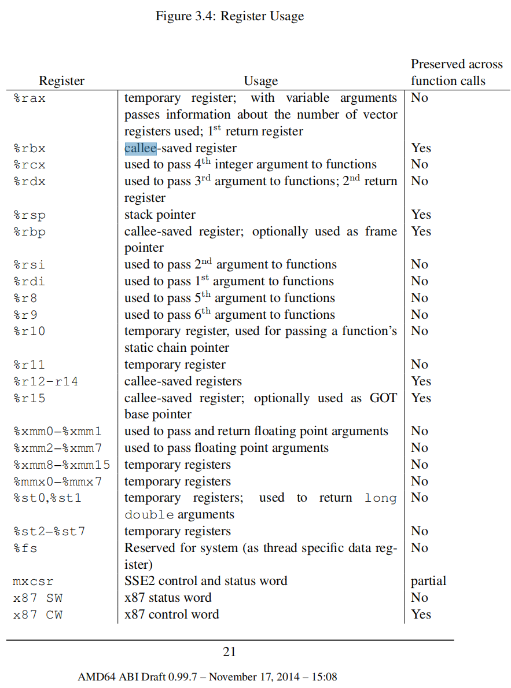

## System V Application Binary Interface

### 3.2 Function Calling Sequence
The AMD64 architecture provides **16** general purpose 64-bit registers.
In addition the architecture provides **16** SSE registers, each 128 bits wide
and **8** x87 floating point registers, each 80 bits wide. 

This subsection discusses usage of each register. Registers `%rbp`, `%rbx` and
`%r12` through `%r15` “belong” to the calling function and the called function is
required to preserve their values. In other words, a called function must preserve
these registers’ values for its caller. Remaining registers “belong” to the called
function. If a calling function wants to preserve such a register value across a function call, it must save the value in its local stack frame

> 大多數的時候，children possess 根本不會使用到那麼多的參數，所以在編譯的時候，沒有保存

### 3.5 Coding Examples


## call convention
- [ ] 下面的内容需要参考 System V Application Binary Interface 重新分析一下

1. syscall ?
2. interrupt ? 
3. 一般的 ?
4. 32bit 和 64bit 区分 ?

```c
int callee(int, int, int);

int caller(void)
{
	return callee(1, 2, 3) + 5;
}   
```

使用 `-O0 -m32` 的来实现 32bit 的设置:

```
caller():
        push    ebp
        mov     ebp, esp
        sub     esp, 8
        sub     esp, 4
        push    3
        push    2
        push    1
        call    callee(int, int, int)
        add     esp, 16
        add     eax, 5
        leave
        ret
```

64bit
```
caller():
        push    rbp
        mov     rbp, rsp
        mov     edx, 3
        mov     esi, 2
        mov     edi, 1
        call    callee(int, int, int)
        add     eax, 5
        pop     rbp
        ret
```

问题:
1. leave 是什么意思 ?
2. m32 中间为什么需要 sub esp 和 add esp
    1. 而且两者的数量相加不一致啊 根据 [^1] 的描述，感觉不对啊


clang10 -m32 -O0 的结果:
```
caller():                             # @caller()
        push    ebp
        mov     ebp, esp
        sub     esp, 24
        mov     dword ptr [esp], 1
        mov     dword ptr [esp + 4], 2
        mov     dword ptr [esp + 8], 3
        call    callee(int, int, int)
        add     eax, 5
        add     esp, 24
        pop     ebp
        ret
```
1. 为什么 esp 需要下降 24，这是怎么计算的


➜  /tmp clang -c -o a.o  -O0 -m32 a.c && objdump -d a.o
```
00000000 <caller>:
   0:   55                      push   %ebp
   1:   89 e5                   mov    %esp,%ebp
   3:   53                      push   %ebx
   4:   83 ec 14                sub    $0x14,%esp
   7:   e8 00 00 00 00          call   c <caller+0xc>
   c:   58                      pop    %eax
   d:   81 c0 03 00 00 00       add    $0x3,%eax
  13:   8b 4d 08                mov    0x8(%ebp),%ecx
  16:   c7 04 24 01 00 00 00    movl   $0x1,(%esp)
  1d:   c7 44 24 04 02 00 00    movl   $0x2,0x4(%esp)
  24:   00
  25:   c7 44 24 08 03 00 00    movl   $0x3,0x8(%esp)
  2c:   00
  2d:   89 c3                   mov    %eax,%ebx
  2f:   89 4d f8                mov    %ecx,-0x8(%ebp)
  32:   e8 fc ff ff ff          call   33 <caller+0x33>
  37:   83 c0 05                add    $0x5,%eax
  3a:   03 45 08                add    0x8(%ebp),%eax
  3d:   83 c4 14                add    $0x14,%esp
  40:   5b                      pop    %ebx
  41:   5d                      pop    %ebp
  42:   c3                      ret
```
1. 这个结果明显不对啊，怎么可能解析出来两个 call 指令啊 !
    1. 到底是 gcc 的问题还是 objdump 的问题

[^1]
Calling conventions describe the interface of called code:
- The order in which atomic (scalar) parameters, or individual parts of a complex parameter, are allocated
- How parameters are passed (pushed on the stack, placed in registers, or a mix of both)
- Which registers the called function must preserve for the caller (also known as: callee-saved registers or non-volatile registers)
- How the task of preparing the stack for, and restoring after, a function call is divided between the caller and the callee

Calling conventions, type representations, and name mangling are all part of what is known as an application binary interface (ABI).

> TODO

[^1]: [wiki](https://en.wikipedia.org/wiki/X86_calling_conventions)
