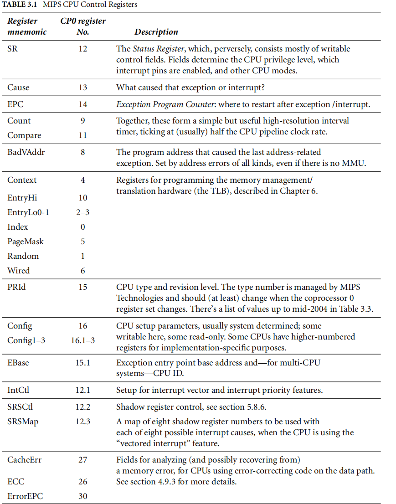
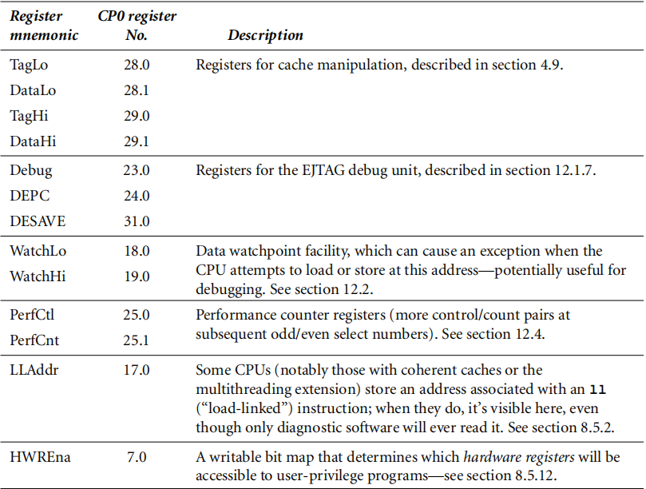

# MIPS arch checksheet


## coprocessor 0
[^2]P56



### Status
[^1]P59

```
|31    28|27|26|25  24| 23 | 22 | 21| 20 | 19  |18  16| 15    8 | 7  | 6  | 5  |4   3|  2  |  1  | 0   | 
+--------+--+--+------+----+----+---+-----------------+---------+--------------------------------------+
| CU3-CU0|0 |FR|  0   | PX | BEV| 0 | SR | NMI |   0  | IM7-IM0 | KX | SX | UX | KSU | ERL | EXL | IE  |
+--------+--+--+------+----+----+---------------------+------------------------------------------------+
```
- IE : 全局中断使能位，1 表示开中断
- EXL : 1 表示 CPU 处于异常模式，即 复位，NMI 和 Cache 错误之外的某种异常
- ERL : 1 表示 CPU 处于错误模式，即 复位，NMI 和 Cache 错误中的某种异常
- KSU : 0 内核态，1 管理态，2 用户态，3 未定义

- [ ] 后面都抄一遍，还是很容易理解的

龙芯启动对于 status 的设置分为两个截断:
1. setup_c0_status ST0_KX|ST0_MM [^1]P59
2. trap_init => per_cpu_trap_init => configure_status => change_c0_status [^1]P85
3. setup_c0_status_sec :
  - [ ] 这个不同之处

### Context
清零是为了保证初始值合法 [^1]P57

## virtual address space

[^1]P81~P82

对于 32 位空间，虚拟地址的高位来标志类型，最高两位 00 或者 11 表示缓存+分页，最高三位 100 缓存不分页，101 表示 不缓存并且不分页。
```
                   +---------------------> ------------------+
                   |                      |   CKSEG2         |
                   |                      |   CKSEG1         |
                   |                      |   CKSEG0         |
                   |  +--------------------------------------+
                   |  |                   |   XKSEG          |
                   |  |                   +------------------+
+------------------+  |                   |                  |
|     KSEG2(1G)    |  |                   |   XKPHYS         |
+------------------+  |                   |                  |
|     XSEG1(512M)  |  |                   +------------------+
+------------------+  |                   |                  |
|     KSEG0(512M)  |  |                   |   XSSEG          |
+---------------------+                   |                  |
|     USEG(2G)     |  |                   +------------------+
+------------------+  |                   |                  |
                   |  |                   |   XUSEG          |
                   |  +--------------------------------------+
                   |                      |   CUSEG          |
                   +----------------------+------------------+
```

- XKPHYS 仅仅在内核态可以访问，**不分页**，是否缓存由地址中间的 59-61 来决定(值为2表示不缓存，3表示缓存，7表示写合并)
- XKSEG 既缓存，又分页。
- XUSEG 最大可以扩展到 4EB 空间，当前龙芯实现 48 bit 空间，也就是 256 TB


在缺省的情况下，龙芯 3 号支持 44 位物理地址，但对于多芯片互联的 CC-NUMA 系统来说，NUMA 节点的编号被编入内存地址的第 44 ~ 47 位, 因此总共需要 48 位物理地址。[^1]58
> - [ ] 有点问题啊!
>   - [ ] 代码在缺省情况下，使用的是 48 位, 根本没有探测当前系统是不是 CC-NUMA
>   - [ ] 好家伙，是支持 48 位的物理地址吗 ?
>   - [ ] 可不可以让 44-47 处理 NUMA，从而可以实现虚拟地址和物理地址的范围完全相同

## KVM

```
4.5 KVM_GET_VCPU_MMAP_SIZE

Capability: basic
Architectures: all
Type: system ioctl
Parameters: none
Returns: size of vcpu mmap area, in bytes

The KVM_RUN ioctl (cf.) communicates with userspace via a shared
memory region.  This ioctl returns the size of that region.  See the
KVM_RUN documentation for details.
```

- [ ] 不可能是所有的 vcpu 吧，看看内核的实现吧 !

## ebase
当操作系统启动过程中，清除 BEV 以后，XLB 重填，XTLB 重填, Cache 错误和其他通用异常的入口都是可以重定位的。[^1]P85

一个四个入口，偏移分别为 0x000, 0x080, 0x100, 0x180。
第一层次的异常向量用 set_handler() 和 set_uncached_handler 两个函数设置(后者专用于 Cache 错误异常)，第二个层次用 set_except_vector() 函数设置。
第一个层次一共四个向量，每个向量有不同的入口，由硬件分发，第二个一共 32 个向量，他们的入口地址相同，但是编号不同，由软件分发。 [^1]P86

中断处理的入口在第二层次的异常向量表里面，其初级中断处理函数是 handle_int() 或者 rollback_handle_int() 中间.

- [ ] 编号应该是在 cause 寄存器中间吧 !

[^1]: 用"芯"探核 基于龙芯的 Linux 内核探索解析
[^2]: See Mips Run 2nd Edition
[^3]: https://www.kernel.org/doc/Documentation/virtual/kvm/api.txt
