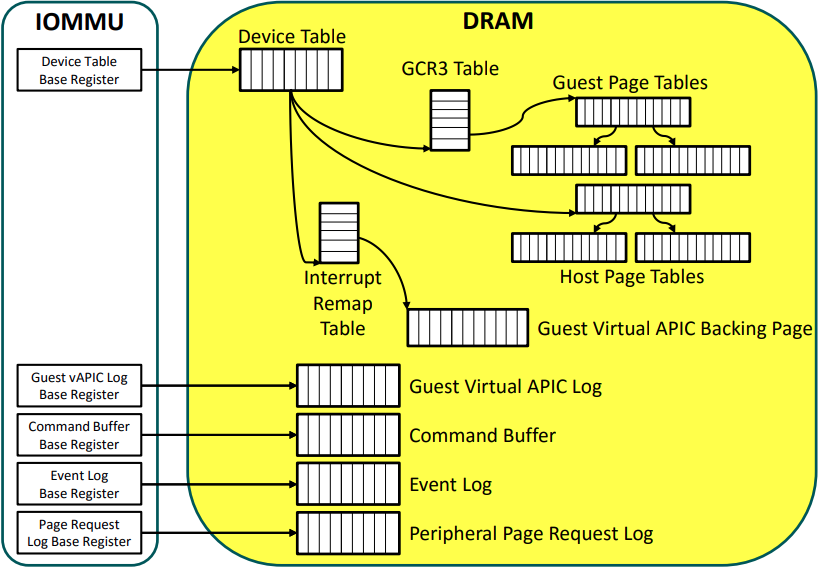
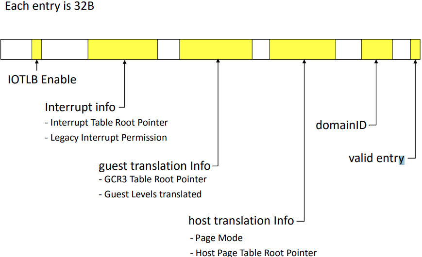
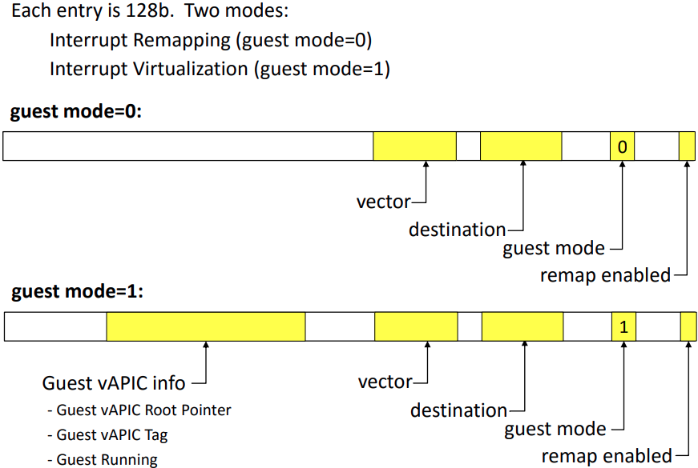

# IOMMU

## https://events19.linuxfoundation.cn/wp-content/uploads/2017/11/Shared-Virtual-Addressing_Yisheng-Xie-_-Bob-Liu.pdf

## isca_iommu_tutorial

> Extraneous IPI adds overheads => Each extra interrupt can add 5-10K cycles ==> Needs dynamic remapping of interrupts

似乎是 core 1 setup 了 io device 的中断，那么之后，io device 的中断到其他的 core 都需要额外的 ipi.
然后使用 iommu 之后，这个中断 remap 的事情不需要软件处理了

在异构计算中间，可以实现 GPU 共享 CPU 的 page table 之后，获取相同的虚拟地址空间。

> IOMMU IS PART OF PROCESSOR COMPLEX

io device 经过各级 pci hub 到达 root complex,  进入 iommu 翻译，然后到达 mmu controller

> Better solution: IOMMU remaps 32bit device physical
> address to system physical address beyond 32bit
> ‒ DMA goes directly into 64bit memory
> ‒ No CPU transfer
> ‒ More efficient

>  If access occurs, OS gets notified and can shut the device & driver down and notifies the user or administrator 

- [ ] 找到这一个 os 来处理  malicious driver 的情况

> Some I/O devices can issue DMA requests to system memory
> directly, without OS or Firmware intervention
> ‒ e.g.,1394/Firewire, network cards, as part of network boot
> ‒ That allows attacks to modify memory before even the OS has a chance to protect against the attacks

> IOMMU redirects device physical address set up by Guest OS driver (= Guest Physical Addresses) to the actual Host System Physical Address (SPA)

很有精神，guest physical address 和 device 看到的 address 通过 mmu 和 iommu 看到同一个位置.

- [ ] 如果说有了 iommu 的存在，DMA 就不需要连续的物理地址空间了吧，那么就是连续的

> Some memory copies are gone, because the same memory is accessed
>
> ‒ But the memory is not accessible concurrently, because of cache policies
>
> Two memory pools remain (cache coherent + non-coherent memory regions)
> 
> Jobs are still queued through the OS driver chain and suffer from overhead
>
> Still requires expert programmers to get performance 

> IOMMU Driver (running on CPU) issues commands to IOMMU
> ‒ e.g., Invalidate IOMMU TLB Entry, Invalidate IOTLB Entry
> ‒ e.g., Invalidate Device Table Entry
> ‒ e.g., Complete PPR, Completion Wait , etc.
>
> Issued via Command Buffer
> ‒ Memory resident circular buffer
> ‒ MMIO registers: Base, Head, and Tail register 

> 
> device remapping table
> 
> interrupt remapping table
> 

最后，其中的补充文章可以看看，了解一下业界的工作内容。比如:
- http://web.cs.ucla.edu/~haoyc/pdf/hpca17.pdf

## https://kernelgo.org/intel_iommu.html

[^1]: http://pages.cs.wisc.edu/~basu/isca_iommu_tutorial/IOMMU_TUTORIAL_ASPLOS_2016.pdf

