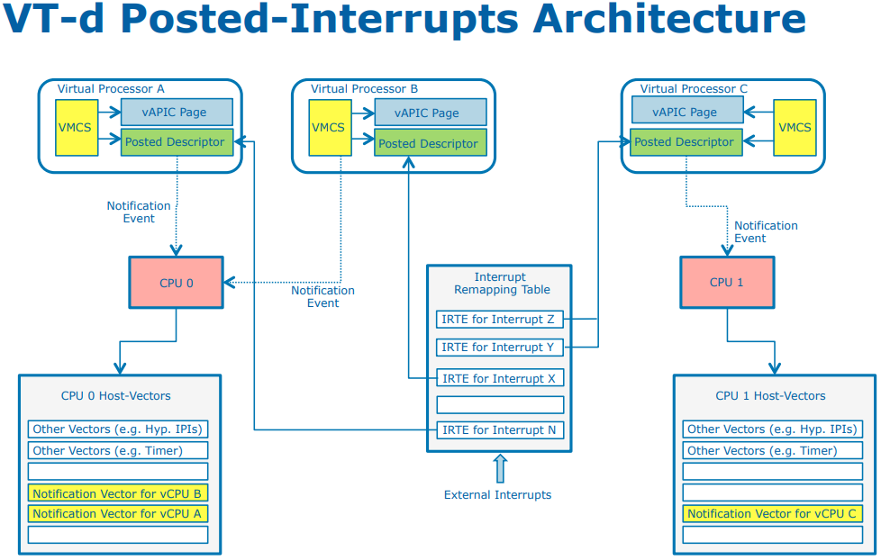

# VT-d
How to enable `IRQ_REMAP` in `make menuconfig`:
Device Drivers ==> IOMMU Hareware Support ==> Support for Interrupt Remapping

intel_setup_irq_remapping ==> iommu_set_irq_remapping, setup `Interrupt Remapping Table Address Register` which hold address **IRET** locate [^3] 163,164

好家伙，才意识到 ITRE 其实存在两种格式，remapped interrupt 的格式下，其功能相当于 IO-APIC 的功能，作为设备和 CPU 之间的联系，而 Posted-interrupt 的格式下，就是我们熟悉的内容。
在 Posted-interrupt 格式下，IRET 中间没有目标 CPU 等字段，而是 posted-interrupt descriptor 的地址

## [manual](https://software.intel.com/sites/default/files/managed/c5/15/vt-directed-io-spec.pdf)

### 2 overview
A VMM must support virtualization of I/O requests from guest software. I/O virtualization may be
supported by a VMM through any of the following models:
1. Emulation
2. New Software Interfaces
3. Assignment
4. I/O Device Sharing

A general requirement for all of above I/O virtualization models is the ability to isolate and restrict
device accesses to the resources owned by the partition managing the device. 

To generalize I/O virtualization and make it applicable to different processor architectures and
operating systems, this document refers to **domains** as abstract isolated environments in the platform
to which a subset of host physical memory is allocated.

DMA remapping provides hardware support for isolation of device accesses to memory, and enables
each device in the system to be assigned to a specific domain through a distinct set of paging
structures. 

When the device attempts to access system memory, the DMA-remapping hardware
intercepts the access and utilizes the page tables to determine whether the access can be permitted;
> device 可以内存访问者，以前是直接访问物理内存

In this model, the VMM restricts itself to enabling direct assignment of devices to their partitions.
Rather than invoking the VMM for all I/O requests from a partition, the VMM is invoked only when
guest software accesses protected resources (such as configuration accesses, interrupt management,
etc.) that impact system functionality and isolation.
> configuration access 还是需要的

*I/O device assignment allows other I/O sharing usages — for example, assigning an I/O device to an
I/O partition that provides I/O services to other user partitions. Remapping hardware enables
virtualization software to choose the right combination of device assignment and software-based
methods for I/O virtualization.*

- [ ] SR IOV 靠什么将 PF 划分为多个 VF

### 5 Interrupt Remapping
This chapter discuss architecture and hardware details for interrupt-remapping and interruptposting.These features collectively are called the interrupt remapping architecture.

## my question
- [ ] mmio 可以 remap 吗 ?
- [ ] dma engine 是一个需要的硬件支持放在哪里了 ?
- [ ] 怎么知道一个设备在进行 dma ?
  - [x] 一个真正的物理设备，当需要发起 dma 的时候，进行的 IO 地址本来应该在 pa, 由于 vm 的存在，实际上是在 gpa 上，需要进行在 hpa 上

## [VT-d Posted Interrupts](https://events.static.linuxfound.org/sites/events/files/slides/VT-d%20Posted%20Interrupts-final%20.pdf)
1. Motivation
  - Interrupt virtualization efficiency
  - *Interrupt migration complexity*
  - *Big requirement of host vector for different assigned devices*

- [ ] migration ?
- [ ] host **vector** for different assigned devices ?

Xen Implementation Details:
- Update IRET according to guest’s modification to the interrupt configuration (MSI address, data)
- Interrupt migration during VCPU scheduling

[^3]: Inside the Linux Virtualization : Principle and Implementation
