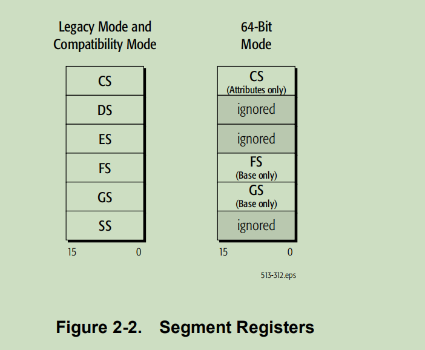
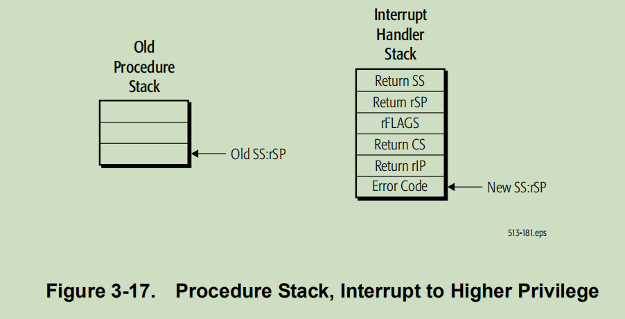

## 1 Overview of the AMD64 Architecture

## 2 Memory Model

### 2.1 Memory Organization
The operating system can use 
separate selectors for code, stack, and data segments for memory-protection purposes, but the base 
address of all these segments is always 0. (For an exception to this general rule, see “FS and GS as 
Base of Address Calculation” on page 17.)
> 依旧使用 code stack data，但是开始位置是0 @todo 如果这样，SS DS 到底是什么状态 ?

 For references to the DS, ES, or SS segments in 64-bit mode, the processor assumes that the 
**base** for each of these segments is zero, neither their segment limit nor attributes are checked, and the 
processor simply checks that all such addresses are in canonical form, as described in “64-Bit 
Canonical Addresses” on page 15. 
> disable 掉的含义应该不是不能访问了，访问其数值总是为0
> @todo 应该写程序测试一下mov $0, cs 之类的操作

> CS 标注的 attributes only 是什么意思

### 2.2 Memory Addressing
 they check bits 63 through the most-significant implemented bit to see if those bits are all 
zeros or all ones. An address that complies with this property is said to be in canonical address form
> 只是从bit 63 检查的吗 ?

Programs provide **effective addresses** to the hardware prior to segmentation and paging translations

### 2.3 Pointers
Near pointers contain only an effective address, which is used as an offset into the current segment. Far
pointers contain both an effective address and a segment selector that specifies one of several
segments. Figure 2-8 illustrates the two types of pointers. 

In 64-bit mode, the AMD64 architecture supports only the flat-memory model in which there is only 
one data segment, so the effective address is used as the virtual (linear) address and **far pointers are not 
needed.**

### 2.4 Stack Operation
@todo *Further application-programming details on the stack mechanism are described in “Control Transfers” 
on page 80*

### 2.5 Instruction Pointer

## 3 General-Purpose Programming
The general-purpose programming model includes the general-purpose registers (GPRs), integer
instructions and operands that use the GPRs, program-flow control methods, *memory optimization
methods*, and *I/O*.

The general-purpose programming model is used to some extent by almost all programs, including
programs consisting primarily of
1. 256-bit or 128-bit media instructions, 
2. 64-bit media instructions, 
3. x87 floating-point instructions, or 
4. system instructions

e registers used in general-purpose application 
programming
 include the
1. general-purpose registers (GPRs),
2. segment registers, 
3. flags register, and
4. instruction-pointer register.

> 64bit 导致寄存器长度扩张了，而且segment register 部分报废，部分用途改变了
> 目前可以使用只有 cs(用户态指示器) gs(似乎用户percpu) fs(???)
> 同时,64 位增加了8个通用寄存器

### 3.4 General Rules for Instructions in 64-Bit Mode
This section provides details of the general-purpose instructions in 64-bit mode, and how they differ 
from the same instructions in legacy and compatibility modes. The differences apply only to general purpose instructions. **Most of them do not apply to SIMD or x87 floating-point instructions**.

*See “64-Bit Canonical Addresses” on page 15 for details. (This rule applies to 
long mode, which includes both 64-bit mode and compatibility mode.)*

#### 3.7 control transfer
Branches can also be used to transfer control to another program or procedure running at a different 
privilege level. In such cases, the processor automatically checks the source program and target 
program privileges to ensure that the transfer is allowed before loading CS:rIP with the new values.
> branch 实现 level 的切换 ? 不是syscall 之类的指令吗 ?

The processor’s protected modes include legacy protected mode and long mode (both compatibility 
mode and 64-bit mode).

The
intermediate privilege levels (1 and 2) are used, for example, by device drivers and library routines 
that access and control a limited set of processor and system resources.

In legacy mode, when a call to a new task occurs, the processor suspends the currently-executing task 
and stores the processor-state information at the point of suspension in the current task’s task-state 
segment (TSS). The new task’s state information is loaded from its TSS, and the processor resumes 
execution within the new task. 
In long mode, hardware task switching is disabled. Task switching is fully described in “Segmented
Virtual Memory” in Volume 2. 
> 所以，在amd64中间，根本就没有TSS 了，还是有其他的用途 ?

Pointers to the interrupt handlers are stored by the operating system in an interrupt descriptor table, or IDT.

Interrupt gates, task gates, and trap gates can be stored in 
the IDT, but **not call gates**. 
> https://wiki.osdev.org/Interrupt_Descriptor_Table#Structure_AMD64 分别说明了几种 gate 的作用

The first 32 of the available 256 interrupt vectors are reserved for internal 
use by the processor—for exceptions (as described below) and other purposes
> 前面32 个放置 exception 

Interrupts are caused either by software or hardware. The INT, INT3, and INTO instructions 
implement a software interrupt by calling an interrupt handler directly.

External interrupts are produced by 
system logic which passes the IDT index to the processor via input signals. **External interrupts can be 
either maskable or non-maskabl**

Exceptions and software-initiated interrupts occur synchronously with respect to the processor clock. 
There are three types of exceptions: 
1. **Faults**—A fault is a precise exception that is reported on the boundary before the interrupted 
instruction. Generally, faults are caused by an undesirable error condition involving the interrupted 
instruction, although some faults (such as page faults) are common and normal occurrences. After 
the service routine completes, the machine state prior to the faulting instruction is restored, and the 
instruction is retried.
2. **Traps**—A trap is a precise exception that is reported on the boundary following the interrupted 
instruction. The instruction causing the exception finishes before the service routine is invoked. 
Software interrupts and certain breakpoint exceptions used in debugging are traps. 
3. **Aborts**—Aborts are imprecise exceptions. The instruction causing the exception, and possibly an 
indeterminate additional number of instructions, complete execution before the service routine is 
invoked. Because they are imprecise, aborts typically do not allow reliable program restart.

**When an interrupt to a more-privileged handler occurs or the processor is operating in long mode the 
processor locates the handler’s stack pointer from the TSS**. The old stack pointer (SS:rSP) is pushed 
onto the new stack, along with a copy of the rFLAGS register. The return pointer (CS:rIP) to the 
interrupted program is then copied to the stack. If the interrupt generates an error code, it is pushed 
onto the stack as the last item. Control is then transferred to the interrupt handler. Figure 3-17 shows an 
example of a stack switch resulting from an interrupt with a change in privilege.
> 从volume 2 对于 TSS 的描述，可以知道，其中的放置了IST 的内容
> @todo 但是TSS 中间的IST 数量是如何确定的 ? 每一个interrupt 一个，每个进程一个 ?

### 3.8 Input/Output
There are two methods for communicating with I/O devices in AMD64 processor implementations. 
One method involves accessing I/O through ports located in **I/O-address space**.
and the other method involves accessing I/O devices located in the **memory-address space**.

Memory-mapped I/O has largely supplanted I/O-address 
space access as the preferred means for modern operating systems to interface with I/O devices. 
Memory-mapped I/O offers greater flexibility in protection, vastly more I/O ports, higher speeds, and 
strong or weak ordering to suit the device requirements.

Although not required, processor implementations **generally** transmit I/O-port addresses
and I/O data over the same external signals used for memory addressing and memory data. Different
bus-cycles generated by the processor differentiate I/O-address space accesses from memory-address
space accesses.
> 似乎，I/O-port addressing 已经被弃用了, @todo I/O-memory address 到底是如何实现的

*Memory-mapped I/O devices are attached to the system memory bus* and respond to memory 
transactions as if they were memory devices, such as DRAM. Access to memory-mapped I/O devices 
can be performed using any instruction that accesses memory, but typically MOV instructions are used 
to transfer data between the processor and the device. Some I/O devices may have restrictions on read-modify-write accesses. 
> attached to system memory bus
> @todo 哇，这里有一堆问题:
> 1. 如果地址被映射给 io device 用了，那么恰好需要访问哪一个地方，如何区分 ?
> 2. 似乎，其实整个物理内存和 io device 会被统一映射地址空间，其实不会重复的 ? 那么如果需要动态的添加映射，怎么办 ?

The **order** of read and write accesses between the processor and an I/O device is usually important for 
properly controlling device operation. Accesses to I/O-address space and memory-address space differ 
in the default ordering enforced by the processor and the ability of software to control ordering.

Application software that needs to force memory ordering to memory-mapped I/O devices can do so 
using the read/write barrier instructions: LFENCE, SFENCE, and MFENCE. These instructions are 
*described in “Forcing Memory Order” on page 98*

Typically, the operating system controls access to memory-mapped I/O devices. The AMD64 
architecture provides facilities for system software to specify the types of accesses and their ordering 
for entire regions of memory. These facilities are also used to manage the cacheability of memory 
regions. *See “System-Management Instructions” in Volume 2 for further information.*
> 使用memory address I/O 映射，自然继承了访存的属性，out-of-order buffer 等，但是对于IO 来说，不可接受，所以有一堆特殊指令处理这一件事情。

In protected mode, access to the I/O-address space is governed by the I/O privilege level (IOPL) field 
in the rFLAGS register, and the I/O-permission bitmap in the current task-state segment (TSS)

 System software can grant less-privileged programs 
access to individual I/O devices (overriding RFLAGS.IOPL) by using the I/O-permission bitmap 
stored in a program’s TSS. For details about the I/O-permission bitmap, **see “I/O-Permission Bitmap” 
in Volume 2.**

> @todo 3.10 Performance Considerations 中间的内容很有意思的，可以看一下, same for 3.9
