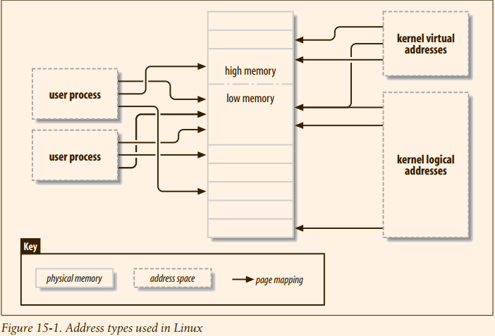

# Linux Device Driver : Memory Mapping and DMA


## 15.1 Memory Management in Linux


#### 15.1.1 Address Types
The following is a list of address types used in Linux. Figure 15-1 shows how these address types relate to physical memory.

| Type                     | Explanation                                                                                                                                                                                                       |
|--------------------------|-------------------------------------------------------------------------------------------------------------------------------------------------------------------------------------------------------------------|
| User virtual addresses   | These are the regular addresses seen by user-space programs                                                                                                                                                       |
| Physical addresses       | The addresses used between the processor and the system’s memory                                                                                                                                                  |
| Bus addresses            | The addresses used between peripheral buses and memory                                                                                                                                                            |
| Kernel logical addresses | On most architectures, logical addresses and their associated physical addresses differ only by a constant offset. Memory returned from kmalloc has a kernel logical address                                      |
| Kernel virtual addresses | All logical addresses are kernel virtual addresses, but many kernel virtual addresses are not logical addresses. For example, memory allocated by vmalloc has a virtual address (but no direct physical mapping). |
> kernel logical address 和 kernel virtual address 的关系: 内核应该是大多数地址都是一个offset差值，但是小部分不是简单的offset的，比如vmalloc 涉及的部分.



Different kernel functions require different types of addresses. It would be nice if
there were different C types defined, so that the required address types were explicit,
but we have no such luck. 
#### 15.1.2 High and Low Memory
The difference between logical and kernel virtual addresses is highlighted on 32-bit systems that are equipped with large amounts of memory.
> 似乎high memory 是导致非offset虚实映射的源头.


The kernel’s code and data structures must fit into that space, but the biggest consumer of kernel address space is *virtual mappings for physical memory*.
**The kernel cannot directly manipulate memory that is not mapped into the kernel’s
address space**. The kernel, in other words, needs its own virtual address for any
memory it must touch directly. Thus, for many years, the maximum amount of physical memory that could be handled by the kernel was the amount that could be
mapped into the kernel’s portion of the virtual address space, minus the space needed for the kernel code itself.


In response to commercial pressure to support more memory while not breaking 32-
bit application and the system’s compatibility, the processor manufacturers have
added “address extension” features to their products. The result is that, in many
cases, even 32-bit processors can **address more than 4 GB** of physical memory.
The limitation on how much memory can be directly mapped with logical addresses
remains, however. **Only the lowest portion of memory (up to 1 or 2 GB, depending
on the hardware and the kernel configuration) has logical addresses**;
the rest (high memory) does not. Before accessing a specific high-memory page, the kernel must set
up an explicit virtual mapping to make that page available in the kernel’s address
space. Thus, many kernel data structures must be placed in low memory; **high memory tends to be reserved for user-space process pages**.
The term “high memory” can be confusing to some, especially since it has other
meanings in the PC world. So, to make things clear, we’ll define the terms here:


| Low/High    | Definition                                                                                                                            |
|-------------|---------------------------------------------------------------------------------------------------------------------------------------|
| Low memory  | Memory for which logical addresses exist in kernel space. On almost every system you will likely encounter, all memory is low memory. |
| High memory | Memory for which logical addresses do not exist, because it is beyond the address range set aside for kernel virtual addresses      |
 
#### 15.1.3 The Memory Map and Struct Page
Historically, the kernel has used logical addresses to refer to pages of physical memory.
The addition of high-memory support, however, has exposed an obvious problem with that approach—**logical addresses are not available for high memory**

Therefore, kernel functions that deal with memory are increasingly using pointers to `struct page` (defined in `<linux/mm.h>`) instead.
This data structure is used to keep track of just about everything the kernel needs to know about physical memory;

The kernel maintains one or more arrays of `struct page` entries that track all of the
physical memory on the system. On some systems, there is a single array called `mem_map`.
On some systems, however, the situation is more complicated. Nonuniform memory
access (NUMA) systems and those with widely discontiguous physical memory may
have **more than one memory map array**, so code that is meant to be portable should
avoid direct access to the array whenever possible. Fortunately, it is usually quite easy to
just work with struct page pointers without worrying about where they come from.
> 在 logical address 中间，虚拟地址和物理地址之间是直接对应，但是对于部分 virtual memory 其中是没有这种简单的对应的，
> 但是 `struct page` 中间的内容 和 物理地址总是一一对应的.


Some functions and macros are defined for translating between struct page pointers and virtual addresses:

`pfn`: page frame number

1. `struct page *virt_to_page(void *kaddr);` 
This macro, defined in `<asm/page.h>`, takes a kernel logical address and returns
its associated struct page **pointer**. Since it requires a logical address, it does not
work with memory from vmalloc or high memory.
```
#define virt_to_page(kaddr)	pfn_to_page(__pa(kaddr) >> PAGE_SHIFT)

#define pfn_to_page __pfn_to_page

#define __pfn_to_page(pfn)	(vmemmap + (pfn))

#define vmemmap ((struct page *)VMEMMAP_START)

#define VMEMMAP_START	 _AC(0xffffea0000000000, UL)
```

2. `void *page_address(struct page *page);`

Returns the kernel virtual address of this page, if such an address exists. For high
memory, that address exists only if the page has been mapped. This function is
defined in `<linux/mm.h>`. In most situations, you want to use a version of `kmap`
rather than `page_address`.
```
#define page_address(page) lowmem_page_address(page)


static __always_inline void *lowmem_page_address(const struct page *page) {
	return __va(PFN_PHYS(page_to_pfn(page)));
}

#define PFN_PHYS(x)	((phys_addr_t)(x) << PAGE_SHIFT)

#define page_to_pfn __page_to_pfn
#define __page_to_pfn(page)	(unsigned long)((page) - vmemmap)
```
> a reverse procedure, from the page pointer to kernel virtual address

3. `void *kmap(struct page *page);` && `void kunmap(struct page *page);`

kmap returns a kernel virtual address for **any page** in the system. For **low-memory** pages,
it just returns the logical address of the page; for **high-memory** pages,
kmap creates a special mapping in a dedicated part of the kernel address space.
Mappings created with kmap should always be freed with **kunmap**; a limited
number of such mappings is available, so it is better not to hold on to them for
too long. kmap calls maintain a counter, so if two or more functions both call
kmap on the same page, the right thing happens. Note also that kmap can sleep
if no mappings are available.
```
static inline void *kmap(struct page *page) {
	might_sleep();
	return page_address(page);
}

static inline void kunmap(struct page *page)
{
}

# define might_sleep() do { might_resched(); } while (0)
# define might_resched() _cond_resched()
int __sched _cond_resched(void) {
	if (should_resched(0)) {
		preempt_schedule_common();
		return 1;
	}
	return 0;
}
EXPORT_SYMBOL(_cond_resched);
// 后面的代码已经有点看不懂了啊。
```
> kmap() 行为和描述的完全不同好吧，除非might_sleep() 中间的行为就是处理对应`high-memory`的操作。
> 从kunmap() 中间再次可以看出来，那就是要么跳转错误，要么就是AMD64不仅仅根本就是没有`highmem`这一个说法，而且也没有kmap 的说法

4. `void *kmap_atomic(struct page *page, enum km_type type);` && `void kunmap_atomic(void *addr, enum km_type type);`

`kmap_atomic` is a **high-performance** form of kmap. Each architecture maintains a
small list of slots (dedicated page table entries) for atomic kmaps; a caller of
`kmap_atomic` must tell the system which of those slots to use in the type argument. The only slots that make sense for drivers are KM_USER0 and KM_USER1 (for
code running directly from a call from user space), and KM_IRQ0 and KM_IRQ1 (for
interrupt handlers). Note that atomic kmaps must be handled atomically; your
code cannot sleep while holding one. Note also that nothing in the kernel keeps
two functions from trying to use the same slot and interfering with each other
(although there is a unique set of slots for each CPU). In practice, contention for
atomic kmap slots seems to not be a problem
```
static inline void *kmap_atomic(struct page *page)
{
	preempt_disable();
	pagefault_disable();
	return page_address(page);
}
```
> 实际上就是添加了 抢占 和 page fault 的禁用.


####  15.1.4 Virtual Memory Areas
It corresponds loosely to the concept of a “segment,” although it is better
described as “a memory object with its own properties.

The memory map of a process is made up of (at least) the following areas:
1. An area for the program’s executable code (often called `text`)
1. Multiple areas for data, including initialized data (that which has an explicitly assigned value at the beginning of execution), uninitialized data (`BSS`), and the **program stack**
1. One area for each active memory mapping

The fields in each line are:

```
➜  Vn git:(master) ✗ cat /proc/self/maps 
| start-end                 | perm | offset   | major:minor | inode   | image                          |
|---------------------------|------|----------|-------------|---------|--------------------------------|
| 5594c5537000-5594c5539000 | r--p | 00000000 | 103:05      | 2621861 | /usr/bin/cat                   |
| 5594c5539000-5594c553d000 | r-xp | 00002000 | 103:05      | 2621861 | /usr/bin/cat                   |
| 5594c553d000-5594c553f000 | r--p | 00006000 | 103:05      | 2621861 | /usr/bin/cat                   |
| 5594c5540000-5594c5541000 | r--p | 00008000 | 103:05      | 2621861 | /usr/bin/cat                   |
| 5594c5541000-5594c5542000 | rw-p | 00009000 | 103:05      | 2621861 | /usr/bin/cat                   |
| 5594c598d000-5594c59ae000 | rw-p | 00000000 | 00:00       | 0       | [heap]                         |
| 7f0839dc8000-7f083a3ac000 | r--p | 00000000 | 103:05      | 2658603 | /usr/lib/locale/locale-archive |
| 7f083a3ac000-7f083a3af000 | rw-p | 00000000 | 00:00       | 0       |                                |
| 7f083a3af000-7f083a3d1000 | r--p | 00000000 | 103:05      | 2630171 | /usr/lib/libc-2.28.so          |
| 7f083a3d1000-7f083a51c000 | r-xp | 00022000 | 103:05      | 2630171 | /usr/lib/libc-2.28.so          |
| 7f083a51c000-7f083a568000 | r--p | 0016d000 | 103:05      | 2630171 | /usr/lib/libc-2.28.so          |
| 7f083a568000-7f083a569000 | ---p | 001b9000 | 103:05      | 2630171 | /usr/lib/libc-2.28.so          |
| 7f083a569000-7f083a56d000 | r--p | 001b9000 | 103:05      | 2630171 | /usr/lib/libc-2.28.so          |
| 7f083a56d000-7f083a56f000 | rw-p | 001bd000 | 103:05      | 2630171 | /usr/lib/libc-2.28.so          |
| 7f083a56f000-7f083a573000 | rw-p | 00000000 | 00:00       | 0       |                                |
| 7f083a590000-7f083a5b4000 | rw-p | 00000000 | 00:00       | 0       |                                |
| 7f083a5b4000-7f083a5b6000 | r--p | 00000000 | 103:05      | 2630159 | /usr/lib/ld-2.28.so            |
| 7f083a5b6000-7f083a5d5000 | r-xp | 00002000 | 103:05      | 2630159 | /usr/lib/ld-2.28.so            |
| 7f083a5d5000-7f083a5dd000 | r--p | 00021000 | 103:05      | 2630159 | /usr/lib/ld-2.28.so            |
| 7f083a5dd000-7f083a5de000 | r--p | 00028000 | 103:05      | 2630159 | /usr/lib/ld-2.28.so            |
| 7f083a5de000-7f083a5df000 | rw-p | 00029000 | 103:05      | 2630159 | /usr/lib/ld-2.28.so            |
| 7f083a5df000-7f083a5e0000 | rw-p | 00000000 | 00:00       | 0       |                                |
| 7ffca452e000-7ffca4550000 | rw-p | 00000000 | 00:00       | 0       | [stack]                        |
| 7ffca4559000-7ffca455c000 | r--p | 00000000 | 00:00       | 0       | [vvar]                         |
| 7ffca455c000-7ffca455d000 | r-xp | 00000000 | 00:00       | 0       | [vdso]                         |
```
> 此处就是理解为什么动态链接库加载过程了! 
> 1. 为什么会有inode 节点, inode 的节点号为0 说明了说明
> 2. 为什么vma可以和swap 总是放到一起了，没有vma 就没有没有办法swap吗?

| Terminology |                                                                                                                                                                                                                                                                    |
|-------------|--------------------------------------------------------------------------------------------------------------------------------------------------------------------------------------------------------------------------------------------------------------------|
| start end   | The beginning and ending virtual addresses for this memory area.                                                                                                                                                                                                   |
| perm        | A bit mask with the memory area’s read, write, and execute permissions. This field describes what the process is allowed to do with pages belonging to the area. The last character in the field is either p for “private” or s for “shared.”                      |
| offset      | Where the memory area begins in the file that it is mapped to. An offset of 0 means that the beginning of the memory area corresponds to the beginning of the file.                                                                                                |
| major minor | The major and minor numbers of the device holding the file that has been mapped. Confusingly, for device mappings, the major and minor numbers refer to the disk partition holding the device special file that was opened by the user, and not the device itself. |
| inode       | The inode number of the mapped file                                                                                                                                                                                                                                |

#### 15.1.5 the `vm_area_struct` structure
When a user-space process calls mmap to map device memory into its address space,
the system responds by creating a new VMA to represent that mapping.

The main fields of
VMAs are as follows (note the similarity between these fields and the /proc output we
just saw):
```c
unsigned long vm_start;
unsigned long vm_end;
// The virtual address range covered by this VMA. These fields are the first two
// fields shown in /proc/*/maps.
struct file *vm_file;
// A pointer to the struct file structure associated with this area (if any).
unsigned long vm_pgoff;
// The offset of the area in the file, in pages. When a file or device is mapped, this is
// the file position of the first page mapped in this area.
unsigned long vm_flags;
// A set of flags describing this area. The flags of the most interest to device driver
// writers are VM_IO and VM_RESERVED. VM_IO marks a VMA as being a memorymapped I/O region. Among other things, the VM_IO flag prevents the region from
// being included in process core dumps. VM_RESERVED tells the memory management system not to attempt to swap out this VMA; it should be set in most
// device mappings.
struct vm_operations_struct *vm_ops;
// A set of functions that the kernel may invoke to operate on this memory area. Its
// presence indicates that the memory area is a kernel “object,” like the struct file
// we have been using throughout the book.
void *vm_private_data;
// A field that may be used by the driver to store its own information.
// Like struct vm_area_struct, the vm_operations_struct is defined in <linux/mm.h>; it
// includes the operations listed below. These operations are the only ones needed to
// handle the process’s memory needs, and they are listed in the order they are
// declared. Later in this chapter, some of these functions are implemented.
void (*open)(struct vm_area_struct *vma);
// The open method is called by the kernel to allow the subsystem implementing
// the VMA to initialize the area. This method is invoked any time a new reference
// to the VMA is made (when a process forks, for example). The one exception
// happens when the VMA is first created by mmap; in this case, the driver’s mmap
// method is called instead.
void (*close)(struct vm_area_struct *vma);
// When an area is destroyed, the kernel calls its close operation. Note that there’s
// no usage count associated with VMAs; the area is opened and closed exactly
// once by each process that uses it
```
> 注释待读


#### 15.1.6 The Process Memory Map

Mapping a device means associating a range of user-space addresses to device memory.
> X Windows 可以操作可以实践一下

There are sound advantages to using mmap when it’s feasible to do so

Most PCI peripherals map their control registers to a memory address, and a high-performance application might prefer to have
direct access to the registers instead of repeatedly having to call ioctl to get its work
done.

The system call is declared as follows (as described in the mmap(2) manual page):
```c
mmap (caddr_t addr, size_t len, int prot, int flags, int fd, off_t offset)
```
On the other hand, the file operation is declared as:
```c
int (*mmap) (struct file *filp, struct vm_area_struct *vma);
```
Therefore, much of the work has been done by the kernel; to implement
mmap, the driver only has to **build suitable page tables for the address range** and, if
necessary, replace `vma->vm_ops` with a new set of operations.
There are two ways of building the page tables: 
1. doing it all at once with a function called `remap_pfn_range`
2. doing it a page at a time via the nopage VMA method.

Each method has its advantages and limitations. We start with the “all at once”
approach, which is simpler. From there, we add the complications needed for a real world implementation
> 我去，创建页表，这还简单吗?


#### 15.1.7 Using `remap_pfn_range`

```
/**
 * remap_pfn_range - remap kernel memory to userspace
 * @vma: user vma to map to
 * @addr: target user address to start at
 * @pfn: physical address of kernel memory
 * @size: size of map area
 * @prot: page protection flags for this mapping
 *
 *  Note: this is only safe if the mm semaphore is held when called.
 */
int remap_pfn_range(struct vm_area_struct *vma, unsigned long addr,
		    unsigned long pfn, unsigned long size, pgprot_t prot)


#ifndef io_remap_pfn_range
#define io_remap_pfn_range remap_pfn_range
#endif
```


One other complication has to do with caching: usually, references to device memory should not be cached by the processor.


#### 15.1.7 A Simple Implementation
> 实际上，这一个函数并没有找到，其实页没有什么意义的


#### 15.1.8 Adding VMA Operations
These operations
are called whenever a process opens or closes the VMA; 
in particular, the `open` method is invoked anytime a process forks and creates a new reference to the VMA.

Note the explicit call to `simple_vma_open`. Since the open method is not invoked on
the initial mmap, we must call it explicitly if we want it to run.
> 说好的自动调用的 open 的，为什么又是变成显示调用了


#### 15.1.9 Mapping Memory with nopage
 If the VMA is reduced in size, the kernel can
quietly flush out the unwanted pages without telling the driver. If, instead, the VMA
is expanded, the driver eventually finds out by way of calls to nopage when mappings must be set up for the new pages, so there is no need to perform a separate
notification. 
The nopage method, therefore, must be implemented if you want to
support the `mremap` system call.
> 缩小的时候flush 到 device 中间去，扩张的时候依赖于nopage 发现新增加的page

`mremap()` uses the Linux page table scheme.  `mremap()` changes the mapping between virtual addresses and memory pages.  This can be used to implement a very efficient `realloc(3)`.
> 原来是在这里的内容.

When a user process attempts to access a page in a VMA that is not present in memory, the associated nopage function is called.


[remove nopage](https://lwn.net/Articles/258113/)
> 实际上，这里根本就是没有nopage 这一个东西了


#### 15.1.10 Remapping Specific I/O Regions
In order
to map to user space only a subset of the whole memory range, the driver needs only
to play with the offsets
> 看不懂啊，太难了，这是什么东西啊 ?

#### 15.1.11 Remapping RAM
> skip because of nopage

#### 15.1.12 Remapping Kernel Virtual Addresses
> skip because of patients

## 15.3 Performing Direct I/O
Most I/O operations are buffered through the kernel. The use of a kernel-space
buffer allows a degree of separation between user space and the actual device; this
separation can make programming easier and can also yield performance benefits in
many situations. 

There are cases, however, where it can be beneficial to perform I/O
directly to or from a user-space buffer. If the amount of data being transferred is
large, transferring data directly without an extra copy through kernel space can
speed things up.

That said, it is important to recognize that direct I/O does not always provide the
performance boost that one might expect. 

The real moral of the story, in any case, is that implementing direct I/O in a char
driver is usually unnecessary and can be hurtful.


```c
/*
 * get_user_pages() - pin user pages in memory
 * @tsk:	the task_struct to use for page fault accounting, or
 *		NULL if faults are not to be recorded.
 * @mm:		mm_struct of target mm
 * @start:	starting user address
 * @nr_pages:	number of pages from start to pin
 * @write:	whether pages will be written to by the caller
 * @force:	whether to force access even when user mapping is currently
 *		protected (but never forces write access to shared mapping).
 * @pages:	array that receives pointers to the pages pinned.
 *		Should be at least nr_pages long. Or NULL, if caller
 *		only intends to ensure the pages are faulted in.
 * @vmas:	array of pointers to vmas corresponding to each page.
 *		Or NULL if the caller does not require them.
 *
 * Returns number of pages pinned. This may be fewer than the number
 * requested. If nr_pages is 0 or negative, returns 0. If no pages
 * were pinned, returns -errno. Each page returned must be released
 * with a put_page() call when it is finished with. vmas will only
 * remain valid while mmap_sem is held.
 *
 * Must be called with mmap_sem held for read or write.
 *
 * get_user_pages walks a process's page tables and takes a reference to
 * each struct page that each user address corresponds to at a given
 * instant. That is, it takes the page that would be accessed if a user
 * thread accesses the given user virtual address at that instant.
 *
 * This does not guarantee that the page exists in the user mappings when
 * get_user_pages returns, and there may even be a completely different
 * page there in some cases (eg. if mmapped pagecache has been invalidated
 * and subsequently re faulted). However it does guarantee that the page
 * won't be freed completely. And mostly callers simply care that the page
 * contains data that was valid *at some point in time*. Typically, an IO
 * or similar operation cannot guarantee anything stronger anyway because
 * locks can't be held over the syscall boundary.
 *
 * If write=0, the page must not be written to. If the page is written to,
 * set_page_dirty (or set_page_dirty_lock, as appropriate) must be called
 * after the page is finished with, and before put_page is called.
 *
 * get_user_pages is typically used for fewer-copy IO operations, to get a
 * handle on the memory by some means other than accesses via the user virtual
 * addresses. The pages may be submitted for DMA to devices or accessed via
 * their kernel linear mapping (via the kmap APIs). Care should be taken to
 * use the correct cache flushing APIs.
 *
 * See also get_user_pages_fast, for performance critical applications.
 *
 * get_user_pages should be phased out in favor of
 * get_user_pages_locked|unlocked or get_user_pages_fast. Nothing
 * should use get_user_pages because it cannot pass
 * FAULT_FLAG_ALLOW_RETRY to handle_mm_fault.
 */
long get_user_pages(struct task_struct *tsk, struct mm_struct *mm,
		unsigned long start, unsigned long nr_pages, int write,
		int force, struct page **pages, struct vm_area_struct **vmas)
{
	return __get_user_pages_locked(tsk, mm, start, nr_pages, write, force,
				       pages, vmas, NULL, false, FOLL_TOUCH);
}
EXPORT_SYMBOL(get_user_pages);
```
> 书上对于参数提供了介绍

 It also requires that the mmap reader/writer semaphore for the address
space be obtained in read mode before the call.

Upon successful completion, the caller has a pages array pointing to the user-space
buffer, which is locked into memory. To operate on the buffer directly, the kernelspace code must turn each struct page pointer into a kernel virtual address with
kmap or kmap_atomic.

Usually, however, devices for which direct I/O is justified are
using DMA operations, so your driver will probably want to create a scatter/gather
list from the array of struct page pointers. We discuss how to do this in the section,
"Scatter/gather mappings."


Most code that performs this operation checks first to ensure that the page is not in the reserved part of the memory
map, which is never swapped out. Therefore, the code usually looks like:
```c
if (! PageReserved(page))
SetPageDirty(page);
```
> 完美，终于找到了自己了解一点的内容了。 


Regardless of whether the pages have been changed, they must be freed from the
page cache, or they stay there forever. The call to use is:
```c
void page_cache_release(struct page *page);
```
This call should, of course, be made after the page has been marked dirty, if need be

#### 15.3.2 Asynchronous I/O
As we will see in the coming chapters, block and network drivers are fully asynchronous at all times, so only
char drivers are candidates for explicit asynchronous I/O support. 
> 字符设备并么有实现异步io的必要

We cover asynchronous I/O in this chapter, because
its implementation almost always **involves direct I/O operations** as well (if you are
**buffering data in the kernel**, you can usually implement asynchronous behavior without imposing the added complexity on user space).


If you support asynchronous I/O, you must be aware of the fact that the kernel can,
on occasion, create “synchronous IOCBs.” These are, essentially, asynchronous
operations that must actually be executed synchronously. One may well wonder why
things are done this way, but it’s best to just do what the kernel asks. Synchronous
operations are marked in the IOCB; your driver should query that status with:
```c
int is_sync_kiocb(struct kiocb *iocb);
```
If this function returns a nonzero value, your driver must execute the operation
synchronously

 If your driver is able to initiate the operation (or, simply, to queue it until some
future time when it can be executed), it must do two things: 
1. remember everything it
needs to know about the operation, and return -EIOCBQUEUED to the caller. 
2. Remembering the operation information includes arranging access to the user-space buffer;
once you return, you will not again have the opportunity to access that buffer while
running in the context of the calling process. 


When “later” comes, your driver must inform the kernel that the operation has completed. That is done with a call to aio_complete:
int `aio_complete(struct kiocb *iocb, long res, long res2)`

> 后面有一个aio的例子，并么有看，但是我现在想学一下aio的用户态的例子了.

## 15.4  Direct Memory Access
DMA is the hardware mechanism that allows peripheral components to transfer their I/O data directly to and from main memory without the need
to involve the system processor

Data transfer can be triggered in two ways: 
1. either the software asks for data (via a
function such as read) or 
2. the hardware asynchronously pushes data to the system.

In the first case, the steps involved can be summarized as follows:
1. When a process calls read, the driver method allocates a DMA buffer and instructs the hardware to transfer its data into that buffer. The process is put to sleep.
2. The hardware writes data to the DMA buffer and raises an interrupt when it’s done.
3. The interrupt handler gets the input data, acknowledges the interrupt, and awakens the process, which is now able to read data.

The second case comes about when DMA is used asynchronously. This happens, for
example, with data acquisition devices that go on pushing data even if nobody is
reading them. In this case, the driver should maintain a buffer so that a subsequent
read call will return all the accumulated data to user space. The steps involved in this
kind of transfer are slightly different:
1. The hardware raises an interrupt to announce that new data has arrived.
2. The interrupt handler allocates a buffer and tells the hardware where to transfer its data.
3. The peripheral device writes the data to the buffer and raises another interrupt when it’s done.
4. The handler dispatches the new data, wakes any relevant process, and takes care of housekeeping

The processing steps in all of these cases emphasize that efficient DMA handling
relies on interrupt reporting.

Another relevant item introduced here is the DMA buffer. 
> 两大支柱，DMA buffer 和 interrupt


> 后面都是DMA的细节内容，虽然对于DMA 的实现也是很感兴趣，但是暂时不看.
