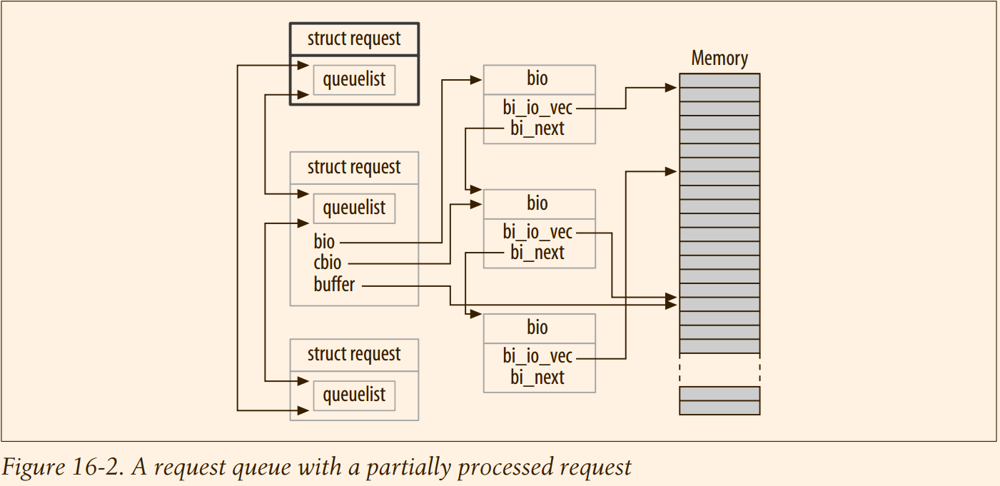

# Linux Device Driver : Block Drivers
Modern systems with virtual memory work by shifting (hopefully) unneeded data to secondary storage, which is usually a disk drive.
Block drivers are the **conduit** between core memory and secondary storage;
therefore, they can be seen as making up part of the virtual memory subsystem.

A block is a
fixed-size chunk of data, the size being determined by the kernel.

A sector, in contrast, is a small block whose size is usually determined by the underlying hardware.
> block 和 sector 有什么区别，获取为什么需要定义出来两个类型来。

## 16.1 Registration

#### 16.1.1 Block Driver Registration


```c
/**
 * register_blkdev - register a new block device
 *
 * @major: the requested major device number [1..255]. If @major=0, try to
 *         allocate any unused major number.
 * @name: the name of the new block device as a zero terminated string
 *
 * The @name must be unique within the system.
 *
 * The return value depends on the @major input parameter.
 *  - if a major device number was requested in range [1..255] then the
 *    function returns zero on success, or a negative error code
 *  - if any unused major number was requested with @major=0 parameter
 *    then the return value is the allocated major number in range
 *    [1..255] or a negative error code otherwise
 */
int register_blkdev(unsigned int major, const char *name)


void unregister_blkdev(unsigned int major, const char *name)
{
	struct blk_major_name **n;
	struct blk_major_name *p = NULL;
	int index = major_to_index(major);

	mutex_lock(&block_class_lock);
	for (n = &major_names[index]; *n; n = &(*n)->next)
		if ((*n)->major == major)
			break;
	if (!*n || strcmp((*n)->name, name)) {
		WARN_ON(1);
	} else {
		p = *n;
		*n = p->next;
	}
	mutex_unlock(&block_class_lock);
	kfree(p);
}

EXPORT_SYMBOL(unregister_blkdev);
```
In the 2.6 kernel, the call to register_blkdev is entirely optional.
> emmmm 值的商榷一下。

The functions performed by `register_blkdev` have been decreasing over time; the only tasks performed
by this call at this point are (1) allocating a dynamic major number if requested, and
(2) creating an entry in /proc/devices.

#### 16.1.2 Disk Registration
While `register_blkdev` can be used to obtain a major number, it does not make any
disk drives available to the system. There is a separate registration interface that you
must use to manage individual drives.
> where is the separate registration interface !

#### 16.1.3 Block device operations

#### 16.1.4 The gendisk structure
#### 16.1.5 Initialization in sbull
```
static void setup_device(struct sbull_dev *dev, int which)
```
> 本section主要描述该函数的内容.

Once we have our device memory and request queue in place, we can allocate, initialize, and install the corresponding gendisk structure
Once everything is set up, we finish with a call to add_disk.

```c
typedef struct Sbull_Dev {
   int size;
   int usage;
   struct timer_list timer;
   spinlock_t lock;
   u8 *data;
#ifdef SBULL_MULTIQUEUE
   struct request_queue *queue;
   int busy;
#endif
}              Sbull_Dev;
```
> 这一个结构体的设计来源是什么?

Here, `sbull_request` is our request function—the function that actually performs
block read and write requests.

When we set the first minor number for each device, we must take into account all of
the numbers taken by prior devices. The name of the disk is set such that the first
one is sbulla, the second sbullb, and so on. User space can then add partition numbers so that the third partition on the second device might be /dev/sbullb3

#### 16.1.6 A Note on Sector Sizes
As we have mentioned before,
the kernel treats every disk as a linear array of 512-byte sectors.
Not all hardware uses that sector size, however.

The sbull device exports a `hardsect_size` parameter that can be used
to change the “hardware” sector size of the device;

The first of those details is to inform the kernel of the sector size your device supports.


Once that is done, the kernel adheres to your device’s hardware sector size. All I/O
requests are properly aligned at the beginning of a hardware sector, and the length of
each request is an integral number of sectors. You must remember, however, that the
kernel always expresses itself in 512-byte sectors; thus, it is necessary to translate all
sector numbers accordingly.
```c
set_capacity(dev->gd, nsectors*(hardsect_size/KERNEL_SECTOR_SIZE));
```
> 如果 KERNEL_SECTOR_SIZE 比 hardsect_size 大，那不是设备的大小为0


## 16.2 The Block Device Operations
#### 16.2.1 The open and release Methods
To that end, it is time to mention one other
feature of the sbull driver: it pretends to be a **removable** device. Whenever the last
user closes the device, a 30-second timer is set; if the device is not opened during that
time, the contents of the device are cleared, and the kernel will be told that the media
has been changed. *The 30-second delay gives the user time to, for example, mount
an sbull device after creating a filesystem on it.*


#### 16.2.2 Supporting Removable Media

When an inode refers to a block
device, the field `i_bdev->bd_disk` contains a pointer to the associated gendisk structure;
this pointer can be used to get to a driver’s internal data structures for the device.
> 能不能总结一下private 这一个字段的用法

The task of the release method is, in contrast, to decrement the user count and, if
indicated, start the media removal timer
> 打开和关闭的主要作用，处理引用计数 和 计时器

#### 16.2.3 The ioctl Method
The sbull ioctl method handles only one command—a request for the device’s `geometry`
> 接下俩解释了到底 geometry 是什么以及为什么需要它。
> 但是这一个概念是针对于 disk的，固态硬盘怎么说？


## 16.3 Request Processing


#### 16.3.1 Introduction to the request Method
The core of every block driver is its `request` function.

```c
typedef void (request_fn_proc) (struct request_queue *q);
```

This function is called whenever the kernel believes it is time for your driver to process some reads, writes, or other operations on the device.

Whenever our request function is called, that lock is held by the kernel. As a result, the request function is
running in an atomic context;


```c
/**
 * blk_init_queue  - prepare a request queue for use with a block device
 * @rfn:  The function to be called to process requests that have been
 *        placed on the queue.
 * @lock: Request queue spin lock
 *
 * Description:
 *    If a block device wishes to use the standard request handling procedures,
 *    which sorts requests and coalesces adjacent requests, then it must
 *    call blk_init_queue().  The function @rfn will be called when there
 *    are requests on the queue that need to be processed.  If the device
 *    supports plugging, then @rfn may not be called immediately when requests
 *    are available on the queue, but may be called at some time later instead.
 *    Plugged queues are generally unplugged when a buffer belonging to one
 *    of the requests on the queue is needed, or due to memory pressure.
 *
 *    @rfn is not required, or even expected, to remove all requests off the
 *    queue, but only as many as it can handle at a time.  If it does leave
 *    requests on the queue, it is responsible for arranging that the requests
 *    get dealt with eventually.
 *
 *    The queue spin lock must be held while manipulating the requests on the
 *    request queue; this lock will be taken also from interrupt context, so irq
 *    disabling is needed for it.
 *
 *    Function returns a pointer to the initialized request queue, or %NULL if
 *    it didn't succeed.
 *
 * Note:
 *    blk_init_queue() must be paired with a blk_cleanup_queue() call
 *    when the block device is deactivated (such as at module unload).
 **/
struct request_queue *blk_init_queue(request_fn_proc *rfn, spinlock_t *lock)
{
	return blk_init_queue_node(rfn, lock, NUMA_NO_NODE);
}
EXPORT_SYMBOL(blk_init_queue);
```
> @todo 在 5.4 中间，这个函数消失了，而且不知道其对应的替代者是什么 ?

The queue lock also prevents the kernel from queuing any other requests for your
device while your request function holds the lock. Under some conditions, you may
want to consider dropping that lock while the request function runs. If you do so,
however, you must be sure not to access the request queue, or any other data structure protected by the lock, while the lock is not held. You must also reacquire the
lock before the request function returns.
> 1. 为什么需要上锁保护
> 2. 既然不能访问被锁保护的变量，为什么又去drop that clock

Finally, the invocation of the request function is (usually) entirely asynchronous with
respect to the actions of any user-space process.

You cannot assume that the kernel is
running in the context of the process that initiated the current request. You do not
know if the I/O buffer provided by the request is in kernel or user space. So any sort
of operation that explicitly accesses user space is in error and will certainly lead to
trouble. As you will see, everything your driver needs to know about the request is
contained within the structures passed to you via the request queue

#### 16.3.2 A Simple request Method
`struct request` represents a block I/O request for us to execute.

A block request queue can contain requests that do not actually move blocks to and
from a disk.

```c
static void sbull_request(struct request_queue *q)
```
> 实际上 sbull_request 的内容已经发生了很大的改变了。

```c
static void sbull_transfer(struct sbull_dev *dev, unsigned long sector,
		unsigned long nsect, char *buffer, int write)
```
> 基于memcpy

It is not, however, a realistic driver for many types of devices, for a couple of reasons.
1. sbull executes requests synchronously, one at a time.
2. finding adjacent requests and coalescing them into larger operations.

#### 16.3.3 Request Queues
If you look under the hood, a request queue turns out to be a surprisingly
complex data structure

Request queues keep track of **outstanding** block I/O requests.
> outstanding : remaining to be paid, done, or dealt with.

Request queues also implement a plug-in interface that allows the use of multiple I/O
schedulers (or **elevators**) to be used.
> 果然，在 request_queue 上存在 interface 给 io scheduler 使用
> 但是实际上，找到的内容 :
> 还是不知道 bfs 以及 elevator 之类的如何和mq的关联是什么:
```c
/**
 * struct blk_mq_ops - Callback functions that implements block driver
 * behaviour.
 */
struct blk_mq_ops {
```


An I/O scheduler’s job is to present I/O requests
to your driver in a way that maximizes performance. To this end, most I/O schedulers accumulate a batch of requests, sort them into increasing (or decreasing) block
index order, and present the requests to the driver in that order.

The disk head,
when given a sorted list of requests, works its way from one end of the disk to the
other, much like a full elevator moves in a single direction until all of its “requests”
(people waiting to get off) have been satisfied.

The 2.6 kernel includes a “deadline
scheduler,” which makes an effort to ensure that every request is satisfied within a
preset maximum time, and an “anticipatory scheduler,” which actually stalls a device
briefly after a read request in anticipation that another, adjacent read will arrive
almost immediately. As of this writing, the default scheduler is the anticipatory
scheduler, which seems to give the best interactive system performance.

The I/O scheduler is also charged with merging adjacent requests. When a new I/O
request is handed to the scheduler, it searches the queue for requests involving adjacent sectors; if one is found and if the resulting request would not be too large, the
two requests are merged.

Request queues have a type of `struct request_queue` or `request_queue_t`

> 以下介绍 request_queue_t 的操作
> request_queue_t 这个类型被取消了，而且下面的很多函数也都消失了，但是对于 request_queue 的操作还是需要的。

1. Queue creation and deletion

As part of the initialization of a request queue, you can set the field queuedata (which
is a void * pointer) to any value you like. This field is the request queue’s equivalent
to the private_data we have seen in other structures.

To return a request queue to the system (at module unload time, generally), call `blk_cleanup_queue`:
```c
request_queue_t *blk_init_queue(request_fn_proc *request, spinlock_t *lock); // FIXME 不存在了
void blk_cleanup_queue(request_queue_t *); // TODO 分析一下，找到对称的函数
```

2. Queueing functions

To actually remove a request from a queue, use `blkdev_dequeue_request`:
```c
void blkdev_dequeue_request(struct request *req); // FIXME 不存在了
```

If your driver operates on multiple requests from the same queue simultaneously, it
must dequeue them in this manner.

Should you need to put a dequeued request back on the queue for some reason, you
can call:
```c
void elv_requeue_request(request_queue_t *queue, struct request *req); // FIXME 不存在了
```

3. Queue control functions
The block layer exports a set of functions that can be used by a driver to control how
a request queue operates. These functions include:

```c
void blk_stop_queue(request_queue_t *queue);
void blk_start_queue(request_queue_t *queue);
/**
If your device has reached a state where it can handle no more outstanding commands, you can call blk_stop_queue to tell the block layer. After this call, your
request function will not be called until you call blk_start_queue. Needless to say,
you should not forget to restart the queue when your device can handle more
requests. The queue lock must be held when calling either of these functions.
void blk_queue_bounce_limit(request_queue_t *queue, u64 dma_addr);
Function that tells the kernel the highest physical address to which your device
can perform DMA. If a request comes in containing a reference to memory above
the limit, a bounce buffer will be used for the operation; this is, of course, an
expensive way to perform block I/O and should be avoided whenever possible.
You can provide any reasonable physical address in this argument, or make use
of the predefined symbols BLK_BOUNCE_HIGH (use bounce buffers for high-memory pages), BLK_BOUNCE_ISA (the driver can DMAonly into the 16-MB ISAzone),
or BLK_BOUNCE_ANY (the driver can perform DMAto any address). The default
value is BLK_BOUNCE_HIGH.
*/
void blk_queue_max_sectors(request_queue_t *queue, unsigned short max);
void blk_queue_max_phys_segments(request_queue_t *queue, unsigned short max);
void blk_queue_max_hw_segments(request_queue_t *queue, unsigned short max);
void blk_queue_max_segment_size(request_queue_t *queue, unsigned int max);
/**
Functions that set parameters describing the requests that can be satisfied by this
device. blk_queue_max_sectors can be used to set the maximum size of any
request in (512-byte) sectors; the default is 255. blk_queue_max_phys_segments
and blk_queue_max_hw_segments both control how many physical segments
(nonadjacent areas in system memory) may be contained within a single request.
Use blk_queue_max_phys_segments to say how many segments your driver is
prepared to cope with; this may be the size of a staticly allocated scatterlist, for
example. blk_queue_max_hw_segments, in contrast, is the maximum number of
segments that the device itself can handle. Both of these parameters default to
128. Finally, blk_queue_max_segment_size tells the kernel how large any individual segment of a request can be in bytes; the default is 65,536 bytes.
*/

blk_queue_segment_boundary(request_queue_t *queue, unsigned long mask);
/**
Some devices cannot handle requests that cross a particular size memory boundary; if your device is one of those, use this function to tell the kernel about that
boundary. For example, if your device has trouble with requests that cross a 4-
MB boundary, pass in a mask of 0x3fffff. The default mask is 0xffffffff.
*/
void blk_queue_dma_alignment(request_queue_t *queue, int mask);
/**
Function that tells the kernel about the memory alignment constraints your
device imposes on DMAtransfers. All requests are created with the given alignment, and the length of the request also matches the alignment. The default
mask is 0x1ff, which causes all requests to be aligned on 512-byte boundaries.
*/
void blk_queue_hardsect_size(request_queue_t *queue, unsigned short max);
/**
Tells the kernel about your device’s hardware sector size. All requests generated
by the kernel are a multiple of this size and are properly aligned. All communications between the block layer and the driver continues to be expressed in 512-
byte sectors, however.
*/
```

#### 16.3.4 The Anatomy of a Request
Each request structure represents one block I/O request, although it may have been
formed through a merger of several independent requests at a higher level.
The sectors to be transferred for any particular request may be distributed throughout main
memory, although they always correspond to a set of consecutive sectors on the
block device.

The request is represented as a set of *segments*, each of which corresponds to one in-memory buffer.
The kernel may join multiple requests that involve
adjacent sectors on the disk, but it never combines read and write operations within
a single request structure. The kernel also makes sure not to combine requests if the
result would violate any of the request queue limits described in the previous section.
> 所以，具体的如何将request 进行 combine 起来

A request structure is implemented, essentially, as a linked list of `bio` structures combined with some housekeeping information to enable the driver to keep track of its
position as it works through the request.
The bio structure is a low-level description of a portion of a block I/O request;

The bio structure, which is defined in `<linux/blk_types.h>`, contains a number of fields that
may be of use to driver authors:
```c
sector_t bi_sector; //The first (512-byte) sector to be transferred for this bio.
unsigned int bi_size; // The size of the data to be transferred, in bytes. Instead, it is often easier to use bio_sectors(bio), a macro that gives the size in sectors.
unsigned long bi_flags; // Aset of flags describing the bio; the least significant bit is set if this is a write request (although the macro bio_data_dir(bio) should be used instead of looking at the flags directly).
unsigned short bio_phys_segments;
unsigned short bio_hw_segments; // The number of physical segments contained within this BIO and the number of segments seen by the hardware after DMA mapping is done, respectively
```

The core of a bio, however, is an array called `bi_io_vec`, which is made up of the following structure:
```c
struct bio_vec {
  struct page *bv_page;
  unsigned int bv_len;
  unsigned int bv_offset;
};
```

The place to start is with `bio_for_each_segment`, which
simply loops through every unprocessed entry in the bi_io_vec array. This macro
should be used as follows:
```c
int segno; // segno is the current segment number.
struct bio_vec *bvec; // bvec points to the current bio_vec entry
bio_for_each_segment(bvec, bio, segno) {
  /* Do something with this segment
}
```

These values can be used to set up DMA transfers (an alternative
way using `blk_rq_map_sg` is described in the section “Block requests and DMA”). If
you need to access the pages directly, you should first ensure that a proper kernel virtual address exists; to that end, you can use:
```c
char *__bio_kmap_atomic(struct bio *bio, int i, enum km_type type);
void __bio_kunmap_atomic(char *buffer, enum km_type type);
```

An atomic kmap is created; the caller must provide the
appropriate slot to use (as described in the section “The Memory Map and Struct Page” in Chapter 15).

The **block layer** also maintains a set of pointers within the bio structure to keep track
of the current state of request processing. Several macros exist to provide access to
that state:
```c
struct page *bio_page(struct bio *bio); // Returns a pointer to the page structure representing the page to be transferred next.
int bio_offset(struct bio *bio); // Returns the offset within the page for the data to be transferred.
int bio_cur_sectors(struct bio *bio);  // Returns the number of sectors to be transferred out of the current page.
char *bio_data(struct bio *bio);
/**
Returns a kernel logical address pointing to the data to be transferred. Note that
this address is available only if the page in question is not located in high memory; calling it in other situations is a bug. By default, the block subsystem does
not pass high-memory buffers to your driver, but if you have changed that setting with blk_queue_bounce_limit, you probably should not be using bio_data.
*/
char *bio_kmap_irq(struct bio *bio, unsigned long *flags);
void bio_kunmap_irq(char *buffer, unsigned long *flags);
/**
bio_kmap_irq returns a kernel virtual address for any buffer, regardless of
whether it resides in high or low memory. An atomic kmap is used, so your
driver cannot sleep while this mapping is active. Use bio_kunmap_irq to unmap
the buffer. Note that the flags argument is passed by pointer here. Note also
that since an atomic kmap is used, you cannot map more than one segment at a
time.
*/
```
> 提供从bio 中间解析信息的辅助函数
> @todo 上面分析的各种 map 函数消失了，但是我想知道 dma 的内容在哪里 ?

**Request structure fields**
Now that we have an idea of how the bio structure works, we can get deep into
`struct request` and see how request processing works. The fields of this structure
include:
```c
sector_t hard_sector;
unsigned long hard_nr_sectors;
unsigned int hard_cur_sectors;
/* Fields that track the sectors that the driver has yet to complete. The first sector */
/* that has not been transferred is stored in hard_sector, the total number of sectors yet to transfer is in hard_nr_sectors, and the number of sectors remaining in */
/* the current bio is hard_cur_sectors. These fields are intended for use only within */
/* the block subsystem; drivers should not make use of them. */
struct bio *bio;
/* bio is the linked list of bio structures for this request. You should not access this */
/* field directly; use rq_for_each_bio (described later) instead. */
char *buffer;
/* The simple driver example earlier in this chapter used this field to find the buffer */
/* for the transfer. With our deeper understanding, we can now see that this field is */
/* simply the result of calling bio_data on the current bio. */
unsigned short nr_phys_segments;
/* The number of distinct segments occupied by this request in physical memory */
/* after adjacent pages have been merged. */
struct list_head queuelist;
/* The linked-list structure (as described in the section “Linked Lists” in */
/* Chapter 11) that links the request into the request queue. If (and only if) you */
/* remove the request from the queue with blkdev_dequeue_request, you may use
 */
/* this list head to track the request in an internal list maintained by your driver. */
```



**Barrier requests**

The block layer reorders requests before your driver sees them to improve I/O performance. Your driver, too, can reorder requests if there is a reason to do so. Often, this
reordering happens by passing multiple requests to the drive and letting the hardware figure out the optimal ordering. There is a problem with unrestricted reordering of requests, however: some applications require guarantees that certain
operations will complete before others are started. Relational database managers, for
example, must be absolutely sure that their journaling information has been flushed
to the drive before executing a transaction on the database contents. Journaling filesystems, which are now in use on most Linux systems, have very similar ordering
constraints. If the wrong operations are reordered, the result can be severe, undetected data corruption.
> 有时候，要求写入磁盘的操作不可以被 reorder

The `2.6` block layer addresses this problem with the concept of a barrier request.

> 后面提供了两个相关的代码，但是已经消失了，@todo 没有没有找到相关的代码证据

#### 16.3.5 Request Completion Functions
There are, as we will see, several different ways of *working through* a request structure.
All of them make use of a couple of common functions, however, which handle the completion of an I/O request or parts of a request.
Both of these functions are atomic and can be safely called from an atomic context.

When your device has completed transferring some or all of the sectors in an I/O
request, it must inform the block subsystem with:
```c
int end_that_request_first(struct request *req, int success, int count);
```
> 这个名字有点搞笑的函数已经消失了
> 实际上采用的为一下的函数体系:

```c
/*
 * Request completion related functions.
 *
 * blk_update_request() completes given number of bytes and updates
 * the request without completing it.
 */
extern bool blk_update_request(struct request *rq, blk_status_t error,
			       unsigned int nr_bytes);

extern void __blk_complete_request(struct request *);
extern void blk_abort_request(struct request *);
```


All of the functions just described access the “current” buffer—the first buffer that,
as far as the kernel knows, has not been transferred. Drivers often want to work
through several buffers in the bio before signaling completion on any of them (with
`end_that_request_first`, to be described shortly), so *these functions are often not useful*.

**Working with bios**
> 讲解复杂版本的bio
> skip

**Block requests and DMA**

If you are working on a high-performance block driver, chances are you will be using
DMAfor the actual data transfers. Ablock driver can certainly step through the bio
structures, as described above, create a DMAmapping for each one, and pass the result
to the device. There is an easier way, however, if your device can do scatter/gather I/O.
The function:
```c
/*
 * map a request to scatterlist, return number of sg entries setup. Caller
 * must make sure sg can hold rq->nr_phys_segments entries
 */
int blk_rq_map_sg(struct request_queue *q, struct request *rq,
		  struct scatterlist *sglist)
{
	struct scatterlist *sg = NULL;
	int nsegs = 0;

	if (rq->rq_flags & RQF_SPECIAL_PAYLOAD)
		nsegs = __blk_bvec_map_sg(rq->special_vec, sglist, &sg);
	else if (rq->bio && bio_op(rq->bio) == REQ_OP_WRITE_SAME)
		nsegs = __blk_bvec_map_sg(bio_iovec(rq->bio), sglist, &sg);
	else if (rq->bio)
		nsegs = __blk_bios_map_sg(q, rq->bio, sglist, &sg);

	if (unlikely(rq->rq_flags & RQF_COPY_USER) &&
	    (blk_rq_bytes(rq) & q->dma_pad_mask)) {
		unsigned int pad_len =
			(q->dma_pad_mask & ~blk_rq_bytes(rq)) + 1;

		sg->length += pad_len;
		rq->extra_len += pad_len;
	}

	if (q->dma_drain_size && q->dma_drain_needed(rq)) {
		if (op_is_write(req_op(rq)))
			memset(q->dma_drain_buffer, 0, q->dma_drain_size);

		sg_unmark_end(sg);
		sg = sg_next(sg);
		sg_set_page(sg, virt_to_page(q->dma_drain_buffer),
			    q->dma_drain_size,
			    ((unsigned long)q->dma_drain_buffer) &
			    (PAGE_SIZE - 1));
		nsegs++;
		rq->extra_len += q->dma_drain_size;
	}

	if (sg)
		sg_mark_end(sg);

	/*
	 * Something must have been wrong if the figured number of
	 * segment is bigger than number of req's physical segments
	 */
	WARN_ON(nsegs > blk_rq_nr_phys_segments(rq));

	return nsegs;
}
EXPORT_SYMBOL(blk_rq_map_sg);
```
> skip 下面的分析

**Doing without a request queue**
> skip 就是直接操作 bio

## 16.4 Some Other Details

#### 16.4.1 Command Pre-Preparation
The block layer provides a mechanism for drivers to examine and preprocess
requests before they are returned from `elv_next_request`.

This mechanism allows
drivers to set up the actual drive commands ahead of time, decide whether the
request can be handled at all, or perform other sorts of housekeeping.

> skip
#### 16.4.2 Tagged Command Queueing
> skip
