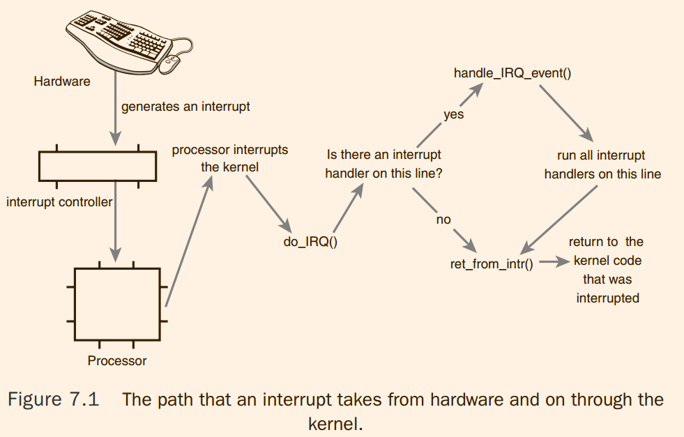

# Linux Kernel Development : Interrupts and Interrupt handler

1. 所以硬件的支持是什么 ?
2. 一共 32 + 256 个中断信号如何复用

## 核心观点
1. interrupt context is unable to block
2. 

## 1 Interrupts

An interrupt is physically produced by electronic signals originating from hardware
devices and directed into input pins on an interrupt controller, a simple chip that multi-plexes multiple interrupt lines into a single line to the processor. 
> 用于中断的外部信号的数量限制就是引脚数量。

These interrupt values are often called interrupt request (IRQ) lines. Each IRQ line is
assigned a numeric value—for example, on the classic PC, IRQ zero is the timer interrupt and IRQ one is the keyboard interrupt.
Not all interrupt numbers, however, are so
rigidly defined. Interrupts associated with devices on the PCI bus, for example, generally
are dynamically assigned. Other non-PC architectures have similar dynamic assignments
for interrupt values.The important notion is that **a specific interrupt is associated with a
specific device, and the kernel knows this**.
> 存在动态分配，但是 device 知道

## 2 Interrupt Handler
What differentiates interrupt handlers from other kernel functions is that the kernel invokes them in response to interrupts and that they run in a special context (discussed later in this chapter) called interrupt context.This special context is
occasionally called atomic context because, as we shall see, **code executing in this context is
unable to block**. In this book, we will use the term interrupt context.

## 3 Top halves Versus Bottom Halves
> 只是简介，具体内容在 chapter 8

## 4 Registering an Interrupt Handler

```c
static inline int __must_check
request_irq(unsigned int irq, irq_handler_t handler, unsigned long flags,
	    const char *name, void *dev)
{
	return request_threaded_irq(irq, handler, NULL, flags, name, dev);
}
```
1. request_irq 注册到 x86 硬件GRT 指向的数组中间吗 ?
    1. 我猜测不是，似乎指向是的标准的 汇编代码吧 ?


#### 4.1 Interrupt Handler Flags

```c
/*
 * These flags used only by the kernel as part of the
 * irq handling routines.
 *
 * IRQF_SHARED - allow sharing the irq among several devices
 * IRQF_PROBE_SHARED - set by callers when they expect sharing mismatches to occur
 * IRQF_TIMER - Flag to mark this interrupt as timer interrupt
 * IRQF_PERCPU - Interrupt is per cpu
 * IRQF_NOBALANCING - Flag to exclude this interrupt from irq balancing
 * IRQF_IRQPOLL - Interrupt is used for polling (only the interrupt that is
 *                registered first in an shared interrupt is considered for
 *                performance reasons)
 * IRQF_ONESHOT - Interrupt is not reenabled after the hardirq handler finished.
 *                Used by threaded interrupts which need to keep the
 *                irq line disabled until the threaded handler has been run.
 * IRQF_NO_SUSPEND - Do not disable this IRQ during suspend.  Does not guarantee
 *                   that this interrupt will wake the system from a suspended
 *                   state.  See Documentation/power/suspend-and-interrupts.txt
 * IRQF_FORCE_RESUME - Force enable it on resume even if IRQF_NO_SUSPEND is set
 * IRQF_NO_THREAD - Interrupt cannot be threaded
 * IRQF_EARLY_RESUME - Resume IRQ early during syscore instead of at device
 *                resume time.
 * IRQF_COND_SUSPEND - If the IRQ is shared with a NO_SUSPEND user, execute this
 *                interrupt handler after suspending interrupts. For system
 *                wakeup devices users need to implement wakeup detection in
 *                their interrupt handlers.
 */
#define IRQF_SHARED		0x00000080
#define IRQF_PROBE_SHARED	0x00000100
#define __IRQF_TIMER		0x00000200
#define IRQF_PERCPU		0x00000400
#define IRQF_NOBALANCING	0x00000800
#define IRQF_IRQPOLL		0x00001000
#define IRQF_ONESHOT		0x00002000
#define IRQF_NO_SUSPEND		0x00004000
#define IRQF_FORCE_RESUME	0x00008000
#define IRQF_NO_THREAD		0x00010000
#define IRQF_EARLY_RESUME	0x00020000
#define IRQF_COND_SUSPEND	0x00040000

#define IRQF_TIMER		(__IRQF_TIMER | IRQF_NO_SUSPEND | IRQF_NO_THREAD)
```
书上简单说明了: IRQF_DISABLED IRQF_SAMPLE_RANDOM IRQF_TIMER 和 IRQF_SHARED
> 前面两个已经消失

> @todo IRQF_SHARED 的效果，track it


The fourth parameter, name, is an ASCII text representation of the device associated
with the interrupt. For example, this value for the keyboard interrupt on a PC is keyboard.These text names are used by /proc/irq and /proc/interrupts for communication with the user, which is discussed shortly.
>  /proc/irq 和 /proc/interrupts 中间的内容并没有办法深刻的理解

The fifth parameter, `dev`, is used for shared interrupt lines.When an interrupt handler
is freed (discussed later), `dev` provides a unique cookie to enable the removal of only the
desired interrupt handler from the interrupt line.Without this parameter, it would be
impossible for the kernel to know which handler to remove on a given interrupt line.You
can pass NULL here if the line is not shared, but you must pass a unique cookie if your
interrupt line is shared. (And unless your device is old and crusty and lives on the ISA bus,
there is a good chance it must support sharing.)
This pointer is also passed into the interrupt handler on each invocation.
A common practice is to pass the driver’s device structure:This pointer is unique and might be useful to have within the handlers.
> 我怀疑，这就是实现 interrupt line 复用的方法
> 1. 只要注册在这一个line 上，都发送该信号
> 2. 然后 CPU 发送信号询问到底是谁刚刚请求过
>     1. 这似乎会有一个策略问题。如果总是总是顺着 chain 从头询问

#### 4.2 An Interrupt Example

It is important to initialize hardware and register an interrupt
handler in the proper order to prevent the interrupt handler from running before the
device is fully initialized.

#### 4.3 Freeing an Interrupt Handler 

```c

/**
 *	free_irq - free an interrupt allocated with request_irq
 *	@irq: Interrupt line to free
 *	@dev_id: Device identity to free
 *
 *	Remove an interrupt handler. The handler is removed and if the
 *	interrupt line is no longer in use by any driver it is disabled.
 *	On a shared IRQ the caller must ensure the interrupt is disabled
 *	on the card it drives before calling this function. The function
 *	does not return until any executing interrupts for this IRQ
 *	have completed.
 *
 *	This function must not be called from interrupt context.
 *
 *	Returns the devname argument passed to request_irq.
 */
const void *free_irq(unsigned int irq, void *dev_id)
```


## 5 Writing an Interrupt Handler

The return value of an interrupt handler is the special type `irqreturn_t`. An interrupt
handler can return two special values, `IRQ_NONE` or `IRQ_HANDLED`.The former is returned
when the interrupt handler detects an interrupt for which its device was not the originator.
The latter is returned if the interrupt handler was correctly invoked, and its device did
indeed cause the interrupt.
> 还是复用的问题，也就是会对于注册到其上的所有的函数全部调用，那些不匹配的直接返回 ?

Reentrancy and Interrupt Handlers
> 一般来说，其他的 interrupt line 不会被阻塞，但是自己的 interrupt line 会被阻塞，从而防止出现自己调用自己的情况

#### 5.1 Shared Handler

When the kernel receives an interrupt, it invokes sequentially each registered handler
on the line.Therefore, it is important that the handler be capable of distinguishing
whether it generated a given interrupt.The handler must quickly exit if its associated
device did not generate the interrupt.This requires the hardware device to have a status
register (or similar mechanism) that the handler can check. Most hardware does indeed
have such a feature.
> 万万没有想到，真的用这种智障方法

#### 5.2 A Real-life Interrupt Handler

```c
/*
 *	A very tiny interrupt handler. It runs with interrupts disabled,
 *	but there is possibility of conflicting with the set_rtc_mmss()
 *	call (the rtc irq and the timer irq can easily run at the same
 *	time in two different CPUs). So we need to serialize
 *	accesses to the chip with the rtc_lock spinlock that each
 *	architecture should implement in the timer code.
 *	(See ./arch/XXXX/kernel/time.c for the set_rtc_mmss() function.)
 */

static irqreturn_t rtc_interrupt(int irq, void *dev_id)
{
	/*
	 *	Can be an alarm interrupt, update complete interrupt,
	 *	or a periodic interrupt. We store the status in the
	 *	low byte and the number of interrupts received since
	 *	the last read in the remainder of rtc_irq_data.
	 */

	spin_lock(&rtc_lock);
	rtc_irq_data += 0x100;
	rtc_irq_data &= ~0xff;
	if (is_hpet_enabled()) {
		/*
		 * In this case it is HPET RTC interrupt handler
		 * calling us, with the interrupt information
		 * passed as arg1, instead of irq.
		 */
		rtc_irq_data |= (unsigned long)irq & 0xF0;
	} else {
		rtc_irq_data |= (CMOS_READ(RTC_INTR_FLAGS) & 0xF0);
	}

	if (rtc_status & RTC_TIMER_ON)
		mod_timer(&rtc_irq_timer, jiffies + HZ/rtc_freq + 2*HZ/100);

	spin_unlock(&rtc_lock);

	wake_up_interruptible(&rtc_wait);

	kill_fasync(&rtc_async_queue, SIGIO, POLL_IN);

	return IRQ_HANDLED;
}
```

```c
/**
 * mod_timer - modify a timer's timeout
 * @timer: the timer to be modified
 * @expires: new timeout in jiffies
 *
 * mod_timer() is a more efficient way to update the expire field of an
 * active timer (if the timer is inactive it will be activated)
 *
 * mod_timer(timer, expires) is equivalent to:
 *
 *     del_timer(timer); timer->expires = expires; add_timer(timer);
 *
 * Note that if there are multiple unserialized concurrent users of the
 * same timer, then mod_timer() is the only safe way to modify the timeout,
 * since add_timer() cannot modify an already running timer.
 *
 * The function returns whether it has modified a pending timer or not.
 * (ie. mod_timer() of an inactive timer returns 0, mod_timer() of an
 * active timer returns 1.)
 */
int mod_timer(struct timer_list *timer, unsigned long expires)
{
	return __mod_timer(timer, expires, 0);
}
```

## 6 Interrupt Context
When executing an interrupt handler, the kernel is in interrupt context. Recall that process
context is the mode of operation the kernel is in while it is executing on behalf of a
process—for example, executing a system call or running a kernel thread. In process context, the current macro points to the associated task. Furthermore, because a process is
coupled to the kernel in process context, process context can sleep or otherwise invoke
the scheduler.

Interrupt context, on the other hand, is not associated with a process.The current
macro is not relevant (although it points to the interrupted process).Without a backing
process, interrupt context cannot sleep—how would it ever reschedule? Therefore, you
cannot call certain functions from interrupt context. If a function sleeps, you cannot use it
from your interrupt handler—this limits the functions that one can call from an interrupt
handler.

> interrupt context 虽然 current macro 指向被 interrupted 的 process, 但是 handler 指向的内容，
> 和该 routine 根本没有关系的，所以一旦 hanlder 睡眠了，现有的调度器框架不知道如何唤醒。
> 当然，其实，那就是 handler 需要尽快执行。
> 此时，需要注意到 workqueue 指向在 

To cope with the reduced stack size, interrupt handlers
were given their own stack, **one stack per processor**, one page in size.This stack is referred
to as the interrupt stack.Although the total size of the interrupt stack is half that of the
original shared stack, the average stack space available is greater because interrupt handlers
get the full page of memory to themselves.
> 每一个 processor 持有一个 stack
> 似乎可行的：
> 1. 一个 processor 显然最多执行一个程序
> 2. handler 执行结束就释放
> 3. handler 之间执行不想交

## 7 Implementing Interrupt Handler


> 这个图的内容似乎有点老了
> 根本没有 handler irq  

x86/entry/entry_64.S

```asm
/* Interrupt entry/exit. */

	/*
	 * The interrupt stubs push (~vector+0x80) onto the stack and
	 * then jump to common_interrupt.
	 */
	.p2align CONFIG_X86_L1_CACHE_SHIFT
common_interrupt:
	addq	$-0x80, (%rsp)			/* Adjust vector to [-256, -1] range */
	call	interrupt_entry
	UNWIND_HINT_REGS indirect=1
	call	do_IRQ	/* rdi points to pt_regs */
	/* 0(%rsp): old RSP */
ret_from_intr:
	DISABLE_INTERRUPTS(CLBR_ANY)
	TRACE_IRQS_OFF

	LEAVE_IRQ_STACK

	testb	$3, CS(%rsp)
	jz	retint_kernel
```

> 关于，从那些入口到底有几个
> 到底什么时候注册这些入口
> linux inside 应该是有的


arch/x86/kernel/irq.c
```c
/*
 * do_IRQ handles all normal device IRQ's (the special
 * SMP cross-CPU interrupts have their own specific
 * handlers).
 */
__visible unsigned int __irq_entry do_IRQ(struct pt_regs *regs)
{
	struct pt_regs *old_regs = set_irq_regs(regs);
	struct irq_desc * desc;
	/* high bit used in ret_from_ code  */
	unsigned vector = ~regs->orig_ax;

	entering_irq();

	/* entering_irq() tells RCU that we're not quiescent.  Check it. */
	RCU_LOCKDEP_WARN(!rcu_is_watching(), "IRQ failed to wake up RCU");

	desc = __this_cpu_read(vector_irq[vector]);  // todo 这个 vector ......

	if (!handle_irq(desc, regs)) {
		ack_APIC_irq();

		if (desc != VECTOR_RETRIGGERED) {
			pr_emerg_ratelimited("%s: %d.%d No irq handler for vector\n",
					     __func__, smp_processor_id(),
					     vector);
		} else {
			__this_cpu_write(vector_irq[vector], VECTOR_UNUSED);
		}
	}

	exiting_irq();

	set_irq_regs(old_regs);
	return 1;
}

bool handle_irq(struct irq_desc *desc, struct pt_regs *regs)
{
	stack_overflow_check(regs);

	if (IS_ERR_OR_NULL(desc))
		return false;

	generic_handle_irq_desc(desc);
	return true;
}

/*
 * Architectures call this to let the generic IRQ layer
 * handle an interrupt.
 */
static inline void generic_handle_irq_desc(struct irq_desc *desc)
{
	desc->handle_irq(desc);
  // todo irq_desc->handle_irq 的作用是什么 ? read the doc
  // todo 这个函数注册涉及到机制有点复杂呀 !
}
```

#### 7.1 /proc/interrupts
> 有一点启发
> 也可以参考 : https://serverfault.com/questions/896551/what-is-this-column-in-proc-interrupts
> @todo 处理 edge 的数目变的不可理解

## 8 Interrupt Control
The Linux kernel implements a family of interfaces for manipulating the state of interrupts on a machine.These interfaces enable you to disable the interrupt system for the
current processor or mask out an interrupt line for the entire machine.

**Reasons to control the interrupt system generally boil down to needing to provide**
synchronization. By disabling interrupts, you can guarantee that an interrupt handler will
not preempt your current code. *Moreover, disabling interrupts also disables kernel preemption.*
Neither disabling interrupt delivery nor disabling kernel preemption provides
any protection from concurrent access from another processor, however. Because Linux
supports multiple processors, kernel code more generally needs to obtain some sort of
lock to prevent another processor from accessing shared data simultaneously.These locks
are often obtained in conjunction with disabling local interrupts.
*The lock provides protection against concurrent access from another processor, whereas disabling interrupts
provides protection against concurrent access from a possible interrupt handler.*
> 为什么上锁并不能保证绝对的安全 ?
> - 因为如果中断可能直接进入，除非中断访问也上锁(那么好的，中断在 interrupt context 中间，死锁了)
> 为什么spin lock 同时 disable 中断 ?
> - 因为 spin lock 很不想获取锁之后然后被抢断，被睡眠。


#### 8.1 Disabling and Enabling Interrupts

```c
unsigned long flags;
local_irq_save(flags); /* interrupts are now disabled */
/* ... */
local_irq_restore(flags); /* interrupts are restored to their previous state */
```


Because at least one supported architecture incorporates stack information into the
value (ahem, SPARC), flags cannot be passed to another function (specifically, it must
remain on the same stack frame). For this reason, the call to save and the call to restore
interrupts must occur in the same function.


#### 8.2 Disabling a Specific Line

```c
/**
 *	disable_irq - disable an irq and wait for completion
 *	@irq: Interrupt to disable
 *
 *	Disable the selected interrupt line.  Enables and Disables are
 *	nested.
 *	This function waits for any pending IRQ handlers for this interrupt
 *	to complete before returning. If you use this function while
 *	holding a resource the IRQ handler may need you will deadlock.
 *
 *	This function may be called - with care - from IRQ context.
 */
void disable_irq(unsigned int irq)
{
	if (!__disable_irq_nosync(irq))
		synchronize_irq(irq);
}


void disable_irq(unsigned int irq);
void disable_irq_nosync(unsigned int irq);
void enable_irq(unsigned int irq);
void synchronize_irq(unsigned int irq);
```

Calls to these functions nest. For each call to disable_irq() or
disable_irq_nosync() on a given interrupt line, a corresponding call to enable_irq()
is required. *Only on the last call to enable_irq() is the interrupt line actually enabled.
For example, if disable_irq() is called twice, the interrupt line is not actually reenabled
until the second call to enable_irq().*


#### 8.3 Status of the Interrupt System

preempt.h
```c
/*
 * Are we doing bottom half or hardware interrupt processing?
 *
 * in_irq()       - We're in (hard) IRQ context
 * in_softirq()   - We have BH disabled, or are processing softirqs
 * in_interrupt() - We're in NMI,IRQ,SoftIRQ context or have BH disabled
 * in_serving_softirq() - We're in softirq context
 * in_nmi()       - We're in NMI context
 * in_task()	  - We're in task context
 *
 * Note: due to the BH disabled confusion: in_softirq(),in_interrupt() really
 *       should not be used in new code.
 */
#define in_irq()		(hardirq_count())
#define in_softirq()		(softirq_count())
#define in_interrupt()		(irq_count())
#define in_serving_softirq()	(softirq_count() & SOFTIRQ_OFFSET)
#define in_nmi()		(preempt_count() & NMI_MASK)
#define in_task()		(!(preempt_count() & \
				   (NMI_MASK | HARDIRQ_MASK | SOFTIRQ_OFFSET)))
```

## 9 Conclusion

> 本章分析了，中断从 hardware 到 interrupt controller 的过程，再到其他的位置
